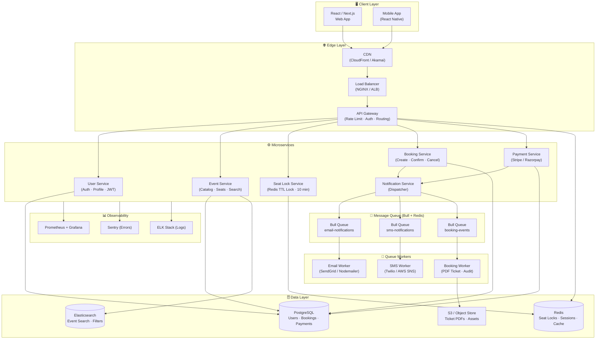
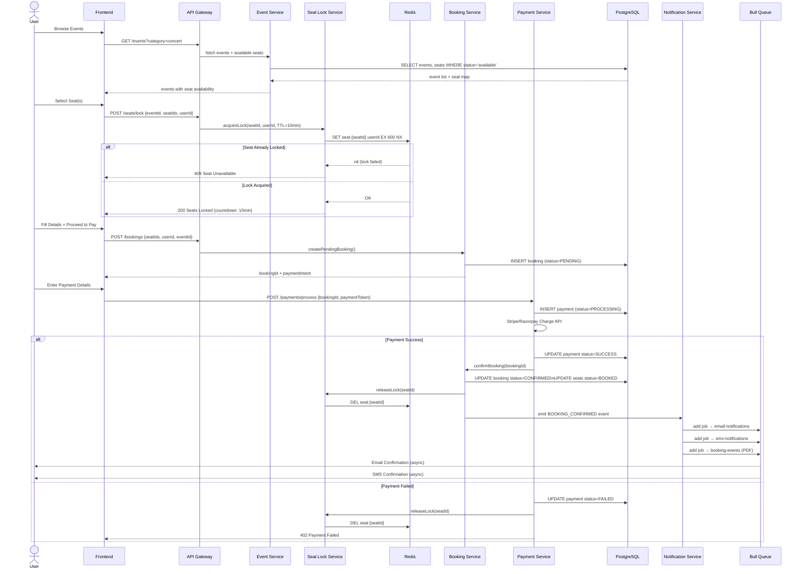
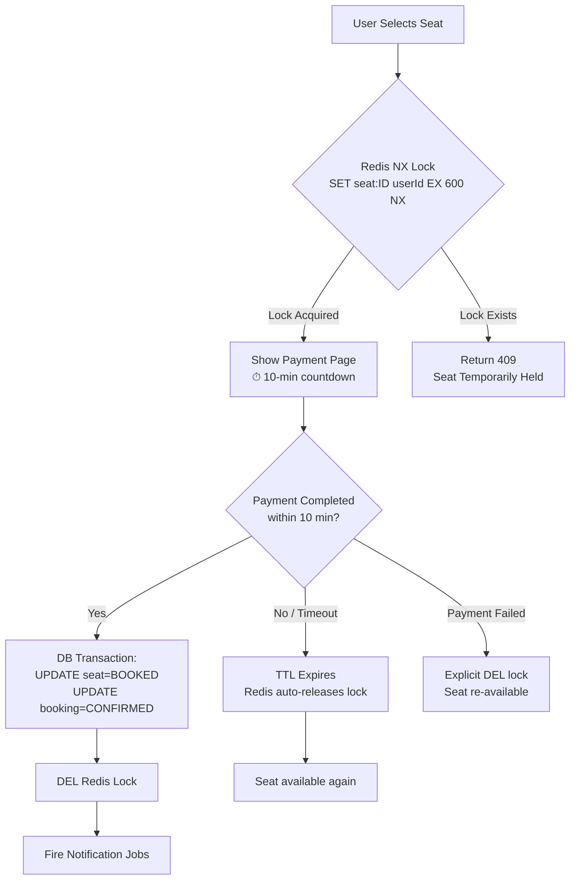
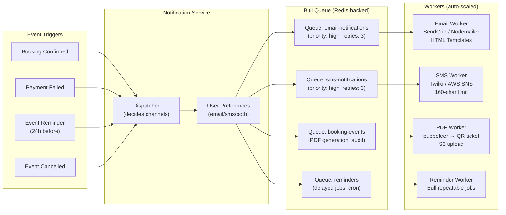
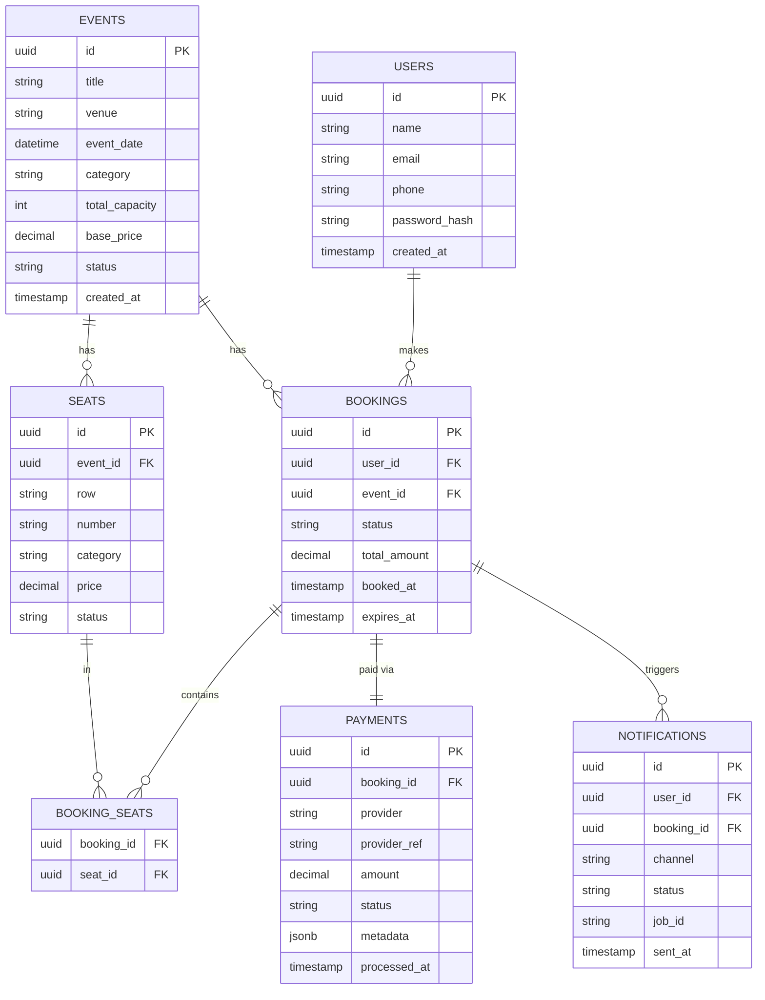
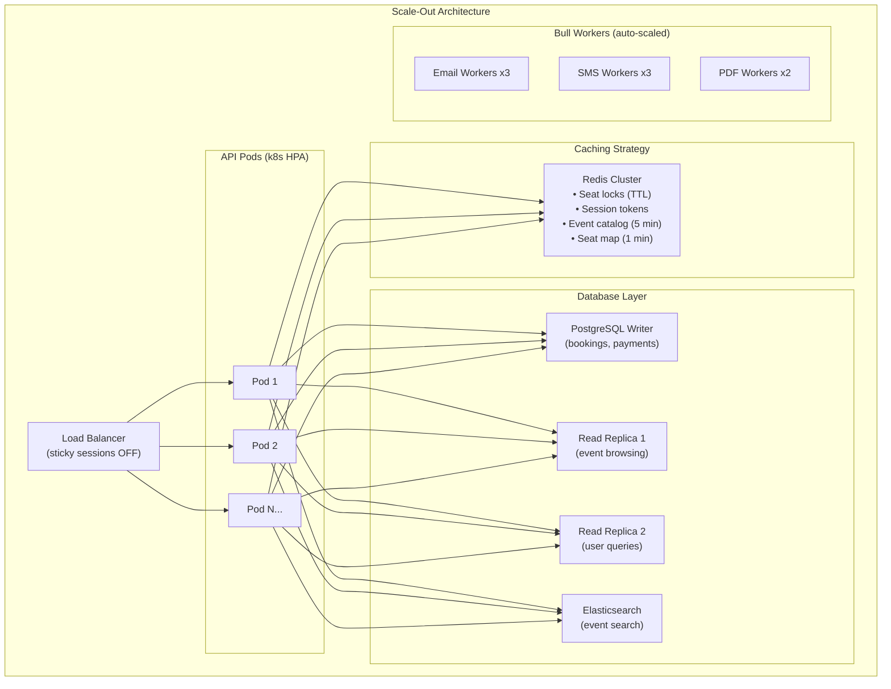
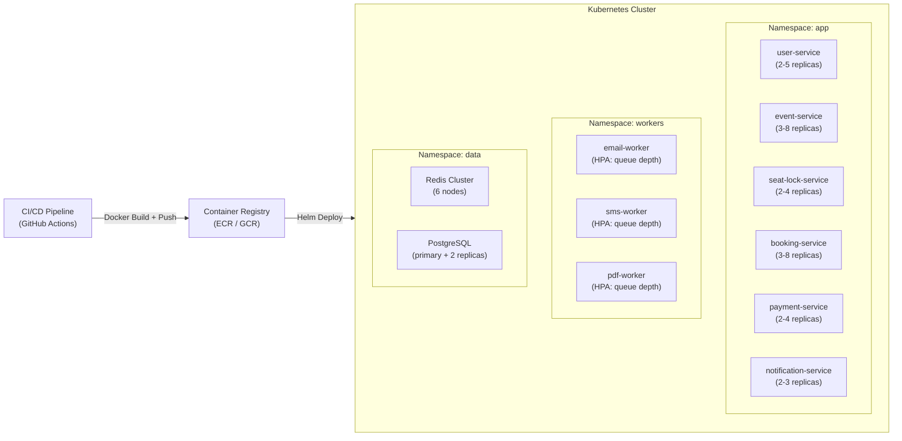

# Ticket Online Booking System — System Design

> Scale: **100K+ concurrent users** | Seat Safety: **No double booking** | Notifications: **Email · SMS · Bull Queue**

---

## 1. High-Level Component Diagram



---

## 2. Seat Booking Flow — Sequence Diagram



---

## 3. Seat Locking Strategy (No Double Booking)



### Why Redis NX (Not Exists)?
| Concern | Solution |
|---|---|
| Two users click same seat simultaneously | `SET NX` is atomic — only one wins |
| User abandons checkout | TTL auto-releases after 10 min |
| Payment fails | Explicit DEL in failure handler |
| Server crashes mid-payment | TTL still fires — no orphaned locks |
| Multiple booking service instances | Redis is shared state across all pods |

---

## 4. Notification Architecture (Bull Queue)



### Bull Queue Job Example

```javascript
// Notification Service — dispatcher.js
const Queue = require('bull');
const emailQueue = new Queue('email-notifications', { redis: redisConfig });
const smsQueue   = new Queue('sms-notifications',   { redis: redisConfig });
const bookingQueue = new Queue('booking-events',    { redis: redisConfig });

async function dispatchBookingConfirmed(booking, user) {
  const jobOpts = { attempts: 3, backoff: { type: 'exponential', delay: 2000 } };

  await emailQueue.add('booking-confirmed', {
    to: user.email,
    template: 'booking-confirmation',
    data: { name: user.name, event: booking.event, seats: booking.seats, bookingId: booking.id }
  }, jobOpts);

  await smsQueue.add('booking-confirmed', {
    to: user.phone,
    message: `Booking confirmed! ${booking.event.name} on ${booking.event.date}. Seats: ${booking.seats.join(',')}. ID: ${booking.id}`
  }, jobOpts);

  await bookingQueue.add('generate-ticket', {
    bookingId: booking.id,
    userId: user.id
  }, { ...jobOpts, priority: 2 });
}

// Email Worker
emailQueue.process('booking-confirmed', async (job) => {
  const { to, template, data } = job.data;
  await sendgrid.send({ to, subject: 'Booking Confirmed!', templateId: templates[template], dynamicTemplateData: data });
});

// SMS Worker
smsQueue.process('booking-confirmed', async (job) => {
  const { to, message } = job.data;
  await twilio.messages.create({ body: message, from: process.env.TWILIO_FROM, to });
});
```

---

## 5. Database Schema



---

## 6. Scalability Strategy (100K+ Users)



### Key Scaling Decisions

| Concern | Decision |
|---|---|
| **100K concurrent users** | Horizontal pod scaling (k8s HPA), Redis cluster |
| **Event browsing spikes** | Cache event catalog in Redis (5 min TTL), CDN for static |
| **Seat map reads** | Redis cache with 1-min TTL + cache-aside pattern |
| **Payment throughput** | Async payment confirmation via webhooks |
| **Notification backlog** | Bull Queue with multiple workers, priority lanes |
| **Search performance** | Elasticsearch for full-text event search |
| **DB write bottleneck** | Connection pooling (PgBouncer), write to primary only |
| **Flash sales / major events** | Queue-based seat selection (virtual waiting room) |

---

## 7. API Contract (REST)

```
# Event Browsing
GET  /api/v1/events                    # list with filters (category, date, city)
GET  /api/v1/events/:id                # event detail + venue map
GET  /api/v1/events/:id/seats          # real-time seat availability

# Seat Locking
POST /api/v1/seats/lock                # { eventId, seatIds[] } → 10-min lock
DELETE /api/v1/seats/lock/:lockId      # release early

# Booking
POST /api/v1/bookings                  # create pending booking
GET  /api/v1/bookings/:id              # booking status
GET  /api/v1/bookings/user/me          # user's booking history

# Payments
POST /api/v1/payments/initiate         # get paymentIntent / order
POST /api/v1/payments/webhook          # Stripe/Razorpay webhook callback
POST /api/v1/payments/refund           # initiate refund

# Notifications
GET  /api/v1/notifications/preferences # get user prefs
PUT  /api/v1/notifications/preferences # update email/sms opt-in
```

---

## 8. Tech Stack Summary

| Layer | Technology | Why |
|---|---|---|
| Frontend | React / Next.js | SSR for SEO, fast seat map rendering |
| API Gateway | Kong / NGINX | Rate limiting, JWT auth, routing |
| Services | Node.js (Express/Fastify) | Non-blocking I/O, JS ecosystem |
| Seat Lock | Redis `SET NX EX` | Atomic, fast, TTL-based auto-release |
| Primary DB | PostgreSQL | ACID transactions for bookings/payments |
| Search | Elasticsearch | Full-text event search, geo queries |
| Message Queue | Bull (Redis-backed) | Reliable jobs, retries, priority, delay |
| Email | SendGrid / Nodemailer | Templates, delivery analytics |
| SMS | Twilio / AWS SNS | Global reach, delivery receipts |
| PDF Tickets | Puppeteer + S3 | QR code, barcode generation |
| Container | Docker + Kubernetes | Auto-scaling, rolling deploys |
| Monitoring | Prometheus + Grafana | Queue depth, latency, error rate |
| Tracing | Jaeger / OpenTelemetry | Trace booking flow end-to-end |

---

## 9. Critical Edge Cases

```
┌─────────────────────────────────────────────────────────────────────┐
│  EDGE CASE                  │  SOLUTION                             │
├─────────────────────────────┼───────────────────────────────────────┤
│  Two users lock same seat   │  Redis SET NX — atomic, only one wins │
│  Payment gateway timeout    │  Idempotency key, webhook retry       │
│  User closes tab mid-pay    │  TTL auto-releases lock in 10 min     │
│  Webhook fires twice        │  Idempotency check on booking status  │
│  Event suddenly cancelled   │  Batch refund job, notify via Bull    │
│  Flash sale (10K req/sec)   │  Virtual queue, rate-limit per user   │
│  Overselling (race cond.)   │  DB constraint: UNIQUE(event, seat)   │
│  Bull worker crashes        │  Bull auto-retries with backoff       │
│  Redis goes down            │  Fallback: DB row-level seat lock     │
└─────────────────────────────────────────────────────────────────────┘
```

---

## 10. Deployment Architecture


