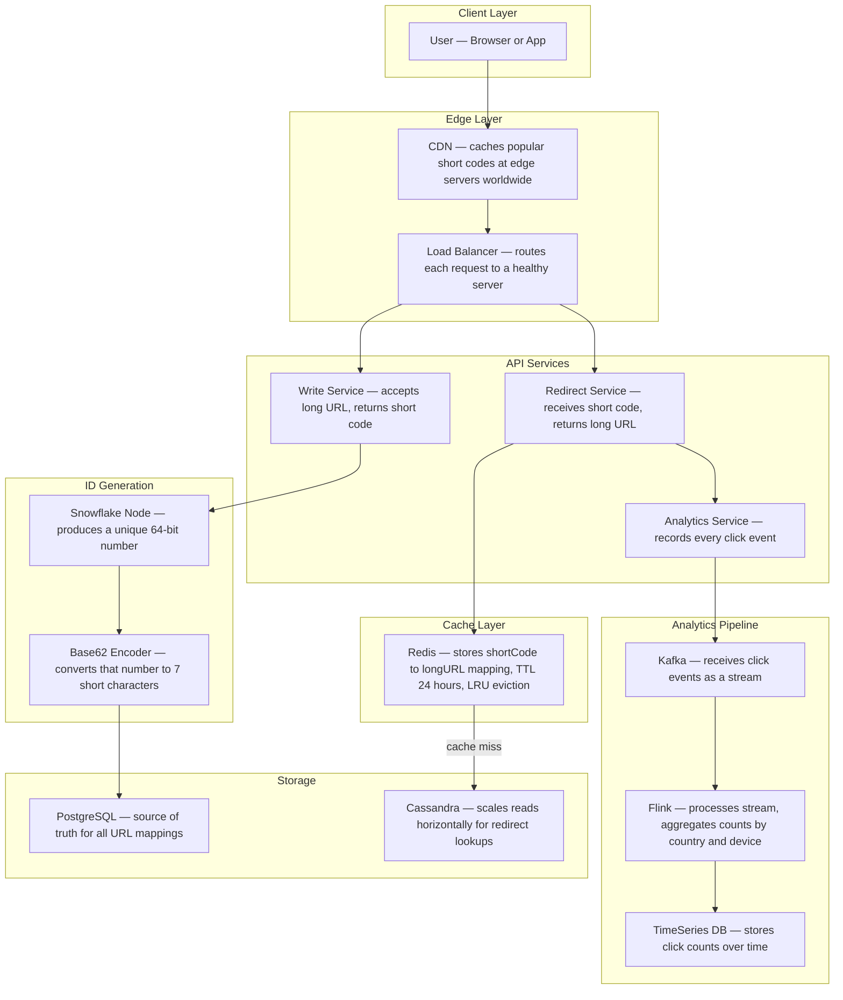
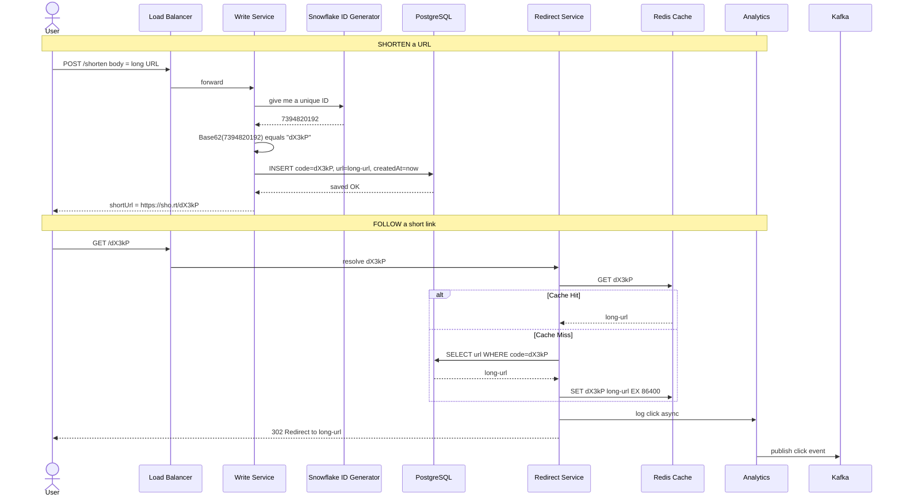
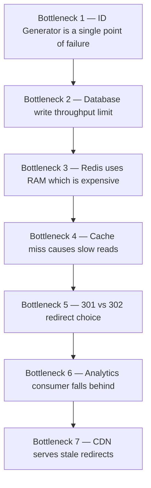
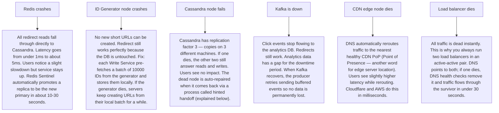

# Pattern 01 — URL Shortener (like Bit.ly / TinyURL)

---

## ELI5 — What Is This?

> Imagine you have a super long book title and you want to write it on a tiny sticky note.
> Instead of the whole thing, you write a secret code like **"ABC123"**.
> You keep a notebook: "ABC123 = the super long book title".
> When someone gives you the code, you look it up and return the real name.
> That is all a URL shortener does — trade a long web address for a tiny code.

---

## Glossary (Every Keyword Explained in ELI5)

| Word | ELI5 Meaning |
|---|---|
| **Base62** | A counting system using 62 characters (0-9, a-z, A-Z) instead of 10. Like how decimal counts 0-9 then rolls to 10, Base62 counts 0-9 then a-z then A-Z. Lets you make very short codes for very big numbers. |
| **Snowflake ID** | A factory that stamps every item with a unique number that never repeats, even across thousands of factories running at the same time. Twitter invented this. |
| **CDN (Content Delivery Network)** | A network of mini-warehouses spread across the world. Instead of everyone flying to HQ to pick up a package, the package is already at your nearest warehouse. |
| **Load Balancer** | A traffic cop at an intersection. It directs each car (request) to whichever road (server) has the least traffic. |
| **Redis** | A super-fast sticky-note board kept entirely in your computer's RAM. Looking something up is nearly instant, like checking a sticky note vs searching a filing cabinet. |
| **Cassandra** | A filing cabinet that makes copies of itself across many rooms so if one room burns down, you still have all your files. Great for reading lots of data quickly. |
| **Kafka** | A conveyor belt in a factory. Things are placed on the belt; workers pick them up at their own pace. Nothing falls off even if a worker is slow. |
| **Cache Hit / Miss** | Cache hit = the sticky note is already on the board, answer instant. Cache miss = sticky note not there, must search the filing cabinet. |
| **LRU (Least Recently Used)** | A sticky-note board that throws away the note you looked at least recently when space runs out. Like cleaning your desk — toss what you haven't touched in a while. |
| **Analytics** | Counting and studying behaviour — how many times was a link clicked, from which country, on which device. |
| **Partition** | Dividing a big filing cabinet into sections by letter so you can go directly to section "C" instead of searching the whole thing. |

---

## Component Diagram

---

## Step-by-Step Request Flow

---

## Bottlenecks — Every Point Explained

| # | Bottleneck | Why It Hurts | Fix |
|---|---|---|---|
| 1 | **ID Generator — single server** | If this one server dies, no new short URLs can be created. Like a stamp machine breaking in a passport office — everyone waits. | Run multiple Snowflake worker nodes, each with a unique worker-ID. Even if one dies, others keep stamping. |
| 2 | **DB write throughput** | Every shorten request writes one row. At 10,000 shortens per second that is 10,000 disk writes per second. Disks get slow. | Partition the DB by hash of the short code. Each partition is a separate physical disk, sharing the load. |
| 3 | **Redis RAM limit** | RAM is 10x more expensive than disk. You can't store billions of URLs in Redis. | Store only the **hot** URLs (top 20% that get 80% of clicks). Set TTL so cold ones expire and leave. |
| 4 | **Cache miss latency spike** | On a miss, you must read from Cassandra (~5ms). At millions of requests per second, many misses cause a spike. | Pre-warm the cache on startup with most-clicked URLs. |
| 5 | **301 vs 302** | 301 = "permanently moved" — browsers remember it forever and stop hitting your server. Analytics breaks. 302 = "temporarily moved" — browser always asks your server. Analytics works but more load. | Use **302** for analytics. Only use 301 if you want to reduce server load and don't care about tracking. |
| 6 | **Kafka consumer lag** | If Flink processes events slower than Kafka receives them, a backlog grows. Like a checkout queue getting longer and longer. | Scale Flink workers. Ensure the number of Flink threads equals the number of Kafka topic partitions. |
| 7 | **CDN stale redirect** | If a URL is changed or deleted, the CDN edge might serve the old destination for hours. | Set a short CDN TTL (60 seconds) for redirect responses, or use the CDN's purge API to instantly evict the old entry. |

---

## What Happens When Each Part Fails?

### ELI5: Hinted Handoff
> When a Cassandra node is down and a write comes in, the other nodes say "we'll hold onto this write as a hint — like leaving a sticky note on your desk — and deliver it to the sick node as soon as it wakes up". That way nothing is permanently lost.

---

## Key Numbers to Know

| Metric | Value |
|---|---|
| Short code length | 7 chars in Base62 = 62^7 = 3.5 trillion unique codes |
| Read/write ratio | ~100:1 (people click links more than they create them) |
| Target redirect latency | Under 10ms |
| Cache hit rate target | 95%+ |
| Storage per URL row | ~500 bytes |
| 10 years of data at 100M URLs/year | ~500 GB |

---

## How All Components Work Together (The Full Story)

Think of the URL shortener as a post office with two desks and a smart notice board.

**When you create a short link:**
1. You walk in and hand your long address to the **Write Service** (desk 1). It asks the **Snowflake ID Generator** for a unique ticket number — like a token machine at a deli counter that never gives the same number twice, even if two machines run side by side.
2. The ticket number is converted to a short 7-character code by the **Base62 Encoder** — this is just math that turns a big number into a compact symbol.
3. The **Write Service** writes `shortCode → longURL` into **PostgreSQL** (the filing cabinet of truth) and is done. The creation path does NOT touch Redis at all — there is no point caching something that has never been read yet.

**When someone clicks a short link:**
1. The request first hits the **CDN** — a network of local warehouses worldwide. If the short code was clicked recently anywhere near you, the CDN already knows the destination and answers in under 5ms without your request ever reaching the main servers.
2. On a CDN miss, the **Load Balancer** directs the request to a **Redirect Service** node.
3. The Redirect Service checks **Redis** first. Redis stores `shortCode → longURL` in RAM — lookup is under 1ms.
4. On a Redis miss (the code is obscure or Redis just restarted), the Redirect Service reads **Cassandra** — a database designed for millions of fast reads per second.
5. The long URL is returned, **Redis is populated for next time**, and the click is logged **asynchronously** to the **Analytics Service** → **Kafka** → **Flink** → **TimeSeries DB**. Asynchronous means the user gets the redirect immediately — the analytics logging does not slow them down.

**How the components support each other:**
- The CDN protects Redirect Service from load spikes.
- Redis protects Cassandra from repeat reads.
- Kafka decouples analytics so a slow analytics pipeline cannot freeze the redirect path.
- Snowflake ensures Write Service nodes never produce duplicate codes even when running in parallel.
- PostgreSQL is the gold copy; Cassandra handles the read scale for redirects.

> **ELI5 Summary:** The CDN is the fast local shop. Redis is the shop's cash register memory. Cassandra is the stock room. PostgreSQL is the head office ledger. Kafka is the delivery van that carries click reports to the analytics team without blocking the shop.

---

## Key Trade-offs

| Decision | Option A | Option B | Why We Pick B (or A) |
|---|---|---|---|
| **301 vs 302 redirect** | 301 Permanent — browser caches forever, zero server load after first visit | 302 Temporary — browser always asks your server, analytics always recorded | **Pick 302** if you need analytics. Pick 301 only if you want to save server load and do not care about tracking clicks. |
| **Pre-computed vs on-the-fly ID** | Generate ID at request time using Snowflake (on-the-fly) | Pre-generate millions of IDs in a batch and hand them out from a pool | **On-the-fly Snowflake** is simpler and safe; pre-generated pools are faster but require complex state management. |
| **Single DB vs dual (PG + Cassandra)** | Just use PostgreSQL for everything | Write to PostgreSQL, read at scale from Cassandra | **Dual** only makes sense at extreme read scale. For most systems PostgreSQL alone is fine. Cassandra adds operational complexity. |
| **Expiring short codes vs permanent** | Codes never expire — simplest | Codes expire after N days — saves storage, cleans up spam links | **Expiry** is better for spam control and storage. Trade-off: legitimate users lose links they shared. Use long TTLs (1–2 years) + user notification. |
| **Base62 vs MD5 hash** | Use a hash of the URL as the short code | Generate an independent ID (Snowflake + Base62) | **Independent ID** is better: hash-based codes are deterministic (same long URL = same short code) which seems good but causes problems — two users shortening the same URL share a code, losing per-user analytics. |
| **Custom alias support** | Only auto-generated codes | Allow users to choose e.g. `sho.rt/my-brand` | **Custom aliases** increase value but create race conditions (two users want the same alias). Use database unique constraint + optimistic retry. |

---

## Important Cross Questions

**Q1. How do you guarantee zero duplicate short codes across 100 Write Service nodes running in parallel?**
> Each Snowflake node has a unique `worker_id` (a number 0–1023 assigned at startup). The Snowflake formula is `timestamp_bits | worker_id_bits | sequence_bits`. Even if two nodes generate at the exact same millisecond, their `worker_id` bits differ — so the output IDs differ. The Base62 codes derived from them are therefore always unique.

**Q2. A user shortened a URL, shared it on social media, and it got 50 million clicks in an hour. How does your system handle it?**
> The CDN edge caches the `shortCode → longURL` mapping with a TTL (say 60 seconds). Of 50M clicks, ~49.9M are served by CDN edge nodes globally with zero load on your servers. The remaining ~100K misses hit Redis, which can serve ~1M ops/sec. Redirect Service and Cassandra barely notice the traffic.

**Q3. How do you handle a cache miss storm if Redis restarts and the cache is empty?**
> Two protections: (1) A pre-warm script runs on Redis startup — it reads the top 10,000 most-clicked URLs from Cassandra and loads them into Redis before the service is re-registered with the load balancer. (2) Add jitter to TTLs so entries don't expire all at the same second, preventing a synchronized miss storm later.

**Q4. Why not just use a hash of the long URL as the short code instead of Snowflake?**
> Hash collisions: two different long URLs can hash to the same code if you truncate the hash. More importantly, hashing means two users shortening the same URL get the same code, which breaks per-user analytics. Snowflake gives every operation a unique ID regardless of the input URL.

**Q5. What happens if the Snowflake generator clock drifts backwards (NTP time correction)?**
> Snowflake IDs embed a timestamp. If the clock moves backward, the generator would potentially produce a duplicate ID. Fix: the Snowflake implementation checks the current time against the last recorded time. If current < last, it waits until `current == last` before generating. Alternatively, use a logical sequence counter that monotonically increments regardless of clock.

**Q6. How would you add custom expiry per URL (some expire in 1 day, others in 1 year)?**
> Add an `expiresAt` column to PostgreSQL. On every redirect, check `expiresAt`. For Redis TTL: set TTL to `min(requested_expiry, 24_hours)` so Redis evicts the entry appropriately. A background job (`DELETE FROM urls WHERE expiresAt < NOW()`) cleans PostgreSQL nightly. Cassandra handles this natively with per-row TTL.

**Q7. How do you prevent someone from shortening malicious URLs (phishing, malware)?**
> Integrate a URL reputation API (Google Safe Browsing API) at the Write Service. Before storing, check the long URL against the blocklist. Return a 403 if flagged. Periodically re-scan existing URLs (background job) as blocklists update. For enterprise: human-review queue for newly registered domains.

---

## Real-World Apps That Use This Pattern

| Company | Product | How They Use It |
|---|---|---|
| **Bit.ly** | bit.ly | The canonical URL shortener. Exact architecture: Base62 encoding, custom vanity slugs, click analytics per link, geographic click maps, QR code generation, link expiry. Enterprise tier adds branded domains (go.yourcompany.com). |
| **Twitter / X** | t.co | Every URL tweeted — regardless of its original length — is automatically wrapped in a t.co short link. This serves two purposes: (1) enforces the character limit, (2) lets Twitter scan URLs for malicious content before the user visits. All 280-character tweets you write with a URL actually consume exactly 23 characters for any link via t.co. |
| **TinyURL** | tinyurl.com | First popular URL shortener (2002). Uses a similar Base62-over-sequential-ID approach. Pioneered the concept of custom aliases (tinyurl.com/my-alias). No analytics by default — pure redirect-only, which made it popular for privacy-conscious users. |
| **Google** | goo.gl (shutdown 2019) | Google's internal shortener, used heavily in Firebase links and Google ads tracking. Shutdown and replaced by Firebase Dynamic Links, which add platform-aware routing (same short link opens iOS app, Android app, or web depending on the device). |
| **GitHub** | git.io (shutdown 2022) | GitHub operated a shortener specifically for github.com URLs. Demonstrated the common enterprise pattern: shortener limited to a single domain's URLs, preventing use as a general-purpose phishing tool. |
| **Shopify / Klaviyo** | Email campaign links | Every link in a marketing email is wrapped in a tracking URL (via their email platform). Clicking the link hits the shortener/tracker, increments open/click metrics, then 302-redirects to the actual product page. This is the URL shortener pattern applied to email marketing analytics. |
