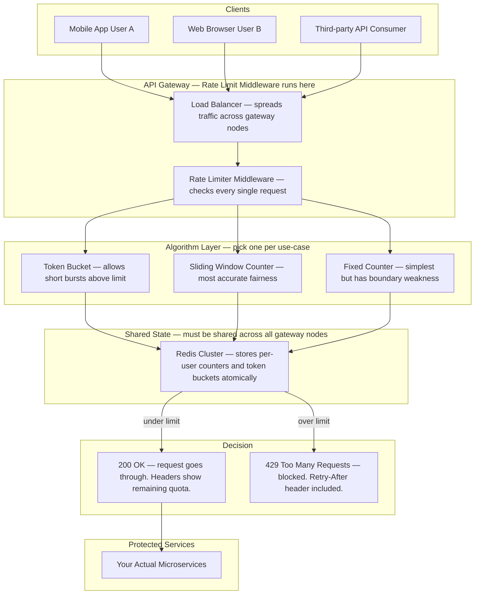
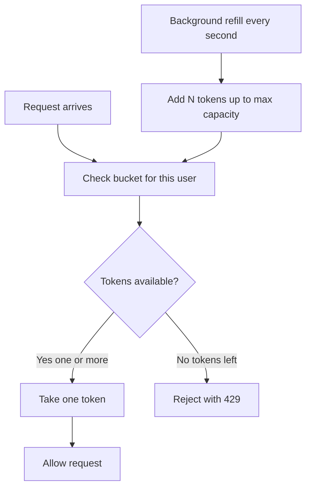
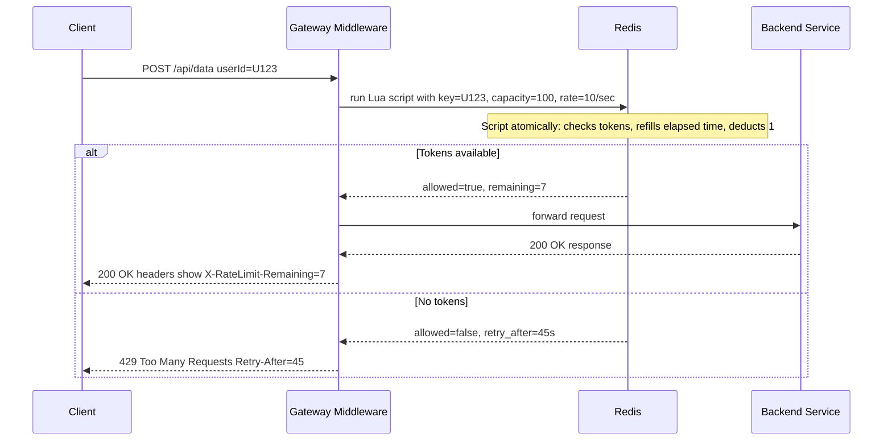
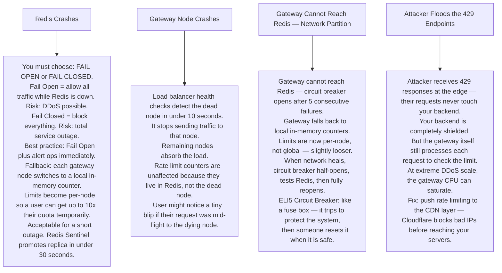

# Pattern 02 — Rate Limiter

---

## ELI5 — What Is This?

> Imagine a candy machine that gives you at most 5 candies per minute.
> Press the button a 6th time in the same minute and it says "No more — come back later!"
> A rate limiter is that candy machine for your API.
> It stops one greedy person from using all the resources and leaving nothing for everyone else.

---

## Glossary

| Word | ELI5 Meaning |
|---|---|
| **API** | A doorway into a service. When your app wants data from Twitter, it knocks on Twitter's API door. |
| **Token Bucket** | Imagine a bucket that fills with tokens (coins) at a steady rate — say 10 per second. Each request spends one coin. No coins = no entry. If you're slow, coins pile up (burst). |
| **Sliding Window** | Instead of resetting a counter every exact minute, you look at the last 60 seconds from right now rolling forward. Much fairer than a fixed cutoff. |
| **Redis Lua Script** | A tiny program sent to Redis that runs completely inside Redis in one go — no interruptions. This guarantees that checking AND updating a counter happen together "atomically" — like counting and stamping a ticket in one motion. |
| **Atomic Operation** | An action that either fully completes or fully doesn't — it can never be half-done. Like flipping a light switch — it's either fully on or fully off. |
| **429 Status Code** | HTTP's official way of saying "Too Many Requests — slow down". |
| **Retry-After header** | A hint the server sends back saying "try again in 45 seconds". |
| **Circuit Breaker** | An automatic switch that trips when too many errors happen, stopping your app from hammering a broken service. Like a fuse in your home's electrical box. |
| **DDoS** | Distributed Denial of Service — thousands of computers all flooding one server with fake requests to overwhelm it. Rate limiting is one defense. |

---

## Component Diagram



---

## How Token Bucket Works (ELI5)



> **ELI5:** Your bucket holds 10 tokens. Each request spends 1. The bucket refills at 2 tokens per second.
> If you fire 10 requests instantly, all go through. Then you wait 5 seconds to refill.
> This allows a healthy **burst** while still enforcing an **average** rate.

---

## Sliding Window vs Fixed Window (ELI5)

**Fixed Window Problem:**
```
Minute 1: 00:00 - 00:59  → you use 100 requests at 00:58
Minute 2: 01:00 - 01:59  → you use 100 requests at 01:01
Result: 200 requests in 3 seconds — defeats the purpose!
```

**Sliding Window Fix:**
```
"Last 60 seconds from right now" always counts your 100.
At 01:01 you look back to 00:01 — those 100 requests still count.
Fair. No boundary exploit.
```

---

## Request Flow



---

## Bottlenecks — Every Point Explained

| # | Bottleneck | Why It Hurts | Fix |
|---|---|---|---|
| 1 | **Redis is hit on every request** | At 500,000 requests/second, Redis must handle 500,000 operations/second. Single Redis node tops out around 1 million ops/sec but with overhead it can saturate. | Redis Cluster shards keys by user-ID across many nodes. Each node only handles a fraction of traffic. |
| 2 | **Network round-trip to Redis** | Every request needs to travel to Redis and back — typically 1ms. At extreme scale that 1ms adds up and increases API latency. | Keep an **in-memory local counter** per gateway node, sync to Redis every 100ms. Accept slight inaccuracy in exchange for speed. |
| 3 | **Lua script blocks Redis** | Redis runs Lua scripts on its single thread. A slow or infinite Lua script blocks ALL other Redis commands. | Keep Lua scripts under 1ms. Set `lua-time-limit 5000` in redis.conf to kill runaway scripts. |
| 4 | **No shared state = per-node limits** | 10 gateway nodes each check their own counter. User can send 100 requests to each node = 1000 real requests. | Use Redis as the **single shared counter** for all nodes. |
| 5 | **IP spoofing bypasses IP-based limits** | Attacker fakes source IPs, each fake IP gets its own 100 requests. | Layer your limits: IP-based + user-ID-based + API-key-based. |

---

## What Happens When Each Part Fails?



---

## Rate Limit Types Reference

| Type | Key Used | Use Case |
|---|---|---|
| Per User | userId | API fairness across accounts |
| Per IP Address | clientIP | DDoS and abuse prevention |
| Per API Key | apiKey | Third-party billing tiers |
| Per Endpoint | userId + path | Protect expensive operations like search |
| Global Service | service name | Protect a single backend from overload |
