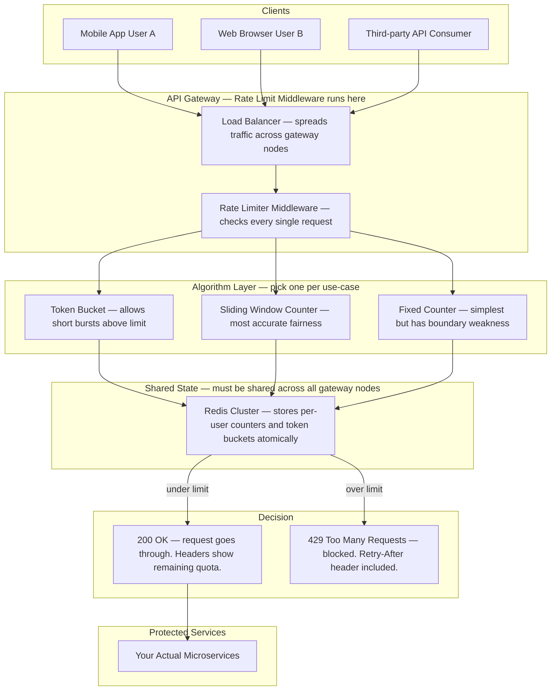
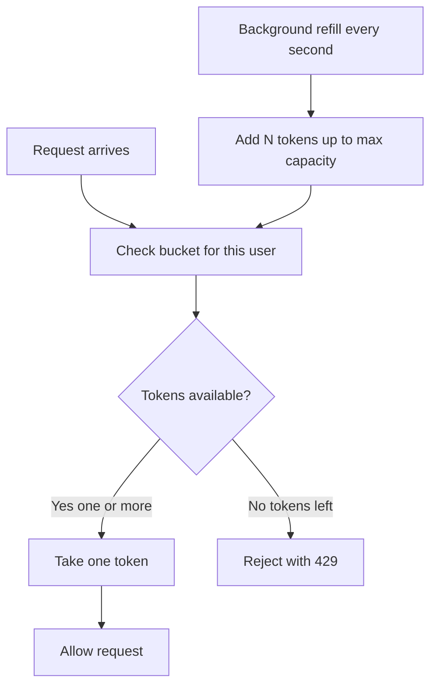
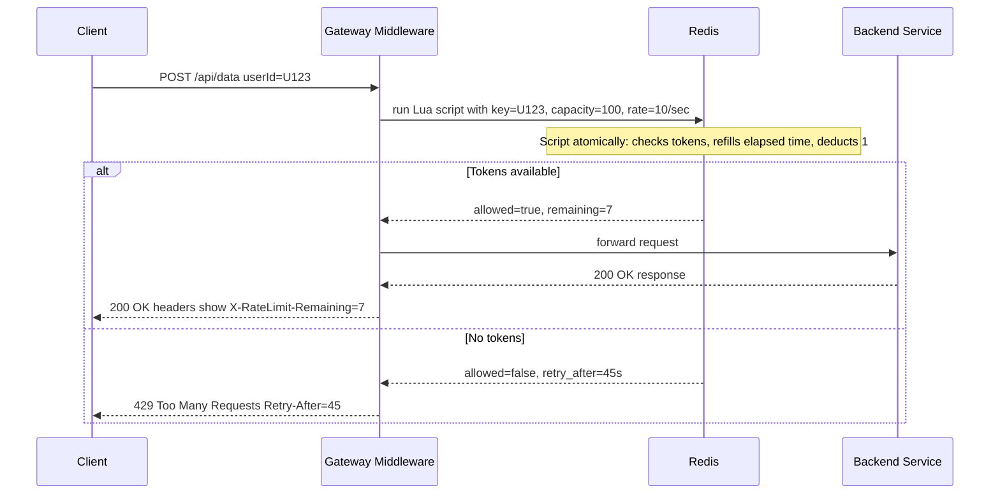
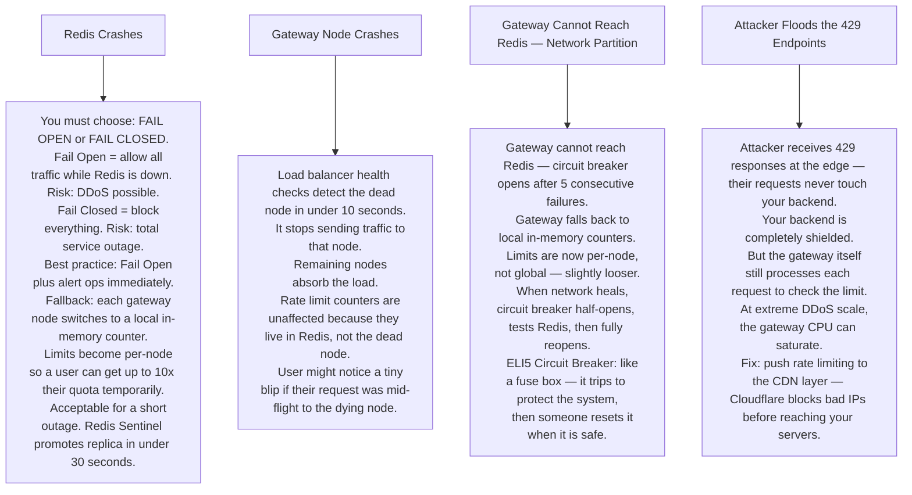

# Pattern 02 — Rate Limiter

---

## ELI5 — What Is This?

> Imagine a candy machine that gives you at most 5 candies per minute.
> Press the button a 6th time in the same minute and it says "No more — come back later!"
> A rate limiter is that candy machine for your API.
> It stops one greedy person from using all the resources and leaving nothing for everyone else.

---

## Glossary

| Word | ELI5 Meaning |
|---|---|
| **API** | A doorway into a service. When your app wants data from Twitter, it knocks on Twitter's API door. |
| **Token Bucket** | Imagine a bucket that fills with tokens (coins) at a steady rate — say 10 per second. Each request spends one coin. No coins = no entry. If you're slow, coins pile up (burst). |
| **Sliding Window** | Instead of resetting a counter every exact minute, you look at the last 60 seconds from right now rolling forward. Much fairer than a fixed cutoff. |
| **Redis Lua Script** | A tiny program sent to Redis that runs completely inside Redis in one go — no interruptions. This guarantees that checking AND updating a counter happen together "atomically" — like counting and stamping a ticket in one motion. |
| **Atomic Operation** | An action that either fully completes or fully doesn't — it can never be half-done. Like flipping a light switch — it's either fully on or fully off. |
| **429 Status Code** | HTTP's official way of saying "Too Many Requests — slow down". |
| **Retry-After header** | A hint the server sends back saying "try again in 45 seconds". |
| **Circuit Breaker** | An automatic switch that trips when too many errors happen, stopping your app from hammering a broken service. Like a fuse in your home's electrical box. |
| **DDoS** | Distributed Denial of Service — thousands of computers all flooding one server with fake requests to overwhelm it. Rate limiting is one defense. |

---

## Component Diagram



---

## How Token Bucket Works (ELI5)



> **ELI5:** Your bucket holds 10 tokens. Each request spends 1. The bucket refills at 2 tokens per second.
> If you fire 10 requests instantly, all go through. Then you wait 5 seconds to refill.
> This allows a healthy **burst** while still enforcing an **average** rate.

---

## Sliding Window vs Fixed Window (ELI5)

**Fixed Window Problem:**
```
Minute 1: 00:00 - 00:59  → you use 100 requests at 00:58
Minute 2: 01:00 - 01:59  → you use 100 requests at 01:01
Result: 200 requests in 3 seconds — defeats the purpose!
```

**Sliding Window Fix:**
```
"Last 60 seconds from right now" always counts your 100.
At 01:01 you look back to 00:01 — those 100 requests still count.
Fair. No boundary exploit.
```

---

## Request Flow



---

## Bottlenecks — Every Point Explained

| # | Bottleneck | Why It Hurts | Fix |
|---|---|---|---|
| 1 | **Redis is hit on every request** | At 500,000 requests/second, Redis must handle 500,000 operations/second. Single Redis node tops out around 1 million ops/sec but with overhead it can saturate. | Redis Cluster shards keys by user-ID across many nodes. Each node only handles a fraction of traffic. |
| 2 | **Network round-trip to Redis** | Every request needs to travel to Redis and back — typically 1ms. At extreme scale that 1ms adds up and increases API latency. | Keep an **in-memory local counter** per gateway node, sync to Redis every 100ms. Accept slight inaccuracy in exchange for speed. |
| 3 | **Lua script blocks Redis** | Redis runs Lua scripts on its single thread. A slow or infinite Lua script blocks ALL other Redis commands. | Keep Lua scripts under 1ms. Set `lua-time-limit 5000` in redis.conf to kill runaway scripts. |
| 4 | **No shared state = per-node limits** | 10 gateway nodes each check their own counter. User can send 100 requests to each node = 1000 real requests. | Use Redis as the **single shared counter** for all nodes. |
| 5 | **IP spoofing bypasses IP-based limits** | Attacker fakes source IPs, each fake IP gets its own 100 requests. | Layer your limits: IP-based + user-ID-based + API-key-based. |

---

## What Happens When Each Part Fails?



---

## Rate Limit Types Reference

| Type | Key Used | Use Case |
|---|---|---|
| Per User | userId | API fairness across accounts |
| Per IP Address | clientIP | DDoS and abuse prevention |
| Per API Key | apiKey | Third-party billing tiers |
| Per Endpoint | userId + path | Protect expensive operations like search |
| Global Service | service name | Protect a single backend from overload |

---

## How All Components Work Together (The Full Story)

Picture a nightclub with a single bouncer at the door.

**Every request that arrives:**
1. The **Load Balancer** directs the request to one of many **Gateway Middleware** nodes — these are lightweight, stateless checkpoints.
2. The middleware extracts the identity of the caller (userId, IP, or API key) and decides which **algorithm** to apply — Token Bucket, Sliding Window, or Fixed Counter. The algorithm choice is configuration; the middleware doesn't hard-code it.
3. The middleware runs a **Lua script on Redis**. This script reads the current counter or token bucket for that identity key, checks if the limit is exceeded, and either approves or rejects — all in one atomic Redis operation. No other Redis command can sneak in between the read and the write.
4. If approved: the request is forwarded to the **backend service**, which never even sees the rate-limiting machinery.
5. If rejected: the middleware immediately returns a **429 response** with a `Retry-After` header telling the client when to try again. The backend is shielded.

**How the components support each other:**
- **Redis** is the shared brain. Without it, each gateway node would count independently and a user could multiply their quota by the number of nodes.
- **Lua script atomicity** prevents the race condition where two simultaneous requests both read "quota remaining = 1" and both get approved.
- The **Load Balancer** ensures that even if one gateway node crashes, traffic flows to healthy nodes where Redis still has the accurate counters.
- **Circuit Breaker** watches Redis health. If Redis is unreachable, it switches each node to an emergency local counter — limits become per-node but the service stays alive.

> **ELI5 Summary:** Redis is the score keeper. The Lua script is the rule enforcer that checks the score and updates it at the same time. The gateway is the bouncer. The load balancer is the manager who assigns which bouncer handles each guest. The circuit breaker is the fire alarm that switches to a backup plan when the scoreboard breaks.

---

## Key Trade-offs

| Decision | Option A | Option B | Why We Pick B (or A) |
|---|---|---|---|
| **Token Bucket vs Sliding Window** | Token Bucket — allows short bursts above average rate | Sliding Window — strictly fair, no boundary exploitation | **Token Bucket** for APIs where legitimate clients occasionally burst (mobile retry after offline). **Sliding Window** for strict billing tiers where every extra request costs the customer. |
| **Centralized Redis counter vs local counter** | Centralized Redis — accurate global count | Local per-node counter — faster, no network hop | **Centralized** for correctness. Local only as a fallback. A user with 10 gateway nodes could get 10× their quota if counters are local. |
| **Fail-open vs fail-closed on Redis outage** | Fail-open — allow all traffic when Redis is down | Fail-closed — block all traffic when Redis is down | **Fail-open** is usually right: a brief Redis outage causing degraded rate limiting is better than blocking all users. But for security-critical endpoints (login, payment) use fail-closed. |
| **Per-IP vs per-user limiting** | Limit by IP address — simple, no auth needed | Limit by authenticated userId | **Both together**: IP limiting blocks bots early (before auth), userId limiting enforces business rules fairly. IP alone fails because one IP can NAT many users. |
| **Hard limit vs soft limit with warning** | Hard 429 when limit exceeded | Warning headers when approaching limit, hard 429 at limit | **Warning headers** (`X-RateLimit-Remaining`) let good-faith clients back off gracefully. Hard limit alone surprises clients and causes aggressive retries. |
| **Global rate limit vs per-endpoint** | Single limit for all API calls | Different limits per endpoint | **Per-endpoint** is realistic: `POST /search` is expensive, `GET /profile` is cheap. Applying the same limit to both either wastes protective capacity or blocks cheap calls unnecessarily. |

---

## Important Cross Questions

**Q1. Two requests from the same user arrive at the gateway at exactly the same millisecond. Both check the counter, both see "1 token left", both proceed. How do you prevent this race condition?**
> The Redis Lua script makes check-and-decrement atomic. Redis is single-threaded in its command execution. Even if two gateway nodes call the script simultaneously, Redis executes one Lua script to completion before starting the next. The second script sees the counter already decremented and returns "denied".

**Q2. What is the difference between rate limiting at the API Gateway vs inside each microservice?**
> Gateway-level: one place to configure, enforced before any service code runs, protects all services uniformly. Service-level: each service can apply fine-grained domain-specific limits (e.g. only 2 concurrent video encodes per account). Best practice: **both**. Gateway handles global abuse prevention; services handle resource-specific limits.

**Q3. A user has 10 machines behind one NAT IP. Your IP-based rate limit blocks all 10 machines when one misbehaves. How do you fix this?**
> Add **user-agent fingerprinting** or require authenticated tokens for limits. For public unauthenticated endpoints: increase the per-IP limit and add per-user-agent subdivisions. For corporate clients (all behind one IP) offer API keys so each key gets its own quota.

**Q4. How would you implement a "burst of 100 requests in the first second, then only 10 per second thereafter" rule?**
> Token Bucket with capacity = 100 and refill rate = 10 tokens per second. On a fresh bucket you have 100 tokens — burn them all instantly. The bucket then refills at 10 per second — so you get exactly 10 RPS after the burst. Fixed or sliding windows cannot naturally express this burst concept.

**Q5. How do you rate-limit a streaming WebSocket connection where messages are continuous?**
> Rate limit the number of **messages per second** per connection rather than HTTP requests. Use a per-connection in-memory token bucket on the WebSocket server (no Redis hop needed since each server owns its connections). If a connection exceeds the message rate, the server either drops excess messages or sends a CLOSE frame.

**Q6. A DDoS attack sends 10 million requests per second from 1 million different IPs. Does your rate limiter help?**
> Standard per-IP or per-user rate limiting barely touches this — each fake IP only sends 10 RPS which might be under the limit. Fix: **global rate limiting at the CDN layer** (Cloudflare, AWS WAF) which can detect and block volumetric attacks based on traffic patterns, not just per-identity counters. Your application-level rate limiter handles abuse by real users; the CDN handles volumetric DDoS.
