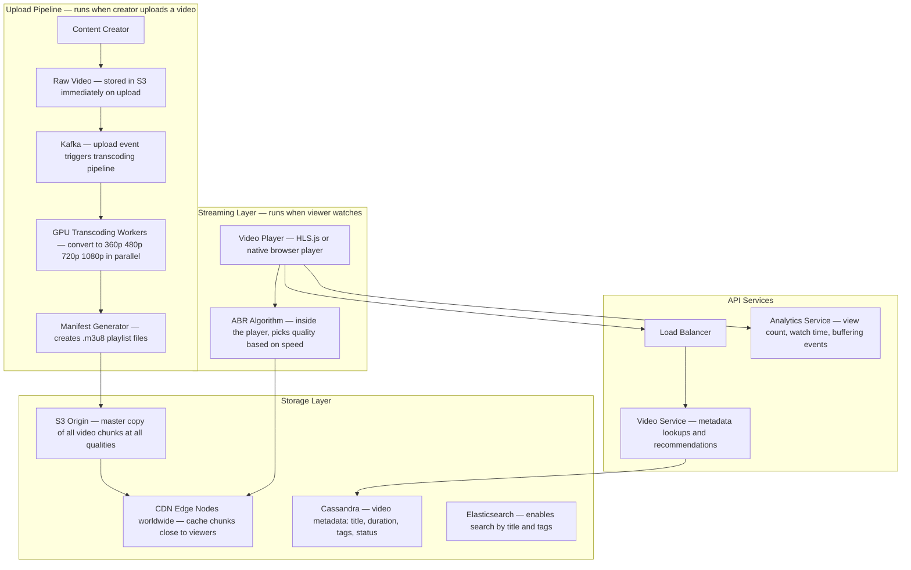
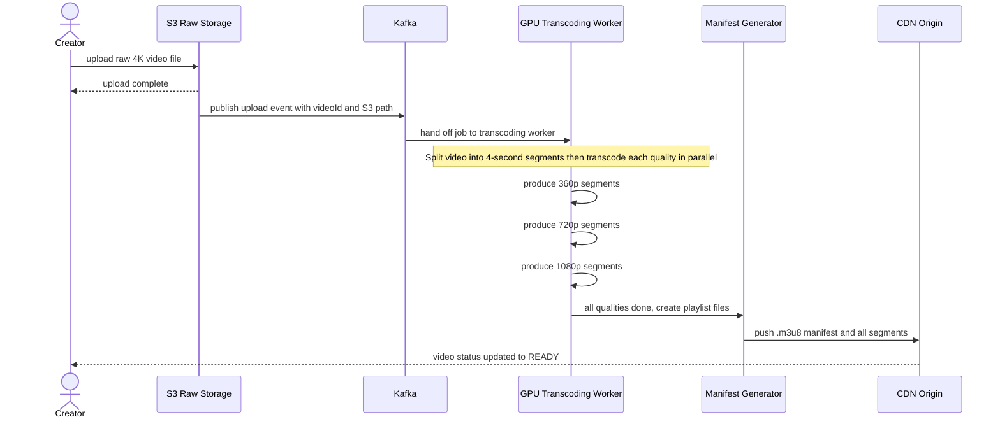
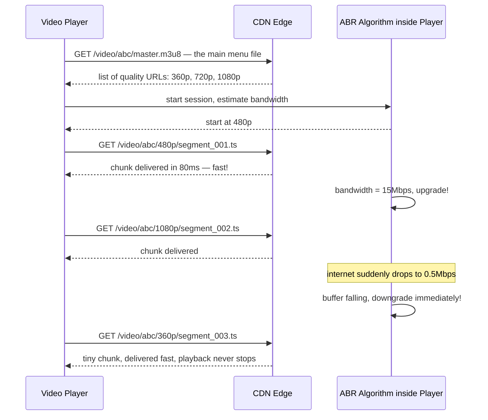
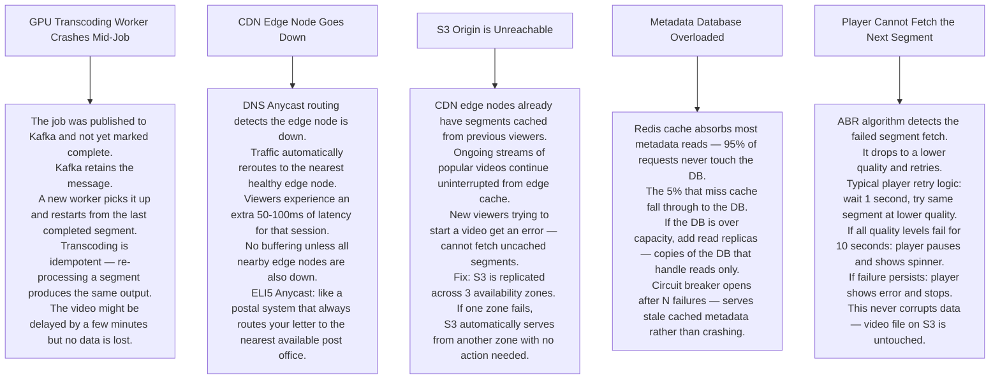

# Pattern 03 — Video Streaming (like YouTube / Netflix)

---

## ELI5 — What Is This?

> Instead of downloading the whole movie first (which takes ages), the server sends it in tiny
> pieces — chunk 1, chunk 2, chunk 3 — while you watch chunk 1, chunk 2 is already on its way.
> If your internet slows down, it automatically sends smaller, blurrier pieces so it never stops.
> That is video streaming — just-in-time delivery of bite-sized video chunks.

---

## Glossary

| Word | ELI5 Meaning |
|---|---|
| **Transcoding** | Converting one video format into many others at different sizes. Like printing the same document in large print, normal print, and tiny print so everyone can read it. |
| **HLS (HTTP Live Streaming)** | Apple's system for cutting video into small chunks and making a playlist file (.m3u8) that tells the player where each chunk is. Like a table of contents for video pieces. |
| **Segment** | One small piece of video — usually 4-6 seconds long. |
| **Adaptive Bitrate (ABR)** | The player automatically picks the quality level (1080p, 720p, 360p) that matches your internet speed. Like a tap that adjusts flow based on water pressure. |
| **CDN (Content Delivery Network)** | A network of servers placed near users worldwide. Video chunks are stored there so you download from 20km away instead of 5000km. |
| **FFmpeg** | The most popular open-source program for converting and processing video. Like a Swiss Army knife for video files. |
| **Kafka** | A conveyor belt that moves messages between services reliably without losing any. |
| **Manifest file (.m3u8)** | A text file that is like a menu listing every chunk of a video and its quality options. The player reads this first. |
| **Origin storage** | The master copy of all video chunks, typically S3. CDN edge nodes copy from here. |
| **GPU worker** | A server with a Graphics Processing Unit — GPUs can transcode video many times faster than regular CPUs because they are built for parallel math. |

---

## Component Diagram

---

## Upload and Transcoding Flow

---

## Adaptive Bitrate Playback Flow

---

## Bottlenecks — Every Point Explained

| # | Bottleneck | Why It Hurts | Fix |
|---|---|---|---|
| 1 | **Transcoding is slow** | A 1-hour 4K video can take 2+ hours to fully transcode on one machine. Creator waiting 2 hours before video is live is unacceptable. | Split video into 4-second segments first, then transcode all segments in parallel across 100 GPU workers. Total time drops to minutes. |
| 2 | **CDN cold start for new videos** | The first viewer of a just-uploaded video causes CDN edge nodes to fetch chunks from S3. This fetch is slow — 200-500ms vs 5ms when cached. | The system pre-warms popular or scheduled videos to edge nodes before they go public. |
| 3 | **Manifest file storm** | 10 million people start watching the same video at the same time (viral event). Every player requests the small .m3u8 manifest file first. 10M manifest requests hit the server. | Cache the manifest at the CDN edge with a TTL equal to the segment length (4 seconds). 10M requests → CDN handles them all. |
| 4 | **Storage cost (5 quality tiers)** | Storing 5 quality versions of every video costs 5x more than storing one. At YouTube's scale this is enormous. | Move videos watched less than once a month to cold storage (S3 Glacier — very cheap, slow to access). Keep only 720p of cold videos. |
| 5 | **View counter write storm** | A viral video gets 1 million views per minute. Writing 1M rows per minute to a database would crush it. | Buffer view counts in Redis (fast, in memory). Every 30 seconds, flush the accumulated count to the database in one write. |
| 6 | **Recommendation compute** | Personalised recommendations require ML models. Running ML in real-time per request would be too slow. | Pre-compute recommendations offline using Spark (batch processing). Store results in Redis. Serve instantly at request time. |

---

## What Happens When Each Part Fails?

---

## Key Numbers

| Metric | Value |
|---|---|
| Segment size | 4-6 seconds |
| Quality tiers | 360p, 480p, 720p, 1080p, 4K |
| CDN cache hit target | 98%+ |
| Startup latency target | Under 200ms |
| Storage per hour of video (5 qualities) | ~15 GB |
| Transcoding speedup with 100 parallel workers | ~100x faster than single worker |
