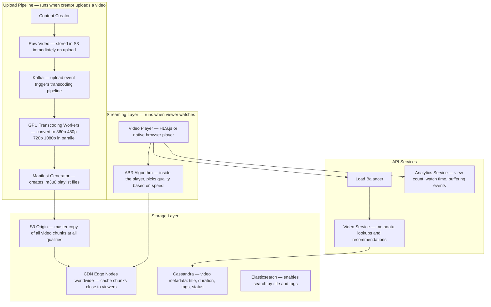
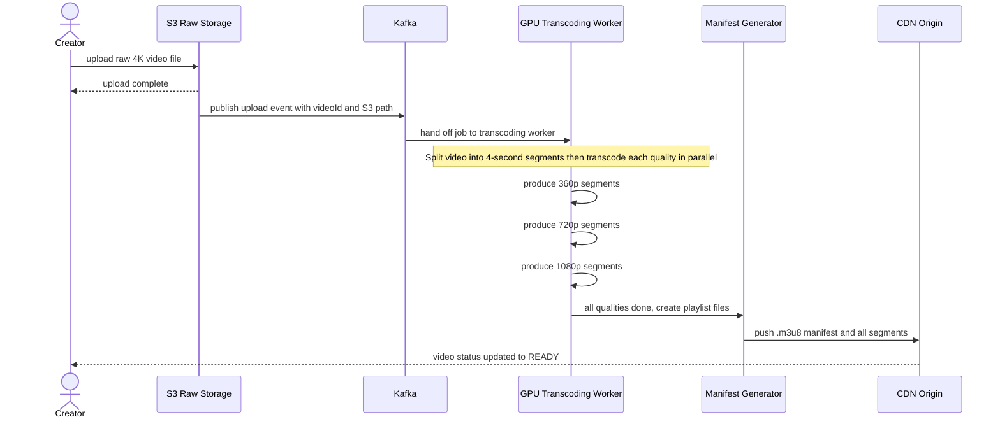
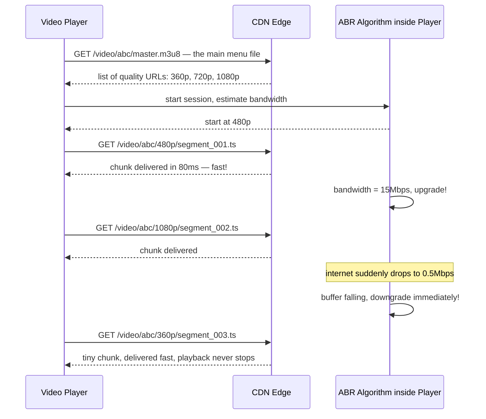
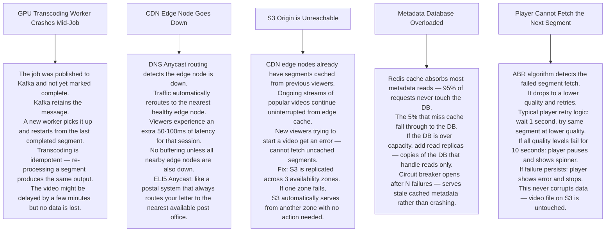

# Pattern 03 — Video Streaming (like YouTube / Netflix)

---

## ELI5 — What Is This?

> Instead of downloading the whole movie first (which takes ages), the server sends it in tiny
> pieces — chunk 1, chunk 2, chunk 3 — while you watch chunk 1, chunk 2 is already on its way.
> If your internet slows down, it automatically sends smaller, blurrier pieces so it never stops.
> That is video streaming — just-in-time delivery of bite-sized video chunks.

---

## Glossary

| Word | ELI5 Meaning |
|---|---|
| **Transcoding** | Converting one video format into many others at different sizes. Like printing the same document in large print, normal print, and tiny print so everyone can read it. |
| **HLS (HTTP Live Streaming)** | Apple's system for cutting video into small chunks and making a playlist file (.m3u8) that tells the player where each chunk is. Like a table of contents for video pieces. |
| **Segment** | One small piece of video — usually 4-6 seconds long. |
| **Adaptive Bitrate (ABR)** | The player automatically picks the quality level (1080p, 720p, 360p) that matches your internet speed. Like a tap that adjusts flow based on water pressure. |
| **CDN (Content Delivery Network)** | A network of servers placed near users worldwide. Video chunks are stored there so you download from 20km away instead of 5000km. |
| **FFmpeg** | The most popular open-source program for converting and processing video. Like a Swiss Army knife for video files. |
| **Kafka** | A conveyor belt that moves messages between services reliably without losing any. |
| **Manifest file (.m3u8)** | A text file that is like a menu listing every chunk of a video and its quality options. The player reads this first. |
| **Origin storage** | The master copy of all video chunks, typically S3. CDN edge nodes copy from here. |
| **GPU worker** | A server with a Graphics Processing Unit — GPUs can transcode video many times faster than regular CPUs because they are built for parallel math. |

---

## Component Diagram

---

## Upload and Transcoding Flow

---

## Adaptive Bitrate Playback Flow

---

## Bottlenecks — Every Point Explained

| # | Bottleneck | Why It Hurts | Fix |
|---|---|---|---|
| 1 | **Transcoding is slow** | A 1-hour 4K video can take 2+ hours to fully transcode on one machine. Creator waiting 2 hours before video is live is unacceptable. | Split video into 4-second segments first, then transcode all segments in parallel across 100 GPU workers. Total time drops to minutes. |
| 2 | **CDN cold start for new videos** | The first viewer of a just-uploaded video causes CDN edge nodes to fetch chunks from S3. This fetch is slow — 200-500ms vs 5ms when cached. | The system pre-warms popular or scheduled videos to edge nodes before they go public. |
| 3 | **Manifest file storm** | 10 million people start watching the same video at the same time (viral event). Every player requests the small .m3u8 manifest file first. 10M manifest requests hit the server. | Cache the manifest at the CDN edge with a TTL equal to the segment length (4 seconds). 10M requests → CDN handles them all. |
| 4 | **Storage cost (5 quality tiers)** | Storing 5 quality versions of every video costs 5x more than storing one. At YouTube's scale this is enormous. | Move videos watched less than once a month to cold storage (S3 Glacier — very cheap, slow to access). Keep only 720p of cold videos. |
| 5 | **View counter write storm** | A viral video gets 1 million views per minute. Writing 1M rows per minute to a database would crush it. | Buffer view counts in Redis (fast, in memory). Every 30 seconds, flush the accumulated count to the database in one write. |
| 6 | **Recommendation compute** | Personalised recommendations require ML models. Running ML in real-time per request would be too slow. | Pre-compute recommendations offline using Spark (batch processing). Store results in Redis. Serve instantly at request time. |

---

## What Happens When Each Part Fails?

---

## Key Numbers

| Metric | Value |
|---|---|
| Segment size | 4-6 seconds |
| Quality tiers | 360p, 480p, 720p, 1080p, 4K |
| CDN cache hit target | 98%+ |
| Startup latency target | Under 200ms |
| Storage per hour of video (5 qualities) | ~15 GB |
| Transcoding speedup with 100 parallel workers | ~100x faster than single worker |

---

## How All Components Work Together (The Full Story)

Think of a video streaming system as two separate pipelines that share a library — one pipeline is for the creator publishing a film to the library, and the other is for viewers renting and watching it.

**The Upload Pipeline (when a creator uploads):**
1. The raw video lands in **S3 Raw Storage** immediately — the client uploads directly; the app server only handles metadata. S3 is the safe master vault.
2. S3 fires a notification to **Kafka**. Kafka is the memo board: "video abc was just uploaded, someone please transcode it."
3. A pool of **GPU Worker** processes picks up the memo. They split the 1-hour video into 4-second segments and then each worker encodes a different quality level simultaneously — like 100 printers printing different sizes of the same poster at the same time.
4. The **Manifest Generator** assembles a master playlist file (`.m3u8`) listing every chunk at every quality, and pushes everything to the **CDN Origin (S3 permanent storage)**.
5. The video status in **Cassandra** is updated to `READY` so the Video Service can now surface it.

**The Playback Pipeline (when a viewer presses play):**
1. The player fetches the `.m3u8` manifest from the **CDN Edge** — a server physically close to the viewer. The CDN caches this tiny file.
2. The **ABR Algorithm** (inside the video player itself — no server call needed) measures download speed and picks which quality to request first.
3. The player streams 4-second `.ts` segment chunks from the **CDN Edge**. Each chunk is independent — if the internet slows, the next chunk switches to a lower quality seamlessly.
4. The **Analytics Service** passively records buffering events and watch time, publishing them to **Kafka** for Flink to aggregate into dashboards.

**How the components support each other:**
- GPU Workers and Kafka are decoupled: if all workers are busy, Kafka holds the job safely until capacity is free.
- CDN shields S3 from direct viewer access — Netflix and YouTube would be impossible to run if every viewer hit origin storage directly.
- ABR runs client-side which is crucial: it adapts to changing network without a single server round-trip.
- Redis buffers view counts so the Cassandra metadata database is not hammered by 1M concurrent writes per second for a viral video.

> **ELI5 Summary:** S3 is the master vault. GPU workers are the printers making copies in every size. CDN is the local library branch near your home. The player's ABR is the smart robot that picks the right book size based on how wide the door is. Kafka is the message board connecting the vault to the printers and to the analytics room.

---

## Key Trade-offs

| Decision | Option A | Option B | Why We Pick B (or A) |
|---|---|---|---|
| **Whole-file transcoding vs segment-based** | Transcode the entire video as one job (simpler) | Split into segments, transcode in parallel (faster) | **Segment-based** for any upload that takes more than a minute. A 4-hour film encoded as one job takes 8+ hours. Split into 3600 segments encoded in parallel: ~5 minutes. |
| **Push to CDN vs pull on demand** | Push video chunks to all CDN edges proactively | CDN pulls chunks from S3 the first time they are requested | **Pull (lazy)** for most videos (unpopular videos waste push bandwidth). **Push (proactive)** for scheduled events (Super Bowl, product launch). |
| **5 quality tiers vs 3 tiers** | Store 5 quality levels including 4K | Store only 360p, 720p, 1080p | **5 tiers** for premium platform (YouTube/Netflix). **3 tiers** for cost-sensitive platforms. Extra storage multiplier: 5× vs 3×. 4K also requires 4× more bandwidth per stream. |
| **HLS vs DASH** | HLS (Apple) — native iOS support, widespread CDN support | MPEG-DASH (adaptive, open standard) | **HLS** is the industry default for broad device support. DASH is better for low-latency live streaming. Most platforms support both and negotiate based on client. |
| **Client-side ABR vs server-side bitrate selection** | ABR algorithm runs in the player (no server needed) | Server tells client which quality to use | **Client-side ABR** scales infinitely because it is logic in each viewer's device, not on your servers. Server-side would require a persistent session per viewer. |
| **Cold storage for old videos** | Keep all quality tiers online forever | Move rarely-watched videos to cold storage (Glacier), keep only 720p hot | **Cold storage** cuts cost by 5–10× for the long tail of videos. Trade-off: first viewer of a cold video takes 5-12 hours to restore. Mitigate with pre-warming popular but cooling content. |

---

## Important Cross Questions

**Q1. A celebrity posts a video. It goes viral instantly and 10 million people start watching it simultaneously in the first minute. Walk me through what happens.**
> The manifest file (tiny, ~5KB) is cached by CDN in the first few requests. All 10M manifest fetches are served from CDN edge nodes worldwide — zero load on origin. Video segments (4-6 second chunks) are also cached at CDN after the first few viewers in each region pull them. With a 98% CDN cache hit rate, only ~200,000 unique segment fetches hit S3. S3 scales automatically. The system handles this without any intervention.

**Q2. How does the player know to switch from 1080p to 360p without pausing the video?**
> The ABR algorithm monitors the download time of each completed segment. If a 4-second segment took 3 seconds to download (close to playback speed), the buffer is shrinking. ABR requests the NEXT segment at a lower bitrate. The switch is seamless because each segment is independently playable — the player just switches quality for the next chunk, not mid-chunk.

**Q3. How do you handle a video that is uploaded while transcoding workers are all at capacity?**
> Kafka durably stores the upload event. The upload event just waits in Kafka until a GPU Worker becomes available. The creator sees "Processing... your video will be available shortly" on the platform. Kafka guarantees the event is not lost. Worker capacity auto-scales: if Kafka lag grows above a threshold, Kubernetes spins up more GPU worker pods.

**Q4. What is the difference between VOD (video on demand) and live streaming? How does the architecture change?**
> VOD: content is pre-encoded, stored on CDN/S3, viewers start at any point. Latency from upload to available: minutes to hours. Live streaming: content is encoded in real-time (1-2 second segments), no pre-storage, viewers can only watch from "now". Latency target: 2-10 seconds. Architecture difference: live streaming needs a dedicated ingest server that receives the stream from the broadcaster, encodes on the fly, and pushes micro-segments to CDN constantly. There is no offline batch step.

**Q5. How do you ensure a video cannot be downloaded from the CDN URL and pirated?**
> Three layers: (1) **Signed URLs** — the CDN URL includes a cryptographic signature and an expiry time. A URL shared publicly expires in minutes. (2) **DRM (Digital Rights Management)** — video chunks are encrypted; the player needs a license key to decrypt them. License server checks the viewer's subscription before issuing the key. (3) **Geo-blocking** — CDN blocks requests from countries where you have no license to show the content.

**Q6. During the transcoding pipeline, a GPU worker crashes halfway through. Does any viewer see broken video?**
> No. The video is not "live" until the manifest is finalized and the status is set to `READY` in Cassandra. The crashed worker's job remains uncommitted in Kafka. Another worker picks it up and re-transcodes from the start of incomplete segments. Transcoding is idempotent — processing the same segment twice produces the same output. Viewers only ever access the completed, verified video.
