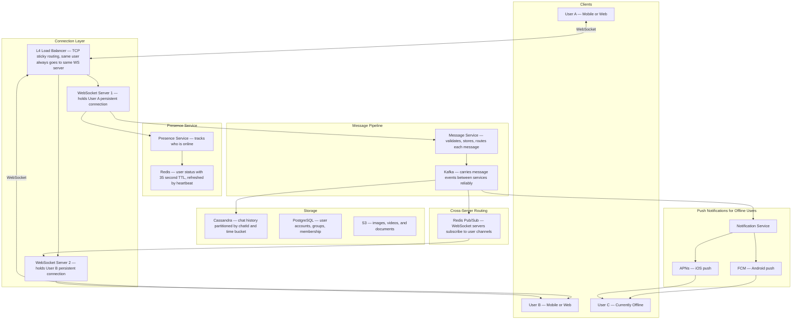
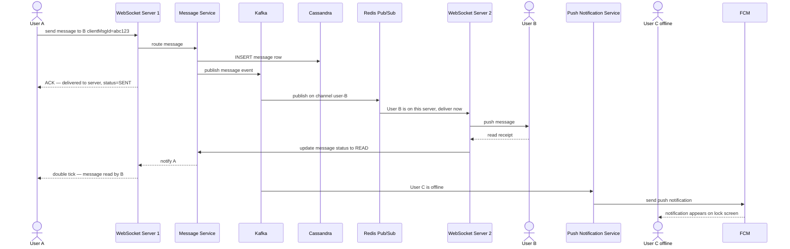
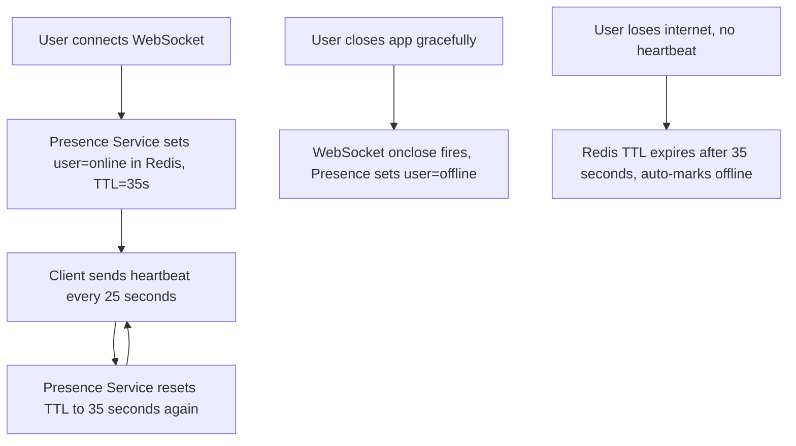
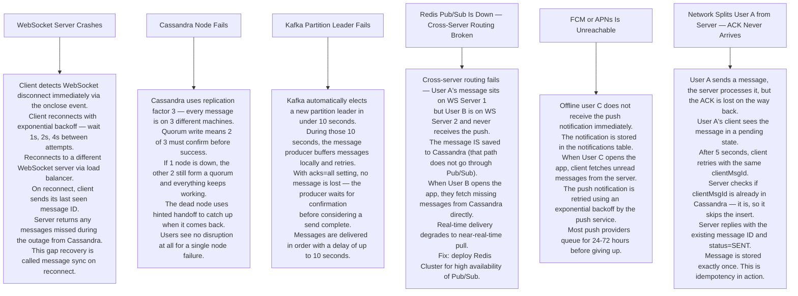

# Pattern 04 — Chat System (like WhatsApp / Slack)

---

## ELI5 — What Is This?

> Normal web browsing is like knocking on a door, getting an answer, and leaving.
> Chat needs a door that stays open — so your friend can tap you on the shoulder any time.
> That "always-open door" is called a WebSocket connection.
> Messages fly both ways instantly without knocking every time.

---

## Glossary

| Word | ELI5 Meaning |
|---|---|
| **WebSocket** | A permanent two-way pipe between your browser and the server. Unlike normal HTTP where you ask and the server answers, WebSocket lets the server push messages to you any time. Like a phone call vs sending letters. |
| **Presence** | The online/offline/last-seen status of a user. "User A was last seen 5 minutes ago." |
| **Fan-out** | Sending one message to many recipients. Like a teacher announcing something and every student hears it. |
| **Redis Pub/Sub** | A broadcasting system inside Redis. One server publishes to a channel; any other server subscribed to that channel receives it instantly. Like a walkie-talkie channel. |
| **Cassandra** | A database designed to handle enormous amounts of writes and store data partitioned by chat room ID and time. Perfect for chat history. |
| **heartbeat** | A tiny "I'm still alive" message sent by the client every 25 seconds so the server knows the connection is still active. Like blinking to show you're awake. |
| **FCM (Firebase Cloud Messaging)** | Google's service for sending push notifications to Android devices. |
| **APNs (Apple Push Notification service)** | Apple's service for sending push notifications to iPhones. |
| **Idempotency** | Doing the same thing twice gives the same result as doing it once. Like pressing a light switch twice — if you want it on, pressing "on" twice still just leaves it on. Important for safe retries. |
| **clientMsgId** | A unique ID the client generates for each message before sending it. Used to detect duplicates if the message is retried. |

---

## Component Diagram

---

## Message Delivery Flow

---

## Presence — Heartbeat System

> **Why 35s TTL with 25s heartbeat?**
> The 10-second gap absorbs occasional network hiccups — one missed heartbeat does not immediately show you as offline.

---

## Bottlenecks — Every Point Explained

| # | Bottleneck | Why It Hurts | Fix |
|---|---|---|---|
| 1 | **Memory per WebSocket connection** | Each open connection uses about 50KB of RAM. 1 million connections = 50 GB on one server. | Use event-driven servers (Node.js, Netty) that handle 1 million connections asynchronously with far less RAM than thread-based servers. |
| 2 | **Group message fan-out** | Sending to a 1000-member group means 1000 individual deliveries. At 1 message per second per group that is 1000 write operations per second for one group alone. | Use **fan-out on read** for large groups (> 500 members) — members pull messages when they open the chat. Use fan-out on write only for small groups. |
| 3 | **Cassandra hot partition** | A very active chat room may write thousands of messages per second to the same partition key (chatId), overloading that one partition. | Use a composite key: `(chatId, week_bucket)`. Week bucket changes every week, spreading load across new partitions automatically. |
| 4 | **Redis Pub/Sub single-threaded** | Redis processes Pub/Sub events on a single thread. At very high scale, the routing layer becomes a bottleneck. | Shard channels by user-ID range across multiple Redis nodes. Or replace Pub/Sub with Kafka for durable inter-server routing. |
| 5 | **Presence storm on reconnect** | If 10 million users all reconnect after a brief outage, 10 million simultaneous SET commands flood Redis. | Add jitter (random delay up to 10 seconds) in client reconnect logic to spread the storm out. |

---

## What Happens When Each Part Fails?

---

## Key Numbers

| Metric | Value |
|---|---|
| Daily active users (WhatsApp scale) | 2 billion |
| Messages per day | 100 billion |
| WebSocket connections per server | 1 million |
| Presence heartbeat interval | 25 seconds |
| Message delivery P99 latency | Under 100ms |
| Message storage partitioning | chatId + weekly bucket |
