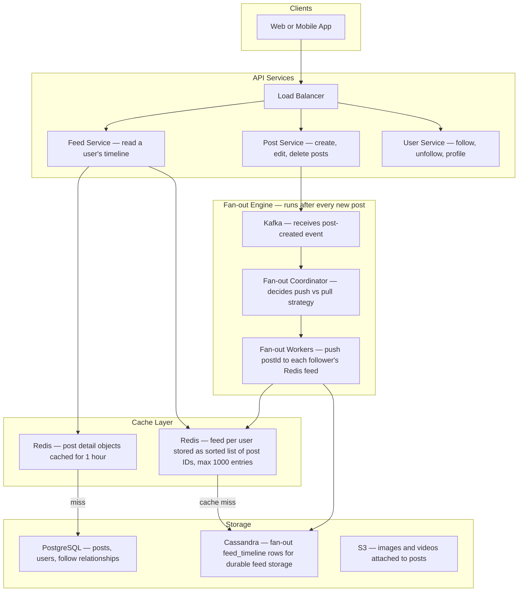
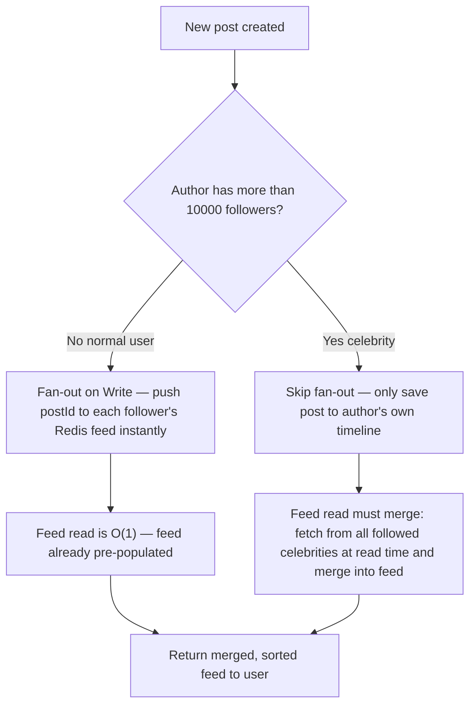
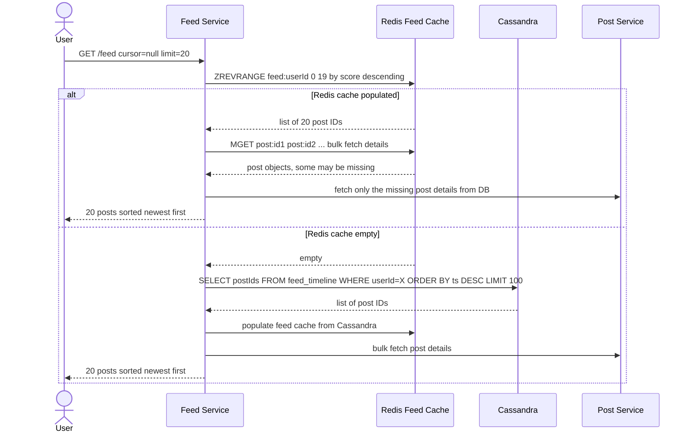
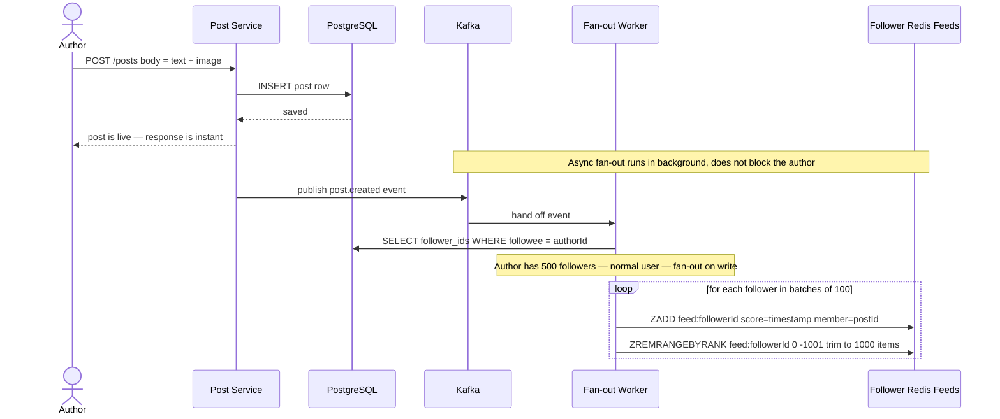
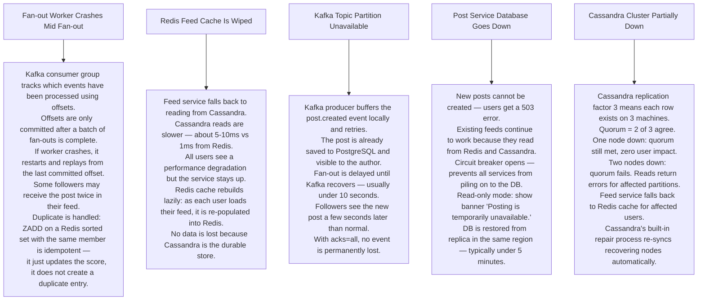

# Pattern 05 — News Feed / Social Timeline (like Twitter / Instagram)

---

## ELI5 — What Is This?

> You follow 200 friends. Every time someone posts, you need to see it on your personal
> board sorted by newest first.
> The system can either give you a fresh copy every time you look (slow — pulls from everyone),
> or it can keep your personal board already filled in (fast — but costs more to update).
> Choosing between these two strategies is the central challenge of a news feed.

---

## Glossary

| Word | ELI5 Meaning |
|---|---|
| **Fan-out on Write (Push model)** | When someone posts, immediately push a copy of that post to every follower's personal feed. Like stamping a letter and mailing it to every subscriber right away. Fast to read, expensive to write. |
| **Fan-out on Read (Pull model)** | Do nothing on post. When a user loads their feed, go collect posts from every person they follow and merge them. Like picking up all letters yourself. Cheap to write, slow to read. |
| **Hybrid model** | Use fan-out on write for normal users. Use fan-out on read for celebrities (too many followers to write to instantly). Best of both worlds. |
| **Celebrity threshold** | A configurable follower count (e.g. 10,000) above which a user is treated as a celebrity and their posts use the pull model. |
| **Keyset pagination (cursor)** | Instead of asking for "page 3", you ask for "posts older than post ID X". This way inserting new posts at the top never shifts the position of what you already saw. |
| **Denormalise** | Store extra copies of data in different places to make reads faster, at the cost of more storage and update work. |
| **Kafka** | A reliable conveyor belt for events — post created events land here, fan-out workers pick them up at their own pace. |
| **Cassandra** | A database that handles enormous write volumes and stores data partitioned by user ID. Used to store pre-computed feed lists. |
| **Redis Sorted Set** | A Redis data structure that keeps items sorted by score. Used to store each user's feed as a list of post IDs sorted by timestamp. |

---

## Component Diagram

---

## Fan-out Strategy Decision

---

## Feed Read Flow

---

## Post Creation + Fan-out Flow

---

## Bottlenecks — Every Point Explained

| # | Bottleneck | Why It Hurts | Fix |
|---|---|---|---|
| 1 | **Celebrity fan-out** | A user with 10 million followers posts once. Write service tries to update 10M Redis entries in seconds. Workers cannot keep up — follower feeds are stale for minutes. | Hybrid model: celebrities skip write fan-out. Their posts are fetched and merged at read time. |
| 2 | **Feed cache stale after delete** | A post gets deleted but it was already pushed to 10M followers' caches. Users still see it. | Use a soft-delete flag on the post. Feed service filters out deleted posts at read time. Deleted posts disappear from all feeds within seconds. |
| 3 | **Cassandra hot partition** | A very popular user generates enormous writes to the same partition key. | Composite key: `(userId, week_bucket)`. Each week a new partition is used, distributing load. |
| 4 | **Pagination drift** | User scrolls down, new posts arrive at top, next page offset shifts — duplicate or missing posts appear. | Cursor-based pagination: cursor = last seen postId. Next page = posts with timestamp less than that post's timestamp. Add new posts at top never affects your scroll position. |
| 5 | **Follow graph lookups** | Fetching all 500 follower IDs for a user requires a DB scan on every post. At high post rate this is millions of DB queries per second. | Store follower lists in Redis Sets. Lookup is O(1). Update on follow/unfollow in real time. |

---

## What Happens When Each Part Fails?

---

## Key Numbers

| Metric | Value |
|---|---|
| Fan-out writes per second (Instagram scale) | ~4 million per second |
| Feed cache entries per user | 1000 post IDs max |
| Celebrity follower threshold | 10,000 followers |
| Feed load P99 latency | Under 100ms |
| Cassandra partition key | userId + weekly bucket |
| Follow graph storage | Redis Set per user |

---

## How All Components Work Together (The Full Story)

Think of a news feed as a personalised newspaper that is assembled just for you. The question is: does the printing happen when the writer publishes, or when you ask for your paper?

**When an author posts (the write path):**
1. The **Post Service** saves the new post to **PostgreSQL** and immediately returns "post is live" to the author — the fan-out happens in the background, not blocking the author.
2. **Kafka** receives a `post.created` event. The **Fan-out Coordinator** reads the author's follower count from **Redis** (a fast Set of follower IDs).
3. If the author has fewer than 10,000 followers (normal user), **Fan-out Workers** add the `postId` to each follower's **Redis Sorted Set** (their personal pre-built feed), scored by the post's timestamp. Workers also write durable copies to **Cassandra** for persistence.
4. If the author is a celebrity (10,000+ followers), the fan-out workers skip most followers and only update a small set of "power readers". The celebrity's post is fetched at read time and merged in.

**When a user opens their feed (the read path):**
1. **Feed Service** reads the user's **Redis Sorted Set** — a pre-built, sorted list of up to 1000 post IDs. This lookup is under 1ms.
2. Feed Service bulk-fetches post objects from **Post Cache (Redis)** using MGET (one round trip for all IDs).
3. Any post objects not in cache are fetched from **PostgreSQL** and stored in Post Cache for future readers.
4. For following feed: if the user follows any celebrities, their feeds are merged in at read time (pull path). The merged result is sorted by timestamp before returning.

**How the components support each other:**
- Redis Sorted Set is the pre-assembled newspaper — reading is instant because the assembly happened earlier.
- Cassandra backs up Redis so a cache wipe doesn't lose anyone's feed history.
- Kafka absorbs fan-out work asynchronously, so the author never waits for 500 Redis writes before seeing their post go live.
- The celebrity threshold is the "valve" that prevents any single post from creating millions of simultaneous Redis writes.

> **ELI5 Summary:** Post Service is the author's editor. Kafka is the newspaper printing press. Fan-out Workers are delivery trucks dropping copies at each subscriber's door (Redis). Cassandra is the warehouse. Feed Service is the newsstand you visit to get your copy. For celebrities, there is no pre-delivery — you pick up a blank sheet and a special insert is added for the celebrity section when you arrive at the newsstand.

---

## Key Trade-offs

| Decision | Option A | Option B | Why We Pick B (or A) |
|---|---|---|---|
| **Fan-out on write vs fan-out on read** | Push to every follower immediately (write) | Pull from each followed author at read time | **Hybrid**: write fan-out for normal users (fast read), read fan-out for celebrities (avoids write storm). Neither extreme works at scale by itself. |
| **Store post IDs in feed vs full post objects** | Store full post JSON in the feed Redis entry | Store only postId, fetch post details separately | **Post IDs only**: post details can change (edits, likes count updates). Storing the ID means you always fetch fresh details. Storing full objects means stale feed data after post edits. |
| **Chronological vs ranked feed** | Show posts in creation order only | Show posts ranked by ML relevance score | **Chronological is technically simpler**: a Redis Sorted Set scored by timestamp does this naturally. **Ranked feed** requires an ML inference service that scores posts at read time or pre-computes scores. Instagram and Facebook switched from chronological to ranked — better engagement but higher complexity. |
| **1000 feed entries per user vs unlimited** | Cap each user's Redis feed at 1000 entries | Unlimited entries (unbounded Sorted Set) | **Cap at 1000**: users rarely scroll beyond 200 posts. Storing unlimited entries wastes memory proportional to post frequency. If a user wants older posts, they load them from Cassandra. |
| **Immediate fan-out vs batched fan-out** | Fan out to all followers within milliseconds | Batch fan-outs every few seconds | **Immediate** for most systems — users expect to see posts quickly. Batched reduces write amplification for high-frequency posters but introduces visible lag. |
| **Follow graph in PostgreSQL vs Redis** | Store follow relationships in a relational DB | Cache follow lists in Redis Sets for each user | **Redis Sets** for the hot path: looking up 500 follower IDs on every post requires immediate access. DB is the durable backup; Redis is the operational copy. |

---

## Important Cross Questions

**Q1. A user has 100 million followers (e.g., Cristiano Ronaldo on Instagram). They post. What happens?**
> The fan-out coordinator detects 100M followers — this exceeds the celebrity threshold. It does NOT push to 100M Redis feeds. Instead, it: (1) writes the post to PostgreSQL (one write), (2) publishes `post.created` to Kafka (one event), (3) marks the post as a celebrity post. At read time, every user's Feed Service includes a merge step: fetch the last N posts from each followed celebrity's timeline and merge into the ranked feed. The 100M write storm never happens.

**Q2. A user follows 5000 people and all 5000 post within the same minute. How do you handle the write and the read?**
> Write: 5000 independent fan-out workers each add one postId to this user's Redis Sorted Set. Each is a fast `ZADD` operation. The Sorted Set automatically keeps them sorted by timestamp. Read: Feed Service does ZREVRANGE (newest first) on the Sorted Set — returns 20 IDs in one call. Bulk-fetches 20 post objects. Total read: ~2ms. The write storm (5000 ZADDs) is spread over the minute as each post is created — not all at once.

**Q3. A user deletes a post. It was already fan-out to 10 million feeds. How do you remove it?**
> You don't remove the postId from 10 million Redis Sorted Sets — that's 10M Redis writes. Instead: use a soft-delete flag on the post record in PostgreSQL. Set `deleted=true`. When Feed Service fetches post details, it skips posts with `deleted=true`. From the user's perspective the post disappears instantly (next feed load excludes it). The phantom postId in Redis Sorted Sets is harmless — it just returns null from the post cache and gets filtered out. Old postIds in Redis expire naturally as the Sorted Set is trimmed to 1000 entries.

**Q4. How does cursor-based pagination work and why is it better than offset-based?**
> Offset-based: `SELECT * FROM posts LIMIT 20 OFFSET 40` — fetches rows 41-60. Problem: if someone posts 3 new posts while you scroll, those rows shift the offset. Row 41 is now row 44. You see duplicates or miss rows. Cursor-based: "give me posts with timestamp < X" where X is the timestamp of the last post you saw. New posts at the top don't affect what's below your cursor. Your scroll position is stable.

**Q5. How do you handle a user who posts 1000 times per day (a news account)?**
> Fan-out on write for 1000 posts/day × 500 followers = 500,000 Redis write operations per day. Acceptable. But if the news account has 1 million followers: 1 billion writes per day — too expensive. Apply the celebrity threshold not just on follower count but also on post frequency: accounts above a certain posts-per-day rate automatically switch to the pull model, regardless of follower count.

**Q6. How do you implement the "show only posts from last 48 hours" filter without fully rebuilding the feed?**
> The Redis Sorted Set stores postIds scored by Unix timestamp. Feed Service can do `ZRANGEBYSCORE feed:userId (now-172800) +inf` — "give me IDs with score (timestamp) newer than 48 hours ago". No rebuild needed. The filter is applied at read time with a simple range query. Cassandra supports the same range query natively on its time-partitioned table.

---

## Real-World Apps That Use This Pattern

| Company | Product | How They Use It |
|---|---|---|
| **Twitter / X** | Twitter Timeline | The system design problem that made "news feed" famous as an interview topic. Twitter's 2013 engineering blog post described the exact architecture: fan-out on write to Redis timelines for most users, with "celebrities" (>100K followers, called "high-fan-out accounts") served by hybrid pull at read time. Redis Sorted Sets store tweet IDs. "Who to follow" recommendations are a separate ML-driven component. The current X algorithm is open-sourced on GitHub — revealing exactly how engagement signals (likes, replies, recency) weight ranking. |
| **Instagram** | Instagram Feed | Owned by Meta, uses the same infrastructure as Facebook broadly. Feed is ranked (not chronological by default since 2016) using ML signals. Fan-out on write for most accounts; pull for large influencer accounts. Instagram's "Following" vs "For You" tabs represent chronological vs ranked feed — two different pipelines running in parallel. Stories (24-hour expiry) use the TTL pattern on Redis. |
| **Facebook** | Facebook News Feed | The original "news feed" (launched 2006). Facebook's "EdgeRank" (now a deep neural network) was one of the first feed-ranking algorithms. At their scale, the graph is so dense (average user has 300+ friends who each post frequently) that pure fan-out on write is impractical — hybrid approach with tiered priority (close friends' posts are pushed; acquaintances' posts are pulled and ranked during assembly). |
| **LinkedIn** | LinkedIn Feed | Professional network feed. LinkedIn's feed team published detailed engineering posts: they use a two-pass approach — (1) candidate generation (retrieve relevant posts for this user from Kafka-backed post store) → (2) ranking (ML model scores candidates). The key differentiator: "viral" content (posts with many likes) skips the standard fan-out and goes through a separate high-amplification path. |
| **TikTok** | TikTok For You Page | The most algorithmically extreme version of a ranked feed. No social graph required for the main feed — pure interest-based curation. Each video view generates engagement signals (watch time, replays, likes, comments, shares) fed back to the recommendation model in near-real-time. The "For You Page" is effectively a feed with no fan-out (you don't follow most creators whose videos appear) — content is pulled and scored purely on predicted engagement. |
| **Reddit** | Reddit Front Page / Subreddits | Unique variant: the feed is a community-ranked feed using upvote/downvote scores. Redis stores post scores and sort order changes on every vote. The "hot" sort algorithm decays scores over time (older highly-voted posts rank lower than new popular ones). Front page is an aggregation of the top posts across subscribed subreddits — essentially a merge-sort of multiple sorted sets. |
