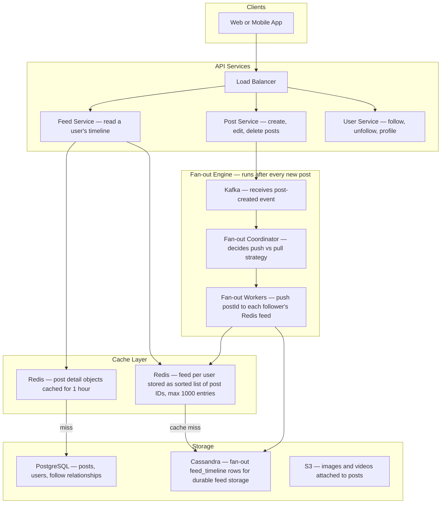
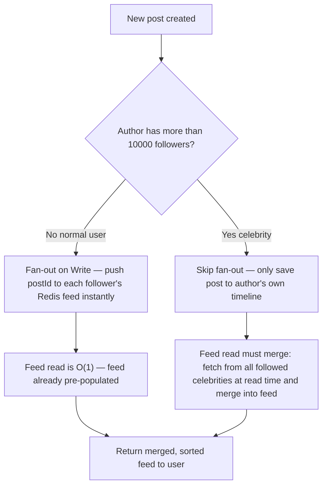
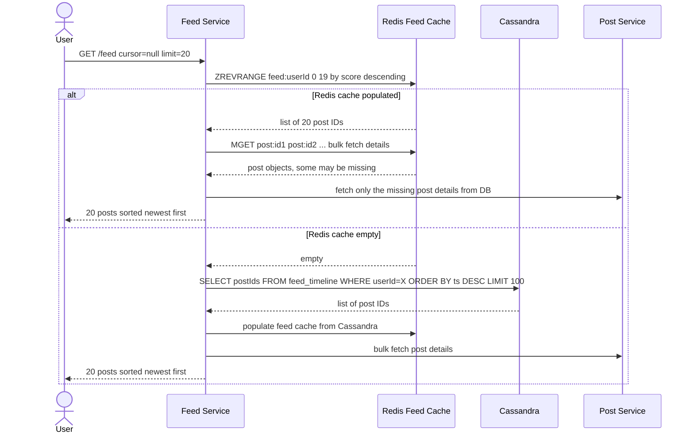
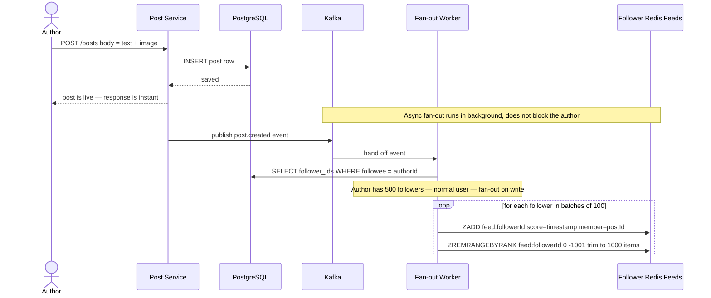
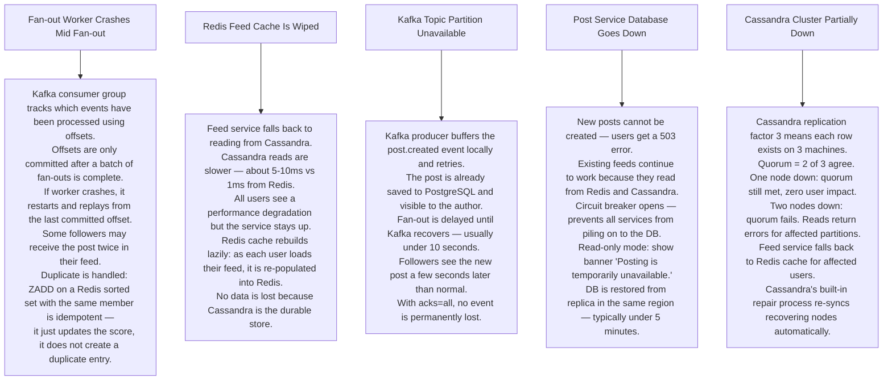

# Pattern 05 — News Feed / Social Timeline (like Twitter / Instagram)

---

## ELI5 — What Is This?

> You follow 200 friends. Every time someone posts, you need to see it on your personal
> board sorted by newest first.
> The system can either give you a fresh copy every time you look (slow — pulls from everyone),
> or it can keep your personal board already filled in (fast — but costs more to update).
> Choosing between these two strategies is the central challenge of a news feed.

---

## Glossary

| Word | ELI5 Meaning |
|---|---|
| **Fan-out on Write (Push model)** | When someone posts, immediately push a copy of that post to every follower's personal feed. Like stamping a letter and mailing it to every subscriber right away. Fast to read, expensive to write. |
| **Fan-out on Read (Pull model)** | Do nothing on post. When a user loads their feed, go collect posts from every person they follow and merge them. Like picking up all letters yourself. Cheap to write, slow to read. |
| **Hybrid model** | Use fan-out on write for normal users. Use fan-out on read for celebrities (too many followers to write to instantly). Best of both worlds. |
| **Celebrity threshold** | A configurable follower count (e.g. 10,000) above which a user is treated as a celebrity and their posts use the pull model. |
| **Keyset pagination (cursor)** | Instead of asking for "page 3", you ask for "posts older than post ID X". This way inserting new posts at the top never shifts the position of what you already saw. |
| **Denormalise** | Store extra copies of data in different places to make reads faster, at the cost of more storage and update work. |
| **Kafka** | A reliable conveyor belt for events — post created events land here, fan-out workers pick them up at their own pace. |
| **Cassandra** | A database that handles enormous write volumes and stores data partitioned by user ID. Used to store pre-computed feed lists. |
| **Redis Sorted Set** | A Redis data structure that keeps items sorted by score. Used to store each user's feed as a list of post IDs sorted by timestamp. |

---

## Component Diagram

---

## Fan-out Strategy Decision

---

## Feed Read Flow

---

## Post Creation + Fan-out Flow

---

## Bottlenecks — Every Point Explained

| # | Bottleneck | Why It Hurts | Fix |
|---|---|---|---|
| 1 | **Celebrity fan-out** | A user with 10 million followers posts once. Write service tries to update 10M Redis entries in seconds. Workers cannot keep up — follower feeds are stale for minutes. | Hybrid model: celebrities skip write fan-out. Their posts are fetched and merged at read time. |
| 2 | **Feed cache stale after delete** | A post gets deleted but it was already pushed to 10M followers' caches. Users still see it. | Use a soft-delete flag on the post. Feed service filters out deleted posts at read time. Deleted posts disappear from all feeds within seconds. |
| 3 | **Cassandra hot partition** | A very popular user generates enormous writes to the same partition key. | Composite key: `(userId, week_bucket)`. Each week a new partition is used, distributing load. |
| 4 | **Pagination drift** | User scrolls down, new posts arrive at top, next page offset shifts — duplicate or missing posts appear. | Cursor-based pagination: cursor = last seen postId. Next page = posts with timestamp less than that post's timestamp. Add new posts at top never affects your scroll position. |
| 5 | **Follow graph lookups** | Fetching all 500 follower IDs for a user requires a DB scan on every post. At high post rate this is millions of DB queries per second. | Store follower lists in Redis Sets. Lookup is O(1). Update on follow/unfollow in real time. |

---

## What Happens When Each Part Fails?

---

## Key Numbers

| Metric | Value |
|---|---|
| Fan-out writes per second (Instagram scale) | ~4 million per second |
| Feed cache entries per user | 1000 post IDs max |
| Celebrity follower threshold | 10,000 followers |
| Feed load P99 latency | Under 100ms |
| Cassandra partition key | userId + weekly bucket |
| Follow graph storage | Redis Set per user |
