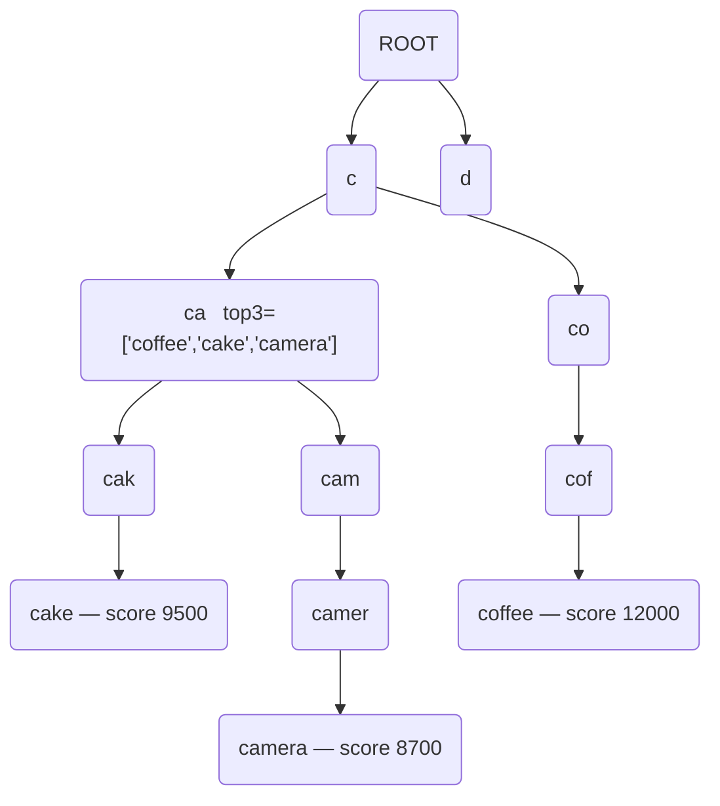
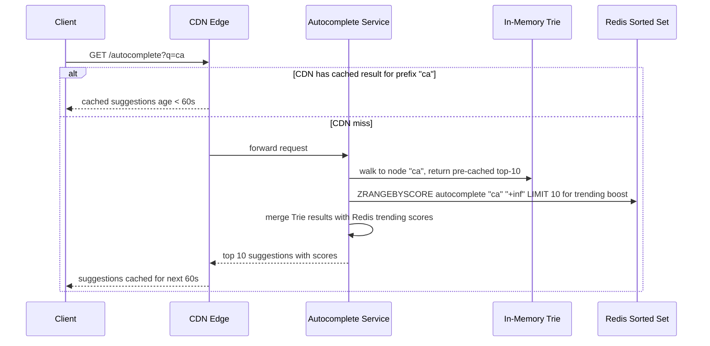
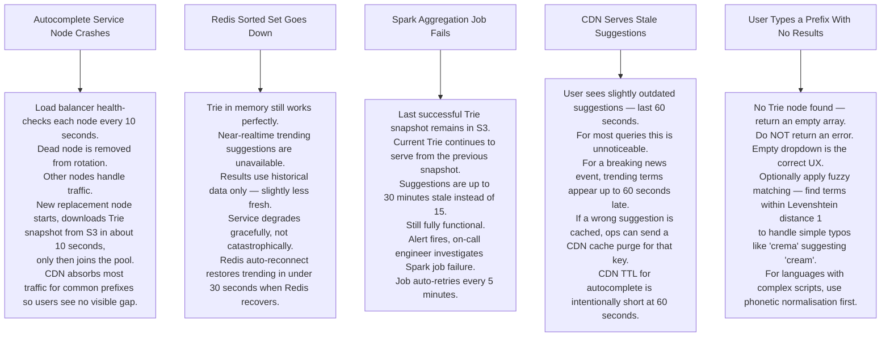

# Pattern 06 — Search Autocomplete / Typeahead (like Google Search Bar)

---

## ELI5 — What Is This?

> You type "ca" and the box instantly shows "cake", "camera", "cap".
> Before you finished the word, the system already knows the top answers.
> It achieves this by pre-sorting all words that start with every possible prefix
> and keeping those sorted lists ready in memory.
> When you type "ca" it just looks up the pre-made list for "ca" — no searching needed.

---

## Glossary

| Word | ELI5 Meaning |
|---|---|
| **Trie (Prefix Tree)** | A tree where each branch represents one letter. To find all words starting with "ca", you walk down the C branch then the A branch and collect everything below. Like a library organised by first letter, then second letter, and so on. |
| **Node** | One letter in the Trie tree. The node for "c" connects to all nodes whose words start with "c". |
| **Top-K cache per node** | Instead of searching the whole subtree every time, each node pre-stores the K most popular completions below it. Like a librarian who already knows the top 3 books in each section. |
| **Frequency score** | How many times a search term was searched in the last 7 days. Higher score = more popular = shown first. |
| **Debounce** | The client waits 200ms after you stop typing before sending a request. Avoids firing a request for every single keystroke. Like waiting for you to pause before responding. |
| **Spark / Flink** | Big data processing frameworks. Spark does batch processing (offline); Flink does stream processing (near real-time). Like a bookkeeper who either totals up at end of day (batch) or totals as each sale happens (stream). |
| **Redis Sorted Set** | A Redis structure where each item has a score. You can ask "give me items whose name starts with ca, sorted by score". Used as a fast alternative to the in-memory Trie. |
| **CDN** | Network of servers near users. Common prefixes like "the" are cached at edge nodes — no request ever reaches your backend. |
| **Levenshtein distance** | A measure of how different two words are. Distance 1 means one letter added, removed, or changed. Used for typo tolerance. |

---

## Component Diagram

```mermaid
graph TB
    subgraph CLIENT["Client"]
        INPUT["Search Box — debounced 200ms before sending request"]
    end

    subgraph EDGE["Edge Layer"]
        CDN["CDN — caches suggestions for common prefixes with 60s TTL"]
        LB["Load Balancer"]
    end

    subgraph API["Read Path — must be ultra fast"]
        AC_SVC["Autocomplete Service — looks up Trie or Redis, returns top 10"]
    end

    subgraph DATASTRUCTURE["Data Structure Layer"]
        TRIE["In-Memory Trie — loaded on startup from snapshot, hot-reloaded every 15 min"]
        REDIS["Redis Sorted Set — near-realtime scores from streaming pipeline"]
    end

    subgraph WRITE["Offline Aggregation Pipeline — runs in background"]
        KAFKA["Kafka — receives every search query submitted"]
        SPARK["Spark — aggregates query counts per prefix over last 7 days"]
        BUILDER["Trie Builder — rebuilds Trie snapshot every 15 minutes"]
        S3["S3 — stores serialised Trie snapshots"]
    end

    INPUT --> CDN --> LB --> AC_SVC
    AC_SVC --> TRIE & REDIS
    INPUT -- search submitted --> KAFKA --> SPARK --> REDIS
    SPARK --> BUILDER --> S3 --> TRIE
    AC_SVC --> CDN
```

---

## Trie Structure (ELI5)

> **How lookup works:** You type "ca" → walk ROOT → C → CA.
> CA node already has pre-cached top-3: coffee, cake, camera.
> Return those instantly. Zero further tree traversal needed.

---

## Request Flow

---

## Bottlenecks — Every Point Explained

| # | Bottleneck | Why It Hurts | Fix |
|---|---|---|---|
| 1 | **Trie memory grows huge** | English alone has millions of unique search terms. Storing every node with full text = gigabytes of RAM per server. | Cache only the top-3 completions at each node. Discard nodes deeper than 8 characters — users rarely type more than that. Total Trie fits in under 1 GB. |
| 2 | **Trie is stale for 15 minutes** | A breaking news event causes "earthquake LA" to trend. Users get no suggestions for it until the next Trie rebuild. | Dual path: Trie for historical popularity (15-min lag) + Redis Sorted Set for last 1-minute trending (near real-time). Blend both results. |
| 3 | **Keystroke storm** | A fast typist produces 5-10 keystrokes per second. 10 million users = 50-100 million API calls per second — impossible at that rate. | Client debounces 200ms. CDN caches. Result: actual backend QPS drops to roughly 10% of raw keystroke rate. |
| 4 | **Cold start after deploy** | New Autocomplete service node starts, Trie is empty. First requests miss until Trie loads. | On startup, download Trie snapshot from S3 before registering with load balancer. Health check passes only after Trie is loaded. |
| 5 | **Multi-language** | Japanese, Arabic, and Spanish each need a separate Trie. Tripling infra cost and complexity. | Separate Redis key namespaces by language (`en:autocomplete`, `ja:autocomplete`). Separate Trie instances per language. Load-balance by Accept-Language header. |

---

## What Happens When Each Part Fails?

---

## Key Numbers

| Metric | Value |
|---|---|
| CDN cache hit rate for autocomplete | 85%+ (most queries are common words) |
| Trie rebuild interval | Every 15 minutes |
| Redis trending window | Last 60 seconds |
| Client debounce | 200ms |
| Autocomplete latency target | Under 10ms (P99) |
| Top-K stored per Trie node | 3 to 10 |

---

## How All Components Work Together (The Full Story)

Think of search autocomplete as a librarian who has already memorised the top 10 books for every possible starting word — AND has a live ticker on their desk watching what's trending right now.

**When you type "ca":**
1. Your browser waits 200ms after your last keystroke (**debounce**) before sending a request — this prevents one request per keystroke for fast typists, reducing API calls by ~70%.
2. The request first goes to the **CDN Edge**. "ca" is an extremely common prefix (camera, cake, car...). There is almost certainly a cached result from the last 60 seconds. If yes: returned in under 5ms, no servers involved.
3. On a CDN miss, the **Autocomplete Service** is called. It simultaneously queries two sources:
   - The **In-Memory Trie**: walks the letter tree (ROOT → C → CA) and reads the pre-stored top-10 list from that node. No searching — just a pointer dereference.
   - **Redis Sorted Set**: queries for keys with score in the "ca" range, returning trending terms from the last 60 seconds that might not yet be in the Trie.
4. The results are merged (Trie gives historical popularity, Redis gives recency) and returned to the CDN which caches them for 60 seconds.

**The background data pipeline (keeps the Trie fresh):**
1. Every search query you submit (not just autocomplete, but the actual search) is published to **Kafka** as an event.
2. **Apache Spark** runs a batch aggregation job every 15 minutes: "how many times was each search term searched in the last 7 days?"
3. The **Trie Builder** uses Spark's output to rebuild the in-memory Trie, storing the top-10 completions at each prefix node, and saves a snapshot to **S3**.
4. **Autocomplete Service nodes** reload the Trie snapshot from S3 every 15 minutes — brand new nodes download it on startup before serving any requests.

**How the components support each other:**
- CDN absorbs ~85% of autocomplete traffic, making the backend essentially irrelevant for common prefixes.
- The dual Trie + Redis approach covers both historical accuracy and real-time trends without either source being perfect alone.
- Kafka and Spark work in the background — zero impact on the latency-critical read path.
- S3 Trie snapshots allow fast recovery of any Autocomplete Service node without rebuilding from scratch.

> **ELI5 Summary:** The Trie is the librarian's pre-memorized answer book. Redis is the trending ticker on their desk. CDN is the photocopy of the answer book kept at every library branch in the city. Kafka is the suggestion box where every search is recorded. Spark is the person who reads all suggestions overnight and updates the answer book.

---

## Key Trade-offs

| Decision | Option A | Option B | Why We Pick B (or A) |
|---|---|---|---|
| **Trie vs Redis Sorted Set as primary data structure** | Full Trie in memory — perfect prefix lookup | Redis Sorted Set with ZRANGEBYLEX — distributed, no in-process memory | **Trie** for sub-millisecond lookup and custom logic (top-K pre-caching per node). **Redis Sorted Set** as a near-real-time trending layer. Use both. Trie alone becomes stale; Redis alone lacks the historical depth. |
| **15-minute Trie rebuild vs real-time update** | Rebuild entire Trie from scratch every 15 minutes | Patch individual Trie nodes as queries arrive in real-time | **Batch rebuild** is simpler and consistent — partially updated Tries can have inconsistent top-K. Trade-off: 15-minute lag for new trending terms. Mitigated by the Redis trending layer which is near-real-time. |
| **Depth-limited Trie vs full depth** | Store prefixes up to any depth | Cap at depth 8 (users rarely type more than 8 chars before picking a suggestion) | **Depth-limited** drastically reduces memory. English vocabulary above 8 characters is millions of words. Capping at 8 drops 90% of the nodes while covering 99.9% of real user typing behavior. |
| **Top-3 vs Top-10 per Trie node** | Store 3 completions per node — minimal memory | Store 10 completions per node — richer results | **Top-5 to 10** is industry standard. Top-3 is too sparse for long-tail prefixes that match many popular terms. Top-10 uses more memory but fits comfortably inside 1 GB for typical vocabularies. |
| **Single global Trie vs per-language Tries** | One Trie for all languages mixed together | Separate Trie per language namespace | **Separate Tries** per language: mixing Japanese and English in one Trie is nonsensical (different character ranges, different character frequency distributions). Load the relevant Trie based on the `Accept-Language` header. |
| **Client-side debounce vs server-side throttle** | Debounce in the browser — fewer requests sent | Server throttles requests per session — protects backend | **Both**: client debounce reduces load by 70%, server throttle is a safety net against clients that bypass debounce. |

---

## Important Cross Questions

**Q1. How would you design the Trie to support personalised autocomplete (suggestions based on MY past searches, not global popularity)?**
> Two-layer approach: global Trie serves population-level completions. A per-user personalised layer (stored in Redis as a small personal Sorted Set per user, e.g. "user:U1:searches") serves the user's own recent searches. At query time, merge and re-rank: personal results score higher for the first 3 slots, global results fill remaining slots.

**Q2. Google shows different suggestions in different countries. How do you implement geo-based autocomplete?**
> Separate Sorted Sets and Trie snapshots per locale (e.g. `us:en:trie`, `in:en:trie`, `de:de:trie`). Kafka events are tagged with the user's country. Spark aggregates separately per country × language. CDN routes to the region-specific autocomplete service. API Gateway selects the correct data namespace from the request's geo headers.

**Q3. How do you prevent offensive or spam queries from appearing as autocomplete suggestions?**
> Maintain a blocklist of prohibited terms (file or Redis Set). The Trie builder filters out blocked terms during rebuild — they never enter the Trie. For real-time spam: the Kafka consumer applies the blocklist before incrementing the Redis Sorted Set score. Blocking is deterministic and auditable. New additions to the blocklist take effect within the next Trie rebuild cycle (max 15 minutes).

**Q4. The Trie is 2 GB in memory. A new Autocomplete Service node starts. How do you get the Trie onto it without affecting latency?**
> The service node downloads the serialised Trie snapshot from S3 during startup (before the node is registered with the load balancer). Health check endpoint returns 503 until the Trie is fully loaded. Load balancer only directs traffic to healthy (Trie-loaded) nodes. The download takes ~30-60 seconds for a 2 GB file. Users never receive requests served by an empty Trie.

**Q5. How do you test that the Trie rebuild is correct and not degraded?**
> Shadow testing: run both the old Trie and the new Trie in parallel for 5 minutes after rebuild. Compare a random sample of 1000 prefix queries between old and new. If more than 2% of top suggestions differ in a way that looks wrong (e.g. known popular term disappears from the top-3), roll back to the previous S3 snapshot and alert the engineer. Automate this as part of the Trie builder's deployment pipeline.

**Q6. A user types very quickly and sends three requests before the debounce fires. How do you handle out-of-order responses?**
> The browser's debounce ensures only one request fires — but if the user types "ca", pauses (request fires), then types "r" quickly (second request), two requests are in flight. Each request returns independently. The client tracks a `requestId` or uses **cancellation**: when a new request fires, cancel (abort) any pending previous request using `AbortController`. The latest typed prefix always wins. Responses for cancelled requests are discarded.
