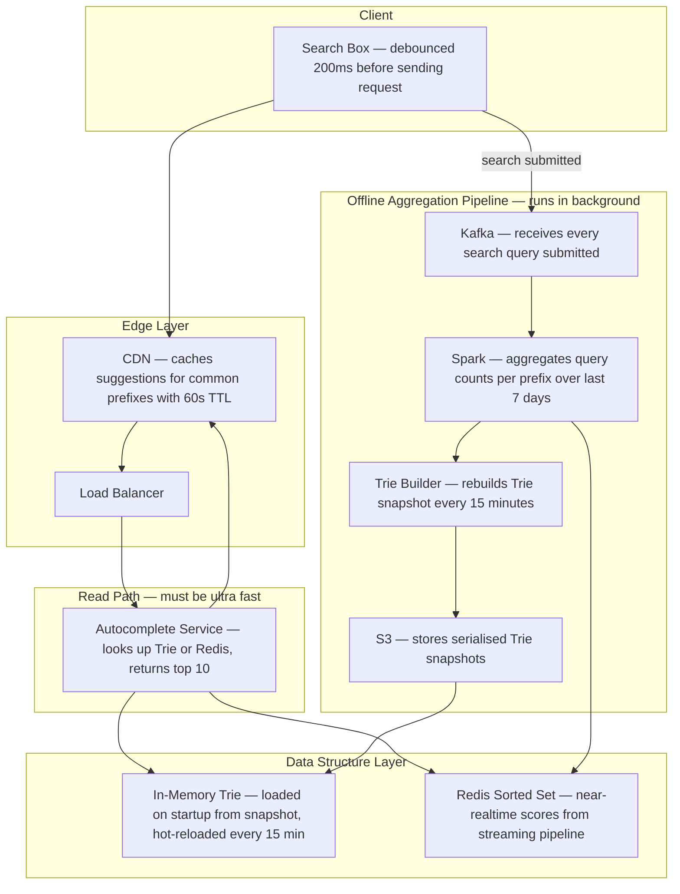
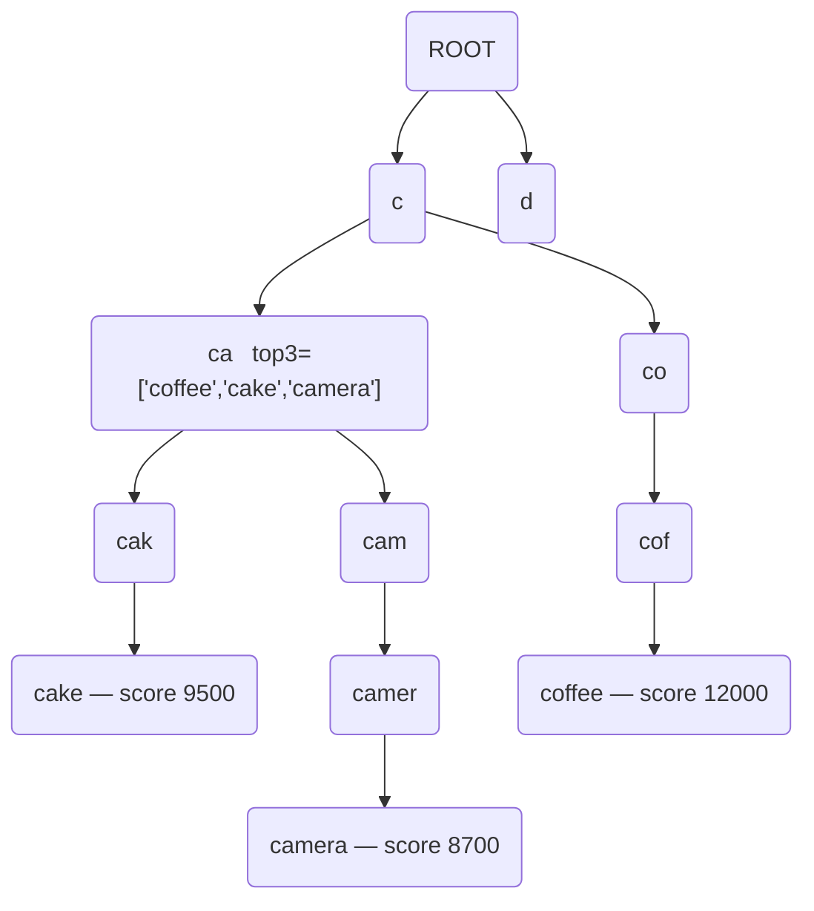
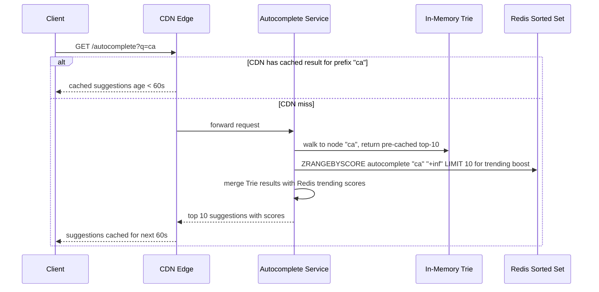
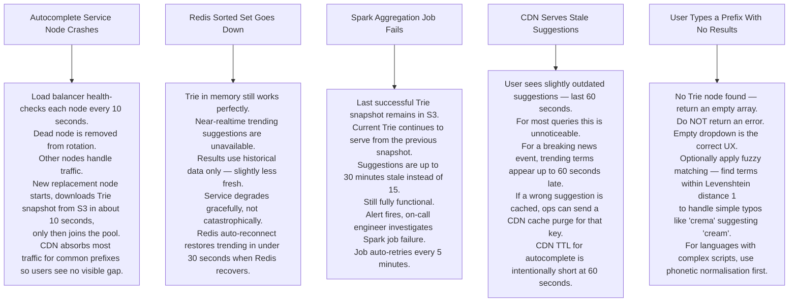

# Pattern 06 — Search Autocomplete / Typeahead (like Google Search Bar)

---

## ELI5 — What Is This?

> You type "ca" and the box instantly shows "cake", "camera", "cap".
> Before you finished the word, the system already knows the top answers.
> It achieves this by pre-sorting all words that start with every possible prefix
> and keeping those sorted lists ready in memory.
> When you type "ca" it just looks up the pre-made list for "ca" — no searching needed.

---

## Glossary

| Word | ELI5 Meaning |
|---|---|
| **Trie (Prefix Tree)** | A tree where each branch represents one letter. To find all words starting with "ca", you walk down the C branch then the A branch and collect everything below. Like a library organised by first letter, then second letter, and so on. |
| **Node** | One letter in the Trie tree. The node for "c" connects to all nodes whose words start with "c". |
| **Top-K cache per node** | Instead of searching the whole subtree every time, each node pre-stores the K most popular completions below it. Like a librarian who already knows the top 3 books in each section. |
| **Frequency score** | How many times a search term was searched in the last 7 days. Higher score = more popular = shown first. |
| **Debounce** | The client waits 200ms after you stop typing before sending a request. Avoids firing a request for every single keystroke. Like waiting for you to pause before responding. |
| **Spark / Flink** | Big data processing frameworks. Spark does batch processing (offline); Flink does stream processing (near real-time). Like a bookkeeper who either totals up at end of day (batch) or totals as each sale happens (stream). |
| **Redis Sorted Set** | A Redis structure where each item has a score. You can ask "give me items whose name starts with ca, sorted by score". Used as a fast alternative to the in-memory Trie. |
| **CDN** | Network of servers near users. Common prefixes like "the" are cached at edge nodes — no request ever reaches your backend. |
| **Levenshtein distance** | A measure of how different two words are. Distance 1 means one letter added, removed, or changed. Used for typo tolerance. |

---

## Component Diagram

---

## Trie Structure (ELI5)

> **How lookup works:** You type "ca" → walk ROOT → C → CA.
> CA node already has pre-cached top-3: coffee, cake, camera.
> Return those instantly. Zero further tree traversal needed.

---

## Request Flow

---

## Bottlenecks — Every Point Explained

| # | Bottleneck | Why It Hurts | Fix |
|---|---|---|---|
| 1 | **Trie memory grows huge** | English alone has millions of unique search terms. Storing every node with full text = gigabytes of RAM per server. | Cache only the top-3 completions at each node. Discard nodes deeper than 8 characters — users rarely type more than that. Total Trie fits in under 1 GB. |
| 2 | **Trie is stale for 15 minutes** | A breaking news event causes "earthquake LA" to trend. Users get no suggestions for it until the next Trie rebuild. | Dual path: Trie for historical popularity (15-min lag) + Redis Sorted Set for last 1-minute trending (near real-time). Blend both results. |
| 3 | **Keystroke storm** | A fast typist produces 5-10 keystrokes per second. 10 million users = 50-100 million API calls per second — impossible at that rate. | Client debounces 200ms. CDN caches. Result: actual backend QPS drops to roughly 10% of raw keystroke rate. |
| 4 | **Cold start after deploy** | New Autocomplete service node starts, Trie is empty. First requests miss until Trie loads. | On startup, download Trie snapshot from S3 before registering with load balancer. Health check passes only after Trie is loaded. |
| 5 | **Multi-language** | Japanese, Arabic, and Spanish each need a separate Trie. Tripling infra cost and complexity. | Separate Redis key namespaces by language (`en:autocomplete`, `ja:autocomplete`). Separate Trie instances per language. Load-balance by Accept-Language header. |

---

## What Happens When Each Part Fails?

---

## Key Numbers

| Metric | Value |
|---|---|
| CDN cache hit rate for autocomplete | 85%+ (most queries are common words) |
| Trie rebuild interval | Every 15 minutes |
| Redis trending window | Last 60 seconds |
| Client debounce | 200ms |
| Autocomplete latency target | Under 10ms (P99) |
| Top-K stored per Trie node | 3 to 10 |
