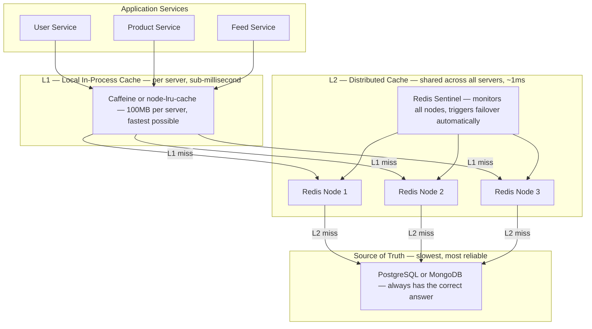
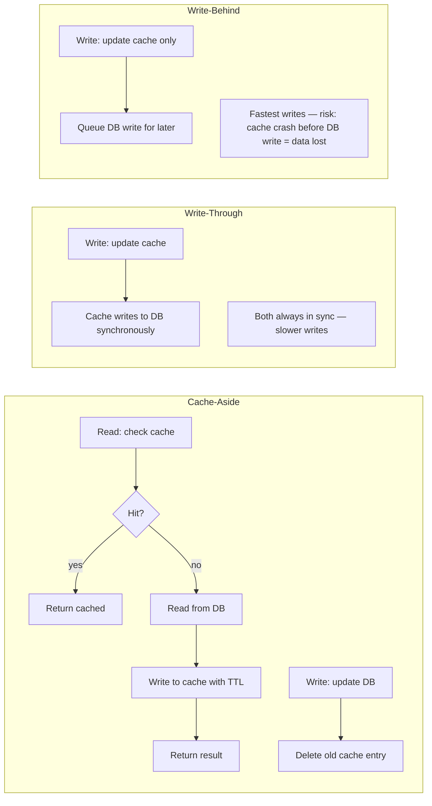
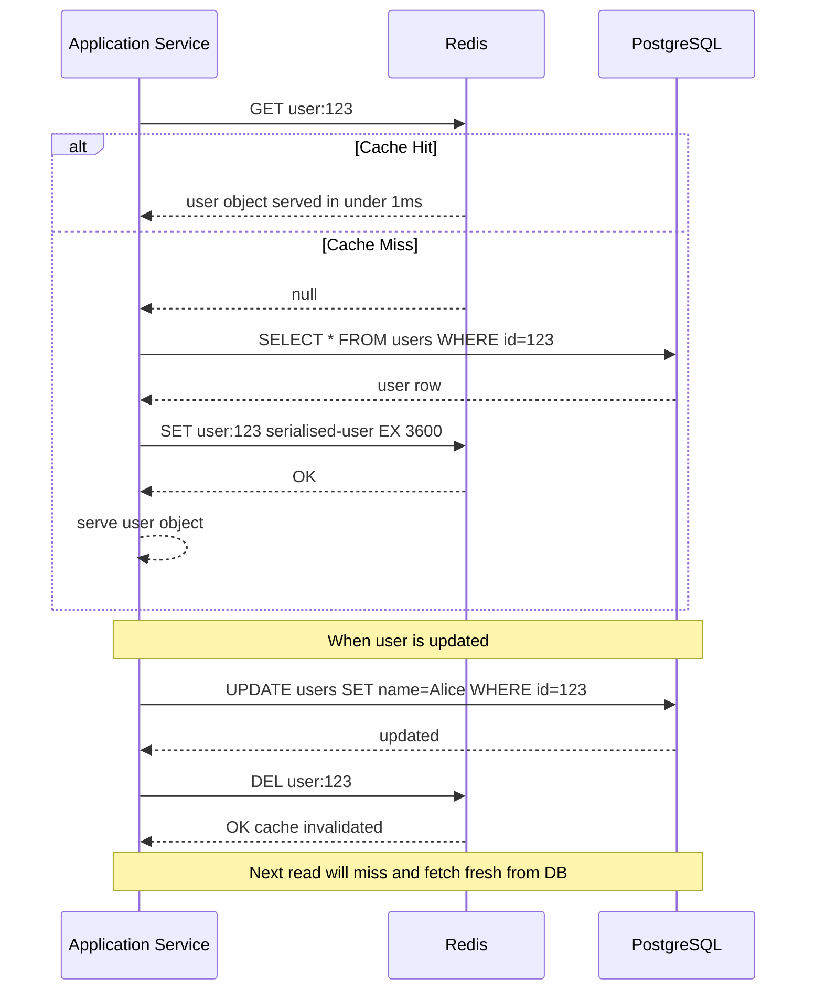
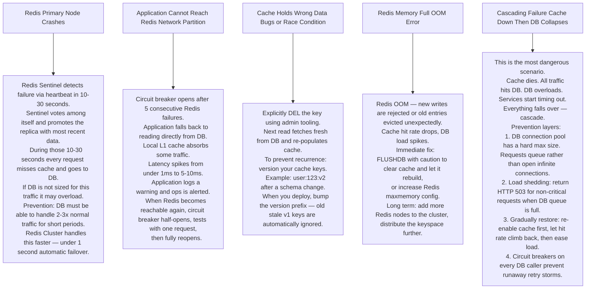

# Pattern 07 — Distributed Cache (Redis / Memcached)

---

## ELI5 — What Is This?

> Every time you ask "what is 99 × 99?" your brain calculates it.
> But after the first time, you just remember the answer — 9801.
> You cached it. A distributed cache is millions of such remembered answers
> shared across many servers so the database never has to answer the same question twice.

---

## Glossary

| Word | ELI5 Meaning |
|---|---|
| **Cache** | A fast temporary storage that holds the answer to a recent question so you do not have to re-compute it or re-fetch it from the slow database. |
| **TTL (Time To Live)** | An expiry date on a cached answer. After 1 hour the sticky note is thrown away and the next request fetches fresh from the database. Like milk with a best-before date. |
| **Cache Miss** | The sticky note is not on the board. You have to go to the filing cabinet (DB), get the answer, and put a new sticky note up. |
| **Cache Hit** | The sticky note is there. Answer in under 1ms. |
| **LRU (Least Recently Used)** | When the board is full, remove the sticky note that has not been looked at the longest. Like clearing your desk — toss what you haven't touched in months. |
| **LFU (Least Frequently Used)** | When full, remove the note that was looked at the fewest times. Keeps popular notes even if not looked at recently. |
| **Cache-Aside** | App checks cache first. If miss, fetches from DB, writes to cache, returns result. The app drives the cache. Most common pattern. |
| **Write-Through** | Every DB write also writes to cache. Cache is always current. Slower writes but always consistent. |
| **Write-Behind** | Write to cache only, write to DB later asynchronously. Fastest writes, risk of data loss if cache dies. |
| **Thundering Herd** | Many requests all miss the cache at the same moment and hammer the database simultaneously. Like hundreds of people knocking on a door at once. |
| **Cache Stampede** | Same as thundering herd but specifically when a popular item's TTL expires and everyone tries to rebuild it at the same time. |
| **Mutex** | A lock that only one person can hold at a time. In cache context: only one thread rebuilds the cache entry while others wait or serve stale data. |
| **Redis Sentinel** | A monitoring system that watches Redis and automatically promotes a replica to primary if the primary dies. |
| **Redis Cluster** | Splits data across multiple Redis nodes (shards). Each node owns a portion of the 16384 hash slots. |
| **Hash Slot** | Redis Cluster divides all possible keys into 16384 buckets. Each bucket is assigned to a node. Your key's bucket is calculated by running a math function (CRC16) on the key name. |

---

## Component Diagram

---

## Cache Patterns Compared

---

## Request Flow — Cache-Aside Pattern

---

## Bottlenecks — Every Point Explained

| # | Bottleneck | Why It Hurts | Fix |
|---|---|---|---|
| 1 | **Thundering Herd** | A popular cache entry expires at 14:00:00 exactly. 50,000 requests per second all miss at the same moment and hit the database. DB gets 50,000 queries in a 100ms window — it collapses. | Jitter the TTL: instead of exact 3600 seconds, use 3600 + random(0, 300). Entries expire at different times. |
| 2 | **Hot Key** | A celebrity's profile is fetched millions of times per second. All requests hash to the same Redis slot on the same node. That single node's CPU hits 100%. | Replicate the hot key: store as `user:123:copy1`, `user:123:copy2`... on different nodes. Client reads from a random copy. |
| 3 | **Cache Stampede** | A popular product page takes 500ms to compute from the database. While one thread is rebuilding it, 999 other threads also detect a miss and also start rebuilding — 1000 identical DB queries. | Mutex lock: first thread acquires lock and rebuilds. Others see the lock and either wait or serve the stale (slightly outdated) version for 500ms. |
| 4 | **Memory Pressure** | Cache is full. Redis starts evicting entries aggressively. Hot data gets evicted. Cache hit rate drops from 95% to 60%. DB sees a sudden 10x load spike. | Monitor Redis memory. Alert at 80% usage. Scale vertically or add cluster shards. Use LFU eviction to keep truly popular items. |
| 5 | **Consistency** | DB is updated. Cache is not invalidated (code bug or race condition). Users read stale data for up to the TTL duration. | Always explicitly DELETE the cache key on any write. Do not rely solely on TTL for correctness. |

---

## What Happens When Each Part Fails?

---

## Cache Sizing Formula

> **Rule of thumb:** Top 20% of your data handles 80% of your reads.
> Cache just that 20%.
>
> `Cache size = total data size × 0.20`
>
> Example: 10 million user profiles × 1 KB each = 10 GB total.
> Cache = 10 GB × 0.20 = **2 GB Redis** handles 80% of reads.

---

## Key Numbers

| Metric | Value |
|---|---|
| Redis single-node throughput | ~1 million ops/second |
| Redis GET latency | Under 1ms (P99) |
| Cache hit rate target | 95%+ |
| Thundering herd TTL jitter | 0 to 300 seconds random |
| Redis Sentinel failover time | 10-30 seconds |
| Redis Cluster failover time | Under 1 second |
