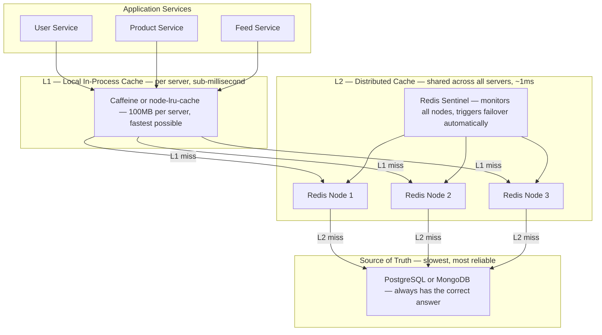
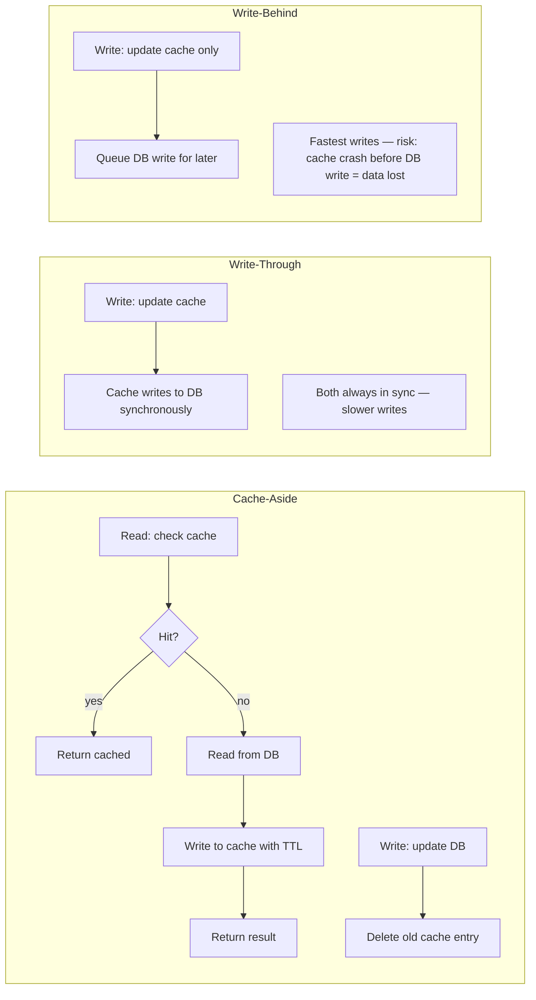
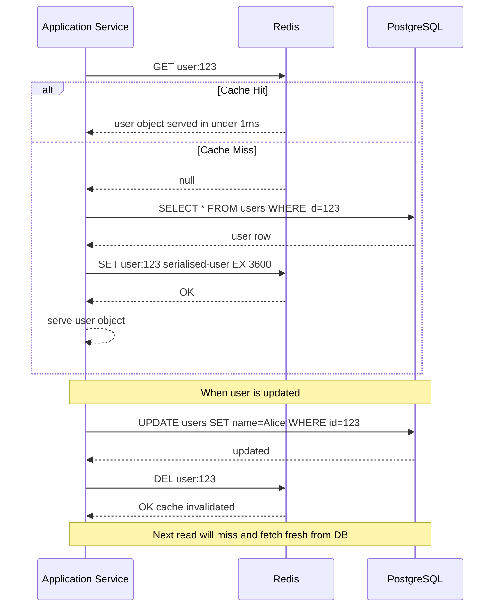
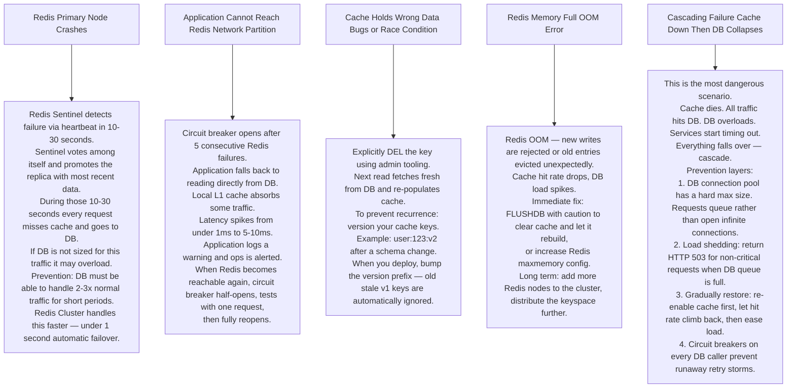

# Pattern 07 — Distributed Cache (Redis / Memcached)

---

## ELI5 — What Is This?

> Every time you ask "what is 99 × 99?" your brain calculates it.
> But after the first time, you just remember the answer — 9801.
> You cached it. A distributed cache is millions of such remembered answers
> shared across many servers so the database never has to answer the same question twice.

---

## Glossary

| Word | ELI5 Meaning |
|---|---|
| **Cache** | A fast temporary storage that holds the answer to a recent question so you do not have to re-compute it or re-fetch it from the slow database. |
| **TTL (Time To Live)** | An expiry date on a cached answer. After 1 hour the sticky note is thrown away and the next request fetches fresh from the database. Like milk with a best-before date. |
| **Cache Miss** | The sticky note is not on the board. You have to go to the filing cabinet (DB), get the answer, and put a new sticky note up. |
| **Cache Hit** | The sticky note is there. Answer in under 1ms. |
| **LRU (Least Recently Used)** | When the board is full, remove the sticky note that has not been looked at the longest. Like clearing your desk — toss what you haven't touched in months. |
| **LFU (Least Frequently Used)** | When full, remove the note that was looked at the fewest times. Keeps popular notes even if not looked at recently. |
| **Cache-Aside** | App checks cache first. If miss, fetches from DB, writes to cache, returns result. The app drives the cache. Most common pattern. |
| **Write-Through** | Every DB write also writes to cache. Cache is always current. Slower writes but always consistent. |
| **Write-Behind** | Write to cache only, write to DB later asynchronously. Fastest writes, risk of data loss if cache dies. |
| **Thundering Herd** | Many requests all miss the cache at the same moment and hammer the database simultaneously. Like hundreds of people knocking on a door at once. |
| **Cache Stampede** | Same as thundering herd but specifically when a popular item's TTL expires and everyone tries to rebuild it at the same time. |
| **Mutex** | A lock that only one person can hold at a time. In cache context: only one thread rebuilds the cache entry while others wait or serve stale data. |
| **Redis Sentinel** | A monitoring system that watches Redis and automatically promotes a replica to primary if the primary dies. |
| **Redis Cluster** | Splits data across multiple Redis nodes (shards). Each node owns a portion of the 16384 hash slots. |
| **Hash Slot** | Redis Cluster divides all possible keys into 16384 buckets. Each bucket is assigned to a node. Your key's bucket is calculated by running a math function (CRC16) on the key name. |

---

## Component Diagram

---

## Cache Patterns Compared

---

## Request Flow — Cache-Aside Pattern

---

## Bottlenecks — Every Point Explained

| # | Bottleneck | Why It Hurts | Fix |
|---|---|---|---|
| 1 | **Thundering Herd** | A popular cache entry expires at 14:00:00 exactly. 50,000 requests per second all miss at the same moment and hit the database. DB gets 50,000 queries in a 100ms window — it collapses. | Jitter the TTL: instead of exact 3600 seconds, use 3600 + random(0, 300). Entries expire at different times. |
| 2 | **Hot Key** | A celebrity's profile is fetched millions of times per second. All requests hash to the same Redis slot on the same node. That single node's CPU hits 100%. | Replicate the hot key: store as `user:123:copy1`, `user:123:copy2`... on different nodes. Client reads from a random copy. |
| 3 | **Cache Stampede** | A popular product page takes 500ms to compute from the database. While one thread is rebuilding it, 999 other threads also detect a miss and also start rebuilding — 1000 identical DB queries. | Mutex lock: first thread acquires lock and rebuilds. Others see the lock and either wait or serve the stale (slightly outdated) version for 500ms. |
| 4 | **Memory Pressure** | Cache is full. Redis starts evicting entries aggressively. Hot data gets evicted. Cache hit rate drops from 95% to 60%. DB sees a sudden 10x load spike. | Monitor Redis memory. Alert at 80% usage. Scale vertically or add cluster shards. Use LFU eviction to keep truly popular items. |
| 5 | **Consistency** | DB is updated. Cache is not invalidated (code bug or race condition). Users read stale data for up to the TTL duration. | Always explicitly DELETE the cache key on any write. Do not rely solely on TTL for correctness. |

---

## What Happens When Each Part Fails?

---

## Cache Sizing Formula

> **Rule of thumb:** Top 20% of your data handles 80% of your reads.
> Cache just that 20%.
>
> `Cache size = total data size × 0.20`
>
> Example: 10 million user profiles × 1 KB each = 10 GB total.
> Cache = 10 GB × 0.20 = **2 GB Redis** handles 80% of reads.

---

## Key Numbers

| Metric | Value |
|---|---|
| Redis single-node throughput | ~1 million ops/second |
| Redis GET latency | Under 1ms (P99) |
| Cache hit rate target | 95%+ |
| Thundering herd TTL jitter | 0 to 300 seconds random |
| Redis Sentinel failover time | 10-30 seconds |
| Redis Cluster failover time | Under 1 second |

---

## How All Components Work Together (The Full Story)

Think of a distributed cache as a two-floor city hall with an ultra-fast reception desk on the ground floor — and a massive but slower filing room upstairs.

**Normal read path (the layered cache):**
1. An application service (User Service, Product Service, Feed Service) first checks its **local in-process L1 cache** (Caffeine or an LRU map built into the process). This is sub-millisecond — just a hash map lookup in the same process memory. No network.
2. On an L1 miss, the service asks **Redis (L2 cache)** — a shared memory store across all service instances. This is 1ms over a local network.
3. On an L2 miss, the service goes to the **database (PostgreSQL/MongoDB)** — the authoritative source, typically 5-20ms.
4. After fetching from DB, the service writes back to Redis with a TTL, so the next request for the same key hits Redis instead.

**Write path (keeping cache consistent):**
- Service updates the **database** first (source of truth).
- Then immediately **deletes the Redis key** (not updates it, deletes it). Why delete and not update? Updating risks a race condition (two writers updating different cached values). Deletion forces the next read to fetch fresh from DB and re-populate the cache correctly.

**Thundering Herd protection:**
- Adding `random(0, 300)` seconds to every TTL means entries expire at different times, preventing the scenario where 10,000 entries all expire at 14:00:00 and simultaneously cause 10,000 DB queries.

**How the components support each other:**
- L1 (local) cache absorbs the fastest, cheapest repetitions — same service instance asking for the same user profile twice within 30 seconds.
- L2 (Redis) absorbs cross-service sharing — User Service node A and node B both want `user:123`. Redis answers both with one DB hit.
- **Redis Sentinel** is the watchdog: if the primary Redis node dies, Sentinel promotes a replica and updates all service connections within 10-30 seconds — invisible to users.
- **Redis Cluster** is the horizontal scaling layer: split 16,384 hash slots across N nodes. Each node only stores a fraction of the total keyspace, so you scale storage and throughput linearly.

> **ELI5 Summary:** L1 cache is your desk drawer — fastest to reach. L2 Redis is the office supply cabinet — shared with coworkers, still fast. Database is the warehouse across town — accurate but slow. Redis Sentinel is the office manager who replaces the supply cabinet if it breaks. Redis Cluster is having multiple supply cabinets in different rooms so no single cabinet gets overwhelmed.

---

## Key Trade-offs

| Decision | Option A | Option B | Why We Pick B (or A) |
|---|---|---|---|
| **Cache-Aside vs Write-Through** | Cache-Aside: app manages reads and writes manually | Write-Through: every DB write also updates the cache | **Cache-Aside** is the most common: lazy population, simple logic. Write-Through is useful when stale data is never acceptable (user balance). Write-Through doubles write latency — every save waits for both DB and cache. |
| **Delete on write vs update on write** | Update cache with new value on every DB write | Delete cache entry on every DB write | **Delete on write**: avoids race conditions. Two concurrent writers could write different values to cache. Delete forces a clean re-read from DB on next access. Slight latency cost on next read — acceptable. |
| **TTL-based expiry vs explicit invalidation** | Set a TTL, let items expire automatically | Explicitly delete cache keys on every write | **Both**: TTL is a safety net that catches cache entries whose keys were accidentally not invalidated. Explicit DEL is the preferred fast-path for correctness. Never rely on TTL alone for critical data. |
| **Redis Sentinel vs Redis Cluster** | Sentinel: one primary + replicas, automatic failover | Cluster: sharded keyspace, built-in failover, no single primary | **Sentinel** for simple high availability with a small dataset. **Cluster** when data exceeds a single node's RAM or you need sub-second failover. Cluster is more complex to operate. |
| **LRU vs LFU eviction policy** | LRU: evict the least recently used key | LFU: evict the least frequently used key | **LFU** (Redis 4.0+) for most caches: a key accessed 1000 times a day is more valuable than one accessed once an hour ago. LRU would evict the high-traffic key if it hasn't been accessed in the last minute. LFU keeps genuinely popular items. |
| **Small Redis with high DB fallback vs large Redis** | Small Redis (20% of data), frequent DB fallbacks | Large Redis (80% of data), rare DB fallbacks | **20% rule** is a good starting point (80/20 rule). Doubling Redis size from 20% to 40% of data typically yields only 5% more cache hit rate. Measure your workload's actual access distribution before over-provisioning. |

---

## Important Cross Questions

**Q1. Your cache hit rate drops from 95% to 60% overnight without any deployment. What do you investigate?**
> In order: (1) Check if Redis memory is full — eviction may be deleting hot entries (`redis-cli info memory`, `redis-cli info stats` for `evicted_keys`). (2) Check if a new access pattern has emerged — a marketing email sent 10M users to a product page that was never cached. (3) Check TTL values — someone may have incorrectly shortened TTLs. (4) Check Redis cluster rebalancing — a shard migration might temporarily redirect some keys to nodes that don't have them cached.

**Q2. Two processes simultaneously write to the DB and then try to set the cache. Can this cause a stale cache?**
> Yes — classic write race: Process A reads user profile, Process B writes an update and DELETEs the cache key, Process A (with the old value) writes to cache. Now the cache has the old value. **Fix**: don't update (SET) cache on write. Only DELETE. The next read will fetch fresh from DB and populate correctly. Alternatively, use cache versioning: include a version number in the key (`user:123:v2`). On read, only accept the version matching the current schema version.

**Q3. What is a "hot key" problem in Redis Cluster and how do you solve it?**
> A hot key is one that accounts for a disproportionate fraction of all Redis traffic. In Cluster mode, one key belongs to one slot on one node. If `user:celebrity` is fetched 1 million times per second, all 1M requests go to one Redis node → CPU 100%, everything else on that node slows down. **Fix**: Key replication. Store `user:celebrity:replica-0` through `user:celebrity:replica-9` on 10 different nodes. Client randomly reads from one replica. Write updates all replicas. Or: use a local L1 cache for hot keys to absorb 90% of reads before they hit Redis.

**Q4. What happens if you use Write-Behind caching and Redis crashes before the delayed DB write?**
> Data loss — the value in Redis was updated, the DB write was queued but never executed. The queue lives in Redis's memory. When Redis crashes, the queue is gone. DB still has the old value. On Redis restart, reads hit DB (stale value) and re-populate the cache. **Prevention**: only use Write-Behind for truly non-critical data (view counters, search history). Use Write-Through or Cache-Aside for anything important. If using Write-Behind, persist Redis with AOF (Append-Only File) to disk so the queue survives a restart.

**Q5. How do you handle a cache warming race at startup? Multiple new service instances all start at once, all miss cache, all hammer the DB.**
> Three strategies: (1) **Pre-warm**: a startup task fetches the top-N objects from DB and loads them into Redis before any service instance starts taking traffic. (2) **Request coalescing**: only one "cache filler" goroutine/thread runs per missing key — others wait for it. Implemented with a mutex per key. (3) **Gradual traffic ramp**: load balancer sends 5% of traffic to new instances for 60 seconds before sending full traffic. By then, cache is populated by real requests.

**Q6. How do you implement "cache the absence" — caching that a user/product does NOT exist to prevent repeated DB lookups?**
> Store a sentinel value: `SET user:99999 NULL EX 300` (cache "this key doesn't exist" with a 5-minute TTL). When the application reads this key and gets the sentinel, it knows immediately not to go to the DB — without going to the DB to confirm absence again. This is especially important for user profile lookups where a malicious actor sends requests for millions of non-existent user IDs (cache busting attack). A Bloom Filter is even more memory-efficient for this at extreme scale.

---

## Real-World Apps That Use This Pattern

| Company | Product | How They Use It |
|---|---|---|
| **Facebook** | Memcached ("Scaling Memcache at Facebook" — 2013 NSDI paper) | The most famous cache paper ever written. Facebook ran 800+ Memcached servers serving 1 billion requests/second. Key insights that became industry standard: (1) "Lease" mechanism to solve the thundering herd / cache stampede problem. (2) Regional pools for geographic data locality. (3) Separate memcached clusters for different hot-vs-cold workloads. This paper is required reading for any distributed cache interview at a large company. |
| **Twitter** | Redis Timeline Cache | Twitter stores the "home timeline" (pre-built feed of tweet IDs) for every active user in Redis Sorted Sets. Redis Cluster with hundreds of nodes. When a celebrity tweets, a fan-out worker writes the tweet ID to millions of Redis Sorted Sets simultaneously. On timeline read: Redis returns the sorted set of IDs — no database join needed for active users. This is the write-through + read-aside hybrid pattern. |
| **Airbnb** | Airbnb Search Cache | Pricing and availability for millions of listings are cached in Redis to serve search results in <50ms. Listing availability changes frequently (a booking voids availability) — Airbnb uses TTL-based expiry (short TTL for availability) + event-driven invalidation (a new booking immediately DELetes the listing's availability cache key). Cache-Aside pattern. |
| **Netflix** | EVCache | Netflix built EVCache (Ephemeral Volatile Cache) on top of Memcached. Key design: data is replicated across multiple AWS availability zones. If one AZ goes down, the cache is still warm in other AZs. Used for: user preferences, recently watched list, homepage personalization data. Netflix open-sourced EVCache; it handles billions of requests per day across their microservices. |
| **Stack Overflow** | Redis (famously minimal infra) | Stack Overflow runs on surprisingly few servers. Their entire site (millions of requests/day) is served by ~9 web servers + Redis cache. The engineering team published their server list showing Redis handles all session data, rate limiting, and hot query caching. Demonstrates that a well-implemented cache can dramatically reduce DB load — Stack Overflow's DB servers are mostly idle. |
| **Redis Labs / Upstash** | Redis as a Service | The commercial SAAS versions of exactly this architecture. Upstash is the serverless Redis used by Next.js / Vercel applications for rate limiting and session caching. Redis Enterprise (Redis Labs) offers Active-Active geo-replication — the "write to nearest region, async replicate everywhere" pattern for global cache consistency. |
