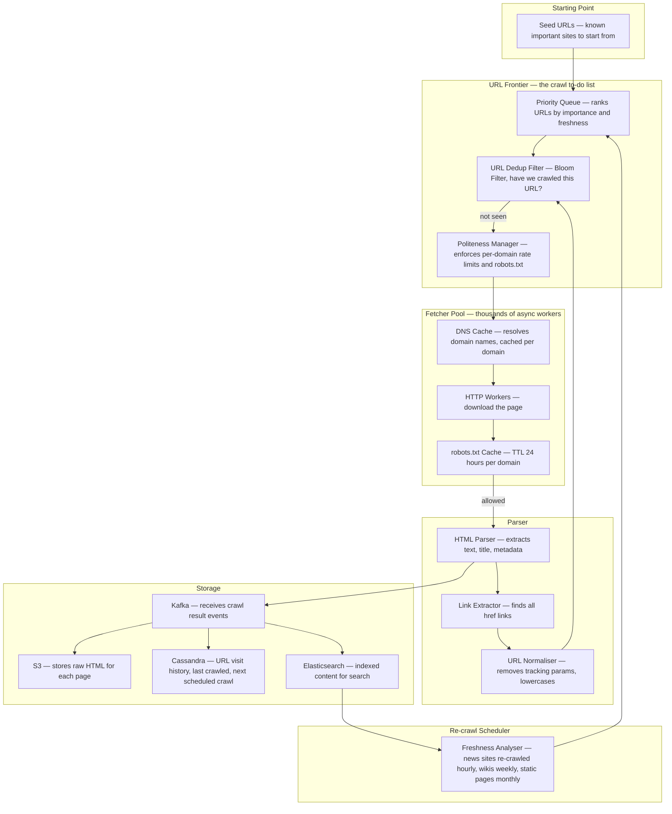
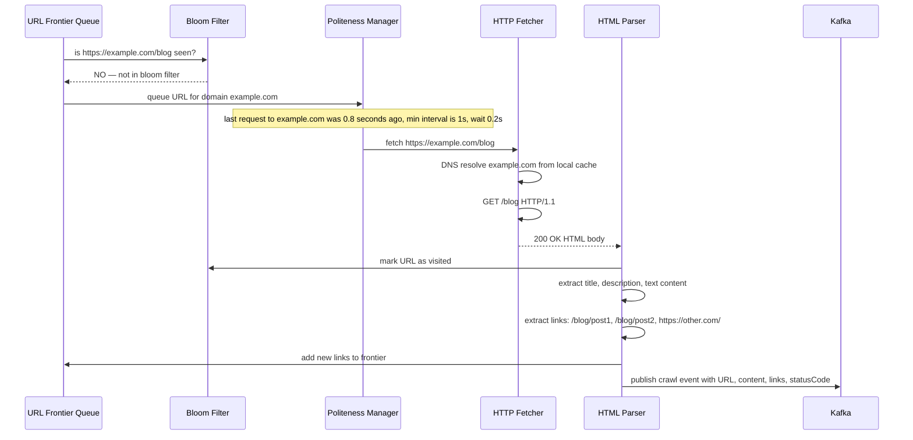
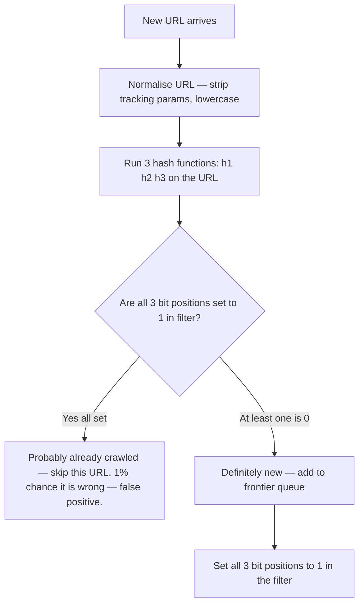
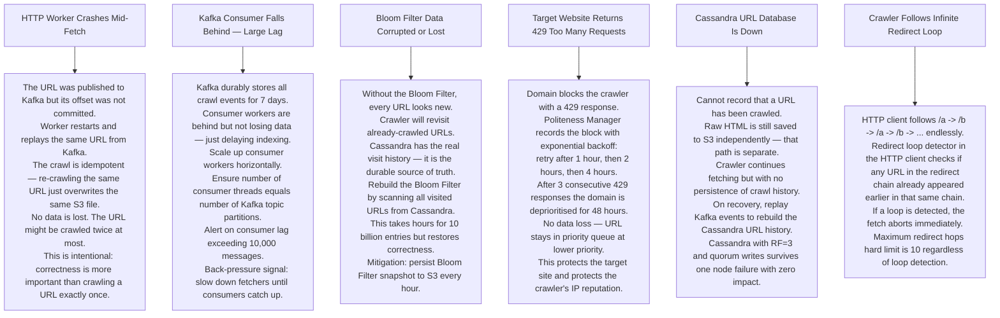

# Pattern 08 — Web Crawler (like Googlebot)

---

## ELI5 — What Is This?

> Imagine a robot in a giant library. It starts at one book, reads it,
> writes down what it found, then follows every "see also" reference to another book.
> It goes to that book, reads it, writes it down, follows its references.
> It keeps going forever across billions of books.
> That robot is a web crawler — it reads the entire internet by following links.

---

## Glossary

| Word | ELI5 Meaning |
|---|---|
| **URL Frontier** | The list of URLs waiting to be visited. Like a to-do list that keeps growing as you discover new links. |
| **Bloom Filter** | A memory-efficient way to answer "have I seen this URL before?" It uses bits (tiny on/off flags) instead of storing full URLs. Can occasionally say "yes" when the answer is "no" (false positive) but never says "no" when the answer is "yes". |
| **False Positive** | The Bloom Filter says "yes, already visited" but it is actually a new URL. This means the URL is skipped incorrectly — about 1% of the time. Acceptable to save 80x memory. |
| **Politeness** | Crawlers must not hammer a website too fast. robots.txt is a file websites publish telling crawlers what they are allowed to crawl and how fast. |
| **robots.txt** | A plain-text file at the root of every website (e.g. example.com/robots.txt) that says "you may crawl /blog but not /admin, and wait 1 second between requests". |
| **URL Normalisation** | Converting a URL to a standard form. `HTTPS://Example.COM/page?ref=abc` becomes `https://example.com/page` — tracking parameters stripped, case lowercased. |
| **Spider trap** | An infinite sequence of auto-generated URLs like /calendar/2024/01/01/2024/01/02/... that lures crawlers into looping forever. |
| **SimHash** | A technique that produces a fingerprint of a text document. Two nearly-identical documents have very similar fingerprints, making near-duplicate detection fast. |
| **Idempotent** | Doing the same thing twice gives the same result as doing it once. A crawl that processes the same URL twice produces the same stored content — safe to replay. |
| **Hinted Handoff** | When a Cassandra node is down and a write comes in, the other nodes hold the write as a "hint" and deliver it when the dead node recovers. Nothing is lost. |

---

## Component Diagram

---

## Request Flow — One URL Crawled

---

## Bloom Filter — How It Works

> **Why not just a hash set?**
> 10 billion URLs × 100 bytes each = 1 TB of RAM.
> Bloom Filter for 10 billion URLs at 1% false positive rate = only 12 GB.
> You accept crawling 1% of URLs twice to save 980 GB of RAM.

---

## Bottlenecks — Every Point Explained

| # | Bottleneck | Why It Hurts | Fix |
|---|---|---|---|
| 1 | **URL Frontier too large for memory** | Billions of discovered URLs cannot fit in an in-memory queue. | Back the priority queue with Kafka — disk-persistent, distributed, survives restarts. |
| 2 | **DNS resolution latency** | Each new domain needs a DNS lookup — 50ms per lookup × billions of pages = enormous overhead. | Cache DNS results per domain with a TTL of 5 minutes. Most pages are on domains already resolved recently. |
| 3 | **Spider trap** | Auto-generated infinite URLs like /year/month/day/... trap crawler in an infinite loop eating all resources. | Maximum depth limit of 10 levels. Detect repeating URL path patterns and blacklist them. |
| 4 | **Duplicate content** | Same article at /page?lang=en and /page?lang=en-US. Wastes crawl budget. | URL normalisation removes redundant parameters. SimHash fingerprint detects near-duplicate content. |
| 5 | **robots.txt fetched too often** | Fetching robots.txt for every page on a domain wastes requests. | Cache robots.txt per domain for 24 hours. |
| 6 | **Malformed HTML crashes parser** | About 30% of web pages have broken HTML. An uncaught exception kills the worker. | Use lenient HTML parsers (Cheerio, html5lib). Sandbox each parse with a 5-second timeout. |

---

## What Happens When Each Part Fails?

---

## Key Numbers

| Metric | Value |
|---|---|
| Google indexed pages | ~130 trillion |
| Bloom Filter for 10B URLs at 1% FP | ~12 GB |
| DNS cache TTL | 5 minutes |
| robots.txt cache TTL | 24 hours |
| Max crawl depth | 10 levels |
| 429 retry backoff | 1h, 2h, 4h, 8h |
