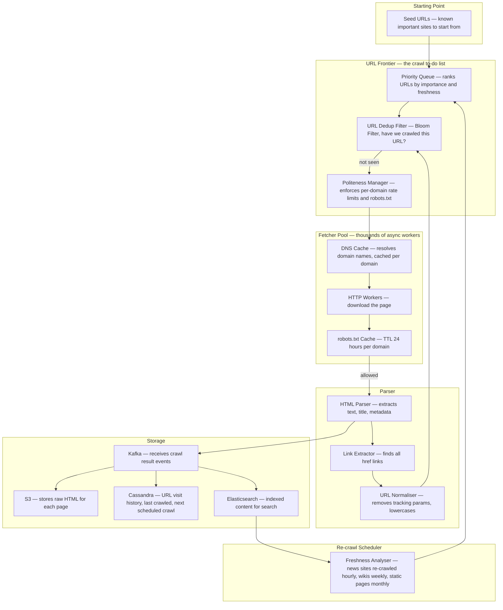
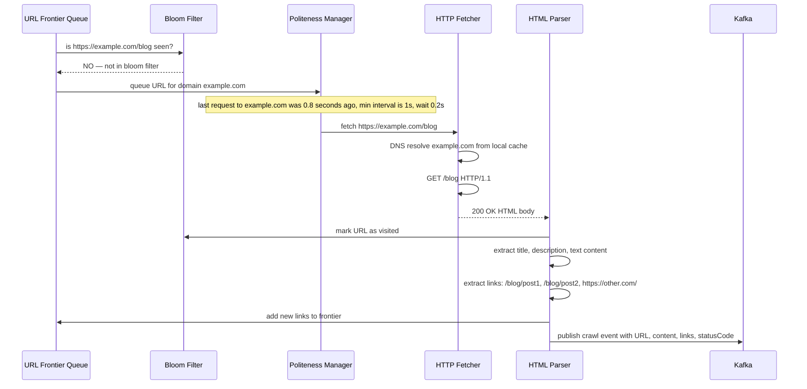
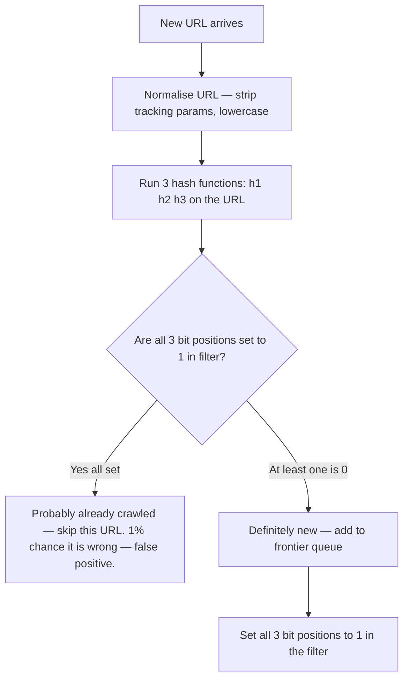
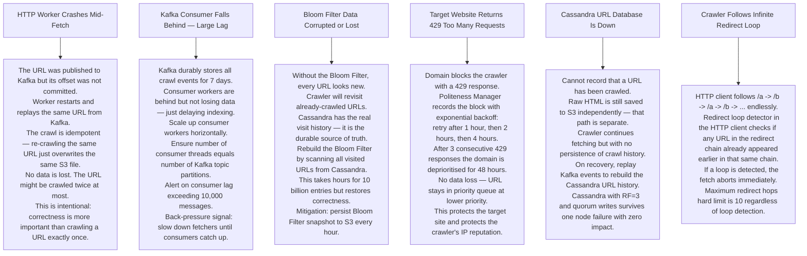

# Pattern 08 — Web Crawler (like Googlebot)

---

## ELI5 — What Is This?

> Imagine a robot in a giant library. It starts at one book, reads it,
> writes down what it found, then follows every "see also" reference to another book.
> It goes to that book, reads it, writes it down, follows its references.
> It keeps going forever across billions of books.
> That robot is a web crawler — it reads the entire internet by following links.

---

## Glossary

| Word | ELI5 Meaning |
|---|---|
| **URL Frontier** | The list of URLs waiting to be visited. Like a to-do list that keeps growing as you discover new links. |
| **Bloom Filter** | A memory-efficient way to answer "have I seen this URL before?" It uses bits (tiny on/off flags) instead of storing full URLs. Can occasionally say "yes" when the answer is "no" (false positive) but never says "no" when the answer is "yes". |
| **False Positive** | The Bloom Filter says "yes, already visited" but it is actually a new URL. This means the URL is skipped incorrectly — about 1% of the time. Acceptable to save 80x memory. |
| **Politeness** | Crawlers must not hammer a website too fast. robots.txt is a file websites publish telling crawlers what they are allowed to crawl and how fast. |
| **robots.txt** | A plain-text file at the root of every website (e.g. example.com/robots.txt) that says "you may crawl /blog but not /admin, and wait 1 second between requests". |
| **URL Normalisation** | Converting a URL to a standard form. `HTTPS://Example.COM/page?ref=abc` becomes `https://example.com/page` — tracking parameters stripped, case lowercased. |
| **Spider trap** | An infinite sequence of auto-generated URLs like /calendar/2024/01/01/2024/01/02/... that lures crawlers into looping forever. |
| **SimHash** | A technique that produces a fingerprint of a text document. Two nearly-identical documents have very similar fingerprints, making near-duplicate detection fast. |
| **Idempotent** | Doing the same thing twice gives the same result as doing it once. A crawl that processes the same URL twice produces the same stored content — safe to replay. |
| **Hinted Handoff** | When a Cassandra node is down and a write comes in, the other nodes hold the write as a "hint" and deliver it when the dead node recovers. Nothing is lost. |

---

## Component Diagram

---

## Request Flow — One URL Crawled

---

## Bloom Filter — How It Works

> **Why not just a hash set?**
> 10 billion URLs × 100 bytes each = 1 TB of RAM.
> Bloom Filter for 10 billion URLs at 1% false positive rate = only 12 GB.
> You accept crawling 1% of URLs twice to save 980 GB of RAM.

---

## Bottlenecks — Every Point Explained

| # | Bottleneck | Why It Hurts | Fix |
|---|---|---|---|
| 1 | **URL Frontier too large for memory** | Billions of discovered URLs cannot fit in an in-memory queue. | Back the priority queue with Kafka — disk-persistent, distributed, survives restarts. |
| 2 | **DNS resolution latency** | Each new domain needs a DNS lookup — 50ms per lookup × billions of pages = enormous overhead. | Cache DNS results per domain with a TTL of 5 minutes. Most pages are on domains already resolved recently. |
| 3 | **Spider trap** | Auto-generated infinite URLs like /year/month/day/... trap crawler in an infinite loop eating all resources. | Maximum depth limit of 10 levels. Detect repeating URL path patterns and blacklist them. |
| 4 | **Duplicate content** | Same article at /page?lang=en and /page?lang=en-US. Wastes crawl budget. | URL normalisation removes redundant parameters. SimHash fingerprint detects near-duplicate content. |
| 5 | **robots.txt fetched too often** | Fetching robots.txt for every page on a domain wastes requests. | Cache robots.txt per domain for 24 hours. |
| 6 | **Malformed HTML crashes parser** | About 30% of web pages have broken HTML. An uncaught exception kills the worker. | Use lenient HTML parsers (Cheerio, html5lib). Sandbox each parse with a 5-second timeout. |

---

## What Happens When Each Part Fails?

---

## Key Numbers

| Metric | Value |
|---|---|
| Google indexed pages | ~130 trillion |
| Bloom Filter for 10B URLs at 1% FP | ~12 GB |
| DNS cache TTL | 5 minutes |
| robots.txt cache TTL | 24 hours |
| Max crawl depth | 10 levels |
| 429 retry backoff | 1h, 2h, 4h, 8h |

---

## How All Components Work Together (The Full Story)

Think of the web crawler as a postal service that needs to deliver and collect mail from every address in the world — including addresses that keep generating new addresses as you visit them.

**The crawl loop (continuous):**
1. The **URL Frontier Priority Queue** (backed by Kafka for persistence) pops the highest-priority URL. Priority is calculated from: last crawl age, page rank estimate, freshness (news sites > static pages).
2. The **Bloom Filter** answers "have we seen this exact URL before?" in under 1ms using almost no memory. A "probably yes" answer discards the URL. A definitive "no" answer passes it through.
3. The **Politeness Manager** checks: (a) Did we fetch `robots.txt` for this domain? (cached 24h). Is this URL path allowed? (b) What is the minimum time between requests to this domain? Has enough time passed?
4. The **HTTP Fetcher** resolves DNS (cached 5 min per domain) and downloads the page. It checks robots.txt compliance one more time.
5. The downloaded page goes to the **HTML Parser**, which extracts clean text, identifies the page title and metadata, and finds all `<a href>` links.
6. The **URL Normaliser** standardizes each discovered link (lowercase, strip tracking params). Normalised URLs are fed back into the Bloom Filter check → Priority Queue — the cycle continues.
7. The **Kafka** topic receives the crawl result event. Three consumers simultaneously process it: raw HTML goes to **S3**, URL visit metadata goes to **Cassandra**, indexed content goes to **Elasticsearch**.

**How the components support each other:**
- Bloom Filter protects the Priority Queue from exploding — without it, every discovered link would re-enter the queue, causing infinite loops.
- Kafka decouples fetching from indexing → if Elasticsearch is slow, fetching continues. The crawl pipeline doesn't wait for indexing.
- S3 stores raw HTML separately from the index, allowing re-processing (re-indexing, re-parsing) without re-crawling.
- Cassandra tracks "last crawled at" per URL — this is how the Freshness Analyser decides when to re-crawl each page.

> **ELI5 Summary:** Bloom Filter is the list of streets already visited. Priority Queue is the sorted to-do list. HTML Parser is the robot reading the mail and writing down new addresses found inside. Kafka is the sorting machine at the post office. S3 is the archive room. Cassandra is the records department. Elasticsearch is the searchable directory.

---

## Key Trade-offs

| Decision | Option A | Option B | Why We Pick B (or A) |
|---|---|---|---|
| **Bloom Filter vs Hash Set for dedup** | Hash Set — exact deduplication, 100% correct | Bloom Filter — 1% false positive rate, 80× less memory | **Bloom Filter** for web scale. 10B URLs × 100 bytes in a hash set = 1 TB RAM. Bloom Filter = 12 GB. Accepting 1% of URLs crawled twice is a very acceptable trade-off. |
| **Breadth-first vs depth-first crawl** | BFS — explore all links at one level before going deeper | DFS — follow each link chain to its end | **BFS** for web crawling: important pages (high-rank, many inlinks) are typically reachable in fewer hops. DFS risks getting trapped in deep link chains on low-value sites. |
| **Centralized queue vs distributed queue** | Single in-memory priority queue | Kafka-backed distributed queue (persistent, survives restarts) | **Kafka-backed** for any production crawler. A crash without Kafka loses the entire frontier. Kafka stores the queue on disk — a restart continues from where it stopped. |
| **Crawl everything vs respect robots.txt** | Ignore robots.txt — index everything | Strictly follow robots.txt | **Respect robots.txt**: legal and ethical requirement. Sites that are abusively crawled can block your IP range permanently, costing you access to that entire domain forever. |
| **Page freshness: recrawl interval by content type** | Recrawl all pages at the same fixed interval | Different intervals: news hourly, wikis weekly, static pages monthly | **Adaptive recrawl**: crawl budget is finite. Spending it on static CSS files that haven't changed in years wastes budget that could go to fresh news articles. Freshness analysis maximises index quality per crawl dollar spent. |
| **SimHash for near-duplicate detection vs MD5** | MD5 hash — exact duplicate detection only | SimHash — detects near-duplicate content (same article, different layout) | **SimHash**: two web pages with 95% identical text but different headers/footers have different MD5 hashes. SimHash produces similar fingerprints for similar content. Essential for avoiding indexing the same article published on 1000 different sites. |

---

## Important Cross Questions

**Q1. The same news article is published on 1000 different news aggregator websites. How does the crawler avoid indexing 1000 near-duplicates?**
> SimHash: compute a 64-bit fingerprint of the article's text content. Near-duplicate documents produce fingerprints that differ by 3 or fewer bits. Store all fingerprints in a hashtable. Before indexing, compute the new page's SimHash and check if a similar fingerprint already exists. If yes, flag as near-duplicate and discard or store reference to canonical source only. The canonical source is usually the one with the earliest crawl date and highest PageRank.

**Q2. A website's robots.txt says "crawl delay: 60 seconds". You have 10 billion pages to crawl. At this rate, crawling just this one site would take centuries. How do you balance politeness with crawl speed?**
> Parallelism across domains: honor the 60-second delay for THIS domain, but simultaneously crawl 10,000 OTHER domains with no such restriction. The politeness constraint is per-domain, not global. For large, important sites with aggressive rate limits (Reddit, Twitter): negotiate a dedicated API or a sitemap file that provides direct page lists without needing to follow every link.

**Q3. How would you implement a "focused crawler" that only crawls pages about a specific topic (e.g., climate change)?**
> Add a relevance classifier at the Parser step. After extracting text from each page, run a lightweight ML text classifier (bag-of-words or small BERT model) that outputs a relevance score 0-1 for the target topic. Only add discovered URLs to the frontier if the parent page had relevance > 0.5. The frontier priority also incorporates relevance: high-relevance pages get higher priority. This focuses the crawl budget on topically relevant content.

**Q4. How does the crawler know when a page has changed and needs to be re-indexed?**
> Compare the new page's content hash (MD5 or SHA-1) with the stored hash from the last crawl (retrieved from Cassandra). If hashes match: page unchanged — update "last checked" timestamp but don't re-index. If hashes differ: page changed — re-index and update stored hash. The recrawl interval (how often to check) is adaptive: if a news site page changes every hour, recrawl hourly. If a Wikipedia article hasn't changed in 2 years, recrawl monthly.

**Q5. What prevents a malicious website from putting infinite links in its HTML to crash your crawler?**
> Multiple safeguards: (1) **Max links per page**: discard any links beyond the first 1000 found on a single page. (2) **Max crawl depth**: stop following links after 10 hops from a seed URL. (3) **Spider trap detection**: detect repeating path patterns like `/a/b/a/b/a/b...` and blacklist that URL pattern. (4) **Domain budget**: limit total pages crawled per domain per day (e.g. 10,000). (5) **Bloom Filter**: even if infinite unique URLs are generated, they slow down the crawl queue but are quickly detected as visited after the first one.

**Q6. How does Google's crawler handle JavaScript-heavy Single Page Applications that render content dynamically?**
> Simple HTTP fetchers receive empty HTML skeletons for SPAs — no content to index. Solution: **headless browser crawling**. Run a lightweight Chrome/Chromium instance (using Puppeteer or Playwright) that executes JavaScript, waits for the DOM to stabilize (or await a specific content signal), and then extracts the rendered HTML. This is 10-50× more resource-intensive than raw HTTP fetching. Google uses a two-queue strategy: raw HTML queue (fast, most sites) and rendered queue (slow, JavaScript-heavy sites identified from previous crawls).
