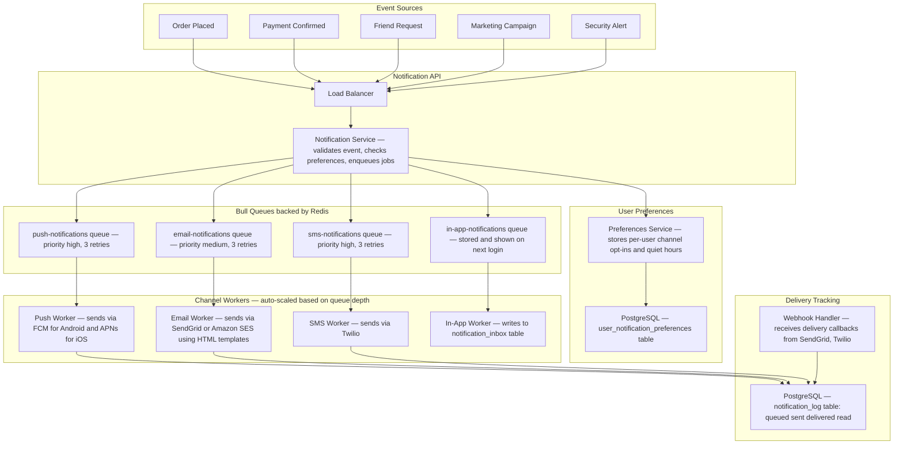
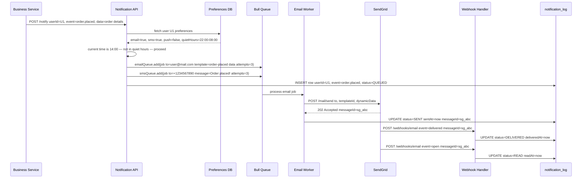
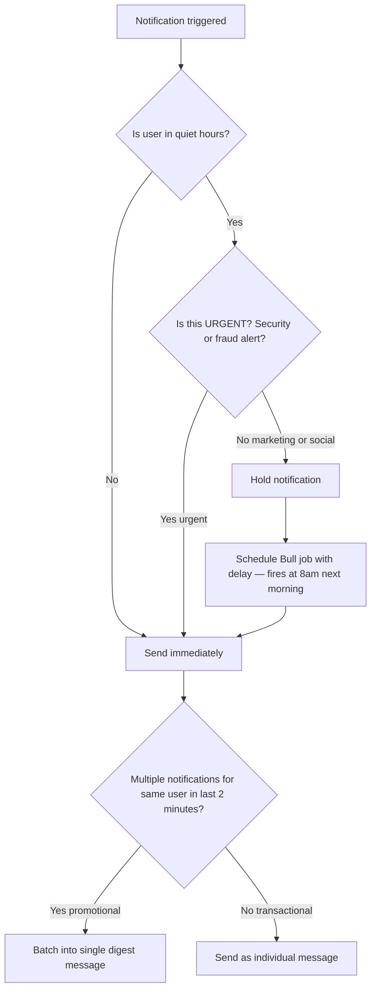
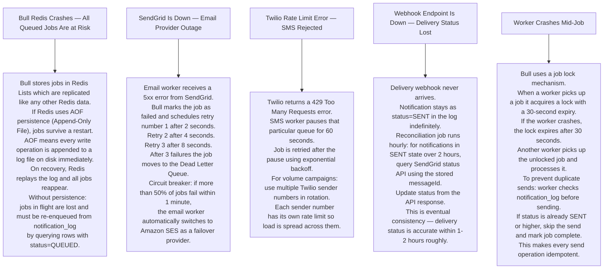

# Pattern 09 — Notification System (Push / Email / SMS)

---

## ELI5 — What Is This?

> A pizza place needs to tell you when your pizza is ready.
> Some people want a phone call, some a text, some an app buzz.
> The notification system is one central announcer that figures out
> HOW you prefer to be told, then sends the message the right way —
> without slowing down the pizza kitchen one bit.

---

## Glossary

| Word | ELI5 Meaning |
|---|---|
| **Bull Queue** | A job queue built on top of Redis. You drop in a job (send this email), workers pick it up, do it, report success or failure. Failed jobs are retried automatically. |
| **Worker** | A process that picks jobs off a queue and executes them. Like a factory employee who picks the next task off the conveyor belt. |
| **FCM (Firebase Cloud Messaging)** | Google's delivery service for push notifications to Android phones. |
| **APNs (Apple Push Notification service)** | Apple's delivery service for push notifications to iPhones. |
| **Device Token** | A unique ID assigned by FCM or APNs to your specific app installation. The server sends the notification to the token — FCM/APNs routes it to your device. |
| **Webhook** | A callback URL. When SendGrid successfully delivers your email, it sends an HTTP POST to your webhook URL saying "delivered!". Like a delivery person leaving a note saying "package left at door". |
| **Idempotency** | Doing the same thing twice gives the same result. If a notification job runs twice, the user receives only one notification. |
| **Exponential Backoff** | Retry strategy: wait 2s, then 4s, then 8s, then 16s before each retry. Avoids hammering a struggling service. Like giving someone more time between attempts to answer the door. |
| **Dead Letter Queue (DLQ)** | Where failed jobs go after exhausting all retries. A parking lot for broken jobs. Engineers inspect it to understand what went wrong. |
| **Quiet Hours** | A user preference: do not send marketing notifications between 10pm and 8am. Transactional and urgent messages bypass this. |
| **Digest** | Bundling multiple notifications into one. Instead of 10 separate "liked your post" notifications, send one: "10 people liked your post". |

---

## Component Diagram

---

## Notification Send Flow

---

## Quiet Hours and Batching Logic

---

## Bottlenecks — Every Point Explained

| # | Bottleneck | Why It Hurts | Fix |
|---|---|---|---|
| 1 | **Provider rate limits** | SendGrid free tier allows 100 emails/second. A marketing blast to 5 million users would take 14 hours at that rate. | Use multiple SendGrid sub-accounts or switch to Amazon SES which has higher limits. Throttle queue concurrency to match provider limits. |
| 2 | **Marketing blast creates millions of Bull jobs at once** | Enqueueing 5 million jobs instantly bloats Redis memory and overwhelms workers. | Paginated batch strategy: enqueue 1000 users per parent job. Each parent job spawns 1000 individual send jobs. Total memory is controlled. |
| 3 | **Stale device tokens** | User uninstalls app. Their FCM device token is now dead. Push will fail silently for every notification after uninstall. | When FCM returns a `NotRegistered` or `InvalidRegistration` error code, immediately delete that token from the database. Do not retry. |
| 4 | **Webhook events arrive out of order or duplicated** | SendGrid sends "delivered" then "opened" but they arrive "opened" then "delivered". Status machine goes wrong. | Use ordered status progression: QUEUED → SENT → DELIVERED → READ. Only update if incoming status is higher than current. Idempotency key on messageId prevents duplicate updates. |
| 5 | **Checking preferences at enqueue time only** | User opts out of marketing after jobs are already queued. Jobs execute anyway, violating GDPR. | Always re-check user preferences at job execution time, not only at enqueue time. |

---

## What Happens When Each Part Fails?

---

## Notification Priority Reference

| Type | Channels | Quiet Hours | Batch |
|---|---|---|---|
| Security OTP, fraud alert | SMS + Email | Bypass always | Never |
| Transactional (order, payment) | Push + Email | Bypass | Never |
| Social (likes, follows) | Push + In-app | Respect | Yes 5 min |
| Marketing / promo | Email + Push | Respect | Yes |
| Weekly digest | Email | Respect | Yes |

---

## Key Numbers

| Metric | Value |
|---|---|
| Facebook daily notifications | ~10 billion |
| Email delivery rate target | 99%+ |
| Push notification latency | Under 500ms |
| SMS delivery latency | Under 3 seconds |
| Bull retry strategy | 3 attempts, exponential backoff |
| Job lock expiry | 30 seconds |
