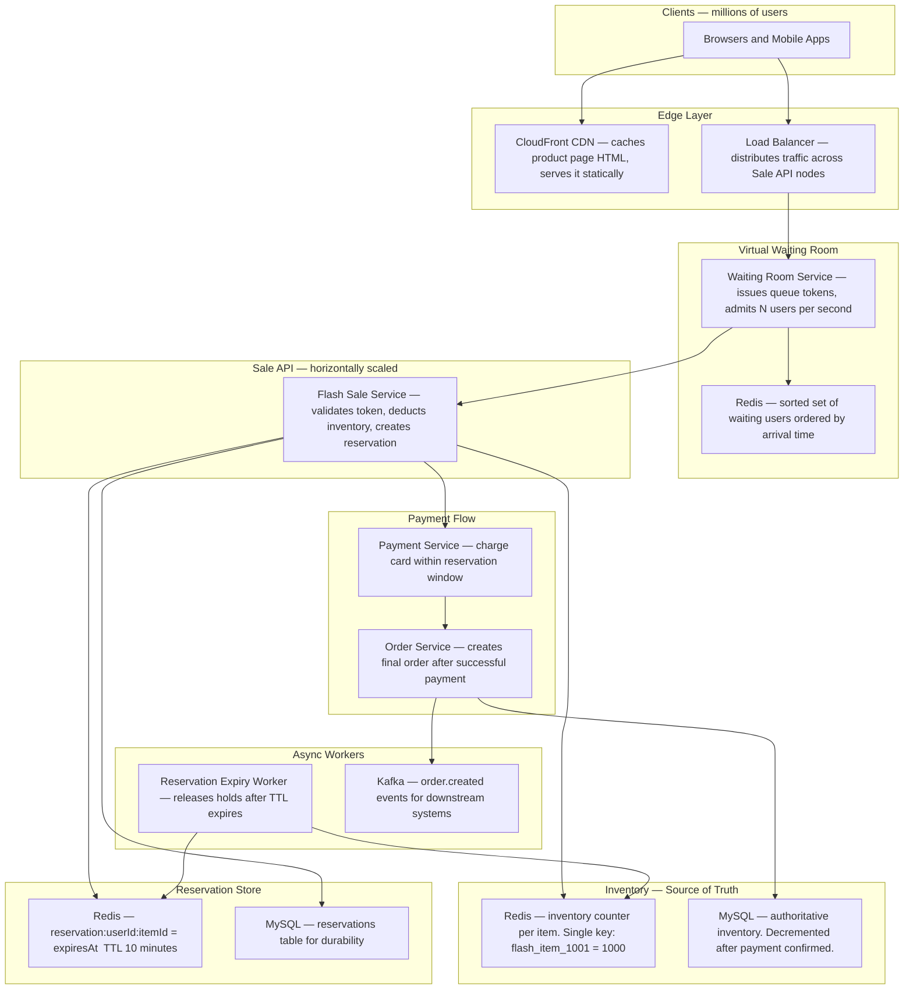
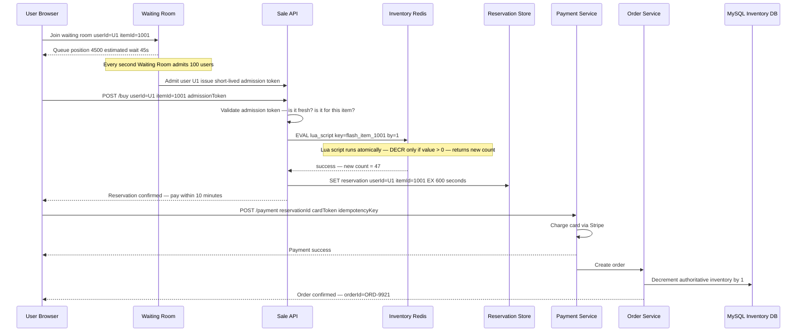
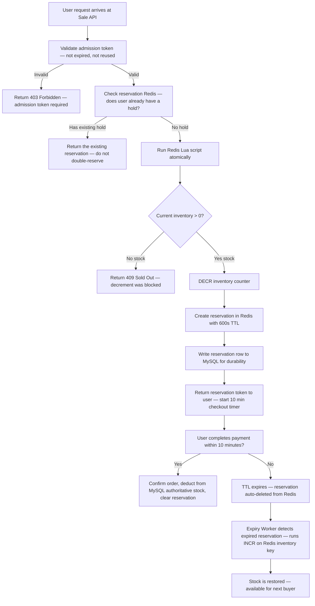
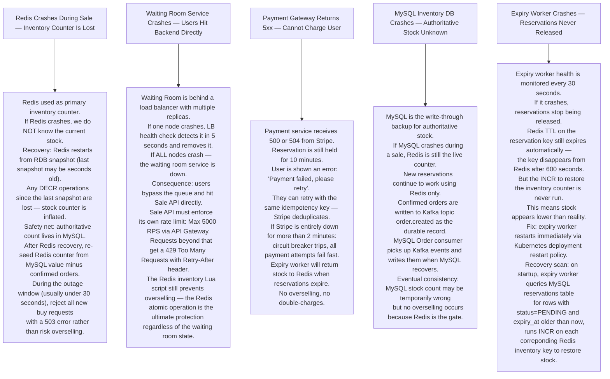

# Pattern 10 — Flash Sale / Inventory System

---

## ELI5 — What Is This?

> Imagine a game store announces 1000 limited-edition consoles at 9am.
> A million people hit the website the moment the clock strikes 9.
> The store must NOT sell the same console twice,
> must NOT crash under the load,
> and must tell 999,000 disappointed people they missed out — fairly.
> This is the Flash Sale problem.

---

## Glossary

| Word | ELI5 Meaning |
|---|---|
| **Atomic Operation** | An action that is either fully done or not done at all — never halfway. Like flipping a light switch: it cannot be "half on". Redis atomic operations ensure no two users can claim the same item simultaneously. |
| **Redis DECR** | A Redis command that subtracts 1 from a number and returns the new value, all in one uninterruptible step. Used to reduce inventory count safely under heavy load. |
| **Overselling** | Selling 10 items when you only had 5. Happens when two users check stock at the same moment (both see 1 left), then both buy it. |
| **Race Condition** | When two processes run at the same time and interfere with each other because they both read "old" data before either writes "new" data. The root cause of overselling. |
| **Optimistic Locking** | Before writing, check if anyone else changed the data since you read it. If yes, retry. Like checking if someone moved your bookmark before continuing to read. |
| **Lua Script** | A tiny script language that Redis can run atomically. The script runs entirely before Redis handles any other command. Prevents race conditions. |
| **Virtual Waiting Room** | A queue that admits users in batches (like a ticket-taker letting 100 people in at a time). Protects the main system from millions of simultaneous requests. |
| **Reservation / Hold** | Temporarily locking one unit for a user during checkout. Like a shopping cart with a 10-minute timer — if they do not complete payment, the item is released. |
| **Idempotency Key** | A unique token the client sends with a request so that if the request is sent twice (network error, double click), the server recognizes the duplicate and does not process it twice. |
| **Circuit Breaker** | A protection switch. If a service fails too many times in a row, the circuit breaker "trips" and stops sending requests to that service for a while, preventing a cascade of failures. |
| **Back-pressure** | A signal from a downstream system saying "slow down, I am overwhelmed". Like a kitchen putting up a "wait" sign so the dining room stops taking new orders. |

---

## Component Diagram

---

## Purchase Flow — Step by Step

---

## Inventory Claim — Lua Script Logic

---

## Bottlenecks — Every Point Explained

| # | Bottleneck | Why It Hurts | Fix |
|---|---|---|---|
| 1 | **Single Redis key for inventory** | All writes go to one key. Redis is single-threaded so each DECR is sequential. At 1M requests per second this becomes a queuing bottleneck. | Use multiple inventory slots (sharding): item 1001 becomes keys `1001-0` through `1001-9`. Assign users to a slot by hashing their userId. Aggregate counts across slots. |
| 2 | **Million simultaneous connections on sale start** | Every user refreshes at 9am exactly. Load balancers and app servers get a vertical spike that lasts about 10 seconds then drops to baseline. Hard to auto-scale that fast. | Virtual waiting room absorbs the traffic. The system admits a fixed number of users per second that the backend can handle. |
| 3 | **Race between reservation expiry and payment** | User is at checkout. Timer runs out at exactly the same millisecond they click "Pay". Expiry worker frees the stock. DECR runs again for someone else. User gets charged but item is gone. | Grace period: expiry worker runs at TTL+5 seconds. Payment service checks reservation is still valid before charging. If expired, payment is rejected and user refunded instantly. |
| 4 | **Payment timeouts causing phantom holds** | Payment gateway times out after 30 seconds. Item is still reserved. Other users cannot buy it. Timeout happens 5% of the time at peak load. | Reservation TTL is 10 minutes. If payment gateway times out, user can retry within that window. Idempotency key on payment ensures a retry does not double-charge. |
| 5 | **Order service DB write throughput** | MySQL can handle ~5000 writes per second. A 10000-unit flash sale that sells in 30 seconds is 333 writes/second — fine. But confirmation emails, inventory audit logs, and analytics all write simultaneously, multiplying load. | Decouple via Kafka: Sale API acknowledges purchase immediately, writes order.created event to Kafka. Downstream services (email, analytics, inventory DB) consume at their own pace. |

---

## What Happens When Each Part Fails?

---

## Key Numbers

| Metric | Value |
|---|---|
| Redis DECR latency | Under 1ms |
| Reservation TTL | 10 minutes (600 seconds) |
| Waiting room admission rate | 100-500 users per second (tunable) |
| Maximum Redis throughput (single key) | ~100,000 ops/second |
| Payment gateway timeout | 30 seconds |
| Stock recovery time after Redis crash | Under 60 seconds |
| MySQL write throughput | ~5,000 writes/second |

---

## How All Components Work Together (The Full Story)

Think of a flash sale system as a limited-edition concert venue. There are only 1000 seats. Millions of fans try to get in at once. The venue has a virtual queue outside, a turnstile that counts entries atomically, a 10-minute checkout timer per seat, and a refund process if you don't pay in time.

**Before the sale starts:**
- The **CDN** serves the static product page (description, images, price) to millions of users. No backend load from page browsing.
- The Redis inventory counter is pre-seeded: `SET flash_item_1001 1000` — exactly 1000 units available.

**When the sale opens (the chaotic first seconds):**
1. Millions of users hit the **Waiting Room Service** simultaneously. This is one of the most critical pieces — it absorbs the vertical spike. Each user gets a queue position from a **Redis Sorted Set** (scored by arrival timestamp). The system admits a fixed N users per second (e.g. 200/s) based on backend capacity.
2. Admitted users receive a short-lived **admission token** (expires in 60 seconds). Without this token, the Sale API rejects requests.
3. The **Sale API** validates the token, then runs the **Redis Lua script**: "if `flash_item_1001 > 0`, decrement by 1 and return the new count; otherwise return -1". This entire check-and-decrement is atomic — no two users can both see "1 unit left" and both claim it.
4. On success, a **Reservation** is created in Redis with a 10-minute TTL and durably written to **MySQL**.
5. The user is directed to the checkout page. They have 10 minutes to complete payment via **Stripe/Payment Service**.
6. On successful payment, the **Order Service** writes the final order to MySQL, decrements the **authoritative MySQL inventory**, and publishes `order.created` to **Kafka** for downstream processing (email receipts, shipping).

**The Expiry safety net:**
- If a user abandons checkout, their Redis reservation TTL expires after 10 minutes. The **Expiry Worker** detects the expired reservation and runs `INCR flash_item_1001` — restoring 1 unit to the Redis counter, making it available for the next buyer.

> **ELI5 Summary:** Waiting Room is the queue outside the venue. Redis Lua script is the turnstile that counts heads atomically — one person at a time. Reservation is the ticket stub with a time limit. MySQL is the official seat registry. Expiry Worker is the usher who reclaims unpaid seats and resells them.

---

## Key Trade-offs

| Decision | Option A | Option B | Why We Pick B (or A) |
|---|---|---|---|
| **Redis as primary inventory vs MySQL** | Use MySQL with row-level locking for inventory | Use Redis for live inventory counter, MySQL for durability | **Redis**: MySQL row locking at 100K concurrent requests causes massive contention and dead-locks. Redis DECR is atomic and handles 100K+ ops/sec on a single key with sub-millisecond latency. |
| **Waiting room vs no waiting room** | Let all users hit Sale API directly | Virtual waiting room admits users in batches | **Waiting room**: at 1 million simultaneous users, the Sale API would receive more concurrent requests than Redis can handle for queue management. Waiting room decouples the chaotic arrival spike from the business logic. |
| **Reservation hold vs immediate purchase** | Reserve AND charge in the same step — no hold | Two-step: reserve now (hold the unit), charge in next step | **Two-step reservation**: payment takes 2-10 seconds (bank network). Holding the Redis counter blocked during payment would time-out other buyers. Reserve first (instant), then payment in parallel. |
| **Hard item limit vs oversell buffer** | Sell exactly N items, no exceptions | Allow up to 5% oversell, cancel excess orders, apologize and refund | **Exact limit**: oversell leads to fulfillment failures and customer service nightmares. Redis Lua atomic DECR guarantees no oversell at the cost of a small number of users seeing "sold out" due to reservations that may later expire. |
| **Single Redis inventory key vs sharded slots** | One key per item across all servers | Shard item into N sub-keys, aggregate counts | **Single key** for moderate scale (up to ~100K RPS). **Sharded slots** for extreme scale (millions of RPS): item 1001 split into `1001-0` through `1001-9`, each with 100 units. User hashed to a slot. Tradeoff: selling exactly 1000 units requires aggregating across all shards. |
| **Kafka for order processing vs synchronous DB writes** | Write order, inventory, email all synchronously in one transaction | Write order to Kafka, downstream services consume asynchronously | **Kafka**: synchronous writes across 3 services in a flash sale = 3 sequential operations under load. Kafka lets each service write at its own pace. Order creation returns instantly; downstream processing runs in background. |

---

## Important Cross Questions

**Q1. Two users click "Buy" at the exact same millisecond. There is only 1 unit left. How does your system ensure only one of them gets it?**
> The Redis Lua script runs atomically inside Redis's single-threaded command executor. Even if both requests arrive simultaneously at two different Sale API nodes, Redis processes one Lua script to completion before starting the other. The first script sees `count = 1`, decrements to 0, returns success. The second script sees `count = 0`, returns "sold out". No oversell is possible.

**Q2. A user has a reservation but their internet drops during payment. The 10-minute timer is ticking. What happens?**
> The reservation exists in Redis and MySQL with `expiresAt`. The user can re-open the app (or browser page) and continue checkout — the reservation is still valid for the remaining time. The same `reservationId` is shown on the checkout page. If payment succeeds before expiry: order confirmed. If they reconnect at minute 9.5, the payment gateway may report a timeout — user retries with the same idempotency key. If the 10 minutes fully expire, the Expiry Worker frees the unit and the user must re-enter the queue.

**Q3. How do you prevent bots from flooding the waiting room and taking all spots ahead of real users?**
> (1) **CAPTCHA challenge** at waiting room entry — bots fail, humans pass. (2) **Account age check** — newly created accounts get lower queue priority or are blocked from flash sales for X hours after creation. (3) **Purchase history limit** — each account can only claim 1 unit per flash sale. (4) **IP rate limiting** at the CDN/WAF layer — IP sending more than one waiting room request per second is throttled. (5) **Device fingerprinting** — detect multiple accounts using the same device/browser signature.

**Q4. The Redis inventory counter shows 50 units remaining but MySQL authoritative stock shows 45 units. How did this discrepancy happen and how do you fix it?**
> Gap scenarios: (a) 5 users reserved but payment failed AND the Expiry Worker ran twice (bug) restoring too many units. (b) Redis crashed and was re-seeded incorrectly. Reconciliation: the Expiry Worker or a nightly job cross-checks Redis counter against `(original_stock - confirmed_orders)` from MySQL. If there's a discrepancy, Redis is re-seeded from MySQL truth. The sale pauses briefly during re-seeding to prevent a window where both Redis and MySQL are being written to simultaneously.

**Q5. How do you implement a "waitlist" — users who missed the sale can be notified when a reservation expires?**
> After the sale sells out (Redis counter = 0), new users can join a **Waitlist Sorted Set** in Redis, scored by join timestamp. Every time the Expiry Worker frees a unit (INCR the counter), it simultaneously pops the top of the Waitlist and sends that user a notification with a special high-priority admission token valid for 5 minutes. This token bypasses the normal waiting room and goes directly to the Sale API. If the waitlisted user doesn't complete checkout in 5 minutes, the next person on the waitlist is notified.

**Q6. Why use a Lua script instead of a Redis transaction (MULTI/EXEC) for the inventory check?**
> Redis `MULTI/EXEC` is a transaction, but it doesn't support conditional logic inside the transaction block. You can't say "DECR only if value > 0" inside a `MULTI/EXEC` — you'd have to WATCH the key, check it in your app, then EXEC. Between the check and EXEC, another client could decrement, but WATCH catches this and the EXEC fails — requiring a retry loop in your application. **Lua script** is simpler: the entire conditional logic runs atomically inside Redis without any client-side retry. One network round trip, no race conditions, no retry needed.

---

## Real-World Apps That Use This Pattern

| Company | Product | How They Use It |
|---|---|---|
| **Amazon** | Amazon Lightning Deals | The canonical flash sale implementation. Lightning Deals run for a fixed window (4-12 hours) with a hard inventory cap. Amazon's "claim" flow (add to cart → 15-minute reservation → checkout) is exactly the reservation + expiry pattern. The progress bar showing "73% claimed" is a Redis counter rendered in real-time. Amazon's waiting room ("Join the waitlist") activates when demand far exceeds supply. At Prime Day scale: hundreds of millions of concurrent users, inventory exhausted in seconds for hero items. |
| **Flipkart** | Big Billion Day (India) | India's equivalent of Prime Day. During BBD 2023, Flipkart processed 1.8 million orders in the first 10 minutes. Key architectural achievement: pre-scaled Redis cluster, Waiting Room (virtual queue for top deals), geo-distributed data centers, and 48-hour pre-sale traffic simulation using shadow testing. BBD is used as an internal benchmark for Flipkart's infra team. |
| **Nike** | SNKRS App (Sneaker drops) | Hyped sneaker release architecture. SNKRS uses a lottery model ("Enter for a chance to buy") rather than pure first-come-first-served — specifically to combat bots. At the draw time, all entered users are randomly eligible. This avoids the need to handle 10M concurrent users in a race — instead all entries before the deadline are equally valid, and winners are selected post-close. Teaches that flash sale architecture choices (race vs lottery) are a product decision with technical implications. |
| **Ticketmaster** | Concert/Event Ticket Sales | The most hated wait queue in tech. Taylor Swift Eras Tour (2022): 3.5 billion system requests in one day crashed Ticketmaster's queue. Their architecture was overwhelmed because demand (14M users) was 70× supply (200K tickets). Post-mortem revealed: virtual waiting room did not scale, the reservation hold time (10 minutes) caused repeated release/re-grab cycles, and bots with faster connections gamed the queue. Provided the industry's most public case study for flash sale failure modes. |
| **Shopify** | Flash Sales for D2C Brands | Shopify's infrastructure powers thousands of individual brand flash sales (Supreme drops, Adidas Yeezy drops). Shopify's "inventory reservation" checkout API is the Redis-backed reservation pattern. For extreme drops, Shopify uses a "queue-it" virtual waiting room integration (third-party) to smooth traffic before it hits the checkout flow. Shopify's multi-tenant challenge: a flash sale on one merchant cannot affect checkout for other merchants — isolation via per-merchant Redis keyspace. |
| **Zomato / Swiggy** | Food Festival Deals | Food delivery apps run flash discount campaigns ("50% off for next 30 minutes at McDonald's"). Redis countdown timer shows remaining discount window. Inventory here is voucher count or restaurant order capacity rather than physical goods. The architecture handles the same concurrency problem: 100,000 users try to claim a 500-voucher deal simultaneously. Redis Lua script prevents over-issuance of vouchers the same way it prevents overselling physical inventory. |
