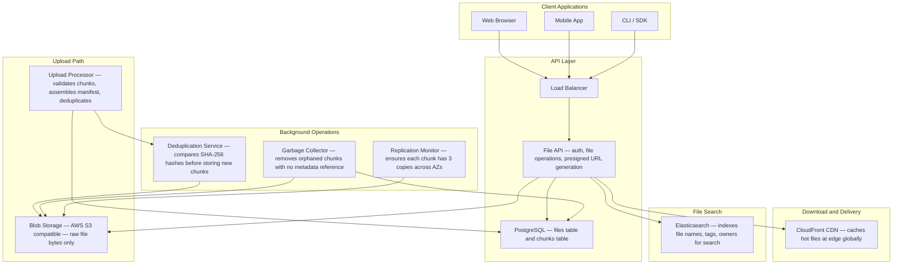
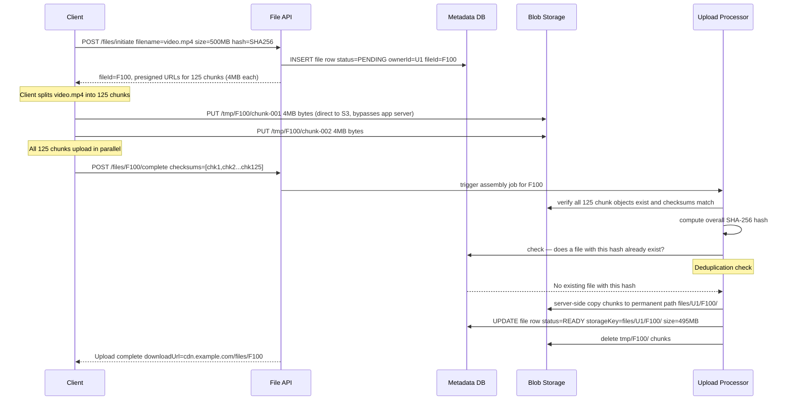
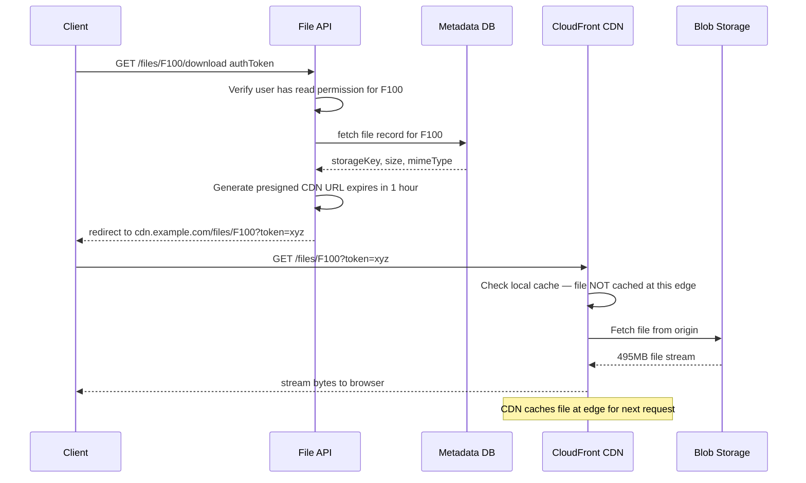
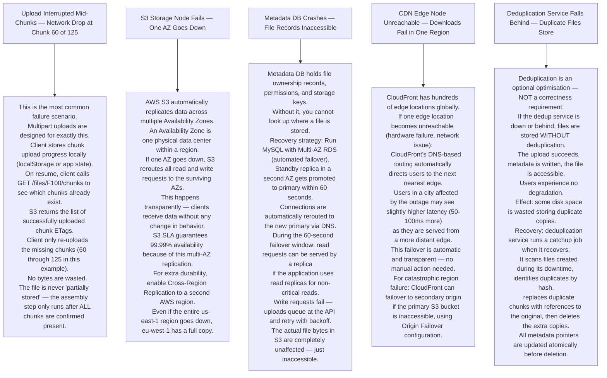

# Pattern 11 — File Storage System (like S3 / Dropbox)

---

## ELI5 — What Is This?

> Imagine a library that never loses books, even if one shelf collapses.
> You can store any file — photo, video, PDF, code —
> and retrieve it instantly, from anywhere in the world.
> The file is secretly split into chunks and stored in multiple physical locations,
> so losing any single location means nothing.
> That is a distributed file storage system.

---

## Glossary

| Word | ELI5 Meaning |
|---|---|
| **Blob Storage** | Binary Large Object storage. A system specifically designed to hold raw file bytes cheaply. Does not understand what is inside the file (unlike a database). Amazon S3 is blob storage. |
| **Metadata** | Data about data. For a file: its name, size, owner, creation time, which chunks it consists of, and where those chunks live. Stored in a fast database — NOT alongside the file bytes. |
| **Chunking** | Splitting a file into equal-sized pieces (e.g. 4 MB each). Each chunk is uploaded and tracked independently. Enables resumable uploads and parallel transfers. |
| **Presigned URL** | A temporary URL that lets a browser upload or download directly to blob storage (like S3) without routing through your application servers. The URL contains a cryptographic signature and expires after a short time. |
| **Multipart Upload** | Uploading a large file as multiple smaller parts simultaneously. Like sending a document as 5 faxes in parallel — all arrive at the same time, then are reassembled. |
| **Deduplication** | Detecting that two users uploaded the exact same file and storing it only once. Saves massive amounts of storage. |
| **Content Hash** | A fingerprint of a file's content (using SHA-256). If two files have the same hash, they have identical content. This is how deduplication works. |
| **Replication Factor** | How many copies of a file exist in different physical locations. AWS S3 uses replication factor 3 (or more). If one data center burns down, two others still have your file. |
| **CDN (Content Delivery Network)** | A network of servers spread around the world. When you download a file, you get it from the nearest CDN server, not from the main storage in a far-away data center. |
| **Erasure Coding** | Instead of storing 3 full copies, split the file into N pieces and add M parity pieces. You can reconstruct the file from any N pieces. Uses 1.5x storage instead of 3x. |
| **Object Key** | The unique name of a file in blob storage. Like a file path: `users/U1/photos/cat.jpg`. |
| **Garbage Collection** | A background process that finds file chunks no longer referenced by any metadata record and deletes them from blob storage to free space. |

---

## Component Diagram

---

## Upload Flow — Large File (Multipart)

---

## Download Flow

---

## Bottlenecks — Every Point Explained

| # | Bottleneck | Why It Hurts | Fix |
|---|---|---|---|
| 1 | **Large file upload through application server** | A 500 MB video routed through your API server wastes compute, saturates network interfaces, and delays other users. 10 simultaneous uploads would consume 5 GB of bandwidth at the API layer. | Presigned URLs: API issues a temporary signed URL, client uploads directly to S3. App server only processes the small metadata request. |
| 2 | **Metadata database fanout on directory listing** | User opens a folder with 50,000 files. `SELECT * FROM files WHERE parent_id = 'folder'` returns 50,000 rows. Slow and expensive. | Pagination: return 100 results at a time with cursor-based navigation. Index on `(owner_id, parent_folder_id, created_at)` to make queries fast. |
| 3 | **Storage cost of multiple large file copies** | Replication factor 3 means storing a 1 PB dataset costs 3 PB of raw storage. 3x cost multiplier. | Erasure coding: store `k` data shards + `m` parity shards. Common config: 4+2 (store 6 shards, any 4 can reconstruct the original). Uses 1.5x storage instead of 3x. Accept slightly higher reconstruction latency. |
| 4 | **Cold CDN on first access** | A file never downloaded before has zero CDN cache. First 10 users worldwide all get served from S3 origin. High latency globally. | Pre-warm CDN for popular content. When a file goes viral (download spike detected), proactively push to CDN edge nodes in all regions. |
| 5 | **Content hash computation on large files** | SHA-256 of a 10 GB file takes 2-3 seconds on a modern CPU. This blocks the upload completion endpoint. | Compute hash client-side before upload begins. Client sends the hash in the initiate request. Server verifies by spot-checking chunk checksums rather than recomputing the entire hash. |

---

## What Happens When Each Part Fails?

---

## Key Numbers

| Metric | Value |
|---|---|
| S3 object durability | 99.999999999% (11 nines) |
| S3 availability SLA | 99.99% |
| Max single PUT upload | 5 GB |
| Recommended multipart chunk size | 4 MB to 100 MB |
| Presigned URL expiry (upload) | 15 minutes to 1 hour |
| Presigned URL expiry (download) | 1 hour (configurable) |
| CDN cache-hit ratio target | 95%+ |
| Erasure coding storage overhead | 1.5x (vs 3x for replication) |

---

## How All Components Work Together (The Full Story)

Think of a file storage system as a global warehouse that never loses a package, where every package is split into pieces across multiple secure vaults, and a smart delivery network brings it to your nearest location faster than you'd believe.

**The upload flow (client → permanent storage):**
1. The user's app requests an upload from the **File API**. The API does one small but critical thing: it creates a file row in **PostgreSQL** (`status=PENDING`) and generates **Presigned URLs** for each chunk — temporary signed tickets allowing the client to upload directly to S3.
2. The client splits the file into 4 MB chunks and uploads all chunks **in parallel** directly to **S3 Temporary Path** — bypassing your app servers entirely. The API server barely breathes during a 500 MB upload.
3. When all chunks are uploaded, the client calls `POST /files/F100/complete`. The **Upload Processor Worker** verifies checksums, computes the SHA-256 hash of the whole file, checks **Deduplication Service** (is this file already stored by someone else?), and performs a server-side copy from the temp path to the permanent path inside S3.
4. The **Metadata DB** row is updated to `status=READY` and the file is now accessible.

**The download flow (client → CDN → S3):**
1. The user requests a download. The File API verifies permissions and generates a **Presigned CDN URL** (signed, expiring) pointing to the CloudFront CDN.
2. The CloudFront CDN edge checks its cache. If the file was recently downloaded by another user in the same region, it's already there — served instantly from edge cache.
3. On a CDN miss, CloudFront fetches from S3 (origin), streams to the user, and caches the file at the edge for future requests.

**How the components support each other:**
- Presigned URLs route large data transfers around your app servers — they handle only metadata, never bytes. This is the single most important architectural decision in the system.
- S3's multi-AZ replication provides durability without any application-level orchestration.
- CDN ensures global users don't have to travel to your primary AWS region for every download.
- Deduplication (SHA-256 hash comparison) can save enormous storage costs in consumer apps where many users upload the same documents/photos.

> **ELI5 Summary:** File API is the front desk clerk who hands you a shipping label and locker key. S3 is the massive secure warehouse with copies in three buildings. CDN is the local pickup store near your home. Presigned URL is the locker key that expires after an hour. Deduplication is the clerk noticing you're shipping a box identical to someone else's — they put a second label on the existing box instead of storing a second copy.

---

## Key Trade-offs

| Decision | Option A | Option B | Why We Pick B (or A) |
|---|---|---|---|
| **Direct S3 upload vs through app server** | Route all uploads through your API server (simpler auth, one URL) | Generate presigned URLs, client uploads directly to S3 | **Direct S3**: routing 500 MB through your app server wastes compute, network interfaces, and slows other users. At 100 concurrent large uploads you need a massive app server fleet. Presigned URL adds one tiny API call and then vanishes from your infrastructure. |
| **Replication (3 copies) vs erasure coding** | 3 full copies in 3 AZs — simple, fast reads | Erasure coding (4+2 shards) — 1.5× storage, slightly slower reconstruction | **Erasure coding** for cost-sensitive cold storage at scale (save 50% storage vs 3-copy). **Replication** for hot data requiring millisecond reads — reconstruction latency is incompatible with fast access patterns. |
| **Single large file vs chunked upload** | Upload file as one HTTP request | Split into 4 MB chunks, upload separately | **Chunked** for any file over ~20 MB: resumable on failure (only re-upload missing chunks), parallelizable (faster total time), progress tracking, checksum verification per chunk. Single-part for tiny files where overhead outweighs benefits. |
| **Content hash for deduplication vs no dedup** | Store every uploaded copy individually | Detect identical files (same SHA-256) and reference the same data | **Dedup** for consumer apps: users sharing the same PDF, company logo, or profile photo. Can save 30-50% of storage. Tradeoff: deletion becomes complex — must reference-count and only physically delete the bytes when no reference remains. |
| **Flat S3 bucket vs prefix-structured paths** | `bucket/fileId` flat namespace | `bucket/userId/year/month/fileId` structured paths | **Structured paths**: better cost allocation (per-user spend via S3 analytics), easier ACL policies, simpler lifecycle rules (archive user A's files after 1 year). S3 performance is equal for both since S3 is internally key-value regardless. |
| **Sync delete vs soft delete** | Physically remove bytes from S3 immediately on delete | Mark as deleted in metadata DB, physically delete after 30-day grace period | **Soft delete**: users often accidentally delete files. Grace period with restore capability is a significant UX feature. Physical deletion via lifecycle rule or Garbage Collector runs after grace period. Add legal hold: some files cannot be deleted before a compliance retention period. |

---

## Important Cross Questions

**Q1. A user uploads a 10 GB video. The upload fails at chunk 87 of 100. How does resume work?**
> The client calls `GET /files/F100/chunks` and receives the list of successfully uploaded chunk ETags (S3 returns these for multipart uploads via `ListParts` API). The client compares with its local progress tracking and identifies chunks 88-100 as missing. It re-uploads only those 13 chunks. The assembly step only runs after all 100 chunks are confirmed. Total re-upload: 13 × 4 MB = 52 MB instead of 10 GB. This is the primary reason multipart uploads exist.

**Q2. Two users independently upload the exact same 500 MB file. How does deduplication work and what are the edge cases?**
> The Upload Processor computes SHA-256 of the assembled file and checks the `file_hashes` table in PostgreSQL. If an identical hash exists, the new file record's `storage_key` points to the existing S3 object. The new record has a different `fileId`, `ownerId`, and `permissions` — two users see "their" files independently. Edge case: if User A deletes their file, the bytes should NOT be deleted because User B still references them. Solution: reference counting (`ref_count` column incremented on new reference, decremented on delete, bytes only deleted when `ref_count = 0`).

**Q3. How do you ensure a file cannot be downloaded after a user's subscription expires?**
> Presigned URLs expire (1-hour TTL). After subscription expiry, the File API stops generating new presigned URLs for that user's files — permission check fails before URL generation. URLs already generated before expiry continue to work for their remaining lifetime (fine: 1 hour max). For immediate revocation, use CDN-level URL signing with a private key stored in your system. Revoking access means changing the signing key (which invalidates all outstanding URLs) or implementing a CDN token validator that checks subscription status at request time.

**Q4. How would you implement "file versioning" like Dropbox or Google Drive?**
> Instead of overwriting the S3 object on update, write a new S3 object with a version suffix and add a version row to the `file_versions` table: `(fileId, versionId, storageKey, createdAt, size, changedBy)`. The "current version" is the row with the highest `versionId`. Restore = update `current_version_id` in the files table. Delete = mark the version as deleted (soft delete). S3 also has native Object Versioning as a feature — but managing versions at the application layer gives you finer control (meaningful version names, merge tracking, comment on changes).

**Q5. How would you implement folder sharing between multiple users with fine-grained permissions?**
> Store permissions in a `file_permissions` table: `(fileId, granteeId, permission: read|write|admin, expiresAt)`. When checking access, query this table (or a Redis cache of it for hot paths). For folders: permissions propagate recursively to all children. Implement an ACL (Access Control List) service that the File API calls before every operation. Shared links (public URLs) are separate: generate a `share_token` that maps to `(fileId, permission, expiresAt)` stored in PostgreSQL. The CDN/File API validates the token on each request.

**Q6. Your storage system holds 10 PB of data. Storage cost is too high. How do you reduce it without losing files?**
> Tiered storage lifecycle:
> - **Hot tier (S3 Standard)**: files accessed in last 30 days. Fast, expensive.
> - **Warm tier (S3 Infrequent Access)**: files not accessed in 30-90 days. 40% cheaper, 1ms retrieval.
> - **Cold tier (S3 Glacier)**: files not accessed in 90+ days. 80% cheaper, 5-12 hour retrieval.
> - **Erasure coding**: for cold files, replace 3-copy replication with 4+2 erasure coding. 1.5× storage vs 3×.
> S3 Lifecycle Rules automate the transition based on last-access timestamps. Client must handle a "This file is archived; restoration takes up to 12 hours" message for cold files. This typically reduces storage cost of a large dataset by 60-70%.

---

## Real-World Apps That Use This Pattern

| Company | Product | How They Use It |
|---|---|---|
| **Dropbox** | Dropbox | The company that made cloud file storage mainstream. Dropbox's 2011-era engineering blog described their exact architecture: files split into 4MB chunks, each chunk deduplicated by SHA-256 hash, stored in S3. Metadata (file tree, ownership, chunk list) in MySQL. The "LAN Sync" feature (syncing between two computers on the same network without going via S3) is a peer-to-peer optimization on top of this architecture. Dropbox later moved petabytes of data from S3 to their own custom storage hardware ("Magic Pocket") to reduce costs. |
| **Google Drive** | Google Drive (3B users) | The integration-first file storage. Google Drive metadata is stored in Spanner (globally consistent). Files stored in Google's Colossus filesystem (successor to GFS). Key differentiator: Google Drive supports "native" Google files (Docs, Sheets, Slides) that have no binary blob — they are stored as structured data, not filesystem bits. Third-party files (.docx, .pdf) are stored as binary blobs with metadata. You can have a 0-byte file on disk that is a 100-page Google Doc. |
| **iCloud Drive** | Apple iCloud | Deep OS integration: files appear as a local filesystem (APFS) but are transparently synced to/from iCloud. "Optimise Mac Storage" feature moves infrequently accessed files to cold storage while keeping a stub (placeholder file with zero local bytes). This is exactly the tiered storage pattern — implemented at the OS filesystem layer. iCloud Drive backend runs on AWS and Google Cloud (published in Apple's procurement filings). |
| **AWS S3** | Amazon S3 (the service itself) | S3 IS the reference implementation of large-scale object storage. The S3 architecture (objects stored across availability zones with 11 nines durability) is what all other file storage products are built on top of. S3 Glacier, S3 Intelligent-Tiering, and S3 Lifecycle Rules are the exact tiered storage cost-optimization pattern described. Every company listed in this table uses or used S3 underneath. |
| **Figma** | Figma File Storage | Design files are large binary blobs (often 50-200MB) with extremely high read rates (every collaborator fetches the file). Figma solved the multiplayer editing problem not with file transfers but with operational transforms applied to a structured in-memory representation. Files are checkpointed to S3 periodically. The presigned URL pattern is used for file exports and version downloads. |
| **Notion** | Notion File Attachments | Every image, PDF, and file uploaded to Notion is stored in S3 behind presigned URLs that expire after 1 hour. After 1 hour, the Notion page must refresh to get a new presigned URL. This explains why Notion images in incognito/shared links sometimes stop loading after an hour — the presigned URL expired and the new URL requires being logged in to generate. |
