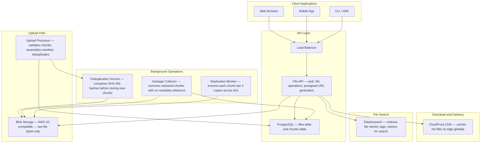
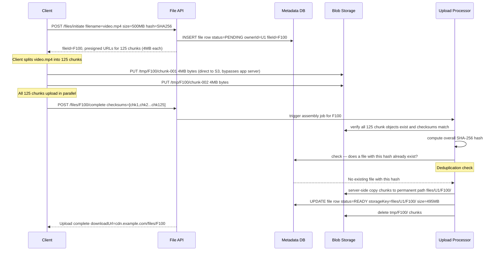
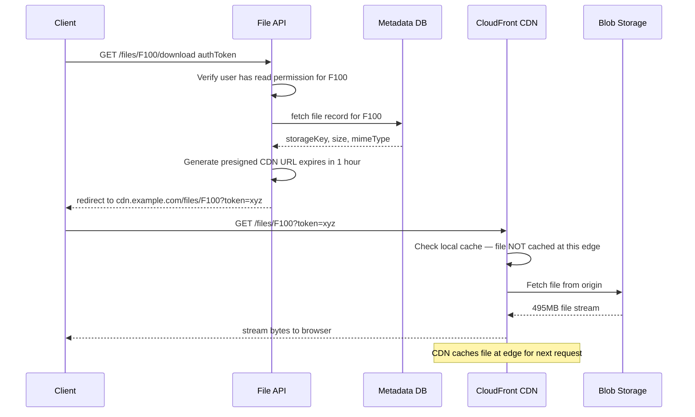
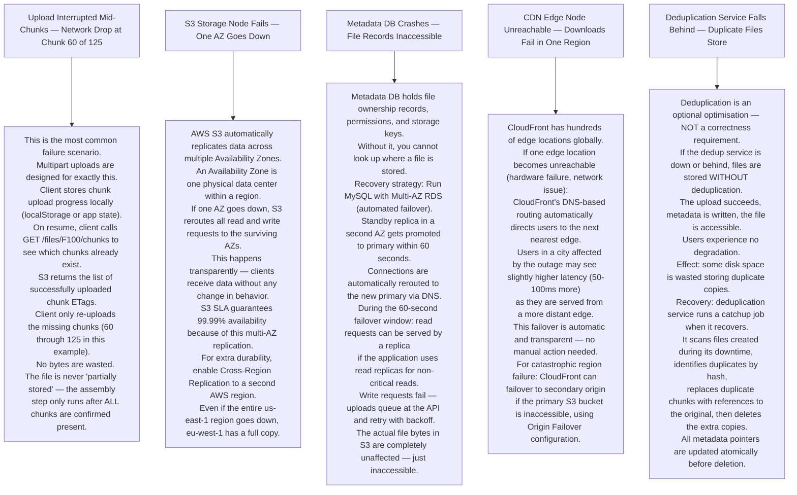

# Pattern 11 — File Storage System (like S3 / Dropbox)

---

## ELI5 — What Is This?

> Imagine a library that never loses books, even if one shelf collapses.
> You can store any file — photo, video, PDF, code —
> and retrieve it instantly, from anywhere in the world.
> The file is secretly split into chunks and stored in multiple physical locations,
> so losing any single location means nothing.
> That is a distributed file storage system.

---

## Glossary

| Word | ELI5 Meaning |
|---|---|
| **Blob Storage** | Binary Large Object storage. A system specifically designed to hold raw file bytes cheaply. Does not understand what is inside the file (unlike a database). Amazon S3 is blob storage. |
| **Metadata** | Data about data. For a file: its name, size, owner, creation time, which chunks it consists of, and where those chunks live. Stored in a fast database — NOT alongside the file bytes. |
| **Chunking** | Splitting a file into equal-sized pieces (e.g. 4 MB each). Each chunk is uploaded and tracked independently. Enables resumable uploads and parallel transfers. |
| **Presigned URL** | A temporary URL that lets a browser upload or download directly to blob storage (like S3) without routing through your application servers. The URL contains a cryptographic signature and expires after a short time. |
| **Multipart Upload** | Uploading a large file as multiple smaller parts simultaneously. Like sending a document as 5 faxes in parallel — all arrive at the same time, then are reassembled. |
| **Deduplication** | Detecting that two users uploaded the exact same file and storing it only once. Saves massive amounts of storage. |
| **Content Hash** | A fingerprint of a file's content (using SHA-256). If two files have the same hash, they have identical content. This is how deduplication works. |
| **Replication Factor** | How many copies of a file exist in different physical locations. AWS S3 uses replication factor 3 (or more). If one data center burns down, two others still have your file. |
| **CDN (Content Delivery Network)** | A network of servers spread around the world. When you download a file, you get it from the nearest CDN server, not from the main storage in a far-away data center. |
| **Erasure Coding** | Instead of storing 3 full copies, split the file into N pieces and add M parity pieces. You can reconstruct the file from any N pieces. Uses 1.5x storage instead of 3x. |
| **Object Key** | The unique name of a file in blob storage. Like a file path: `users/U1/photos/cat.jpg`. |
| **Garbage Collection** | A background process that finds file chunks no longer referenced by any metadata record and deletes them from blob storage to free space. |

---

## Component Diagram

---

## Upload Flow — Large File (Multipart)

---

## Download Flow

---

## Bottlenecks — Every Point Explained

| # | Bottleneck | Why It Hurts | Fix |
|---|---|---|---|
| 1 | **Large file upload through application server** | A 500 MB video routed through your API server wastes compute, saturates network interfaces, and delays other users. 10 simultaneous uploads would consume 5 GB of bandwidth at the API layer. | Presigned URLs: API issues a temporary signed URL, client uploads directly to S3. App server only processes the small metadata request. |
| 2 | **Metadata database fanout on directory listing** | User opens a folder with 50,000 files. `SELECT * FROM files WHERE parent_id = 'folder'` returns 50,000 rows. Slow and expensive. | Pagination: return 100 results at a time with cursor-based navigation. Index on `(owner_id, parent_folder_id, created_at)` to make queries fast. |
| 3 | **Storage cost of multiple large file copies** | Replication factor 3 means storing a 1 PB dataset costs 3 PB of raw storage. 3x cost multiplier. | Erasure coding: store `k` data shards + `m` parity shards. Common config: 4+2 (store 6 shards, any 4 can reconstruct the original). Uses 1.5x storage instead of 3x. Accept slightly higher reconstruction latency. |
| 4 | **Cold CDN on first access** | A file never downloaded before has zero CDN cache. First 10 users worldwide all get served from S3 origin. High latency globally. | Pre-warm CDN for popular content. When a file goes viral (download spike detected), proactively push to CDN edge nodes in all regions. |
| 5 | **Content hash computation on large files** | SHA-256 of a 10 GB file takes 2-3 seconds on a modern CPU. This blocks the upload completion endpoint. | Compute hash client-side before upload begins. Client sends the hash in the initiate request. Server verifies by spot-checking chunk checksums rather than recomputing the entire hash. |

---

## What Happens When Each Part Fails?

---

## Key Numbers

| Metric | Value |
|---|---|
| S3 object durability | 99.999999999% (11 nines) |
| S3 availability SLA | 99.99% |
| Max single PUT upload | 5 GB |
| Recommended multipart chunk size | 4 MB to 100 MB |
| Presigned URL expiry (upload) | 15 minutes to 1 hour |
| Presigned URL expiry (download) | 1 hour (configurable) |
| CDN cache-hit ratio target | 95%+ |
| Erasure coding storage overhead | 1.5x (vs 3x for replication) |
