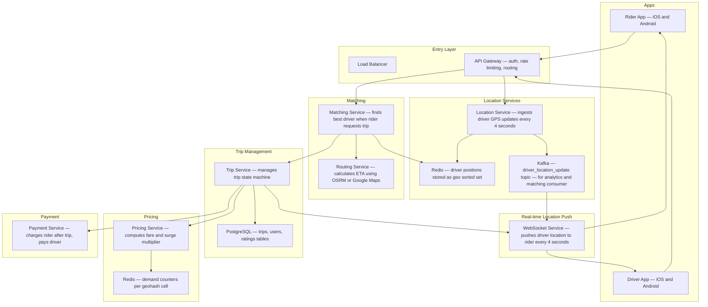
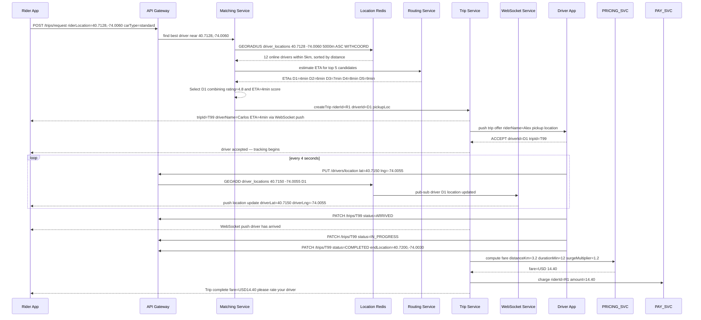
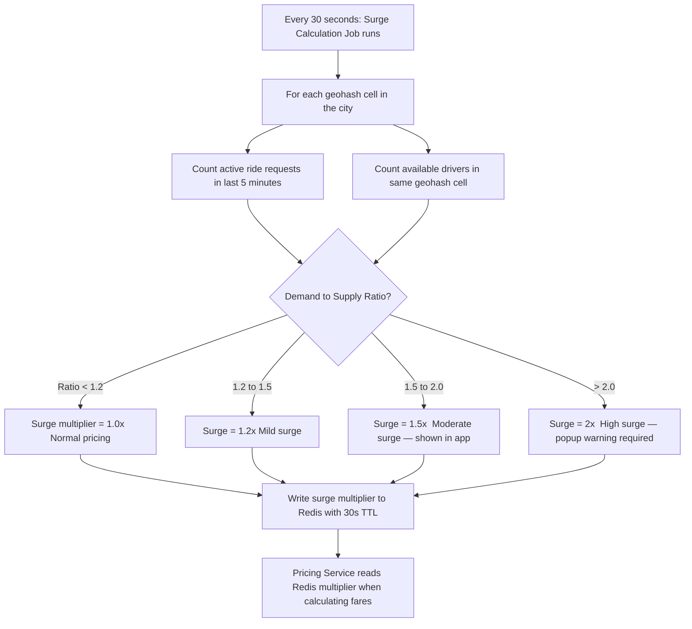
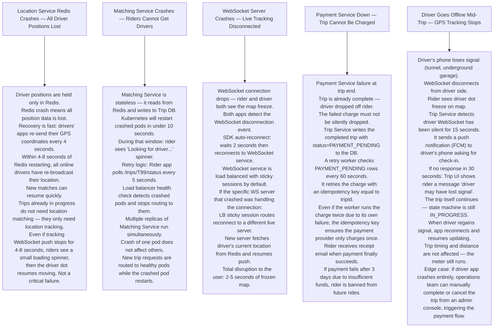

# Pattern 12 — Ride-Sharing System (like Uber / Lyft)

---

## ELI5 — What Is This?

> You need a ride. You open the app, pin your location.
> Somewhere nearby, a driver is waiting.
> The app plays matchmaker using a map:
> it finds the nearest available driver,
> the driver accepts, your phone shows a little car moving toward you in real time.
> Behind that simple experience is a complex puzzle of location tracking,
> matching algorithms, live maps, and fraud prevention.

---

## Glossary

| Word | ELI5 Meaning |
|---|---|
| **Geohash** | A system that converts a GPS coordinate (latitude, longitude) into a short string (like "9q8y"). All locations in the same neighbourhood share the same prefix. This makes it easy to find all drivers within a specific area by searching for a prefix. |
| **Proximity Search** | Finding all points (drivers) within a certain radius of another point (rider). Done efficiently with a spatial index. |
| **Spatial Index** | A special database index that understands geography. Instead of "find rows where name = X", it can do "find rows where location is within 2km of this point". PostgreSQL's PostGIS extension provides this. |
| **WebSocket** | A two-way, persistent connection between a phone/browser and a server. Unlike HTTP (which is one question → one answer), WebSocket stays open so the server can push updates (driver location) to the client at any time. |
| **Driver Location Update** | Every 3-4 seconds, the driver's app sends GPS coordinates to the server. The server broadcasts these to the matched rider so they see the car moving. |
| **Matching Algorithm** | The logic that decides which driver to assign to a rider. Considers: distance, driver rating, car type requested, estimated arrival time (ETA). |
| **ETA (Estimated Time of Arrival)** | How long until the driver arrives. Calculated using road routing (not straight-line distance). Heavy traffic on a road increases ETA even if the driver is physically close. |
| **Surge Pricing** | When demand (riders) outpaces supply (drivers) in an area, the price multiplier increases. This entices more drivers to the area and reduces demand — economic balancing. |
| **Trip State Machine** | A trip goes through defined states: REQUESTED → ACCEPTED → DRIVER_EN_ROUTE → ARRIVED → IN_PROGRESS → COMPLETED (or CANCELLED). Only valid transitions are allowed. |
| **OSRM / Google Maps Routing** | A routing engine that calculates actual road-based paths and travel times, respecting one-way streets, turn restrictions, and real-time traffic. |
| **Idempotency** | Making the same request twice has the same effect as making it once. Critical for payment: clicking "pay" twice should NOT charge twice. |

---

## Component Diagram

---

## Ride Request Flow

---

## Surge Pricing Logic

---

## Bottlenecks — Every Point Explained

| # | Bottleneck | Why It Hurts | Fix |
|---|---|---|---|
| 1 | **Driver location Redis under city-wide event** | 100,000 drivers updating location every 4 seconds = 25,000 writes/second to a single Redis sorted set. A concert ending floods this. | Geohash-based sharding: partition drivers into 64 geohash cells. Each cell is a separate Redis key on a separate Redis shard. Writes are spread evenly. |
| 2 | **Matching quality vs latency tradeoff** | Computing ETA for all 1000 nearby drivers using real road routing takes 200ms each = very slow. | Two-stage matching: Stage 1 — fast straight-line distance to filter top 10 candidates (1ms). Stage 2 — real routing ETA only for those 10 (50ms). |
| 3 | **WebSocket server holding millions of connections** | A city with 500,000 active trips means 1 million WebSocket connections (rider + driver per trip). WebSocket connections consume memory (~50KB each). 1M connections = 50 GB RAM on WebSocket servers. | Horizontal scaling: 100 WebSocket servers each hold 10,000 connections. Each server subscribes to driver location updates from Redis Pub/Sub only for drivers whose riders it is serving. |
| 4 | **Stale driver location on matching** | Driver moves 200m in the time between their last update and the matching decision. ETA estimated for wrong location. | Accept up to 8 seconds of location staleness for matching (GPS updates every 4 seconds = at most 4 seconds old). Routing service adds 30 seconds of buffer to all ETAs. |
| 5 | **Same driver offered to multiple simultaneous riders** | Two riders request at the same time. Matching service finds the same nearest driver for both. Both send offers. Driver accepts both. | Pessimistic locking on driver status: before sending an offer, acquire a Redis lock for driverId with 30-second TTL. Only one matchen holds the lock at a time. |

---

## What Happens When Each Part Fails?

---

## Key Numbers

| Metric | Value |
|---|---|
| Driver location update interval | 4 seconds |
| Nearby driver search radius | 5 km default |
| Location data freshness for matching | Max 8 seconds old |
| WebSocket memory per connection | ~50 KB |
| Redis GEORADIUS latency | Under 5 ms |
| Matching service p99 latency | Under 500 ms |
| Surge pricing recalculation interval | Every 30 seconds |
| Trip state transitions | 7 states |

---

## How All Components Work Together (The Full Story)

Think of a ride-sharing system as an air traffic control tower. Hundreds of planes (drivers) constantly broadcast their position. When a passenger needs a flight, the tower finds the nearest available plane, arranges the pickup, and continuously broadcasts the plane's position to the passenger until landing.

**The continuous location heartbeat (always running):**
- Every 4 seconds, every active driver's app sends its GPS coordinates via **PATCH /drivers/location** to the **Location Service**.
- The Location Service stores this in a **Redis Geo Sorted Set** using `GEOADD`. Redis understands latitude/longitude natively — you can search by radius.
- Simultaneously, the update is published to **Kafka** (`driver_location_update` topic), where the **WebSocket Service** and **Analytics Service** consume it.

**When a rider requests a trip:**
1. The **Matching Service** calls Redis `GEORADIUS` — "give me all driver IDs within 5 km of the rider's location, sorted by distance". Returns in under 5ms.
2. The top 5-10 candidates are passed to the **Routing Service** (OSRM/Google Maps) for real road-based ETA calculation — straight-line distance misses one-way streets and traffic.
3. The best driver is selected by a scoring formula: `score = (1/ETA) × driver_rating_weight`. A **Redis lock** is acquired on the chosen driver's ID (prevents two riders getting the same driver).
4. **Trip Service** creates the trip record in **PostgreSQL** (state: REQUESTED), pushes a trip offer to the driver via **WebSocket**, and simultaneously starts showing the rider the estimated ETA.
5. On driver acceptance: trip state → ACCEPTED. The **WebSocket Service** starts streaming live location updates (from Kafka) to the rider's app every 4 seconds.
6. After trip completion: **Pricing Service** calculates fare (distance × rate × surge multiplier read from Redis). **Payment Service** charges the rider.

**How the components support each other:**
- Redis Geo is the real-time map — without it, matching would require a full DB scan.
- Kafka decouples location updates from delivery: WebSocket Service subscribes only to updates for drivers actively matched with its connected riders, not all 100,000 drivers in the city.
- Trip state machine in PostgreSQL ensures only valid transitions happen (can't go from REQUESTED to COMPLETED without going through ACCEPTED and IN_PROGRESS).
- Surge pricing (Redis with 30s TTL) gives drivers an incentive to move to high-demand areas without requiring any DB transaction.

> **ELI5 Summary:** Redis Geo is the GPS dot board in the control tower. GEORADIUS is the radar sweep. Routing Service is the flight computer calculating real travel times. WebSocket is the radio channel between the tower and the passenger. Kafka is the flight data recorder that also feeds the passenger's app with live plane position. Trip Service is the official logbook. Payment is the landing fee.

---

## Key Trade-offs

| Decision | Option A | Option B | Why We Pick B (or A) |
|---|---|---|---|
| **Redis Geo for location vs PostGIS** | Store lat/lng in PostgreSQL with PostGIS spatial index | Store in Redis Sorted Set (Geo commands) | **Redis Geo** for the live matching hot path: sub-5ms GEORADIUS vs 10-50ms PostGIS query. PostGIS is better for complex geospatial analytics, historical trip routing analysis. Use both: Redis for live operations, PostGIS for analytics. |
| **Push driver location to rider via Kafka vs direct WS** | WebSocket server fetches latest location from Redis every 4s and pushes | Driver location update goes Kafka → WS Server → rider | **Kafka-based push**: WS Server only subscribes to Kafka events for drivers assigned to its connected riders. Without Kafka, every WS server would need to poll Redis for every driver every 4 seconds — expensive at scale. |
| **Two-stage matching (fast filter + precise routing) vs single stage** | Run real road routing for all 100 nearby drivers | First filter to top 10 by straight-line, then precise routing for those 10 | **Two-stage**: routing API calls cost money and latency. Calling OSRM for 100 drivers × millions of match requests daily = enormous cost. Straight-line pre-filter eliminates 90% of candidates cheaply. |
| **Surge pricing: hard rules vs ML model** | Rules-based: demand/supply ratio above 1.5 = 1.5× price | ML model: predict surge based on weather, events, time of day | **ML model** (ideal): predicts surge 15 minutes ahead, giving drivers time to reposition. **Rules-based**: simpler, faster to implement, easier to explain to regulators. Start rules-based, evolve to ML. |
| **Driver accepts/rejects offer vs automatic assignment** | Driver must manually accept each trip offer | Auto-assign driver, driver can cancel in first 60 seconds | **Manual accept**: driver autonomy is a legal requirement in most jurisdictions (drivers are independent contractors, not employees). Auto-assign would imply employment relationship. |
| **GPS-only matching vs GPS + heading** | Match by current location only | Match by location AND direction of travel | **Location + heading** prevents matching a driver heading away from the rider at high speed, even if they're close. A driver 200m away going 80 km/h in the opposite direction has effectively negative real proximity. |

---

## Important Cross Questions

**Q1. The entire city goes offline (power outage) and 10,000 drivers all reconnect at once. How does the system handle the reconnect storm?**
> All 10,000 drivers send location updates simultaneously. Redis handles ~1M writes/second — 10,000 concurrent GEOADDs is trivial. No waiting room needed because the location update path is idempotent and fast. The harder problem: 5,000 active trips whose WebSocket connections dropped all try to reconnect. Each reconnect triggers a Kafka subscription reactivation. Spread reconnections via exponential backoff + jitter (random delay 0-10 seconds) in the SDK. Load balancers health-check WebSocket servers and route evenly.

**Q2. A driver is assigned a trip but the driver's battery dies (app closes ungracefully). No cancellation event fires. What happens?**
> The Trip Service has a **driver response timeout** (e.g. 30 seconds after offer sent). If no ACCEPT or REJECT arrives, the offer is withdrawn and the Matching Service re-runs the query for the next best driver. The trip goes back to REQUESTED state. Additionally, the driver's presence in the Location Service expires: if no GPS update arrives for 60 seconds, the driver is marked as offline and removed from the GEORADIUS pool. Running trip is escalated to a "trip in unknown state" alert for customer support.

**Q3. How do you ensure that a driver can only accept one trip at a time — preventing two accepted trips simultaneously?**
> Before sending the trip offer, the Matching Service acquires a **Redis lock** on `driver:D1:lock` with a 30-second TTL. Only one matching operation holds this lock at a time. If the driver accepts Trip A, the lock is held throughout acceptance processing. If a second rider's matching query finds the same driver, it tries to acquire the locked key → fails → moves to the next candidate driver. Lock is released when driver status becomes "on trip" in the system.

**Q4. How does the Routing Service calculate an ETA that accounts for real-time traffic?**
> Two options: (1) **OSRM** (open source, self-hosted): pre-built road graphs with historical speed data. Fast (under 50ms), static — doesn't incorporate live traffic. (2) **Google Maps Platform / HERE API**: expensive per-call, but uses live traffic data. Hybrid: use OSRM for high-frequency matching (thousands of queries/second), use Google Maps for the final confirmed ETA shown to the rider (low frequency, high precision). Refresh the rider's ETA every 60 seconds during the trip using Google traffic data.

**Q5. How do you implement "trip history" and allow a rider to see exactly where their trip went with the route drawn on a map?**
> During a trip, the Location Service stores driver GPS coordinates in a **Cassandra time series** (or the Kafka topic retains them). After trip completion, a **Trip Finalizer** job reads the GPS sequence from Cassandra, simplifies the polyline (remove redundant intermediate points using Douglas-Peucker algorithm), and stores the compressed route in the trips table. The rider's app fetches the route via `GET /trips/T99/route` which returns the polyline. Google Maps SDK renders it. This is exactly how Uber's post-trip map works.

**Q6. How does the surge pricing algorithm decide the multiplier without manual intervention?**
> Every 30 seconds, the Surge Calculation Job: (1) reads all active ride requests in a geohash cell in the last 5 minutes (from Kafka `trip.requested` events counted in Redis). (2) reads available driver count in the same geohash (from Redis Geo). (3) computes `ratio = requests / drivers`. (4) maps ratio to multiplier using a lookup curve (1.0× at ratio <1.2, 1.5× at ratio 1.2-2.0, 2.0× at ratio >2.0). (5) writes to Redis with 30s TTL. The entire process is automatic, runs continuously, and requires zero human input. A regulatory cap (e.g. max 3.0× in some jurisdictions) is enforced at write time.
