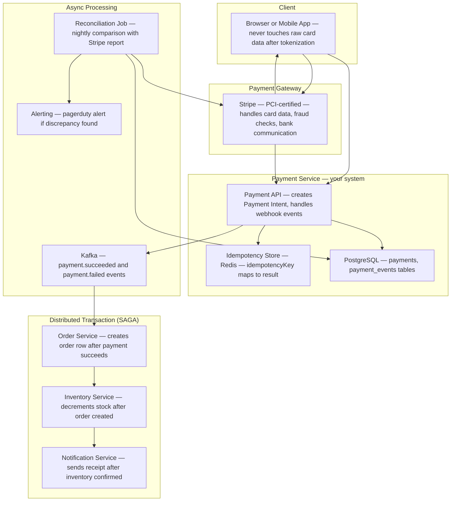
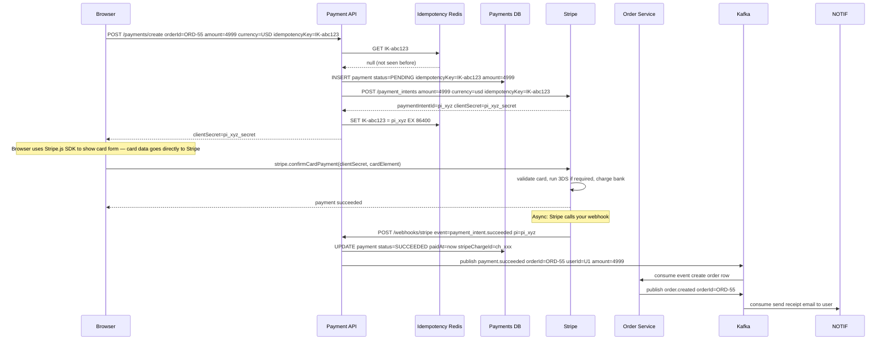
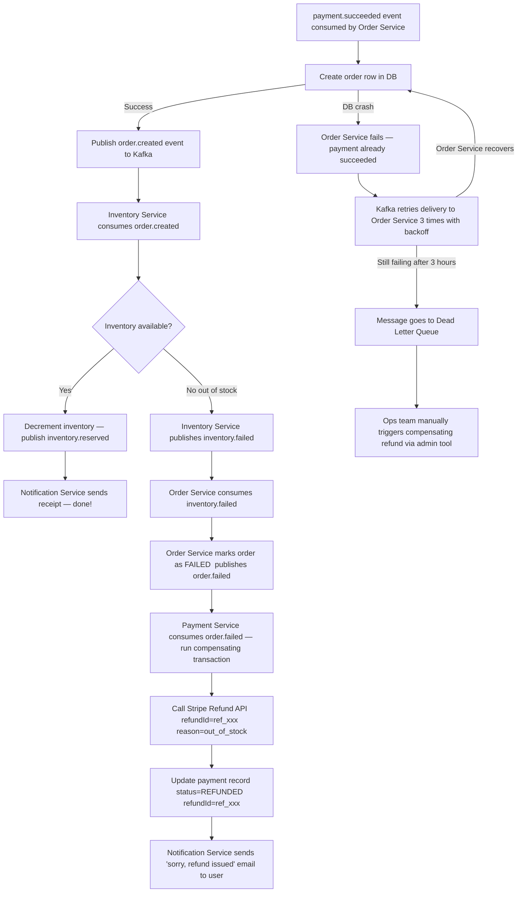
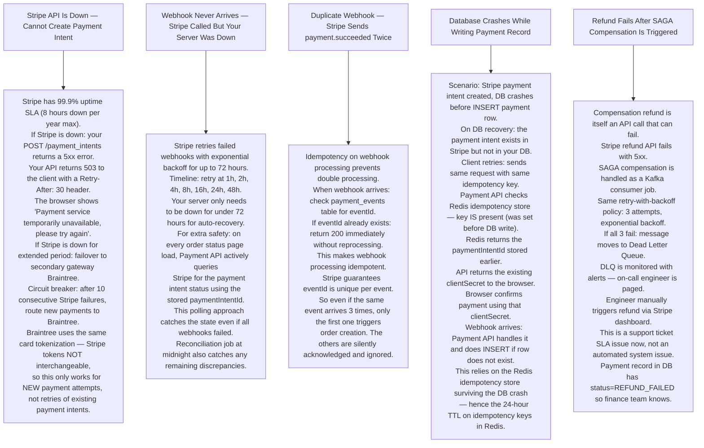

# Pattern 13 — Payment System

---

## ELI5 — What Is This?

> Paying online is like two banks passing notes to each other.
> Your bank says "I promise to send $50 to shop's bank".
> Shop's bank says "I received the note, credit the shop".
> The trick is: BOTH sides must agree before any money moves.
> If any note gets lost, neither side changes its balance.
> A payment system enforces this agreement with extreme precision,
> because double charges and silent failures anger customers and violate laws.

---

## Glossary

| Word | ELI5 Meaning |
|---|---|
| **Payment Gateway** | A service (Stripe, Braintree, PayPal) that sits between your app and the banks. You send the card details; the gateway handles the complex bank communication, fraud checks, and regulatory compliance. |
| **Idempotency Key** | A unique string you send with every payment request so the gateway can recognize "I have seen this exact request before". If you send the request twice (network drop), the gateway returns the same result without charging twice. Like a ticket number on a form — submit the same ticket twice and you get the same response. |
| **Two-Phase Commit (2PC)** | Phase 1: ask all parties "can you do this?" — everyone votes YES or NO. Phase 2: if ALL say YES, tell everyone to DO IT. If anyone says NO, tell everyone to UNDO. Guarantees atomicity across multiple systems. |
| **SAGA Pattern** | Breaking a long transaction into smaller steps, each with a compensating action (undo). If step 3 fails, you run the undo actions for steps 2 and 1. Like a cooking recipe where burning step 3 means you must throw away ingredients used in steps 1 and 2. |
| **Compensating Transaction** | The "undo" step of a SAGA. If payment succeeded but order creation failed, the compensating transaction is a refund. |
| **Webhook** | A callback that the payment gateway sends to your server to inform you of an event (payment.succeeded, payment.failed). Like a courier leaving a notification saying "package delivered". |
| **Reconciliation** | The nightly process of comparing your internal records against the bank/gateway statement to find discrepancies. Like balancing a checkbook at end of day. |
| **PCI-DSS** | Payment Card Industry Data Security Standard. Rules that say you must NEVER store raw card numbers in your own database. You use a gateway that is PCI-certified and stores sensitive data on your behalf. |
| **Tokenization** | Replacing a real credit card number with a fake ID (token). Your server stores the token. The gateway maps token → real card number in their secure vault. |
| **3D Secure (3DS)** | An extra password step ("Verified by Visa"). Bank redirects user to verify identity, then redirects back. Reduces fraud for card-not-present transactions. |
| **Chargeback** | When a customer disputes a charge with their bank. The bank forcibly reverses the payment and the merchant loses the money unless they can prove the charge was valid. |
| **At-Least-Once Delivery** | A guarantee that a message or action will happen at least once. May happen more than once (duplicate). System must be idempotent to handle duplicates safely. |

---

## Component Diagram

---

## Payment Flow — Stripe Payment Intents

---

## SAGA Failure Compensation Flow

---

## Bottlenecks — Every Point Explained

| # | Bottleneck | Why It Hurts | Fix |
|---|---|---|---|
| 1 | **Webhook delivery unreliable** | Stripe sends webhooks but your server was down for 30 seconds. Stripe retries but if your server is down for hours, events are lost. You never find out payments succeeded. | Webhook endpoint must return 200 fast (under 5s). Process asynchronously. Stripe stores and retries webhooks for 72 hours. Reconciliation job catches anything missed. |
| 2 | **Idempotency key collision** | Two different orders accidentally get the same idempotency key. The second one returns the result of the first — wrong amount charged. | Include ALL transaction-specific details in the key: `SHA256(userId + orderId + amount + currency)`. Uniqueness is guaranteed by the inputs. |
| 3 | **SAGA partial failure leaves inconsistent state** | Payment succeeded, order service was permanently down for 2 days. No compensation ran. User was charged, never got order. | Outbox pattern: Payment Service writes `payment.succeeded` event to its own DB table (outbox) in the same transaction as updating payment status. A separate outbox poller reads this table and publishes to Kafka. Even if Kafka is down during payment, the outbox captures the event durably. |
| 4 | **Reconciliation discovers missed charges** | Nightly reconciliation shows Stripe captured $500 that your system has no record of. This is a ghost payment. | Reconciliation job creates a `SUSPICIOUS` record for unmatched Stripe charges. Alerts on-call engineer. Investigation and manual refund if needed. |
| 5 | **Chargeback rate exceeds 1%** | Visa/Mastercard penalize merchants with chargeback rates above 1% by increasing fees or revoking card acceptance ability. | Fraud detection: integrate Stripe Radar or custom ML model. Flag high-risk transactions for manual review. Require 3DS for flagged orders. Maintain evidence package for every completed order. |

---

## What Happens When Each Part Fails?

---

## Key Numbers

| Metric | Value |
|---|---|
| Stripe webhook retry window | 72 hours |
| Idempotency key TTL in Redis | 24 hours |
| Payment Intent status options | requires_payment_method, requires_action, processing, succeeded, canceled |
| Chargeback rate safe threshold | Under 1% |
| SAGA steps in typical e-commerce | 3-5 steps |
| Reconciliation frequency | Daily (nightly batch) |
| PCI-DSS requirement | Never store raw card numbers |
