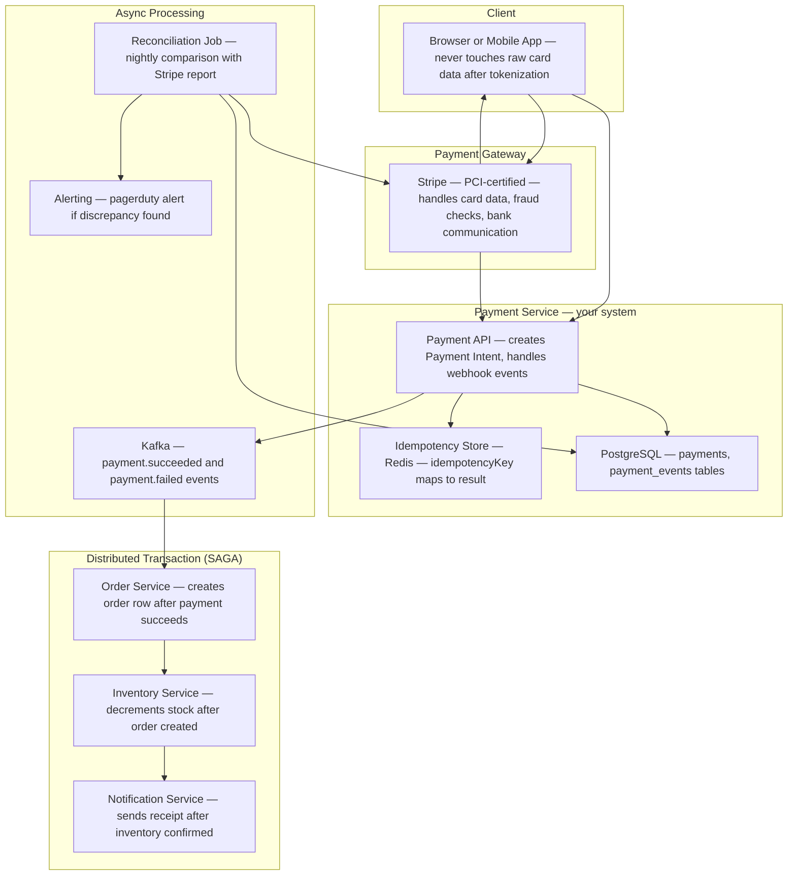
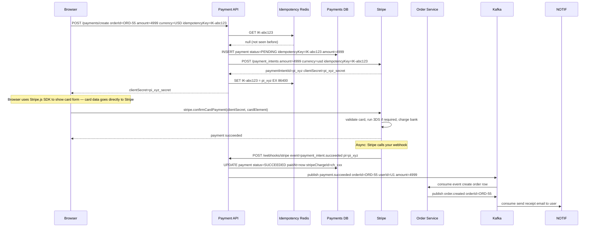
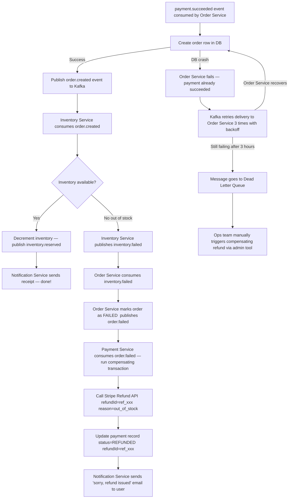
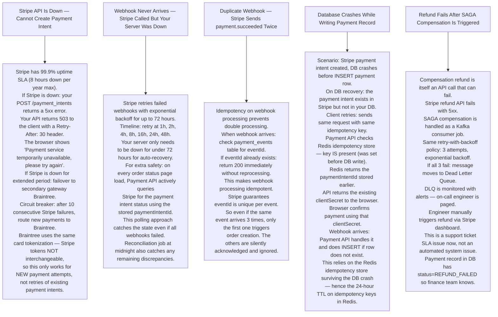

# Pattern 13 — Payment System

---

## ELI5 — What Is This?

> Paying online is like two banks passing notes to each other.
> Your bank says "I promise to send $50 to shop's bank".
> Shop's bank says "I received the note, credit the shop".
> The trick is: BOTH sides must agree before any money moves.
> If any note gets lost, neither side changes its balance.
> A payment system enforces this agreement with extreme precision,
> because double charges and silent failures anger customers and violate laws.

---

## Glossary

| Word | ELI5 Meaning |
|---|---|
| **Payment Gateway** | A service (Stripe, Braintree, PayPal) that sits between your app and the banks. You send the card details; the gateway handles the complex bank communication, fraud checks, and regulatory compliance. |
| **Idempotency Key** | A unique string you send with every payment request so the gateway can recognize "I have seen this exact request before". If you send the request twice (network drop), the gateway returns the same result without charging twice. Like a ticket number on a form — submit the same ticket twice and you get the same response. |
| **Two-Phase Commit (2PC)** | Phase 1: ask all parties "can you do this?" — everyone votes YES or NO. Phase 2: if ALL say YES, tell everyone to DO IT. If anyone says NO, tell everyone to UNDO. Guarantees atomicity across multiple systems. |
| **SAGA Pattern** | Breaking a long transaction into smaller steps, each with a compensating action (undo). If step 3 fails, you run the undo actions for steps 2 and 1. Like a cooking recipe where burning step 3 means you must throw away ingredients used in steps 1 and 2. |
| **Compensating Transaction** | The "undo" step of a SAGA. If payment succeeded but order creation failed, the compensating transaction is a refund. |
| **Webhook** | A callback that the payment gateway sends to your server to inform you of an event (payment.succeeded, payment.failed). Like a courier leaving a notification saying "package delivered". |
| **Reconciliation** | The nightly process of comparing your internal records against the bank/gateway statement to find discrepancies. Like balancing a checkbook at end of day. |
| **PCI-DSS** | Payment Card Industry Data Security Standard. Rules that say you must NEVER store raw card numbers in your own database. You use a gateway that is PCI-certified and stores sensitive data on your behalf. |
| **Tokenization** | Replacing a real credit card number with a fake ID (token). Your server stores the token. The gateway maps token → real card number in their secure vault. |
| **3D Secure (3DS)** | An extra password step ("Verified by Visa"). Bank redirects user to verify identity, then redirects back. Reduces fraud for card-not-present transactions. |
| **Chargeback** | When a customer disputes a charge with their bank. The bank forcibly reverses the payment and the merchant loses the money unless they can prove the charge was valid. |
| **At-Least-Once Delivery** | A guarantee that a message or action will happen at least once. May happen more than once (duplicate). System must be idempotent to handle duplicates safely. |

---

## Component Diagram

---

## Payment Flow — Stripe Payment Intents

---

## SAGA Failure Compensation Flow

---

## Bottlenecks — Every Point Explained

| # | Bottleneck | Why It Hurts | Fix |
|---|---|---|---|
| 1 | **Webhook delivery unreliable** | Stripe sends webhooks but your server was down for 30 seconds. Stripe retries but if your server is down for hours, events are lost. You never find out payments succeeded. | Webhook endpoint must return 200 fast (under 5s). Process asynchronously. Stripe stores and retries webhooks for 72 hours. Reconciliation job catches anything missed. |
| 2 | **Idempotency key collision** | Two different orders accidentally get the same idempotency key. The second one returns the result of the first — wrong amount charged. | Include ALL transaction-specific details in the key: `SHA256(userId + orderId + amount + currency)`. Uniqueness is guaranteed by the inputs. |
| 3 | **SAGA partial failure leaves inconsistent state** | Payment succeeded, order service was permanently down for 2 days. No compensation ran. User was charged, never got order. | Outbox pattern: Payment Service writes `payment.succeeded` event to its own DB table (outbox) in the same transaction as updating payment status. A separate outbox poller reads this table and publishes to Kafka. Even if Kafka is down during payment, the outbox captures the event durably. |
| 4 | **Reconciliation discovers missed charges** | Nightly reconciliation shows Stripe captured $500 that your system has no record of. This is a ghost payment. | Reconciliation job creates a `SUSPICIOUS` record for unmatched Stripe charges. Alerts on-call engineer. Investigation and manual refund if needed. |
| 5 | **Chargeback rate exceeds 1%** | Visa/Mastercard penalize merchants with chargeback rates above 1% by increasing fees or revoking card acceptance ability. | Fraud detection: integrate Stripe Radar or custom ML model. Flag high-risk transactions for manual review. Require 3DS for flagged orders. Maintain evidence package for every completed order. |

---

## What Happens When Each Part Fails?

---

## Key Numbers

| Metric | Value |
|---|---|
| Stripe webhook retry window | 72 hours |
| Idempotency key TTL in Redis | 24 hours |
| Payment Intent status options | requires_payment_method, requires_action, processing, succeeded, canceled |
| Chargeback rate safe threshold | Under 1% |
| SAGA steps in typical e-commerce | 3-5 steps |
| Reconciliation frequency | Daily (nightly batch) |
| PCI-DSS requirement | Never store raw card numbers |

---

## How All Components Work Together (The Full Story)

Think of a payment system as two banks exchanging signed legal documents. Every step must be provably complete or provably reversed — there is no "maybe" state allowed with real money.

**The payment flow (coordinated between your system, the browser, and Stripe):**
1. The user's browser NEVER sends card numbers to your server. The browser uses **Stripe.js** SDK — card data goes directly to Stripe's servers. Your server only talks to Stripe about amounts and currencies — never about card digits. This is the PCI-DSS compliance trick.
2. Your **Payment API** receives "start a payment for order ORD-55, amount $49.99". Before doing anything, it checks the **Redis Idempotency Store** — has this exact `idempotencyKey` been seen before? If yes, return the stored result immediately without creating a new charge.
3. A new `payment` row is written to **PostgreSQL** with status `PENDING`. Then your server calls Stripe: `POST /payment_intents`. Stripe returns a `clientSecret` — a one-time token.
4. The browser uses `clientSecret` with Stripe.js to show the card form, handle 3DS (optional bank redirect), and confirm the charge. Stripe processes the charge with the user's bank.
5. Stripe sends a **webhook** to your server: `payment_intent.succeeded`. Your **Webhook Handler** updates the payment row to `SUCCEEDED` and publishes `payment.succeeded` to **Kafka**.
6. **Kafka** fans the success event to: Order Service (create order), Inventory Service (decrement stock), Notification Service (send receipt). This is the SAGA chain — each step can compensate (refund) if a later step fails.
7. Nightly **Reconciliation Job** compares every payment in your DB against Stripe's full export. Any discrepancy fires an alert.

**How the components support each other:**
- Idempotency Store (Redis) prevents double charges — the #1 payment engineering fear. Even if the API is called twice due to network retries, the second call returns the first call's result.
- Kafka SAGA chain with compensating transactions ensures partial failures (payment succeeded, inventory failed) are always resolved — either forward (retry) or backward (refund). No limbo states.
- Stripe handles all the bank communication, card data, and PCI compliance complexity. Your system only knows tokens and events.

> **ELI5 Summary:** Stripe.js is the armored car that picks up the card number — your server never touches it. Payment Intent is the signed check. Idempotency Key is the check number that prevents the same check from being cashed twice. Webhook is the bank calling to say "the check cleared". Kafka SAGA is the full transaction ledger. Reconciliation is the end-of-day balancing of the checkbook.

---

## Key Trade-offs

| Decision | Option A | Option B | Why We Pick B (or A) |
|---|---|---|---|
| **Single payment table vs event sourcing** | One `payments` row with a status column | Append-only `payment_events` table, reconstruct current state from events | **Event sourcing** for payments: you have a complete audit trail of every status change with timestamps. Required for financial audits, dispute resolution, and GDPR data access requests. Status column alone loses history. |
| **Synchronous SAGA vs choreography-based SAGA** | Orchestrator service calls each step in sequence | Each service reacts to events from the previous step via Kafka | **Choreography (Kafka)** scales better: no orchestrator bottleneck, each service scales independently. Tradeoff: harder to visualize the full transaction flow. Use distributed tracing (Jaeger) to monitor the chain. |
| **Webhook-only payment confirmation vs active polling** | Rely purely on Stripe webhooks for payment status | Webhooks primary + active polling of Stripe API as fallback | **Webhooks + polling**: webhooks can fail (server down, network issue). Polling catches status on every order page load — user gets an accurate status even if webhooks were missed. Defense in depth. |
| **Fail fast on payment timeout vs retry** | Return error to user on first payment gateway timeout | Retry up to N times with backoff before returning error | **Retry with idempotency key**: payment gateways time out 1-5% of the time at peak load. Users expect a retry. With Stripe idempotency keys, retrying is completely safe — duplicate charges are impossible. Fail fast without retry produces unnecessary user frustration. |
| **Reconciliation: real-time vs nightly batch** | Real-time reconciliation via webhook events | Nightly batch reconciliation with full Stripe export | **Nightly batch** as the authoritative check: webhook events can be delayed, duplicated, or missed. A complete nightly export from Stripe compared line-by-line against your DB is the gold standard. Real-time monitoring is an early warning layer over it. |
| **Store Stripe paymentIntentId vs not store** | Don't store, rely on Stripe webhooks entirely | Store in your DB linked to your order | **Store it**: allows active polling, customer support lookups ("show me this customer's Stripe payment intent"), chargeback evidence, and reconciliation matching without exposing raw card numbers. |

---

## Important Cross Questions

**Q1. A customer clicks "Pay" twice very quickly (double-click or flaky connection). How do you prevent a double charge?**
> Three layers: (1) **Browser-side**: disable the Pay button immediately after the first click and show a spinner. (2) **Idempotency Key**: the client generates a unique key for this payment attempt (`SHA256(userId + orderId + amount)`) and sends it with every retry. Redis stores the result of the first successful payment creation for 24 hours. Any request with the same idempotency key returns the cached result. (3) **Stripe idempotency key**: Stripe itself deduplicates requests with the same idempotency key, even if your server creates two Payment Intents.

**Q2. A payment succeeded (Stripe shows charge), but your database crashed and never recorded it. How do you handle this?**
> Stripe retries the webhook for up to 72 hours. Your server will eventually receive the `payment_intent.succeeded` event and write the payment record. Additionally, on any order status check (user checks their order), the Payment API actively queries Stripe for the payment intent status using the stored `paymentIntentId`. If Stripe shows `succeeded` but your DB shows `PENDING`, you update the DB. Nightly reconciliation adds a final safety net. The idempotency key in Redis (24h TTL) also allows the client to safely re-submit and get the same response.

**Q3. Explain the difference between a refund and a chargeback. How do you handle each?**
> **Refund**: you initiate it (Stripe `POST /refunds`). You control the timing and reason. Customer gets money back in 5-10 days. No penalty to you. **Chargeback**: the customer disputes the charge with their bank directly. The bank forcibly takes the money back from you immediately. You have 7-21 days to submit evidence (order details, delivery confirmation). If you lose: permanent loss of the funds plus a $15-25 chargeback fee per case. Prevention: fraud detection, requiring strong authentication (3DS), keeping delivery evidence. If chargeback rate exceeds 1%, Visa/Mastercard impose penalties.

**Q4. How does your SAGA pattern handle a scenario where the refund itself fails?**
> The compensating transaction (refund) is treated the same as any other Kafka-driven action: it has its own retry logic with exponential backoff. If the refund fails after 3 retries, it goes to the **Dead Letter Queue** and an alert fires to the payments on-call team. The payment record is flagged as `COMPENSATION_FAILED`. A human engineer investigates and manually issues the refund via the PaymentAdmin tool. This path is rare but requires manual resolution. SLA: compensation failures are resolved within 24 working hours per customer agreement.

**Q5. How do you handle payments in multiple currencies (USD, EUR, GBP) with dynamic exchange rates?**
> Store all amounts in the smallest unit of the currency (cents, pence, etc.) to avoid floating-point errors. Store both the charged-currency amount AND the order-currency amount in the payment record, plus the exchange rate used at payment time. This is important for refunds: a partial refund must be in the original charge currency. Stripe handles the actual conversion with major currency pairs. For your own reporting: store a `usd_equivalent_amount` column using the exchange rate at transaction time. Use a daily exchange rate snapshot from your finance provider, not a real-time ticker, for accounting stability.

**Q6. How do you design the payment system to be auditable for 7 years (legal requirement in many countries)?**
> (1) **Append-only event store**: never UPDATE or DELETE payment rows. Only INSERT new event records. (2) **Immutable archived events**: after 1 year, move payment events older than 1 year to a write-once archival storage (AWS S3 Object Lock with COMPLIANCE mode — physically impossible to delete even by admins). (3) **Audit log**: every access to payment data by internal tools is logged with `who accessed`, `when`, `from where`, `what data`. (4) **Encryption at rest**: payment data encrypted in the DB using AWS KMS. Encryption keys rotated annually. Key rotation logs kept for audit.
