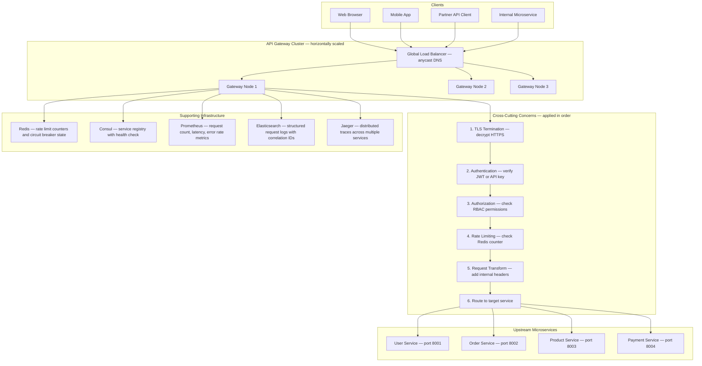
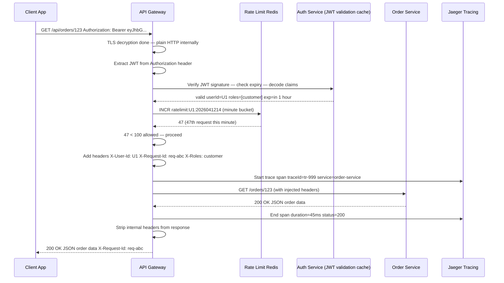
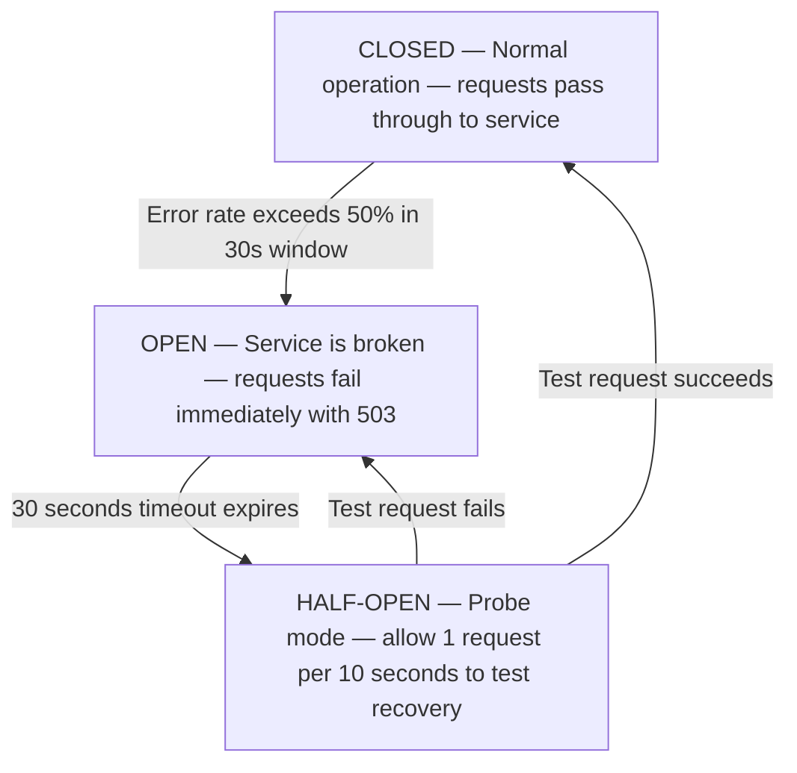
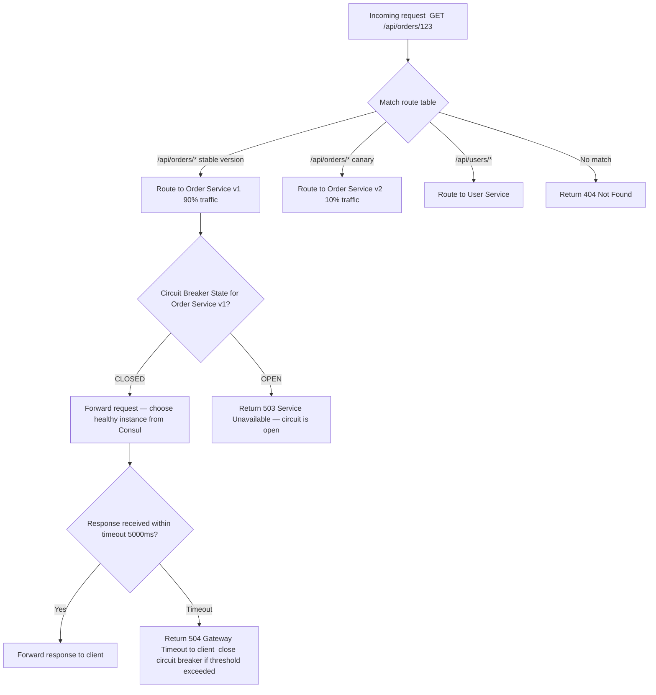
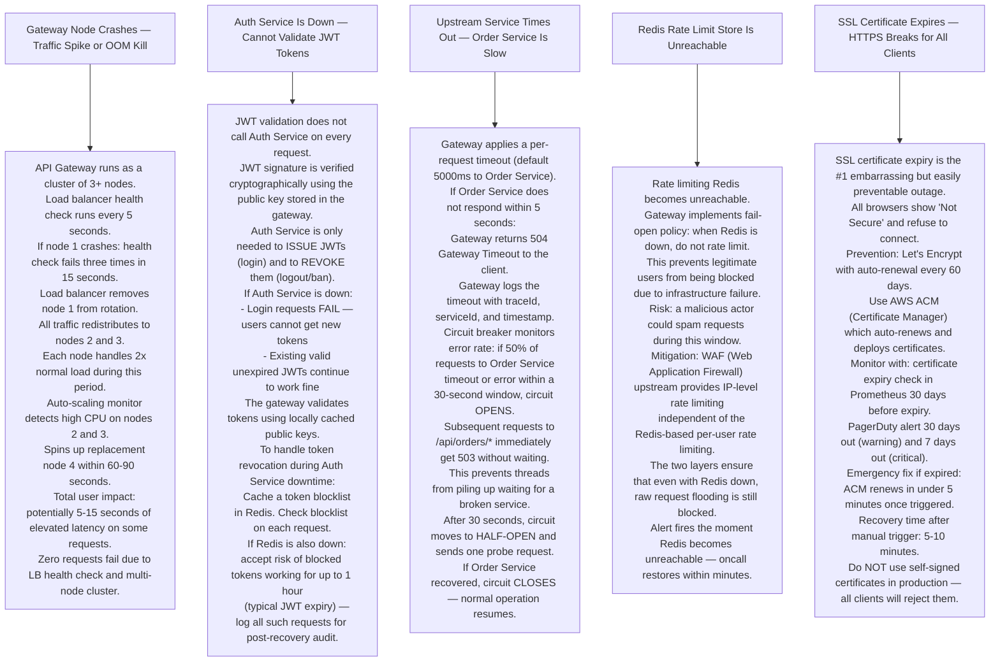

# Pattern 14 — API Gateway

---

## ELI5 — What Is This?

> Think of a huge office building with one front door and a security desk.
> Every visitor (API request) must pass through that desk.
> The guard checks your ID (authentication),
> checks if you have been here too many times today (rate limiting),
> looks at your badge to see which floor you are allowed on (routing),
> and stamps your form so everyone inside knows you were verified (request transformation).
> Without the front desk, every single room on every floor would need its own guard,
> its own visitor log, its own security camera.
> The API Gateway IS that front desk.

---

## Glossary

| Word | ELI5 Meaning |
|---|---|
| **API Gateway** | A single entry point (URL) that all clients talk to. It forwards requests to the right internal service after applying cross-cutting concerns like auth and rate limiting. |
| **Reverse Proxy** | A server that stands in front of other servers. Clients talk to the proxy; the proxy forwards to the real server. Clients never know the real server's address. |
| **Authentication** | Proving who you are. "I am User 123, here is my token." The gateway verifies the token before letting the request through. |
| **Authorization** | Proving you are ALLOWED to do this. "User 123 is verified, but are they allowed to access /admin endpoint?" A different check from authentication. |
| **JWT (JSON Web Token)** | A compact token containing user info, signed by the server. The signature proves the token was not tampered with. The gateway verifies the signature without calling the auth database. |
| **Rate Limiting** | Capping how many requests a user or IP can make per time window. Prevents abuse. "Only 1000 requests per hour per API key." |
| **Circuit Breaker** | A protection switch. If service X has been failing 50% of the time, stop sending it requests for 30 seconds. Avoids piling up requests on a broken service. |
| **Load Balancing** | Spreading requests across multiple instances of the same service. Like a traffic officer directing cars to different lanes so no single lane is jammed. |
| **Request Transformation** | Changing a request before forwarding it. For example, adding an internal header, renaming a query parameter, or converting XML to JSON. |
| **Service Discovery** | A registry where services register their current IP address. The gateway looks here to find where to send requests instead of using hardcoded addresses. |
| **Observability** | The ability to understand what is happening inside your system by looking at logs, metrics, and traces without changing the code. |
| **TLS Termination** | The gateway receives encrypted HTTPS traffic, decrypts it, and forwards plain HTTP to internal services. Internal services do not need to handle encryption — the gateway does it centrally. |
| **Canary Deployment** | Routing 5% of traffic to a new version of a service while 95% still goes to the old version. If the new version is broken, only 5% of users are affected. |
| **Health Check** | A periodic ping to a service endpoint (usually GET /health). If the endpoint stops responding, the gateway removes that service instance from its routing pool. |

---

## Component Diagram

---

## Request Lifecycle Flow

---

## Circuit Breaker State Machine

---

## Routing Decision Logic

---

## Bottlenecks — Every Point Explained

| # | Bottleneck | Why It Hurts | Fix |
|---|---|---|---|
| 1 | **JWT verification on every request** | Verifying a JWT signature takes 1-2ms of CPU per request. At 100,000 RPS, this adds up. | Cache valid JWT claims in Redis for the token's remaining validity period. First request does the crypto; subsequent requests are cache lookups. |
| 2 | **Rate limit Redis as a single point of failure** | If Redis is down, the gateway cannot check rate limits. Choose to either block all traffic (safe) or let all traffic through (unsafe). | Redis Sentinel with auto-failover. Accept fail-open for rate limits (let traffic through) during Redis downtime rather than blocking all users. |
| 3 | **Gateway becomes a single bottleneck** | All traffic funnels through the gateway cluster. A bug in gateway code can take down 100% of your site. | Run multiple gateway nodes behind a hardware load balancer. Use immutable infrastructure: never change a running gateway node — deploy new ones and shift traffic. |
| 4 | **Latency added by each middleware step** | Each cross-cutting concern (auth, rate limit, logging) adds latency in series. 6 steps × 2ms each = 12ms overhead per request. | Async steps for non-blocking concerns (logging, tracing). Cache everything that can be cached. Keep gateway logic thin — complex business logic belongs inside services. |
| 5 | **Service discovery cache staleness** | Consul has a healthy instance registered. Instance crashes. Gateway still routes to it for up to 10 seconds (health check interval). | Short health check intervals (5s). Gateway-level connection health: if a TCP connection fails, immediately mark that instance as potentially unhealthy and reduce its weight. |

---

## What Happens When Each Part Fails?

---

## How It All Works Together

Imagine you are sending a letter through a massive post office. The API Gateway is that post office.

**Step 1 — You arrive:** Your request hits the Global Load Balancer which is just like traffic lights routing cars. It picks a healthy Gateway Node and sends your request there.

**Step 2 — Security check:** The gateway unwraps your HTTPS envelope (TLS Termination), reads your ID card (JWT), confirms it is genuine by checking the signature, then looks up your permissions (Authorization).

**Step 3 — Speed enforcement:** It checks Redis to see how many requests you made this minute. If you are within the limit, it stamps "approved" and adds internal labels (request transformation headers) so downstream services know who you are without checking themselves.

**Step 4 — Finding the right department:** The gateway looks at your request URL, matches it against routing rules, consults Consul (the service registry) to find a healthy instance of the target service, and forwards your request.

**Step 5 — Recording everything:** While this happens, every step creates an entry in logs (Elasticsearch), increments a counter in Prometheus (how many requests, how long they took), and adds a trace span to Jaeger (so you can see the full journey of the request end-to-end).

**The beauty:** Every service behind the gateway gets a pre-verified, pre-labelled request. Services do NOT need to know anything about JWT parsing, rate limiting, or TLS. They just receive plain HTTP with identity headers already attached. The gateway handles all of that in one place.

---

## ELI5 — Explain to a 5-Year-Old

> **API Gateway** = The teacher at the classroom door who decides who gets inside.
>
> **JWT** = Your school ID card. Once issued, any teacher can check it is real without calling the office.
>
> **Rate Limiting** = "You already asked 100 questions today. Go sit down quietly."
>
> **Circuit Breaker** = Like a power switch. If the toaster keeps sparking, flip the switch OFF so it does not burn the house down. Flip it back ON once it cools down.
>
> **TLS Termination** = The gateway opens your sealed letter, reads it, then sends the message inside through the building's internal mail (plain HTTP). No one outside the building can read it.
>
> **Canary Deployment** = Give 10 students the new lunch menu and 90 students the old one. If the 10 kids all feel sick, throw away the new menu. If they are fine, switch everyone.
>
> **Service Discovery** = A school directory. Instead of memorising every teacher's room number, you look up "Math teacher" in the directory and it tells you Room 12B.

---

## Tradeoffs

| Decision | Option A | Option B | When to Pick A | When to Pick B |
|---|---|---|---|---|
| **JWT validation** | Validate locally with cached public key (fast, no network call) | Call Auth Service on every request (always fresh, can check revocations) | High traffic where latency matters; accept 1-hour revocation lag | Financial apps where instant revocation of stolen tokens is critical |
| **Rate limit on fail** | Fail-open: allow all traffic when Redis is down | Fail-closed: block all traffic when Redis is down | Consumer apps — user experience matters | Security-critical APIs where abuse during an outage is unacceptable |
| **Circuit breaker** | Open circuit after 50% errors in 30s (aggressive) | Open circuit after 80% errors in 60s (tolerant) | Fast-fail to protect system overall | Tolerate temporary spikes without tripping |
| **Gateway complexity** | Thin gateway: only routing + auth | Fat gateway: business logic, aggregation, response caching | Microservices architecture — services own logic | BFF (Backend For Frontend) pattern where gateway tailors responses per client |
| **TLS** | Terminate at gateway, plain HTTP inside | End-to-end TLS (re-encrypt before forwarding) | Trusted internal network (VPC) | Zero-trust network where internal traffic is also encrypted |
| **Single gateway** | One centralized gateway | Per-team or per-service sidecar proxy (service mesh) | Small teams wanting simplicity | Large organizations where teams need independent deployment of gateway rules |

---

## Cross Questions

**Q1: Why not just put all the auth logic inside each microservice instead of a gateway?**
> Every service would need to implement JWT validation, rate limiting, and logging. That means the same code in 20 services. Any security update must be deployed to all 20 simultaneously. A gateway centralizes this: fix once, affects all. The downside is the gateway becomes a critical single point — hence you run it as a cluster.

**Q2: What is the difference between a Load Balancer and an API Gateway?**
> A Load Balancer distributes traffic across identical instances of the same service — purely traffic distribution. An API Gateway does routing (different URLs to different services), auth, rate limiting, transformation, and observability. In practice, you have BOTH: a load balancer in front of the gateway cluster, and the gateway distributing to individual services.

**Q3: If the gateway is stateless, where does session state live?**
> JWTs are self-contained — the token itself carries the user's identity. The gateway does not need to look up a session in a database. This is why JWTs are preferred over opaque session tokens for gateway-level auth. The only stateful thing is the rate limit counter (in Redis) and the circuit breaker state (in Redis).

**Q4: How would you route a request differently for mobile vs web clients?**
> Use the User-Agent header or a custom X-Client-Type header. The gateway inspects this and routes to a mobile-optimized BFF (Backend For Frontend) service that returns smaller payloads, while web clients go to a different BFF that returns richer data. Alternatively, use GraphQL which lets clients specify exactly which fields they need.

**Q5: How do you debug a request that failed inside a microservice, given you only have the gateway logs?**
> The gateway injects an X-Request-Id (correlation ID) header into every request. The same ID appears in gateway logs, in each service's logs, and in the distributed trace in Jaeger. You can take a single request ID from a user complaint, search across all log sources, and reconstruct the full journey of that request.

---

## Key Numbers

| Metric | Value |
|---|---|
| Gateway overhead per request | 5-15 ms (auth check + rate limit) |
| JWT validation (local with cache) | Under 1 ms |
| Circuit breaker threshold | 50% error rate in 30-second window |
| Circuit breaker open duration | 30 seconds before half-open probe |
| Health check interval | Every 5 seconds |
| TLS handshake overhead | ~5ms (amortized with connection keep-alive) |
| Rate limit storage | Redis — O(1) per request |
