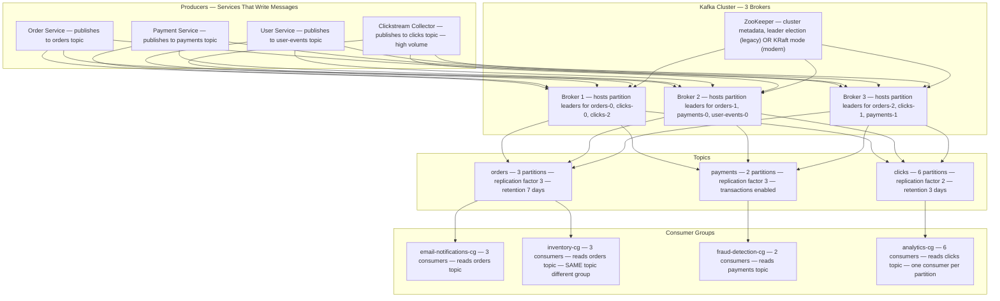
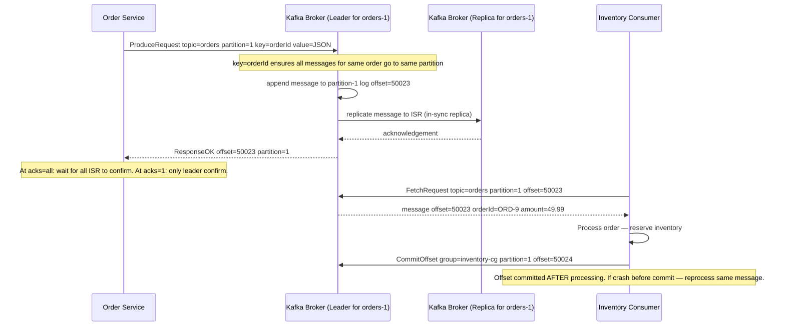
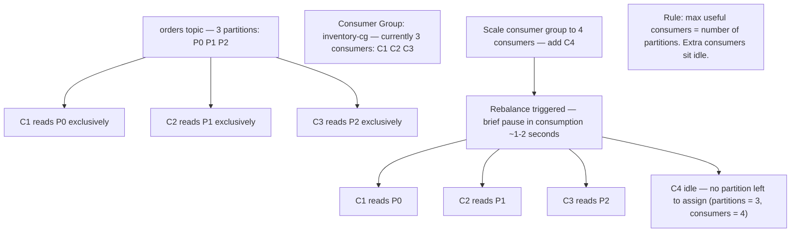
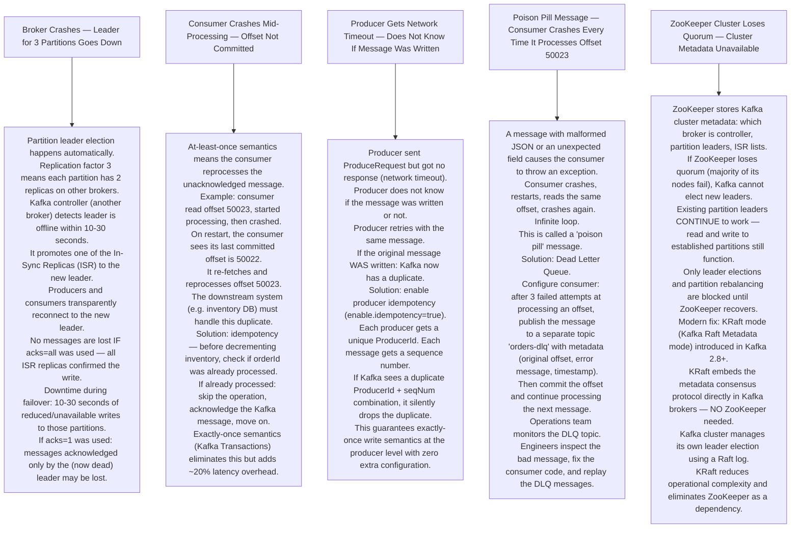

# Pattern 15 — Distributed Message Queue (like Kafka)

---

## ELI5 — What Is This?

> Imagine a factory with a conveyor belt between two rooms.
> Room A (producers) puts packages on the belt.
> Room B (workers) picks packages off the belt.
> If Room B workers are busy, packages stay on the belt — they do not fall off.
> If Room B shuts down and restarts, the belt remembers where it stopped.
> The belt can have multiple lanes (partitions),
> and multiple teams of workers (consumer groups) can each read the SAME belt
> without interfering with each other.
> That is a distributed message queue — a durable, ordered, replayable conveyor belt.

---

## Glossary

| Word | ELI5 Meaning |
|---|---|
| **Topic** | A named category of messages. Like a TV channel. Producers broadcast on channel "orders", consumers tune into channel "orders". |
| **Partition** | A topic is split into N partitions (lanes). Each partition is an ordered, immutable log. Parallelism is achieved by processing different partitions simultaneously. |
| **Broker** | A Kafka server that stores and serves messages. Multiple brokers form a Kafka cluster. Like multiple warehouses storing packages. |
| **Producer** | An application that writes messages to a Kafka topic. |
| **Consumer** | An application that reads messages from a Kafka topic. |
| **Consumer Group** | A logical group of consumers. Each partition in a topic is read by exactly ONE consumer within the group. Multiple groups can read the same topic independently and at different speeds. |
| **Offset** | The position of a message in a partition. Like a page number in a book. Consumers track which offset they have processed last. On restart, they resume from their last committed offset. |
| **Leader** | For each partition, one broker is the leader. All reads and writes for that partition go to the leader. Other brokers hold replicas for fault tolerance. |
| **Replica** | A copy of a partition stored on a different broker. If the leader fails, a replica is promoted to leader. |
| **ISR (In-Sync Replica)** | A replica that is fully caught up with the leader. Only ISR replicas can be promoted to leader on failover. |
| **At-Least-Once Delivery** | Kafka guarantees every message is delivered at least once. If a consumer crashes after processing but before committing its offset, it will re-process the same message on restart. Systems must handle duplicate processing with idempotency. |
| **Exactly-Once Semantics** | A stricter guarantee: each message is processed exactly once. Achieved using Kafka transactions. Has performance overhead — used only when duplicates are unacceptable (financial transactions). |
| **Compacted Topic** | A topic that only keeps the latest value for each key. Like a key-value store on top of a queue. Old values are garbage collected, latest values are retained forever. Used for maintaining current state (like a database changelog). |
| **Lag** | How far behind a consumer group is. If the latest offset is 10,000 and the consumer is at offset 9,000, lag = 1,000 messages. High lag means the consumer cannot keep up. |
| **Dead Letter Queue (DLQ)** | A special topic where messages are sent after failing processing too many times. Like a bin for broken packages the factory cannot process. Engineers inspect it to understand what went wrong. |
| **Retention Period** | How long Kafka stores messages. Default: 7 days. After that, messages are deleted regardless of whether they were consumed. You can replay messages from any point within the retention window. |

---

## Component Diagram

---

## Message Write Flow (Producer)

---

## Consumer Group Partition Assignment

---

## Bottlenecks — Every Point Explained

| # | Bottleneck | Why It Hurts | Fix |
|---|---|---|---|
| 1 | **Partition count is fixed after topic creation (mostly)** | You set 3 partitions at creation. Later you want 6 to add parallelism. Adding partitions redistributes messages, breaking ordering guarantees for key-based partitioning. | Plan partition count ahead of time. Rule of thumb: throughput MB/s divided by consumer throughput MB/s. Over-provision (12 partitions is fine even if you only need 3 now). |
| 2 | **Consumer lag accumulates during traffic spikes** | Marketing blast triggers 1M order events in 5 minutes. Consumer processes 100 messages/second. The lag grows 10x faster than it shrinks. | Scale out consumer group: add more consumers (up to the partition count). Set up auto-scaling triggered by consumer group lag metric from Kafka. |
| 3 | **Hot partitions when all messages use the same key** | If every order has key="FLASH_SALE_2026", all messages route to partition 0. Partition 0 gets 100% of the load; partitions 1 and 2 sit idle. | Distribute keys: use orderId as key (naturally random). For truly keyless messages: use round-robin partitioner. |
| 4 | **Rebalance pauses consumer processing** | Every time a consumer joins or leaves a consumer group, Kafka pauses ALL consumers in the group for 1-2 seconds to reassign partitions. Frequent restarts = frequent pauses = increased lag. | Use static group membership (group.instance.id). Kafka waits longer before triggering rebalance when a known consumer goes offline temporarily, avoiding rebalances for brief pod restarts. |
| 5 | **Disk fills up if consumers fall behind** | If consumers stop processing, Kafka keeps accumulating messages on disk. With 100 MB/s of writes and 7-day retention, this is 60 TB of disk needed per broker (worst case). | Set size-based retention (log.retention.bytes) as a safety cap. Alert when consumer lag exceeds a threshold. Scale consumers to clear the backlog. |

---

## What Happens When Each Part Fails?

---

## How It All Works Together

Think of Kafka as a giant post office with multiple sorting conveyor belts (partitions).

When the **Order Service** places a new order, it drops a note (message) onto the "orders" conveyor belt. The note is labelled with the order ID (partition key), which determines which lane of the belt it goes on. Lane 1 for all orders by user A, lane 2 for user B, etc.

The **Inventory Service** and **Notification Service** are two completely separate mail rooms. Both are subscribed to the "orders" belt but in separate consumer groups. Each mail room picks up the same notes independently, at its own pace, without interfering with the other. The belt does not remove a note just because one mail room read it — the note stays until the retention period (7 days).

If the **Inventory mail room** gets overwhelmed, it falls behind (lag increases). Simply adding more workers (consumers) to that mail room speeds it up, as long as you have enough belt lanes (partitions) to divide the work.

If a worker crashes mid-process, the belt remembers exactly where that worker stopped (offset). On restart, the worker picks up from the same spot — no messages fall through the gaps.

---

## ELI5 — Explain to a 5-Year-Old

> **Topic** = A TV channel. Producers are the broadcasting station. Consumers are the TVs watching that channel.
>
> **Partition** = The same channel available on multiple remotes. Channel 1 on TV-A, Channel 1 on TV-B, same show but in separate rooms.
>
> **Offset** = Your page number in a book. Even if you close the book and open it later, you start from where you left off.
>
> **Consumer Group** = A class of students. Each student reads a different chapter of the same textbook. Together the class covers the whole book faster than one student could.
>
> **Replication** = Photocopying important homework so your locker, your house, and your backpack each have a copy. If one burns, the others survive.
>
> **Lag** = Your homework inbox getting full. You have 100 assignments piling up. You need to work faster to catch up.
>
> **Dead Letter Queue** = The "too hard" pile. Assignments you could not solve after 3 tries go into a special folder so the teacher can review them separately.

---

## Tradeoffs

| Decision | Option A | Option B | When to Pick A | When to Pick B |
|---|---|---|---|---|
| **acks setting** | acks=all — wait for all ISR to confirm (no data loss, slower) | acks=1 — only leader confirms (faster, risk of loss on leader fail) | Financial events, orders — correctness critical | High-volume analytics, clickstream — losing a click is acceptable |
| **Retention** | Long retention (7-30 days) — replay historical data | Short retention (1 day) — save disk space | Event sourcing, debugging, reprocessing | High-volume telemetry where storage cost dominates |
| **Partition count** | Many partitions (12-100) — high parallelism | Few partitions (1-3) — simple, strict ordering | High-throughput pipelines | Workloads requiring strict global ordering across all messages |
| **Exactly-once (Kafka transactions)** | Enabled — no duplicate processing | Disabled (at-least-once) — idempotent consumers handle duplicates | Payment processing, inventory decrement | Email notifications, analytics — duplicates are harmless |
| **Sync vs async consumer commit** | Manual commit after processing (at-least-once) | Auto-commit on receive (at-most-once) | All cases where data correctness matters | Telemetry where losing some events is acceptable |
| **ZooKeeper vs KRaft** | KRaft mode (Kafka 2.8+) — no external dependency | ZooKeeper (legacy) — proven, widely understood | New deployments — simpler ops | Existing clusters — migration has risk |

---

## Cross Questions

**Q1: Why not just use a database (Postgres) as a message queue?**
> A database can work for low volume (<1000 msgs/sec) via SELECT + DELETE patterns, but it breaks down at scale. Every select is a table scan unless perfectly indexed, concurrent writers block each other, and you cannot have multiple consumer groups reading the same message independently without complex duplication. Kafka is purpose-built for this: sequential disk writes (fast), immutable log (replay), and consumer group tracking. The append-only log means Kafka writes at disk I/O speed — orders of magnitude faster than random-access database writes.

**Q2: How do you ensure message ordering across the entire topic, not just per partition?**
> Kafka only guarantees ordering within a single partition. To order across the entire topic, use exactly 1 partition — but then you have 1 consumer and no parallelism. Usually, the design choice is to rethink the requirement: do you need ALL orders globally ordered, or do you need all orders for a specific user ordered? Ordering per user is achievable: partition key = userId ensures all messages for user A are in partition 1, always in order.

**Q3: What happens if you have 6 consumers but only 3 partitions?**
> 3 consumers are assigned one partition each and actively process messages. The remaining 3 consumers sit idle as "hot standbys". They consume zero extra resources from the Kafka side but the consuming application instances are running doing nothing. This is not inherently bad — it gives instant failover capacity. When a partition's consumer crashes, the idle consumer is immediately reassigned that partition.

**Q4: How would you handle a "thundering herd" restart where all consumers start at once?**
> When all consumers restart simultaneously (e.g., rolling deploy finishes), they all try to join the consumer group at the same time. Kafka triggers multiple rebalances in succession, each one pausing processing. Use static membership (`group.instance.id`) per consumer: Kafka waits the full session timeout before triggering rebalance for a consumer whose ID it already knows, avoiding rebalances for brief restarts. Stagger pod restarts in Kubernetes with `maxUnavailable: 25%` in rolling update config.

**Q5: When would you use Kafka vs SQS vs RabbitMQ?**
> **Kafka**: High throughput (millions msgs/sec), message replay, multiple independent consumer groups, log-based event sourcing. **SQS**: Simple point-to-point, managed by AWS, no operational overhead, best for AWS-native workloads, no replay needed. **RabbitMQ**: Complex routing (fanout, topic exchange, priority queues), low-latency delivery, workloads under ~50k msgs/sec. Rule of thumb: Kafka when you need replay or multiple readers; SQS for simple decoupling in AWS; RabbitMQ for complex routing logic.

---

## Key Numbers

| Metric | Value |
|---|---|
| Kafka throughput per broker | Up to 1 GB/s (write) with fast disks |
| Default message retention | 7 days |
| Replication factor recommended | 3 (min 2) |
| Min ISR for write availability | 2 (with RF=3) |
| Partition leader failover time | 10-30 seconds |
| Consumer group rebalance pause | 1-3 seconds |
| Exactly-once overhead vs at-least-once | ~20% latency increase |
| max.poll.records default | 500 records per fetch |

---

## How All Components Work Together (The Full Story)

Think of a distributed message queue as a post office with a twist: instead of delivering one letter to one recipient, this post office keeps every letter for 7 days on a shelf and lets multiple people read it independently at their own pace — without ever removing it. New hires can read last week's letters too.

**A message's complete journey:**

1. **Producers** (order service, payment service, click trackers) send messages to a named **Topic** (`orders`, `payments`, `clickstream`). A topic is divided into **Partitions** — think of them as parallel lanes on a motorway. The producer chooses the partition based on a key (e.g. `userId % N`) so all events for the same user land in the same lane, preserving order for that user.

2. The **Leader Broker** for that partition receives the message and writes it to its local disk (sequential I/O — blazing fast). It immediately sends copies to **Follower Brokers** (the In-Sync Replicas — ISR). Once `min.insync.replicas` (typically 2 out of 3) have acknowledged the write, the leader sends `ack` to the producer. The message is now durably stored.

3. **ZooKeeper / KRaft** (the cluster brain) maintains the metadata map: which broker holds which partition leader, where each ISR is, and the health of all brokers. If a leader broker crashes, ZooKeeper triggers a new leader election among the ISRs within 10-30 seconds.

4. **Consumer Groups** read from partitions independently. Each partition is assigned to exactly one consumer in a group at a time. The consumer reads messages in order, processes them, and **commits its offset** (bookmark position) back to Kafka. If the consumer crashes and restarts, it resumes from the last committed offset — not the beginning.

5. Two independent consumer groups can read the same topic simultaneously at different speeds: Group A (real-time billing) might be at offset 5000 while Group B (analytics batch job) is still at offset 1000. Both are correct — Kafka doesn't care. The message is deleted only when its retention TTL expires (7 days), not when it's read.

6. **Dead Letter Queue (DLQ)**: if a consumer fails to process a message after N retries (e.g. JSON parsing error, downstream service timeout), it routes the message to the DLQ topic. A separate monitoring/alerting consumer watches the DLQ. This prevents a "poison pill" message from blocking the entire partition forever.

**How the components support each other:**
- Partitions provide horizontal scalability — more partitions = more consumer parallelism.
- Replication provides fault tolerance — any single broker can die without data loss.
- Offsets provide crash recovery — consumers can always resume exactly where they left off.
- Multiple consumer groups provide decoupling — teams can build features independently without knowing about each other.

> **ELI5 Summary:** Kafka is like a magical library where books are never taken off the shelf. Writers (producers) add new books to specific shelves (partitions). Multiple reading clubs (consumer groups) can all read the same books at their own speed without disturbing each other. The library keeps shelves in triplicate (replication) so a fire in one room doesn't destroy the books. Your reading bookmark (offset) remembers exactly which page you were on, even if you leave and come back a week later.

---

## Key Trade-offs

| Decision | Option A | Option B | Why We Pick B (or A) |
|---|---|---|---|
| **Kafka vs RabbitMQ** | RabbitMQ — broker deletes messages after delivery, push model, complex routing (exchanges/bindings) | Kafka — log-based retention, pull model, consumers control pace | **Kafka for high-throughput event streaming and replay**: Kafka's log retention allows multiple consumers and time-travel replay. RabbitMQ is better for task queues where you want exactly-once delivery semantics with complex routing and worker acknowledgement. |
| **At-least-once vs exactly-once delivery** | At-least-once — duplicate processing possible, simpler, faster | Exactly-once — transactional producer + idempotent consumer, ~20% overhead | **At-least-once + idempotent consumers** for most use cases: exactly-once in Kafka requires distributed transactions (expensive). Making consumers idempotent (deduplication by messageId in Redis) achieves the same practical result at lower cost. |
| **Many small vs few large partitions** | Many partitions (1000+) — higher parallelism, lower latency per partition | Fewer partitions (10-50 per topic) — simpler rebalancing, less overhead | **Balance based on throughput need**: each partition has a leader on a broker. 10,000 partitions across 10 brokers means 1,000 leaders per broker — adds controller overhead and rebalance time. Rule: partitions = max throughput desired / single partition throughput. Don't over-partition speculatively. |
| **Synchronous commit (commitSync) vs asynchronous (commitAsync)** | commitSync blocks until broker confirms — safe but slow | commitAsync doesn't block — faster but could lose offset if consumer crashes before confirmation | **commitAsync in hot path + commitSync on shutdown**: use async during normal processing for throughput, commit sync on graceful shutdown to ensure last offset is saved. |
| **Short vs long retention period** | 1 day retention — small storage, fresh data only | 7-30 days retention — enables replay, new consumer onboarding, audit | **Longer retention** (7 days default) enables: (1) new teams to build consumers on historical data without disrupting production pipelines; (2) incident replay — if a consumer had a bug for 2 hours, replay from before the bug was deployed; (3) consumer group reset for debugging. Storage cost is the only trade-off. |
| **Consumer group per team vs shared consumer group** | All consumers in one group — each message processed by exactly one consumer | Dedicated group per consumer type (billing, analytics, email) — each message processed by all groups independently | **Dedicated group per consumer**: allows each team to own their offset independently, scale separately, and not affect other teams' processing. A billing team crash does not stop analytics. Always use dedicated groups unless you genuinely want load-balanced workers splitting the work. |

---

## Important Cross Questions

**Q1. A consumer is processing messages correctly but falls behind — the lag keeps growing. What are the possible causes and fixes?**
> Causes: (1) Consumer is too slow — processing takes longer than production rate. Fix: add more consumer instances (up to partition count), or optimize the processing code. (2) Batch size too small — consumer fetches 1 message at a time, network RTT dominates. Fix: increase `max.poll.records` and `fetch.min.bytes`. (3) Consumer is doing synchronous downstream calls (e.g. HTTP to another service) per message. Fix: batch the downstream calls or use async processing. (4) GC pauses or memory pressure. Tuning JVM heap. Rule: consumer count can never exceed partition count — extra consumers sit idle.

**Q2. How do you ensure a message is processed exactly once even though Kafka only guarantees at-least-once delivery?**
> Three-layer idempotency strategy: (1) **Producer-side idempotency**: enable `enable.idempotence=true` — Kafka assigns a sequence number and deduplicates at the broker level for duplicate producer retries. (2) **Consumer-side deduplication**: include a `messageId` (UUID) in the message payload. Before processing, check Redis: `SET msgId EX 86400 NX`. If already exists, skip. (3) **Idempotent operations**: design the consumer's action to be inherently safe to repeat — e.g. use `INSERT ... ON CONFLICT DO NOTHING` in PostgreSQL rather than a plain INSERT. Combines to achieve practical exactly-once with at-least-once Kafka.

**Q3. A broker goes down. Walk through exactly what happens.**
> (1) ZooKeeper (or KRaft controller) detects the broker heartbeat timeout (30 seconds by default). (2) The controller identifies all partition leaders that were on the crashed broker. (3) For each partition, the controller elects a new leader from the ISR list — whichever follower has the highest watermark (most caught up). (4) ZooKeeper updates the cluster metadata with new leader assignments. (5) Consumers and producers request updated metadata from the bootstrap broker and reconnect to the new leaders. (6) Total failover time: 10-30 seconds in practice. During this window, affected partitions are unavailable for new writes (if `acks=all` and ISR is below min). Reads from committed offsets remain available from other replicas.

**Q4. When should you increase the number of partitions and what happens when you do?**
> Increase partitions when: consumer lag grows despite all consumers running at capacity (CPU/memory bound), or when you need more consumers than current partition count. What happens: (1) New messages with the same key may land in a different partition (the hash `key % newPartitionCount` changes). This breaks ordering guarantees for key-based partitioning — producers that relied on co-location of the same key will get messages spread across partitions. (2) Consumer group triggers a rebalance (1-3 second processing pause). Mitigations: partition count is a permanent decision — never decrease it. Choose a large enough initial count (e.g. 2x expected peak consumers). For logs without ordering requirements, partition increase is safe.

**Q5. How do you handle a "poison pill" message that causes your consumer to crash every time it processes it?**
> Without a DLQ, a poison pill creates an infinite loop: consume → crash → restart → re-consume → crash. Solution: (1) Wrap message processing in a try-catch. On exception, increment a retry counter (stored in Redis by message offset). (2) After N failures (e.g. 3), route the message to a **Dead Letter Topic** (DLT) — a separate Kafka topic like `orders.DLT`. (3) Commit the offset of the bad message so the consumer moves forward. (4) Send an alert when a message lands in the DLT. (5) A separate monitoring consumer reads the DLT and a human reviews the bad message. After a fix, the message can be replayed from the DLT. Spring Kafka and Faust both have built-in DLT patterns.

**Q6. You need to replay all events from the last 6 hours because a consumer had a bug. How do you do this safely without affecting production consumers?**
> Kafka makes replay safe because consumer offsets are per-group and don't affect other groups or the broker. Steps: (1) Fix the consumer code and deploy a new version. (2) Create a new consumer group (or reset the existing one's offsets): `kafka-consumer-groups.sh --reset-offsets --to-datetime 2024-01-15T10:00:00 --group my-consumer-group --topic orders`. (3) Start the consumer — it reads from 6 hours ago at the same throughput Kafka can serve (much faster than real-time if the consumer is fast). (4) Production traffic continued uninterrupted during the bug — other consumer groups were unaffected. (5) After the replay completes, update the offset to current (latest). The buggy processing period is now corrected. This is impossible with RabbitMQ — messages were deleted after first delivery.
