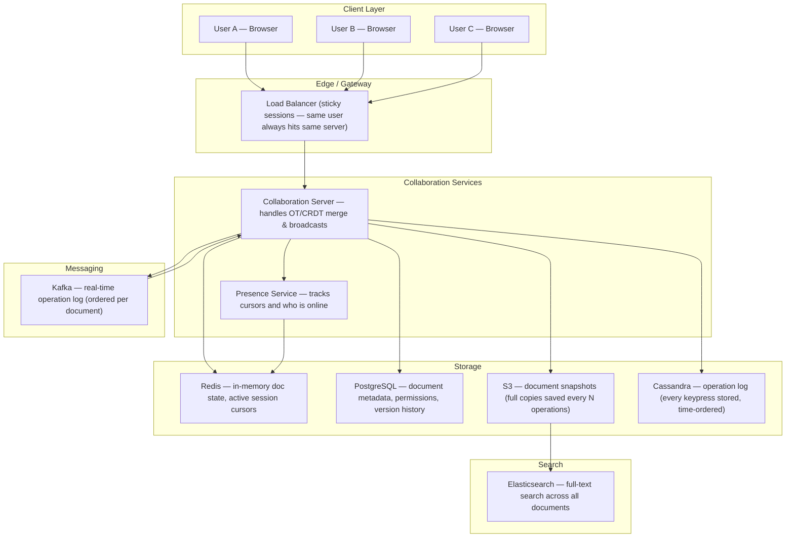
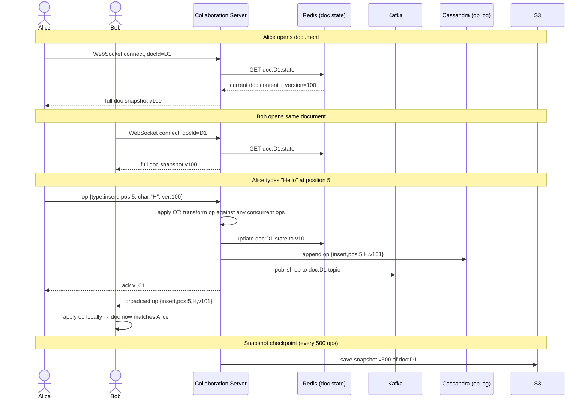
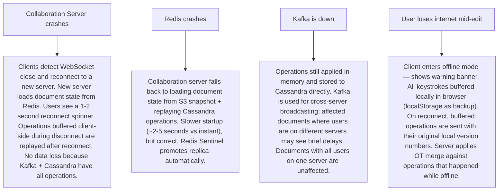

# Pattern 16 — Collaborative Editing (like Google Docs)

---

## ELI5 — What Is This?

> Imagine five friends all writing on the same piece of paper at the same time.
> If you and a friend both erase the same word simultaneously, whose erase wins?
> Collaborative editing systems solve this: every person's change is analysed, conflicts are resolved automatically,
> and everyone's paper shows the exact same thing — all within milliseconds.
> Google Docs, Notion, and Figma all do this.

---

## Glossary (Every Keyword Explained in ELI5)

| Word | ELI5 Meaning |
|---|---|
| **OT (Operational Transform)** | A math trick that takes two conflicting changes and figures out how to merge them so both changes survive and don't destroy each other. Google Docs uses this. |
| **CRDT (Conflict-free Replicated Data Type)** | A special data structure designed so that merging any two versions always gives the same result, no matter what order the merges happen. Like Lego bricks that always click together correctly. |
| **Operation** | A single change: "insert letter A at position 5" or "delete character at position 12". |
| **Version Vector** | A scoreboard that tracks which operations each user has seen, so you know exactly how far ahead or behind each person is. |
| **Cursor** | A blinking line showing where in the document a user is currently typing. In real-time collaboration, you see everyone else's cursor too. |
| **WebSocket** | A permanent two-way phone line between your browser and the server — unlike HTTP which is a series of brief calls. |
| **Presence** | The feature that shows "Alice is typing" or shows Alice's cursor on your screen. |
| **Snapshot** | A full copy of the document at a specific point in time, used for recovery and fast loading. |
| **Delta / Diff** | Only the changes since last snapshot, not the full document. Much smaller to send over the network. |
| **Tombstone** | A deleted character that is "marked as deleted" but not physically removed yet. CRDTs use tombstones so that operations that reference deleted characters can still be resolved correctly. |

---

## Component Diagram

---

## Step-by-Step Request Flow

---

## Bottlenecks — Every Point Explained

| # | Bottleneck | Why It Hurts | Fix |
|---|---|---|---|
| 1 | **Single collaboration server per document** | All users of the same document must be on the same server (to share in-memory state). If that server dies, all active users lose their session. | Active-standby replication: a standby server mirrors all operations. On primary failure, the standby takes over within seconds. Redis persists current state, so recovery is instant. |
| 2 | **Large documents with millions of operations** | Replaying 1 million operations to reconstruct a document is slow. Like reading every text message in history to know your current conversation. | Periodic snapshots to S3 every 500 operations. On load: fetch latest snapshot + replay only operations since then. |
| 3 | **OT complexity with many concurrent users** | OT transforms operations against one another. With 50 simultaneous typists, the transformation complexity grows quadratically. | CRDT-based systems (Yjs, Automerge) avoid central transforms — each client's state merges independently. Trade-off: higher memory per document. |
| 4 | **Presence at scale (showing cursors for 1000 co-editors)** | Broadcasting each cursor move to all 999 others = 999 messages per keystroke. At 60 keystrokes/second per user: 60,000 messages/second for one document. | Throttle cursor broadcasts to 5/second per user. Group small cursor updates into batches. Disable presence beyond 50 active users (show count only). |
| 5 | **WebSocket server memory** | Each WebSocket connection holds RAM on the server (socket buffer, session state). 100,000 concurrent editing sessions = significant RAM. | Horizontally scale collaboration servers. Use sticky load balancing so each server handles a subset of documents. |
| 6 | **Network partition — users editing offline** | User loses internet, types 200 characters offline, reconnects. Must merge with changes that happened while offline. | Client buffers all operations with local timestamps during disconnection. On reconnect, send entire buffer; server applies OT/CRDT merge. |

---

## What Happens When Each Part Fails?

---

## Key Numbers to Know

| Metric | Value |
|---|---|
| Operation size (one keypress) | ~100 bytes including metadata |
| Max concurrent editors per doc (Google Docs) | 100 users |
| Snapshot interval | Every 500 operations or 5 minutes, whichever first |
| WebSocket message round-trip | ~50ms (local region) |
| Operation log retention | 30 days (allows full history / undo) |
| Presence broadcast throttle | 5 cursor updates/second per user |
| Document load time target | Under 2 seconds (snapshot + delta replay) |

---

## How All Components Work Together (The Full Story)

Think of collaborative editing as a shared whiteboard in a meeting room, but over the internet. Everyone has their own copy of the whiteboard on their screen. When Alice draws something, the change is instantly sent to a central referee (the Collaboration Server), which ensures Alice's change doesn't collide with Bob's simultaneous change, resolves any conflict, and broadcasts the resolved change to everyone in the room.

**How a single keypress travels through the system:**
1. Alice presses "H" at position 5 of a document. Her browser immediately applies the change locally (so she sees instant feedback) and sends an **operation** `{insert, pos:5, char:'H', version:100}` over her WebSocket.
2. The **Collaboration Server** receives the operation. It checks Redis for all operations that happened since Alice's last acknowledged version. If Bob inserted a character at position 3 since version 100, Alice's position 5 must be recalculated to position 6 (OT transform). This is the core of collaborative editing.
3. The resolved operation (version 101) is written to **Redis** (live state), **Cassandra** (permanent op log), and published to **Kafka** (cross-server broadcasting).
4. The Collaboration Server broadcasts the resolved operation to all other clients connected to document D1 — including Bob, who applies it locally.
5. **Presence Service** separately broadcasts Alice's cursor position to Bob's screen via Redis Pub/Sub.
6. Every 500 operations, a snapshot job saves the full document to **S3**. This prevents slow startup times when loading old documents.

**Why the components need each other:**
- Redis provides the sub-millisecond state access needed to check concurrent operations for OT. Without Redis, every operation would need a DB query.
- Cassandra is the durable operation log — even if Redis loses its data, the entire document can be reconstructed by replaying every operation from the beginning (or from the last S3 snapshot).
- Kafka enables multiple collaboration servers to co-exist: documents can be served by different servers, and Kafka propagates operations between them.

> **ELI5 Summary:** The Collaboration Server is the referee. Redis is the whiteboard everyone shares. Cassandra is the video recording of every move anyone ever made. S3 is a photo taken every hour. Kafka is the loudspeaker that tells all referees when something changes.

---

## Key Trade-offs

| Decision | Option A | Option B | Why We Pick B (or A) |
|---|---|---|---|
| **OT vs CRDT** | Operational Transform (Google Docs): server-authoritative transform, simpler client | CRDT (Figma, Notion): peer-mergeable data structures, no central transform | **OT** for document text (linear ordering matters, server is natural authority). **CRDT** for rich documents with shapes/nodes (concurrent insertions anywhere). Google Docs uses OT; Figma uses CRDT. Neither dominates — choose based on document model. |
| **Centralized server vs P2P** | All operations routed through server — server is authoritative | Peer-to-peer: clients exchange operations directly | **Centralized** for reliability and security: a server can enforce permissions, resolve conflicts authoritatively, and maintain audit log. P2P has no authority and struggles with access control. |
| **WebSocket vs SSE + REST** | WebSocket: bidirectional persistent connection | SSE (Server-Sent Events) for ops down + REST POST for ops up | **WebSocket** for low-latency collaboration — round trip matters. SSE is adequate for one-way streams (feed updates) but not for high-frequency bidirectional doc edits where every 50ms matters. |
| **Eager vs lazy conflict resolution** | Resolve conflicts at server as they arrive (eager) | Buffer operations, resolve in batches (lazy) | **Eager** for better UX: resolving immediately means users see the merged result within 1 network round-trip. Lazy batching reduces CPU but increases the time before conflicts are visible to all users. |
| **Full snapshot vs delta storage** | Store full document on every save | Store only deltas (operations), reconstruct on read | **Deltas + periodic snapshots**: storing full document on every keypress is wasteful (100 bytes of change triggers a 1MB write). Deltas are tiny; snapshots limit replay length. Industry standard is both. |

---

## Important Cross Questions

**Q1. Two users select the same word and delete it simultaneously. What happens?**
> With OT: both delete operations arrive. Server applies the first one (word deleted, version increments), then transforms the second delete against the first. The second delete's target is already gone — the transform converts it to a no-op. Both users see the word deleted. No error, no duplicate deletion. The key insight: OT converts "delete at position X" into context-aware operations that can detect they've already been applied.

**Q2. How do you implement "undo" in a collaborative editor when multiple users have made changes since your last action?**
> Undo in collaborative editing is not a simple "go back in time" — rolling back your change would also undo other people's work. Instead: **selective undo** — your undo operation is itself an OT operation that reverses only your specific change while preserving everyone else's work. The operation log in Cassandra stores every user's operations tagged with userId, so the server can identify "all of Alice's operations" and compute a reverse operation, then transform it through all subsequent operations by others.

**Q3. A document has 10 years of operation history (500M operations). A new user opens it. How fast can you load it?**
> Direct replay of 500M operations would take minutes. Solution: S3 snapshot strategy. The most recent snapshot (e.g. from yesterday) reduces replay to only the last 24 hours of operations (maybe 50,000 ops). Load time: fetch snapshot from S3 (~200ms for a 2MB doc), replay 50,000 ops from Cassandra (~500ms). Total under 1 second. Older snapshots are kept for version history ("view document as it was on Jan 1, 2023").

**Q4. How does Google Docs let you name a version and share a read-only link to that specific version?**
> Named versions are stored as tagged snapshots in S3 keyed by `{docId, versionName}`. A shareable version link includes the snapshot S3 key (or version ID). When the link is opened, the system fetches that specific snapshot from S3 rather than the current live state. The sharing permission check uses the same permissions stored in PostgreSQL: if the doc is publicly viewable, the snapshot link requires no login. If private, the sharing link includes a signed token that grants read-only access to that specific snapshot.

**Q5. How do you handle a 1,000-person live presentation where everyone can see cursor but only the presenter types?**
> Two-tier access model: one user has `write` permission, all others have `view` permission. Write operations are only accepted from the presenter's WebSocket. Cursor presence from all 1,000 users is broadcast — but the Presence Service throttles aggressively (1 update/second per user, batch-broadcast every 100ms). The viewing clients receive a read-only WebSocket stream: changes only, no ability to send operations. Collaboration server applies back-pressure: if 1,000 presence updates/second flood in, it samples rather than relaying all of them.

**Q6. How do you implement comments and suggestions (Track Changes) on top of the document model?**
> Comments are stored as a separate data layer (not inline in the document content): a comment record references `{docId, anchorPosition, anchorLength, text, resolved, threadId}` in PostgreSQL. The anchor position is stored as a character offset that is also treated as an OT operation recipient — when text is inserted before the comment's anchor position, the anchor offset is updated via the same OT machinery. Track Changes (suggestions) are stored as "pending operations" with a proposerId in the operation log. Accepting a suggestion applies the operation; rejecting it deletes it. Both are OT operations and broadcast to all users.

---

## Real-World Apps That Use This Pattern

| Company | Product | How They Use It |
|---|---|---|
| **Google** | Google Docs / Sheets / Slides | The original and most widely used implementation. Google uses Operational Transform (Jupiter algorithm, documented in their 2006 paper). Operations flow through a central server (the "Wave" architecture). Google Workspace currently serves 3B+ users. The autocomplete and AI writing features (Gemini) are layered on top — they generate OT operations the same way a human keypress does. |
| **Figma** | Figma Design | Uses CRDTs internally for vector design objects. Each shape/layer is a CRDT node. Multiple users moving the same object simultaneously is resolved by "last writer wins" per property. Figma's engineering blog post "How Figma's multiplayer technology works" is the industry reference for CRDT-based collaborative editing at product scale. Acquired by Adobe for $20B — collaborative editing was the core differentiator. |
| **Notion** | Notion Pages | Block-based collaborative editing using a custom CRDT implementation. Each "block" (paragraph, heading, image) is a separate CRDT unit. Users editing different blocks never conflict at all. Users editing the same text block use OT-like merging. Notion's offline sync (edit on mobile with no connection, merge later) works because CRDTs are mergeable without a server. |
| **Microsoft** | Microsoft 365 / Teams | Office Online (Word, Excel, PowerPoint in the browser) uses a similar OT approach to Google Docs. Microsoft's "co-authoring" feature is backed by SharePoint/OneDrive for storage and a collaboration service layer. Excel's collaboration is the hardest — cell formula dependencies mean a cell edit in A1 can affect B2, C3, D4 chain — all these cascading effects must be broadcast. |
| **Coda / Quip** | Coda, Quip (Salesforce) | Salesforce acquired Quip (collaborative docs + spreadsheets) and integrated it with Salesforce CRM records. Salesforce reps can edit a proposal document while the linked CRM data auto-updates alongside — the collaboration layer merges CRM data updates with human edits. |
| **Liveblocks / Yjs** | Collaboration infrastructure-as-a-service | Liveblocks and Yjs are the open-source/SaaS building blocks many startups use instead of building from scratch. Yjs is the most popular CRDT library (used by Notion, Gitbook, Jupyter collaboration). Liveblocks wraps it as a managed service with presence, storage, and history. Demonstrates that the "collaborative editing" pattern is now a commodity layer, not a differentiator you must build yourself. |
