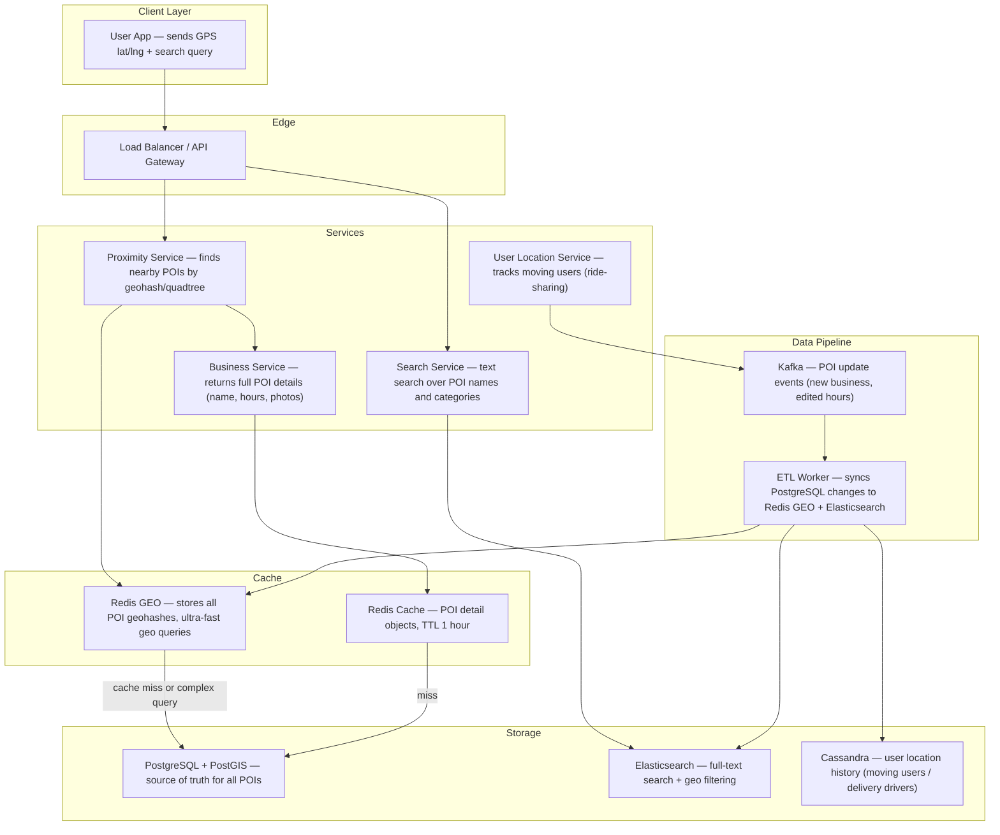
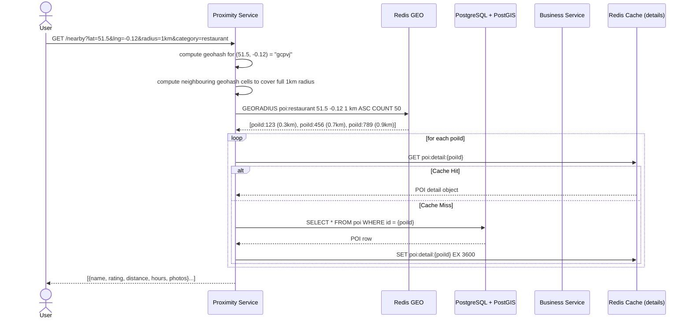
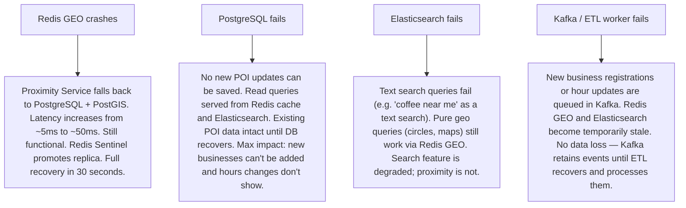

# Pattern 17 — Location / Proximity Service (like Yelp, Google Maps Nearby)

---

## ELI5 — What Is This?

> Imagine you're standing in a city and you ask: "What restaurants are within 1 mile of me?"
> Your phone knows your GPS coordinates. The server has a map with millions of restaurants pinned on it.
> The challenge: you can't check every restaurant in the world — there are millions.
> A proximity service turns your GPS into a tiny square on a map, then checks only
> restaurants in nearby squares. Fast, accurate, scalable.

---

## Glossary (Every Keyword Explained in ELI5)

| Word | ELI5 Meaning |
|---|---|
| **Geohash** | A way to convert (latitude, longitude) into a short text string like "u4pruydqqvj". Nearby places share the same prefix. "u4pru" means "somewhere in Paris". Longer the string, more precise the location. |
| **Quadtree** | A map divided into squares. If a square has too many points of interest, split it into 4 smaller squares. Repeat until each square has a manageable number. Like zooming in on a Google Map. |
| **PostGIS** | A plugin for PostgreSQL that adds geographic data types and can find all points within a radius using smart indexing (like Geohash but inside a database). |
| **R-Tree Index** | A database index specifically for spatial data. Like a filing cabinet where drawers are geographic regions. Looking up "all restaurants in central London" searches one drawer instead of all of them. |
| **Redis GEO** | A Redis data structure that stores (latitude, longitude, member-name) and can answer "give me all members within 5km of point X" in O(N+log M). Uses Geohash internally. |
| **Haversine Formula** | The math for calculating the real distance between two points on a sphere (Earth). Unlike flat-map math, it accounts for Earth's curvature. |
| **Search Radius** | The circle around a user's location used to find nearby places. Usually configurable: 0.5km, 1km, 5km, 25km. |
| **Point of Interest (POI)** | Any place users search for: restaurant, hotel, gas station, ATM, park. |
| **Reverse Geocoding** | Converting GPS coordinates (40.7128, -74.0060) to a human-readable address ("New York, NY"). |
| **Bounding Box** | A rectangle around a circle. Used as a pre-filter: find all POIs in the rectangle, then apply Haversine to keep only those truly inside the circle. |

---

## Component Diagram

---

## Step-by-Step Request Flow

---

## Bottlenecks — Every Point Explained

| # | Bottleneck | Why It Hurts | Fix |
|---|---|---|---|
| 1 | **Radius query on billions of POIs** | A naive `SELECT * WHERE distance < 1km` scans all rows. Billions of POIs = slow scan. | Geohash indexing + Redis GEO: queries only check cells within the radius. O(log N) instead of O(N). |
| 2 | **Hot geohash cells (Times Square, Shibuya)** | Dense urban areas have thousands of POIs in a tiny geohash cell. A single cell can overflow Redis memory. | Quadtree subdivision: split high-density cells into sub-cells. Dynamically adjust cell granularity by density. |
| 3 | **POI data updates (business closes, hours change)** | If a business changes its hours, the Elasticsearch index and Redis GEO cache must both be updated. Inconsistency window if update is partial. | Kafka event bus: a single POI update event is published once, consumed by both the ETL worker (updates Redis) and the search indexer (updates Elasticsearch). Atomic from the producer's perspective. |
| 4 | **Moving objects (delivery drivers, Uber drivers)** | Driver location changes every 4 seconds. 500,000 drivers = 125,000 Redis writes/second. Redis GEO can handle this but the write pressure is high. | Shard the driver location store by region (city). Each city has its own Redis instance. Cities are independent shards. |
| 5 | **Radius query returning too many results** | A 50km radius in New York might return 200,000 restaurants. Sending all to the client is wasteful. | Hard limit + pagination: return top 50 by distance with a `nextPageToken`. Client requests page 2 if needed. |
| 6 | **Cold start — new city with no cache** | First query in a new city misses all caches. Raw PostGIS query on millions of rows. | Pre-warm Redis GEO with all POIs at startup for each region. Background job runs every 24 hours. |

---

## What Happens When Each Part Fails?

---

## Key Numbers to Know

| Metric | Value |
|---|---|
| POIs in Google Maps | ~200 million globally |
| Geohash precision (length 6) | ~1.2km × 0.6km cell |
| Redis GEO GEORADIUS latency | Under 5ms |
| PostGIS geo query (with R-tree index) | 20-50ms |
| Driver location update frequency | Every 4 seconds |
| Typical search radius | 500m – 5km |
| Results per page | 20-50 POIs |

---

## How All Components Work Together (The Full Story)

Think of a proximity service as a city grid map. Instead of searching the entire city for coffee shops, you first identify which grid squares are within walking distance, then look up only the shops in those squares. The grid is the Geohash; each hash string represents a square on Earth's surface.

**A "nearby restaurants" search, end to end:**
1. User's app sends GPS coordinates and "restaurant" category to the **Proximity Service**.
2. The service computes the Geohash for the user's location and expands to neighbouring cells to cover the full search radius (9 cells for a 1km radius is typical).
3. **Redis GEO** executes a `GEORADIUS` command — an O(N+log M) operation that returns POI IDs sorted by distance. This takes ~5ms for millions of stored POIs.
4. Each returned POI ID is looked up in **Redis Cache** for its full details (name, rating, photos, hours). On a cache miss, the **Business Service** fetches from **PostgreSQL** and back-fills the cache.
5. The sorted, enriched list is returned to the user within 100ms total.

**How updates flow:**
When a restaurant owner updates their hours in the admin dashboard, the **Business Service** updates PostgreSQL, then publishes a `poi.updated` event to **Kafka**. The **ETL worker** consumes this event and updates both Redis GEO (refreshes the location entry) and Elasticsearch (re-indexes the document). This ensures search and geo results are always consistent.

> **ELI5 Summary:** Redis GEO is the city grid map with pins. PostgreSQL is the official business license database. Elasticsearch is the search box that understands "coffee" includes "café" and "espresso bar". Kafka is the postal service that tells all systems when a business changes something.

---

## Key Trade-offs

| Decision | Option A | Option B | Why We Pick B (or A) |
|---|---|---|---|
| **Geohash vs Quadtree** | Geohash: fixed-size cells, simple string prefix matching | Quadtree: dynamic subdivision, denser cells split further | **Redis GEO (Geohash)** for simple radius queries (fast, easy to shard). **Quadtree** for dynamic density scenarios (mapping app with zoom levels). Yelp uses Geohash; mapping platforms use dynamic quadtrees. |
| **Redis GEO vs PostGIS** | Redis GEO: in-memory, O(N+log M), ~5ms, limited filtering | PostGIS: disk-based, R-tree indexed, supports complex filters (rating > 4, open_now = true) | **Redis GEO** for the initial fast geo filter, **PostGIS** for complex queries with many filters. Use Redis as the first gate (returns 50 IDs), then PostGIS for re-filtering with business logic. |
| **Push vs pull for moving objects** | Driver pushes location every N seconds regardless | Server polls driver location on demand | **Push**: drivers push every 4 seconds. Pull would be too slow (1-2 second polling) and adds server RPS from all polling clients simultaneously. Push with throttling is standard. |
| **Per-city vs global Redis cluster** | One global Redis instance for all POIs worldwide | One Redis instance per city/region | **Per-region sharding**: global Redis would require massive RAM and have high cross-region latency. Users search locally; a New York search has no reason to touch a Tokyo instance. Partition by geohash prefix (first 2 characters). |
| **Real-time vs batch POI updates** | Every POI change is batched nightly into the search index | POI changes propagate immediately via Kafka | **Real-time via Kafka** for business-critical accuracy: a restaurant that closed an hour ago should not appear in results. Nightly batch would leave stale data for up to 24 hours. |

---

## Important Cross Questions

**Q1. A user searches "coffee shops near me" but the GPS is inaccurate by 500m. How does the system handle this?**
> The search radius is intentionally set larger than needed (e.g. 1.5km for a "1km" search) to account for GPS drift. The front-end also shows distance as "approximately X km" rather than exact. For truly inaccurate GPS (e.g. indoors), the app falls back to IP geolocation (city-level accuracy) and uses a larger default radius. The distance sorting still orders results by best-estimated distance, so the nearest results remain first.

**Q2. How do you ensure "open now" filtering works correctly across timezones?**
> Each POI stores its hours in local timezone with timezone identifier (`America/New_York`). The Business Service converts the user's current UTC time to the POI's local timezone using a library (e.g. `date-fns-tz`). The `open_now` flag is computed at query time — not stored pre-computed, because it changes every minute. For efficiency, the Redis GEO returns IDs first, then the Business Service computes `open_now` for each result after loading from its cache. The TTL on cached POI details is short (~5 minutes) to ensure hours changes are reflected quickly.

**Q3. You have 500,000 active delivery drivers. Their locations update every 4 seconds. How do you scale the location writes?**
> 500,000 updates / 4 seconds = 125,000 writes/second. Approach: (1) Shard by city — each city's Redis instance handles only that city's drivers. Average city has 5,000 drivers = 1,250 writes/second per Redis instance. Linear scalability. (2) Batch micro-aggregation: a location aggregator service accepts raw GPS events from drivers via Kafka, deduplicate rapid updates (if a driver barely moved, skip the update), and writes to Redis in bulk every 1 second. This reduces Redis write rate by 2-4×.

**Q4. How does Google Maps show real-time business busyness ("Usually busy on Saturdays at 2pm")?**
> Aggregated from Android location history (opt-in). When enough opted-in users are detected at a lat/lng matching a business, the count is recorded. After smoothing over many weeks/months of data, the busyness pattern becomes statistical. The raw location pings flow into a Kafka stream, a Spark job aggregates by POI ID and hour-of-week, and the result is stored as a time-series histogram per POI in a database. This is read and displayed in the Business Service response.

**Q5. How do you implement "along the route" search — "show petrol stations on the way to my destination"?**
> Decompose the route into a series of waypoints every 5km. For each waypoint, run a proximity search with a 2km radius. Merge and deduplicate the results (same station might appear in multiple waypoints). Sort by distance along the route (not just distance from current position). This is a sequence of proximity searches tied to a polyline. Google Maps and Waze both implement this as a route-aware POI query — the routing service provides the waypoints list, and the proximity service performs parallel geo lookups.

**Q6. Yelp gets a POI dataset update from a third-party data provider with 50 million rows. How do you ingest this efficiently?**
> Bulk import pipeline: (1) Data provider delivers CSV/Parquet to S3. (2) A Spark job reads the file, deduplicates against existing POIs (match by name+address), and produces an upsert stream. (3) The upsert stream writes to PostgreSQL via bulk COPY (much faster than individual INSERTs — 100× speedup). (4) A Kafka producer reads the changed rows from PostgreSQL CDC (Change Data Capture via Debezium/logical replication) and publishes update events. (5) ETL workers consume these events to update Redis GEO and Elasticsearch. Total time for 50M row full refresh: 2-4 hours. Incremental daily updates: minutes.

---

## Real-World Apps That Use This Pattern

| Company | Product | How They Use It |
|---|---|---|
| **Yelp** | Yelp local search | Yelp's engineering blog describes their quadtree-based proximity service. They maintain a quadtree of all businesses, pre-partitioned by city. "Find restaurants near me" queries the quadtree for the appropriate cells. Yelp enriches results with review count, rating, and price level before returning — all cached in their Business Service layer. |
| **Google** | Google Maps Nearby / Places API | The most sophisticated proximity system. Google's Places API powers thousands of third-party apps (Uber, Airbnb, DoorDash all use Google Places for address lookup). Internally uses a combination of geohash-indexed storage, real-time busyness from Android signals, and ML ranking to order results by relevance (not just distance). |
| **Uber Eats / DoorDash** | Restaurant discovery | When you open Uber Eats, the restaurant list is a proximity query filtered by delivery radius (each restaurant has its own delivery boundary polygon, not just a circle). The system checks if your address falls inside the restaurant's polygon — a more complex query than simple radius search, requiring polygon containment testing via PostGIS. |
| **Foursquare** | Venue check-ins / Places API | Foursquare built one of the earliest large-scale POI proximity systems. They have a 100M+ venue database with check-in signals. Foursquare's Places API is used by Snapchat, Pinterest, Twitter, and thousands of apps for location tagging. Their proximity system uses a custom geospatial index optimized for high read throughput and fresh data. |
| **Airbnb** | Listing map search | Airbnb's map search is a bounding-box query (show all listings inside the visible map viewport) crossed with availability and price filters. As you drag the map, a new bounding-box query fires. Their backend uses Elasticsearch's geo bounding box query against a geospatial index of all active listings. The combination of geo + price + date availability in one query is why Elasticsearch is preferred over Redis GEO for this use case. |
| **Snapchat** | Snap Map | Real-time locations of friends on a map. Friends' locations stored in a geospatial database; Snap Map queries for friends within the viewport. Privacy controls: "Ghost Mode" removes your location from the query results entirely. Scale: millions of concurrent location points updated constantly — sharded by user ID prefix across Redis GEO shards. |
