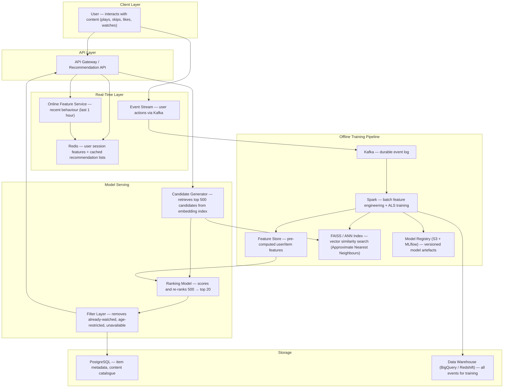
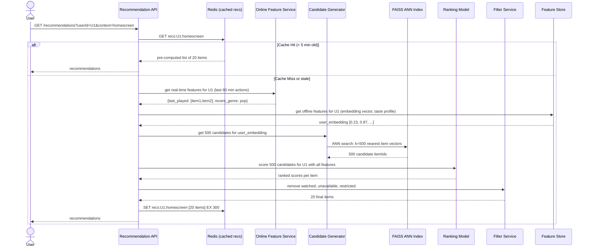
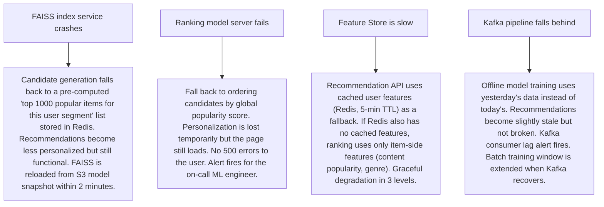

# Pattern 18 — Recommendation System (like Netflix, Spotify)

---

## ELI5 — What Is This?

> Netflix knows you watched three crime documentaries last week.
> It also knows that 10,000 other people who watched those same documentaries also loved "Mindhunter".
> So Netflix recommends "Mindhunter" to you — not because of anything you said,
> but because of what people like you did.
> A recommendation system is a giant pattern-matching machine:
> find people who behave like you, and show you what they loved.

---

## Glossary (Every Keyword Explained in ELI5)

| Word | ELI5 Meaning |
|---|---|
| **Collaborative Filtering** | "People like you also liked X." Finds users similar to you, recommends what they enjoyed. Does NOT need to know anything about the items themselves — only about behaviour patterns. |
| **Content-Based Filtering** | "You liked sci-fi with female leads. Here's another sci-fi with a female lead." Analyses item attributes and matches them to your preference profile. |
| **Matrix Factorisation** | A math trick that compresses a huge table of "user X rated item Y" into two smaller lists of hidden factors (e.g. "action-ness" and "romance-ness") to find patterns. Netflix Prize winning technique. |
| **Embedding** | A way to represent a user or item as a list of numbers (a vector) that captures its essence. Similar items have vectors that are close together in multi-dimensional space. |
| **Cosine Similarity** | A measurement of how similar two vectors are. Angle = 0° means identical, 90° means totally different. "Users A and B have 95% similar taste" comes from cosine similarity. |
| **ALS (Alternating Least Squares)** | The algorithm Netflix and Spotify use for matrix factorisation. Iteratively solves for user factors and item factors. Runs on Spark. |
| **Feature Store** | A database specifically for ML features — the inputs to models. Stores things like "user's average watch time", "preferred genre distribution". |
| **Offline vs Online Pipeline** | Offline: batch training that runs every few hours on historical data. Online: real-time updates that incorporate actions from the last few minutes. |
| **Implicit Feedback** | Behaviour signals without explicit ratings: watch time, plays, skips, scrolls, click-through. Netflix learned that star ratings (explicit) are less predictive than actual watching behaviour (implicit). |
| **Bandit Algorithm** | A strategy that balances showing items you'll definitely like (exploit) with occasionally showing unknown items to learn your taste (explore). Like a slot machine that uses your history to improve its guesses. |
| **Two-Tower Model** | A deep learning architecture with two neural networks — one for the user, one for the item — that produce embeddings which are compared by dot product. Used by YouTube/Google for recommendations. |

---

## Component Diagram

---

## Step-by-Step Request Flow

---

## Bottlenecks — Every Point Explained

| # | Bottleneck | Why It Hurts | Fix |
|---|---|---|---|
| 1 | **Scoring millions of items per user in real-time** | A ranking model scoring 50M items per user request would take minutes. Every user every page load. | Two-stage pipeline: (1) Candidate generation narrows 50M → 500 using ANN (approximate nearest neighbours) in FAISS (~10ms). (2) Ranking model scores only those 500 with a deeper model (~50ms). |
| 2 | **Cold start — new user with no history** | Collaborative filtering needs history. New users have none. | Fallback: show country/age-based popular items (popularity-based recommendations) until the user has at least 5 interactions. After that, transition to personalised. |
| 3 | **Model re-training latency** | ALS on 1B user-item interactions takes hours on Spark. The model is stale between runs. | Separate offline (daily full retrain) and online (real-time feature updates). The online layer captures last-hour behaviour and feeds it into the ranking model without retraining the full embedding. |
| 4 | **FAISS index memory** | FAISS stores all item embeddings (50M items × 128 dimensions × 4 bytes = 25.6 GB) in RAM for fast ANN search. | Quantize embeddings (128-dim float32 → 64-dim int8 = 8× compression). Shard the FAISS index across multiple nodes. Use IVF (inverted file index) to probe only a subset of the index. |
| 5 | **Popularity bias** | Collaborative filtering amplifies already-popular items — they get recommended more, so they get watched more, so they're recommended even more. Long-tail items (niche content) get buried. | Diversification: in the filter layer, ensure the top-20 includes ≥30% "discovery" items (outside top 1% popularity). Bandit algorithm for exploration. |
| 6 | **Real-time feedback loop** | User skips a recommended song. Without a real-time update, the same song is recommended again in the next session. | Online feature service captures skip events within 30 seconds. The ranking model's real-time feature includes "skipped in last 60 minutes" — immediately down-weights that item. |

---

## What Happens When Each Part Fails?

---

## Key Numbers to Know

| Metric | Value |
|---|---|
| Netflix catalogue size | ~15,000 titles (varies by region) |
| Spotify song catalogue | 100M+ tracks |
| User embedding dimensions | 64–256 dimensions typical |
| Candidate generation (FAISS ANN) | ~10ms for top-500 from 50M items |
| Ranking model inference | 20-50ms for 500 candidates |
| Full recommendation API P99 | Under 100ms |
| Model training frequency (offline) | Daily (ALS on full data) |
| Cache TTL for recommendation lists | 5 minutes (homescreen), 30 minutes (email digest) |
| Cold start threshold | 5 interactions before personalization kicks in |

---

## How All Components Work Together (The Full Story)

Think of a recommendation system as a highly efficient matchmaking service. It has two jobs: first, quickly screen millions of potential matches to find the 500 most plausible candidates; second, deeply score those 500 to pick the best 20. The first job needs speed; the second needs accuracy.

**The offline pipeline (runs daily):**
Every 24 hours, Spark processes billions of interaction events (plays, skips, completions, ratings) from the Data Warehouse. It runs ALS (Alternating Least Squares) matrix factorisation across the full user × item matrix. The output: a 128-dimensional embedding vector for every user and every item. These vectors are stored in the Feature Store (for users) and loaded into FAISS (for items).

**The online pipeline (real-time):**
When you play a new song, the event hits Kafka in under 1 second. The Online Feature Service updates your session features: genres listened to in the last hour, skipped artists, completion rate per song. These session features augment your offline embedding in real-time for the ranking model.

**At request time (when you open the app):**
1. The Recommendation API checks Redis for a cached recommendation list (valid for 5 minutes).
2. On cache miss: (a) load your current user embedding from the Feature Store; (b) run FAISS ANN search to get the 500 item embeddings nearest to yours; (c) pass all 500 to the Ranking Model, which combines your embedding + item features + real-time session features to score each candidate; (d) Filter removes already-heard songs, explicit content (if filtered), unavailable tracks; (e) top 20 returned to the user and cached in Redis.

> **ELI5 Summary:** FAISS is the speed-dating round — quickly finds 500 "might like" matches from millions. Ranking Model is the dinner date — deeply evaluates those 500. Filter is the bouncer checking IDs. Redis keeps the final guest list so the restaurant doesn't repeat the speed-dating round on every visit.

---

## Key Trade-offs

| Decision | Option A | Option B | Why We Pick B (or A) |
|---|---|---|---|
| **Collaborative vs content-based filtering** | Content-based: "you liked action films, here's more action" | Collaborative: "people like you liked X" | **Hybrid both**: content-based for cold start (new items with no interaction history). Collaborative for warm users. Netflix, Spotify both use hybrid models that blend both signals. Neither alone is sufficient. |
| **ALS vs deep learning (Two-Tower)** | ALS matrix factorisation: fast, explainable, fewer parameters | Two-Tower neural network: higher accuracy, captures complex patterns | **Two-Tower for production at scale** (YouTube, TikTok). **ALS for smaller datasets or explainability requirements**. ALS was state-of-the-art 2010-2018; Two-Tower is now dominant for billion-scale systems. |
| **Pre-computed vs real-time recommendations** | Compute recommendations offline for all users daily, serve from cache | Compute recommendations at request time with fresh signals | **Hybrid**: pre-computed base recommendations cached in Redis (fast), refreshed every 5 minutes with real-time signals. Pure real-time is slow; pure pre-computed misses "I just listened to death metal for the first time". |
| **Explore vs exploit tradeoff** | Always recommend items you're highly confident the user will like (exploit) | Occasionally recommend unknown items to discover new tastes (explore) | **Both (epsilon-greedy or Thompson Sampling)**: 70% exploit (confident recommendations), 30% explore (discovery). Without explore, users get into filter bubbles and eventually churn when they're bored. |
| **Individual vs segment-based recs** | Fully personalised model per user | Segment users into clusters; one model per cluster | **Individual for large platforms** (Netflix/Spotify have the data density). **Segment-based for smaller platforms** or for new users before sufficient individual data. |

---

## Important Cross Questions

**Q1. How does Netflix recommend a brand new movie that was just released and has zero watches?**
> Cold start for items: use content metadata. Netflix tags each title with genre, director, cast, tone (dark, comedic), themes. These are used to compute an initial item embedding based on similar existing titles. A new crime thriller by a director you've watched before gets placed near those existing crime thrillers in the embedding space immediately, before any viewer data exists. As watches accumulate, the embedding shifts to reflect actual viewer behaviour. This transition from content-based to behaviour-based is called "embedding warming."

**Q2. You notice recommendation diversity has dropped — users are stuck in a "filter bubble". How do you fix it?**
> Multiple levers: (1) Diversification constraint in the Filter layer: no more than 3 items of the same genre/artist in any recommendation list. (2) Raise the epsilon in the explore-exploit strategy from 20% to 35% for affected user segments. (3) Serendipity boost: a weighted component that explicitly rewards item diversity (penalizes recommending items too similar to each other). (4) Temporal freshness: weight items from the last 6 months higher — prevents users being stuck seeing the same catalogue items they've been declining for months. Monitor with a "discovery rate" metric: % of recommended items the user had never seen before.

**Q3. How do you A/B test a new ranking model without degrading the experience for the control group?**
> Shadow mode first: new model runs in parallel for all users but its output is discarded. Compare ranking scores with production model on the same candidates for 48 hours. If the new model's top picks look plausible (offline evaluation of test metrics like NDCG, hit rate), move to A/B: route 5% of traffic to the new model. Track: click-through rate, watch completion rate, session length, subscription retention. Run for 2 weeks (enough data for statistical significance). If metrics improve, gradually ramp to 100%. Model Registry (MLflow) tracks which model version each user segment is on.

**Q4. Spotify has 100M tracks but most users only ever hear 0.01% of them. How do you surface long-tail content?**
> Discovery features: (1) "Discover Weekly" playlist — specifically a long-tail discovery mechanism. The algorithm forces ≥50% of songs to come from artists with <1000 monthly listeners. (2) "Release Radar" — new music from followed artists. (3) Genre radio with diversity forcing: when you play a genre station, the bandit algorithm occasionally shows tracks with <100 plays globally. (4) Podast-style "creator tips": human editorial teams manually surface emerging artists into "mood playlists" that bypass the pure ML pipeline. The insight: pure ML without editorial leads to rich-get-richer; diversity requires intentional architectural choices.

**Q5. A user's taste completely changed — they used to love pop but now only listen to jazz. How does the system adapt?**
> The offline ALS embedding updates daily — after 1-2 weeks of jazz listening, the user's embedding vector shifts. The online feature service captures recent genre preference in real-time: "100% jazz in last 7 days" — this real-time feature overrides the historical embedding's pop preference in the ranking model. Additionally, explicit recency weighting: interactions in the last 30 days are weighted 5× higher than those from 12 months ago in the training data. Most recommendation systems do time-decay on training data for exactly this reason.

**Q6. How do you design personalized email recommendations ("Your weekly digest") for 200M users?**
> Batch recommendation job: runs weekly, uses the same FAISS + Ranking pipeline but as a Spark batch job rather than real-time. Produces a list of top 10 items per user and stores in a recommendations table. Email generation workers read from this table and generate HTML emails. The batch job is partitioned by user_id hash across Spark workers — 200M users / 1000 partitions = 200K users per partition. Total job time: 2-3 hours with a large Spark cluster. Edge case: if a user's cached recommendations are more than 24 hours old, regenerate. If user has unsubscribed from emails, skip.

---

## Real-World Apps That Use This Pattern

| Company | Product | How They Use It |
|---|---|---|
| **Netflix** | Netflix Recommendations | Netflix's entire product is built around recommendations. Their 2009 Netflix Prize ($1M for improving RMSE by 10%) legitimised collaborative filtering. Production system: multi-armed bandit for homepage row ordering, Two-Tower neural model for candidate retrieval, gradient-boosted trees for ranking. Netflix estimates recommendations save them $1B/year in reduced churn (users who get good recommendations don't cancel). Published "System Architectures for Personalization" engineering post. |
| **Spotify** | Discover Weekly / Wrapped | Discover Weekly (2015) was a landmark product. 2B+ playlists created weekly. The algorithm: (1) collaborative filtering finds users with similar listening patterns; (2) items they loved that you haven't heard are extracted; (3) NLP on Spotify playlist names across the internet provides genre/mood tags for content-based signals. "Wrapped" (year-end stats) is a data aggregation pipeline on top of the same user-item interaction log. |
| **YouTube** | YouTube Recommendations | The most influential recommendation system paper: "Deep Neural Networks for YouTube Recommendations" (2016). Two-stage architecture (candidate generation → ranking) as described above. YouTube recommendation drives 70% of all watch time. The "rabbit hole" problem (radicalisation through increasingly extreme recommendations) is the downside of pure engagement optimization — YouTube has since added human policy constraints on recommendation diversity. |
| **TikTok** | For You Page | The most aggressive recommendation system. No follow graph needed — pure content-based + collaborative signals on short videos. New accounts get personalized within the first 5-10 videos. TikTok's competitive advantage is the speed of the feedback loop: a 15-second video gets a watch-completion signal in 15 seconds (vs Netflix where a show takes 40+ minutes to know if someone liked it). Faster signal = faster learning. |
| **Amazon** | "Customers who bought this also bought" | The original e-commerce recommendation (patented 1999). Item-to-item collaborative filtering: precompute for every item, which other items are co-purchased. At recommendation time: no ANN search needed — just look up the pre-computed item-to-item table. Simpler than user-to-user collaborative filtering and scales easily. Amazon A/B tested their recommendation engine in 2012 and showed it drives 35% of their revenue. |
| **LinkedIn** | "People You May Know" | Social graph-based recommendations. If A knows B, and B knows C, recommend C to A. But at 900M users, brute-force graph traversal is impossible. LinkedIn uses a people embedding model (trained on graph walks — similar to Word2Vec but on the social graph) to find users "near" you in embedding space. Published research: "GraphSAGE at LinkedIn" and "LinkedIn Economic Graph recommendations." |
