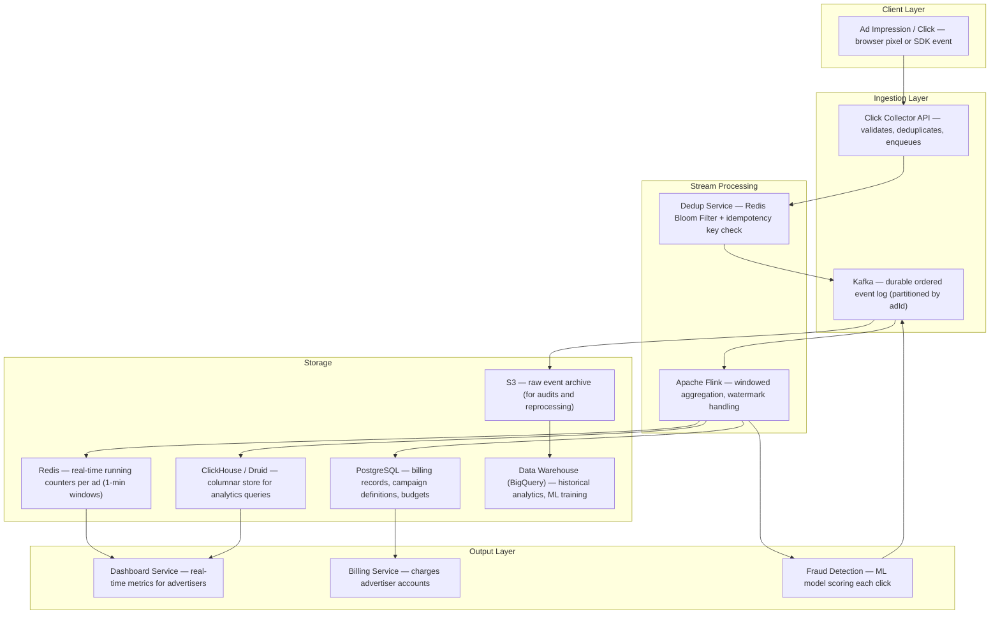
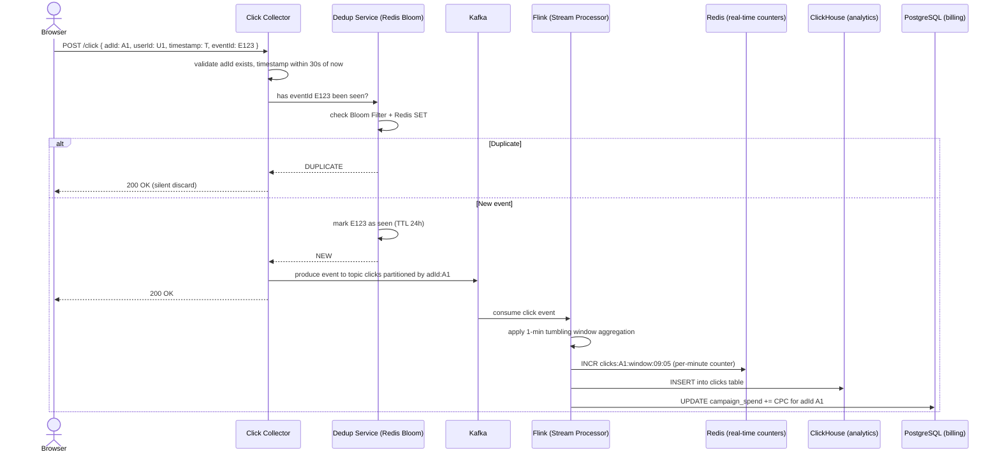
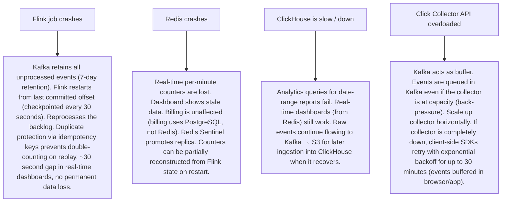

# Pattern 19 — Ad Click Aggregation (like Google Ads Analytics)

---

## ELI5 — What Is This?

> Imagine a company pays Google to show their ad one million times per day.
> Every time someone clicks the ad, Google needs to record it and bill the company.
> But a million clicks per day means 12 clicks per second — and Google runs millions of campaigns.
> Ad click aggregation is about collecting every click event reliably, counting them accurately,
> preventing fraudulent double-counting, and producing real-time billing dashboards.
> Get the count wrong and either advertisers overpay or Google loses money.

---

## Glossary (Every Keyword Explained in ELI5)

| Word | ELI5 Meaning |
|---|---|
| **Impression** | One time an ad was shown to a user (whether they clicked or not). Billed separately from clicks in CPM (cost per thousand impressions) campaigns. |
| **Click** | A user actually clicking on an ad. The primary billing event for CPC (cost-per-click) campaigns. |
| **Deduplication** | Preventing the same click from being counted twice. A user who clicks 10 times on the same ad should count as 1 (or be detected as fraud). |
| **Idempotency Key** | A unique ID attached to each event. If the same event is processed twice, the idempotency key detects the duplicate and ignores the second one. |
| **Aggregation Window** | A time bucket used to group events. "Clicks per minute" uses a 60-second window. "Daily clicks" uses a 24-hour window. |
| **Watermark** | A timestamp used in stream processing to know when all events for a time window have arrived. "I'll wait 5 seconds after the window closes before computing the total, to catch late-arriving events." |
| **Tumbling Window** | Fixed, non-overlapping time slots: 09:00-09:01, 09:01-09:02, etc. Each event belongs to exactly one window. |
| **Sliding Window** | Overlapping time slots: "last 60 seconds" recalculated every second. More flexible, more computationally expensive. |
| **Lambda Architecture** | A data architecture with two paths: a fast stream path (near-real-time but approximate) and a slow batch path (accurate but delayed). Results are merged. |
| **Kappa Architecture** | Replace both stream and batch with a single streaming pipeline. Simpler than Lambda; re-processes historical data by replaying the event log. |
| **Click Fraud** | Fake clicks — either bots clicking ads to drain a competitor's budget, or website owners clicking their own ads to earn more revenue. Detection is critical. |
| **OLAP (Online Analytical Processing)** | Databases designed for aggregations over large datasets (SUM, COUNT, GROUP BY). Fast for analytics dashboards. Examples: ClickHouse, Druid, BigQuery. |

---

## Component Diagram

---

## Step-by-Step Request Flow

---

## Bottlenecks — Every Point Explained

| # | Bottleneck | Why It Hurts | Fix |
|---|---|---|---|
| 1 | **Click collector as a hotspot** | Google receives millions of click events per second. A single API server can't handle this. | Horizontally scale the click collector behind a load balancer. Stateless API servers (no in-memory state) — easy to scale. Kafka absorbs burst traffic downstream. |
| 2 | **Kafka partition hotspot for popular ads** | All clicks for a viral ad go to one Kafka partition (partitioned by adId). One partition = one Flink task. One task = one CPU. | Sub-partition high-volume ad IDs: `adId:A1:shard_0`, `adId:A1:shard_1`, etc. Flink aggregates across shards before producing final count. |
| 3 | **Late-arriving events** | A mobile user's network is slow. Their click from 09:04:55 arrives at 09:05:03 (after the 09:04-09:05 window closed). Naively it's counted in the wrong window or dropped. | Watermarks in Flink: "wait 10 seconds after window close before emitting results". Events arriving within the watermark tolerance are included. Events beyond the tolerance are emitted as late data and handled separately (sent to a side output for reconciliation). |
| 4 | **Deduplication at high throughput** | Storing every event ID for 24 hours to detect duplicates: 1 billion events × 128 bytes per UUID = 128 GB of Redis RAM. | Bloom Filter: probabilistic deduplication. A Bloom Filter can represent 1 billion IDs in ~1.2 GB with 0.1% false positive rate (0.1% of valid clicks rejected, 0% of duplicates pass through). Acceptable trade-off for click fraud. |
| 5 | **Reconciliation between real-time and batch** | Real-time Flink counts may differ from batch reprocessing (due to late events, restarts). Advertisers demand one source of truth. | Lambda Architecture: real-time Redis counters for dashboards (speed). Batch reprocess of S3 raw events nightly for billing (accuracy). Billing uses batch truth; dashboards use real-time. |
| 6 | **Budget exhaustion — ad should stop showing** | An advertiser has a $100 daily budget. When it's used up, ads should stop immediately. If billing is delayed by the batch pipeline, they overspend. | Real-time spend tracking: Flink updates a Redis counter for remaining budget as each click is processed. Ad Serving checks this Redis counter before serving each impression. Budget exhaustion becomes eventual-consistent within seconds (not 24 hours). |

---

## What Happens When Each Part Fails?

---

## Key Numbers to Know

| Metric | Value |
|---|---|
| Google Ads clicks processed | 5-8 billion/day (~60,000–90,000/second) |
| Kafka partition count for click topic | Hundreds (for parallelism) |
| Flink window size | 1 minute (tumbling) for real-time; 1 hour for billing |
| Watermark tolerance | 10–30 seconds (to catch late mobile events) |
| Bloom Filter RAM for 1B events | ~1.2 GB (0.1% false positive rate) |
| Redis counter per ad per minute | O(1) space, O(1) INCR |
| S3 raw event retention | 90 days (for reprocessing, audits) |
| Billing reconciliation | Nightly batch vs real-time running total; diff must be < 0.01% |

---

## How All Components Work Together (The Full Story)

Think of ad click aggregation as a high-speed toll system on a motorway. Every car that passes through (a click) must be counted, billed to the right account, checked for fraud (was this a real driver or a ghost car?), and its data stored both for real-time dashboards and long-term auditing.

**The path of a single click:**
1. A user clicks an ad on a webpage. The browser fires a `POST /click` to the **Click Collector API** with a unique `eventId`, `adId`, `userId`, and timestamp.
2. The Collector validates the event (is adId real? Is timestamp within 30 seconds?), then checks the **Dedup Service** (Bloom Filter in Redis): has `eventId` been seen? On first encounter, marks it as seen and publishes to **Kafka**.
3. **Apache Flink** consumes the Kafka stream, partitioned by adId. It maintains a 1-minute **tumbling window** per adId. As clicks arrive, it increments the window count. When the window closes (plus the watermark delay), it emits the final count.
4. Flink writes the aggregated result to three places simultaneously: **Redis** (live counter for real-time dashboards), **ClickHouse** (columnar analytics DB for historical queries), and **PostgreSQL** (billing: deduct from advertiser's budget).
5. The raw events are also written to **S3** — the ground truth for any future audit or dispute.
6. A **Fraud Detection** model scores each click stream for anomalies: clicks from the same IP in rapid succession, clicks with no subsequent page engagement, geographic anomalies. Flagged clicks are marked in Kafka as suspected fraud and excluded from billing.

> **ELI5 Summary:** Kafka is the conveyor belt that never drops anything. Flink is the counting machine that groups clicks into minute-buckets. Redis is the scoreboard showing live counts. ClickHouse is the report archive for "how many clicks did this campaign get last Tuesday between 2pm and 3pm?" PostgreSQL is the cash register. S3 is the CCTV footage for audits.

---

## Key Trade-offs

| Decision | Option A | Option B | Why We Pick B (or A) |
|---|---|---|---|
| **Lambda vs Kappa architecture** | Lambda: separate stream (fast/approximate) + batch (slow/accurate) pipelines | Kappa: single stream pipeline, replay historical data by re-reading Kafka | **Lambda** for billing (accurate batch truth for invoicing). **Kappa** for simpler systems or where replay speed is sufficient. Ad systems typically use Lambda because billing accuracy is non-negotiable and batch pipelines are well-understood. |
| **Exact deduplication vs Bloom Filter** | Store every event ID in Redis SET for 24 hours: exact but expensive (~128 GB) | Bloom Filter: 0.1% false positive rate, ~1.2 GB | **Bloom Filter**: a 0.1% false-reject rate on valid clicks is acceptable for ad analytics. The resulting revenue discrepancy is well within billing dispute resolution margins. For medical/financial systems, exact deduplication only. |
| **Per-event billing vs batched billing** | Charge advertiser's balance with every single click | Batch: summarize clicks every 1 minute, charge once per batch | **Batched billing**: per-event billing would hammer PostgreSQL with millions of tiny UPDATE statements. 1-minute batches reduce DB writes by 60× while keeping billing near-real-time. |
| **Kafka partitioned by adId vs userId** | Partition by adId: all clicks for one ad in one partition (ordering per ad) | Partition by userId: distributes load by user base | **Partition by adId**: Flink aggregation by ad requires all events for one ad to be in one partition. Partitioning by userId would scatter one ad's clicks across all partitions, requiring a shuffle/re-partition step. |
| **ClickHouse vs Druid for analytics** | Apache Druid: built-in real-time ingestion, complex pre-aggregations | ClickHouse: raw SQL on columnar data, simpler, faster ad-hoc queries | **ClickHouse** for ad analytics: raw ad-hoc query speed at petabyte scale with standard SQL. Druid is better for pre-aggregated OLAP with complex rollup requirements. Both are used in industry; ClickHouse is gaining ground. |

---

## Important Cross Questions

**Q1. An advertiser disputes that they were charged for 1000 clicks but their website analytics only shows 800. How do you reconcile?**
> First principle: S3 raw events are the immutable source of truth. Pull all click events for the campaign from S3 (by adId + time range) and reproduce the count. The discrepancy could be from: (1) network drops between your click collector and the advertiser's site (user clicked, our server recorded it, but their tracker didn't fire — your count is correct because the click event reached our server); (2) fraud filtering differences (we may filter some clicks as fraudulent that they don't). Provide the advertiser with a downloadable click log (anonymized by userId) so they can audit. Include the fraud filter logic in the advertiser agreement.

**Q2. How do you detect click fraud from a bot clicking an ad 10,000 times in 1 minute from 1000 different IPs?**
> Behavioral signals: (1) Same user-agent string across all IPs. (2) Click-to-conversion rate near 0% (bots never buy anything). (3) Inter-click timing is too regular (human clicks are random; bots click every N milliseconds precisely). (4) IP reputation check via external threat intelligence feed. The Fraud Detection model (Flink real-time) computes per-IP click rate, per-campaign click velocity, and session depth features. Flags the campaign as under attack. Automatically excludes flagged IPs from billing and files an abuse report.

**Q3. How do you handle a 12-hour Flink outage and ensure the backlog is processed correctly without double-counting?**
> Kafka retains all events for 7 days. Flink uses checkpointing (every 30 seconds of processed offset committed to Kafka and to Flink's state backend). On restart, Flink reads from the last committed offset — not the beginning. Exactly-once semantics are maintained because: (1) Kafka to Flink uses committed offsets; (2) Flink to ClickHouse/ Redis uses idempotency keys (Flink's exactly-once sink connector with ClickHouse uses a two-phase commit). After 12 hours of backlog, Flink processes at 10× normal throughput until caught up.

**Q4. How do you implement real-time budget pacing — spreading a $1000 budget evenly across 24 hours instead of spending it all at 9am?**
> Pacing algorithm: target spend rate = $1000 / 24 = ~$41.67/hour. The Ad Serving system reads available budget from Redis every second. If actual spend rate exceeds the target rate by >10%, throttle ad serving frequency for this campaign (reduce the bid multiplier so the campaign wins fewer auctions). The Flink pipeline updates the actual spend in Redis every 60 seconds. A pacing controller compares actual vs target and adjusts the serving frequency. This prevents a common scenario where a campaign blows its entire budget in 2 hours and then shows zero ads for the rest of the day.

**Q5. How do ads handle attribution — crediting a purchase to the right ad click when a user clicked multiple ads before buying?**
> Attribution models: (1) Last-click attribution: the last ad clicked before purchase gets 100% credit. Simple but biases toward bottom-of-funnel ads. (2) Linear attribution: split credit equally across all clicks. (3) Time-decay: more credit to clicks closer to the purchase. (4) Data-driven attribution: ML model determines which clicks actually influenced the purchase. Implementation: tag every purchase event with the full click history (stored in a session cookie or server-side event log). The Attribution Service joins purchase events with click events, applies the attribution model, and writes credit to PostgreSQL for billing. This is done in batch (daily) for most attribution models.

**Q6. How do you scale the system for Black Friday when click volume spikes 20× overnight?**
> Pre-scaling: based on historical Black Friday data, provision Kafka partitions (double normal count), scale Flink task slots (horizontal), and pre-scale Redis and ClickHouse. Auto-scaling triggers: Kafka consumer lag metric → if lag > 1 minute, trigger a scale-out of Flink. Redis: consistent sharding ensures more nodes can be added transparently. Click Collector API: stateless, so auto-scaling groups handle burst instantly. Critical protection: budget exhaustion checks must remain accurate during the spike — a campaign spending 20× faster must stop at its daily budget, not overshend. Real-time Redis budget counter handles this correctly regardless of throughput.

---

## Real-World Apps That Use This Pattern

| Company | Product | How They Use It |
|---|---|---|
| **Google** | Google Ads (formerly AdWords) | Processes 8 billion+ clicks/day across all properties. Their system is described in the "MillWheel" and "Dataflow" papers — Google built their own stream processing (now Apache Beam) specifically for this use case. Click fraud detection at Google uses ML models trained on trillions of signals. Campaign spend dashboards are near-real-time (~1 minute latency). |
| **Meta** | Facebook / Instagram Ads | Meta processes hundreds of billions of ad events daily. Their "Scuba" system (ad-hoc real-time analytics) and "Puma" (real-time aggregation) are the equivalents of ClickHouse + Flink in this architecture. Meta's contribution to open source (Apache Thrift, RocksDB) came from this infrastructure work. |
| **Twitter / X** | Promoted Tweets | Twitter's ad click pipeline uses Kafka + Storm (early Hadoop-era) and has modernised to Kafka Streams + Kafka KSQL. Real-time bid pricing requires knowing per-engagement metrics (CTR) within seconds of campaign launch. Their engineering post "Real-time revenue optimization" describes the exact Lambda architecture. |
| **Criteo** | Retargeting ads | One of the largest independent ad networks. Criteo's system tracks which product pages you visited, then serves retargeting ads across millions of partner websites. Their pipeline must join click events with product catalogue data in real-time to update recommendation weights per campaign. Published "Large-scale real-time click prediction" research. |
| **Cloudflare** | Cloudflare Analytics (Zaraz) | Cloudflare Tags Manager uses the same click aggregation pattern for their customers — aggregate all page visits, click events, and conversion signals without performance impact on the host website by running tracking pixels at the edge. Shows the pattern applied to first-party analytics rather than ad billing. |
| **Snowflake / ClickHouse** | OLAP infrastructure | The analytics query engines that power ad dashboards for most of the industry. ClickHouse's benchmark: 1 trillion row table, `COUNT(*)` WHERE clause in under 1 second. This query speed is what makes "show me all clicks for campaign X, grouped by hour, for the last 90 days" return instantly in an advertiser dashboard. |
