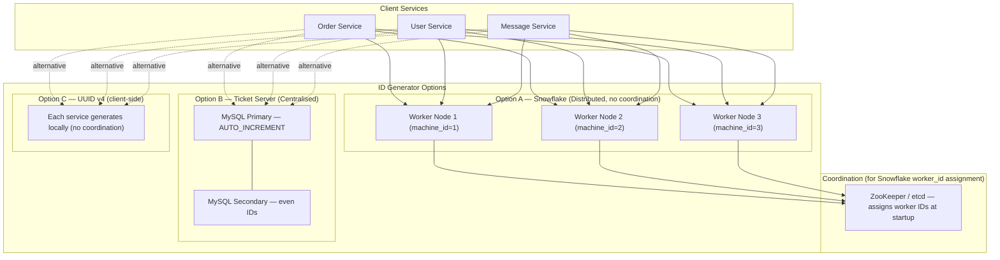
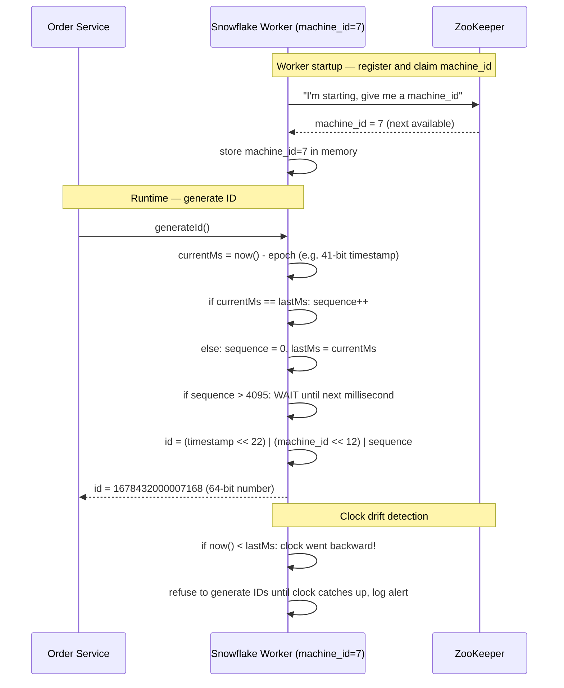
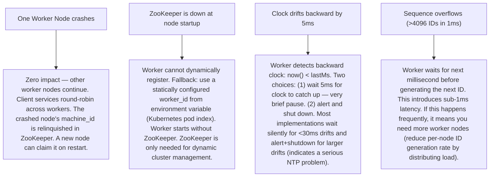

# Pattern 20 — Distributed ID Generator (like Twitter Snowflake)

---

## ELI5 — What Is This?

> Imagine a ticket machine at a deli counter.
> Every customer gets a unique number: 1, 2, 3, 4...
> Now imagine 100 deli counters across the country all handing out tickets simultaneously.
> If counter A uses numbers 1-1000 and counter B uses 1001-2000, they won't conflict.
> A distributed ID generator is the internet version of this — thousands of servers each
> generating unique IDs at the same time, guaranteed never to collide, and they embed the
> creation time inside the ID so you can sort by it.

---

## Glossary (Every Keyword Explained in ELI5)

| Word | ELI5 Meaning |
|---|---|
| **Snowflake ID** | A 64-bit number invented by Twitter that packs three things: the timestamp (when was this ID created?), a machine ID (which server created it?), and a sequence number (if two IDs were created in the same millisecond on the same server, which was first?). |
| **Monotonically Increasing** | Always going up. Never goes backwards or repeats. Like a car odometer. |
| **k-sortable** | IDs generated later are larger than IDs generated earlier. Means you can sort a table by ID and get chronological order — without storing a separate timestamp column. |
| **UUID (Universally Unique Identifier)** | A random 128-bit number. Like rolling dice 32 times. Guaranteed unique, but NOT sortable (random order). Takes more storage than a Snowflake. |
| **Epoch** | A fixed starting point in time. Snowflake IDs count milliseconds since a chosen epoch (e.g. Jan 1, 2010). This lets the 41 timestamp bits last ~69 years. |
| **Machine ID / Worker ID** | A unique number (1-1024) assigned to each server that generates IDs. Set at server startup. Ensures two servers never generate the same ID even in the same millisecond. |
| **Sequence Number** | A counter within one millisecond on one machine. If 4096 IDs are generated in one millisecond on one machine, they're all unique because they have different sequence numbers. |
| **Clock Drift** | When a server's system clock drifts backward in time (e.g. due to NTP synchronisation). A problem for Snowflake — a backward clock can generate duplicate timestamps. |
| **NTP (Network Time Protocol)** | The internet protocol that synchronises clocks across servers. Usually drifts ±10ms. |
| **Ticket Server** | A simpler approach: a central MySQL server with an `AUTO_INCREMENT` column is the one source of unique IDs. Simple but a single point of failure. Used by Flickr historically. |

---

## Component Diagram

---

## Step-by-Step Request Flow (Snowflake)

---

## Bottlenecks — Every Point Explained

| # | Bottleneck | Why It Hurts | Fix |
|---|---|---|---|
| 1 | **Clock drift** | If the server clock moves backward (NTP sync), two different IDs could have the same timestamp component, risking duplicates. | Snowflake workers refuse to generate IDs during backward clock periods. They wait until `currentMs >= lastMs`. Alert fires. Ensure NTP is configured conservatively (gradual slew, never step). |
| 2 | **Worker ID exhaustion** | Snowflake supports 1024 machine IDs (10 bits). If more than 1024 ID generator nodes are running, you run out. | For large deployments: extend worker ID bits (e.g. 12 bits = 4096 nodes), reducing sequence bits (fewer IDs per millisecond per node). Trade-off: fewer IDs/ms vs more nodes. Or use a different datacenter ID scheme. |
| 3 | **Sequence exhaustion in one millisecond** | Each node can generate 4096 IDs per millisecond (12 bits). At >4096 requests/ms on one node, the generator must block. | Horizontally scale generator nodes. At 4096 IDs/ms × 10 nodes = 40,960 IDs/ms = 40M IDs/second across the cluster. Scale nodes to match demand. |
| 4 | **ZooKeeper as coordinator** | ZooKeeper assigns worker IDs. If ZooKeeper is down at startup, workers can't register, can't generate IDs. | Pre-assign: worker IDs can be assigned via config file (not dynamically). Kubernetes pod index number is a natural worker ID. ZooKeeper is only needed for dynamic assignment in large dynamic clusters. |
| 5 | **Centralized Ticket Server is a SPOF** | A single MySQL auto-increment server: if it goes down, all ID generation stops. | Two-server setup with odd/even IDs (Flickr's approach): server A gives IDs ending in 0, 2, 4... server B gives 1, 3, 5... Not truly HA but halves the SPOF risk. Use Snowflake instead for true multi-node resilience. |
| 6 | **Embedding datacenter info** | Snowflake's standard has 5 bits for datacenter + 5 bits for machine. If you have more than 32 datacenters × 32 machines = 1024 nodes total. | Repartition bits to match your topology. Netflix uses 12 bits for machine ID. Slack uses custom Snowflake variants tuned to their cluster sizes. |

---

## What Happens When Each Part Fails?

---

## Key Numbers to Know

| Metric | Value |
|---|---|
| Snowflake ID structure | 1 bit sign + 41 bits timestamp + 10 bits machine ID + 12 bits sequence |
| Timestamp range (41 bits) | ~69 years from epoch |
| Max IDs per node per millisecond | 4,096 (2^12) |
| Max IDs per second (1 node) | 4,096,000 |
| Max concurrent nodes | 1,024 (2^10) |
| Total max IDs per second (1024 nodes) | ~4 billion |
| ID generation latency | Under 1 microsecond (pure in-memory arithmetic) |
| Storage size | 8 bytes (vs 16 bytes for UUID, 36 bytes for UUID string) |

---

## How All Components Work Together (The Full Story)

Think of a Snowflake ID as a serial number on a government-issued document. The serial number encodes when it was issued (year-month embedded), which office issued it (branch code), and what number it was that day in that office (sequence). No central registry is needed — offices never conflict because each has a unique branch code.

**At startup:**
1. Each **Snowflake Worker Node** asks ZooKeeper for its unique `machine_id` (0-1023). ZooKeeper keeps a registry of which IDs are taken. The worker node stores its assigned machine_id in memory.
2. The worker loads its epoch (e.g. custom starting date): all timestamps in Snowflake IDs are measured in milliseconds since this epoch.

**At ID generation time:**
1. A service calls `generateId()` on a worker node.
2. The worker computes: `currentMs = System.currentTimeMillis() - epoch_ms`.
3. If `currentMs == lastMs` (same millisecond as last call), increment `sequence`.
4. If `currentMs > lastMs` (new millisecond), reset `sequence = 0`.
5. If `sequence > 4095` (overflow), busy-wait 1ms.
6. Check for clock drift: if `currentMs < lastMs`, wait until clock catches up.
7. Compose the 64-bit ID: `(currentMs << 22) | (machine_id << 12) | sequence`.
8. Update `lastMs = currentMs`.
9. Return the ID. The entire operation is in-memory arithmetic — takes nanoseconds.

**Why this is brilliant:**
- No network call to a central DB — each node is fully autonomous.
- IDs are time-ordered by default — database indexes stay efficient as new rows are appended.
- The ID itself tells you when it was created (you can decode the timestamp).

> **ELI5 Summary:** Each worker node is like a separate ticket machine with its own unique machine number stamped on every ticket. The ticket also has the exact millisecond it was printed. No two machines ever print the same ticket because each has a unique machine stamp.

---

## Key Trade-offs

| Decision | Option A | Option B | Why We Pick B (or A) |
|---|---|---|---|
| **Snowflake vs UUID** | UUID v4: random 128-bit, no coordination, globally unique | Snowflake: 64-bit, time-ordered, requires worker ID assignment | **Snowflake for databases**: UUID causes random index insertions (B-tree fragmentation). Snowflake's sequential nature keeps inserts at the end of the index (optimal B-tree performance). **UUID for cross-system public IDs**: you don't want to expose Snowflake IDs publicly — the machine_id and timestamp can be decoded, leaking server count and creation time. |
| **In-process vs service** | Each application generates IDs locally using a library (no network hop) | Central ID generation service (network call per ID) | **In-process library** for high throughput (microsecond latency, no network). **Service** for strict auditing or when the generating technology (Go/Rust) must be isolated from heterogeneous clients. Twitter uses in-process; Slack initially used a service. |
| **Strict monotonic vs best-effort monotonic** | Guarantee globally ordered IDs across all nodes | Each node is monotonic locally; IDs from different nodes can interleave | **Best-effort (per-node monotonic)**: strictly globally ordered IDs require a central coordinator (removes distributed nature). For databases, local monotonic is sufficient — rows inserted at the same time are effectively "concurrent" anyway. |
| **Custom epoch vs Unix epoch** | Use standard Unix epoch (Jan 1, 1970) | Custom epoch close to system launch | **Custom epoch closer to system launch**: using Unix epoch wastes bits. If your system launched in 2020 and Unix epoch is 1970, those 50 years of milliseconds (1.57T ms) consume most of your 41-bit range immediately. Custom epoch extends useful lifetime to 69 years from your launch date. |
| **10-bit machine ID vs longer** | Standard 10-bit = 1024 nodes max | 12-bit = 4096 nodes max (reduce sequence bits to 10) | **Match your scale**: 1024 nodes is sufficient for most companies. Google/Meta-scale may need more. Adjust bits based on: max nodes you'll ever run vs IDs/ms you need. You can't change this after launching (IDs already issued use the old format). |

---

## Important Cross Questions

**Q1. An ID generation worker node crashes and a new node spins up. How do you ensure the new node doesn't reuse the old machine_id while old IDs are still in flight?**
> Two-phase release: (1) When a node crashes, ZooKeeper detects the session timeout (30-second default). Only after the session timeout does ZooKeeper mark the machine_id as available. This 30-second delay means any in-flight IDs from the old node (which take <1ms to generate and <100ms to process) have long been committed before the machine_id is reused. (2) Alternative: never reuse machine_ids — use a monotonically increasing machine_id registry. At the cost of eventually exhausting IDs, but 1024 nodes is usually more than enough.

**Q2. You need to expose IDs in public URLs. Why is Snowflake bad for this and what's the alternative?**
> Snowflake IDs are 64-bit integers. Anyone who receives two IDs can decode the timestamps and machine_id component, which reveals: (a) exactly when each entity was created, (b) how many ID generation nodes you run, and (c) your ID generation rate (from sequence numbers). This leaks business intelligence (how many orders were placed) and infrastructure info. Alternative: (1) Use UUID v4 (random) for public IDs — opaque and unguessable. (2) Map Snowflake to UUID at the API boundary — use Snowflake internally for DB efficiency, UUID externally for security. (3) Apply a reversible transformation (encryption) to Snowflake IDs before exposing them.

**Q3. How does Twitter Snowflake handle the scenario where two workers BOTH claim machine_id=5 (ZooKeeper split-brain)?**
> ZooKeeper prevents this via ephemeral sequential znodes — a node claims a machine_id by creating an ephemeral znode. ZooKeeper's leader-based consensus ensures only one node can successfully create the same path. In a split-brain scenario: ZooKeeper refuses to operate during a network partition (it requires quorum — majority of nodes must agree). Workers cannot claim IDs during a ZooKeeper partition, so there's no risk of two workers sharing a machine_id. This is ZooKeeper's CP guarantee (Consistency + Partition tolerance) applied.

**Q4. At what scale should a company switch from UUID to Snowflake IDs?**
> The switching trigger is database performance, not just scale. At ~10M rows in a table, UUID random insertions cause noticeable B-tree fragmentation (every insert causes a page split somewhere in the middle of the index). At ~100M rows, this becomes a serious performance issue — inserts take 10× longer than with sequential IDs, and index size is 30-50% larger. Practical threshold: switch when any single table approaches 50M rows and write throughput matters. Airbnb, Instagram, and Stripe all switched from UUIDs to Snowflake-like IDs when their tables crossed this threshold.

**Q5. How do you migrate from UUID primary keys to Snowflake IDs in a live production system without downtime?**
> Dual-write migration: (1) Add a `snowflake_id` column to the table (nullable). (2) Backfill all existing rows: generate historical Snowflake IDs with a past timestamp based on the row's `created_at` column. (3) Start writing both UUID and Snowflake ID for all new rows. (4) Migrate all foreign key references from UUID to Snowflake ID in dependent tables. (5) Update all application code to use Snowflake IDs for lookups. (6) Remove UUID column. This migration takes weeks for large tables but has zero downtime — each step is a background job.

**Q6. How does Instagram use a Snowflake variant for shard keys that also encodes the shard number?**
> Instagram's engineering blog (2012) describes their ID format: 41-bit timestamp + 13-bit shard ID + 10-bit sequence. The shard ID is embedded in the ID itself — you can extract which shard a row belongs to from its ID alone. This means: no separate lookups of "which shard has user 12345?" — just decode the user ID and the shard is explicit. This eliminates the need for a shard lookup table for most queries. The trade-off: shard ID is permanently embedded — if you re-shard, old IDs are "wrong" shard pointers. Instagram never re-shards existing IDs; new users get IDs on new shards.

---

## Real-World Apps That Use This Pattern

| Company | Product | How They Use It |
|---|---|---|
| **Twitter** | Snowflake (open-sourced 2010) | The original. Twitter created Snowflake to replace MySQL AUTO_INCREMENT when they outgrew it. Open-sourced the service. Tweet IDs are Snowflake IDs — you can decode a tweet ID to find exactly when it was created. The "first tweet" of any event can be found by looking for the smallest tweet ID in that time range. Twitter's Snowflake service ran as a Thrift service; newer versions are in-process libraries. |
| **Instagram** | Custom Snowflake variant | Instagram's 2012 post "Sharding & IDs at Instagram" describes their 64-bit ID format (timestamp + logical shard ID + sequence). Generated at the PostgreSQL layer using a PL/pgSQL function — the ID generator runs inside the database, not in the application. Every row in every table gets a globally unique k-sortable ID with its shard encoded. |
| **Discord** | Snowflake IDs | Discord adopted Twitter's exact Snowflake format for all entities: messages, channels, servers, users. Discord's custom epoch: Jan 1, 2015 (their founding). Discord exposes API endpoints like `/messages?before=<snowflake_id>&limit=50` — pagination is implemented by passing Snowflake IDs as cursors (no separate pagination tokens needed, since Snowflakes are time-ordered). |
| **Slack** | Slack ID format | Slack uses a combination of Snowflake-like IDs and opaque string IDs for different entity types. Message timestamps in Slack are Unix timestamps with microsecond precision (used as IDs). Their "Channel ID" format (C012ABCDE) has type prefix + encoded identifier. Slack patented their specific deduplication-aware ID approach for messages. |
| **MongoDB** | ObjectId | MongoDB's ObjectId is a 12-byte distributed ID: 4 bytes timestamp + 5 bytes random machine/process identifier + 3 bytes incrementing counter. It's the document store equivalent of Snowflake — generated client-side without central coordination, encodes creation time, and is k-sortable within the same second. Used as the default `_id` for every MongoDB document. |
| **Cassandra** | TimeUUID (UUID v1) | Cassandra's TimeUUID combines a 60-bit UTC timestamp with a hardware MAC address node ID and random bits. Used as clustering keys in time-series tables to get time-ordered unique IDs. Unlike Snowflake, TimeUUID is 128 bits (larger). CQL provides `now()` function that generates TimeUUID at insert time — the Cassandra equivalent of Snowflake generation. |
