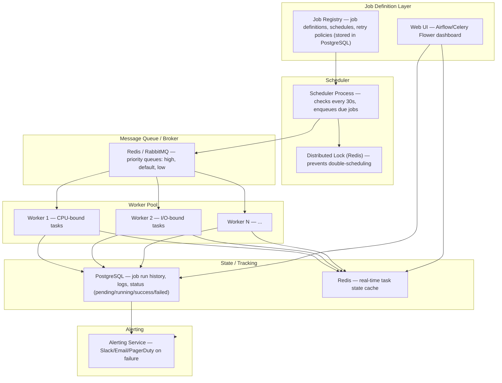
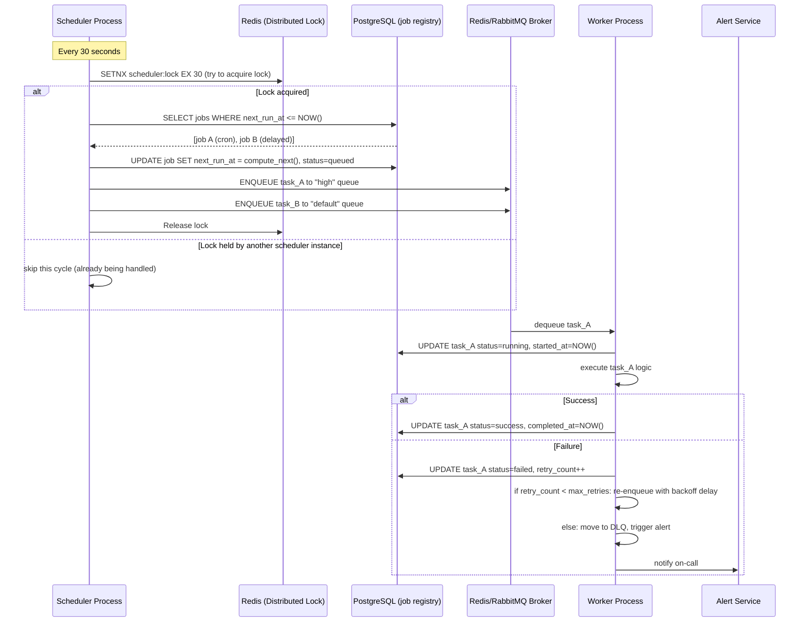
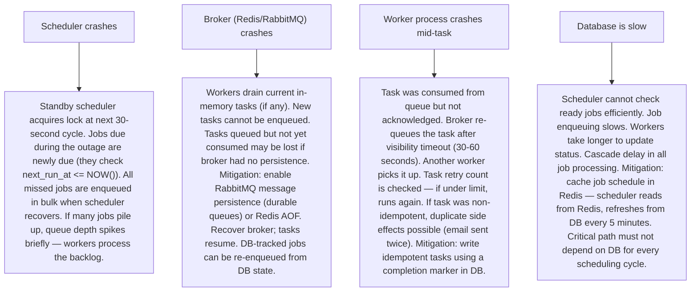

# Pattern 21 — Job / Task Scheduler (like Airflow, Celery)

---

## ELI5 — What Is This?

> Imagine you have a list of chores: take out the trash every Monday at 8am,
> water the plants every 3 days, and clean the house only after guests leave.
> A job scheduler is the household manager that remembers all your chores,
> runs them at the right time, retries if something fails,
> and tells you if anything went wrong.
> In software, the "chores" are data pipelines, emails, reports, and backups.

---

## Glossary (Every Keyword Explained in ELI5)

| Word | ELI5 Meaning |
|---|---|
| **DAG (Directed Acyclic Graph)** | A flowchart where tasks connect in one direction and never loop back. Task A must finish before Task B starts, which must finish before Task C. Like a recipe: you can't frost a cake before baking it. |
| **Cron Expression** | A compact code for timing: `0 8 * * MON` means "every Monday at 8am". Five fields: minute, hour, day-of-month, month, day-of-week. |
| **Worker** | A process that picks up tasks from a queue and executes them. Like a restaurant chef picking up order tickets. |
| **Broker** | The middleman between the scheduler (which decides what to run) and the workers (which run it). Usually Redis or RabbitMQ. Like the ticket rail at a diner. |
| **Idempotent Task** | A task that produces the same result whether it runs once or ten times. "Send email" is NOT idempotent (sends 10 emails). "Set user status to inactive" IS idempotent. |
| **Backfill** | Running a scheduled job for past time periods it missed. If your daily pipeline missed 3 days, backfill runs it for each of those 3 days. |
| **Task Retry** | Automatically running a failed task again. Usually with exponential backoff: wait 1 minute, then 2, then 4, then 8. |
| **Dead Letter Queue (DLQ)** | Where tasks go after exhausting all retries. A human must review these. |
| **Priority Queue** | A queue where higher-priority jobs jump ahead. "Fix production database" runs before "generate monthly report". |
| **Distributed Lock** | A lock shared across multiple servers. Prevents two workers from running the same scheduled job simultaneously. |

---

## Component Diagram

---

## Step-by-Step Request Flow

---

## Bottlenecks — Every Point Explained

| # | Bottleneck | Why It Hurts | Fix |
|---|---|---|---|
| 1 | **Scheduler is a single point of failure** | If the single scheduler process crashes, no new jobs are enqueued. All scheduled work stops. | Active-standby scheduler: two scheduler instances compete for a distributed lock every 30 seconds. Only the lock holder enqueues jobs. If the primary fails, the standby acquires the lock at the next cycle. |
| 2 | **Long-running tasks block short tasks** | A 6-hour data pipeline job consumes all worker processes. A 30-second report generation job waits 6 hours. | Priority queues + dedicated worker pools: long CPU-intensive jobs go to a "heavy" queue with dedicated workers. Short jobs go to a "fast" queue with more workers. Workers are configured to consume only their designated queue. |
| 3 | **Worker starvation — tasks pile up faster than workers process** | Task queue depth grows unboundedly. Workers fall behind. Tasks time out waiting. | Auto-scaling worker pool: Kubernetes HPA scales worker pods based on queue depth metric (Prometheus monitors RabbitMQ/Redis queue length). Scale up when queue depth > 100; scale down to minimum when idle. |
| 4 | **Double execution of scheduled jobs** | Two scheduler instances both enqueue the same job before the lock prevents it. Two workers run the same job simultaneously — duplicate processing, duplicate side effects. | Distributed lock + DB-level status check: before enqueuing, check DB: `WHERE id=? AND status='idle'`. Update status to `queued` in the same transaction. Only one scheduler can win this conditional update. |
| 5 | **Task dependency failures cascade** | DAG: Task C depends on A and B. If A fails, C should not run. Without dependency tracking, C might run with incomplete input data. | DAG execution engine (Airflow): explicitly declares `>> ` dependencies. The executor checks all upstream task statuses before scheduling a downstream task. Upstream failure propagates `UPSTREAM_FAILED` status to all downstream tasks. |
| 6 | **Slow jobs blocking their own next scheduled run** | A job scheduled every 1 minute takes 90 seconds. At minute 2, a new copy starts while the first is still running. Concurrent runs of the same job. | Max concurrency per job: set `max_active_runs = 1` in Airflow. The scheduler skips scheduling a new run if the previous run is still active. Alternatively, use a job-level mutex lock checked before execution. |

---

## What Happens When Each Part Fails?

---

## Key Numbers to Know

| Metric | Value |
|---|---|
| Scheduler polling interval | 1-30 seconds (Airflow default: 5 seconds) |
| Worker concurrency (per node, I/O-bound) | 16-32 tasks |
| Worker concurrency (per node, CPU-bound) | = CPU core count |
| Max retry attempts (typical) | 3-5 retries |
| Retry backoff (exponential) | 1min, 2min, 4min, 8min, 16min |
| Task execution timeout (typical web task) | 30 seconds |
| Task execution timeout (data pipeline) | 1-6 hours |
| Queue depth alert threshold | > 500 tasks |
| Job history retention | 30-90 days |

---

## How All Components Work Together (The Full Story)

Think of the scheduler as an office manager with a calendar. Every morning they check the calendar for today's tasks, distribute them to available team members, check that each task was completed, follow up on failures, and plan tomorrow's work.

**Scheduling cycle:**
1. Every 30 seconds, the **Scheduler** acquires a distributed lock in Redis, preventing any other scheduler instance from running simultaneously.
2. It queries PostgreSQL for all jobs where `next_run_at <= NOW()`. These jobs are due.
3. For each due job, it inserts a task record into PostgreSQL with status `queued`, computes the next execution time, and enqueues the task into the **Broker** (Redis/RabbitMQ) in the appropriate priority queue.
4. **Worker processes** continuously poll the broker. When a task is dequeued, the worker marks it `running` in PostgreSQL, executes the task function, and marks it `success` or `failed`.
5. On failure, the worker checks the retry count. Under the limit: re-enqueue with exponential delay. At/over the limit: move to DLQ and fire an alert to Slack/PagerDuty.
6. The **Web Dashboard** (Airflow UI / Celery Flower) reads task history and current state from PostgreSQL and Redis — giving operators a real-time view of what's running, what's stuck, and what's failed.

**For DAG-based workflows (Airflow):**
Airflow's executor doesn't just manage timing — it validates the entire dependency graph. When Task A completes, the executor checks if all dependencies of Tasks B and C are now satisfied, then schedules them. A complex pipeline with 50 interdependent tasks is orchestrated automatically.

> **ELI5 Summary:** Scheduler is the alarm clock and calendar. Broker is the task board where jobs wait to be picked up. Workers are the team members executing tasks. PostgreSQL is the timesheet. Airflow's DAG engine is the project manager who knows which tasks must complete before others start.

---

## Key Trade-offs

| Decision | Option A | Option B | Why We Pick B (or A) |
|---|---|---|---|
| **Cron-based vs event-triggered scheduling** | Time-based: "run every day at 2am" | Event-triggered: "run when the upstream data pipeline finishes" | **Both, for different needs**: cron for time-based work (reports, backups, billing). Event-triggered for data pipeline dependencies (don't run downstream job until upstream is done — regardless of time). Airflow supports both; Temporal specializes in event-driven. |
| **Celery vs Airflow vs Temporal** | Celery: simple task queue + worker, minimal DAG support | Airflow: DAG-first, complex dependency management, UI | **Celery** for microservice async tasks (send email, resize image). **Airflow** for data pipeline orchestration. **Temporal** for long-running stateful workflows with human approval steps. Wrong tool choice is very painful to fix later. |
| **Push vs pull task assignment** | Scheduler pushes tasks directly to specific workers | Workers pull from a shared queue | **Pull (queue-based)** — workers take tasks when they have capacity. Push requires the scheduler to know worker capacity in real-time (complex). Pull automatically balances across available workers. |
| **In-DB scheduling vs Redis-backed** | All scheduling state in PostgreSQL only | Hot scheduling data in Redis, cold history in PostgreSQL | **Hybrid**: Redis for the hot path (current status, lock, queue depth). PostgreSQL for historical records and job definitions. Avoids polling PostgreSQL for every scheduling cycle (expensive at high frequency). |
| **At-most-once vs at-least-once task execution** | Mark task consumed before executing (if worker dies, task is lost) | Mark task consumed after executing (if worker dies, task re-runs) | **At-least-once + idempotent design**: guarantees no task is permanently lost (at the cost of possible duplicate runs). Design every task to be idempotent, and duplicates are harmless. |

---

## Important Cross Questions

**Q1. You have a job that must run exactly once even if two scheduler instances are running. How do you guarantee this?**
> Three-layer protection: (1) Distributed lock on the scheduler — only one scheduler enqueues per cycle. (2) DB status check — enqueue only if current status is `idle`; update to `queued` atomically. (3) Worker-side idempotency key check before execution — if a task_run_id has already been recorded as `success`, skip execution and return immediately. Layer 1 prevents most duplicates; layer 3 is the safety net.

**Q2. A critical daily report job failed at 3am and nobody noticed until 9am. How do you design the alerting?**
> SLA-aware alerting: each job has a configurable `expected_completion_by` deadline. A monitoring process checks every 5 minutes: "has this job completed by its deadline?" If not: send alert. This is different from "alert on failure" — it also catches jobs that hang silently without returning (worker crashed mid-execution). Additionally: PagerDuty escalation policy for critical jobs (alert → 5 min → escalate to manager). Dead Man's Switch: a job sends a "heartbeat" every N minutes; if the heartbeat stops, an independent monitor sends an alert.

**Q3. How do you implement task priorities so that a billing job runs before a marketing email job?**
> Multiple broker queues with worker affinity: (1) Create queues: `critical`, `high`, `default`, `low`. (2) Configure worker pools: a "critical" worker only polls `critical` queue; a "general" worker polls `high`, `default`, `low` in order. (3) At scheduling time, the scheduler assigns each job to the appropriate queue based on job metadata (`priority: critical`). Critical billing jobs run on dedicated workers that are never clogged by low-priority bulk jobs.

**Q4. A data pipeline job processes yesterday's data. If it runs twice, it would insert duplicate records. How do you make it idempotent?**
> Use a logical run key: `INSERT INTO report_daily (date, metric, value) VALUES (YESTERDAY, 100, 500) ON CONFLICT (date, metric) DO NOTHING`. The `ON CONFLICT` clause makes the insert idempotent — re-running never creates duplicates because the unique constraint on `(date, metric)` rejects them. Alternatively: delete-and-reinsert (DELETE WHERE date = YESTERDAY, then INSERT). Both make the job safe to re-run. Never use plain `INSERT` in scheduled data jobs — always handle the duplicate case.

**Q5. How does Airflow handle a task that depends on an external condition — "only run when the S3 file exists"?**
> Airflow Sensors: a special task type that polls for a condition. `S3KeySensor(bucket='my-bucket', key='data/2024-01-15/file.parquet', timeout=3600, poke_interval=60)`. The sensor task runs every 60 seconds, checks the S3 path, and succeeds only when the file exists. If not found after 3600 seconds (timeout), it marks the task as failed. All downstream tasks in the DAG wait for the sensor to succeed before running. Sensors can check: S3 file presence, HTTP endpoint response, database row existence, or any custom Python condition.

**Q6. How do you scale to 10 million scheduled tasks per day across a global system?**
> Partitioning by timezone/region: run separate scheduler instances for each geographic region. Each handles ~1-2M tasks/day. Shared job registry in a globally replicated PostgreSQL (or CockroachDB for global consistency). Worker pools are auto-scaled per region. For extreme scale: replace cron-based scheduler with an event-driven approach (tasks enqueue their own successors — like a linked list of future work). Tools: Temporal (workflow engine designed for 10M+ executions/day). Twitter uses Mesos-based scheduling. LinkedIn uses Azkaban. At this scale, the scheduler itself becomes a distributed system problem.

---

## Real-World Apps That Use This Pattern

| Company | Product | How They Use It |
|---|---|---|
| **Airbnb / Lyft / Robinhood** | Apache Airflow | Airflow was created at Airbnb in 2014 and open-sourced. Used by 400+ companies. Airbnb uses it for data pipelines (price recommendation training, experience quality scoring). Lyft uses it for their analytics platform. Astronomer and Google Cloud Composer are managed Airflow SaaS. The "Tasks as DAGs" paradigm is the standard for modern data engineering. |
| **Stripe / Shopify** | Sidekiq / Bull (Redis-backed) | Celery/Sidekiq equivalent for Ruby/Node.js. Stripe uses workers for async payment processing, fraud model evaluation, invoice generation. Shopify processes 10M+ background jobs/day via Sidekiq — sending order confirmations, generating shipping labels, syncing inventory. Redis as broker enables Sidekiq to process 5,000-10,000 jobs/second per node. |
| **Uber** | Cadence / Temporal | Uber built Cadence (now forked as Temporal.io) for long-running workflows with human-in-the-loop approval. A driver onboarding workflow might: (1) verify documents, (2) wait for background check (days), (3) trigger training, (4) activate account. Temporal maintains durable state across all these steps — if any server crashes during a 3-day workflow, it resumes exactly where it left off. |
| **LinkedIn** | Azkaban | LinkedIn open-sourced Azkaban for Hadoop job scheduling. Manages dependencies between MapReduce/Spark jobs in a DAG. LinkedIn runs thousands of daily data pipeline jobs for feed ranking, ad analytics, and recommendation model training. Azkaban's web UI is the operations dashboard for their data engineering team. |
| **Pinterest** | PinFuture (custom) + Celery | Pinterest uses Celery for async tasks (image processing, notification sending) and a custom DAG executor for machine learning pipelines. Their ML training workflows are scheduled DAGs that pull images from S3 → process → train → evaluate → deploy. |
| **Cloudflare** | Cloudflare Workers Cron Triggers | Serverless cron: define a JavaScript Worker and a cron schedule. Cloudflare executes the Worker at the scheduled time across their edge network. No server management — the job scheduler is built into the serverless platform. Shows the evolution: scheduler + worker pool → abstracted into a platform primitive. Priced per execution. |
