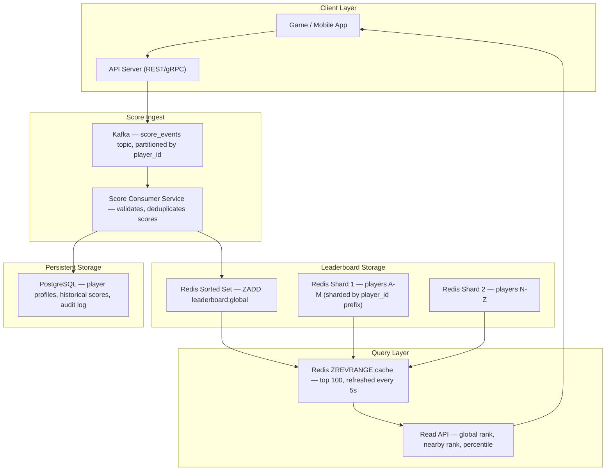
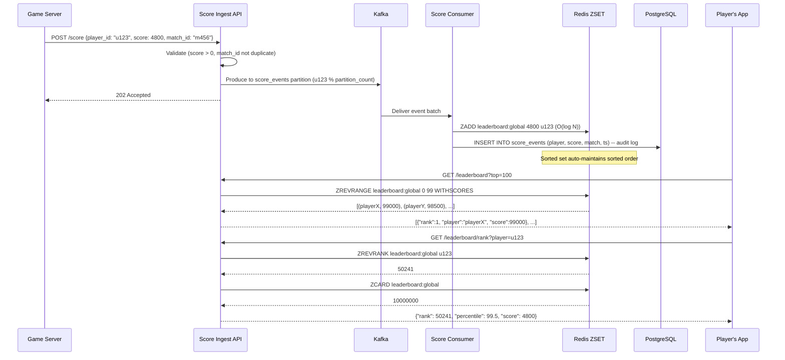
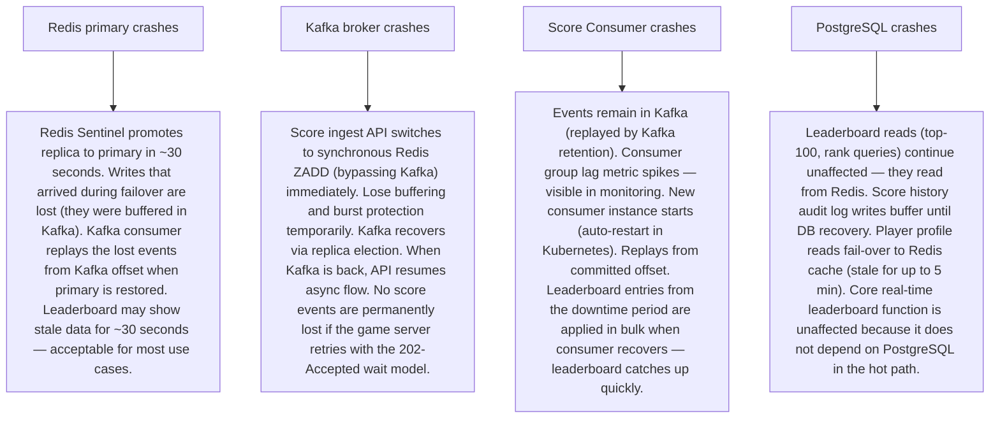

# Pattern 22 — Leaderboard System (like Gaming, Fantasy Sports)

---

## ELI5 — What Is This?

> Imagine a school spelling bee competition. After every round, the teacher
> updates the scoreboard on the wall. Everyone can see who is in 1st, 2nd, 3rd place.
> But imagine if 10 million kids were competing online — updating a scoreboard
> every second for 10 million people needs a very clever computer system.
> A leaderboard system is the technology that scores, ranks, and shows
> the top players in real time without crashing.

---

## Glossary (Every Keyword Explained in ELI5)

| Word | ELI5 Meaning |
|---|---|
| **Sorted Set (ZSET)** | A Redis data structure like a sorted scoreboard. Each entry has a name (player) and a score. Redis always keeps it sorted automatically. O(log N) to add or update. |
| **Rank** | A player's position in the sorted order. Rank 1 = highest score. Rank is computed from the sorted set — it's a position, not stored separately. |
| **Score** | The numeric value that determines order. Can be points, time (lower = better), wins, ELO rating. |
| **Range Query** | "Give me players ranked 1–100." Redis ZREVRANGE does this in O(log N + K) time. |
| **Dense Ranking** | If two players tie for 2nd place, the next rank is 3rd (not 4th). "1, 2, 2, 3" |
| **Standard Ranking** | If two players tie for 2nd place, the next rank is 4th. "1, 2, 2, 4" — most competitive games use this. |
| **Percentile Rank** | "You are in the top 5% of all players." Computed as: (rank / total players) × 100. |
| **Score Ingest** | The pipeline that receives score updates from game servers and writes them to the leaderboard. Must handle burst traffic (e.g., tournament ends). |
| **Shard** | Splitting the leaderboard across multiple Redis nodes when a single node can't hold all scores. Each shard holds a range of scores or a hash partition of players. |
| **Near Real-Time** | Updates appear within 1-5 seconds of the event happening, not necessarily instantaneous. Acceptable for most leaderboard use cases. |

---

## Component Diagram

---

## Step-by-Step Request Flow

---

## Bottlenecks — Every Point Explained

| # | Bottleneck | Why It Hurts | Fix |
|---|---|---|---|
| 1 | **Redis single node memory limit** | A single Redis node holds ~50-100GB RAM. At 100 bytes per player (player_id + score), you fit 500M–1B players. But with additional metadata, you may hit limits earlier. | Redis Cluster horizontal sharding: partition by player_id hash (`CRC16(player_id) % 16384`). Each shard holds 1/N of the player set. Cross-shard rank queries (global rank) require aggregating results from all shards and merging sorted. |
| 2 | **Score update burst (tournament end)** | 1 million players finish a match simultaneously. 1M ZADD operations hit Redis in seconds. Single Redis can handle ~100K writes/second. 1M writes = 10 second spike. | Kafka ingest as buffer: all score updates go to Kafka first. Consumer processes at 100K/second from Kafka — smoothing the burst without dropping updates. Redis pipeline commands for batching (send 1000 ZADDs in one network round trip). |
| 3 | **"Show players near me on leaderboard" requires expensive rank scan** | Getting players ranked 50,239–50,249 (10 players around rank 50,241) requires knowing rank 50,241 first, then doing ZRANGE 50231 50251. Two Redis calls, manageable. But computing "which players are within ±100 ranks of me" for millions of users doing this simultaneously is expensive. | Cache nearby-player windows in Redis per player: precompute and cache the "nearby" window for top-N active players. For the long tail, compute on demand. Denormalize player's current rank into PostgreSQL and update it every 60 seconds via batch job. |
| 4 | **Multiple leaderboards increase memory linearly** | "All time", "daily", "weekly", "this tournament", "friends only", "per region" — each is a separate sorted set. 6 leaderboards × 10M players × 100 bytes = 6GB just for sorted sets. | Separate Redis instances per leaderboard type. Expire daily/weekly leaderboards using Redis TTL (auto-delete after the period). Friends leaderboard is a small sorted set intersected from a global set — ZINTERSTORE between user's friend list and the global leaderboard. |
| 5 | **Cheating and fake scores** | Game clients send inflated scores directly to the ingest API. Without validation, a hacker submits score = 999,999,999 and tops the leaderboard. | Server-authoritative scoring: game logic runs entirely on the server (not the client). Client only sends game events (moved to coordinate X, shot at target Y). Server computes the score from those events. Client-sent raw scores are rejected. For mobile games: cryptographic score signing — game client signs the score with a session key, server verifies before accepting. |
| 6 | **Historical leaderboard queries are expensive** | "Show me leaderboard for last Tuesday" requires reading historical data, not current state. Redis sorted sets only hold current state. | Archive leaderboard snapshots: every day at midnight, export full sorted set to PostgreSQL with timestamp. Historical queries read from PostgreSQL (acceptable since they're not real-time). Current leaderboard is always served from Redis. |

---

## What Happens When Each Part Fails?

---

## Key Numbers to Know

| Metric | Value |
|---|---|
| Redis ZADD throughput (single instance) | ~100,000 ops/second |
| Redis ZRANGE top-100 latency | < 1 ms |
| Redis ZREVRANK latency (find rank of one player) | O(log N) ≈ 0.1 ms |
| Redis ZCARD (total players) | O(1) |
| Redis memory per player entry (ZSET) | ~64-100 bytes |
| Max players in single Redis node (50GB RAM) | ~500M |
| Kafka ingest buffer capacity | Typically 7 days of events |
| Leaderboard snapshot to PostgreSQL interval | Every 1-24 hours |
| Friends leaderboard ZINTERSTORE time | O(N×K log K), N=friend count |

---

## How All Components Work Together (The Full Story)

A leaderboard must do two things perfectly: fast writes (scoring is happening constantly) and fast reads (everyone wants to see their rank). Redis Sorted Sets are the single most important component — they were designed exactly for this purpose.

**Score update flow:**
1. A player finishes a match. The **game server** POSTs the score to the ingest API.
2. The API validates (score is positive, match_id hasn't been seen before via a Bloom Filter or dedup set in Redis).
3. The score event is produced to **Kafka** (score_events topic), providing buffering for burst traffic.
4. The **Score Consumer** reads from Kafka, runs business validation (compare against expected range), and executes `ZADD leaderboard:global <score> <player_id>` in Redis.
5. Redis internally updates the sorted skip-list structure in O(log N) — the player is now at their new rank.
6. The event is also written to **PostgreSQL** for audit/history purposes.

**Read flow:**
1. A player opens the leaderboard tab. The app fetches the Top 100: `ZREVRANGE leaderboard:global 0 99 WITHSCORES` — returns 100 entries in < 1 ms.
2. To get their own rank: `ZREVRANK leaderboard:global u123` — returns the 0-indexed position. Divide by total count for percentile.
3. For "show players near me": `ZREVRANK` to get rank R, then `ZREVRANGE leaderboard:global (R-5) (R+5) WITHSCORES` to get 11 nearby players.
4. For friends leaderboard: `ZINTERSTORE friends:u123 2 leaderboard:global friends:u123:members WEIGHT 1 0` — intersect global leaderboard with friend set, preserving scores.

> **ELI5 Summary:** Redis Sorted Set is like a magic scoreboard that always stays sorted no matter how many people update it, and you can read ranks from any position instantly. Kafka is the waiting room so everyone's score eventually gets added even during traffic spikes. PostgreSQL is the archive room for looking up old tournament results.

---

## Key Trade-offs

| Decision | Option A | Option B | Why |
|---|---|---|---|
| **Real-time vs near-real-time updates** | Every score update immediately reflected (ZADD synchronously on ingest) | Updates reflected within 1-5 seconds (async via Kafka) | **Near-real-time via Kafka** for scale. At 100K updates/second, synchronous ZADD without buffering can saturate Redis under burst. The 1-5 second delay is imperceptible to users. |
| **One global leaderboard vs sharded per category** | Single ZSET for all players globally | Separate ZSETs for: global, regional, weekly, tournament | **Separate ZSETs**: easier to manage, expire, and query independently. Cross-leaderboard ranking uses ZUNIONSTORE. Memory cost is linear but Redis is cheap. |
| **Dense vs standard ranking** | "1, 2, 2, 3" — ties share rank, next rank is sequential | "1, 2, 2, 4" — ties share rank, next rank skips | **Standard ranking** for competitive gaming (matches industry convention). **Dense ranking** for display purposes only. Redis ZRANK doesn't natively handle ties — implement tie-breaking with secondary sort key (timestamp as tiebreaker: encode score as `score * 1e10 + (MAX_TIME - timestamp)` so earlier achievers rank higher). |
| **Precomputed top-100 cache vs live query** | Cache top-100 result, refresh every 5 seconds | Always query Redis ZREVRANGE live | **5-second cache** for the top-100 display (it's read millions of times per second). Individual rank queries (`ZREVRANK`) always go to Redis directly (must be accurate). The top-100 display showing information that is 5 seconds stale is acceptable. |

---

## Important Cross Questions

**Q1. How does Redis ZADD work and why is it O(log N)?**
> Redis Sorted Sets internally use two data structures: a **skip list** for sorted order and a **hash table** for O(1) score lookup by member. When you ZADD a new score: (1) hash table checks if member exists (O(1)); (2) skip list removes the old position and inserts at the new position (O(log N)). The skip list is a probabilistic structure with multiple levels of forward pointers — each level skips roughly half the nodes. This enables finding/inserting in O(log N) without the complexity of balanced trees. ZREVRANGE (range by rank) is O(log N + K) where K is the number of returned elements.

**Q2. How would you design a "Friends Leaderboard" efficiently?**
> `ZINTERSTORE dest:leaderboard:u123 2 leaderboard:global social:friends:u123 WEIGHTS 1 0` — the WEIGHTS 1 0 take the score entirely from `leaderboard:global`, and the set intersection ensures only friends appear. This creates a new sorted set of only the player's friends, sorted by their global score. The intersection runs in O(N log N) where N = friend count. Store the result with a short TTL (30 seconds), keyed by `leaderboard:friends:u123:v<timestamp_bucket>`. This recomputes at most every 30 seconds per user instead of on every request.

**Q3. How do you handle score rollbacks — a player got bonus points by mistake?**
> ZADD supports updating scores: `ZADD leaderboard:global <correct_score> <player_id>` replaces the existing score atomically. For audit trails: log the correction in PostgreSQL with correction_reason, admin_id, old_score, new_score, timestamp. For anti-cheat reversals (large-scale): instead of correcting individual scores, snapshot the leaderboard before the incident, reprocess all legitimate events from Kafka to rebuild the leaderboard from scratch. Kafka's log retention (7 days) enables this time-travel replay.

**Q4. What are the challenges of a truly global leaderboard (players in USA, Europe, Asia)?**
> Players want low-latency reads of "their rank" from nearby data centers. But a globally consistent sorted ranking requires a coordinated single source of truth. Two approaches: (1) **Leader-based global Redis**: single canonical Redis in us-east-1; regional read replicas serve stale reads for top-100 display (1-2 second lag); rank queries (write-sensitive) go to the primary. (2) **Regional leaderboards + global merge**: each region has its own leaderboard, updated in real time. Global leaderboard is computed by a daily aggregation job. Most games use approach 2 — "top players in Asia" is region-specific, not global.

**Q5. A game has a tournament with 100,000 concurrent players all finishing within 10 seconds. How do you handle the score burst?**
> Kafka absorbs the burst: all 100,000 score events land in Kafka in ~10 seconds. Kafka's throughput is millions of events per second, so ingest is fine. The Score Consumer batch-processes at 100K events/second using Redis pipeline commands (1000 ZADDs per pipeline = 1 network RTT per 1000 updates). At this rate, the consumer processes the full 100K event backlog in ~1 second. Redis pipeline batching is critical — reducing 100K network round trips to 100 round trips. Final leaderboard is fully consistent within 2-3 seconds of tournament end.

**Q6. How would you implement a leaderboard that shows rank percentile rather than absolute rank?**
> Percentile = (players_below_you / total_players) × 100. With Redis: `ZRANK leaderboard:global u123` gives players below (0-indexed count from bottom). But ZRANK returns rank from bottom, and ZREVRANK from top. To get percentile: `rank_from_bottom = ZRANK(leaderboard, player)`, `total = ZCARD(leaderboard)`, `percentile = (rank_from_bottom / total) * 100`. Round to 1 decimal. Cache total player count (ZCARD is O(1) but called on every rank request — can be cached for 1 second). "Top 1%" badge: store thresholds at signup and recompute when player's rank changes significantly.

---

## Real-World Apps That Use This Pattern

| Company | Product | How They Use It |
|---|---|---|
| **Riot Games / Valve** | League of Legends / CS:GO Ranked | Redis sorted sets for per-region ranked ladder (e.g., EUW ladder, NA ladder), showing each player's rank, LP (League Points), and tier. Millions of rank updates daily as games complete. Regional Redis clusters with replication. Tier boundaries (Gold/Platinum/Diamond) computed from rank percentiles at season end. |
| **DraftKings / FanDuel** | Fantasy Sports Leaderboards | Real-time scoring during live NFL/NBA games. Each user's lineup accrues points as athletes score. Redis sorted sets update every 30 seconds from sports data feeds. Multiple leaderboards: your specific contest (1K players), global scoring leaders, friends group. Millions of simultaneous contests during Sunday NFL games (peak burst problem). |
| **Duolingo** | XP Leaderboards | Weekly language-learning league leaderboards. Redis stores per-league leaderboard (each user is in a league of 30 people). At end of week, top 5 promote to a higher league, bottom 5 demote. ZREVRANGE + promote/demote logic run in a weekly batch job. Billions of weekly XP earned across 500M users. Shows that "small" per-league sorted sets (30 players each) scale better than one giant global sorted set. |
| **StackOverflow** | Reputation / Badges | Reputation is a form of leaderboard. Not fully Redis-based (PostgreSQL computed). But reputation ordering uses materialized views. A lesson: for less-frequent updates (rep changes happen every few minutes per user), PostgreSQL sorted queries with proper indexes work fine without Redis. Redis is needed only when updates are sub-second and concurrent. |
| **Roblox** | Game Experience Leaderboards | Roblox powers millions of user-created games, each with its own leaderboard. They scale by giving each game a separate Redis sorted set namespace. "High Score" boards for individual experiences. Central Redis cluster with keyspace isolation per experience. Competitive experiences (with millions of players like Adopt Me!) use dedicated Redis instances. |
| **Strava** | KOM (King of the Mountain) / Segment Leaderboards** | Cycling/running segment performance leaderboards. Redis stores top-10 for each segment (millions of segments globally). PostgreSQL stores all runs for historical queries. Segment leaderboard is a sorted set of size ~10-50 (only keep top performers per segment). When a new run beats the 10th place, it inserts and trims the sorted set: `ZADD + ZREMRANGEBYRANK leaderboard:segment:s123 0 -11`. |
