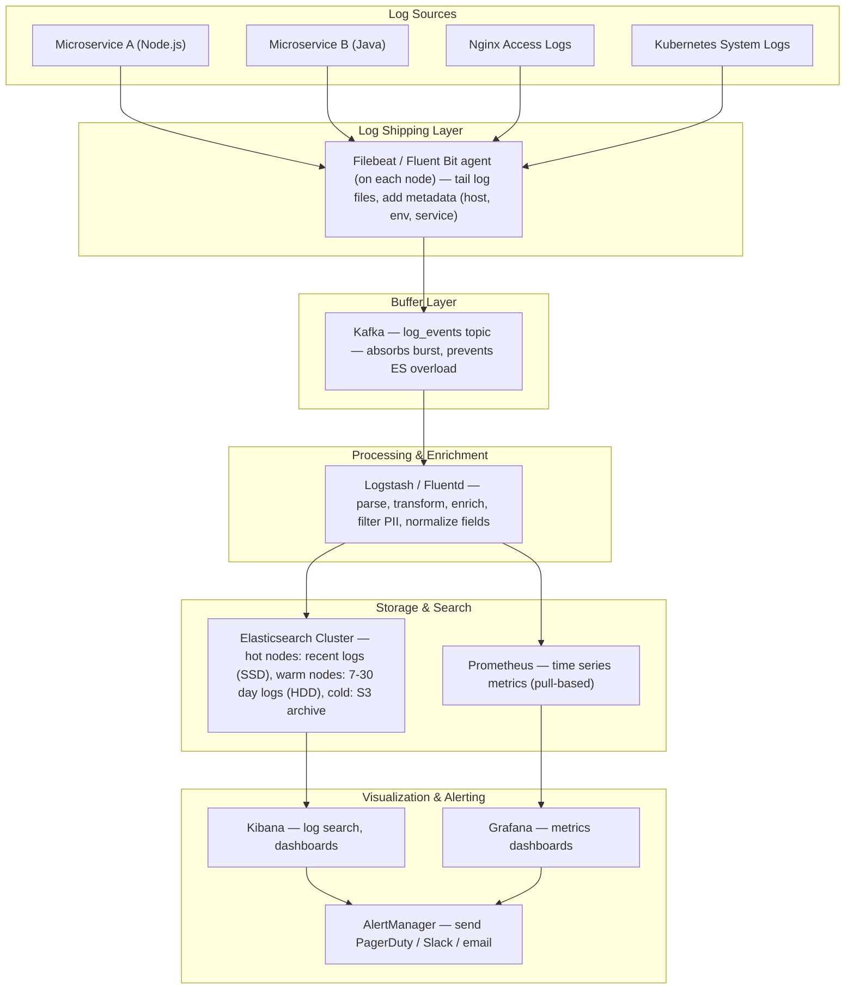
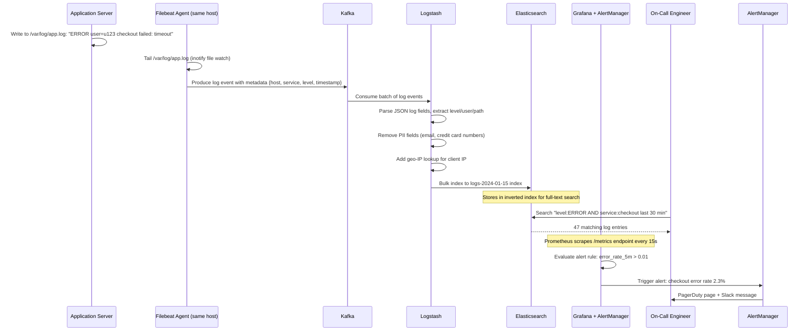
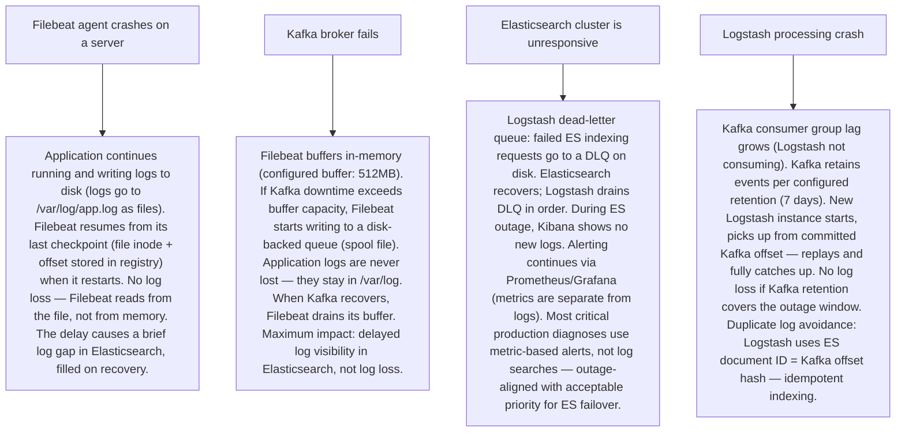

# Pattern 23 — Log Aggregation & Monitoring (like ELK Stack, Datadog)

---

## ELI5 — What Is This?

> Imagine your whole city has security cameras — thousands of them in shops,
> intersections, and buildings. Each camera records footage locally.
> Now imagine you need to find a specific red car from 3pm yesterday.
> You'd have to visit every camera individually — impossible!
> Log aggregation is like having all camera footage automatically sent to
> a central control room where you can search "red car, 3pm" and find it instantly.
> In software, the "cameras" are your servers, and the "footage" is log messages.

---

## Glossary (Every Keyword Explained in ELI5)

| Word | ELI5 Meaning |
|---|---|
| **Log** | A text message a program writes when something happens. "User 123 logged in at 14:32:01". Logs are the diary of your software. |
| **Log Aggregation** | Collecting logs from hundreds of servers and putting them in one searchable place. |
| **Log Shipper** | A lightweight agent running on each server that reads log files and forwards them to a central system. Like a postal carrier picking up letters from every house. Filebeat, Fluent Bit, Fluentd, Logstash. |
| **Elasticsearch (ES)** | A search engine that stores logs as JSON documents and allows full-text search across billions of log lines. |
| **Index** | In Elasticsearch, an "index" is like a database table. Logs are typically stored in time-based indices: `logs-2024-01-15`. |
| **Kibana** | The web dashboard for Elasticsearch. Lets you search, visualize, and create alerts on your log data. |
| **Metric** | A numeric measurement captured over time. CPU usage = 73%, request rate = 1200 req/s, error rate = 0.3%. Unlike logs (text), metrics are numbers. |
| **Time Series** | Data points collected at regular intervals over time. Metrics are time series data. Prometheus stores time series. |
| **Alert** | An automated notification when a metric or log pattern crosses a threshold. "Error rate > 1% for 5 min → page on-call engineer". |
| **Distributed Tracing** | Tracking a single request as it travels through 20 microservices. Like tracking a package through every warehouse until delivery. Jaeger, Zipkin, OpenTelemetry. |
| **Sampling** | Not recording 100% of logs/traces — instead recording 1% or 10% to save storage while keeping representativeness. |

---

## Component Diagram

---

## Step-by-Step Request Flow

---

## Bottlenecks — Every Point Explained

| # | Bottleneck | Why It Hurts | Fix |
|---|---|---|---|
| 1 | **Elasticsearch write throughput saturation** | ES indexes are optimized for search, not write speed. At 500K log events/second, ES struggles to keep up. The inverted index update is expensive. Log loss begins as the write queue fills. | Kafka as write buffer: logs flow to Kafka first (millions of events/second throughput). Logstash consumers read at a pace ES can handle. Kafka decouples log production from ES ingestion. Additionally: ES bulk indexing (batch 5K-10K docs per request), async indexing settings (`index.translog.durability = async`). |
| 2 | **Elasticsearch hot shard problem** | If all logs go to a single index with a single primary shard, that shard handles 100% of writes. Shard is on one ES node = single-node bottleneck. | Index sharding: create an index with N primary shards (typically 1 shard per 20-40GB of data). Logs-2024-01-15 might have 20 shards across 10 ES nodes. Logstash distributes bulk indexing across all shards. ILM (Index Lifecycle Management) automatically rolls over indices when they exceed 40GB. |
| 3 | **Storage cost explosion** | 100 services × 1KB avg log size × 10K req/s = 1GB/s raw log data. 1 month = 2.6 PB. Storing everything is cost-prohibitive. | Hot-warm-cold tiering: hot (SSD, 7 days), warm (HDD, 30 days), cold (S3, 1 year). ILM policies automate transitions. Sampling: sample 10% of INFO logs, 100% of ERROR/WARN. Log compression: ES uses LZ4 compression (~3-5x reduction). Structured logging over free-text (key-value JSON logs index and compress better). |
| 4 | **Log shipper — agent overhead on application host** | Filebeat/Fluent Bit agents consume CPU and memory on the application server. A memory leak or high-CPU spike in the agent degrades the application itself. | Lightweight agents: Fluent Bit uses 450 KB RAM vs Logstash's 256 MB RAM. Configure Fluent Bit memory buffers (not file I/O) for low-latency tailing. Resource limits via systemd cgroup or Kubernetes resource requests/limits. Never run Logstash as an on-node agent — it's too heavy. |
| 5 | **Full-text search over billions of logs is slow** | A query like `"timeout" occurred between 14:00 and 14:30` over 30 days of logs scans billions of documents. ES must scan all 30-day indices. | Search optimization: always include a time range filter (ES uses time as the primary shard selector). Use index-per-day pattern so queries touch only relevant indices. For known fields (service, level, host), use keyword fields (not full-text) — equality checks are O(1) vs full-text. |
| 6 | **Metrics cardinality explosion in Prometheus** | A metric with label combinations: `http_requests{service=X, endpoint=Y, user_id=Z}`. If user_id has 1M unique values, this creates 1M time series. Prometheus stores one time series per label combination. Cardinality explosion = OOM crash. | Never use high-cardinality labels (user_id, IP address, trace_id) in Prometheus metrics. Use only low-cardinality labels (service, endpoint, status_code, region). For high-cardinality analysis: use logs in Elasticsearch — they're row-oriented, made for per-user queries. Labels in Prometheus should have < 100 unique values. |

---

## What Happens When Each Part Fails?

---

## Key Numbers to Know

| Metric | Value |
|---|---|
| Filebeat RAM usage | ~20 MB |
| Fluent Bit RAM usage | ~450 KB |
| Logstash RAM usage | ~256 MB |
| Elasticsearch indexing throughput (per node) | ~10K-50K docs/second |
| Minimum ES cluster size (production) | 3 master + 3 data nodes |
| ES index shard size recommendation | 20-50 GB per shard |
| Prometheus scrape interval | 15 seconds |
| Prometheus retention (typical default) | 15 days |
| Log compression ratio (LZ4) | 3-5x |
| Kafka log retention (default) | 7 days |

---

## How All Components Work Together (The Full Story)

Log aggregation solves the "10 servers, each producing 1,000 log lines per second" problem. Without aggregation, debugging means SSH-ing into each server and grepping log files individually — impossible at scale.

**The collection pipeline:**
1. Each server runs a lightweight **Filebeat / Fluent Bit** agent that uses inotify to watch log files. When a new line is written, it reads it immediately, adds metadata (hostname, service name, environment: prod), and ships it to Kafka.
2. **Kafka** absorbs log bursts (a deploy causing 10x log volume spike) and provides replay capability. It also decouples collection speed from indexing speed.
3. **Logstash** consumes from Kafka, parses raw text into structured JSON fields (using grok patterns or JSON parsing), removes PII, adds geo-IP lookup for client IPs, normalizes field names, and bulk-indexes to **Elasticsearch**.
4. **Elasticsearch** stores the structured log documents in an inverted index — this is why you can search `level:ERROR AND path:/checkout` across billions of logs in under a second.
5. **Kibana** is the operator interface: search logs, create dashboards (error rate by service over time), set up saved searches.

**The metrics pipeline (parallel, not dependent on logs):**
1. Applications expose a `/metrics` HTTP endpoint in Prometheus format.
2. **Prometheus** scrapes each `/metrics` endpoint every 15 seconds, storing time series in its local TSDB.
3. **Grafana** queries Prometheus and visualizes metrics dashboards. Alert rules evaluate metric expressions: `rate(http_errors_total[5m]) / rate(http_requests_total[5m]) > 0.01`.
4. **AlertManager** deduplicates and routes alerts to PagerDuty (P1 incidents), Slack (P2), or email (P3).

**The three pillars together (Logs + Metrics + Traces):** Metrics say "something is wrong" (error rate spiked). Logs say "what happened" (specific error messages). Traces say "where exactly" (which microservice in the call chain is causing the errors). Datadog / New Relic / Honeycomb integrate all three in one platform (OpenTelemetry is the open standard for traces).

> **ELI5 Summary:** Filebeat is the postal carrier picking up letters from every server. Kafka is the postal hub sorting mail. Logstash is the mail sorter reading and classifying each letter. Elasticsearch is the archive room where you can find any letter in seconds. Kibana is the reading desk. Prometheus + Grafana is the security camera watching numbers (not letters), and AlertManager is the alarm that rings when the numbers look wrong.

---

## Key Trade-offs

| Decision | Option A | Option B | Why |
|---|---|---|---|
| **Push vs pull log shipping** | Agents push logs to central system (Filebeat model) | Central system pulls logs from each server (Prometheus model for metrics) | **Push for logs** (unstructured, time-critical, need immediate forwarding). **Pull for metrics** (structured numbers, Prometheus knows what to scrape on a schedule). Logs are driven by the source; metrics are driven by the collector. |
| **ELK Stack vs managed (Datadog / New Relic)** | Self-hosted ELK: full control, no per-GB cost beyond infrastructure | Managed Datadog: no ops burden, per-host or per-GB pricing | **ELK self-hosted** for large-scale (>5TB/day) — per-GB managed SaaS becomes prohibitively expensive. **Datadog** for small-medium teams — the ops complexity of ELK cluster management (node sizing, ILM, shard management) is not worth it for small teams. |
| **Structured (JSON) vs unstructured logs** | Free-text: `"ERROR: User login failed for bob@example.com at checkout"` | Structured: `{"level":"ERROR","event":"login_failed","user":"u123","component":"checkout"}` | **Structured JSON always** in production systems. Elasticsearch indexes JSON fields natively — queries are fast and exact. Unstructured text search requires slow full-text scan. Grok patterns to parse unstructured text are fragile and expensive. |
| **Full log sampling vs complete logs** | Store 100% of all log levels | Sample INFO (10%), WARN (50%), ERROR (100%) | **Tiered sampling**: errors must always be 100% (you need every error for debugging). INFO-level diagnostic logs can be 10% sampled — enough for statistical understanding. Reduces storage 3-5x with minimal loss in debuggability. Critical: log the sampling rate as metadata so you can upscale counts in analysis. |

---

## Important Cross Questions

**Q1. A production incident happened at 2am. How do you use this system to diagnose it?**
> Workflow: (1) Check Grafana — find the metric that spiked (request latency? error rate? which service?). (2) Open Kibana — filter logs: `service:payment-service AND level:ERROR AND @timestamp:[2024-01-15T02:00 TO 2024-01-15T02:30]`. Read error messages. (3) Pick a trace ID from the error log, look it up in Jaeger/Zipkin — see the full call chain across all microservices for that specific failing request. (4) Correlate: the metric spike + error log message + trace show: payment service was calling a third-party fraud API, which started returning 503 at 2:00am. Root cause in under 10 minutes.

**Q2. How do you handle PII (personally identifiable information) in logs?**
> Multi-layer approach: (1) Application-level: never log raw email, credit card, SSN, password. Use IDs: `user_id=u123` not `user_email=bob@acme.com`. (2) Logstash processing: apply a `mutate` filter to remove or mask any fields matching PII patterns (regex for credit card numbers, emails). Replace with `[REDACTED]`. (3) Elasticsearch field encryption: encrypt specific fields at rest using a plugin. (4) Access control: restrict who can query Elasticsearch (Kibana role-based access). (5) Log retention policy: GDPR right-to-erasure — delete user-specific log records when requested via data deletion pipeline. Compliance auditors check all five layers.

**Q3. Elasticsearch cluster is running out of disk space. What do you do?**
> Immediate actions (in order): (1) Check ILM policy — is warm-to-cold transition running? Force rollover if indices are stale. (2) Delete old indices: `DELETE /logs-2024-01-*` for indices older than retention policy. (3) Reduce refresh interval: `index.refresh_interval = 30s` instead of 1s — reduces write amplification temporarily. (4) Force merge old indices to reduce segment count and reclaim disk. Long-term: add data nodes to the cluster, or move cold data to cheaper S3-backed storage (Frozen tier). Introduce or tighten sampling to reduce ingest volume immediately.

**Q4. How do you design a monitoring system for 10,000 microservices?**
> Hierarchy: (1) Per-service RED metrics (Rate, Errors, Duration) — each service exposes standard Prometheus metrics. (2) Aggregated dashboards in Grafana: company-wide SLA dashboard, per-team dashboards. (3) Alerts at the service level — each service team owns their alert rules. (4) Centralized alert routing: AlertManager with routing trees (team ownership determines who gets paged). (5) Sampling becomes critical: at 10K services × 1K req/s = 10M req/s, 100% trace sampling is impossible. Use head-based sampling (1%) with tail-based sampling (100% of errors and slow requests). OpenTelemetry collector with sampling processor.

**Q5. What is cardinality explosion in Prometheus and how do you prevent it?**
> Prometheus stores one time series per unique combination of label values. `http_requests_total{service="A", endpoint="/users", status="200"}` = 1 time series. With 100 services × 50 endpoints × 5 statuses = 25,000 time series — manageable. But if you add `user_id` label with 1M users: 100 × 50 × 5 × 1,000,000 = 25 billion time series — OOM crash. Prevention: (1) Only label with low-cardinality dimensions (< 100 unique values). Never use user_id, IP, session_id, request_id, trace_id as Prometheus labels. These belong in logs (Elasticsearch). (2) Use `recording rules` to pre-aggregate high cardinality metrics before storage. (3) Monitor cardinality with `prometheus_tsdb_symbol_table_size_bytes` metric — alert when it grows unexpectedly.

**Q6. How does distributed tracing work with OpenTelemetry?**
> A trace is a tree of "spans" — each span represents work done by one service. When Service A receives a request, it creates a root span with a trace_id (e.g., `abc123`) and span_id (`span1`). When it calls Service B, it injects `{traceparent: "00-abc123-span1-01"}` into the HTTP headers. Service B reads this header, creates a child span with parent_id=`span1`, does its work, and records the span. All spans are batched and sent to an **OpenTelemetry Collector**, which forwards to Jaeger/Zipkin/Datadog. To find the root cause of a slow request: look up trace_id `abc123` in Jaeger — see the full tree of spans with timing. One span took 900ms out of a total 1000ms request — that's the slow service. Sampling: only record 1% of traces (random), but always record 100% of traces with errors or latency > p99 (tail-based sampling).

---

## Real-World Apps That Use This Pattern

| Company | Product | How They Use It |
|---|---|---|
| **Elastic (Elasticsearch)** | ELK Stack | Created the canonical open-source log aggregation stack. Elasticsearch is used by 60%+ of Fortune 500 for log and observability use cases. Core architecture: Logstash (heavy) or Fluent Bit (lightweight) → Kafka → Logstash → Elasticsearch → Kibana. Netflix, Uber, LinkedIn all run massive ELK clusters. Elastic Cloud is the managed SaaS offering. |
| **Datadog** | Unified Observability Platform | SaaS alternative to ELK. Agent installed on each host collects logs, metrics, and traces in one lightweight agent. Sends to Datadog cloud. Log Management (ES equivalent), Metrics (Prometheus equivalent), APM (Jaeger equivalent). Pricing: per-host per-month or per-GB for logs. Used by companies wanting observability without managing infrastructure. |
| **Netflix** | Atlas + Mantis | Netflix built Atlas (in-memory metrics aggregation, near-Prometheus) for 1B+ time series. Mantis is their stream processing platform for log analysis at scale. At Netflix's scale (billions of events/day), open-source tools need customization. Their approach is push-based: all services push metrics to Atlas aggregation clusters. No central scraping — too slow at their scale. |
| **Uber** | M3 + Jaeger** | Uber built M3 (open-sourced) as a highly available Prometheus alternative for their scale (~100M time series). Also built and open-sourced Jaeger for distributed tracing. Both are now CNCF projects. Their observability stack handles 500K+ metrics per second across their global microservice fleet. |
| **Cloudflare** | Workers Analytics Engine | Processes 50M+ log events per second from their edge network. Custom-built log pipeline using Kafka and ClickHouse (OLAP database, faster than Elasticsearch for analytics). Cloudflare processes DNS queries, HTTP requests, DDoS events — all in real time at global scale. Shows that ELK sometimes hits limits; specialized databases are chosen at extreme scale. |
| **GitHub** | Splunk + Custom Logging** | GitHub uses Splunk for security log analysis (audit logs, access logs), ELK for application logs, and a custom metrics pipeline for their development workflow analytics. Their key challenge: security audit logging must be tamper-evident (immutable append-only log) — they use write-once S3 storage for security event archives. |
