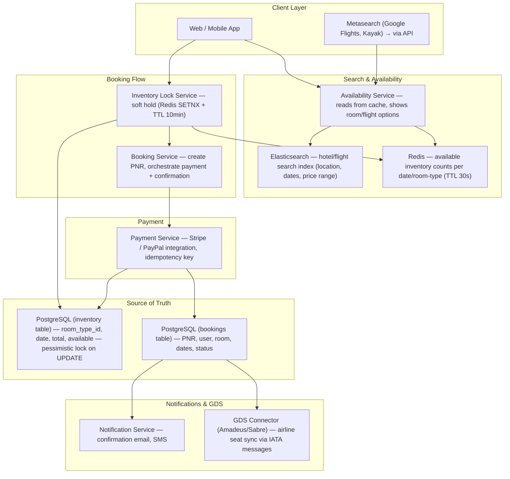
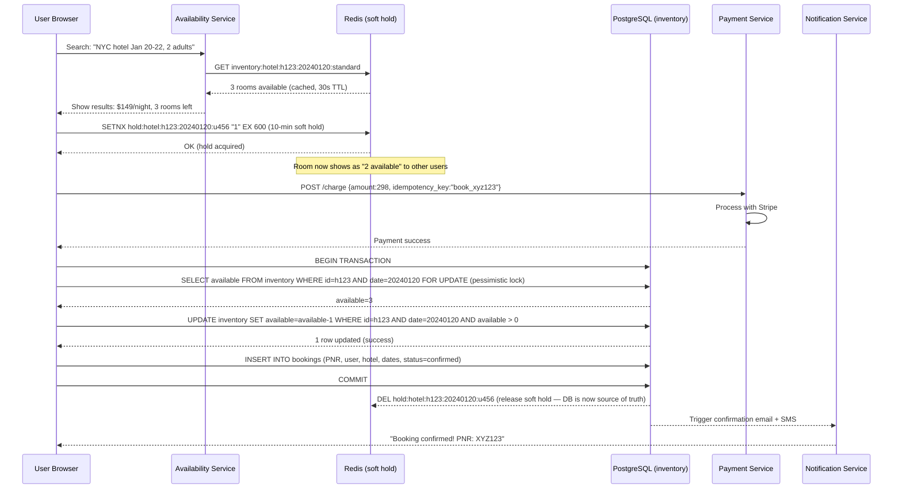
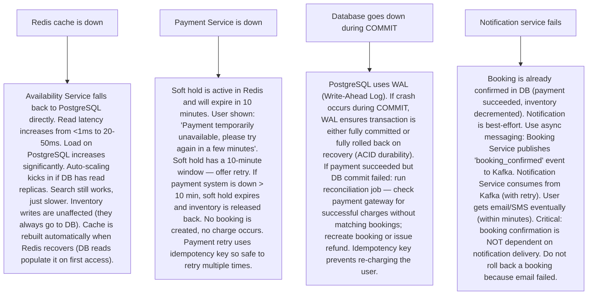

# Pattern 24 — Hotel / Airline Booking System (like Booking.com, Amadeus)

---

## ELI5 — What Is This?

> Imagine 10,000 people all trying to grab the last seat on a flight at the same time.
> Without a careful system, two people could both "grab" the seat —
> but only one of them actually gets it. The other gets a nasty surprise at the airport.
> A booking system must make sure only ONE person successfully claims a seat or room,
> even when millions of people are clicking "Book Now" simultaneously.
> It also needs to hold inventory temporarily (a 10-minute timer while you fill in payment details)
> and release it if you don't complete the booking.

---

## Glossary (Every Keyword Explained in ELI5)

| Word | ELI5 Meaning |
|---|---|
| **Inventory** | The countable supply: hotel has 100 rooms, flight has 180 seats. Inventory must never go negative (overselling) — except when airlines intentionally oversell. |
| **Seat/Room Lock (Soft Hold)** | When you start the booking process, the system temporarily reserves the item for you (usually 10 minutes). Others see it as unavailable. If you don't complete payment, the lock expires and it becomes available again. |
| **Confirmed Booking** | When payment succeeds, the soft hold converts to a permanent confirmed booking. Permanent = the item is sold, never released back automatically. |
| **Double Booking** | Error: two users successfully book the same room/seat. Catastrophic user experience. Prevented by database-level locking or conditional writes. |
| **Optimistic Locking** | "I'll assume nobody else changed this record while I was reading it. When I write, I'll check if the version number changed. If it did, someone else got there first — I'll retry." Low contention scenarios. |
| **Pessimistic Locking** | "I'll lock this row before reading it. Nobody else can touch it until I'm done." Prevents conflict but reduces concurrency. Used for high-contention scenarios (last seat). |
| **Idempotency Key** | A unique ID the client sends with payment requests. If the network times out and the client retries, the payment system recognizes the duplicate key and returns the original result instead of charging twice. |
| **GDS (Global Distribution System)** | The network connecting airlines, hotels, and travel agents. Amadeus, Sabre, Travelport are the three major GDS systems. They maintain live inventory for 400+ airlines. |
| **Price Surge / Dynamic Pricing** | Prices change based on demand. When only 2 seats remain at a price tier, the system moves to the next higher price tier. |
| **PNR (Passenger Name Record)** | The unique booking reference for a flight — the 6-digit code on your boarding pass. Contains passenger info, journey, seat, and booking status. |

---

## Component Diagram

---

## Step-by-Step Request Flow

---

## Bottlenecks — Every Point Explained

| # | Bottleneck | Why It Hurts | Fix |
|---|---|---|---|
| 1 | **Read scalability for availability search** | 1 million users searching NYC hotels for New Year's Eve simultaneously. Each search hits the inventory database to check room counts. 1M DB reads/sec saturates PostgreSQL. | Redis availability cache: store `inventory:hotel:h123:date:roomtype → count` in Redis with 30-second TTL. 99% of search traffic reads from Redis, not DB. Cache is slightly stale (okay for search — exact count checked at booking time). Redis handles 1M reads/sec on a single instance. |
| 2 | **Last-seat high contention — double booking risk** | 1000 users see "1 room left" and click "Book Now" simultaneously. All 1000 read `available=1` from the DB. Without locking, all 1000 could proceed to the `available-1` update and all think they succeeded. | Pessimistic locking + conditional UPDATE: `UPDATE inventory SET available=available-1 WHERE id=? AND date=? AND available > 0`. Only one UPDATE succeeds (database enforces atomicity). All others get "0 rows affected" — try again or show "sold out". The `FOR UPDATE` row lock in the SELECT prevents phantom reads during the transaction. |
| 3 | **Soft hold expiry leaves orphaned payment attempts** | User starts booking, system sets 10-min hold, user's payment takes 11 minutes (slow network, re-enter card). Hold expires, room is re-sold. User's payment succeeds. Now the room is double-booked. | Extend hold when payment starts: when user submits payment form, extend Redis TTL by 5 more minutes. In the DB write step, re-validate inventory (the `available > 0` condition catches if the room was re-sold). If inventory is 0: refund payment immediately and show "sorry, sold out". This is rare but must be handled gracefully. |
| 4 | **Payment idempotency — user double-charged on network retry** | User submits payment. Network timeout. Client retries. Two charge requests reach Stripe. User charged twice. | Idempotency key: client generates UUID `book_xyz123` before payment. Sends it in both requests. Stripe's idempotency layer detects the same key — returns the original charge result, suppresses the duplicate charge. Keys stored 24 hours. Critical for all payment systems. |
| 5 | **Price inconsistency between search and checkout** | User searches: $149/night. Between search and checkout (5 minutes), price changes to $199/night. User sees $149 but is charged $199. | Price lock with soft hold: when soft hold is set, also lock the price in Redis (`pricelock:hold_id → 149`). Checkout uses the locked price. Display "price locked for 10 minutes" countdown. After lock expiry, show new price and require confirmation. Dynamic pricing changes propagate to future searches only. |
| 6 | **GDS integration latency — airline seat sync** | Airline inventory is managed by Amadeus/Sabre GDS. Real-time seat availability requires an API call to the GDS per search. GDS API latency: 300-800ms. Searching 50 airlines = 50 GDS calls. Response time: 40 seconds. | Pre-cache GDS inventory: pull seat inventory from GDS every 2 minutes via batch sync. Store in local Elasticsearch + Redis. Search is instant (from local cache). Booking triggers realtime GDS seat confirmation (1 API call, not 50). Show "prices from 2 minutes ago may vary by ±$5". This is how Google Flights works — it's never fully real-time. |

---

## What Happens When Each Part Fails?

---

## Key Numbers to Know

| Metric | Value |
|---|---|
| Booking.com daily hotel bookings | ~1.5 million per day |
| Search-to-booking conversion rate | ~2-5% |
| Soft hold duration (industry standard) | 10-15 minutes |
| PostgreSQL row lock contention window | < 10 ms (fast transaction) |
| Redis availability cache TTL | 30-60 seconds |
| Payment idempotency key TTL (Stripe) | 24 hours |
| GDS cache refresh interval | 2-5 minutes |
| Booking confirmation email SLA | < 60 seconds after payment |

---

## How All Components Work Together (The Full Story)

Booking systems are fundamentally about trust: trust that when you pay for a room, it's yours. This requires careful coordination between the soft-hold system, payment processing, and inventory management.

**The booking funnel has three phases:**

**Phase 1 — Discovery (Search):**
Users search for hotels/flights. The Availability Service reads from Redis cache (stale by up to 30 seconds, acceptable for browsing). Elasticsearch provides full-text and geo-filtered search across millions of hotels. Results show approximate availability and prices. At this phase, nothing is reserved.

**Phase 2 — Initiation (Soft Hold):**
When a user selects a specific room/seat and begins checkout, the system creates a time-limited soft hold via `REDIS SETNX hold:hotel:h123:date:room:u456 EX 600`. This is optimistic — it probabilistically prevents other users from completing a booking during your checkout session. The Redis cache for that room/date is also decremented (showing one fewer room available). A clock starts: 10 minutes.

**Phase 3 — Confirmation (Payment + Commit):**
Payment is processed asynchronously while the hold is active. On success, the system opens a database transaction: (1) SELECT inventory FOR UPDATE (pessimistic lock, prevents concurrent writes), (2) verify `available > 0` (safety check — catches race conditions), (3) decrement `available`, (4) insert booking record, (5) COMMIT. On success: delete soft hold from Redis, send confirmation. On failure at any step: refund payment via idempotency-safe refund API, release soft hold.

> **ELI5 Summary:** Searching is like browsing a menu — nothing is reserved. Clicking "Book Now" is like telling the waiter "hold that table for 10 minutes while I decide." Completing payment is like actually sitting down — the table is yours. If you don't come back in 10 minutes, the waiter releases the table. The `FOR UPDATE` lock is like the waiter putting a "Reserved" sign on the table at the exact moment you say you'll take it, so nobody else can claim it simultaneously.

---

## Key Trade-offs

| Decision | Option A | Option B | Why |
|---|---|---|---|
| **Optimistic vs pessimistic locking for inventory** | Optimistic: read → check version → write (retry on conflict) | Pessimistic: lock row before reading, hold until commit | **Pessimistic for last units**: when `available = 1`, the conflict rate for optimistic locking is near 100% — thousands of retries. Pessimistic locking is more expensive but prevents retry storms. **Optimistic for abundant inventory**: when 50 rooms are available, concurrent bookings rarely conflict. |
| **Soft hold in Redis vs DB** | Soft holds tracked only in Redis (fast, but lost on Redis restart) | Soft holds tracked in DB (durable, but adds write load to DB) | **Redis for soft holds + DB for confirmed bookings**: soft holds are ephemeral (10-min TTL, not critical to preserve). If Redis restarts, holds expire — users need to restart checkout. Confirmed bookings must be in durable PostgreSQL ACID storage. Never put confirmed bookings in Redis. |
| **Real-time vs cached inventory in search** | Real-time: every search query hits DB for exact count | Cached: 30-second stale count from Redis | **Cached always for search**: the accuracy of "3 rooms left" vs "4 rooms left" in the search results is not critical (users don't book based on the exact count shown). Exact inventory check happens at booking time (the only moment accuracy matters). This cache is not a correctness decision — it's a UX decision. |
| **Synchronous vs async GDS inventory sync** | Pull GDS in realtime during each search (200-800ms per call) | Pre-cache GDS data every 2 minutes (instant search, slightly stale) | **Async pre-cache**: 800ms × number of airlines per search = unacceptable search latency. Pre-caching trades 2-minute staleness for instant search. The realtime GDS call only happens at booking commit time for the specific selected flight — one call instead of hundreds. |

---

## Important Cross Questions

**Q1. How do you prevent double booking when 1000 people click "Book Now" at the same time on the last seat?**
> Three-layer defense: Layer 1: Redis SETNX soft hold — only one user gets `OK`, all others get `FAIL` and are shown "currently held by another user, try in a few minutes" (in reality, it's one specific user's 10-minute window). Layer 2: `UPDATE inventory SET available=available-1 WHERE available > 0` — the WHERE condition is atomic in SQL; only one UPDATE succeeds when `available=0`. Layer 3: application-level check — if UPDATE returns 0 rows affected: booking fails, refund payment. These three layers together make double-booking essentially impossible in practice.

**Q2. How does an airline handle intentional overbooking?**
> Airlines deliberately sell 105-110% of seats (based on historical no-show rates). The inventory system allows `available` to go negative (or uses a separate `oversell_limit` threshold). When more passengers show up than seats exist, the airline offers voluntary upgrades/vouchers first (gate agent workflow). The booking system doesn't need to know about overbooking during the booking phase — it's a yield management decision at the business level, not a system design decision. Systems like Sabre track "authorized level" (total bookings allowed) separately from "physical capacity".

**Q3. A user completes payment successfully but the booking confirmation screen shows an error. How do you handle this?**
> Payment-first, idempotent booking creation: payment occurs before DB write. If DB write fails after payment: the system must reconcile. Approach: (1) Payment success → write to `pending_bookings` queue (Kafka). (2) Booking Service consumes from Kafka, creates booking in DB with idempotency key = payment_intent_id. (3) If DB write fails: Consumer retries from Kafka (Kafka retains the event). (4) Booking creation is idempotent (unique constraint on payment_intent_id in bookings table). After DB recovery, the booking is created exactly once. User may see "processing" status for minutes, then receives confirmation email. Rule: never lose a confirmed payment without creating a booking or issuing a refund.

**Q4. How do you handle time zone issues in hotel bookings?**
> Hotel check-in/check-out dates are local dates (the hotel's timezone), not UTC timestamps. Storing as `DATE` type (not `TIMESTAMP WITH TIMEZONE`) prevents bugs: Jan 15 check-in means Jan 15 in New York — not 00:00 UTC (which would be Dec 14 in San Francisco). Database schema: `check_in DATE` + `hotel_timezone VARCHAR`. All availability queries convert user's search dates to the hotel's local date. Never use UTC timestamps for inventory availability windows — a room blocked "Jan 15 00:00 UTC" means different days for hotels in different timezones.

**Q5. How do you design the inventory system to handle both room-type availability and individual room assignment?**
> Two-level inventory: Level 1 — room-type (what users book): `inventory(hotel_id, date, room_type, available)`. Users book a "Standard King" room, not room number 412. This is what drives the booking flow. Level 2 — physical room assignment (operational): `room_assignments(booking_id, room_number)`. At check-in time, a hotel staff member or system assigns a physical room. This two-level design decouples: (1) the booking/availability problem (high-traffic, needs Redis+DB), from (2) the operational assignment problem (low-traffic, handled by hotel PMS — property management system). Upgrading to a different physical room is trivial (just change room_assignments), without touching inventory counts.

**Q6. How would you scale the system to 100 million bookings per day (like Ctrip, the Chinese travel giant)?**
> Five strategies: (1) **Database sharding**: shard the inventory table by hotel_id (hotels → consistent hash → shard). Shard the bookings table by booking_date. Each shard handles a manageable subset of writes. (2) **Regional read replicas**: availability queries go to read replicas close to the user. (3) **Partition Redis by hotel_id**: dedicated Redis instances per region, with inventory data for hotels in that region. (4) **Event-driven booking pipeline**: booking requests go to Kafka; multiple booking service instances consume and process in parallel. (5) **Pre-warming for known high-demand events**: before a concert, festival, or holiday weekend, pre-allocate locks and pre-warm Redis cache for expected demand. Ctrip processes ~5M bookings on China's national holidays — pre-warming is critical.

---

## Real-World Apps That Use This Pattern

| Company | Product | How They Use It |
|---|---|---|
| **Booking.com** | Global Hotel Inventory | Booking.com manages 28 million rooms across 400,000+ hotels. Uses CouchBase + MySQL for inventory, custom soft-hold system, and a massive Redis layer for availability caching. Their biggest challenge: syncing inventory from independent hotels' own PMSs (Property Management Systems) in real time. XML/JSON API integrations for each hotel's system. Peak: 1.5M room nights booked per day. |
| **Expedia / Vrbo** | Full Travel Booking | Expedia's platform handles flights (via GDS/direct NDC), hotels, cars, packages in one flow. Their booking system uses eventual consistency for search caching but strict ACID transactions for the actual booking commit. Uses the "book first, reconcile later" model for package bookings (all components booked in parallel, with rollback if any component fails — saga pattern). |
| **MakeMyTrip / Cleartrip** | Indian Travel Market | India-specific challenges: payment failures are common (UPI UX flows), so the soft-hold window is extended to 15 minutes. Extensive payment retry flows. Multi-currency support. GDS integration + direct airline API integration (NDC). They deal with high peak during festive season (Diwali, Eid) — 50x normal traffic. Auto-scaled Kubernetes workers + aggressive Redis caching during these peaks. |
| **Amadeus** | Airline GDS | The backbone of airline inventory for 190+ airlines. Amadeus processes 850M+ daily transactions (searches + bookings). Uses a proprietary inventory database (not open-source) with microsecond reservation locking. Their TPF mainframe-era system handles seat reservations with custom transaction management, not standard SQL. Migrating airlines to the cloud is their current multi-decade project. |
| **Airbnb** | Short-Term Rental Booking | Soft holds handled via Redis with custom distributed locking. Unique challenge: hosts can block dates manually, change pricing, or reject requests — so "availability" is not just about count but also about host acceptance. Airbnb uses an "Instant Book" model (like hotel — auto-confirm) vs. "Request to Book" model (host must accept — async confirmation). The booking system handles both flows with different state machines. |
