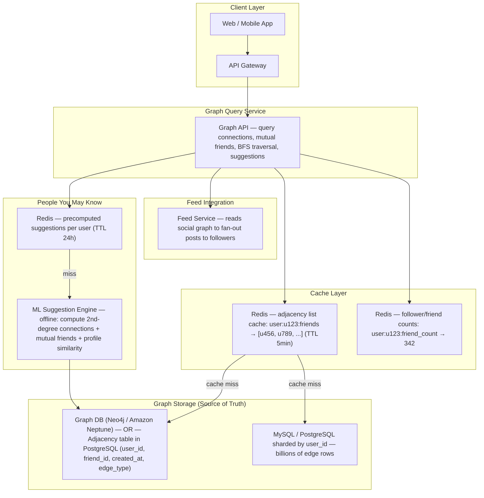
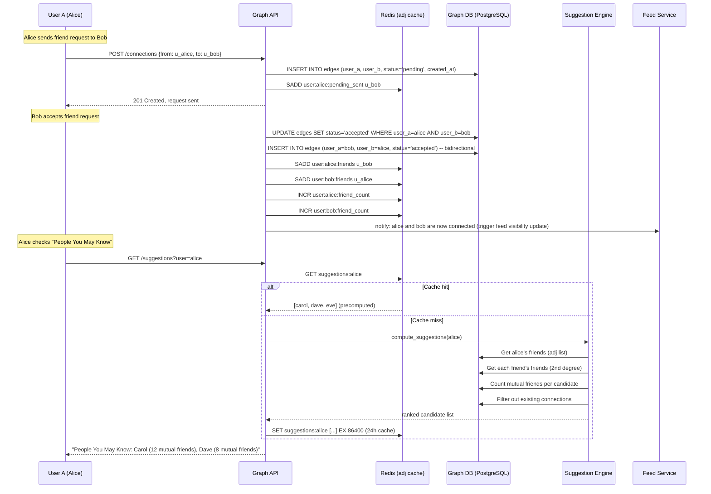
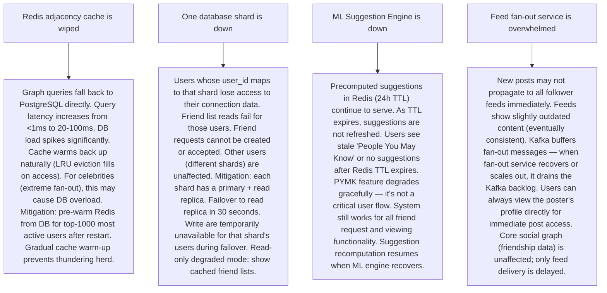

# Pattern 25 — Social Graph (like LinkedIn, Facebook Friends)

---

## ELI5 — What Is This?

> Imagine a giant sheet of paper where each dot is a person,
> and you draw a line between two dots when they're friends.
> Now imagine 3 billion dots with 500 billion lines between them.
> A social graph is that giant sheet of paper — stored on computers.
> When Facebook says "people you may know," it's looking at your dots,
> finding dots that share lots of lines with yours, and suggesting them.
> The challenge is: this paper is too big for any single computer.

---

## Glossary (Every Keyword Explained in ELI5)

| Word | ELI5 Meaning |
|---|---|
| **Graph** | A structure of nodes (people/entities) and edges (relationships/connections). The "social graph" is the complete map of all human relationships on a platform. |
| **Node** | A person (or page, group, company) in the graph. Facebook has ~3.5B user nodes. |
| **Edge** | A connection between two nodes. An edge can be directed (A follows B ≠ B follows A — Twitter) or undirected (A and B are friends — mutual). |
| **Adjacency List** | For each node, store the list of its neighbors. "Alice's friends: [Bob, Carol, Dave]". The most common graph storage format. |
| **First-Degree Connection** | Your direct friends/connections. LinkedIn calls them "1st." |
| **Second-Degree Connection** | Friends of your friends. LinkedIn calls them "2nd." You have ~200 direct friends; they each have ~200 friends = ~40,000 second-degree connections. |
| **Mutual Friends** | People who are friends with both you AND another person. "You and Alice have 12 mutual friends." Computed by intersecting adjacency lists. |
| **Graph Traversal (BFS/DFS)** | Walking the graph: "start at Alice, visit all her friends, then all their friends." BFS finds shortest path between nodes. |
| **Graph Partitioning** | Splitting the graph across multiple servers. Challenge: friends of the same person should be on the same server for fast queries. |
| **Follower / Following** | Directed edge: on Twitter/Instagram, following means you see their posts (not mutual). Followers list = who watches you. Following list = who you watch. |

---

## Component Diagram

---

## Step-by-Step Request Flow

---

## Bottlenecks — Every Point Explained

| # | Bottleneck | Why It Hurts | Fix |
|---|---|---|---|
| 1 | **Celebrity / high-degree node problem** | Kim Kardashian (200M followers), Cristiano Ronaldo (600M followers). When Ronaldo posts, the system must fan-out to 600M follower feeds. Writing to 600M feed entries is billions of writes/second — impossible at post time. | Hybrid fan-out: for regular users (<10K followers), use push fan-out (write to each follower's feed at post time). For celebrities (>100K followers), use pull fan-out (don't pre-populate feeds; when a follower opens their feed, fetch Ronaldo's latest N posts directly). Feed service merges pushed content + pulled celebrity content on read. |
| 2 | **2nd-degree connection queries scan too many nodes** | "Show mutual friends between Alice and Bob." Alice has 500 friends, Bob has 500 friends. Naive approach: fetch all 500 of Alice's friends into memory, fetch all 500 of Bob's friends into memory, compute intersection. 1000 DB rows, manageable. But for "People You May Know" — Alice's 500 friends each have 500 friends = 250,000 nodes to scan for each suggestion computation. At 1M concurrent users requesting suggestions = 250B node visits per second. | Pre-compute offline: Run a daily (or hourly) MapReduce/Spark job over the entire graph. For each user, compute their top-50 PYMK candidates. Store in Redis with 24-hour TTL. Suggestion queries read from Redis (< 1ms) instead of traversing the live graph. Real-time re-computation only when friendship changes (local graph update, not global recomputation). |
| 3 | **Graph storage doesn't fit on one machine** | Facebook's social graph: 3.5B users × ~200 avg friends = 700B edges. At 50 bytes per edge = 35TB. No single DB holds 35TB of edges with fast traversal. | Horizontal sharding by user_id: each shard holds the adjacency list for a range of user IDs. Alice is on shard 3; her friend list (all her friends' IDs) is stored on shard 3. Cross-shard queries: to get mutual friends between Alice (shard 3) and Bob (shard 7), query both shards in parallel and intersect in the application layer. Facebook's TAO system uses this pattern. |
| 4 | **Edge consistency — bidirectional friendship update** | Friendship is bidirectional: when Alice accepts Bob's request, both edges must be created: (Alice→Bob) AND (Bob→Alice). If one write succeeds and the other fails, Alice sees Bob as a friend but Bob doesn't see Alice. | Two-phase write in a transaction: both edges in one PostgreSQL transaction (at the expense of possible cross-shard transactions). OR: use a canonical edge (store only `min(id,id)→max(id,id)`) and derive both directions at query time. OR: eventual consistency with repair jobs — write both, accept temporary 1-way visibility, fix with reconciliation. Facebook TAO uses eventual consistency for this. |
| 5 | **Follower count for celebrities is a hot counter** | Cristiano Ronaldo gets 10,000 new followers/second. A single counter in DB: `UPDATE users SET follower_count = follower_count + 1 WHERE id = ronaldo` — 10,000 writes/second to one row = write contention, serialized updates. | Redis counter: `INCR user:ronaldo:follower_count` — Redis handles 100K incr/sec on a single key. Async sync to DB every 5 seconds (batched write). For the exact count in DB, use periodic snapshot from Redis. For approximate display count ("600.3M followers"), Redis is the source of truth; DB is the periodic backup. |
| 6 | **Graph traversal for "degrees of separation"** | "How many hops between Alice and this stranger?" BFS on a 700B-edge graph in real-time is impractical — even 3 hops from a user with 500 friends: 500 × 500 × 500 = 125M nodes to check. | Pre-compute or use approximate methods: (1) LinkedIn computes 1st/2nd/3rd degree offline. "3rd+" is shown for everyone beyond 2 hops. (2) Bidirectional BFS: search simultaneously from both ends, meet in the middle. Reduces 125M to ~11,000 nodes (500√ × 2). (3) Social graph systems often cap traversal at 3 hops and don't compute exact shortest paths in real-time. |

---

## What Happens When Each Part Fails?

---

## Key Numbers to Know

| Metric | Value |
|---|---|
| Facebook total edges (friendships) | ~700 billion |
| Average Facebook user's friends | ~200 |
| P50 friend-list query latency (Redis) | < 1 ms |
| Max reasonable fan-out size (push model) | 10,000 followers |
| Suggestion recomputation frequency | Every 1h-24h (offline batch) |
| LinkedIn max connections per user (soft cap) | 30,000 |
| Instagram followers (Ronaldo) | 600M+ |
| Twitter/X followers (Elon Musk) | 200M+ |
| Redis SET intersection time (SINTERSTORE) | O(N×M) where N,M = set sizes |

---

## How All Components Work Together (The Full Story)

The social graph is the foundation of every social product. Every feature — feed, PYMK, messaging, notifications — reads from the graph. Getting the graph right is the most important data engineering decision in social platform design.

**Core data model:**
The graph is stored as an **adjacency table**: `(user_id, friend_id, edge_type, created_at, status)`. For Facebook-style mutual friendship: both `(alice, bob)` and `(bob, alice)` rows exist after acceptance. For Twitter-style directed follow: only `(alice, bob)` exists when Alice follows Bob. This denormalization (storing both directions) makes "get all friends of user X" a single `WHERE user_id = X` query.

**Cache layer (Redis):**
The adjacency list for each user is cached in a Redis SET: `user:u123:friends → {u456, u789, u321, ...}`. This enables O(1) "is X a friend of Y?" check using `SISMEMBER`, and O(N) adjacency list retrieval using `SMEMBERS`. Set intersection for mutual friends: `SINTERSTORE mutual:alice:bob user:alice:friends user:bob:friends` — instant, no DB scan.

**Celebrity problem — asymmetric architecture:**
Regular users use push fan-out (their posts are written to each friend's feed). Celebrities use pull fan-out (their posts are read on-demand when a follower opens their feed). The feed service merges both: pushed items (from non-celebrity friends) + pulled items (from followed celebrities), sorted chronologically. This hybrid maintains acceptable latency for both reading and writing.

**PYMK (People You May Know):**
Runs as an offline batch job. Algorithm: for user Alice, find all users who are exactly 2 hops away (friend-of-friend) but not already friends with Alice. Rank by: mutual friend count (highest = most likely to know), profile similarity (same company, school, city), interaction history (liked same posts). Top 50 results stored in Redis per user, refreshed every 24 hours.

> **ELI5 Summary:** The adjacency table is your contacts list stored in a database. Redis copies that contacts list into fast memory so checking "are Alice and Bob friends?" takes microseconds. PYMK is a nightly homework assignment where a computer figures out who you might know based on your friends' friends. The celebrity problem is like having 600M people all wanting to hear your announcement — you can't shout to each person individually, so instead you post it on a noticeboard and people check the noticeboard themselves.

---

## Key Trade-offs

| Decision | Option A | Option B | Why |
|---|---|---|---|
| **Directed vs undirected graph** | Mutual friendship (Facebook, LinkedIn) — undirected edge (A↔B is one relationship) | Follower/following (Twitter, Instagram) — directed edges (A→B ≠ B→A) | **Product determines model.** Friendships require mutual consent (privacy model). Follow models prioritize one-way broadcasting (public figures). Many platforms support both: LinkedIn has connections (mutual) AND followers (unidirectional); Instagram has followers AND close friends. |
| **Graph DB (Neo4j) vs relational (PostgreSQL)** | Graph DB: native traversal optimized, cypher query language, built for BFS/DFS | Relational: familiar tooling, SQL queries, mature ecosystem | **Relational for most social graphs**: Neo4j excels at multi-hop traversals (10+ hops). For social graphs, most queries are 1-2 hops (get friends, get friends-of-friends). A properly indexed `(user_id, friend_id)` adjacency table in PostgreSQL handles this efficiently. Only adopt graph DB when traversal depth and relationship complexity justify it. Facebook, LinkedIn, Twitter all use relational or custom stores — not Neo4j. |
| **Eager vs lazy PYMK computation** | Precompute daily for all users (eager) | Compute on first request then cache (lazy) | **Eager precomputation** for active users (always fresh suggestions when they open PYMK). **Lazy** for inactive users (no point computing for users who haven't logged in for months). Hybrid: eager for recently active users, lazy for dormant. Avoids computing 3B × (expensive graph traversal) when only 10% of users are active daily. |
| **Separate social graph service vs embedded in each service** | Dedicated Graph Service owns all relationship data and queries | Each service (feed, notifications, messaging) has its own copy of the relationship | **Dedicated Graph Service**: single source of truth for friendships. Other services call the API. Prevents stale relationship data in service-local caches. Trade-off: adds latency for cross-service calls. Solution: short-lived cache in each service (1-minute TTL) + pub/sub events on friendship changes to invalidate caches. |

---

## Important Cross Questions

**Q1. How do you compute "mutual friends" efficiently between two users?**
> Given Alice (u_alice) and Bob (u_bob): (1) Fetch Alice's friend set from Redis: `SMEMBERS user:alice:friends`. (2) Fetch Bob's friend set from Redis: `SMEMBERS user:bob:friends`. (3) Intersect using Redis: `SINTERSTORE temp:mutual:alice:bob user:alice:friends user:bob:friends` — result is the mutual friends set. (4) Return size + member list. Time complexity: O(min(|A|, |B|)) for set intersection. For Alice with 500 friends and Bob with 500 friends: 500 comparisons. Redis hash set makes this O(1) per member check. If friend lists aren't cached: SQL — `SELECT f1.friend_id FROM friends f1 JOIN friends f2 ON f1.friend_id = f2.friend_id WHERE f1.user_id = alice AND f2.user_id = bob`.

**Q2. How does LinkedIn compute "2nd degree" connections?**
> LinkedIn won't do this in real-time for all users. Instead: (1) Offline batch job (Spark): for each user U, join `edges WHERE user_id = U` → get 1st-degree set. For each 1st-degree friend F, join `edges WHERE user_id = F` → get their friends (2nd-degree candidates). Remove U and U's 1st-degree friends from candidates. Store "user U has 2nd-degree relationship with V" in a table. (2) Redis stores "degree:u123:u456 → 2" for fast lookup. (3) "3rd+" is inferred: anyone not in 1st or 2nd degree sets is shown as "3rd+" (computing actual 3rd degree for 700M users is prohibitively expensive). The batch job runs daily. Real-time updates propagate to active-user PYMK queries within hours.

**Q3. Twitter has 200M users following Elon Musk. How does posting a tweet work?**
> Pull fan-out + precomputed timeline: Elon posts a tweet. The tweet is stored in `tweets(tweet_id, author_id, content, created_at)`. No immediate fan-out to 200M timelines. When any of his 200M followers opens their timeline: the feed service fetches recent tweets from Elon's account directly (pull), merges with pushed content from regular accounts they follow, and sorts by time. For the "For You" algorithmic feed, an ML model scores candidate tweets and ranks them. The tweet itself is available instantly after posting — delivery to follower timelines is on-demand (pull). This avoids 200M write operations per tweet.

**Q4. How do you handle graph data privacy — "only friends of friends can see my profile"?**
> Privacy as edge attributes + traversal depth check: (1) Each user has a privacy setting stored in their profile: `profile_visibility: {EVERYONE, FRIENDS, FRIENDS_OF_FRIENDS, ONLY_ME}`. (2) When User X views User Y's profile: Graph Service checks the connection between X and Y. (3) At 0 hops (self): always visible. At 1 hop (direct friend): visible for FRIENDS+. At 2 hops (friend-of-friend): visible for FRIENDS_OF_FRIENDS+. No connection: visible only for EVERYONE setting. (4) This check uses the same Redis adjacency cache — fast for 1st degree (SISMEMBER O(1)). For 2nd degree: check if any of X's friends are in Y's friends set (set intersection). Privacy check adds ~2ms of latency using Redis. Never expose the friends list for ONLY_ME profiles even in API responses.

**Q5. How would you design "block user" functionality in the social graph?**
> Block as a special edge type: (1) Add `edges(user_id, target_id, edge_type='BLOCK', created_at)`. (2) When User X blocks User Y: insert (X, Y, BLOCK). Optional: also remove existing friendship edges (X→Y and Y→X). (3) All graph queries filter out BLOCK edges: when displaying profiles, feeds, search results — check if a BLOCK edge exists between viewer and target in either direction. (4) Blocking is symmetric in effect (Y cannot see X's content either), but the data is asymmetric (only X initiated the block — Y is not aware). (5) Redis bloom filter: store blocked users for ultra-fast "is this user blocked?" check before any content delivery. False positive rate acceptable (rare false blocks better than exposing blocked user content).

**Q6. How does Facebook's TAO (The Associations and Objects) system work?**
> TAO is Facebook's purpose-built social graph serving layer (not a general-purpose DB). Core model: **Objects** (nodes: users, photos, pages) + **Associations** (edges: friend_of, liked_by, commented_on). Two operations: `assoc_add(id1, type, id2)`, `assoc_get(id1, type)`. Architecture: (1) MySQL is the storage backend (sharded by object_id). (2) TAO cache layer (custom distributed cache, not Redis) sits in front of the DB. Cache tier = leader + follower caches. (3) Writes go to DB leader via TAO leader cache. (4) Reads served from follower cache nearest to the request origin. (5) Read-your-own-writes: after Alice adds Bob as friend, Alice's subsequent read goes to the leader cache (not follower) to guarantee seeing the just-written edge. This is TAO's "leader-read" consistency model. Result: social graph queries are served from RAM with 1-2ms latency at 100B+ requests/day.

---

## Real-World Apps That Use This Pattern

| Company | Product | How They Use It |
|---|---|---|
| **Facebook / Meta** | Social Graph (TAO) | Facebook's TAO system serves 1 trillion reads and 100 billion writes per day on the social graph. Custom C++ caching layer + MySQL shards. Objects (1B+ nodes): users, groups, pages, events. Associations (700B+ edges): friendship, group membership, event attendance. Located in data centers globally, with regional TAO leader/follower cache hierarchy. Largest social graph in the world. |
| **LinkedIn** | Economic Graph | LinkedIn calls their social graph the "Economic Graph" — connecting professionals, companies, schools, jobs, skills. Graph has 1B+ user nodes + job nodes + company nodes + skill nodes (multi-type graph). In-house graph query engine built on top of Espresso (distributed MySQL). Degree distance (1st, 2nd, 3rd+) is a core product feature. PYMK (People You May Know) drives significant user growth and engagement. |
| **Twitter / X** | Follow Graph | Directed follow graph: 550M users. Twitter uses FlockDB (open-sourced, now archived) + custom graph storage for follow relationships. Key feature: timeline fanout for regular users is push-based; celebrity/power-user timelines are pull-based. Retweet graph forms a secondary structure. Twitter's "Who To Follow" uses collaborative filtering on the follow graph + tweet engagement signals. |
| **Instagram** | Follower Graph | Instagram at ~100M users used PostgreSQL for the social graph. At 2B users, migrated to custom sharded graph storage. Key challenge: Instagram's follow graph is heavily asymmetric (celebrities have 500M followers but follow only 200 people). The "Close Friends" feature adds a private sub-graph layer — a subset of your follower connections with additional privacy controls. |
| **Pinterest** | Interest Graph (People + Boards + Pins)** | Pinterest's graph is tripartite: users, boards, pins. Edges: user→board (follows), user→pin (saves), board→pin (contains). The "interest graph" differs from a pure friend graph — it's about what you care about, not who you know. Graph analysis drives Pinterest's recommendation engine: if Alice and Bob save similar pins, show Alice boards that Bob follows. |
| **Snapchat** | Best Friends / Snap Score | Snapchat's social graph is weighted by interaction frequency: "Best Friends" are the people you Snap with most. Edge weights are computed from message frequency (not static). The Snap Score (total snaps sent + received) is a degree-of-engagement metric. Graph storage uses custom sharded stores. The ephemeral social graph differs from persistent friendship graphs — edges have temporal weight that decays with inactivity. |
