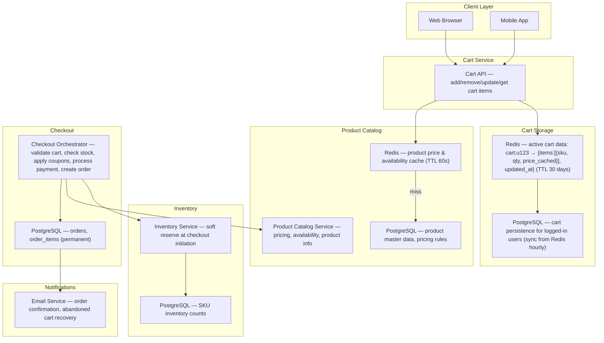
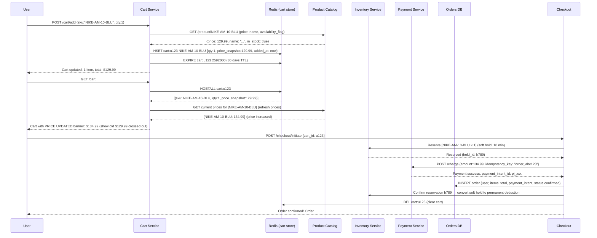
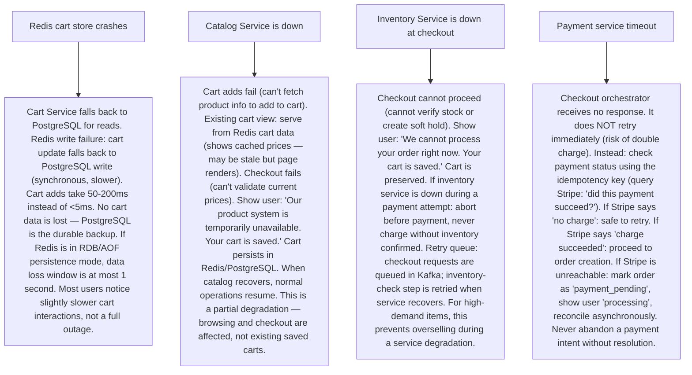

# Pattern 26 — E-Commerce Shopping Cart (like Amazon)

---

## ELI5 — What Is This?

> Imagine you're at a huge supermarket. You walk around putting things in your
> shopping cart. The cart belongs to you — even if you walk out and come back
> tomorrow, your items are still there.
> But the price tag on the item might change overnight,
> and some items might sell out while your cart sits there.
> An e-commerce cart manages: what's in your cart, keeps it across devices,
> shows up-to-date pricing, checks if items are actually in stock,
> and finally converts your cart into a real order when you pay.

---

## Glossary (Every Keyword Explained in ELI5)

| Word | ELI5 Meaning |
|---|---|
| **Cart** | A temporary collection of items a user intends to buy. Not a confirmed order — just a list with intent. |
| **Guest Cart** | A cart created before the user logs in. Stored by a session cookie. Must be merged with the user's existing cart upon login. |
| **Session** | A server-side memory space for one browser session. Each session has a unique ID stored in a cookie. Sessions are temporary (expire if unused). |
| **Cart Merge** | When a guest user logs in, their guest cart items are merged with their existing account cart. |
| **Price Lock** | The price shown in cart vs the price at checkout. Should prices update in cart? Industry practice varies — Amazon shows "price updated" banners. |
| **Stock Check** | Verifying item availability at checkout time (not at add-to-cart time). "Added to cart" doesn't reserve inventory. |
| **Checkout** | The final step: enter shipping address, enter payment, confirm order. Cart is converted to an Order. Cart is cleared. |
| **Order** | A permanent record of a confirmed purchase. Unlike a cart (temporary), orders are immutable after creation. |
| **Abandoned Cart** | A cart that was never checked out. Amazon sends reminder emails for abandoned carts to recover lost revenue. Typically 70% of carts are abandoned. |
| **SKU (Stock Keeping Unit)** | A unique ID for a specific product variant. "Nike Air Max, Size 10, Blue" = one SKU. Each SKU has its own inventory count. |

---

## Component Diagram

---

## Step-by-Step Request Flow

---

## Bottlenecks — Every Point Explained

| # | Bottleneck | Why It Hurts | Fix |
|---|---|---|---|
| 1 | **Reading cart at high frequency refreshes product prices** | Every GET /cart call fetches current prices from the catalog service for every item. A cart with 20 items = 20 catalog calls. At 1M users viewing carts simultaneously = 20M catalog queries/second. | Catalog price cache in Redis (TTL 60s): price data is almost-static (changes infrequently). Cache product prices in Redis by SKU. Cart service batches: `MGET price:SKU1 price:SKU2 ... price:SKU20` in one Redis call. Price shown in cart is at most 60 seconds stale — acceptable. Real-time price is enforced at checkout. |
| 2 | **Cart store is Redis: what if Redis goes down?** | All active carts are in Redis. Redis restart = all carts lost. Users lose their shopping carts, leading to abandoned purchase intent and revenue loss. | Dual-write: cart writes go to Redis (primary, fast) AND PostgreSQL (backup, async). On Redis miss: restore cart from PostgreSQL. PostgreSQL is the durable source; Redis is the cache. Add Redis persistence (AOF with every-1-second fsync) to minimize data loss window on Redis crash. |
| 3 | **Guest cart → logged-in cart merge conflicts** | User adds 2 items to guest cart, then logs in. They already had 3 items in their account cart. Naive merge = 5 items (always take both). But if the user had deliberately removed an item from their account cart last week and the guest cart has it again, adding it back is wrong. | Smart merge strategy: (1) For items unique to guest cart → add to account cart. (2) For items in both carts → take the higher quantity (user probably wants more). (3) Items only in account cart → keep. (4) Never silently lose items. On login, show the user a "merged cart" summary and allow them to remove any unwanted items. Most e-commerce sites use "take-all, allow removal" as the safe default. |
| 4 | **Checkout fails after payment succeeds** | Payment is charged, but order creation in DB fails (DB down, timeout). User is charged but has no order. They call support. Refund must be manually issued. | Idempotent order creation with payment intent ID as unique key: (1) `INSERT INTO orders (payment_intent_id, ...) ON CONFLICT (payment_intent_id) DO NOTHING`. (2) If DB write fails: retry loop (3 attempts). (3) If all retries fail: write to "payment_orphan" queue for manual reconciliation. (4) Background reconciliation job: find Stripe charges without matching orders → create orders or issue refunds. The Stripe idempotency key prevents double-charging on retry. |
| 5 | **Applying discount codes / coupons is computationally expensive** | Coupon rules can be complex: "20% off orders over $100 with product from category Electronics, first-time customer, user is in loyalty tier Gold, order placed on Tuesday." Evaluating 50 rules per cart = expensive per checkout. | Rule engine with result caching: pre-evaluate coupon eligibility when user enters code, not on every cart view. Cache result: `coupon_result:u123:SAVE20 → {valid: true, discount: 26.99, expires_at: checkout+10min}`. Coupon validity is re-checked at final order creation (prices may change). For rule complexity: use a decisioning engine (Drools, custom) that compiles rules to fast evaluation trees. |
| 6 | **Flash sale — 100K users add same item to cart simultaneously** | All 100K users add an item to cart. No problem here — add-to-cart doesn't reserve inventory. But at checkout time, only 500 items are available. 99,500 users will get checkout failures simultaneously. Cascade of 99,500 error responses + retry storms. | Inform before checkout: show "Only X left in stock" on the cart page (cached inventory count). Educate users that cart ≠ reservation. At checkout: immediate stock check shows "sold out" early (before payment). Stagger retries: return `503 + Retry-After: 30s` for failed stock checks to prevent retry storms. Waitlist feature: "Notify me when back in stock." |

---

## What Happens When Each Part Fails?

---

## Key Numbers to Know

| Metric | Value |
|---|---|
| Shopping cart abandonment rate | 70-75% industry average |
| Cart TTL (guest users) | 7 days |
| Cart TTL (logged-in users) | 30-90 days or permanent |
| Redis HSET per cart operation latency | < 1 ms |
| Product price cache TTL (Redis) | 30-60 seconds |
| Amazon's cart-to-order conversion (Prime Day) | Multi-million orders/hour |
| Abandoned cart email recovery rate | 5-15% conversion |
| Checkout soft hold duration | 5-15 minutes |

---

## How All Components Work Together (The Full Story)

The shopping cart appears simple — it's just a list of items. But making it work correctly across devices, during high traffic, and through the payment flow involves substantial system coordination.

**Cart lifecycle — three phases:**

**Phase 1 — Building (add/remove operations):**
Cart data lives in Redis, keyed by user ID (or session ID for guests). Each item is stored as a hash field with SKU as key and a JSON value containing quantity and price snapshot. Redis is ideal: O(1) operations, TTL for automatic expiry, handles 1M concurrent carts comfortably. The price snapshot is the price at time of add — shown in cart for reference, but current price is always re-fetched on cart view.

**Phase 2 — Viewing (cart page load):**
On GET /cart, the service retrieves all cart items from Redis, then batch-fetches current prices from the catalog cache. It compares price snapshots with current prices and shows "Price Updated" notices for items whose price changed. This is non-blocking — the cart is displayed even if one catalog lookup fails (shows the snapshot price with a warning). Stock flags are also checked and "Only 2 left!" or "Out of Stock - we'll notify you" shows for relevant items.

**Phase 3 — Conversion (checkout):**
The checkout orchestrator (saga pattern internally) runs these steps: (1) Re-validate all cart items (price + availability). (2) Apply coupons/discounts. (3) Create soft hold on inventory (10-minute window). (4) Charge payment with idempotency key. (5) Create Order in DB. (6) Confirm inventory deduction. (7) Clear cart from Redis. (8) Send confirmation to notification service.

If any step fails, the saga compensates: release soft hold, issue refund if payment was charged, report to user.

> **ELI5 Summary:** Redis is the shopping trolley — fast to add/remove items, exists only while you're in the store (TTL). PostgreSQL is the receipt — a permanent record of what you actually bought. The checkout orchestrator is the cashier who checks all items against current prices, verifies stock, charges your card, and gives you the receipt. If their cash register breaks mid-scan, they figure out if your card was charged before deciding whether to try again.

---

## Key Trade-offs

| Decision | Option A | Option B | Why |
|---|---|---|---|
| **Reserve inventory at add-to-cart vs at checkout** | Reserve when added (item held for user, unavailable to others) | Reserve only at checkout initiation (cart is just a wishlist) | **Reserve at checkout only**: reserving at add-to-cart would require managing locks for days (anyone can add to cart but not checkout for a week). Inventory would be artificially out-of-stock for items sitting in 70% of abandoned carts. Exception: limited inventory products (concert tickets, limited sneaker releases) often reserve at add-to-cart with a short timer (~10 mins). |
| **Consistent cart across all devices** | Cart is server-side (Redis/DB), synced across all devices | Cart is client-side (localStorage), separate per device | **Server-side for logged-in users**: enables cross-device shopping (desktop → mobile). Client-side for guests (no account required, simpler). Hybrid: guest cart is localStorage, merged to server cart on login. |
| **Price shown in cart — snapshot vs live** | Show price at time of add (snapshot) | Show current price always | **Show current price**: display the accurate price the user will actually pay. Show a "was $X" note if price decreased (user feels lucky) or "price updated" banner if price increased (user informed). Never charge a different price than what's shown without notification. |
| **Cart as part of Order Service vs separate Cart Service** | Single "Cart & Order" service handles both pre- and post-checkout | Separate Cart Service (temporary) and Order Service (permanent) | **Separate services**: cart data is ephemeral, high-frequency, non-critical. Order data is permanent, lower-frequency, ACID-critical. Different storage (Redis vs PostgreSQL), different SLAs, different team ownership. Merging them creates a service that is both complex and has conflicting non-functional requirements. |

---

## Important Cross Questions

**Q1. How do you handle the "add to cart" vs "buy now" flows differently?**
> "Buy Now" skips the cart entirely and goes directly to checkout with just the selected item. Implemented as: create a temporary single-item cart in Redis with a very short TTL (15 minutes), immediately redirect to checkout. This cart ID is separate from the user's main cart — so "Buy Now" doesn't pollute the user's saved cart. After checkout: the temp cart is deleted. The main cart remains unchanged. The user may later return to complete the main cart. This flow is common for high-impulse purchases and is optimized for speed (one fewer step).

**Q2. How does Amazon handle "save for later" (moving items out of active cart)?**
> Separate list type: "Save for Later" is a different cart namespace: `cart:u123:saved` vs `cart:u123:active`. Items are moved between namespaces with a Redis rename/copy operation. "Saved for later" items: (1) don't count toward checkout total, (2) are not subject to stock checks at checkout, (3) have a longer TTL (90 days vs 30 days), (4) trigger "item on sale" notifications (inventory service monitors saved items and notifies users when price drops > 10%). The data model is the same as the active cart — just flagged differently. One cart service handles both namespaces.

**Q3. How do you implement quantity validation in the cart?**
> Layered validation: (1) Client-side: `min=1, max=99` input validation (UX convenience, not security). (2) Cart Service API: validate quantity > 0 and ≤ per-item purchase limit (Amazon has limits like "max 5 per customer"). Return 400 Bad Request if violated. (3) Checkout time: final quantity validation against per-product purchase limits AND available inventory (`QTY_REQUESTED ≤ available_stock`). (4) If post-add stock drops below cart quantity: show warning "only X in stock" and reduce cart quantity to match on cart view. Always re-validate quantity at checkout — cart was assembled in the past, reality may have changed.

**Q4. How does cart data work across web and mobile (cross-device cart)?**
> For authenticated users: single server-side cart keyed by user_id. Web and mobile both read from and write to the same Redis key. No conflict resolution needed — last write wins (Add to cart from mobile, add from web — both are additive HSET operations on the same hash). For quantity updates: race condition possible — user decrements qty on web and mobile simultaneously. Use HINCRBY for relative updates (not absolute SET) to avoid lost updates. For absolute SET: use optimistic locking (WATCH/MULTI/EXEC on Redis transaction). In practice: simultaneous quantity changes from two devices are rare enough that last-write-wins is acceptable.

**Q5. How do you design the abandoned cart recovery email system?**
> Event-driven: (1) Each cart update event is produced to Kafka (`user:u123 cart_updated [items]`). (2) Analytics Service tracks time of last cart activity per user. (3) A scheduled job (runs every hour): find all carts where `last_updated > 1 hour ago AND no checkout event` → these are "abandoned" candidates. (4) Check if user has purchased since (don't send recovery email if they bought something else). (5) Enqueue personalized email via Email Service with cart contents, prices, "Your cart is waiting" CTA. (6) Send at most 1 recovery email per cart session (avoid spam). (7) Personalization: if any cart item is on sale, highlight the discount in the email. This flow recovers 5-15% of abandoned carts — significant revenue.

**Q6. How does Amazon handle Prime Day with 100x normal traffic?**
> Pre-scaling + isolation + degraded modes: (1) **Pre-scale**: 2 weeks before Prime Day, provision 10x normal Redis cluster capacity and database read replicas. Load test with synthetic traffic. (2) **Feature flags**: disable non-critical features (cross-sell recommendations, price history charts) to reduce system load. Cart core (add/remove/checkout) is protected. (3) **Queue checkout**: during extreme peaks, incoming checkout requests go to a queue (Kafka); users see "Processing... you're in queue". Checkout workers drain at maximum throughput. (4) **Circuit breakers**: if inventory service is slow, fall back to "optimistic checkout" (assume available, reconcile later for the 0.1% that oversell). (5) **Cell-based architecture**: Amazon's retail codebase is partitioned into isolated "cells" so a traffic surge to Electronics doesn't affect Books. Prime Day stress tests these boundaries.

---

## Real-World Apps That Use This Pattern

| Company | Product | How They Use It |
|---|---|---|
| **Amazon** | World's Largest E-Commerce Cart | Amazon's cart is legendary for its scale: 1.5B+ items added to carts on Prime Day 2023. Uses DynamoDB (not Redis) for cart storage — strong consistency for cart operations. Cart is a first-class data object with complex business rules: subscription items, digital vs physical, third-party seller items, Prime eligibility. Cart recommendations ("frequently bought together") generated by a separate ML system. Abandoned cart recovery emails drive billions in annual recovery revenue. |
| **Shopify** | Platform for 2M+ Merchants | Shopify provides the cart infrastructure for 2M merchants. Cart data in Redis with PostgreSQL backup. Each Shopify store is multi-tenant — carts are namespaced by shop_id. Shopify's Cart API (Storefront API) is exposed to developers for headless commerce implementations. Shopify processes $9.4B in merchant sales on BFCM (Black Friday Cyber Monday) — pre-scaling is a multi-team operational process. |
| **Walmart** | Walmart.com and Pickup Cart | Walmart's "pickup" cart: add items for in-store pickup. Physical inventory differs from online. Cart checks local store stock, not warehouse stock — geo-based inventory lookup. Uses Redis for session cart state. Walmart migrated from on-prem to cloud during COVID when their e-commerce traffic 3x'd. Their cart system handles both same-day delivery and 2-day shipping from the same cart (mixed fulfillment types). |
| **ASOS / Zara** | Fashion E-Commerce | Fast fashion sites face frequent out-of-stock scenarios (limited run items). ASOS shows exact inventory counts in cart: "Only 1 left in your size". Carts store size/color variants (separate SKUs). Guest checkout with no login is heavily used (30%+ of purchases). Cart merge on login is a key engineering challenge. Price sorting and filtering means catalog is heavily cached in Redis. |
| **Instacart / Deliveroo** | Grocery Cart** | Grocery carts differ: items are available by weight (0.5 lb bananas), prices vary by actual weight detected at packing. "Substitutions" feature: if banana is out of stock, replace with similar item. Cart holds the customer's preferences for substitution: allow/deny, preferred alternatives. The "cart" becomes more of a shopping list that gets fulfilled differently from its original composition. Inventory is hyper-local (per store, not per DC) and changes every few minutes. |
