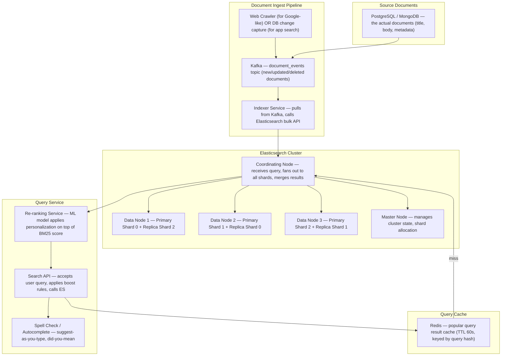
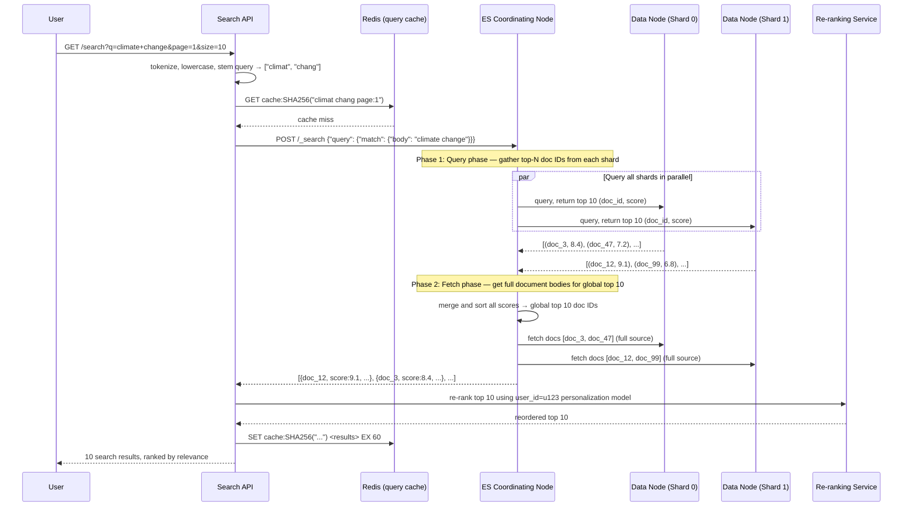
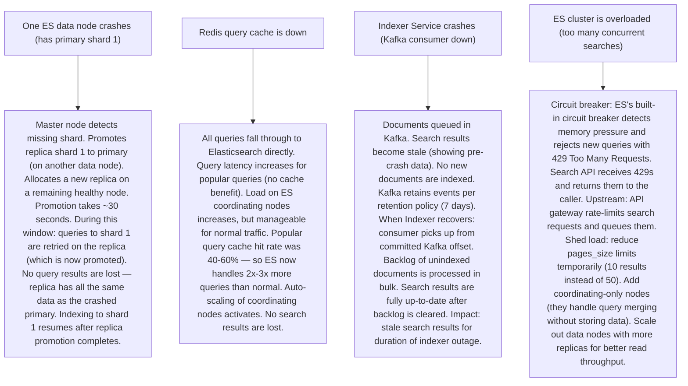

# Pattern 27 — Search Engine Internals (like Elasticsearch, Google)

---

## ELI5 — What Is This?

> Imagine a library with a billion books. You want to find all books
> that mention "climate change" in them. You can't open every book.
> Instead, smart librarians already made a giant index: for every word,
> they wrote down a list of every book that contains it.
> "climate" → [book 3, book 47, book 892, ...]. "change" → [book 3, book 12, ...]
> You find books about "climate change" by checking both lists and finding books
> in BOTH lists. This pre-built word → book list is called an "inverted index"
> and it's the heart of every search engine.

---

## Glossary (Every Keyword Explained in ELI5)

| Word | ELI5 Meaning |
|---|---|
| **Inverted Index** | The core search data structure: a map of `word → [list of document IDs that contain this word]`. Called "inverted" because it goes from words to documents (not documents to words). |
| **Forward Index** | The opposite: `document_id → [list of words it contains]`. Used for document storage, not for search. |
| **Tokenization** | Breaking a sentence into individual words (tokens). "Hello World" → ["hello", "world"]. Also handles punctuation removal, lowercasing. |
| **Stemming / Lemmatization** | Reducing words to their root form. "running", "runs", "ran" → "run". So searching "run" also finds documents containing "running". |
| **TF-IDF** | Term Frequency × Inverse Document Frequency. Scores how relevant a word is in a document. "the" appears in all documents → low IDF (not distinctive). "Mongoose" appears in few documents → high IDF (very distinctive). Used for ranking. |
| **BM25** | An improved relevance scoring algo used by Elasticsearch. Better than TF-IDF for long documents. Standard ranking algorithm in modern search engines. |
| **Shard** | In Elasticsearch, an index is split into shards. Each shard is a complete, self-contained Lucene index. Distributed across multiple nodes. |
| **Replica** | A copy of a shard on a different node. Used for read scaling and fault tolerance. Reads are served from primary OR replicas. |
| **Lucene** | The underlying search library that Elasticsearch (and Solr) are built on. Lucene is the actual inverted index engine. |
| **Query DSL** | Elasticsearch's JSON query language. `{"match": {"title": "climate change"}}`. More powerful than SQL for text search. |
| **Analyzer** | The pipeline that processes text before indexing (and before querying): tokenizer → token filters (lowercase, stop words, stemmer). Must be consistent: if you index with a stemmer, you must also query with the same stemmer. |

---

## Component Diagram

---

## Step-by-Step Request Flow

---

## Bottlenecks — Every Point Explained

| # | Bottleneck | Why It Hurts | Fix |
|---|---|---|---|
| 1 | **Indexing large documents slows write throughput** | Indexing a 100,000-word document requires tokenizing, stemming, building inverted index entries for thousands of unique terms, and writing to disk. At 10K documents/second, this saturates CPU on ES data nodes. | Bulk indexing: Elasticsearch bulk API sends 1000-5000 documents per HTTP request (amortizes network overhead). Tune refresh interval: `index.refresh_interval = 30s` (delay making new docs searchable for 30 seconds — trades freshness for throughput). Use dedicated indexing nodes with separate data nodes to prevent indexing pressure from affecting search latency. |
| 2 | **High-cardinality field aggregations are memory-expensive** | `SELECT city, COUNT(*) FROM docs GROUP BY city` (faceted search). With 50K unique cities, Elasticsearch must maintain 50K buckets in memory per shard × N shards. OOM on aggregation-heavy queries. | `doc_values`: Elasticsearch stores column-oriented data on disk for aggregation fields (not in heap). Avoids in-memory bucket explosion. For very high-cardinality (user_id): avoid aggregations on such fields in production queries. Use HyperLogLog for approximate cardinality counts instead of exact. |
| 3 | **Deep pagination is expensive** | `GET /search?page=1000&size=10` — Elasticsearch must fetch top 10,010 results from every shard, sort globally, then discard the first 10,000 and return the last 10. Memory and CPU explode at deep pages. | Search-after cursor pagination: instead of page numbers, use the last result's sort value as a cursor. `search_after: [score_of_last_item, doc_id_of_last_item]`. Each page fetches only size + 1 items, not offset + size. No deep pagination O(N) problem. Never allow `?page=1000` in a public API for this reason. |
| 4 | **Relevance ranking is non-intuitive for non-English text** | BM25 is tuned for English. It handles English stemming well but poorly handles CJK (Chinese/Japanese/Korean) text (no whitespace tokens), morphologically rich languages (Arabic, Finnish), or typos. | Language-specific analyzers: Elasticsearch has built-in analyzers for 30+ languages with language-appropriate tokenizers and stemmers. For CJK: unigram/bigram tokenizers. For typos: fuzzy matching (`match: {query: "clmate", fuzziness: 1}` uses Levenshtein distance ≤ 1). For semantic understanding beyond keywords: dense vector search with embeddings (`knn_search` with sentence transformers). |
| 5 | **Hot index — all writes go to one shard's primary** | Shard 0 of index `logs-2024-01-15` receives all new log entries. After 1 hour, shard 0 is 80GB (too large). Other shards are 0GB. One node saturated, others idle. | Index-time routing and ILM rollover: (1) Use multiple shards (set `number_of_shards = 20` at index creation). ES round-robins writes across shards. (2) ILM rollover policy: when shard exceeds 40GB, create a new index automatically. (3) For time-series: use time-based index aliases (`logs` alias always points to today's index). |
| 6 | **Cluster split-brain** | 3 ES master-eligible nodes, network partition: Node 1 and Node 3 can't reach Node 2. Node 2 thinks it's still master. Node 1+3 elect a new master. Two masters now exist — split-brain. Each applies cluster state changes independently = data corruption. | Quorum-based master election: with 3 master-eligible nodes, a new master requires agreement from `(3/2)+1 = 2` nodes. Set `discovery.zen.minimum_master_nodes = 2`. Node 2 (isolated) cannot form a quorum of 2 from just itself — it steps down. Only the partition with 2 nodes can elect a master. Minimum 3 master-eligible nodes for a production cluster. |

---

## What Happens When Each Part Fails?

---

## Key Numbers to Know

| Metric | Value |
|---|---|
| Elasticsearch indexing throughput (per node) | 10K-50K docs/second |
| Full-text query latency (p99, in-memory) | 10-50 ms |
| Recommended shard size | 10-50 GB |
| ES heap memory recommendation | 50% of available RAM, max 32 GB |
| Maximum open shard count per node | ~1000 |
| BM25 scoring factors | TF, IDF, field length normalization |
| Redis query cache TTL | 30-60 seconds |
| Fuzzy match Levenshtein distance | 1-2 edits |
| Segment merge frequency | Background, triggered when segment count > 10 |

---

## How All Components Work Together (The Full Story)

A search engine has two distinct phases: **indexing time** (building the inverted index) and **query time** (searching the inverted index). Getting both phases right is the key to fast, relevant search.

**Indexing pipeline:**
1. Source documents enter via Kafka (from a DB change capture, crawler, or direct API).
2. The **Indexer Service** calls the Elasticsearch Bulk API, submitting batches of 1000-5000 documents.
3. Each document flows through the **Analysis Chain**: tokenizer (split into tokens) → character filters (HTML stripping) → token filters (lowercase, stop words like "the/a/an", stemmer "running→run"). The resulting tokens are written to the **inverted index** (Lucene segment files on disk).
4. New segments are initially in memory (unsearchable). On `refresh` (default: every 1 second), segments are flushed to disk and become searchable. On `flush` (less frequent), a checkpoint is written to the transaction log (for durability).

**Query execution (two-phase scatter-gather):**
1. A user query arrives at the **Coordinating Node**. It parses the Query DSL and broadcasts to all shards.
2. **Phase 1 (Query phase):** Each shard searches its local inverted index, computes BM25 scores for matching documents, and returns the top N (doc_id, score) pairs. This is cheap — no data fetching.
3. The Coordinating Node merges all shard results, sorts by score, and identifies the global top K documents.
4. **Phase 2 (Fetch phase):** The Coordinating Node fetches only those K documents' full source data from their respective shards.
5. The result is returned to the **Search API** which may apply ML re-ranking (personalization), add spell-check suggestions, highlight matching terms, and cache the result in Redis.

**Why Lucene's inverted index is fast:**
The inverted index maps each term to a **postings list** — a sorted list of document IDs. Searching "climate AND change" = intersect two sorted lists (O(N + M) with linear merge). The postings lists are stored in compressed on-disk segments. Segments are memory-mapped — OS page cache keeps hot data in RAM. For a billion-document index across 10 shards, each shard's hot segments (~10GB) fit in RAM. Query time accesses only on-disk segments for cold data.

> **ELI5 Summary:** Building the search index is like a team of librarians spending a week creating a master word index for every book in the library. A user's search query is like asking "which books mention these words?" — the librarians check their pre-built index (milliseconds) instead of reading every book (days). Multiple librarians (shards) each know a portion of the library; the head librarian (coordinating node) asks all of them simultaneously and merges their answers.

---

## Key Trade-offs

| Decision | Option A | Option B | Why |
|---|---|---|---|
| **Number of shards** | More shards (20+): parallelism, more scalable, easier to rebalance | Fewer shards (3-5): lower cluster overhead, simpler merge operations | **Match shard count to future data volume + node count.** Rule: shard size 10-50GB. Index is 500GB → 10-50 shards. Over-sharding is a real problem (>10 shards per GB) — too much overhead. Under-sharding = hot shards. Shards cannot be split post-creation (must reindex) — plan ahead. |
| **Real-time vs near-real-time index freshness** | `refresh_interval = 1s` — new documents searchable in 1 second | `refresh_interval = 30s` — new documents searchable in 30 seconds | **30 seconds for high-throughput indexing**: each refresh produces a new Lucene segment, which must eventually be merged. 30 segments per minute at 1s refresh vs 2 per minute at 30s. Fewer segments = better query performance, less merge I/O. Use 1s for user-visible content (product search), 30s for log/analytics search. |
| **Keyword-based (inverted index) vs vector search (ANN)** | Full-text BM25: exact/fuzzy keyword matching | Dense vector search: semantic similarity via embeddings | **Use both (hybrid search)**: BM25 excels at exact keyword matching ("SKU XYZ-123", person names, error codes). Vector search excels at semantic intent ("comfortable shoes for hiking" → matches results containing "trail running", not literally "comfortable shoes"). Hybrid search combines BM25 + vector scores with a reciprocal rank fusion algorithm. |
| **Stored fields vs source-only** | Store all fields indexed + original source (flexible queries + source returns) | Store only source, compute indexed fields dynamically | **Store source + key indexed fields** as `doc_values` (on-disk column store). `_source` field allows returning original document. `doc_values` enables fast aggregations without heap. Disable `_source` only when heavily optimizing storage (saves 30-50% disk) and your app doesn't need to retrieve original document text. |

---

## Important Cross Questions

**Q1. How does autocomplete / type-ahead search work?**
> Edge N-gram tokenizer: at index time, "macbook" is tokenized into edge n-grams: ["m", "ma", "mac", "macb", "macbo", "macboo", "macbook"]. When user types "mac", the query term "mac" matches any document where this n-gram exists. Because "mac" is in every document containing "macbook", those documents are returned instantly. Storage cost: each word produces O(length) n-grams. Mitigated by: using a dedicated autocomplete field (not the main text field), minimum n-gram size=2 (skip single-char n-grams), maximum n-gram size=15 (skip very long n-grams). Alternatively: Elasticsearch's `search_as_you_type` field type handles this automatically.

**Q2. Explain the two-phase query execution in Elasticsearch.**
> Phase 1 (Query/Scatter): Coordinating node sends query to all shards. Each shard independently scores matching documents and returns only (doc_id, score) pairs for its local top N results. No source data transferred yet — just IDs and scores. Phase 2 (Fetch/Gather): Coordinating node merges results from all shards, sorts globally, and identifies the top K doc_ids. It then fetches full document source for only those K documents from their specific shards. Why split? Phase 1 transfers minimal data (N shards × top_k IDs). Fetching full source for all candidates would transfer gigabytes of data unnecessarily. Only the final top K documents need full source retrieval. This is the "scatter-gather" pattern optimized for minimum data transfer.

**Q3. What is a Lucene segment and why does segment merging matter?**
> A segment is an immutable mini-index within a Lucene index. When documents are indexed, they're written to a new in-memory segment, then flushed to disk as an immutable file. Over time, many small segments accumulate. Searching requires checking all segments (query time scales with segment count). Segment merging: Lucene periodically merges multiple small segments into one larger segment (background I/O operation). Benefits: fewer segments → faster queries, deleted documents are actually purged (Lucene "deletes" by marking documents as deleted; merge is when they're physically removed), better disk compression. Cost: merge is I/O intensive. In production: separate merge I/O limits to prevent merges from saturating disk bandwidth during peak query traffic.

**Q4. How does Elasticsearch handle "did you mean?" spell correction?**
> Two approaches: (1) **Fuzzy matching at query time**: `match: {query: "clmate change", fuzziness: "AUTO"}` — AUTO sets Levenshtein distance to 0 for words ≤ 2 chars, 1 for 3-5 chars, 2 for 6+ chars. "clmate" has distance 1 from "climate" (one missing char) — matches. Cost: BK-tree traversal of the term dictionary — O(N × D²) where D=edit distance. (2) **Phrase suggester (did-you-mean)**: run the original query, and if results are below a confidence threshold, compute the most frequent correction from the term frequency index: "clmate change" → "climate change" (both terms' corrections appear together frequently). Elasticsearch's `phrase_suggester` handles this. |

**Q5. How do you design search for a multi-tenant SaaS application where each tenant's data must be isolated?**
> Three patterns: (1) **Separate index per tenant**: `tenant_123_products`, `tenant_456_products`. Complete isolation, easy to delete one tenant's data, customizable mappings. Cost: 10K tenants = 10K indices = 10K shard sets (shard count explosion). Only for small tenant counts. (2) **Routing by tenant_id**: one shared index, all documents have `tenant_id` field. Use `routing_value = tenant_id` — all of tenant's documents go to the same shard. Tenant queries only hit one shard (efficient). Downside: one large tenant creates a hot shard. (3) **Hybrid**: large tenants get dedicated indices; small tenants share a multi-tenant index. Elasticsearch aliases map tenant queries to their correct index transparently. Application layer adds `must: {term: {tenant_id: "123"}}` to every query.

**Q6. How does Google's search engine differ architecturally from Elasticsearch?**
> Google's scale is fundamentally different: 100B+ pages indexed. Key differences: (1) **Distributed inverted index across thousands of servers**: each server holds a portion of the posting lists (by doc ID range or by term range). Querying "climate change" requires touching hundreds of servers to assemble the complete posting list. (2) **PageRank as a pre-computed score**: document-level global authority score, not just term frequency. Precomputed offline via graph analysis on the web link graph. Used as a multiplicative factor on top of BM25-equivalent term scores. (3) **Freshness tier**: separate index for news/social content (indexed in seconds). Main web crawl index is refreshed over weeks. (4) **Serving latency < 100ms** at 100B+ queries/day requires thousands of serving nodes with thousands of GB of RAM for hot posting lists. Elasticsearch is a general-purpose engine; Google's engine is deeply specialized for web search at internet scale.

---

## Real-World Apps That Use This Pattern

| Company | Product | How They Use It |
|---|---|---|
| **Elasticsearch (Elastic)** | Core Search Engine | The most popular commercial search engine. Used by GitHub (code search, 200TB index of code), Netflix (content discovery search), Uber (restaurant/driver search), Yelp (business search). Lucene underneath. ES adds distributed coordination, cluster management, and the REST API on top of Lucene's inverted index. GitHub's code search indexes 200TB across 2.5-million open source repositories — returning results in < 200ms via custom optimizations. |
| **Google** | Web Search | ~8.5B searches/day. 100B+ URLs indexed. PageRank + BERT (transformer model for semantic understanding). Inverted index is distributed across tens of thousands of servers. Two-tier indexing: "freshness" tier for recent content (< 1 day old), "stale" tier for full web corpus. Knowledge Graph (entity-aware search) sits alongside the inverted index. Query latency < 100ms globally via 15+ data centers. |
| **LinkedIn** | LinkedIn Search | Search across 1B+ profiles, jobs, companies, posts. Custom Galene search engine (built on Lucene + custom distributed layer). Supports structured facets (location, company, title) + text search on profile data. "People You May Know" uses the same index. Personalized ranking: boost results from your 1st/2nd degree network using the social graph at query time. 8+ billion searches/month. |
| **Shopify** | Product Search** | Elasticsearch for merchant storefronts: product name, description, tags. Key challenge: each Shopify store is a separate search namespace (multi-tenant). Merchant-customizable relevance (pinned products, boosted categories). Integration with Polaris (Shopify's admin search). 2M+ merchant stores each with independent product catalogs — index isolation per shop. |
| **Spotify** | Podcast / Track Search | Typesense + custom systems. Search across 100M+ tracks, 5M+ podcasts, 500M+ users. Autocomplete (edge n-grams) for track names. Fuzzy matching for artist names (handles non-English and transliterations). "Did you mean Eminem?" for typos. Locale-aware search (Japanese characters, Arabic RTL text). Search integrated with recommendation signals — popular tracks in user's locale rank higher. |
