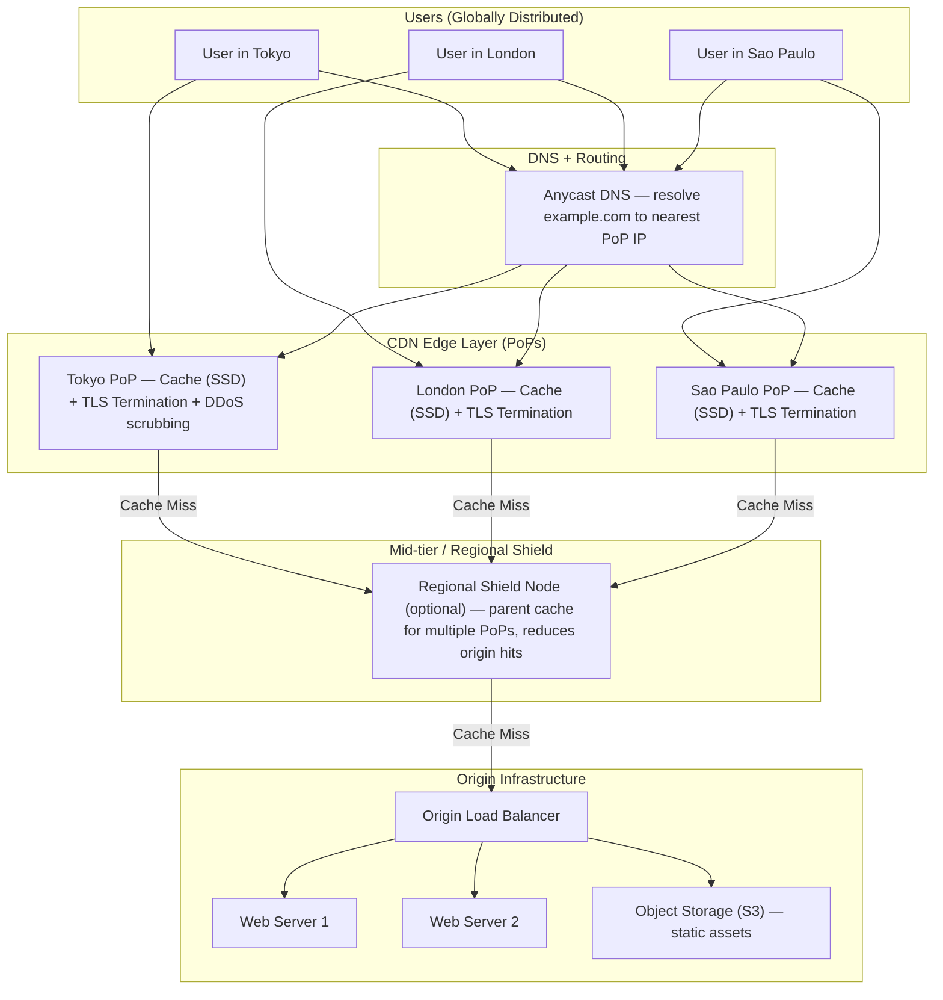
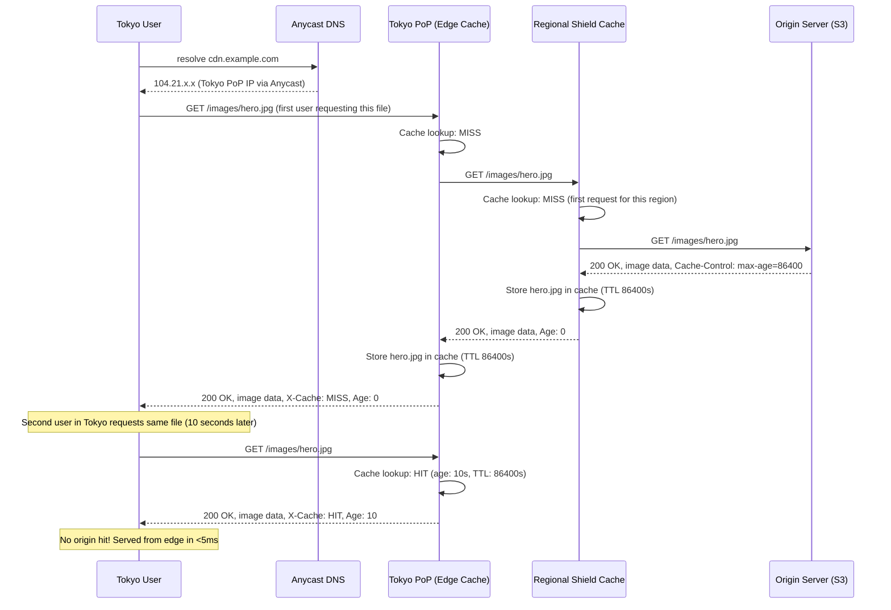
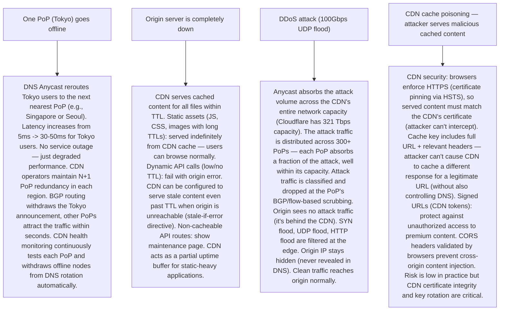

# Pattern 28 — CDN Design (like Cloudflare, Akamai)

---

## ELI5 — What Is This?

> Imagine a popular pizza chain based in New York. If someone in Tokyo
> orders pizza, the pizza travels 10,000 km — it arrives cold and takes hours.
> So the chain opens local pizza kitchens in Tokyo, Sydney, London, and Mumbai.
> Now everyone gets hot, fresh pizza quickly because there's a kitchen near them.
> A CDN (Content Delivery Network) works the same way:
> instead of every user fetching your website from a single server in New York,
> the files are pre-copied to servers around the world (called "edge nodes").
> Users in Tokyo get files from the Tokyo edge node — fast and close.

---

## Glossary (Every Keyword Explained in ELI5)

| Word | ELI5 Meaning |
|---|---|
| **CDN (Content Delivery Network)** | A global network of servers that store copies of your static content (images, CSS, JS, videos) close to end users to reduce latency. |
| **Edge Node / PoP (Point of Presence)** | A CDN server in a geographic location. Cloudflare has 300+ PoPs. When you request a file, it comes from the nearest PoP. |
| **Origin Server** | Your actual server that has the original files. The CDN is a caching proxy in front of it. The origin is the "pizza headquarters" — edge nodes are the local kitchens. |
| **Cache Hit** | When the edge node already has the requested file stored locally. Served instantly, origin not contacted. |
| **Cache Miss** | When the edge node doesn't have the file. It fetches it from the origin (or a parent CDN node), stores it, then serves it. Only the first request per edge node is slow. |
| **TTL (Time to Live)** | How long a file is kept at the edge before it's considered stale and must be re-fetched. `Cache-Control: max-age=86400` = 24-hour TTL. |
| **Cache Invalidation** | Forcing the CDN to delete a cached file before its TTL expires. Used when you update a file. AKA "cache purge." |
| **Cache-Control Header** | HTTP header that tells CDNs and browsers how long to cache a response and under what conditions. |
| **TLS Termination** | The CDN handles HTTPS encryption/decryption at the edge. The connection between CDN and origin can be HTTP or a separate TLS session. This reduces origin CPU burden. |
| **Anycast** | A routing technique where the same IP address is announced from multiple geographic locations. The internet routes a user's request to the nearest PoP automatically. Used by Cloudflare for all their IP addresses. |
| **Stale-While-Revalidate** | Serve the stale (expired) cached file immediately while fetching a fresh one from origin in the background. Zero additional latency for the user. |

---

## Component Diagram

---

## Step-by-Step Request Flow

---

## Bottlenecks — Every Point Explained

| # | Bottleneck | Why It Hurts | Fix |
|---|---|---|---|
| 1 | **Cache miss storm (thundering herd) on cold start** | A new piece of content (viral video, Flash sale announcement) suddenly gets millions of requests. All of them are cache misses simultaneously → all requests hit the origin. Origin overwhelmed. This is "cache stampede." | Request coalescing (request collapsing): when 1000 users all request the same uncached URL simultaneously, the edge node sends only ONE request to the origin, holds the other 999 requests in queue, and when the origin responds, serves all 1000 from the single response. Eliminates thundering herd at the CDN edge. Additionally: Shield nodes reduce origin hits — even on a global cold start, each region sends only 1 request per uncached object. |
| 2 | **Cache invalidation is hard to do instantly globally** | You deploy a new version of app.js. The old version is cached at 300+ PoPs with a 24-hour TTL. Some users get the new HTML (which references new_app.js), but the CDN still serves old_app.js — broken app. | Cache-busting via content hash in filename: `app.abc123.js` (hash changes with content). The HTML references the new hash filename. Old `app.abc123.js` TTL expires naturally (no rush). New `app.def456.js` is fetched fresh. No invalidation needed for versioned assets. For non-versioned assets (like `index.html`): use short TTL (5-60s) or use CDN's instant purge API. Cloudflare's Cache-Tag Purge can purge by tag across all PoPs in < 150ms. |
| 3 | **Dynamic content cannot be cached (personalized pages)** | A user's account page `/user/dashboard` has their name, balance, recent orders. Caching it would show User A's data to User B. Dynamic content = 0% cache hit rate. CDN only helps for static files. | Architectural split: serve HTML shell (cached, generic) from CDN. Dynamic data (user-specific JSON) fetched from the API server after the HTML loads (XHR/fetch). The static HTML shell has a 60-second TTL (the template, not the data). API responses behind auth headers bypass CDN caching (CDN sees `Authorization` header → doesn't cache). CDN delivers the static shell in 10ms; API call for user data takes 100ms — acceptable hybrid. |
| 4 | **Hotspot URL — a single extremely popular file overwhelms one PoP** | One Tokyo PoP serves `hero.jpg` to 100K requests/second. Even with caching, 100K concurrent cache reads require substantial edge server resources (network bandwidth, CPU for TLS). The single PoP reaches bandwidth limits. | Traffic splitting across multiple edge nodes: CDN operators run multiple servers per PoP (behind a local load balancer). Anycast routes to the PoP; the PoP's local router distributes across servers. Cloudflare's PoPs run fleets of servers, not single machines. For extreme cases (Super Bowl live stream): pre-distribute the same content to all PoPs in advance (CDN push) rather than waiting for on-demand cache fill. |
| 5 | **TLS certificate management at 300+ PoPs** | Each PoP needs a valid TLS certificate for your domain. Maintaining, renewing, and deploying certificates to 300+ PoPs is complex. A single expired certificate = security error for users in that region. | Wildcard certificates + automated management: CDN providers handle TLS automatically. Cloudflare Universal SSL provisions certificates at their edge automatically. Let's Encrypt certificates renewed automatically (90-day certs, auto-renewed at 60 days). Customers only need to point their DNS to the CDN CNAME; CDN handles all certificate lifecycle. For custom certificates: CDN supports BYOC (Bring Your Own Certificate) — upload private key to CDN, it handles distribution. |
| 6 | **Stale content — long TTLs trade freshness for performance** | `Cache-Control: max-age=31536000` (1 year TTL on `logo.png`). If you update the logo, it won't appear for users until the TTL expires (1 year). Image change is invisible to most users. | High TTL for versioned assets + instant purge for non-versioned: (1) Files with content-hash in name: 1-year TTL (can't go stale by definition — filename changes with content). (2) `index.html`: 60-second TTL (re-checked every minute, small window of staleness). (3) API responses for critical data: `Cache-Control: no-cache, must-revalidate` (always re-validate, but use If-None-Match to avoid downloading unchanged content). (4) Emergency change: CDN Purge API call instantly invalidates the specific URL at all PoPs. |

---

## What Happens When Each Part Fails?

---

## Key Numbers to Know

| Metric | Value |
|---|---|
| Cloudflare PoP count | 300+ cities |
| Cloudflare network capacity | 321 Tbps |
| CDN cache hit ratio (typical) | 80-95% for static-heavy sites |
| Edge node RTT to user (global average) | < 20 ms |
| Origin server RTT (without CDN) | 50-500 ms globally |
| Akamai PoP count | 4,000+ city-level servers |
| TLS handshake overhead | ~50-100ms (first connection) |
| TLS session resume overhead | ~1ms (0-RTT resumption) |
| Cache-Control max-age for versioned assets | 31,536,000 seconds (1 year) |
| Cache-Control for index.html | 0-60 seconds |

---

## How All Components Work Together (The Full Story)

A CDN is a globally distributed reverse proxy that operates between users and your origin. Its primary function is caching, but modern CDNs also provide DDoS protection, TLS termination, Web Application Firewall (WAF), and even edge compute (run JavaScript at the edge node, not the origin).

**Request routing via Anycast:**
Cloudflare advertises the same IP range (e.g., 104.21.0.0/16) from all 300+ PoPs simultaneously via BGP. When a user's DNS resolver looks up `cdn.example.com`, it returns an Anycast IP. The user's ISP routes packets toward the nearest Anycast announcement — naturally routing to the closest Cloudflare PoP. No geographic DNS routing required — network topology does the work.

**Cache lifecycle:**
1. First request: cache miss → fetch from origin (or shield) → store in edge cache with TTL from `Cache-Control` header → serve.
2. Subsequent requests: cache hit → serve from edge memory/SSD in < 5ms.
3. TTL expires: `stale-while-revalidate`: serve stale immediately, fetch fresh in background. `must-revalidate`: refetch before serving. `no-cache`: always revalidate with conditional GET (If-None-Match).
4. Content update: deploy new file at new URL (hash-busting) OR call CDN purge API.

**Three-tier architecture (optional):**
Some CDN deployments add a "Shield" or "Origin Shield" tier: a small number of regional parent caches (e.g., one in North America, one in Europe, one in Asia). When any of the PoPs in a region have a cache miss, they first check the regional Shield before hitting the origin. This reduces origin requests dramatically — instead of 300 PoPs each making separate origin requests on a cache miss, only 3 Shield nodes make origin requests. The origin sees 100x fewer requests.

**CDN for dynamic content (Edge Functions):**
Modern CDNs (Cloudflare Workers, Fastly Compute@Edge) allow running custom JavaScript/WASM at the PoP. Example: an A/B test that assigns users to variants can run at the edge (10ms latency) instead of the origin (200ms latency). Edge key-value stores (Cloudflare Workers KV) allow storing configuration and personalization data at each PoP — enabling dynamic responses without hitting the origin.

> **ELI5 Summary:** Anycast is like a pizza chain's phone number that automatically connects you to the nearest branch. The edge cache is the pizza sitting ready-made in the local kitchen — most orders are served immediately. The Shield is the regional prep kitchen that makes sure each local branch has stock. The origin is the central headquarters that creates new recipes. Most requests never reach headquarters.

---

## Key Trade-offs

| Decision | Option A | Option B | Why |
|---|---|---|---|
| **Long TTL vs short TTL** | Long TTL (1 year): maximum cache hit rate, zero origin load, fast delivery | Short TTL (60 seconds): fresh content guaranteed, but high origin load | **Content-type-based TTL strategy**: versioned assets (hash in filename) = 1-year TTL. Dynamic-but-cacheable (category page) = 60s TTL + stale-while-revalidate. HTML files = 0-60s TTL. Auth'd API responses = no-cache. There is no single right answer — match TTL to how often the content actually changes. |
| **Pull CDN (on-demand cache fill) vs Push CDN (pre-populate)** | Pull: origin serves first miss, CDN caches automatically. Simple. | Push: upload all files to CDN in advance. Control. No cold start. | **Pull for dynamic/unpredictable content** (blog posts, product images). **Push for known large-scale content** (software releases, game patches, live stream video segments pre-staged). Most sites use pull; large media distribution pipelines use push. |
| **Single CDN vs multi-CDN** | Single CDN vendor (simpler, one bill, one integration) | Multi-CDN (two vendors, route to best-performing for each user) | **Multi-CDN for mission-critical** (finance, streaming): if one CDN has a regional outage, traffic is automatically routed to the other. Cost: 2x CDN management complexity. DNS-based steering (Route53 health checks) routes to the healthy CDN. At standard scale: single CDN is sufficient. |
| **CDN caching API responses** | Cache JSON API responses with short TTL (improves API latency) | Only cache static assets; all API calls hit origin | **Cache API responses selectively**: public, non-user-specific endpoints (product catalog, homepage data) → 30-60s TTL at CDN edge. Massive reduction in origin API load. Authenticated API calls (have Authorization header): CDN typically will not cache by default (correct behavior). Varies header: `Vary: Accept-Encoding` tells CDN to cache separate versions for gzip vs non-gzip. |

---

## Important Cross Questions

**Q1. What is cache key normalization and why does it matter?**
> The cache key determines whether two requests are considered the same (and share the same cached response). By default, the full URL including query string is the cache key: `/image.jpg?v=1&source=email` and `/image.jpg?v=1&source=social` would be two different cache entries for the same image. If query parameters don't actually affect the content, this causes cache fragmentation (same file cached hundreds of times with different keys → low hit rate). Normalization: CDN removes tracking parameters from the cache key before lookup (e.g., strip UTM params: `?utm_source`, `?fbclid`). Amazon CloudFront supports custom cache key policies. This can 10x your cache hit ratio for pages with tracking parameters in URLs.

**Q2. How does a CDN handle streaming video (HLS/DASH)?**
> Video is delivered as a playlist of small segments (2-10 second `.ts` or `.m4s` files). The playlist file (`.m3u8`/`.mpd`) is a short TTL cached file that changes as new live segments are added. Each video segment is an immutable file with a unique URL → perfect for CDN caching (1-year TTL). Player: downloads playlist → requests listed segments → CDN serves segments from edge cache (cache miss only for the latest live segment). CDN for VOD (pre-recorded): all segments are already in S3 before the user watches → 100% cache hit. CDN for Live: CDN fetches newest segment from origin every 2-6 seconds, caches it immediately. 1000 concurrent viewers = 1 origin request per 2-6 seconds, not 1000.

**Q3. How do you implement geo-restriction with a CDN?**
> CDN-level geo-blocking: at each PoP, the CDN knows the user's country from their IP address (GeoIP database). A configuration rule: "block all requests from [sanctioned country list] with 403". Cloudflare supports this natively. For content licensing (streaming: show only available in USA): same mechanism — return 403 from the CDN edge for non-USA IPs. The origin never sees the blocked request. Important caveat: VPNs can bypass geo-restriction (user's IP appears as a US IP). For premium content: combine geo-IP at CDN with signed tokens that encode the user's actual region at authentication time (token is valid for USA-origin sessions only regardless of CDN edge IP).

**Q4. How does a CDN protect against a DDoS attack at layer 7 (HTTP)?**
> Layer 7 DDoS (HTTP Flood): attacker sends millions of valid-looking HTTP GET requests to exhaust origin application resources. CDN defense: (1) Rate limiting at edge: if a single IP sends >100 requests/second, block it at the PoP. The origin never sees these requests. (2) Challenge page: suspicious IPs receive a JavaScript challenge (browser must execute JS) or CAPTCHA. Legitimate browsers solve it; bots fail. (3) Bot fingerprinting: analyze TLS handshake patterns, HTTP/2 connection behavior, header ordering — automated bots look different from real browsers. (4) Global threat intelligence: Cloudflare tracks malicious IPs across all their customers — an IP that attacked one customer is preemptively blocked for others. (5) Cache amplification defense: serve cached responses for known-good requests — no origin work at all, even under attack.

**Q5. How do you design CDN for single-page application (SPA) deployment?**
> SPA deployment pattern: `index.html` is served with short TTL (60s or `no-cache`); all other assets (JS/CSS bundles) are served with 1-year TTL (content-hash in filename). Deploy process: (1) Upload new JS/CSS bundles (new hash filenames) to S3/CDN push — they coexist with old files. (2) Upload new `index.html` (references new bundle filenames). (3) Immediately purge `index.html` from CDN cache (short TTL means purge is optional but speeds up rollout). (4) Users who already loaded the old SPA continue using old bundles (still cached at their browser) — they don't get broken. Users who next request `index.html` get the new version pointing to new bundles. Zero-downtime SPA release. Old bundles stay on CDN for the duration of their TTL (24-48 hours) in case of rollback.

**Q6. What is the difference between a CDN and a Reverse Proxy?**
> A reverse proxy is a server that forwards requests to backend servers on behalf of clients, providing load balancing, SSL termination, and request routing. A CDN is a geographically distributed reverse proxy with caching as its core feature. The distinction: (1) A single-location Nginx reverse proxy is not a CDN (no geographic distribution, no edge caching). (2) Cloudflare is both a reverse proxy AND a CDN — it routes to your origin while caching at 300+ PoPs. (3) A CDN without custom routing logic is just a large distributed cache in front of your origin. Modern lines have blurred: Cloudflare Workers makes the CDN programmable (custom routing, A/B testing, auth checking) — making it a full-featured global reverse proxy, not just a cache.

---

## Real-World Apps That Use This Pattern

| Company | Product | How They Use It |
|---|---|---|
| **Cloudflare** | CDN + DDoS + Edge Compute | 321 Tbps network capacity, 300+ PoPs, 35M+ websites. Cloudflare Workers runs JavaScript at the edge (100M+ daily edge function invocations). Protects ~20% of all web requests today. Anycast-based routing. Free tier for small sites; enterprise tier with custom contracts. DDoS mitigation: mitigated the largest recorded DDoS attack (3.8 Tbps in 2024) without impact. |
| **Akamai** | Enterprise CDN + Security | 330,000+ servers in 4,000+ locations. The oldest CDN (founded 1998). 15-30% of all web traffic passes through Akamai. Key differentiator: deeper ISP-level PoPs (within ISP networks, not just data centers) — even lower latency. Heavy use by financial institutions, government, media (Disney+, Sony). Custom routing logic via Akamai EdgeWorkers. Handles major media streaming events (Super Bowl, March Madness). |
| **Netflix** | Open Connect CDN | Netflix built a private CDN: Open Connect Appliances (OCA). ISPs host these appliances for free in their data centers; Netflix pre-loads popular content. ~95% of Netflix traffic served from ISP-embedded appliances. Remaining 5% served from Netflix CDN in commercial data centers. Result: virtually zero transit cost for Netflix, lower latency for users (content served from within the user's ISP). Partner ISPs benefit from reduced transit bandwidth costs. |
| **Amazon CloudFront** | AWS CDN Service | Integrated with S3, API Gateway, Lambda@Edge. S3 + CloudFront is the canonical static website hosting pattern. CloudFront Functions run JavaScript at edge (URL redirects, header manipulation). Lambda@Edge runs Node.js/Python at edge for complex logic. 450+ PoPs. Origin Shield reduces origin load by 60-80%. Signed URLs/cookies for premium content authentication. 75% of AWS customers use CloudFront for their applications. |
| **GitHub Pages / Vercel / Netlify** | JAMStack CDN | These platforms commoditize CDN for frontend developers. Deploy a static site → automatically distributed to global CDN edge nodes → HTTPS enabled automatically → instant rollback. Vercel Edge Network serves Next.js SSR results from CDN edge (ISR: Incremental Static Regeneration caches server-rendered pages at CDN). CDN is the deployment target, not an add-on. Democratizes global low-latency delivery for any developer. |
