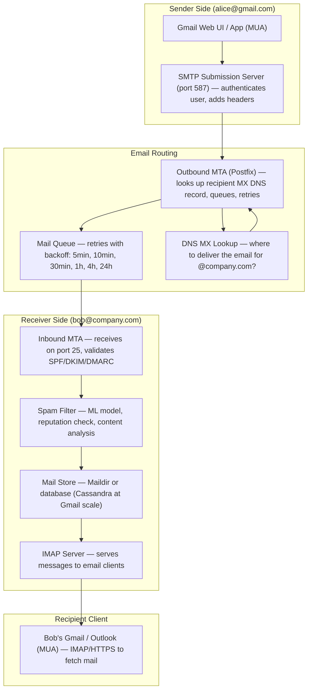
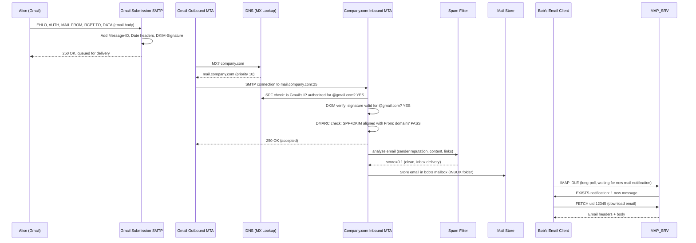
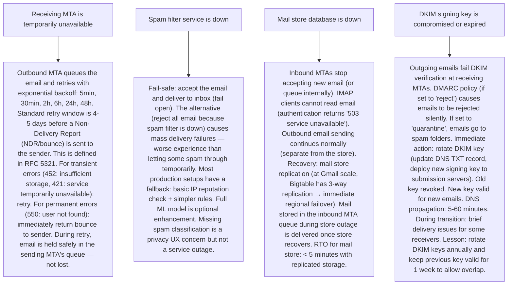

# Pattern 29 — Email System (like Gmail)

---

## ELI5 — What Is This?

> Sending an email is like sending a letter through the postal system.
> You write a letter (your email), put it in an envelope with a "To" address,
> and drop it at the post office (your Outbox).
> The postal service figures out which mail carrier handles the destination city,
> passes the letter to them, and they deliver it to the recipient's mailbox.
> The recipient can pick it up whenever they want (IMAP lets you read it from
> any device, like checking a shared mailbox).
> All of this happens automatically in seconds, not days.

---

## Glossary (Every Keyword Explained in ELI5)

| Word | ELI5 Meaning |
|---|---|
| **MTA (Mail Transfer Agent)** | The software that routes emails between mail servers. The "postal system" for email. Sends mail from your server to others. Examples: Postfix, Sendmail, Exim. |
| **SMTP (Simple Mail Transfer Protocol)** | The protocol for sending email. Port 25 (server-to-server), Port 587 (client-to-server submission), Port 465 (SMTPS/TLS). |
| **IMAP (Internet Message Access Protocol)** | Protocol for reading email. Keeps email on the server (sync to multiple devices). Port 993 (TLS). Gmail uses IMAP. |
| **POP3 (Post Office Protocol)** | Older protocol for reading email. Downloads email to one device and deletes from server. Port 995. |
| **MUA (Mail User Agent)** | The email client: Gmail, Outlook, Apple Mail, Thunderbird. What the user sees. |
| **Mail Queue** | A buffer on the sending MTA. If the recipient's server is temporarily unavailable, the email waits in the queue and the MTA retries sending with exponential backoff. |
| **SPF (Sender Policy Framework)** | A DNS record listing which servers are allowed to send email for your domain. Prevents spoofing: "only send.example.com can send email from @example.com". |
| **DKIM (DomainKeys Identified Mail)** | Cryptographic signature in email headers. Recipient's server verifies the signature using a public key in your DNS. Proves email was sent by your server and not modified in transit. |
| **DMARC (Domain-based Message Authentication)** | Policy that combines SPF + DKIM and tells receiving servers what to do on failure: quarantine (spam folder) or reject (bounce). Alignment requirement: From: domain must match DKIM/SPF domain. |
| **Spam Filter** | Software at the receiving server that analyzes email for spam signals: keyword patterns, sender reputation, link analysis, ML models. Decides if email goes to inbox or spam folder. |
| **Bounce** | An email that could not be delivered. Hard bounce: permanent failure (address doesn't exist). Soft bounce: temporary failure (inbox full). |

---

## Component Diagram

---

## Step-by-Step Request Flow

---

## Bottlenecks — Every Point Explained

| # | Bottleneck | Why It Hurts | Fix |
|---|---|---|---|
| 1 | **Sending millions of marketing emails quickly** | A company sends an email blast to 10M subscribers. Naive: send one email per second = 115 days. Even 100 emails/second = 27 hours. The sending MTA is the bottleneck. | Multiple parallel sending queues + multiple sending IPs: run 100+ sending workers, each maintaining a connection pool to the receiving server. Use 100 different sending IP addresses (IP warm-up: start at 1K/day per IP, ramp to 1M/day over weeks). ESPs (Email Service Providers: Sendgrid, Mailgun, SES) do this at scale as a service. Segment your list: send in batches of 100K at a time, prioritize most engaged users. |
| 2 | **IP reputation and deliverability — emails going to spam** | A new IP address has no sending reputation. Gmail/Yahoo/Microsoft will throttle or spam-folder emails from unknown IPs. If your IP is on a blocklist (someone previously used it for spam), your emails won't be delivered. | IP warmup + monitoring: (1) Start sending small volumes from new IPs (100/day), increase gradually over 4-6 weeks. (2) Monitor bounce rates (< 2%), spam complaint rates (< 0.1%), unsubscribe rates. (3) Implement SPF, DKIM, DMARC — these are table stakes for inbox delivery. (4) Use dedicated IPs for transactional emails (password resets, receipts) vs marketing emails — never let marketing spam contaminate transactional IP reputation. |
| 3 | **Mailbox storage at scale** | Gmail: 1.8 billion users × average 5 GB mailbox = 9 exabytes (9,000 PB) of email storage. Standard IMAP servers (Dovecot) store email as files on disk — doesn't scale beyond a single server per user. | Distributed storage: Google uses Colossus (GFS successor) for email storage. Each email is a blob stored in a distributed file system with replication. Metadata (message IDs, folder structure, unread counts, labels) stored in Bigtable (highly scalable key-value store sorted by `user_id + timestamp`). The IMAP protocol layer queries Bigtable for metadata and Colossus for message bodies. |
| 4 | **Inbound spam filtering at Gmail scale** | 300 billion emails sent daily in the world; ~85% are spam. Gmail processes 300B emails × 85% spam = 255B spam emails to classify per day. Simple rule-based filters can't keep up with sophisticated modern spam. | ML-based spam classification: TensorFlow models trained on billions of labeled spam/ham examples. Features: sender IP reputation, link analysis (VirusTotal lookup), text content patterns, user-level feedback (spam reports), sending patterns (did sender recently change volume?). Model runs at ingestion time, adds probability score, routes to inbox/spam/reject. Continuous retraining as new spam patterns emerge. Gmail claims > 99.9% spam accuracy. |
| 5 | **Email threading — showing conversation view** | "Reply to re: Question about project" is a new email. To group it with the original thread, the server must find the original email. With 15B emails/day entering Gmail, matching threads requires fast lookups. | Thread ID via headers: SMTP standard `In-Reply-To` and `References` headers contain message IDs of previous emails in thread. Gmail stores a thread_id per message. On receiving a reply: extract `In-Reply-To`, look up existing thread_id for that message_id in Bigtable > O(1) lookup. All messages sharing a thread_id are displayed as a conversation. If `In-Reply-To` is missing (user replied manually): fallback to subject line matching + time window as an approximation. |
| 6 | **Large attachment delivery** | User attaches a 50 MB video to an email. SMTP has a standard limit (typically 25-50 MB). Emails with large attachments cause MTA timeouts and delivery failures. The 50 MB attachment is stored in every email it's sent to (Reply All × 50 people = 50 copies of the attachment). | Link-based delivery: Gmail stores large attachments in Google Drive, embeds a drive link in the email body. The recipient downloads from Drive (CDN-backed), not from the email itself. Storage cost: 1 copy in Drive vs N copies in N recipients' mailboxes. Google Workspace uses this for >25MB attachments. Alternative: S3 pre-signed URL in email links. Reduces SMTP payload to metadata+link, keeping email size under limits. |

---

## What Happens When Each Part Fails?

---

## Key Numbers to Know

| Metric | Value |
|---|---|
| Global emails sent per day | 330 billion |
| Percentage that is spam | ~85% |
| Gmail users | 1.8 billion |
| Gmail spam accuracy | > 99.9% |
| SMTP retry window (standard) | 4-5 days |
| Maximum recommended email size (SMTP) | 25-50 MB |
| DKIM key recommended rotation | Every 6-12 months |
| Gmail IMAP connections at peak | Hundreds of millions |
| Email open rate (marketing) | 20-25% (industry average) |

---

## How All Components Work Together (The Full Story)

Email is one of the oldest internet protocols, yet it remains the most resilient communication system ever built. Understanding email delivery requires understanding both the protocol layer (SMTP/IMAP) and the infrastructure layer (MTAs, spam filters, mail stores).

**Sending pipeline:**
The user writes an email in their **MUA** (Gmail web, Outlook). The MUA connects to the **Submission Server** (port 587, with authentication). The submission server adds mandatory headers (Message-ID, Date, DKIM signature) and passes the email to the **Outbound MTA**. The MTA performs an MX DNS lookup for the recipient's domain — this returns the hostname(s) of the receiving server(s). The MTA opens an SMTP connection to the receiving server and transfers the email.

**Receiving pipeline:**
The **Inbound MTA** receives the email, runs authentication checks (SPF, DKIM, DMARC), and passes it to the **Spam Filter**. The spam filter computes a risk score using ML, sender reputation, and content analysis. The email is delivered to the appropriate **Mailbox** folder (INBOX or Spam). The **IMAP Server** manages folder state per user and notifies connected email clients (using IMAP IDLE / push notifications) of new messages.

**The key design principle — store-and-forward:**
Email is fundamentally asynchronous. Unlike instant messaging, the sender's MTA doesn't need the receiver to be online. The email is queued at the sending MTA, which retries delivery over days if necessary. Only after the receiver's MTA confirms acceptance (`250 OK`) does the sending MTA consider delivery complete. This retry-with-persistence model makes email incredibly reliable despite the internet's unreliability.

> **ELI5 Summary:** You write the email (compose), click send (SMTP submission), your email server figures out where to deliver it (MX DNS lookup, like looking up a postal address), delivers it to the recipient's mailbox (SMTP delivery), and the recipient's email app fetches it whenever they open their email (IMAP). If the recipient's server is busy, your server just waits and tries again later — like a patient mail carrier who keeps attempting delivery for 5 days before giving up.

---

## Key Trade-offs

| Decision | Option A | Option B | Why |
|---|---|---|---|
| **Dedicated IP vs shared IP for sending** | Dedicated IP: your reputation is yours alone. If you're clean, delivery is good. | Shared IP: reputation is shared across all senders on the IP. Good if you're a small sender (benefit from others' reputation). | **Dedicated for high-volume senders** (>100K/day): you need full control of reputation. Shared for low-volume (< 10K/day): not enough volume to build your own reputation, cheaper to share. ESPs (Sendgrid, SES) handle IP management — dedicated IPs are an optional paid feature. |
| **Synchronous spam filtering (pre-delivery) vs async (post-delivery)** | Filter before storing: email only enters mailbox if it passes. Slower delivery, lower storage. | Accept all, filter asynchronously, move spam post-facto. Faster acceptance. | **Synchronous at the important boundary** (inbound MTA classification: inbox vs spam) + **async for deep content analysis** (link scanning, attachment AV). Fast initial classification (ML model in 50ms) gives inbox/spam routing. Deeper analysis (link detonation sandbox) happens in background and may move email to spam after initial delivery. |
| **Per-user email storage limit vs unlimited** | Per-user quota (original Gmail 1GB, now 15GB free): limit storage cost, charge for more | "Unlimited" storage (some enterprise email providers) | **Quota is practical even for large providers**: unlimited storage leads to unbounded cost. Gmail's 15GB free tier is 15GB shared across Gmail + Drive + Photos — drives upgrades to paid tiers. Quota enforced at inbound MTA (452 Insufficient Storage when user is over quota → soft bounce). |
| **Pull email (IMAP) vs Push (GCM/APNS notifications + fetch)** | Pure IMAP pull: client polls for new messages every N minutes. Battery-unfriendly on mobile. | Push: server sends notification (via GCM/APN), client fetches email on notification. Battery-friendly. | **Push for mobile, IMAP IDLE for desktop**: Gmail mobile uses Firebase Cloud Messaging to push notifications with message metadata. App fetches full email only when user opens it. Gmail desktop web uses long-polling (IMAP IDLE equivalent over HTTPS). Not pure IMAP for mobile in 2024 — too battery-expensive to maintain persistent TCP connections. |

---

## Important Cross Questions

**Q1. Explain SPF, DKIM, and DMARC and why all three are needed.**
> SPF (Sender Policy Framework): DNS TXT record for your domain listing authorized sending IPs. Receiving server checks: "is the sending IP in the SPF record for gmail.com?" Limitation: SPF only validates the `Mail From:` SMTP envelope address, not the visible `From:` header. DKIM (DomainKeys Identified Mail): sending server adds a cryptographic signature header. Receiving server retrieves your public key from DNS and verifies the signature. Proves: (1) the email was sent by a server controlling your private key, (2) the email wasn't modified in transit. Limitation: DKIM doesn't prevent using a different `From:` domain. DMARC: ties it together. Requires that the `From:` header domain matches the (SPF or DKIM) domain. Specifies action on failure: `p=none` (report only), `p=quarantine` (spam folder), `p=reject` (bounce). `rua=` tag receives aggregate reports from receiving servers. Together: SPF proves IP authorization, DKIM proves server identity + integrity, DMARC ensures From: header alignment and specifies handling. All three needed because each alone has exploitable gaps.

**Q2. How does Gmail achieve high deliverability for billions of transactional emails?**
> Google sends transactional emails (Gmail notification emails to other providers) with: (1) Google's IP reputation built over 20 years — the best in the industry. Yahoo/Microsoft/Hotmail trust Google IPs implicitly. (2) Perfect DKIM signing and DMARC `p=reject` policy — emails can't be spoofed. (3) Low complaint rates: transactional emails from accounts.google.com have near-zero spam complaints. (4) Sender reputation feedback loops: Google participates in ARF (Abuse Reporting Format) with other providers — spam complaints are reported and monitored. (5) High-volume certified senders program (Hotmail, Yahoo have whitelist programs for high-reputation senders). For businesses sending marketing email: the challenge is building this reputation from scratch — ESPs like SES/Sendgrid provide infrastructure but reputation is built per-domain per-IP gradually.

**Q3. How does Gmail's conversation threading work if someone changes the subject line?**
> Gmail uses a fallback hierarchy: (1) `In-Reply-To` header present and references a known Gmail thread_id → use that thread. (2) `References` header contains a known Message-ID → find that thread. (3) Neither header → try subject-line matching: strip `Re:`, `Fwd:`, leading whitespace, compare to recent emails within a lookback window (14 days). If match found → join that thread. (4) No match → create new thread. Changing the subject line breaks (3) — a reply with changed subject starts a new thread (by Gmail design: users intentionally change subjects to start new conversations from existing threads). This is a UX decision, not a bug. Outlook uses slightly different threading rules, which is why cross-client threads sometimes appear split.

**Q4. How do you implement email unsubscribe at scale for a mailing list of 10M users?**
> Three components: (1) One-click unsubscribe (RFC 8058): add `List-Unsubscribe-Post: List-Unsubscribe=One-Click` header + `List-Unsubscribe: <https://example.com/unsub?token=abc>` header. Gmail/Yahoo show an "Unsubscribe" button in their UI that posts to your endpoint — unsubscribes with one click. Required for bulk senders since 2024 (Google/Yahoo policy). (2) Secure token: `token = HMAC(secret, user_id + email + list_id)` — prevents unsubscribing others (broken link exploitation). (3) Suppress list: add user_id to `email_suppressions(user_id, list_id, unsubscribed_at)` table. Before every send, batch-check against suppression list. Sending to an unsubscribed user → spam complaint → deliverability damage. At 10M users: use a Bloom Filter in Redis for O(1) suppression check before DB validation.

**Q5. What is a "mail loop" and how do you prevent it?**
> A mail loop: Server A auto-forwards email to Server B. Server B auto-forwards to Server A. Email bounces infinitely between them. Prevention: (1) `Received:` headers — each MTA adds a `Received:` header. Any MTA receiving an email with more than 25 `Received:` headers returns a 550 error (loop detected). This is the RFC-defined loop prevention. (2) Forwarding server adds `Return-Path: <>` for vacation/auto-replies — prevents auto-replies to auto-replies (null MAIL FROM). (3) Auto-reply/vacation message limitation: most servers track if they've already sent an auto-reply to this sender in the last 7 days (Redis cache: `auto_replied:fromaddr:toaddr → timestamp`) and skip if so. (4) SMTP servers explicitly reject when their own hostname appears in the Received chain.

**Q6. How does Google Archive email at petabyte scale?**
> Google Workspace Vault (enterprise): long-term email archiving for compliance (HIPAA, FINRA, GDPR). Architecture: (1) Email enters Gmail's normal flow and is stored in Bigtable. (2) Simultaneously, a copy is replicated to Vault's immutable archive (GCS/Colossus) with tamper-evident logging. (3) Legal holds: `LEGAL_HOLD` flag on message prevents deletion even past retention policy. (4) Retention policies (configurable per org): automatically delete email older than N years (or mark as eligible for deletion). Deletion job runs monthly. (5) eDiscovery: full-text search across archived email for legal discovery — uses the same Bigtable + search infrastructure as Gmail, with additional audit logging of who ran which searches. Bigtable stores immutable versioned records (each modification stored as a new version, not overwritten).

---

## Real-World Apps That Use This Pattern

| Company | Product | How They Use It |
|---|---|---|
| **Google** | Gmail | 1.8B users, 330B emails/day. Bigtable for mailbox metadata, Colossus for message bodies. Custom Postfix-based MTA at Google scale. TensorFlow spam classification running on every inbound email globally. The most reliable large-scale email system in the world. Average Gmail reliability SLA: 99.9% uptime. |
| **Microsoft** | Outlook/Exchange Online (365) | 400M+ business email users. Exchange Online uses Microsoft Defender for Office 365 for anti-spam/phishing (ML-based, similar to Gmail). Teams integration: email is increasingly integrated with Teams for chat-first workflows. Outlook Web App shares infrastructure with the same Exchange backend exposed via IMAP for third-party clients. |
| **Twilio SendGrid** | Transactional Email ESP | 80,000+ customers, 100B+ emails/month. Infrastructure: large pool of dedicated sending IPs with IP warmup management, automatic bounce/unsubscribe handling, event webhooks. Key metric: deliverability rate > 99%. DKIM signing, DMARC alignment, ISP feedback loops managed by SendGrid. Customers focus on email content; SendGrid handles the delivery infrastructure. |
| **Mailchimp** | Marketing Email Platform | 13M users, 300B emails/year. Manages segmentation, A/B testing, send time optimization. Infrastructure: similar to SendGrid for the delivery layer, with added CRM and template-based composition layer. Acquired by Intuit in 2021. Key feature: "inbox preview" — test how email renders in 100+ email clients before sending. |
| **Proton Mail** | End-to-End Encrypted Email | 70M+ accounts. Zero-knowledge email: Proton cannot read user emails (encrypted with user's public key). Key challenge: spam filtering on encrypted emails is impossible (can't analyze content). Solution: basic IP reputation + header analysis only. User-side spam filtering using ML only on the client (after decryption). Compatibility with regular email (external emails are not E2E encrypted). Shows that strong privacy constraints force architectural trade-offs in security features like server-side spam ML. |
