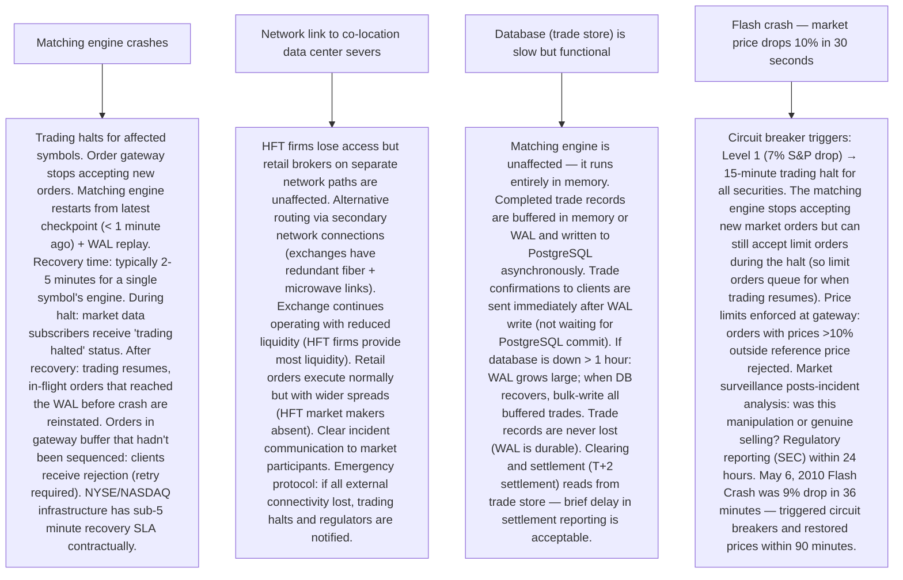

# Pattern 30 — Stock Exchange System (like NYSE, Robinhood)

---

## ELI5 — What Is This?

> Imagine an auction for baseball cards. Sellers say "I'll sell my Babe Ruth card
> for at least $100." Buyers say "I'll pay up to $95 for a Babe Ruth card."
> No deal yet. But then a buyer says "$100" — match! The card changes hands.
> A stock exchange is exactly this: thousands of buyers and sellers simultaneously
> announcing prices, with a computer in the middle matching them instantly
> (millions of times per second). The matches happen so fast that prices
> change every millisecond. The entire system must be 100% fair, 100% accurate,
> and handle any failure without losing a single transaction.

---

## Glossary (Every Keyword Explained in ELI5)

| Word | ELI5 Meaning |
|---|---|
| **Order Book** | A sorted list of all outstanding buy orders ("bids") and sell orders ("asks") for a given stock. Bids sorted highest first, asks sorted lowest first. The book is "live" — it changes with every new order and every match. |
| **Bid** | The highest price a buyer is willing to pay. "Bid: $149.90 × 500 shares" means someone wants to buy 500 shares at up to $149.90. |
| **Ask (Offer)** | The lowest price a seller will accept. "Ask: $150.00 × 200 shares" means someone will sell 200 shares for at least $150.00. |
| **Spread** | The gap between best bid and best ask. Bid $149.90, Ask $150.00 → spread = $0.10. Tight spread = liquid market. Wide spread = illiquid market. |
| **Matching Engine** | The core system that finds bid/ask pairs where price crosses, executes trades, and updates the order book. The fastest component in the exchange. |
| **Market Order** | "Buy 100 shares of AAPL immediately at whatever price is available." Executes instantly against existing asks. No price guarantee. |
| **Limit Order** | "Buy 100 shares of AAPL but only if price is ≤ $149.50." May not execute immediately if no matching seller exists. Goes into the order book to wait. |
| **Trade** | A completed match: buyer and seller have agreed on price and quantity. Final, immutable. |
| **Market Data Feed** | Real-time stream of order book changes and trades broadcast to all market participants. Level 1: best bid/ask only. Level 2: full order book depth. |
| **Circuit Breaker** | An automatic trading halt triggered when price moves too fast (> 5-10% in a short window). Pauses trading to prevent panic-driven crashes. NYSE Level 1 circuit breaker: 7% drop in S&P 500 → 15-minute halt. |
| **Co-location** | Placing trading firm servers in the same data center as the exchange's matching engine, connected by fiber or microwave — literally feet away. Reduces round-trip latency to < 1 microsecond. Essential for high-frequency trading. |

---

## Component Diagram

```mermaid
graph TB
    subgraph TRADERS["Traders / Brokers"]
        HFT["HFT Firm (co-located server)"]
        BROKER["Retail Broker (Robinhood, Schwab) — API gateway to exchange"]
        INST["Institutional (Goldman Sachs) — FIX protocol connection"]
    end

    subgraph GATEWAY["Order Gateway"]
        OG["Order Gateway — validates orders, assigns sequence number, forwards to matching engine"]
        SEQ["Sequencer — assigns monotonically increasing sequence number to every order (total ordering)"]
    end

    subgraph CORE["Matching Engine (Heart of Exchange)"]
        ME["Matching Engine — in-memory order book per symbol, price-time priority matching, deterministic"]
        OB["Order Book (In-Memory) — bids: sorted desc by price, asks: sorted asc by price"]
    end

    subgraph PERSIST["Persistence & Audit"]
        WAL["Write-Ahead Log — every order and trade appended before in-memory update"]
        TSTORE["Trade Store — PostgreSQL for completed trade records (immutable)"]
    end

    subgraph MARKET_DATA["Market Data"]
        MD["Market Data Publisher — broadcasts order book changes + trades via multicast UDP"]
        TICKER["Ticker Plant — aggregates and normalizes market data from all symbols"]
    end

    subgraph RISK["Risk & Compliance"]
        RISK["Pre-trade Risk Check — position limits, buying power, margin requirements"]
        SURV["Market Surveillance — detects wash trading, layering, spoofing patterns"]
    end

    HFT & BROKER & INST --> OG
    OG --> RISK
    RISK --> SEQ
    SEQ --> ME
    ME --> OB
    ME --> WAL & TSTORE
    ME --> MD
    MD --> TICKER
    TICKER --> HFT & BROKER & INST
```

---

## Step-by-Step Request Flow

```mermaid
sequenceDiagram
    participant Trader as Trader (buy 100 AAPL @ market)
    participant GW as Order Gateway
    participant Risk as Risk Engine
    participant Seq as Sequencer
    participant ME as Matching Engine
    participant WAL as WAL (disk)
    participant MD as Market Data Feed

    Trader->>GW: NEW_ORDER {symbol:AAPL, side:BUY, qty:100, type:MARKET}
    GW->>GW: Validate order format, check session authentication
    GW->>Risk: pre-trade risk check (buying power, position limit)
    Risk-->>GW: APPROVED
    GW->>Seq: assign sequence number
    Seq-->>GW: seq=98521

    GW->>ME: AAPL BUY MARKET 100 seq=98521

    Note over ME: Look at best ask: 150.00 × 200 (seller has 200 shares at $150.00)

    ME->>WAL: append trade {buy_order=98521, sell_order=87432, price=150.00, qty=100, ts=now}
    WAL-->>ME: fsync complete (durable)

    ME->>ME: Execute: 100 shares traded at $150.00
    ME->>ME: Update order book: ask 150.00 reduced from 200 to 100 shares

    ME->>MD: publish TRADE {AAPL, 150.00, 100, ts=now}
    ME->>MD: publish BOOK_UPDATE {AAPL, ask 150.00 qty:100}
    MD-->>Trader: TRADE CONFIRMATION {filled 100 @ 150.00}

    Note over MD: Broadcast to ALL market participants simultaneously (multicast)
    MD-->>MD: Level 1 feed: best bid/ask updated; Level 2 feed: full book update
```

---

## Bottlenecks — Every Point Explained

| # | Bottleneck | Why It Hurts | Fix |
|---|---|---|---|
| 1 | **Matching engine single-threaded (by design)** | The matching engine cannot be parallelized for a single symbol. Matching must be deterministic and FIFO-ordered — concurrent writes create race conditions on the order book. A single thread at 1 GHz doing millions of operations per second. | Per-symbol parallelism: run a dedicated in-memory matching engine per symbol (AAPL has its own engine, GOOGL has its own). The 10,000 listed symbols are distributed across servers. Each symbol's engine is single-threaded (correct), but the system is parallel across symbols. Message queue per symbol ensures orders arrive in sequence ID order. |
| 2 | **Latency must be microseconds, not milliseconds** | High-frequency traders exploit any latency edge. If your matching engine takes 500µs and a competitor's takes 100µs, HFT firms route orders to the faster exchange. Exchange reputation depends on latency. | Kernel bypass networking (DPDK/RDMA): bypass the Linux kernel's TCP/IP stack (which adds 10-50µs). Use DPDK (Data Plane Development Kit) to handle packets directly in user space. Use InfiniBand or RDMA for sub-microsecond message passing at co-location facilities. In-memory order book with no DB writes in the critical path (WAL write is async or on a separate fast NVMe drive). Lock-free data structures for the order book. |
| 3 | **Market data fan-out — one trade → millions of updates** | A single trade execution must notify millions of subscribers (market data terminals, trading algorithms, news services). Unicast (one TCP connection per subscriber) = millions of packets per trade. Impossible. | Multicast UDP: one UDP packet addressed to a multicast group is copied by network hardware to all subscribers simultaneously. No O(N) fan-out at the application layer — network infrastructure handles distribution. UDP, not TCP: UDP is fire-and-forget. Subscribers requesting missed packets must replay from a gap-filler service (retransmission on request). This is how real exchange data feeds work (NYSE's Pillar, NASDAQ's ITCH). |
| 4 | **Order book recovery after crash** | If the matching engine crashes, the in-memory order book is lost. Rebuilding from the WAL (replay all orders) takes too long. During recovery, trading is halted. | Checkpoint + WAL replay: every N minutes (e.g., every 1 minute), take a snapshot of the entire order book state to fast storage. On crash recovery: load snapshot (last 1 minute of state) → replay only the WAL entries from the snapshot timestamp to now. Recovery time: seconds (loading snapshot) + seconds (replaying last 1 minute of WAL) instead of hours (replaying all day's orders). |
| 5 | **Fairness — price-time priority must hold** | If two limit orders for the same price arrive nearly simultaneously, the earlier one must execute first. At microsecond timing, "earlier" is hard to determine across multiple servers. Any deviation = fairness lawsuit. | Hardware timestamping + central sequencer: the **sequencer** assigns monotonically increasing sequence numbers to every incoming order before it reaches the matching engine. Order arrival to the sequencer determines priority. Since the sequencer is single-threaded, the order is total and deterministic. The sequencer is typically the exchange's proprietary single point of truth for order ordering — the only truly unavoidable single point of failure (mitigated by hardware HA clusters). |
| 6 | **Quote stuffing by malicious HFT — overwhelming order flow** | A malicious actor floods the exchange gateway with 1 million orders per second, all immediately cancelled. Legitimate orders are delayed in the gateway queue. Market becomes unusable. | Order throttling + minimum resting time: gateway rate-limits per trading session (max 10K orders/second per connection). Minimum resting time before cancellation (SEC rule proposed, not universal). Order-to-trade ratio limits: if a firm's order cancellation rate > 99%, throttle their connection. Market surveillance systems detect abnormal order patterns and flag for regulatory review. |

---

## What Happens When Each Part Fails?



---

## Key Numbers to Know

| Metric | Value |
|---|---|
| NYSE average daily trades | ~5 billion messages |
| Matching engine latency (NASDAQ) | ~60-100 microseconds (µs) |
| HFT co-location round-trip latency | < 1 microsecond |
| NYSE listed symbols | ~2,800 |
| Market data feed rate (NASDAQ ITCH) | 1-2 GB/second |
| WAL write requirement | Sub-microsecond fsync (NVMe) |
| Circuit breaker L1 threshold (US) | 7% S&P 500 drop |
| Settlement cycle (US equities) | T+1 (since May 2024) |
| PFOF (Payment for Order Flow) | Robinhood routes to Citadel Securities for execution |

---

## How All Components Work Together (The Full Story)

A stock exchange is perhaps the most latency-sensitive, correctness-critical system in software engineering. Every microsecond matters. Every trade must be recorded. Every order must be processed in exact sequence. There is zero tolerance for data loss or incorrect matching.

**The critical design insight — in-memory + WAL:**
The matching engine never reads from a database during order processing. The entire order book fits in memory (a few hundred MB per symbol — a few thousand open orders at any time). This means sub-millisecond matching with no I/O in the critical path. Durability is provided by writing every order and trade to a WAL (Write-Ahead Log) on fast NVMe storage before acknowledging receipt. If the engine crashes, replay the WAL to rebuild state — exactly like database crash recovery.

**Price-time priority (FIFO at each price level):**
Orders at the same price execute in the order they were received. The matching engine uses sorted containers: for bids, a max-heap or sorted map keyed by price (then timestamp as tiebreaker). For a market buy order: match against the lowest ask first, exhausting that price level before moving to the next. For a limit buy at $150: only execute if asks at ≤ $150 exist.

**Market data as a separate concern:**
Every book change and trade is published to the Market Data Feed. This is a separate process from matching — decoupled via a lock-free ring buffer. The matching engine writes to the ring buffer; the market data publisher reads from it and broadcasts via multicast UDP. This decoupling ensures market data publishing never slows down the matching engine.

**Clearing and settlement (the back office):**
After a trade executes, the exchange sends trade details to the clearing house (DTCC in the US). The clearing house nets out each firm's obligations (firm A owes 1000 AAPL shares, firm B is owed 1000 AAPL shares → direct transfer). Settlement (actual money and share transfer) happens on T+1 (trade date + 1 business day). The exchange's matching and clearing systems must be auditable for regulatory compliance.

> **ELI5 Summary:** The matching engine is a super-fast auctioneer keeping a book of "I want to buy at price X" and "I want to sell at price Y." When a buy price meets or exceeds a sell price, boom — deal done in microseconds, written to a permanent record. The sequencer is the auctioneer's ticket machine ensuring everyone's order gets a fair number in line. WAL is the auctioneer's notebook (written to paper immediately) so nothing is forgotten even if they faint mid-auction. Market data is the loudspeaker announcing every deal to the whole room simultaneously.

---

## Key Trade-offs

| Decision | Option A | Option B | Why |
|---|---|---|---|
| **Single matching engine thread vs multi-thread** | Single thread per symbol: correct, deterministic, no race conditions | Multi-threaded for parallelism, locks for correctness | **Single thread per symbol**: the economics are clear. Correctness is non-negotiable (wrong trades = lawsuits). A single-threaded engine running at 1-3 GHz processes millions of orders per second per symbol — this is sufficient. Multi-threading adds lock overhead and non-determinism. Scale-out is across symbols, not within a symbol. |
| **Disk-backed WAL vs network-replicated state** | WAL to local NVMe (fast, but single node) | Synchronous replication to a standby (HA, but adds network latency) | **Both**: local NVMe WAL for durability (sub-microsecond) + async replication to standby for HA. Synchronous replication to standby before acknowledging a trade adds 10-100µs (network round-trip) — unacceptable for a 60µs target. Exchanges use: fast local commit for performance + async standby for failover, accepting < 1 second data loss on catastrophic failure. |
| **Market order vs fill-or-kill** | Allow market orders (execute at whatever price is available) | Fill-or-kill: specify price; if can't fill immediately at that price, cancel | **Both order types exist** for different use cases. Market orders provide guaranteed execution but no price certainty. Fill-or-kill provides price certainty but may not execute. Retail investors often use market orders for small quantities. Institutional traders use limit orders + FOK/IOC for large orders where price certainty matters more than speed. Exchange must support all standard order types. |
| **Public exchange vs dark pool** | Public exchange: all orders and trades visible in real-time (price discovery, transparency) | Dark pool: orders are hidden, only matched internally (large block trades without moving the market) | **Both exist for different purposes**: public exchanges for price discovery (everyone can see quotes). Dark pools for large institutional trades (buying 1M shares publicly would move the price against you). Dark pools are regulated but not publicly visible pre-trade. SEC requires post-trade reporting within 10 seconds. Robinhood routes retail orders through Citadel's dark pool (PFOF) — this is legal in the US but controversial. |

---

## Important Cross Questions

**Q1. How does price-time priority work in the matching engine?**
> When two limit orders at the same price exist, the older order executes first (time priority). Data structure: price levels are a sorted map (price → queue of orders). Each price level has a FIFO queue of orders at that price. To match a market buy: pop orders from the cheapest ask level (lowest price queue) in FIFO order. When that level is exhausted, move to the next price level. Example: two sell orders both at $150.00 — one placed at 09:30:01.123456 and one at 09:30:01.234567. The first executes first regardless of which was processed faster by the gateway (time priority is by sequencer timestamp, not gateway arrival). This FIFO + price priority is price-time priority (PTP), the universal standard.

**Q2. What is "flickering" in the order book and why is it a reliability problem?**
> Flickering: an order is placed, immediately cancelled, placed again — causing the order book to appear to have more liquidity than actually exists. When a real buyer tries to hit the ask price, the order has already been cancelled. From the perspective of the real buyer: they see $150.00 × 10,000 shares available, submit a buy order, and receive a partial fill or no fill (the HFT firm cancelled before matching). This is called "phantom liquidity." Detection: market surveillance tracks order lifetime — orders cancelled in < 100µs are flagged as potentially manipulative "spoofing" (illegal). SEC enforces spoofing regulations under Dodd-Frank. Minimum resting time requirements (proposed but not universally adopted) would prevent sub-millisecond cancel patterns.

**Q3. How do you design the order gateway to handle 1 million orders per second?**
> Horizontal scaling with per-symbol affinity: multiple order gateway servers, with orders routed to a specific server based on symbol (consistent hashing by symbol). This ensures all AAPL orders go to the same gateway server, which then forwards to the AAPL matching engine sequencer. Within each gateway server: DPDK for kernel-bypass networking (raw packet processing), lock-free ring buffers for message passing, pre-allocated memory pools (no malloc overhead). Session management: each trading session (per-firm connection) is authenticated once at connection establishment (FIX session). Orders then reference the session ID. No per-order authentication overhead. Target: < 1µs gateway processing time per order at co-location.

**Q4. How does Robinhood interface with an exchange? What is Payment for Order Flow (PFOF)?**
> Robinhood is a broker-dealer, not an exchange. User orders: (1) App sends order to Robinhood's servers. (2) Robinhood doesn't send orders directly to NYSE/NASDAQ — it routes them to wholesale market makers (Citadel Securities, Virtu Financial). (3) Market makers execute the order from their own inventory or route to an exchange, typically offering a small price improvement (better than NBBO). (4) Market makers pay Robinhood a "payment for order flow" fee ($0.001-0.0026 per share) — revenue for Robinhood, which enables "commission-free" trading. Concern: market makers see retail order flow before routing to exchanges, creating a small informational advantage. SEC has proposed banning PFOF; UK already bans it. Alternative: Robinhood routes orders directly to exchanges (no PFOF) — less revenue but potentially better execution.

**Q5. What makes a stock exchange's system design fundamentally different from a standard CRUD application?**
> Five fundamental differences: (1) **Latency**: microseconds, not milliseconds. CRUD database: 1-10ms per operation. Exchange: 60µs end-to-end. Requires hardware-level optimization. (2) **Correctness over availability**: a CRUD app might show stale data temporarily (eventual consistency acceptable). An exchange: incorrect matching = legal liability. Availability is secondary to correctness. (3) **Total ordering**: all operations must be globally sequenced. CRUD: concurrent rows can be updated independently. Exchange: every order must have a global sequence number for auditability and fairness. (4) **Zero-copy, lock-free hot path**: CPU cache efficiency matters. A std::map lookup (100ns) vs array access (1ns) matters at microsecond targets. (5) **Regulatory auditability**: every order and trade must be reportable to regulators within 10 seconds. Immutable audit trail is a legal requirement, not a feature.

**Q6. How do you implement a "circuit breaker" at the exchange level?**
> Three levels (US market rules): Level 1: S&P 500 drops 7% → 15-minute trading halt for all securities. Level 2: 13% drop → 15-minute halt. Level 3: 20% drop → remainder of trading day halted. Implementation: a monitoring service subscribes to the real-time market data feed, computing the running percentage change in the S&P 500 index price vs the previous day's close. When threshold crossed: send HALT command to all matching engines (one per symbol). Matching engines stop accepting market orders, pause processing, send HALT status to market data feed. Gateway rejects new orders with "TRADING_HALTED" error. 15 minutes later: resume command sent, all engines resume, order book is intact (limit orders queued during halt are processed in sequence). This entire halt → resume cycle must complete without any loss of pending limit orders.

---

## Real-World Apps That Use This Pattern

| Company | Product | How They Use It |
|---|---|---|
| **NYSE / ICE** | New York Stock Exchange | NYSE Pillar matching engine (in-memory, microsecond latency). FIX protocol for broker connections. Multicast data feeds (NYSE OpenBook Ultra for depth-of-book). Co-location at NYSE's Mahwah, NJ data center. 2,800 listed companies. ~5 billion messages/day. DTCC for clearing. Physical trading floor exists but most volume is electronic. Uptime requirement: market hours 9:30am-4pm ET — can't be down during market hours. |
| **NASDAQ** | Stock Market + Technology Provider | NASDAQ MatchIt + OUCH protocol. NASDAQ provides their exchange technology (SaaS) to 25+ other global exchanges including Dubai Financial Market, Oslo Børs. Their matching engine handles 25M+ messages/second at peak. NASDAQ's TotalView-ITCH protocol is the industry standard for market data. NASDAQ also runs 3 distinct US equity exchanges (NASDAQ, BX, PSX) with separate order books. |
| **Robinhood** | Retail Trading App | 23M+ funded accounts. Routes orders via PFOF to Citadel/Virtu. March 2020 outage: systems couldn't handle market volatility during COVID crash — multiple-hour outage, $70M+ settlement with FINRA. Post-outage: rebuilt infrastructure for 20x capacity headroom, moved to event-driven microservices, invested heavily in reliability engineering. Shows that exchange-grade reliability requires exchange-grade infrastructure investment. |
| **Coinbase / Binance** | Cryptocurrency Exchange | Crypto exchanges implement the same matching engine + order book architecture. Key difference: 24/7 trading (no market hours), globally accessible (no co-location advantage from geography), settlement is T+0 (instant blockchain settlement vs T+1 for equities). Binance processes 1.4 million transactions/second at peak. Matching engine in C++. Crypto exchanges also have to handle blockchain confirmations as part of deposit/withdrawal flows — a unique layer absent from equity exchanges. |
| **Jane Street / Citadel Securities** | Market Maker (not exchange, but HFT participant)** | These firms co-locate within NYSE/NASDAQ data centers, run proprietary low-latency matching algorithms. Provide liquidity by continuously quoting bid/ask. Revenue: capture spread + PFOF payments from brokers. Technology: FPGA (Field-Programmable Gate Arrays) replacing CPUs for critical path — FPGA latency: 100 nanoseconds vs CPU: 100 microseconds. The arms race in HFT is a hardware+network engineering competition as much as a software one. |
