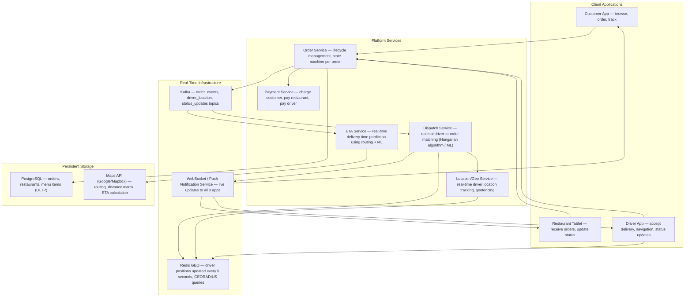
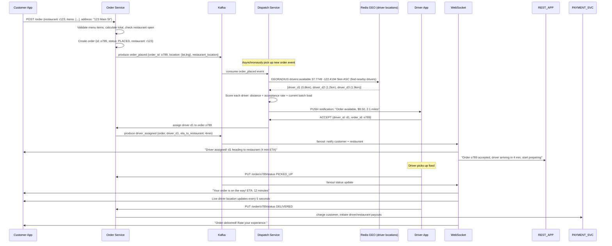
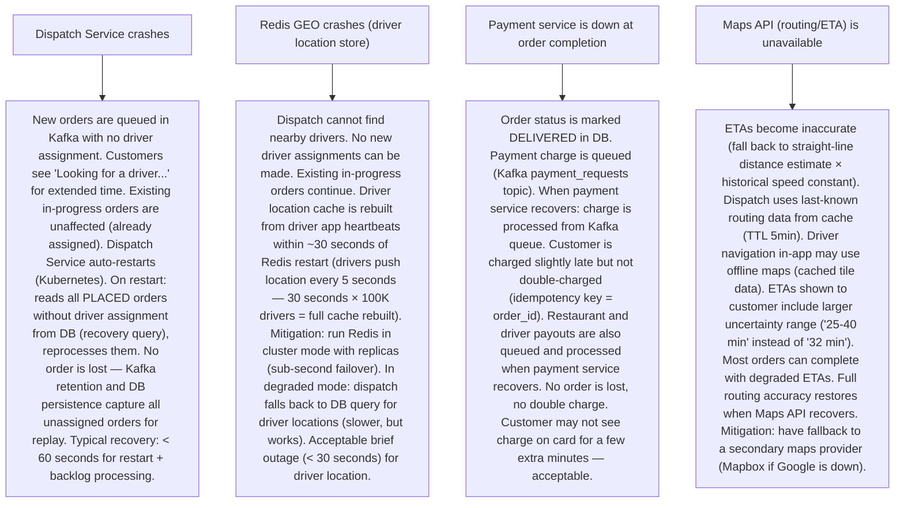

# Pattern 31 — Food Delivery System (like DoorDash, Swiggy)

---

## ELI5 — What Is This?

> Imagine calling your favorite pizza place. But instead of picking it up yourself,
> you want someone to bring it home. Someone takes your order (the app).
> The pizza place (restaurant) makes it. A delivery person picks it up and brings it to you.
> A food delivery app connects all three parties — customer, restaurant, and driver —
> simultaneously. Each second matters: the food gets cold if it waits too long.
> The system must match drivers to restaurants to customers in real time,
> keep everyone updated with live tracking, and handle hundreds of thousands of
> simultaneous orders across a city.

---

## Glossary (Every Keyword Explained in ELI5)

| Word | ELI5 Meaning |
|---|---|
| **Order** | A customer's food request: items, restaurant, delivery address, payment. Has a lifecycle: placed → restaurant accepted → preparing → ready → driver assigned → picked up → delivered. |
| **Restaurant** | The merchant preparing the food. Has a "tablet" (Merchant App) that receives orders and updates the order status. |
| **Driver (Dasher/Delivery Partner)** | The delivery person. Has a Driver App showing available deliveries. Is in one of 3 states: idle (looking for orders), heading to restaurant, heading to customer. |
| **Dispatch Service** | The matching algorithm that assigns a driver to a restaurant order. Must minimize delivery time: which driver is closest? How busy is the restaurant? How far is the customer? |
| **Geofence** | A virtual boundary around a restaurant or delivery zone. If a driver is within the geofence (e.g., 200m of the restaurant), they're considered "arrived" automatically. |
| **ETA (Estimated Time of Arrival)** | The prediction: how long until food arrives. Restaurant ETA (prep time) + driver to restaurant ETA + driver to customer ETA. Changes in real-time as conditions change. |
| **Batch Ordering** | An optimization: one driver picks up orders from multiple nearby restaurants to deliver to multiple nearby customers. Reduces driver idle time and per-delivery cost. |
| **Zone** | A geographic service area. Each zone has a target driver density (supply-demand balance). "Zone surge": when demand > supply in a zone → show higher pay to attract drivers. |
| **Tip** | Customer's optional extra payment to the driver. Shown to drivers before acceptance (affects willingness to take the order). |
| **Cancellation** | Order cancelled by customer, restaurant, or because no driver found. Must handle partial-refund, restaurant compensation, and inventory rollback. |

---

## Component Diagram

---

## Step-by-Step Request Flow

---

## Bottlenecks — Every Point Explained

| # | Bottleneck | Why It Hurts | Fix |
|---|---|---|---|
| 1 | **Driver location updates at scale** | 500K simultaneous active drivers each sending GPS location every 5 seconds = 100K location updates/second. Storing each update in PostgreSQL is too slow. Reading all driver locations for a dispatch query would require scanning 500K rows. | Redis GEO: store driver location in Redis Sorted Set using geohash scoring: `GEOADD drivers:available <lng> <lat> driver_d1`. `GEORADIUS` queries nearby drivers in O(N+log M) where N is results. Redis handles 100K geoadd/second on a single instance. Locations are updated in-memory only — persistent accuracy not required (driver reports new location in 5 seconds anyway). Partition by city/zone for additional scale. |
| 2 | **Dispatch algorithm — matching thousands of drivers to thousands of orders simultaneously** | Naive: for each new order, find the nearest driver. But simple nearest-driver dispatch misses optimization opportunities: driver d1 is slightly farther but will pick up 2 orders in one trip (batching). Driver d2 is closest but heading the wrong direction after pickup. | ML-based global optimization: DoorDash's dispatch uses a variant of the assignment problem (Hungarian algorithm) run every 30 seconds, evaluating all unassigned orders vs all available drivers simultaneously to minimize total delivery time globally, not just per order. For real-time single-order dispatch: heuristic greedy with features: (distance × delivery_time_estimate + historical_acceptance_rate + current_stack_count). |
| 3 | **ETA accuracy degrades in real-world conditions** | A restaurant says food is ready in 20 minutes. Real: 35 minutes. Driver arrives in 8 minutes and waits 27 minutes. Customer ETA shown was 28 minutes; actual was 55 minutes. Poor ETA = customer cancellations, driver dissatisfaction. | ML-based ETA with multiple signals: (1) Restaurant ML model: predict actual prep time based on day/time, current order queue depth, menu items (burgers take longer than salads), historical restaurant performance. (2) Driver routing ETA from Maps API (real-time traffic). (3) Dwell time model: predict how long a driver waits at a restaurant based on restaurant historical patterns. All three models combined → P50 ETA (show conservative ETA to customers, adjust in real-time). |
| 4 | **Peak hour demand-supply imbalance (dinner rush)** | 6-8pm: 10x order volume vs 2pm. # of drivers doesn't scale instantly. Queue of unassigned orders grows. ETAs explode. Customers cancel. | Dynamic driver incentives (surge pricing): when a zone's demand/supply ratio > threshold, automatically increase driver pay (+$2/delivery). Notifies idle drivers in adjacent zones to move in. Shows real-time earnings opportunities on driver app. Customer-side: show longer ETAs or higher delivery fees during peak → some customers delay orders → smooths demand curve. Driver scheduling: use historical data to forecast peak hours and pre-invite drivers with guaranteed earnings ("earn $150 if you're available 6-9pm on Friday"). |
| 5 | **Restaurant order acceptance — restaurants don't respond** | Dispatch sends order to restaurant app. Restaurant is busy, doesn't tap "accept." System waits 3 minutes. Then auto-cancels. Customer is now waiting 5+ minutes for "order accepted." | Auto-confirmation with opt-out: change default behavior. Restaurant order is auto-confirmed after 90 seconds (send notification, restaurant can cancel if unable to fulfill). Most restaurants prefer this (less work than tapping accept). Set restaurant prep time by default based on historical data. If restaurant wants to refuse: tap "too busy" button. This reduces customer wait time for confirmation from minutes to seconds. |
| 6 | **Order state machine consistency** | Order transitions: PLACED → RESTAURANT_ACCEPTED → PREPARING → READY → DRIVER_ASSIGNED → PICKED_UP → DELIVERED. Multiple services update this state (restaurant updates PREPARING, dispatch updates DRIVER_ASSIGNED, driver updates PICKED_UP). Race conditions possible: driver marks DELIVERED before system marks PICKED_UP. | Optimistic state machine in DB: `UPDATE orders SET status='DELIVERED', updated_at=NOW() WHERE id=o789 AND status='PICKED_UP'`. The `AND status='PICKED_UP'` guard prevents invalid transitions. If 0 rows updated: state transition was invalid (retry or raise alert). Kafka events model the state machine: each topic message represents a valid transition. Event consumers only process events that match expected current state (using DB optimistic lock). |

---

## What Happens When Each Part Fails?

---

## Key Numbers to Know

| Metric | Value |
|---|---|
| DoorDash daily orders (2023) | 2+ million |
| Driver GPS update frequency | Every 4-5 seconds |
| Dispatch decision latency target | < 1 second |
| Average driver-to-restaurant ETA (urban) | 5-10 minutes |
| Average restaurant prep time | 15-25 minutes |
| Average delivery radius | 2-5 miles (urban) |
| Order cancellation rate | ~4-8% |
| Driver acceptance rate (industry average) | ~60-70% |
| Peak load vs average load multiplier | 3-5x (dinner rush) |

---

## How All Components Work Together (The Full Story)

A food delivery platform is a real-time logistics system with three parties whose activities must be coordinated with sub-second precision. The key insight: the system is fundamentally event-driven. Everything is a state transition triggered by an actor.

**The three-sided marketplace:**
The customer side is familiar (app → browse → order). The restaurant side is less obvious: restaurants don't "query" the system — they wait for orders to arrive on their tablet, then report preparation status. The driver side is the most dynamic: drivers are mobile, have free choice to accept/reject, and their location must be tracked continuously.

**The dispatch loop:**
Every 30 seconds (or on new order/driver availability change), the Dispatch Service runs an optimization. It reads: (1) all unassigned orders with their restaurant locations and customer locations, (2) all available drivers with their current locations and current workload (from Redis GEO), (3) historical ETAs from the routing service. It computes the optimal assignment minimizing "total minutes until all food is delivered globally." This is a variant of the Vehicle Routing Problem (NP-hard, solved with heuristics or ML).

**Real-time tracking:**
Driver location updates every 5 seconds → Redis GEO update → WebSocket push to customer app (via a pub/sub layer). The customer map shows a smooth-moving driver dot. This is implemented as: driver app → HTTP/WebSocket → Location Service → Redis GEOADD → pub/sub channel → WebSocket server → customer app. The entire pipeline processes in < 200ms.

**Order state machine:**
PLACED → ACCEPTED_BY_RESTAURANT → PREPARING → READY → DRIVER_ASSIGNED → DRIVER_AT_RESTAURANT → PICKED_UP → DRIVER_EN_ROUTE → DELIVERED. Each transition is a Kafka event. Kafka topics are partitioned by order_id — all events for one order go to the same partition, guaranteeing ordering. State machine enforced in DB via conditional updates.

> **ELI5 Summary:** Kafka is the communication center — everything that happens (order placed, driver moved, food ready) is announced on Kafka. Redis is the real-time map showing where every driver is. The Dispatch Service is the smart coordinator deciding which driver gets which order. WebSocket is the walkie-talkie keeping all three parties (customer, restaurant, driver) updated in real-time. PostgreSQL is the official record of everything that happened.

---

## Key Trade-offs

| Decision | Option A | Option B | Why |
|---|---|---|---|
| **Driver location update frequency** | Every 1 second: more accurate tracking, smoother map animation | Every 5-10 seconds: lower battery drain, lower server load | **5 seconds is the sweet spot**: sub-second updates don't improve dispatch quality (a driver moves ~7 meters in 1 second at walking speed). 5-second updates reduce driver app battery drain by 5x and server load by 5x. Customer map uses interpolation for smooth animation between real updates. |
| **Eager dispatch (assign driver before restaurant confirms) vs lazy (after restaurant confirms)** | Eager: assign driver immediately when order placed. Driver may arrive before food is ready (wait time). | Lazy: wait until restaurant marks READY. Driver arrives just in time. Less driver wait time. | **Eager with timing adjustment**: dispatch assigns driver early but delays delivery notification to driver (instructs them to arrive N minutes before estimated ready time). Best of both: driver is pre-committed (no searching for driver when food is ready), but is dispatched with optimal timing. DoorDash calls this "Pre-assignment." |
| **Transitive payment (app handles all money) vs restaurant charges directly** | Platform collects full order amount, pays restaurant (-commission), pays driver (-tip) | Restaurant charges customer directly; platform only charges delivery fee | **Platform collects all**: simplifies customer experience (one transaction), gives platform revenue control (commission model), enables volume-based restaurant promotions. Driver and restaurant trust that platform will pay them reliably. Downside: platform is a money intermediary (regulatory requirements, PCI-DSS compliance for payment data). |
| **Single-order delivery vs batching** | One driver per one order: simplest to route, fastest per-order delivery | One driver picks up multiple orders: more efficient use of drivers, lower per-delivery cost | **Demand-responsive batching**: during high supply (many drivers, few orders), single-order. During high demand (few drivers, many orders), batch with ML to minimize batch-caused delay (< 5 extra minutes for any individual order). Customer shown "Your order may be batched" notice and slightly longer ETA. The economic pressure to batch grows during peak hours. |

---

## Important Cross Questions

**Q1. How do you prevent a driver from marking an order as "delivered" without actually delivering it?**
> Multiple signals: (1) GPS validation: driver app must be within 200m of the customer's delivery address when marking DELIVERED (geofence check). If GPS shows driver 2km away → flag as suspicious, require confirmation. (2) Customer confirmation: optional "tap to confirm delivery" on customer app (not required, but reduces disputes if enabled). (3) Photo confirmation: for "leave at door" deliveries, driver must take a photo (stored in S3, reviewed on dispute). (4) ML fraud detection: model trained on GPS track, timing, order value — anomalous patterns (driver marked delivered immediately after picking up, impossible travel time) are flagged for review. (5) Dispute resolution: customer reports "not delivered" → customer service reviews GPS track + photo → issue refund if confirmed fault. Track driver fraud rate per driver ID; deactivate repeat offenders.

**Q2. How does DoorDash handle a restaurant that suddenly closes? (Orders already placed)**
> State machine + compensation: (1) Restaurant app sends "closed/unable to fulfill" → order transitions to CANCELLED_BY_RESTAURANT. (2) Customer is notified immediately and issued full refund. (3) If driver was already assigned: driver receives cancellation notification and keeps a cancellation fee ($2-3). (4) Payment captured is fully refunded to customer within 3-5 business days (depending on payment processor). (5) Analytics: restaurant closure rate is monitored — restaurants with high cancellation rates are penalized in search ranking or notified by account managers. Prevention: when restaurant marks "low prep capacity", platform automatically temporarily reduces order acceptance bandwidth to prevent acceptance of orders that can't be fulfilled.

**Q3. How do you design the ETA calculation service?**
> Composite ETA = f(restaurant_prep_model, driver_routing_model, dwell_time_model). (1) Restaurant prep model: XGBoost trained on: order items + their typical prep times, restaurant's historical on-time rate for this day/hour, current queue depth (how many other orders being prepared), day of week. Output: P50 and P90 prep time. (2) Driver routing model: Maps API call with real-time traffic for driving distance + estimated travel time. (3) Dwell time: how long driver waits at restaurant (usually 0-5 min). ML model based on restaurant's historical wait times and current queue. (4) ETA presented to customer: P75 estimate (slightly conservative, reduces "later than expected" surprises vs P50). Updated as each component changes. "ETA drift" alert: if ETA changes > 10 minutes, send push notification to customer.

**Q4. How do you handle the "no drivers available in this zone" scenario?**
> Cascading offers: (1) Initial dispatch offers to drivers within 2km radius. (2) If no acceptance in 3 minutes: expand to 5km radius. (3) If still no acceptance: offer higher incentive (+$2) and expand to 10km. (4) Notify customer: "Searching for a driver, this may take a few extra minutes." Offer option to cancel penalty-free if wait > N minutes. (5) Zone surge: if this pattern is sustained (> 15% of orders without driver in 3 min), trigger zone surge incentive for all available drivers in adjacent zones to move in. (6) If no driver found in 15 minutes: auto-cancel with full refund + $5 credit for inconvenience. Restaurant is compensated for prep work (if food was already made). This is a rare edge case in dense urban areas but common in suburbs during off-peak.

**Q5. How is "batching" (one driver, multiple orders) implemented algorithmically?**
> Batching decision at dispatch: instead of a 1-to-1 order-to-driver assignment, the dispatch algorithm considers 2-for-1 and 3-for-1 bundles. Scoring function for a batch: `batch_ETA_for_last_delivery - individual_ETA_for_worst_order < N minutes_threshold` (e.g., N=8 minutes). If batching hurts any customer's ETA by more than 8 minutes, don't batch. The algorithm explores feasible batches: for each unassigned order, check if nearby unassigned orders share a driver route that doesn't significantly delay any delivery. Route optimization: given 3 pickup locations and 3 drop-off locations, find the optimal sequence (minimizes total route time). All routes checked and the best is selected (for small N: try all permutations; for larger N: use nearest-neighbor or OR-Tools). Driver is given a turn-by-turn navigation sequence optimized across all their current deliveries.

**Q6. How does Swiggy/DoorDash handle the payment flow for restaurants?**
> Three-party payment reconciliation: (1) Customer is charged order_total + delivery_fee + service_fee on checkout. (2) Restaurant payment: restaurant earns (order_total - commission_percentage). Commission varies by contract (15-30%). Payout calculated daily, transferred to restaurant bank account weekly or biweekly. (3) Driver payment: base pay per delivery + tip + surge + bonuses. Calculated per delivery, aggregated weekly. Direct deposit. (4) Platform revenue: commission + service_fee + delivery_fee - base_driver_pay = DoorDash's margin (approximately 15-20% of GMV). (5) Payment infrastructure: Stripe Connect for multi-party payments (one charge to customer, automated splits). Payouts require bank account verification (KYC for restaurants and drivers). Tax documents (1099) generated automatically for drivers earning > $600/year. Dispute resolution: chargebacks handled as a separate reconciliation flow against restaurant or platform depending on fault determination.

---

## Real-World Apps That Use This Pattern

| Company | Product | How They Use It |
|---|---|---|
| **DoorDash** | Food Delivery (US market leader) | 37% US market share, 2M+ daily orders, 700K+ active dashers. Dispatch uses ML-based assignment (DashMart model). Real-time location via Redis GEO. Event-driven order management on Kafka. DoorDash Engineering blog describes their tech in detail: Kotlin microservices, gRPC between services, DynamoDB for high-throughput writes, Snowflake for analytics. "Aurora Global Database" for order data across regions. |
| **Swiggy** | Indian Food Delivery | 140K+ restaurant partners, 500K+ delivery partners. Unique challenge: India's road network is complex (narrow lanes, traffic patterns differ from US). Custom routing engine rather than Google Maps for last-mile (Google Maps not always accurate for Indian lanes). Hyperlocal inventory: Swiggy Instamart (10-minute grocery delivery) uses a 5km radius dark store model. Kafka-based real-time order events, Redis for driver tracking, PostgreSQL for order persistence. |
| **Uber Eats** | Food + Grocery Delivery | Leveraged Uber's existing ride-sharing driver network. Same driver can do both rides and food delivery. Batch: driver picks up for 2 restaurants in one trip. Uber's H3 geospatial library (hexagonal grid) for zone management. Real-time pricing and driver incentive system shared with ride-sharing. 700+ cities globally. |
| **Gopuff** | Dark Store Instant Delivery | Different model from restaurant delivery: Gopuff owns and operates fulfillment warehouses (micro-fulfillment centers). No restaurants — they stock their own inventory. Sub-30-minute delivery. System design: warehouse management system (WMS) replaces restaurant communication. Picker picks order from warehouse, driver delivers. Inventory management is critical: restock before items go out of stock. 2,200+ micro-fulfillment centers in US. Predictive inventory restocking using ML on demand patterns. |
| **Meituan** | Chinese Super-App for Delivery | Largest food delivery company globally: 10M+ orders/day. Also delivers groceries, pharmacy items, and handles hotel bookings. Their delivery network is so dense (100K+ drivers in some cities) that 30-min average delivery in Beijing is standard. Three-tier geo-optimization: city → zone → cluster. Custom mapping engine (Baidu Maps + proprietary routing). ML dispatch processes millions of order-driver pairs per second. Uses a fleet of human-ridden ebikes rather than cars in ultra-dense urban markets. |
