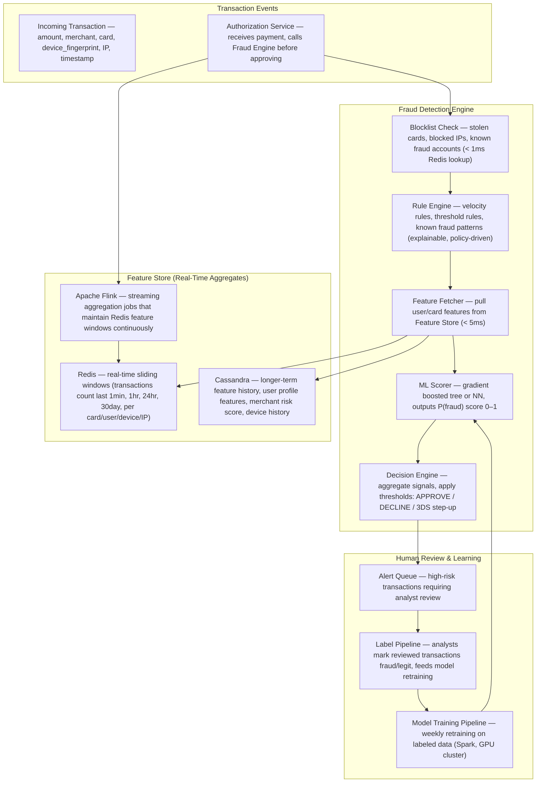
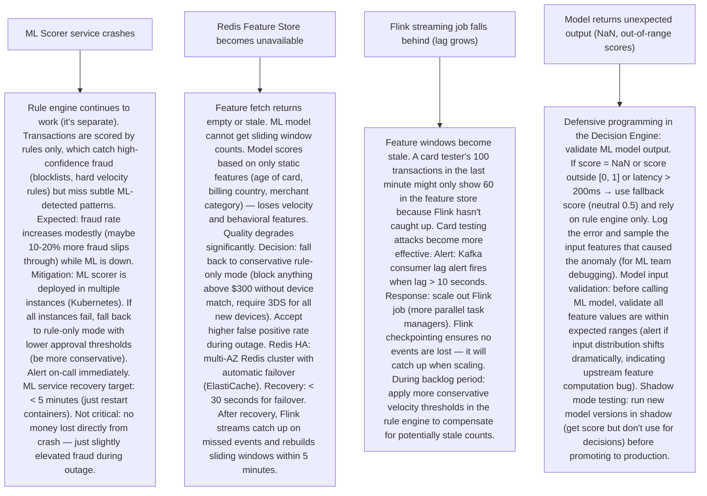

# Pattern 32 — Fraud Detection System (like Stripe, PayPal)

---

## ELI5 — What Is This?

> Imagine you're a bank teller and someone comes in with a check.
> You notice: they've never been to this branch, the check is from a country
> you rarely see, the amount is much larger than their usual deposits,
> and they want cash immediately. Something feels off — you flag it.
> A fraud detection system does this automatically, for millions of transactions
> per second, each scored in milliseconds before the payment is allowed or blocked.
> The core challenge: block fraudsters without annoying legitimate customers
> (false positives = real customers blocked = lost revenue + angry users).

---

## Glossary (Every Keyword Explained in ELI5)

| Word | ELI5 Meaning |
|---|---|
| **False Positive (FP)** | Blocking a legitimate transaction because it "looked suspicious." The worst case: a customer's card is declined at a restaurant for something they legitimately bought. They're embarrassed, they call their bank angrily, maybe they churn. High false positives = customer churn. |
| **False Negative (FN)** | Letting a fraudulent transaction through. The fraud succeeds. The bank/merchant loses money. Low false negatives = less fraud loss. The system must balance both FP and FN. |
| **Feature Engineering** | Building the signals (features) fed to the ML model. Examples: transaction_amount / user's average_30day_spend, new device flag, IP country ≠ billing country, transaction velocity (5 payments in 30 seconds), merchant category code mismatch vs user history. |
| **Rule Engine** | Hard-coded, explainable rules that run first (before ML): "Block any transaction > $50,000", "Block if card is on stolen list", "Block if IP is in a known Tor exit node list." Fast, interpretable, can be updated by policy without ML retraining. |
| **ML Scorer** | A machine learning model (Gradient Boosting / Neural Network) that assigns a fraud probability score (0.0–1.0) to each transaction based on dozens of features. Score > threshold → decline. Score near threshold → step-up authentication (3DS). |
| **Card Testing** | Fraudsters buy stolen card data, then test cards with small transactions (e.g., $1 donation) to see which cards work before using them for large purchases. Detected via velocity checks (many small transactions from one account in short time). |
| **Account Takeover (ATO)** | Fraudster logs into a real user's account (credential stuffing, phishing) and initiates transactions. Detection: new device + new location + password reset recently + large transaction = suspicious. |
| **3DS (3D Secure)** | An additional authentication step for online credit card payments. If the transaction is medium-risk, request 3DS authentication rather than blocking outright. "Step-up" challenge: user gets OTP via SMS. |
| **Chargeback** | A customer disputes a charge with their bank. Bank reverses the transaction. Merchant loses the money. High chargebacks are a major fraud signal. Too many chargebacks → card networks fine the merchant. |
| **Feature Store** | A database of precomputed user/card/device features (aggregates), updated in real-time and batch. Enables the ML model to query "user's 30-day spend average" in < 1 millisecond. |

---

## Component Diagram



---

## Step-by-Step Request Flow

```mermaid
sequenceDiagram
    participant Merchant as Merchant / Payment Gateway
    participant AuthSvc as Authorization Service
    participant Redis as Redis (Blocklist + Feature Store)
    participant Rules as Rule Engine
    participant ML as ML Fraud Scorer
    participant Decision as Decision Engine
    participant Flink as Flink (async feature update)

    Merchant->>AuthSvc: POST /authorize {card: 4111..., amount: 459.00, merchant: "Electronics Co", device_fp: "a8f3", ip: "185.x.x.x"}

    Note over AuthSvc: Total fraud check must complete in < 100ms
    AuthSvc->>Redis: GET blocklist:card:4111... + GET blocklist:ip:185.x.x.x
    Redis-->>AuthSvc: Not on blocklist (3ms)

    AuthSvc->>Redis: MGET features:card:4111...:txn_count_1hr features:card:...:txn_count_24hr features:user:...:avg_spend_30d features:device:a8f3:new_device
    Redis-->>AuthSvc: {txn_count_1hr: 2, txn_count_24hr: 7, avg_spend_30d: 120.00, new_device: true} (5ms)

    AuthSvc->>Rules: Apply rules with features
    Note over Rules: Rule: amount(459) / avg_spend(120) = 3.8x (HIGH RATIO suspicious) → flag=true; New device + amount > 200 → flag; IP country = Romania, billing country = USA → flag; velocity ok (only 2 in last hour)
    Rules-->>AuthSvc: 3 flags raised (risk_score += 0.4)

    AuthSvc->>ML: Score {amount: 459, merchant_category: electronics, ip_geo_mismatch: true, new_device: true, amount_vs_avg_ratio: 3.8, hour_of_day: 3am, txn_count_1hr: 2, ...45 more features}
    ML-->>AuthSvc: P(fraud) = 0.72 (high risk) (30ms)

    AuthSvc->>Decision: aggregate: rule_flags=3, ml_score=0.72
    Note over Decision: Policy: ml_score > 0.7 AND new_device = true → require 3DS step-up. Don't hard-decline (FP protection).
    Decision-->>AuthSvc: ACTION = 3DS_REQUIRED

    AuthSvc-->>Merchant: {status: "challenge_required", acs_url: "...3ds.example.com/challenge"}
    Note over Merchant: Customer sees OTP SMS challenge

    par Async feature update
        AuthSvc->>Flink: transaction event {card, device, user, amount, outcome=challenged}
        Flink->>Redis: UPDATE sliding window counters
    end
```

---

## Bottlenecks — Every Point Explained

| # | Bottleneck | Why It Hurts | Fix |
|---|---|---|---|
| 1 | **Latency: fraud check must be < 100ms inline with payment auth** | A payment authorization must respond to the merchant's POS terminal in < 300ms (card network requirement). The fraud check must fit within that budget. An ML model scoring 100 features takes time. Reading features from DB takes time. | (1) Feature Store in Redis: all sliding window aggregates precomputed and stored in Redis — feature fetch < 5ms instead of querying a database. (2) Model serving: lightweight Gradient Boosting model (ONNX format) loaded in-process — inference < 30ms. (3) Rule engine first: rules can short-circuit before ML (blocklist hit = immediate block, no ML needed). (4) Async feature update: don't wait to update Redis counters in the critical path — produce to Kafka async, Flink updates Redis out of band. |
| 2 | **Feature Store keeping real-time sliding windows accurate** | Fraud velocity rules depend on: "how many transactions in the last 60 minutes for this card?" This must be accurate to the second. A delayed count means a card tester's 50th micro-transaction goes undetected because the counter wasn't updated yet. | Flink streaming job: consumes every transaction event from Kafka, maintains a HyperLogLog (for distinct counts) and count-min sketch (for counts) per card/user/device/IP at multiple time windows (1min, 5min, 1hr, 24hr). These are updated in near-real-time (< 2 second lag). Written to Redis INCR + TTL-windowed keys. Accuracy: exact count for recent window (< 1hr), approximate for longer windows (acceptable trade-off). |
| 3 | **Model drift: fraud patterns change constantly** | Fraudsters adapt. A model trained 3 months ago might now have 20% worse recall because fraud ring tactics have evolved (new device fingerprint spoofing technique, new geographic patterns). Static models degrade quickly. | Continuous monitoring: track model precision/recall daily using ground truth labels (chargebacks + analyst reviews). Alert if recall drops > 2% week-over-week. Rapid retraining pipeline (Spark, weekly): ingest labeled transactions from past month, retrain XGBoost in < 4 hours, champion-challenger A/B test for 24 hours, auto-promote if better. Feature monitoring: track distribution shift in input features (alert if avg transaction amount shifts significantly). |
| 4 | **Label sparsity: fraud is rare (< 0.5% of transactions)** | If you train on raw data, the model sees 1000 legitimate transactions for every 1 fraud. It learns to predict "not fraud" everywhere and is 99.5% accurate but catches 0% of fraud (useless). Class imbalance is the core ML challenge in fraud detection. | (1) Oversampling fraud class: SMOTE (Synthetic Minority Oversampling) in training data, or simple random oversampling of fraud labels. (2) Undersampling non-fraud: randomly drop 90% of non-fraud examples in training data. (3) Cost-sensitive learning: set `class_weight = {fraud: 100, legit: 1}` in XGBoost — model gets 100x more "punishment" for missing a fraud case. (4) Evaluation metric: use F1-score, PR-AUC, or Recall@K (not accuracy) to evaluate model. Target: recall > 90%, precision > 50% at chosen threshold. |
| 5 | **Adversarial attacks: fraudsters probe the system** | Fraudsters submit test transactions to learn the detection threshold. "I sent $99: approved. $199: approved. $499: declined. So the threshold is around $200." Once they know the threshold, they split transactions: 5× $190 instead of 1× $950. | (1) Randomize thresholds slightly: add uniform noise ±0.05 to the decision threshold so the boundary is fuzzy. (2) Never reveal decline reason: return generic "transaction declined" — don't say "amount too high" or "IP flagged". (3) Velocity on velocity: detect threshold-probing behavior (many declined + approved transactions in a short period at incrementing amounts from same card/device). (4) Device fingerprint rotation detection: if device changes fingerprint between transactions, flag as suspicious. |
| 6 | **False positives damage customer trust** | Customer making a large legitimate purchase (holiday trip, new laptop) gets blocked. They call customer service. Cost: ~$20-30 per call. If 1% of legitimate transactions are blocked and Stripe processes 1M transactions/hour, that's 10,000 blocked customers per hour. | (1) Step-up authentication instead of hard decline for medium-risk: ask the user to verify via OTP instead of just declining. Converts many potential false positives to verified transactions. (2) Contextual awareness: "this customer has made 3 international purchases before — lower risk for new international purchase." Build user travel profile. (3) Easy dispute resolution: clear UX for customers to mark as "it was me" — this feeds positive labels back to the model. (4) Threshold tuning: separate thresholds per merchant category, per user risk tier, per geography. A high-end electronics site has different FP tolerance than a $5 coffee purchase. |

---

## What Happens When Each Part Fails?



---

## Key Numbers to Know

| Metric | Value |
|---|---|
| Fraud rate globally (card-not-present) | ~0.5% of transactions |
| Target P(fraud) score latency | < 50ms |
| Total payment authorization latency budget | < 300ms |
| Stripe processes | ~1 million transactions per day per million merchants |
| False positive rate target | < 0.1% for established cards |
| Model retraining frequency | Weekly (or triggered by drift alert) |
| Historical chargeback dispute window | 60-120 days (labels arrive late) |
| Feature store sliding windows maintained | 1min, 5min, 1hr, 24hr, 7day, 30day |

---

## How All Components Work Together (The Full Story)

A fraud detection system sits between the customer and the payment. Every transaction must be "sentenced" within milliseconds — approve, decline, or challenge. The system does this by collecting evidence (features), applying rules, and consulting an ML judge (the model).

**The decision pipeline:**
Each transaction enters a pipeline: (1) blocklist check (instant — is this card or IP already on a known bad list?), (2) feature enrichment (what does our history know about this card, device, user?), (3) rule evaluation (do any hard rules trigger?), (4) ML scoring (what does the model think overall?), (5) decision aggregation (combine rule signals + ML score → approve / decline / challenge).

**The learning loop:**
Fraud systems are not static. They must continuously learn: (1) Online signals: transactions that result in chargebacks or analyst "fraud" labels are immediately fed back. (2) Batch retraining: weekly model retraining on fresh labeled data. (3) Feature drift monitoring: if the distribution of incoming features shifts (suddenly more transactions from a new geography), models may perform poorly — catch this before fraud spikes.

**The feature store is the heart:**
What separates a good fraud system from a basic one is the richness of its features. Simple systems check: does this transaction exceed $1000? Good systems check: this card's transaction count has doubled in the last 60 minutes compared to its 30-day average, the device used has been seen on 8 different accounts this week, the IP is in a country never previously used by this merchant, and it's 3am local time. All of these signals come from the Feature Store — precomputed, updated in real-time by Flink, served from Redis.

> **ELI5 Summary:** The rule engine is the security guard checking your ID at the door. The ML model is the experienced detective who sees patterns the guard would miss. The Feature Store is the detective's memory — everything they've observed about this person in the past. Redis is how the detective recalls that memory instantly. Kafka is the log of everything that ever happened, ensuring no transaction is forgotten when updating the detective's memory.

---

## Key Trade-offs

| Decision | Option A | Option B | Why |
|---|---|---|---|
| **Synchronous inline scoring vs async post-authorization scoring** | Sync: score transaction BEFORE approving. Block fraud upfront. Adds latency to authorization. | Async: approve all transactions instantly, detect fraud after the fact, initiate reversal. No added latency. | **Synchronous for card-not-present (online payments)**: reversals are expensive, rare for fraudsters to return money. Sync adds < 100ms — acceptable trade-off. **Async for physical POS**: card-present fraud rate is much lower (chip+PIN), customers are standing at register (sub-second approval required). Async fraud scoring used to detect patterns over days (card testing across many merchants). |
| **Single threshold vs dynamic thresholds** | Single: one P(fraud) ≥ 0.7 threshold for all transactions. Simple to manage. | Dynamic: different thresholds per merchant category, user tier, transaction amount, time of day. Complex but optimal. | **Dynamic thresholds**: a $5 coffee shop charge has different fraud risk than a $2,000 electronics purchase. A long-standing customer with 3 years of clean history gets a higher approval tolerance. Dynamic thresholds reduce FP rate significantly with same overall recall. Implementation: threshold lookup table per (merchant_category × user_risk_tier) matrix. Updated regularly by risk analysts. |
| **Explainable models (trees) vs black-box models (neural nets)** | Trees (XGBoost): fast inference, feature importance, regulators can demand explanation ("why was this blocked?"). | Neural nets: potentially higher accuracy, captures complex feature interactions, but hard to explain. | **XGBoost as primary, NN as auxiliary**: primary decision scored by XGBoost (explainable, regulators can audit). NN used in parallel as second opinion (if NN says very high risk and XGBoost says low risk → flag for human review). In regulated markets (EU PSD2), the system must explain every declined transaction — XGBoost SHAP values provide per-transaction feature attribution. |

---

## Important Cross Questions

**Q1. How do you handle the "too much fraud" vs "too many false positives" threshold tension?**
> This is the core business problem. The trade-off is quantifiable: false positive cost = (blocked transactions × average transaction value × abandonment rate × LTV loss). False negative cost = (successful fraudulent transactions × average fraud amount × chargeback rate). Build a cost matrix with these values. Plot the ROC curve for your ML model. Choose the operating threshold that minimizes total expected cost (not just maximizes recall or accuracy). Different business lines have different costs: for a premium business card, a blocked legitimate transaction is extremely expensive (FP cost is high) → set a permissive threshold. For a prepaid card with high fraud exposure → set a strict threshold.

**Q2. How do you detect account takeover (ATO) vs stolen card fraud?**
> They require different signals. Stolen card: someone else uses your card number. Signals: card-not-present, IP doesn't match previous geography, unusual merchant, unusual amount. Can be detected per-transaction. Account takeover: someone logs into YOUR account and uses your card. Signals: password change in last 24 hours, new device/browser fingerprint, new login location, sessions from multiple geographically distant IPs in short time window. Requires session-level signals (not just transaction-level). Detection: combine login event stream with transaction event stream in Flink. If a login from a new device in Romania is followed within 30 minutes by a $500 transaction, that correlated sequence is a strong ATO signal. Step-up: force re-authentication + notify account holder via email/SMS.

**Q3. Explain how a Feature Store is built for real-time fraud detection.**
> Feature Store = precomputed aggregates, served with low latency. Architecture: (1) All transaction events go to Kafka instantly. (2) Flink job reads Kafka and maintains multiple sliding-window counters per key: `card:{id}:count_1hr`, `card:{id}:count_24hr`, `device:{fp}:distinct_users_7day`, `ip:{addr}:count_5min`. Using Flink's windowed GroupBy with tumbling/sliding windows. (3) Aggregated values are written to Redis (or a fast KV store) as they update. (4) At transaction scoring time: a single Redis MGET fetches all needed features in one round-trip (< 5ms). The Flink job also computes slower batch features (user's 30-day spend average, merchant risk score from historical chargebacks) and writes them to Cassandra periodically. Final Feature Store = Redis (real-time) + Cassandra (historical). Feature values are cached per transaction to avoid re-fetching during model debugging.

**Q4. How do you handle new user cold start (no history)?**
> A brand-new user has no transaction history — the ML model's behavioral features are all zero/null. Cold start risk: new accounts are disproportionately used for fraud (fraudsters create new accounts). Approach: (1) Use only static features for new accounts: billing address verification (AVS), CVV match, device fingerprint (is this device seen on other trusted accounts?), email age, IP reputation score, phone number reputation (carrier, VOIP flag). (2) Apply stricter thresholds for users with < 5 transactions or < 30 days history. (3) Enable 3DS for higher-value first transactions of new users. (4) Graph-based signals: even if the account is new, the device might be linked to known fraud accounts in the graph (device fingerprint seen on 10 different accounts this week = fraud ring indicator). This device graph lookup doesn't require user history.

**Q5. How does Stripe's radar system work at a high level?**
> Stripe Radar runs a fraud model on every Stripe transaction across all Stripe merchants globally. Key insight: Stripe can see patterns across merchants. If a card number is declined at 10 different Stripe merchants in a row, that's a signal available only because Stripe processes for all 10 merchants. This creates a "network effect" in fraud detection that's impossible to replicate for an individual merchant. Architecture: every transaction goes through Radar before authorization. ML model uses: cross-merchant velocity (card seen across many merchants), device intelligence (browser fingerprinting), payment history on Stripe network, IP intelligence. Stripe provides a rule editor to merchants: "block if IP country ≠ billing country" — these custom rules layer on top of Stripe's global model. Stripe's model is published as a risk score (0-100) that merchants can act on. Retraining: Stripe labels chargebacks as verified fraud and retrains models continuously. Network of 3M+ businesses × billions of transactions per year = extremely rich training data.

**Q6. How do you test a new fraud model before deploying it?**
> Champion-challenger testing: (1) Shadow mode: run new model (challenger) on all production transactions in parallel with existing model (champion). Challenger's decisions don't affect customers — just log the score. (2) Compare offline: after 48-72 hours, compare challenger's predicted fraud labels vs ground truth (chargebacks that come in). Calculate champion vs challenger precision/recall. (3) If challenger is better: gradually roll out (1% of traffic → 10% → 50% → 100%) using feature flags. A/B testing: at 50/50 split, confirm fraud rates are lower and FP rates are acceptable. (4) Rollback plan: if challenger shows worse results at any stage, instantly revert all traffic to champion via feature flag. (5) Model version tracking: log which model version scored each transaction. Store model + feature versions with each transaction (for debugging and audits). In regulated environments: regulators may ask "why was this transaction declined 6 months ago?" — you need version-pinned model reproducibility.

---

## Real-World Apps That Use This Pattern

| Company | Product | How They Use It |
|---|---|---|
| **Stripe** | Stripe Radar | Cross-network ML scoring using signals from 3M+ businesses globally. Custom rule editor for merchants. Scores 99%+ of Stripe transactions. Uses Gradient Boosting + neural network ensemble. Feedback loop from chargebacks. Published precision/recall metrics: > 85% recall at industry-leading FP rates. "Radar for Fraud Teams" gives merchants detailed risk explanations (SHAP-style). |
| **PayPal** | Adaptive Fraud Engine | One of the earliest ML-based fraud detection systems (2000s). Processes 40M+ transactions/day. Uses device fingerprinting (device ID across PayPal accounts), velocity checks, graph analysis (money mule detection: accounts that only receive and immediately send money). Separate models for buyer fraud vs seller fraud vs money laundering. |
| **Mastercard** | Decision Intelligence | AI fraud scoring embedded in the card network itself. Every Mastercard authorization globally gets scored by Mastercard's AI (in addition to the issuing bank's own fraud checks). Real-time score returned to issuing bank alongside authorization. Uses trillions of historical transactions for training. |
| **Riskified** | E-commerce Fraud as a Service | Chargeback guarantee model: Riskified approves or declines e-commerce orders and takes full chargeback liability for approved orders. Their business model depends on fraud model quality. Uses sophisticated device fingerprinting, email intelligence, social graph linking, and behavioral biometrics (mouse movement patterns). |
| **Adyen** | Fraud Detection | Payments processor for Uber, Netflix, LinkedIn. RevenueProtect: ML model + machine-configurable rules. ShopperDNA: cross-merchant customer profiling (same cardholder shopping at multiple Adyen merchants = richer profile). Processes 280+ billion in payment volume/year with fraud detection inline. |
