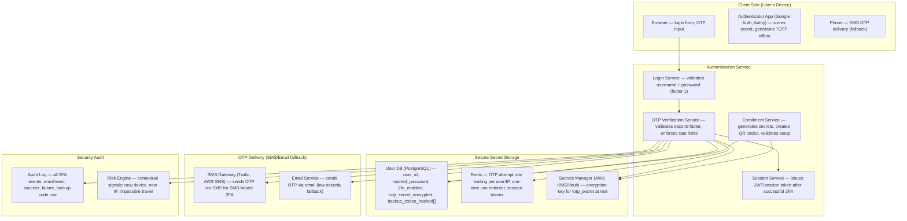
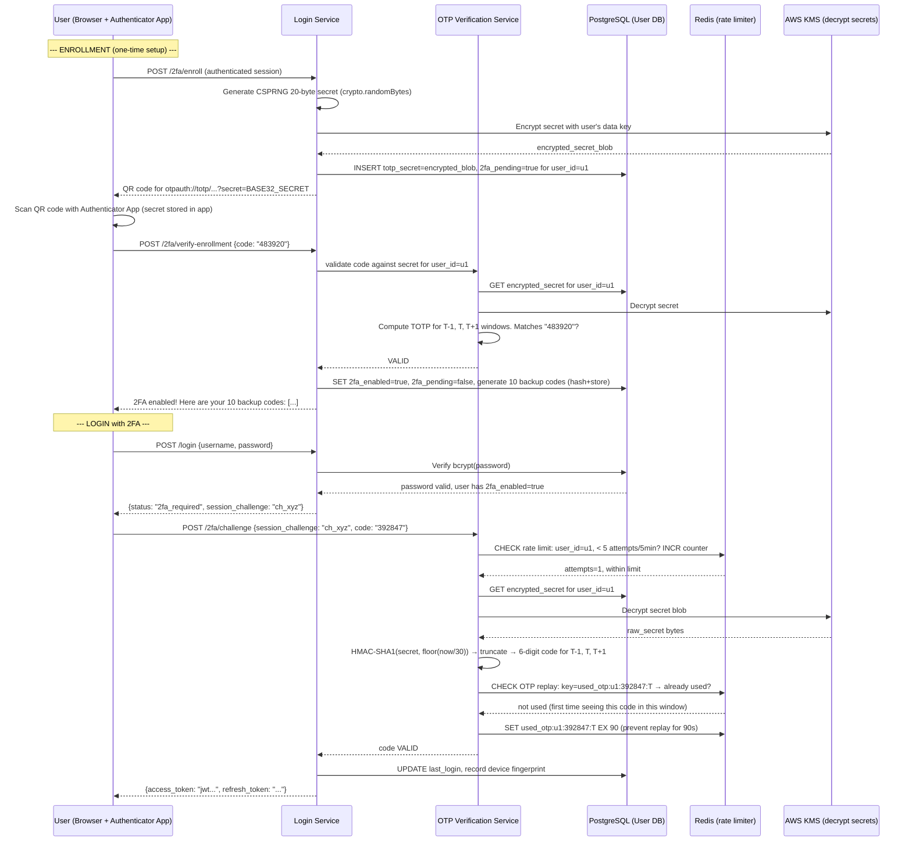
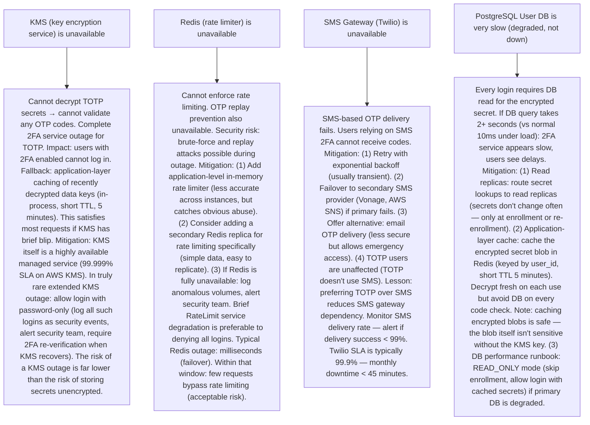

# Pattern 33 — Two-Factor Authentication System (like Authy, Google Authenticator)

---

## ELI5 — What Is This?

> Imagine your house key (password) gets stolen. Normally, the thief can now
> enter your house. But if your door also requires you to press a button on a
> special device in your pocket — and that code changes every 30 seconds —
> the thief with your key still can't get in.
> Two-Factor Authentication (2FA) is that second lock.
> "Something you know" (password) + "something you have" (phone/device).
> Even if your password is stolen, attackers can't log in without the
> time-based code from your device. This system must be both highly secure
> and highly reliable — if verification fails when you're traveling and can't
> receive SMS, you lose access to your account.

---

## Glossary (Every Keyword Explained in ELI5)

| Word | ELI5 Meaning |
|---|---|
| **TOTP (Time-based One-Time Password)** | A 6-digit code that changes every 30 seconds. Generated by an algorithm (HOTP + current timestamp) using a secret key that only you and the server share. The server generates the same code independently. If they match, you're verified. No network needed to generate it (works offline). Google Authenticator and Authy both use TOTP (RFC 6238). |
| **HOTP (HMAC-based One-Time Password)** | Older variant of TOTP: uses a counter (increments each use) instead of a timestamp. Each time you view your code, the counter increments. Problem: counter can drift between client and server. TOTP uses a time-based counter (30-second windows) which auto-syncs as long as clocks are approximately aligned. |
| **Secret Key** | A random 160-bit (20-byte) secret, unique per user per service. Shared once at enrollment (shown as a QR code). The app stores it. The server stores it. This secret is used in the HMAC-SHA1 computation to generate the 6-digit code. Must never be transmitted after enrollment — it's a long-lived credential. |
| **QR Code** | The enrollment step: server generates a `otpauth://totp/service:user@example.com?secret=BASE32SECRET&issuer=ServiceName` URI, encoded as a QR code. User scans it with their authenticator app. The secret is transferred exactly once. |
| **Clock Drift** | TOTP depends on both client and server agreeing on the current 30-second time window. If your phone's clock is wrong by 90 seconds, your code might be in window T-3 while the server is in window T. Solution: server accepts codes from T-1, T, and T+1 windows (90-second tolerance). |
| **Backup Codes** | Single-use recovery codes generated at enrollment. If you lose your phone, you can use one backup code to get in. Each code is used exactly once (stored hashed in DB). Typically 10 codes per user. |
| **Push Authentication** | Instead of entering a 6-digit code, user gets a push notification on their phone: "Are you trying to log in from New York?" with Approve/Reject buttons. More user-friendly than typing codes. Used by Duo Security, Okta Verify. |
| **SMS OTP** | One-time password sent via SMS as the second factor. Simpler than TOTP app but vulnerable: SIM swapping, SS7 attacks, and stolen SMS. NIST deprecated SMS as a recommended 2FA method in 2017. Still widely used (better than nothing). |
| **Hardware Token (FIDO2, YubiKey)** | A physical USB/NFC device. Press the button → generates a one-time code or completes a cryptographic challenge. Most secure 2FA method. FIDO2/WebAuthn is the modern standard. YubiKey and Google Titan Key are examples. |
| **Enrollment** | The initial setup: user enables 2FA on their account, scans the QR code, proves they can generate valid codes, server saves the secret. Critical security moment: the secret passes from server to user exactly once. |

---

## Component Diagram

---

## Step-by-Step Request Flow

---

## Bottlenecks — Every Point Explained

| # | Bottleneck | Why It Hurts | Fix |
|---|---|---|---|
| 1 | **Secret storage security** | The TOTP secret is a long-lived credential — if stolen, an attacker can generate valid OTPs forever (until the user re-enrolls). If the DB is breached and secrets are stored in plaintext, all 2FA is immediately invalidated. | Encrypt secrets at rest: use envelope encryption. Generate a 256-bit data key per user (stored in AWS KMS, or HashiCorp Vault). Encrypt the TOTP secret with the data key. Store only the encrypted blob in PostgreSQL. To decrypt: call KMS to decrypt the data key, use it to decrypt the secret. KMS audit logs all decryption calls. Even with DB breach: attacker gets encrypted blobs, not secrets. Extra layer: column-level encryption in PostgreSQL using pgcrypto. |
| 2 | **OTP replay attacks** | TOTP codes are valid for 90 seconds (T-1, T, T+1 windows). An attacker intercepting a TOTP code via phishing or shoulder-surfing could reuse it within the 90-second window. This makes TOTP phishable. | One-time-use enforcement: after a code is validated, store the (user_id, code, window_timestamp) in Redis with TTL = 90 seconds. Before accepting a code: check Redis to see if this exact code was already used in this window. If yes → reject (replay detected). Cost: one extra Redis SET per successful login. No performance concern at any scale. Note: FIDO2/WebAuthn is phishing-resistant (the authentication is cryptographically bound to the origin domain) — TOTP is inherently not. For highest security, use WebAuthn. |
| 3 | **Rate limiting OTP attempts** | Without rate limiting: an attacker could try all 1,000,000 possible 6-digit codes against a stolen username. At 100 requests/second, they'd exhaust all codes in < 3 hours (though TOTP windows expire every 30s, reducing effective attempts to 1-3 per window). | Strict rate limiting: 5 incorrect OTP attempts per user per 5-minute window (Redis INCR + TTL). After 5 failures: temporary account lock (15 minutes). After 3 locks in 24 hours: require email verification to re-enable 2FA. Rate limit per IP separately (prevent distributed attacks from many IPs targeting one account). Alert: 3+ failures in 5 minutes for one user → security notification to user ("someone is trying to access your account"). Exponential backoff for lockout periods. |
| 4 | **Clock drift between client and server** | TOTP depends on synchronized clocks (the 30-second window). If a user's phone clock is wrong by 60+ seconds, the generated code is for a different T window than the server expects. Authentication fails repeatedly. Common cause: users with manually-set phone clocks or traveling across timezones who haven't allowed auto-sync. | Window tolerance: server accepts T-1, T, and T+1 (90-second window). This handles drift up to ±30 seconds for a correctly-synced clock. Additional drift compensation: if valid code detected in window T-2, log the drift and set a user-specific time_offset in DB (store: user prefers T+offset). Future verifications use this known offset. Alert UI: "Having trouble? Ensure your phone time is set automatically." For SMS OTP: server-controlled delivery time — no clock sync needed. |
| 5 | **Account recovery when phone is lost** | If user loses their phone (or it's reset), they lose access to their TOTP app. They can't log in. Must rely on backup codes or account recovery. If backup codes were also lost: account is permanently inaccessible (or requires identity verification support process). | Layered recovery options: (1) Backup codes (10 single-use codes, shown at enrollment, user should print/store). (2) Recovery email OTP: send OTP to verified email (weaker second factor, but better than total lockout). (3) Customer support recovery: ID verification (government ID), 24-hour cooling period before re-enabling 2FA (prevents impersonation). (4) Authy approach: encrypted backup of secret to the cloud (optional, protected by a separate master password + phone number). Allows restoring your authenticator on a new device without backup codes. Trade-off: cloud backup is convenient but the secret leaves your device. |
| 6 | **SMS OTP vulnerabilities (SIM swap, SS7 attacks)** | SMS OTP is the most common fallback but the least secure. SIM swapping: attacker calls carrier, pretends to be you, asks to transfer your number to their SIM. Now they receive your SMS OTPs. SS7 vulnerabilities: telecom protocol flaws allow intercepting SMS from a distant attacker. High-profile attacks (Twitter CEO Jack Dorsey's account, various crypto exchange hacks). | (1) Offer TOTP as preferred method over SMS. (2) SIM swap detection: monitor for SIM change events (carriers provide APIs). If SIM changed in last 24 hours, require additional verification before SMS 2FA. (3) For high-security accounts: require hardware token (YubiKey) or FIDO2 — not SMS. (4) Inform users of SMS risk: "For stronger security, use an authenticator app." (5) Push notification auth (Duo/Okta): pop-up on your existing device — if device is not swapped, push is more secure than SMS. |

---

## What Happens When Each Part Fails?

---

## Key Numbers to Know

| Metric | Value |
|---|---|
| TOTP time window | 30 seconds (RFC 6238) |
| Accepted time windows (drift tolerance) | T-1, T, T+1 = 90-second validity window |
| OTP code length | 6 digits (10^6 = 1,000,000 possibilities) |
| Secret key length (recommended) | 160 bits (20 bytes) per RFC 4226 |
| Backup codes count | Typically 8-10 single-use codes |
| OTP attempt rate limit | 5 attempts per 5 minutes (industry standard) |
| 2FA adoption rate (GitHub users) | ~28% of all GitHub accounts (2021 data) |
| SMS OTP vulnerability | SIM swap + SS7 attacks documented in major breaches |
| FIDO2 / WebAuthn | Gold standard: phishing-resistant, no shared secret |

---

## How All Components Work Together (The Full Story)

2FA adds a second authentication factor to the login flow. The fundamental principle: even if an attacker steals your password (factor 1: something you know), they cannot log in without physical access to your device (factor 2: something you have / something you are).

**TOTP algorithm deep-dive:**
TOTP (RFC 6238) works as follows: `TOTP = HOTP(K, T)` where K is the shared secret and T is the current 30-second window counter = `floor(Unix_timestamp / 30)`. HOTP is computed as: `HOTP = Truncate(HMAC-SHA1(K, T))` where truncation extracts 6 decimal digits from the HMAC output. Both client (app) and server compute this independently with the same K and T — if they match, authentication is successful. No network communication needed to generate the code.

**The security model:**
The security rests entirely on the secrecy of K (the shared secret). If an attacker compromises K, they can generate valid TOTP codes forever. Hence: (1) K is transferred exactly once (QR code scan during enrollment), over HTTPS. (2) K is stored encrypted in the DB (envelope encryption with KMS). (3) K never appears in logs. (4) K is unique per user per service.

**Push vs TOTP vs SMS:**
Push notification auth (Duo, Okta Verify) is more phishing-resistant than TOTP because the user approves a context-rich notification ("Are you logging in from New York?") rather than typing a code that could be phished. TOTP is still vulnerable to real-time phishing (attacker proxies the code immediately). WebAuthn/FIDO2 is cryptographically phishing-resistant (signature is bound to the origin domain — a fake domain can't use your credentials).

> **ELI5 Summary:** Think of TOTP like a synchronized watch that both you and the bank have, but nobody else does. Every 30 seconds, both watches show the same random number. You type that number, the bank checks their watch, they match — you're in. Even if someone steals your password, they don't have the watch. Redis is the guard who remembers which watch-numbers were already used (prevent reuse). KMS is the vault where the watch's secret ticking pattern is stored safely.

---

## Key Trade-offs

| Decision | Option A | Option B | Why |
|---|---|---|---|
| **TOTP app vs SMS as primary 2FA method** | TOTP app: works offline, more secure, not vulnerable to SIM swap. Requires user to install and manage an app. | SMS: no app needed, familiar UX, but vulnerable to SIM swap, SS7, and delayed delivery. | **TOTP preferred for security-conscious users; SMS as fallback**: TOTP is strictly more secure. But SMS has lower enrollment friction (everyone has SMS). The right answer: offer TOTP as default recommendation, allow SMS as a less-secure alternative, but warn users of SMS risk. For high-security use (crypto exchanges, financial accounts): require TOTP or hardware token — never SMS-only. |
| **Clock tolerance window (30s vs 90s)** | 30s tolerance (T only): strictest, smallest replay window. Any clock drift > 15 seconds causes login failure. | 90s tolerance (T-1, T, T+1): handles most real-world clock drift. Very slightly larger replay window. | **90s is the standard**: T-1, T, T+1 is the RFC recommended tolerance. Real devices have up to ±15 seconds variance even with NTP sync. Replay window is only 90 seconds and requires already knowing the code (not a practical attack vector given rate limiting). |
| **Cloud backup of TOTP secrets (Authy model) vs local-only storage (Google Authenticator classic)** | Cloud backup: convenient, recoverable if phone lost. The secret is transmitted to and stored in the cloud (encrypted). | Local-only: secret never leaves device. No recovery if phone is lost without backup codes. | **Depends on threat model**: For most users: cloud backup (Authy model) dramatically reduces account lockout risk. Secret is encrypted with user's master password using client-side encryption before upload — server never sees plaintext. For highest-security users (nation-state threat model): local-only storage (hardware security key like YubiKey). User choice between security-first vs usability-first is the right design. |

---

## Important Cross Questions

**Q1. How does the TOTP algorithm work mathematically?**
> TOTP is HMAC-SHA1(secret_key, counter) where counter = floor(unix_timestamp / 30). Step by step: (1) Calculate counter T = floor(current_unix_time / 30). (2) Compute HMAC = HMAC-SHA1(K, T) → 20-byte output. (3) Dynamic truncation: take `offset = HMAC[19] & 0xF` (last nibble of HMAC). Extract 4 bytes starting at offset. (4) P = (HMAC[offset] & 0x7F) << 24 | HMAC[offset+1] << 16 | HMAC[offset+2] << 8 | HMAC[offset+3]. (5) OTP = P % 10^6 (take last 6 digits). This is deterministic: given the same K and T, both app and server get the same number. 30 seconds later, T increments, the code changes completely. Security: brute-force requires 10^6 guesses per 30-second window, but rate limiting restricts to 5 attempts per 5 minutes (effectively infinite security).

**Q2. How would you implement account recovery when the user loses their 2FA device?**
> Multi-tier recovery: (1) Backup codes: 8-10 single-use codes, generated at enrollment, user stores them offline. Each code is hashed (bcrypt) in DB. On use: hash the entered code, compare to stored hashes, if match: delete that hash (one-time use), log the backup code use event, allow login. (2) Recovery via verified email: send a time-limited (15 min) OTP to the user's primary verified email. User submits OTP. This is weaker than the 2FA it's bypassing — mitigated by requiring email OTP + triggering "new device" security notification. (3) Support ticket identity verification: user submits government ID + selfie. 24-hour manual review. After successful verification: disable 2FA, user must re-enroll. This process is deliberately slow and friction-heavy to prevent social engineering attacks. (4) All recovery events are logged in the audit trail with full details (method used, IP, timestamp) for security review.

**Q3. How does WebAuthn/FIDO2 differ from TOTP and why is it more secure?**
> WebAuthn uses asymmetric cryptography (public/private key pair) instead of a shared secret. Enrollment: device generates a new public/private key pair for each service. Public key stored on server. Private key never leaves the device's secure enclave (hardware chip). Authentication: server sends a challenge (random nonce). Device signs the challenge with the private key. Server verifies the signature with the stored public key. Security advantages over TOTP: (1) Phishing-resistant: the key pair is bound to the origin domain (example.com). If the user is tricked onto evil.com, the device refuses to sign a challenge for evil.com with the example.com key — the attack fails even if the user is fooled. (2) No shared secret: the private key never leaves the device, so server breaches don't expose 2FA credentials. (3) No OTP copy required: user taps the security key or uses biometrics — no code to observe or replay. Downside vs TOTP: requires hardware support (FIDO2-compatible device or modern smartphone with platform authenticator). Google, Apple, and Microsoft now support passkeys (WebAuthn built into OS) — this is the future of 2FA.

**Q4. How do you handle simultaneous login attempts from two devices (race condition on OTP use tracking)?**
> Scenario: user has two browser tabs open, both requesting OTP verification at the same moment with the same code. Without protection: both could succeed (Redis hasn't been updated yet for the first validation). Solution: Use Redis SET NX (SET if Not Exists) as an atomic operation: `SET used_otp:u1:CODE:T_WINDOW "" NX EX 90`. Only one of the two concurrent requests will succeed in setting this key. The other gets "already used" (NX fails when key exists). The one who set the key: proceed with authentication. The other: reject with "code already used, please wait for the next code." This is an atomic operation in Redis — no race condition possible. Result: exactly-once OTP validation even under concurrent requests.

**Q5. How does Authy provide multi-device synchronized TOTP without a central server knowing your secrets?**
> Authy's encrypted backup model: (1) User sets a master password (separate from their Authy login). (2) On enrollment: TOTP secret is encrypted client-side using a key derived from the master password (PBKDF2 key derivation). The encrypted blob (not the plaintext secret) is uploaded to Authy's servers. (3) On a new device: user downloads Authy, authenticates with phone number, enters master password. Authy downloads the encrypted blob. Client-side decryption using master password key → recover secret. (4) Authy's server never sees the plaintext secret (zero-knowledge backup). (5) Attack resistance: attacker who compromises Authy's DB gets encrypted blobs — useless without the master password. Attacker who knows your phone number but not master password: can download the blob but can't decrypt. The security model is: your master password is the ultimate secret (choose a strong one). Limitation: Authy itself is a trusted party for availability and delivery of the encrypted blob — not fully decentralized.

**Q6. How do you design the TOTP enrollment flow to be secure against man-in-the-middle attacks?**
> The critical security moment is transferring the secret from server to client (QR code scan). Mitigations: (1) HTTPS everywhere: QR code display page must be served over HTTPS. If HTTP, attacker on the network intercepts the QR code and knows your secret. (2) QR code shown only once: display the QR code once during enrollment. User scans, then the page shows only a masked secret for reference. Subsequent views show "re-enroll" option, not the original secret. Reduces window for interception. (3) Require existing authentication: enrollment must happen in an authenticated session. The user must have already passed password verification before reaching the enrollment page. (4) Confirm enrollment before saving: require user to enter one valid TOTP code during enrollment to confirm their app stored the secret correctly. Only then save to DB with `2fa_enabled=true`. Prevents "enrolled but misconfigured" states. (5) Audit log: record every enrollment (timestamp, IP, user agent). Alert if enrollment from a new geographic location — could be a compromised session trying to add their own 2FA device.

---

## Real-World Apps That Use This Pattern

| Company | Product | How They Use It |
|---|---|---|
| **Google** | Google Authenticator / Google Account 2FA | Most widely used TOTP app. Also offers Google Prompt (push notification on Android). Advanced Protection Program: requires hardware security key (no SMS or app OTP) for high-risk users (journalists, politicians). FIDO2/passkeys rolled out to all Google accounts (2023). |
| **Authy (Twilio)** | Authy Authenticator | TOTP app with encrypted cloud backup (multi-device sync). SDK for developers to add 2FA to their apps. Handles SMS, TOTP, push auth. Used by major exchanges (Coinbase, Binance). Proprietary cloud sync differentiates from Google Authenticator. Acquired by Twilio in 2015. |
| **Duo Security (Cisco)** | Enterprise 2FA | Push authentication model: approve/deny login from Duo Mobile app. Risk-based policy engine: known device + known location = automatic approve; unknown device = require push confirm. Used by> 40,000+ organizations. Integrates with VPN, SSO, SSH. Not just TOTP — context-aware adaptive authentication. |
| **GitHub** | 2FA for Developer Accounts | Requires 2FA for all developers who contribute to npm registry or GitHub Actions features. Supports TOTP, SMS, WebAuthn (passkeys), security keys. Security keys (FIDO2) are the most secure option. GitHub's push to mandatory 2FA (2023) across all contributor accounts — major platform-level 2FA enforcement. |
| **AWS (Amazon Web Services)** | IAM Multi-Factor Authentication | Virtual MFA (TOTP-compatible apps), hardware TOTP device, or FIDO2 security key. Root account MFA: mandatory best practice (AWS explicitly warns if not enabled). IAM policies can require MFA for specific high-privilege actions (`aws:MultiFactorAuthPresent` condition). Used to protect cloud infrastructure access. |
