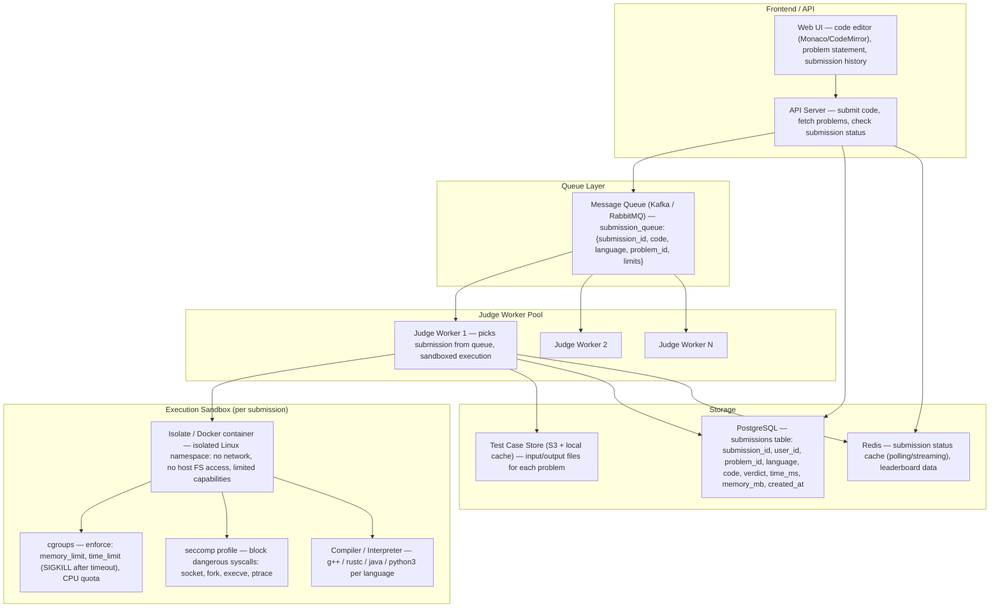
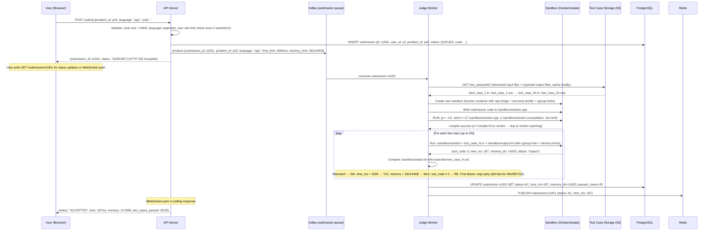
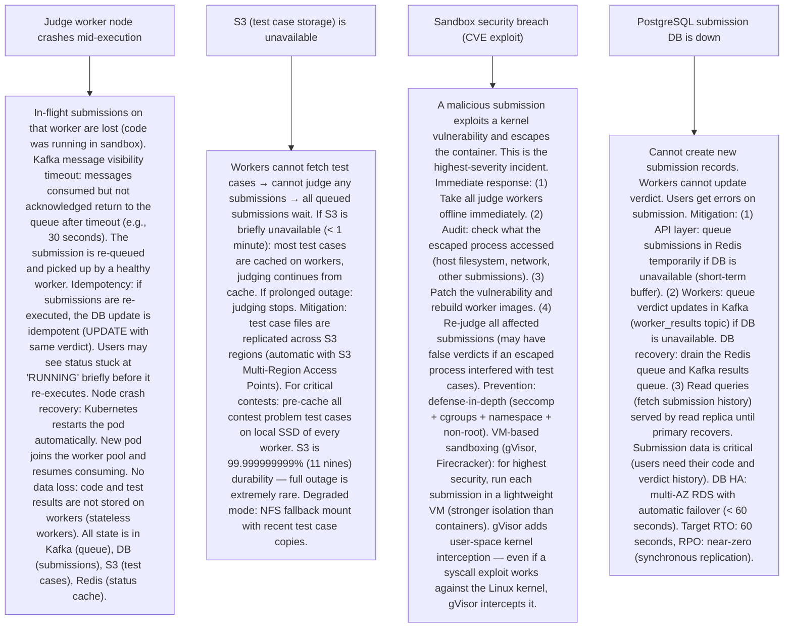

# Pattern 34 — Online Code Judge (like LeetCode, HackerRank)

---

## ELI5 — What Is This?

> Imagine a teacher who grades programming homework automatically.
> You submit your code. The teacher runs it against hidden test cases
> and in exactly 2 seconds, you see: "Passed 8/10 test cases."
> The problem: your code could be malicious (delete all of teacher's files!),
> or it could run forever (infinite loop), or it could eat all the memory.
> The online judge must safely run untrusted code in a completely isolated
> sandbox — like a tiny prison — measure its performance, and give
> you a precise result. It must do this for thousands of simultaneous
> submissions across 50+ programming languages.

---

## Glossary (Every Keyword Explained in ELI5)

| Word | ELI5 Meaning |
|---|---|
| **Submission** | A piece of code a user submits to solve a problem. The judge must: compile it (if needed), run it against test cases, measure time and memory, compare output to expected answer, report verdict. |
| **Verdict** | The result of evaluating a submission: AC (Accepted), WA (Wrong Answer), TLE (Time Limit Exceeded), MLE (Memory Limit Exceeded), RE (Runtime Error), CE (Compile Error). |
| **Sandbox** | A heavily restricted execution environment where untrusted code runs. The code cannot: access the network, read/write outside a temp directory, fork unlimited processes, consume unlimited CPU/memory, make dangerous system calls. |
| **Test Case** | A pair of (input, expected_output). The judge runs your code with the input and checks if the output matches. For "accept": ALL test cases must pass. Usually 10-100 hidden test cases per problem. |
| **Time Limit** | The maximum execution time allowed for a code submission (e.g., 2 seconds). If the code takes longer: TLE verdict. Prevents infinite loops from blocking the system forever. |
| **Memory Limit** | Maximum RAM allowed (e.g., 256MB). If code allocates more: MLE verdict. Monitored by cgroups (Linux kernel control groups). |
| **seccomp** | A Linux kernel feature (Secure Computing Mode) that restricts which system calls a process can make. Code running in the sandbox can call `read()` and `write()` but not `socket()` (no network), not `fork()` bomb, not `execve()` (prevent running other programs). |
| **cgroups** | Linux kernel feature for resource limits: limit a process to X MB of RAM, Y% of CPU, Z file descriptor count. Combined with namespaces (PID, network, filesystem isolation), this creates a container-based sandbox. |
| **Checker** | For problems where multiple valid outputs exist (e.g., "find any valid permutation"), the judge uses a "checker" program that validates the output correctness beyond simple string comparison. |
| **Queue** | Submissions are queued (not executed immediately). A pool of workers picks up submissions from the queue and executes them. This allows the system to handle bursts (everyone submitting at midnight before a deadline). |

---

## Component Diagram

---

## Step-by-Step Request Flow

---

## Bottlenecks — Every Point Explained

| # | Bottleneck | Why It Hurts | Fix |
|---|---|---|---|
| 1 | **Sandbox startup overhead** | Creating a new Docker container for every submission takes 500ms-2s (image pull, filesystem layer, process startup). For a contest with 100K submissions in 30 minutes, startup overhead dominates. A 1-second startup for 1000 concurrent submissions = 1000 seconds of wasted compute per batch. | Pre-warmed container pool: maintain N sandbox containers in READY state (running, waiting for work). Instead of "create container per submission," reuse containers: send new submission to an idle container, run it, reset the sandbox (delete temp files, clear timer), return container to pool. Container reset is sub-second. Pool size scales based on submission queue depth (autoscaling). Isolate (Codeforces's sandbox library) uses Linux namespaces without Docker overhead — launches in < 50ms. |
| 2 | **Malicious code escape attempts** | Submission tries to: (1) Fork-bomb: `while(1) fork()` — creates exponential processes. (2) Write to `/etc/passwd`. (3) Open a network socket and exfiltrate test cases. (4) `execve` a shell and run arbitrary commands. (5) Read other users' code from filesystem. Any of these breaches the security model. | Defense-in-depth sandbox: (1) seccomp policy: block `socket()`, `fork()` (allow `clone()` with restricted flags only), `execve()`, `ptrace()`, `mount()`. (2) cgroups: `pids.max = 32` (max 32 child processes, prevents fork bomb). `memory.max = 256MB`. CPU quota. (3) Network namespace: isolated network namespace with no real network interfaces. (4) Filesystem namespace: read-only bind mount of the binary, no access to host filesystem. Temp directory is a tmpfs (in-memory file system, wiped after execution). (5) Dropped capabilities: run as non-root user inside sandbox, no `CAP_NET_ADMIN`, `CAP_SYS_ADMIN`. This multi-layer approach means even if one layer is bypassed (CVE in seccomp), others remain. |
| 3 | **Test case file access latency** | Each submission needs 10-100 test case input/output files. Fetching from S3 on every submission: 50-100ms per file × 20 files = 1-2 seconds extra latency per submission. For 100K submissions all for the same popular problem: 100K × S3 fetches. | Local worker cache: each judge worker caches test case files for recently used problems (local SSD). `LRU cache` with size limit (1GB per worker). Cache hit: no S3 fetch at all (< 1ms file read). Cache miss: fetch from S3, store locally. Popular problems during contests: pre-warm test case cache across all workers at contest start. Shared NFS: for multi-worker clusters, mount a shared NFS volume with test cases. Test case files are immutable (never change once created) — safe to cache indefinitely. Hash-check on startup to invalidate if problem is updated. |
| 4 | **Multi-language support overhead** | 50+ languages need different runtimes (Java JVM, Python interpreter, Node.js, etc.). Running Java: JVM startup = 300-500ms. Python: slower execution than C++. Different compilation/interpretation pipelines, different memory models, different security requirements. | Pre-compiled base images per language: maintain Docker images with all compilers/interpreters pre-installed and warmed (JVM pre-started). Language-specific time & memory limits: Java gets 2x the time limit vs C++ (JVM overhead is accepted). Python gets 3x. These are documented for users ("language bonus"). For JVM languages: keep JVM warm in the container pool (JVM startup time amortized across multiple submissions using the same warm container). Language-specific seccomp profiles: Python needs different allowed syscalls than C++. |
| 5 | **Ensuring consistent timing measurements** | Execution time must be measured accurately. OS scheduling jitter: a 1.95-second solution might measure as 1.88s on a lightly loaded machine and 2.05s on a loaded one. Judging "Accepted" vs "TLE" is inconsistent. Users complain that the same code passes on one submission and fails on another. | Dedicated judge servers: judge workers run on machines with no other workloads. Fixed CPU frequency (disable CPU boost: `cpupower frequency-set -f 2.0GHz`). Real-time scheduling priority: `SCHED_FIFO` for the judge process. Measure CPU time (not wall time): use `getrusage()` or cgroup CPU accounting — measures only the time the process was actually running on CPU (excludes scheduler wait time). Run each test case 3 times, use minimum time (reduces noise). Acceptable +/- jitter: 50-100ms. Problems are set with this in mind (time limit is at least 2x the intended solution's runtime). |
| 6 | **Queue depth during peak (contest end)** | Competitive programming contests: 100K users, all submitting in the last 10 minutes. Queue depth spikes from 10 to 100,000. Latency goes from 1 second to 10+ minutes. Users rage-quit. | Autoscaling worker pool: Kubernetes HPA (Horizontal Pod Autoscaler) on queue depth metric. Queue depth > 500: scale out workers. Each new worker pod spins up in 60 seconds. Dedicated contest workers: pre-spin extra capacity 30 mins before contest end (predictable spike). Fair queue: two queues — contest queue (higher priority) and practice queue (lower priority). Within contest queue: round-robin by user_id (prevent one user flooding the queue with 100 submissions). Rate limit: max 5 submissions per user per minute. |

---

## What Happens When Each Part Fails?

---

## Key Numbers to Know

| Metric | Value |
|---|---|
| Default time limit | 1-2 seconds (C++), 3-6 seconds (Java), 5-10 seconds (Python) |
| Default memory limit | 256 MB |
| Max code size | 64 KB (64,000 characters) |
| Test cases per problem | 10-50 (hidden), 0-5 (sample, shown to user) |
| Sandbox startup time (isolate) | < 50ms |
| Sandbox startup time (Docker cold) | 500ms - 2s |
| LeetCode daily submissions | Millions (exact not public) |
| Worker scaling (Codeforces peak contests) | ~3,000+ concurrent judge workers |
| Compile timeout | 10-30 seconds |
| Maximum execution timeout per test case | 5-10 seconds (then SIGKILL) |

---

## How All Components Work Together (The Full Story)

An online judge is a distributed system that compiles and executes untrusted user code safely, at scale, and with precise resource measurement. The three design pillars: (1) Security (untrusted code cannot harm the system), (2) Correctness (verdicts are accurate and reproducible), (3) Scale (handles burst traffic during contests).

**The submission lifecycle:**
`QUEUED → COMPILING → RUNNING → JUDGING → DONE`. Each state is observable. When a user submits, the API creates the submission record and publishes to Kafka — this decouples the API from the execution. Workers are purely pull-based: they ask "is there work?" rather than being pushed tasks. Workers judge submissions *sequentially per test case* — test cases run one by one, fast-failing on the first error.

**The sandbox model:**
The sandbox is the most critical component. A modern online judge typically uses one of: (1) Docker + seccomp + cgroups (most common), (2) `isolate` (Codeforces's tool, uses kernel namespaces directly, very lightweight), (3) gVisor (Google's container-level VM — sandboxes the kernel with a user-space implementation), (4) Firecracker (micro-VMs, each submission in its own VM). The trade-off: stronger isolation = higher overhead. For competitive programming: isolate is the sweet spot (fast + secure). For general-purpose code execution (educational platforms where arbitrary code runs): gVisor or Firecracker.

**Judging accuracy:**
Standard judge: compare program output with expected output exactly (whitespace-trimmed). Special checker: for problems with multiple valid answers, a checker program validates output semantically (e.g., "is this output a valid topological sort of the graph?"). Interactive problems: judge sends input, reads user output, sends more input based on it (interactive protocol with the judge). Stress testing: problem setters run their solution on random inputs alongside a brute-force solution to discover edge cases before setting time limits.

> **ELI5 Summary:** Think of each submission as a student taking a test in a locked exam room (sandbox) with a timer. The room has no windows to the outside world (no network), limited paper (memory), and a buzzer at time's end (SIGKILL). A proctor (the judge worker) watches from outside, feeds test inputs through a slot, collects answers, and marks them right or wrong. Kafka is the registration desk where students queue up. S3 is the vault of answer keys. The DB is the grade book.

---

## Key Trade-offs

| Decision | Option A | Option B | Why |
|---|---|---|---|
| **Container reuse vs fresh container per submission** | Fresh: create a new container for each submission. Perfect isolation, no state leakage. Slow (500ms+ startup). | Reuse: reset the container between submissions (delete files, reset cgroups). Fast (< 10ms reset). Potential risk: residual state from previous submission may affect next. | **Reuse with strict reset** is standard: `isolate --cleanup` resets all state. The reset is thorough: filesystem namespace reverted (tmpfs cleared), cgroup counters reset, network namespace cleaned. Speed gain is critical: 500ms × 1M daily submissions = 500K seconds of wasted compute. The isolation guarantee: previous submission's data is physically deleted from tmpfs by the reset script (not just logically removed). |
| **Kafka vs RabbitMQ vs SQS for submission queue** | Kafka: high throughput, replay capability, partitioned by language (different worker pools for different languages). Complex to operate. | SQS (AWS): managed, simple, pay-per-use, visibility timeout handles worker failures automatically. Less flexibility. | **SQS for simpler deployments, Kafka for scale**: for 1M+ submissions/day or complex routing (priority queues, contest isolation from practice), Kafka wins. For a startup or mid-size platform: SQS is operationally simpler. The key requirement: at-least-once delivery with visibility timeout (worker crashes → message re-queued). Both support this. LeetCode-scale: Kafka for full control. Codeforces: custom built. HackerRank: AWS-managed services. |
| **VM-based sandboxing (gVisor/Firecracker) vs container-based (isolate/Docker + seccomp)** | VM-based: stronger isolation (hardened against kernel exploits). Slower startup (100-500ms). Higher memory overhead per sandbox. | Container-based: faster (< 50ms), lower overhead, well-understood. Not immune to kernel CVEs. | **Container-based for competitive programming judges** (latency-sensitive, well-audited workloads): isolate/Docker + seccomp is a proven, fast approach. **VM-based for general-purpose code execution** (broader attack surface, higher security requirement): Replit uses docker + seccomp for interactive coding. Cloud providers (AWS Lambda, Google Cloud Functions) use Firecracker for customer-facing function execution. The threat model determines the choice. |

---

## Important Cross Questions

**Q1. How do you prevent a submission from reading other users' code on the filesystem?**
> Filesystem namespace isolation: each sandbox has its own isolated filesystem namespace (Linux mount namespace). The sandbox sees only: (1) the language runtime binaries (read-only bind mount), (2) a temp directory (tmpfs, writable, cleared after execution), (3) nothing else. The host filesystem, other users' code directories, test case expected outputs, and all other system resources are invisible to the sandboxed process. Implementation: `unshare --mount` creates a new mount namespace. Within it: mount tmpfs at `/tmp/sandbox`, bind-mount `/usr` (read-only), bind-mount the binary to execute (read-only). No bind mount of `/home`, `/var`, or any path containing other submissions. Double-check: test by trying `ls /` from inside the sandbox — it should only see the minimal filesystem. |

**Q2. How do you handle the "time limit exceeded" verdict when the program hangs forever?**
> Hard kill via cgroups + SIGKILL: (1) The worker process starts a timer when execution begins. (2) cgroup `cpu.max` is set to limit CPU usage. (3) A watchdog goroutine/thread outside the sandbox monitors elapsed wall time. When time_limit + buffer is exceeded: send `SIGKILL` to the sandbox's cgroup (kills all processes in the cgroup instantly, including any children). `SIGKILL` cannot be caught or ignored by the user program — unconditional termination. (4) Record: wall time at SIGKILL = TLE verdict. (5) cgroup CPU time accounting: if the program is doing actual computation (not sleeping), CPU time ≈ wall time. If the program is sleeping (e.g., waiting for network that doesn't exist), CPU time < wall time. Judge uses CPU time for the verdict (programs that sleep don't get penalized for wall clock time they didn't use). |

**Q3. How is the problem-setting and test-case generation workflow designed?**
> Problem setters workflow: (1) Problem setters write the problem statement, input/output format, constraints. (2) They write multiple solutions (AC solution, brute-force solution, intentional TLE solution). (3) họ generate test cases: manually crafted edge cases + randomly generated inputs using a generator script. (4) Validator: checks that generated inputs meet problem constraints (no invalid test cases allowed). (5) All solutions run against all test cases: AC solution should pass all, brute-force should pass small cases but TLE on large. (6) Time limit determined by: run AC solution on the judge machine, take runtime × 3 as the time limit. (7) Test case storage: each problem has a directory in S3 (`problems/p42/test_cases/{01.in, 01.out, ..., 20.in, 20.out}`). Files are immutable once contest starts. Checkers for special evaluation are also stored here. |

**Q4. How do you design the status polling system to efficiently inform users of their submission result?**
> Two common approaches: (1) Short-polling: client sends GET /submission/{id} every 2 seconds. Simple, stateless, but generates high API traffic. For 10,000 concurrent users polling every 2 seconds = 5,000 RPM of status queries. Manageable with Redis cache (O(1) lookup by submission_id). (2) WebSocket / SSE push: server pushes status updates to connected clients. When worker completes judging: publish to Redis pub/sub channel `submission:{id}`. API server subscribes and pushes to client WebSocket. Optimal: single update instead of repeated polls. Implementation: Kafka consumer → DB update → Redis PUBLISH → API WebSocket server → client browser. Hybrid: use SSE (Server-Sent Events) for submission status (unidirectional push, simpler than WebSocket, HTTP-compatible). Most modern judges (LeetCode, Codeforces) use a combination of Redis pub/sub for real-time push with a fallback polling endpoint. |

**Q5. Explain how you'd design the system to support interactive problems (where the judge and solution communicate back and forth).**
> Interactive problem execution: the judge sends a line, solution reads it, responds, judge reads response, evaluates, sends next input. Not the same as batch: you can't just redirect stdin. Architecture: (1) The sandbox runs the user solution as before. (2) Instead of file-based stdin redirect, use two named pipes (FIFOs): `input_pipe` and `output_pipe`. (3) The worker also runs the judge interactor (a special program that implements the interaction logic). (4) Wiring: solution reads from `input_pipe`, writes to `output_pipe`. Interactor reads from `output_pipe`, writes to `input_pipe`. (5) Time measurement: total interaction time limited by time_limit. If either process hangs: SIGKILL both. (6) Communication protocol: typically line-based (newline-terminated), with flush required (`fflush(stdout)` in C++). A common gotcha: interactive problems fail due to buffering — contestant's code writes to stdout but doesn't flush, so the judge never receives it. Judge client must document: "Remember to flush stdout after every output." |

**Q6. How does LeetCode's system differ from a traditional competitive programming judge like Codeforces?**
> Key design differences: (1) Problem format: LeetCode problems are functions (implement a method, not a full program with main). The judge wraps the user's function in driver code that calls it with test inputs. Codeforces: full programs that read from stdin and write to stdout. (2) Languages: LeetCode supports ~30 languages with in-browser templates per language. The driver code is language-specific. (3) Test case secrecy: LeetCode hides all test cases (no sample-only debugging). Codeforces shows some sample inputs. (4) Grading granularity: LeetCode shows "passed out of N test cases" with the first failing input. Codeforces: binary accept/reject with verdict. (5) Scale: LeetCode is used year-round for interview prep (steady load) vs Codeforces contests are burst traffic (1 hour with 100K+ concurrent users). (6) Platform vs judge: LeetCode is a learning platform (editorial, discussion forum, company tag) — the judge is one component. Codeforces is a competitive platform (ranking, ELO system, virtual contests) — serving a pure competition use case. Architecture implication: LeetCode has heavier backend services for content (editorial rendering, discuss forum) vs Codeforces has heavier ranking/scoring infrastructure. |

---

## Real-World Apps That Use This Pattern

| Company | Product | How They Use It |
|---|---|---|
| **LeetCode** | Online Coding Interview Platform | Used by millions for interview preparation. Supports 30+ languages. Custom execution environment built on Docker + cgroups. Tracks acceptance rates per problem, solution runtime percentiles (shows "faster than 94% of C++ solutions"). Premium features require subscription. System at scale: handles peak during contest hours. |
| **Codeforces** | Competitive Programming Platform | World's largest competitive programming platform. Open-source judge (Testlib) for checker/validator/generator framework. Uses `isolate` (custom sandbox tool, highly optimized). Handles 100K+ competitors per contest. Custom scoring: partial scoring for solutions passing X% of test cases. Polygon: their problem-setting management system. |
| **HackerRank** | Technical Hiring Platform | Focused on enterprise hiring. Candidates solve coding challenges, companies see results. Judge supports 40+ languages. Emphasis on correctness + code quality (not just pass/fail for competitive). Anti-cheating: browser lockdown, plagiarism detection across submissions. |
| **Codeforces Polygon / Google's Borg-based judge** | Internal Coding Challenge Infrastructure | Google uses their own judge for Google Code Jam and Kickstart competitive programming. Facebook/Meta used HackerCup's judge. These use internal infrastructure (Google Borg/Kubernetes). Custom seccomp policies with Google's security team audit. |
| **Judge0** | Open-Source Code Execution API | Popular open-source project providing a REST API for code execution (used by many smaller platforms and online IDEs). Supports 40+ languages. Docker-based sandbox. Used by companies building coding assessments, online IDEs, or educational tools. Available as a self-hosted solution or cloud API. |
