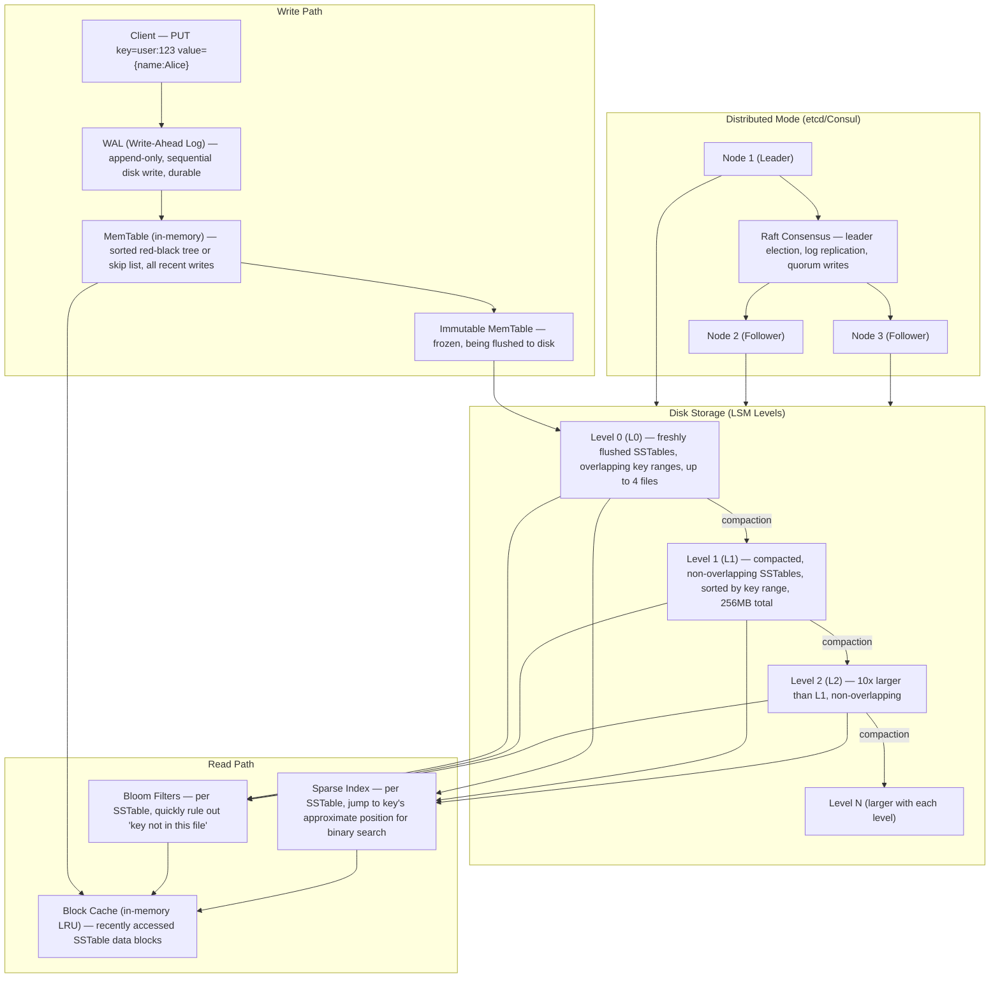
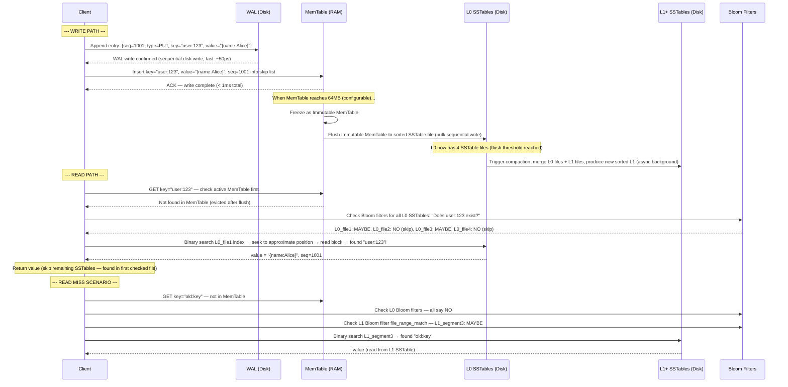
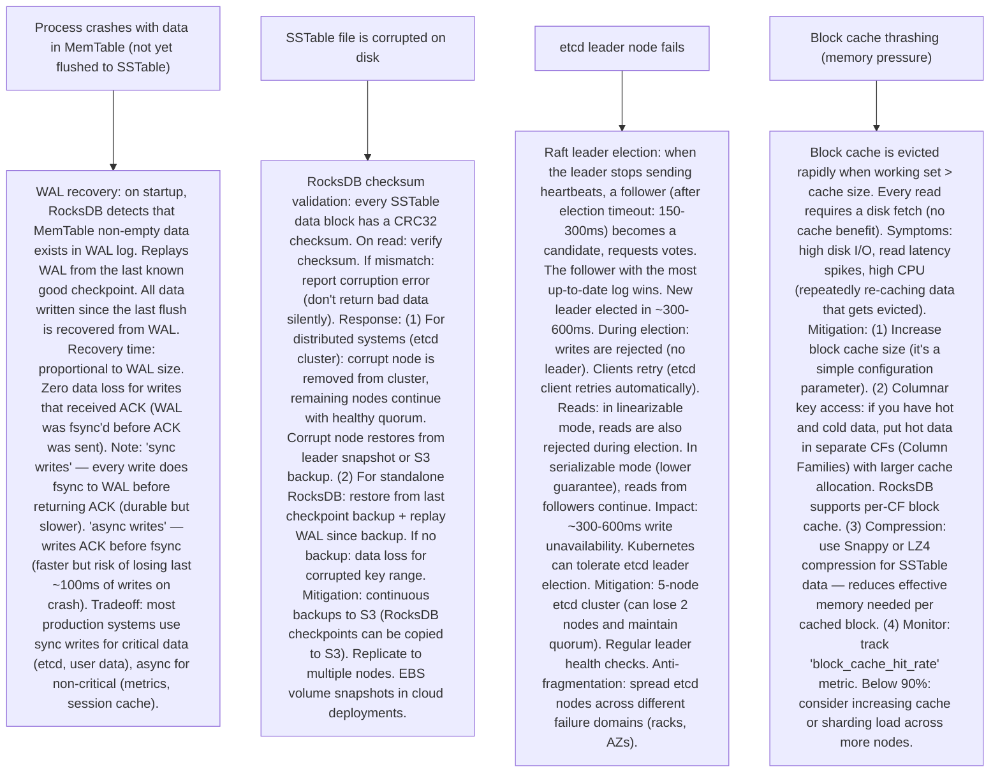

# Pattern 35 — Key-Value Store (like RocksDB, etcd)

---

## ELI5 — What Is This?

> Imagine a giant dictionary where you look up a word (key) and instantly
> get its definition (value). A key-value store is the simplest database:
> store anything with a name (key), retrieve it by name (value).
> No tables, no joins, no SQL — just: `set("user:123", "{name:Alice}")`
> and `get("user:123")`. The engineering challenge is making this work
> at hundreds of millions of gets/sets per second, with data that
> doesn't fit in RAM, while ensuring that nothing is ever lost even if
> the server crashes mid-write.

---

## Glossary (Every Keyword Explained in ELI5)

| Word | ELI5 Meaning |
|---|---|
| **LSM Tree (Log-Structured Merge Tree)** | A data structure that makes writes fast by never modifying existing data — always append. Writes go to a fast in-memory buffer (MemTable), then are flushed in bulk to disk as sorted files (SSTables). Reads search from newest to oldest file. Background compaction merges and sorts files. Used by RocksDB, Cassandra. |
| **MemTable** | The in-memory write buffer. All new writes go here first (a sorted in-memory structure, often a skip list or red-black tree). Very fast (RAM writes). When MemTable reaches a size limit, it's flushed to disk as an SSTable file. |
| **SSTable (Sorted String Table)** | An immutable, sorted file on disk. Key-value pairs written in order. Once written, never modified. Reading: binary search for the key. Since multiple SSTables exist (one per flush), a read might need to check many files. Bloom filters help skip files that definitely don't have the key. |
| **Compaction** | Background process that merges multiple SSTable files, removing deleted and overwritten entries, producing a single sorted file. Without compaction: read performance degrades (too many SSTable files to check). With compaction: fewer files, faster reads, less disk space. The trade-off: compaction I/O competes with foreground I/O. |
| **WAL (Write-Ahead Log)** | Before data is written to the MemTable, it's first appended to a sequential log file (WAL). If the process crashes before flushing the MemTable: on restart, the WAL is replayed to rebuild the MemTable. This prevents data loss on crash. |
| **Bloom Filter** | A probabilistic data structure that can answer: "Is key K NOT in this SSTable file?" with 100% certainty (no false negatives), or "key K MIGHT be in this file" (may have false positives). Use: before doing a binary search on an SSTable, check the Bloom filter. If the filter says "definitely not here," skip the file entirely. Saves expensive disk I/O. |
| **MVCC (Multi-Version Concurrency Control)** | Storing multiple versions of a value by timestamp. Enables: (1) Snapshot reads (read data as it was at a specific time, without locking writers). (2) Transaction rollback. (3) `compaction` garbage-collects old versions. RocksDB uses sequence numbers as version IDs. |
| **Raft Consensus** | An algorithm for a cluster of servers to agree on the same values. In etcd: all writes go through Raft. 3 or 5 nodes. Write is committed only when the majority (2/3, 3/5) of nodes confirm receipt. Guarantees: no data loss even if minority of nodes fail. |
| **Compaction strategy** | How SSTables are merged: Leveled (files at each level are disjoint by key range, fewer reads), Size-tiered (merge files of similar sizes, good for write-heavy). LevelDB/RocksDB default: Leveled. Cassandra: Size-tiered (good for time-series append-only writes). |
| **Cache (Block Cache)** | In-memory cache of recently read SSTable data blocks (not the full SSTable, but individual blocks). LRU-evicted. Dramatically reduces disk reads for hot keys. RocksDB's block cache can be a large fraction of available RAM. |

---

## Component Diagram

---

## Step-by-Step Request Flow

---

## Bottlenecks — Every Point Explained

| # | Bottleneck | Why It Hurts | Fix |
|---|---|---|---|
| 1 | **Read amplification: searching multiple SSTable levels** | A single GET might need to check: MemTable (miss) → L0 files (miss) → L1 files (miss) → L2 files (found). Each additional level is a disk I/O (even with Bloom filter savings). Deep LSM trees with many levels: worse read amplification. Without caching: a GET that touches 5 SSTable files = 5 disk reads = 5ms+ latency. | Block cache: cache recently accessed data blocks in RAM (LRU). Hot keys → always in cache. Bloom filters per SSTable file: 99% false-positive rate < 1% means 99%+ of "key not in file" checks are answered without disk I/O. Leveled compaction: L1+ files have non-overlapping key ranges, so at most 1 file per level needs to be checked (vs all files in size-tiered). Read performance: MemTable hit (< 0.1ms) → block cache hit (< 0.5ms) → L0 with Bloom (1-2ms) → L1 with Bloom/index (2-5ms). |
| 2 | **Write amplification: compaction rewrites data repeatedly** | LSM compaction writes data multiple times. Data written at L0 gets merged to L1, then L1 to L2, etc. In leveled compaction: write amplification = 10-30x. For a 1 TB dataset: actual disk writes over the lifetime of the data = 10-30 TB of I/O. This wears out SSDs faster, competes with foreground writes, and can cause write stalls (when compaction can't keep up with flushing). | Tune compaction: adjust `max_bytes_for_level_base`, `target_file_size_base`, and `level_multiplier` for your workload. High write throughput: size-tiered compaction (less amplification at cost of read perf). Separate SSDs: use faster NVMe SSDs for L0 and L1 (hot compaction), slower SATA SSDs for L3+. I/O throttling: limit compaction I/O rate to prevent competing with foreground writes. Write stall prevention: monitor pending compaction bytes; when approaching limit, add credit (slow down ingest rate) to prevent stall. RocksDB rate limiter: smooth compaction I/O. |
| 3 | **etcd linearizability cost: all writes go through Raft consensus** | In etcd (distributed KV for Kubernetes config), every write must achieve quorum (2 of 3 nodes confirm). This adds 1-2 network round trips. In a data center, this is ~1ms RTT × 2 = 2ms overhead per write, compared to in-process RocksDB (< 0.1ms). For large clusters (100+ nodes), etcd can't handle > 10K writes/second (documented limit). | For config store / coordination (etcd's use case): 10K ops/second is fine. Kubernetes has tested limits. Scale: shard etcd by namespace (separate etcd clusters for different Kubernetes namespaces in very large clusters). For high-throughput KV store (not coordination): use RocksDB or Redis locally, don't need consensus for all writes. Etcd key insight: don't use etcd as a general-purpose database (the Kubernetes docs say this explicitly). It's for coordination data, not user data. |
| 4 | **Hot key problem: one key gets all the traffic** | Cache invalidation hits: `product:hot_item` is GET-d millions of times / second (product page for a viral product). All requests hit the same cache entry. If the entry expires simultaneously → cache stampede (thousands simultaneous DB requests). Write hot key: all writes for `counter:pageviews` funnel to a single shard. That shard becomes a bottleneck. | Read hot key: cache stampede prevention: (1) Cache-aside with jitter on TTL (TTLs expire at different times for the same key across different servers). (2) Lock/mutex in cache: only one request re-populates the cache, others wait. (3) Probabilistic early expiration: before TTL expires, maybe refresh it. Write hot key: key sharding: instead of one `counter:pageviews`, shard across `counter:pageviews:0` through `counter:pageviews:99`. Write to a random shard, read by summing all shards. |
| 5 | **MemTable flush and L0 write stall** | When MemTable fills (every ~64MB flush), if flushes happen faster than compaction can keep up: L0 files accumulate. When L0 file count hits `level0_slowdown_writes_trigger` (20 files), RocksDB slows writes. When it hits `level0_stop_writes_trigger` (36 files), RocksDB stops writes entirely until compaction catches up. This causes write latency spikes or write errors for applications. | More parallelism in compaction: increase `max_background_compactions` (use more CPU threads for compaction). Larger MemTable + larger L0: gives more buffer time. Write rate limiting: if L0 file count > threshold, slow down client writes before hitting stop trigger (smoother degradation). Monitor: track `NumberOfFilesAtLevelN` metric. Alert at 50% of stop threshold. Dedicated compaction thread pool: isolate compaction threads from flush threads to avoid starvation. |
| 6 | **Recovery time after node restart** | On restart: RocksDB replays the WAL to rebuild the MemTable. If WAL is large (happened to be 512MB of un-flushed data): replay can take 10-30 seconds. During this time the node is unavailable. In etcd: a follower that was offline needs to replay the Raft log to catch up — can take minutes if the cluster diverged significantly. | WAL size control: smaller MemTable size = more frequent flushes = smaller WAL = faster recovery. Checkpointing: periodic full checkpoint (snapshot of current DB state to a clean directory). On restart: load from checkpoint (fast) + replay only the WAL since checkpoint (small). RocksDB supports `CreateCheckpoint()`. For etcd: Raft snapshot mechanism — if a follower is too far behind (gap > snapshot size), send a full snapshot instead of replaying each log entry. Snapshots allow catching up in one round-trip. |

---

## What Happens When Each Part Fails?

---

## Key Numbers to Know

| Metric | Value |
|---|---|
| RocksDB write throughput (single NVMe) | 500K - 1M writes/second |
| RocksDB read throughput (with block cache) | 1M - 10M reads/second |
| MemTable default size | 64MB (configurable: 64MB-256MB typical) |
| SSTable block size | 4KB (matches OS page size) |
| Bloom filter false positive rate | ~1% (10 bits per entry, typical) |
| etcd recommended max database size | 8GB |
| etcd max recommended write throughput | ~10K writes/second |
| LSM leveled compaction write amplification | 10-30x |
| WAL fsync latency (NVMe) | ~50-100µs |
| RocksDB compaction default threads | 1 flush thread, 1 compaction thread (tune to more) |

---

## How All Components Work Together (The Full Story)

A key-value store is foundational infrastructure — it powers databases, caches, message queues, and distributed coordination. Two different KV designs serve different needs:

**RocksDB (embedded, write-optimized, single-node):**
RocksDB is an embedded library (not a server). Your process links against RocksDB and calls `Put(key, value)`. RocksDB manages an LSM tree: writes go to WAL (durability) and MemTable (speed). When MemTable is full, it's sorted and written to disk as an SSTable (L0). Background compaction merges and sorts SSTables across levels (L0 → L1 → L2 → ...) to control read performance. Reads check MemTable first (newest, fastest), then go to levels from newest to oldest. Bloom filters and block cache make reads fast despite multiple on-disk levels. RocksDB is used inside: CockroachDB, TiKV, Kafka, MyRocks (MySQL + RocksDB), and hundreds of other systems as their on-disk storage engine.

**etcd (distributed, strongly consistent, consensus-based):**
etcd is a distributed KV store using Raft consensus. It's the backbone of Kubernetes (stores all cluster state: pods, services, secrets, configs). In etcd, every write is linearizable: only committed when majority of nodes confirm. This makes etcd slower than RocksDB (ms per write vs µs) but strongly consistent. etcd's data model includes: key versioning (every write is a new version, queryable), watches (real-time notification when a key changes), leases (keys that auto-expire — used for distributed locks), transactions (if-then-else atomic operations). etcd is not a general-purpose database — it's a coordination engine.

> **ELI5 Summary:** RocksDB is like a very fast personal notebook on your desk. You write things quickly (always append to the end, never erase). Sometimes you organize (compaction). Finding something old requires flipping back pages but bookmarks (Bloom filters) help you skip sections. etcd is like a synchronized shared notebook in a town hall: before any entry is official, the town council must vote (Raft). Slower but everyone in town agrees on what's written.

---

## Key Trade-offs

| Decision | Option A | Option B | Why |
|---|---|---|---|
| **LSM Tree (RocksDB) vs B-Tree (PostgreSQL, InnoDB)** | LSM: write-optimized (all writes sequential), high write throughput, higher read amplification. | B-Tree: read-optimized (in-place updates, O(log N) reads), lower read amplification, write must update pages in-place (random I/O, slower for SSD). | **LSM for write-heavy workloads** (time series, event logs, user activity): sequential writes to SSDs are faster and cause less write amplification vs random B-tree page updates. **B-Tree for read-heavy, OLTP**: consistent read performance, lower read latency. Most modern SSDs favor sequential over random even more than HDDs — this tips the scale toward LSM for write-intensive workloads. RocksDB explicitly designed for SSD characteristics. |
| **Sync WAL writes (durable) vs async WAL writes (fast)** | Sync: every write fsync's WAL before returning ACK. Zero data loss on crash. ~50-100µs overhead per write. | Async: return ACK before fsync. Bulk fsync periodically. Can lose last ~1-100ms of writes on crash. 10-20x higher throughput. | **Depends on durability requirement**: for financial data, user-generated content, etcd cluster state: sync writes required. For caches, ephemeral session data, metrics: async acceptable (easy to reconstruct lost data). RocksDB exposes `WriteOptions::sync = true/false`. In practice: batch sync writes (group commit) — group multiple writes into a single fsync, giving near-async throughput with near-sync durability. |
| **Strong consistency (Raft) vs eventual consistency** | Strong: all reads see the latest write. Requires quorum. Higher latency, lower availability under network partition. | Eventual: reads may see stale data. Higher availability (can respond even during partition). Eventually converges. | **Use case determines this fundamentally**: For coordination (distributed locks, leader election, Kubernetes cluster state): strong consistency required (etcd). For user profile cache, product catalog, session data: eventual consistency acceptable and preferred (Redis, DynamoDB). CAP theorem: in a network partition, you must choose between consistency and availability. etcd chooses consistency (CP). DynamoDB (in most configurations) chooses availability (AP). |

---

## Important Cross Questions

**Q1. Explain the LSM tree read path in detail, including Bloom filters.**
> A read for key K goes through these layers in order (stopping at first hit): (1) Active MemTable: check in-memory sorted structure (skip list) — O(log N). Usually a miss for old keys. (2) Immutable MemTables: those being flushed (recently written keys). (3) L0 SSTables: files are in order from newest to oldest. For each L0 file: check Bloom filter (is K definitely NOT in this file? → skip. Might be in? → binary search the file's sparse index, seek to block, scan block). L0 files can have overlapping key ranges — must check all L0 files. (4) L1+ SSTables: files are disjoint by key range (no overlapping). Binary search the level's file manifest to find which file contains K's range. Check that one file's Bloom filter. Binary search that file. At most one file per level. The total disk I/O for a worst-case read (not in cache, not in MemTable): O(number of L0 files + number of levels). Bloom filters make this practical by eliminating ~99% of files from consideration.

**Q2. How does etcd implement distributed locks?**
> etcd leases + compare-and-swap transactions: (1) Client A creates a lease: `Grant(TTL=10s)` → get `lease_id=abc`. (2) Client A acquires lock: `Put(key="/locks/mylock", value="client-A-host", lease=abc)` with a transaction: `if NOT EXISTS /locks/mylock THEN PUT`. This is an atomic compare-and-swap. If key doesn't exist: insert succeeds, Client A holds the lock. (3) Client A renews the lease heartbeat (KeepAlive) every TTL/3 seconds (to prevent expiry while holding lock). (4) Client B tries the same transaction: key exists → transaction fails → B is told "lock is held." B watches the key with `Watch("/locks/mylock")`. (5) Client A releases: `Delete("/locks/mylock")`. Watch event triggers. Client B retries acquisition. Lock safety: if Client A crashes (stops renewing lease), the lease expires → key auto-deleted → lock released. This prevents deadlocks from crashed holders. Fencing token: lease revision number can be used as a monotonically increasing fencing token to prevent "zombie" client actions after lock loss.

**Q3. What is RocksDB Column Family and why is it useful?**
> Column Family (CF) is a namespace within a single RocksDB instance: all keys in a CF share a MemTable, SSTable files, and compaction settings. Different CFs can have different: block cache sizes, compression algorithms, compaction strategies, TTL settings. Use cases: (1) Separate cold and hot data: small block cache for cold CF (archival data), large block cache for hot CF (recent transactions). (2) Per-tenant isolation in a multi-tenant system: each tenant gets a CF — their data is compacted and cached independently. (3) Different value types: user data in one CF (keep all versions), metadata in another (only keep latest version). CFs share the WAL and DB lock — they are not separable databases, just namespace isolation within one RocksDB instance. In TiKV (the storage layer of TiDB): "default" CF stores user data, "write" CF stores transaction metadata, "lock" CF stores transaction locks — completely different access patterns, each tuned independently.

**Q4. How does RocksDB handle transactions (for ACID semantics)?**
> RocksDB provides OptimisticTransactionDB and TransactionDB: (1) OptimisticTransactionDB: reads don't lock anything. At commit time, check if any key was modified by another writer since the read. If yes: conflict, rollback (optimistic: assume no conflict, verify at commit). Good for low-contention workloads. (2) TransactionDB (pessimistic): takes row-level locks when writing a key within a transaction. Other transactions waiting for the same key must wait (like SELECT FOR UPDATE). Write-write conflicts are prevented. Both support: `BeginTransaction()`, `Put/Get/Delete within transaction`, `Commit()` or `Rollback()`. MVCC: reads within a transaction see a consistent snapshot (sequence number at transaction start). This is how CockroachDB builds full ACID transactions on top of RocksDB: each CockroachDB node uses an embedded RocksDB with transactions. CockroachDB adds distributed transaction coordination (2PC with Raft) on top.

**Q5. How does etcd's watch mechanism work, and how is it used by Kubernetes?**
> etcd Watch is a long-lived streaming connection: client sends `Watch(key_prefix)`, etcd pushes all future changes to that prefix. Implementation: (1) Watch maintains a channel from the etcd server to the client over gRPC stream. (2) Every write to etcd increments a global revision number. (3) Watch subscriptions track "last seen revision." When a key matching the watch prefix is modified: etcd sends a WatchEvent to all watching clients with the new value and revision. (4) If client disconnects and reconnects: it resumes from its last seen revision (no missed events if within the configurable history window). Kubernetes usage: the kube-apiserver watches all relevant etcd prefixes (`/registry/pods/`, `/registry/services/`, etc.). Whenever a pod spec changes (etcd write), the watch event triggers kube-scheduler and kubelet updates. Every Kubernetes controller (Deployment controller, Service controller, etc.) runs a watch loop that reacts to relevant resource changes. This is the event-driven control loop at the heart of Kubernetes reconciliation.

**Q6. How do you design a key-value store for 1 billion keys that don't fit in RAM?**
> This is exactly RocksDB's use case. Design principles: (1) LSM tree as described — data is on disk, MemTable + block cache serve hot data from RAM. (2) Tiered storage: HDD for cold levels (L3+), NVMe for hot levels (L0, L1). LT compression: cold levels use Zstd (high ratio), hot levels use LZ4 (fast). (3) Block cache sizing: allocate 10-30% of available RAM to RocksDB block cache. With 256GB RAM: 64GB block cache. Block size = 4KB. 64GB / 4KB = 16 million blocks cached. At 1KB average value: 16 billion values cached — serves very high cache hit rates if working set < cache. (4) Bloom filter memory: 10 bits per key × 1 billion keys = 10 billion bits = 1.25GB RAM for all Bloom filters. Critical investment — prevents unnecessary disk reads. (5) Partitioning: if single RocksDB can't handle throughput: partition keys across multiple RocksDB instances (shards). Consistent hashing or range partitioning. Each shard on its own CPU core + SSD. DynamoDB internally shards across RocksDB-equivalent storage nodes (exactly this pattern).

---

## Real-World Apps That Use This Pattern

| Company | Product | How They Use It |
|---|---|---|
| **Meta/Facebook** | RocksDB (MyRocks, ZippyDB) | Created RocksDB (2013, based on LevelDB). Used at massive scale: MyRocks replaces InnoDB for MySQL storage (50% less storage for same data). ZippyDB: distributed KV built on RocksDB, 100s of billions of keys, used for social graph edges, notification storage. UDB (user database): billions of user records on RocksDB. Upstream contributor to RocksDB open-source project. |
| **Kubernetes / CNCF** | etcd | Every production Kubernetes cluster runs etcd. Stores all cluster state: pod definitions, service configs, secrets, ConfigMaps. Multi-AZ etcd clusters for HA. etcd v3 uses gRPC API (v2 was HTTP). Known limitations: not suitable for > 8GB data or > 10K writes/second — Kubernetes recommends not storing user data in etcd. Large clusters (10K+ nodes) use etcd federation. |
| **PingCAP** | TiKV (underlying TiDB) | Distributed KV store built on RocksDB with Raft consensus. Each Region (shard) = 3-5 RocksDB nodes with Raft for consistency. TiDB SQL layer queries TiKV. Powers production databases at TikTok, JD.com (billion+ keys). Multi-Raft: thousands of independent Raft groups, one per region (shard). Fully ACID distributed transactions using Percolator protocol on top of TiKV. |
| **Apache** | Kafka Log Storage | Kafka brokers use RocksDB (in recent Kafka versions, KRaft mode) for storing broker metadata. Each Kafka partition is essentially a log segment — stored as append-only files on disk (LSM-like sequential writes). Kafka's own log format predates RocksDB but shares key design principles (sequential writes, segment-based storage, compaction). |
| **HashiCorp** | Consul | Service mesh + service discovery KV. Uses Raft consensus (similar to etcd) for cluster coordination. Store: service health status, feature flags, distributed locks, cluster membership. SQL-like query language for KV (HCL expressions). Alternative to etcd in environments not running Kubernetes. |
