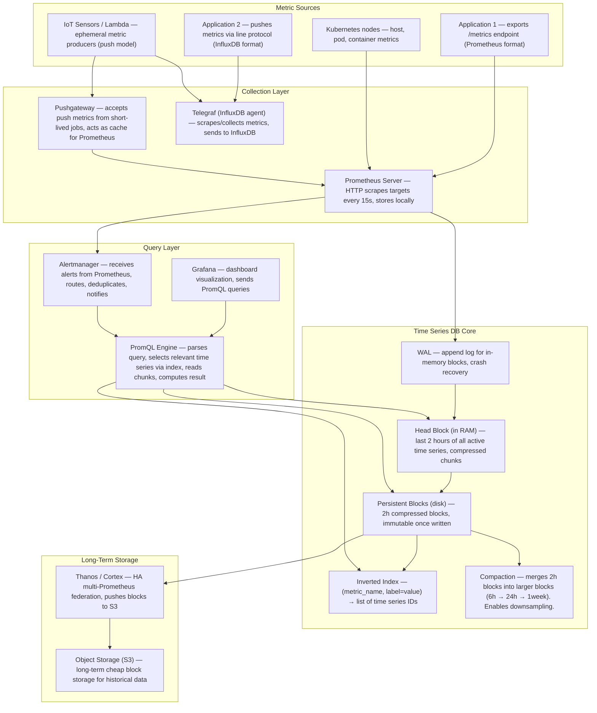
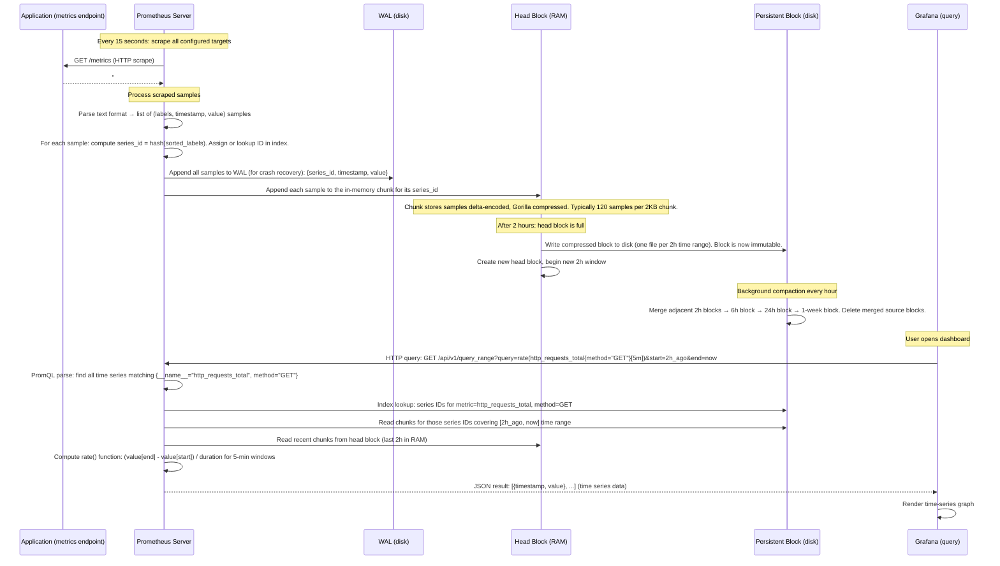
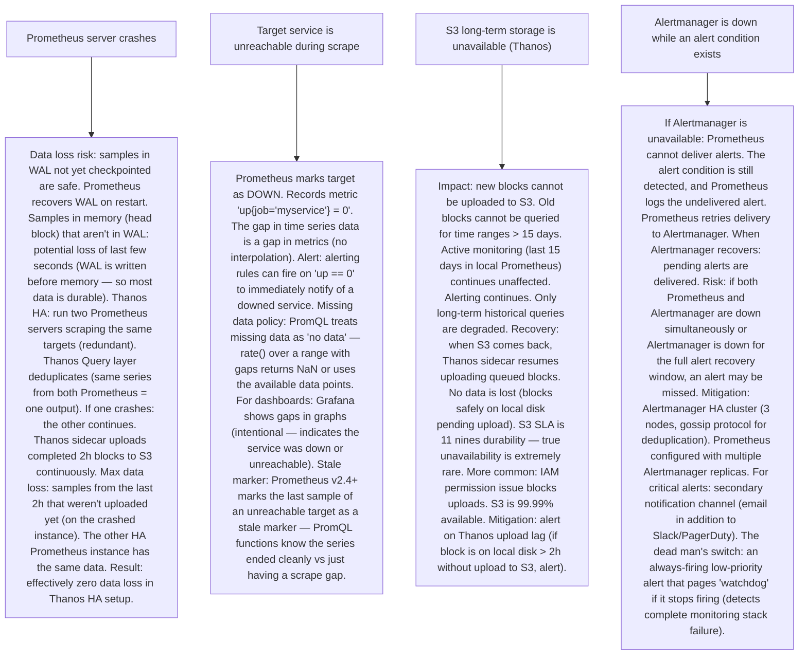

# Pattern 36 — Time Series Database (like InfluxDB, Prometheus)

---

## ELI5 — What Is This?

> Imagine taking your temperature every hour and recording it in a notebook:
> "9am: 98.6°F, 10am: 99.1°F, 11am: 100.4°F..."
> That's a time series — the same measurement, taken repeatedly over time.
> A time series database is built for exactly this: storing billions of these
> timestamped measurements and answering questions like "What was the average
> CPU usage last week?" or "Alert me when temperature exceeds 102°F."
> Traditional databases are terrible at this because they're not optimized
> for time-ordered sequential writes, aggressive data compression, and
> time-range queries. A TSDB is purpose-built for metrics, monitoring, and
> sensor data — the firehose of time-stamped numbers that modern systems emit.

---

## Glossary (Every Keyword Explained in ELI5)

| Word | ELI5 Meaning |
|---|---|
| **Time Series** | A sequence of (timestamp, value) pairs for a specific metric. Example: CPU usage for server "prod-web-01" measured every 15 seconds. Each unique combination of (metric_name + label set) is one time series. |
| **Metric** | A named, numeric measurement. `http_requests_total`, `cpu_usage_percent`, `temperature_celsius`. Always a number (float64). |
| **Label (Tag)** | Key-value metadata attached to a metric. `{host="prod-web-01", region="us-east-1", env="prod"}`. Labels differentiate different time series for the same metric. High cardinality labels (user_id) = millions of unique time series = danger. |
| **Cardinality** | The number of unique time series. If metric `http_requests_total` has labels {host, path, method, status}, and you have 100 hosts × 1000 paths × 5 methods × 5 statuses = 2.5 million unique time series. High cardinality → memory explosion (Prometheus stores active series in RAM). |
| **Scrape / Push** | Two models for ingesting metrics. Scrape (Prometheus model): the TSDB HTTP-pulls metrics from applications at fixed intervals. Push (InfluxDB, Graphite model): applications send metrics to the TSDB. Scrape: TSDB controls timing, easier to detect down services. Push: simpler for short-lived jobs or IOT devices. |
| **Time Series Block / Chunk** | Compressed storage unit. Multiple samples from the same time series are grouped into a chunk. Delta encoding: store the difference between consecutive timestamps (more compressible than full timestamps). For typical metrics: 1-2 bytes per sample (vs 16 bytes raw). |
| **Delta-Delta Encoding** | Gorilla paper optimization: the difference between timestamp deltas is usually 0 (steady 15s interval). Encode: 0 = 00 bits, small delta = a few bits. Second value delta: store XOR of consecutive float values (similar floats → small XOR → highly compressible). Reduces typical TSDB storage from 16 bytes/sample to 1.37 bytes/sample. |
| **PromQL** | Prometheus Query Language. Functional query language for time series. `rate(http_requests_total[5m])` — per-second rate over 5 minutes. Supports: aggregation (sum, avg, max, by label), instant vector vs range vector, built-in functions (increase, histogram_quantile, predict_linear). |
| **Retention Policy** | Data kept at different granularities over time. Example: raw data for 15 days. 1-minute aggregates for 6 months. 1-hour aggregates for 2 years. Older data is downsampled (rolled up), reducing storage 60x for daily → hourly. |
| **Alerting Rule** | A PromQL expression evaluated periodically. If expression result exceeds threshold: fire alert to Alertmanager → send PagerDuty/Slack notification. `sum(rate(http_5xx_total[5m])) by (service) > 10` = alert when error rate > 10/s per service. |

---

## Component Diagram

---

## Step-by-Step Request Flow

---

## Bottlenecks — Every Point Explained

| # | Bottleneck | Why It Hurts | Fix |
|---|---|---|---|
| 1 | **High cardinality label sets — memory explosion** | Prometheus keeps all active time series in RAM (head block). Each unique label combination = one time series. A metric with labels `{user_id, endpoint, method, status}` at a company with 10M users × 100 endpoints × 5 methods × 10 status codes = 50 billion time series. Prometheus head block needs ~1KB per active series minimum. 50 billion × 1KB = 50 PB RAM required. Impossible. | Cardinality discipline: never use high-cardinality values as labels (user_id, request_id, session_id, IP address). These make cardinality unbounded. Rule: labels should describe dimensions of aggregation, not unique identifiers. Fix: instead of labeling per user_id, sample and aggregate before emitting to Prometheus. If specific per-user metrics are needed: Loki (log aggregation) + metrics derived from logs (via LogQL). Prometheus active series limit: configure `--storage.tsdb.retention.size` and monitor `prometheus_tsdb_head_series` metric — alert if growing unboundedly. |
| 2 | **Single Prometheus server vertical limits** | A single Prometheus instance can handle ~10 million active time series and ~1 million samples/second (depending on RAM). An organization with many services and millions of hosts can exceed this limit. Also: Prometheus doesn't natively replicate, so it's a SPOF. | Sharding + federation: (1) Prometheus federation: multiple Prometheus servers each scrape a subset of targets. A federated Prometheus scrapes aggregate metrics from the others. (2) Thanos / Cortex / VictoriaMetrics: solutions for global view + HA. Thanos runs as a sidecar next to each Prometheus, uploads blocks to S3. A global Thanos Query layer reads from S3 and all Prometheus instances simultaneously — transparent multi-Prometheus view. (3) VictoriaMetrics: a more scalable alternative to Prometheus with built-in clustering, handles billions of time series. (4) Cortex: horizontally scalable Prometheus-compatible TSDB with multi-tenant support. |
| 3 | **Scrape interval vs metric freshness** | 15-second scrape interval means metrics are at most 15 seconds stale. For alerting on a cascading failure: 15 seconds can feel slow. Reducing to 5 seconds: 3x more scrapes, 3x more network traffic, more CPU for scraping and ingestion. Trade-off: freshness vs resource cost. | Context-dependent scrape intervals: most metrics: 15s. Critical SLO metrics (error rate, latency P99): 5s. Infrastructure metrics (disk, memory): 30s or 1 minute. Prometheus supports per-job `scrape_interval` override. For sub-second latency tracking: use exemplars (OpenTelemetry traces linked to metrics) rather than high-frequency scrapes. Push-based metrics (StatsD, DogStatsD): can aggregate locally and push more frequently without full scrape overhead. |
| 4 | **Long-term storage cost: raw metrics are expensive** | Keeping 2 years of raw 15-second metrics for 100K time series: 100K series × (2years / 15s) samples × 1.37 bytes/sample ≈ 600GB/year. That's raw Prometheus local storage — Prometheus default retention is only 15 days (exactly because of storage pressure). Long-term raw data on S3 is cheaper but still non-trivial at petabyte scale. | Downsampling (aggregation over time): keep raw data for 15 days (Prometheus local). In Thanos/VictoriaMetrics: after 15 days, downsample to 5-minute resolution. After 3 months: downsample to 1-hour resolution. After 1 year: daily resolution only. Storage reduction: raw → 5min = 20x. 5min → 1hr = 12x. 1hr → daily = 24x. Total: 20 × 12 × 24 = 5,760x reduction for 2-year data vs raw. Acceptable loss: for hourly anomaly detection, hourly resolution is sufficient. For "what was happening at 2:30am 6 months ago": you'd need raw data — that's the trade-off. Store raw data only for recent history. |
| 5 | **Query performance for large time ranges** | PromQL `rate(http_requests_total[1y])` over 100K time series would need to read an entire year of chunks. Cold read (not in page cache): each 2h block is ~10MB → 365 × 12 blocks/day = 4,380 blocks × 10MB = 43GB of data read for one wide query. Takes minutes. | Block index on object storage: Thanos/Cortex store a block index file (downloaded before query, cached in memory). The index contains: which series are in each block and their time ranges. A query for "last month" only reads blocks covering the last month — not all-time blocks. Chunk caching: frequently queried blocks are cached in Redis or Memcached (placed in front of S3). Index caching: Thanos index cache in Redis. Pre-aggregated recording rules: define PromQL recording rules to precompute expensive aggregations (e.g., `cpu:avg_by_region:1m = avg by (region) (rate(cpu_usage[1m]))`). Store as a new time series. Later queries use the pre-computed series — 10,000x fewer series to aggregate. |
| 6 | **Clock skew between metrics sources** | Metrics from multiple services scraped at different times. One scrape at T=0, another at T=2s. When the query aggregates both at "T=0", one metric is 2 seconds stale. For rate calculations, this creates slight inaccuracies. Multi-datacenter metrics: clocks can differ by hundreds of milliseconds. | Prometheus inherits this limitation by design. Mitigation: Prometheus uses scrape timestamp (when scrape completes, not when metrics were sampled). For cross-service correlation: use distributed tracing (Jaeger/Tempo) with exemplars rather than relying on metric timestamps. For highly accurate clock synchronization across hosts: AWS Time Sync Service, GPS-disciplined NTP servers. For most monitoring use cases: ±1 second accuracy is acceptable. Critical: ensure NTP on all hosts has < 1-second drift. Alert on significant time drift (node_timex_offset_seconds Prometheus metric). |

---

## What Happens When Each Part Fails?

---

## Key Numbers to Know

| Metric | Value |
|---|---|
| Prometheus typical sample compression | ~1.37 bytes/sample (Gorilla encoding) |
| Raw sample size without compression | 16 bytes (8 byte timestamp + 8 byte float64) |
| Prometheus default local retention | 15 days |
| Prometheus scrape interval (default) | 15 seconds |
| Prometheus head block window in RAM | Last 2 hours |
| InfluxDB line protocol write throughput | Millions of points/second |
| Thanos query fan-out (global view) | Unlimited Prometheus instances |
| PromQL instant query max data points | ~11M points per query (configurable) |
| Practical Prometheus scale (single server) | ~10M active time series, ~1M samples/sec |
| Cardinality practical limit (Prometheus) | ~10M unique time series per instance |

---

## How All Components Work Together (The Full Story)

A time series database is purpose-built for an access pattern that general databases handle poorly: write-many (billions of samples per day), read-recent (most queries touch last hour/day), compress well (metrics are numeric, regular, have deltas), and expire-old (data older than N days is less valuable).

**The Prometheus write path:**
Scraping: every 15s, Prometheus sends HTTP GET to every target's `/metrics` endpoint. The response is a text format: `metric_name{label1="val1", label2="val2"} value timestamp`. Prometheus parses this, hashes each label set to a series ID, and appends each sample to: (1) WAL (crash recovery) and (2) head block's in-memory chunk for that series. The head block holds the last 2 hours of all active series in RAM. After 2 hours: the head block's chunks are serialized to a compressed block file on disk.

**Gorilla compression:**
Named after Facebook's Gorilla paper (2015), used in Prometheus. Key insight: metrics are mostly regular. CPU usage at T+15s is close to T. So: store the delta of the timestamp (usually exactly 15s = constant → encodes in just 1 bit for the common case). Store XOR of consecutive float values (similar values → XOR is small → encodes in a few bits). Result: 1.37 bytes/sample vs 16 bytes raw = 12x compression.

**The query path:**
PromQL evaluates by: (1) Finding matching series IDs via the inverted index (label → series ID mapping). (2) Reading the relevant time range from chunks (head block + disk blocks). (3) Computing the function (rate, sum, histogram_quantile) over the decoded data.

> **ELI5 Summary:** Prometheus is like a nurse who checks every patient's vitals every 15 seconds (scrape), writes them in a compact shorthand notebook (Gorilla encoding), and stores recent readings on their clipboard (head block in RAM) and older ones in organized folders (SSTable blocks on disk). When a doctor asks "what was patient's pulse last 6 hours?" (query), the nurse checks the clipboard and folders (no raw vitals — just the compressed deltas). Grafana is the monitor screen the doctor reads. Alertmanager is the alarm that sounds when vitals go critical.

---

## Key Trade-offs

| Decision | Option A | Option B | Why |
|---|---|---|---|
| **Push vs Pull (scrape) model** | Pull (Prometheus): TSDB controls what gets scraped and when. Detects unreachable targets (up=0). Simpler service discovery. Doesn't require outbound from service to TSDB. | Push (InfluxDB, StatsD): services send metrics whenever they want. Works inside firewalls where TSDB can't reach services. Works for short-lived processes (Lambda functions). | **Pull for microservices / Kubernetes**: service discovery is automatic (Kubernetes SD). Easy to see which services are UP. Doesn't require service modification for timing. **Push for ephemeral/serverless**: a Lambda function that runs for 200ms can't be polled — it must push before it exits. Push also useful for high-frequency custom metrics (send 1000x/s from a game server). Real-world: Prometheus for infrastructure metrics, InfluxDB/StatsD for app-side custom metrics + business KPIs. Most large companies use both. |
| **Local storage (Prometheus) vs global long-term store (Thanos/Cortex)** | Local: simple, fast, no external dependencies. Single Prometheus, single point of truth. Limited retention (disk). Single server capacity limit. | Global (Thanos/Cortex): multi-region/multi-cluster view, unlimited retention (S3), HA. Added operational complexity. | **Local for small-medium scale** (< 5M series, single cluster): Prometheus + Alertmanager is operationally simple and very reliable. **Global for large scale**: when you have 10+ clusters, want > 1-year retention, or need cross-cluster queries — Thanos or Cortex is necessary. Most mid-to-large tech companies use Thanos or Cortex. Cloud providers offer fully managed solutions (GCP Cloud Monitoring, AWS AMP = Amazon Managed Prometheus). |
| **Downsampling old data vs keeping raw data forever** | Downsample: after N days, aggregate to 5-minute, then 1-hour resolution. Massive storage savings (5,760x for 2-year data). Can't do sub-5min analysis on data > N days. | Keep raw: full resolution forever. Much more storage cost. Complete historical analysis available. | **Downsample is almost always the right choice**: use cases for 15-second resolution data from 2 years ago are extremely rare and don't justify 5,760x storage cost. Keep rule: raw for 15 days (active incidents), 5-min for 90 days (quarterly reviews), 1-hour for 2 years (annual trend analysis), daily forever (business KPIs). The key is to define these policies upfront — retroactive downsampling loses data that may not be needed now but could be useful later. |

---

## Important Cross Questions

**Q1. How does Prometheus handle long-duration query scans efficiently (e.g., last 6 months)?**
> Block-based storage makes this tractable: Prometheus (and Thanos) stores data in immutable 2h block files. A query covering 6 months must read 6months × 30days × 12blocks/day = 2,160 blocks. Each block has an index (downloaded once per query, cached). The PromQL engine uses the block index to: (1) Find which series are in each block (by label). (2) Skip blocks that don't contain matching series. (3) For each relevant block: seek directly to the correct chunk (using the MinMaxTime of the block = skip entire block if query range doesn't intersect). (4) Decompress and process. Optimization: recording rules precompute expensive aggregations as new time series (e.g., hourly aggregated CPU by region). A 6-month query on the precomputed series reads 6 months × 1 point/hour = 4,380 points instead of 6 months × 4 points/minute = 1,051,200 points. 240x faster. Recording rules are critical for dashboard performance.

**Q2. How does cardinality control prevent memory explosions in Prometheus?**
> Prometheus keeps the head block (last 2h) and the series index entirely in RAM. Memory per active series: ~1-2KB (chunk overhead + index entry). At 10M series × 2KB = 20GB RAM just for the head block. Active series = series that received at least one sample in the current head block window. Series that stop receiving data become "stale" after the head window expires and are removed from RAM. Prevention: (1) Label governance: never use `{user_id, request_id, trace_id}` as Prometheus labels (unbounded cardinality). Use logging/tracing for per-request data. (2) Metric naming convention: namespace metrics (`app_http_requests_total` not just `requests_total`). Limit label values to known, bounded sets (status codes, HTTP methods, region names). (3) Cardinality alerts: alert on `increase(prometheus_tsdb_head_series[1h]) > 10000` (sudden series growth = someone added a high-cardinality label). (4) Relabeling: Prometheus can drop high-cardinality labels before ingestion with `metric_relabel_configs`.

**Q3. What is the difference between counter, gauge, histogram, and summary in Prometheus?**
> Four metric types: (1) Counter: monotonically increasing value (only goes up, resets to 0 on restart). Example: `http_requests_total`. Use `rate()` or `increase()` to compute per-second rates. (2) Gauge: can go up and down. Current value. Example: `memory_usage_bytes`, `queue_size`. Use as-is or with `delta()`. (3) Histogram: tracks the distribution of observed values across configurable buckets. Example: `http_request_duration_seconds_bucket{le="0.5"}` = requests that completed in ≤ 0.5s. Use `histogram_quantile(0.99, rate(metric_bucket[5m]))` to compute P99 latency. (4) Summary: similar to histogram but computes quantiles client-side (in the application code). Quantiles are not aggregatable across instances (can't average P99 across services). Use histogram instead of summary for any multi-instance use case. Summary is only appropriate when you need accurate per-instance quantiles and won't aggregate. Histogram is almost always preferred.

**Q4. How does InfluxDB differ from Prometheus architecturally?**
> Key differences: (1) Data model: InfluxDB line protocol: `measurement,tag1=val1,tag2=val2 field1=1.2,field2=3.4 timestamp`. Multiple fields per measurement (vs Prometheus: one numeric value per time series). InfluxDB supports non-numeric fields (strings). (2) Write model: push-based (applications or Telegraf agents push data over UDP or HTTP). Prometheus is pull-based. (3) Query language: InfluxQL (SQL-like) or Flux (functional, more powerful). Prometheus: PromQL (powerful but Prometheus-specific). (4) Storage: InfluxDB uses TSM (Time-Structured Merge tree, inspired by LSM). Data is organized by retention policies and shards (time-range shards, discarded on expiration). (5) Scale: InfluxDB Enterprise supports clustering (not open-source). InfluxDB Cloud is a fully managed multi-tenant SaaS. Prometheus is simpler, single-server; scale via Thanos. (6) Use case: InfluxDB is more general-purpose time series (IoT, business metrics, custom app metrics with complex field structures). Prometheus is specifically designed for monitoring infrastructure and applications.

**Q5. How do you design alerting to avoid alert fatigue?**
> Alert fatigue = too many noisy, unactionable alerts → on-call engineers ignore alerts → critical alerts missed. Design principles: (1) Alert on symptoms, not causes: alert on `5xx error rate > 5% for 5 minutes` (user-visible symptom), not `pod CPU > 80%` (internal cause, may not affect users). (2) Multi-window alerting: use multiple burn rates to catch both fast-burning incidents (immediate page) and slow-burning reliability erosion (ticket). Google SRE error budget burn rate alerting. (3) Alert deduplication in Alertmanager: group related alerts (all alerts for the same service to one page). Inhibition rules: if "service down" alert fires, suppress dependent "high latency" alerts from same service. (4) Silences: for planned maintenance, silence expected alerts for a time window. (5) Alert routing: critical → PagerDuty (wake someone up). Warning → Slack (investigate when available). (6) Review and prune quarterly: track alert volume and false positive rates. Remove or adjust alerts that rarely lead to action.

**Q6. Explain how Thanos achieves global query across multiple Prometheus instances.**
> Thanos global view: (1) Thanos Sidecar runs next to each Prometheus pod. It: (a) exposes Prometheus's data over gRPC (thanos-store API), (b) uploads completed 2h blocks to S3. (2) Thanos Store Gateway accesses historical blocks in S3 (older than 2h). Also exposes gRPC thanos-store API. (3) Thanos Query is a stateless component that fans out queries to all Thanos Sidecars and Store Gateways in parallel. It merges results, deduplicates (same time series from multiple Prometheus = keep one). The query is executed at each store independently, results are merged at Thanos Query. (4) Thanos Compactor runs against S3 data: performs compaction and downsampling of historical data. Non-serving (doesn't receive queries). (5) Thanos Ruler: evaluates alerting + recording rules across the global view (not just single Prometheus scope). This architecture: Prometheus retains local fast data (2 weeks). S3 retains full history. Any historical or cross-cluster query works transparently with PromQL. No changes to Grafana/Alertmanager needed — they talk to Thanos Query as if it were Prometheus.

---

## Real-World Apps That Use This Pattern

| Company | Product | How They Use It |
|---|---|---|
| **Prometheus / CNCF** | Prometheus | The de facto standard for cloud-native monitoring. Part of CNCF. Scrapes Kubernetes metrics natively. Used by: Google, Netflix, Stripe, Uber, GitHub, Zalando, and virtually every cloud-native company. Grafana + Prometheus is the most common monitoring stack. Community has 100K+ recording rules, dashboards, and exporters. |
| **InfluxData** | InfluxDB + Telegraf | Used by Tesla (vehicle telemetry), NASA (spacecraft sensor data), PayPal (business metrics). InfluxDB Cloud is multi-tenant fully managed TSDB. Telegraf: 300+ input plugins for collecting metrics from databases, cloud providers, IoT sensors. Flux language enables powerful time series analysis. |
| **Grafana Labs** | Mimir (scalable Prometheus) + Grafana | Grafana Mimir: horizontally scalable, multi-tenant Prometheus-compatible TSDB. Handles billions of active time series where single Prometheus can't. Grafana Cloud runs on Mimir. Open-source. Used by large enterprises needing unlimited scale without Thanos operational complexity. |
| **Meta (Facebook)** | Gorilla + Scuba | Gorilla (2015 VLDB paper): in-memory TSDB for recent operational metrics (last 26 hours). Gorilla's 12x compression through delta-delta + XOR encoding is adopted by both Prometheus and InfluxDB. Scuba: ad-hoc log analysis at Facebook scale, billions of events/day queryable in seconds. |
| **Datadog** | Metrics Platform | Commercial TSDB + APM as a service. Accepts StatsD, DogStatsD, OTEL metrics. 500B+ metrics per day (as of 2022). Custom in-house TSDB (not Prometheus). Tag-based queries. Correlated metrics + logs + traces in one UI. 3,000+ integrations. Used by Netflix, Samsung, Shopify, Slack. |
