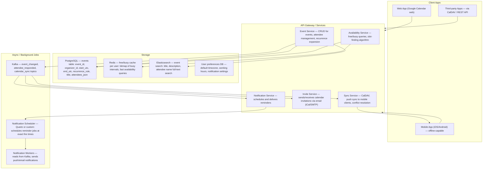
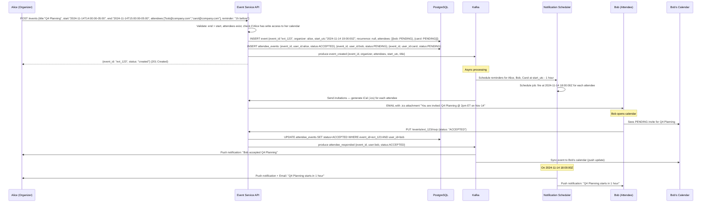
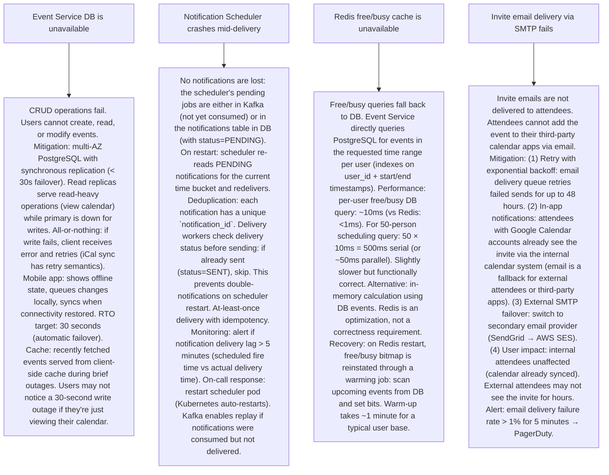

# Pattern 37 — Calendar and Scheduling System (like Google Calendar)

---

## ELI5 — What Is This?

> You want to book a meeting with three colleagues at 2pm on Thursday.
> But you don't know if they're free. A calendar system shows everyone's
> availability, finds a time slot where all four of you are free,
> lets you create an event, sends them an invite, reminds everyone an
> hour before, and handles all the chaos when someone reschedules.
> Sounds simple — but do this for 1 billion users across every timezone,
> handle recurring events (every 2nd Tuesday), conflicts, group scheduling,
> resource booking (conference room + Zoom link), and ensure a calendar
> update you made on your phone instantly appears on your laptop. That's
> the engineering challenge.

---

## Glossary (Every Keyword Explained in ELI5)

| Word | ELI5 Meaning |
|---|---|
| **Event** | A calendar entry: has title, start_datetime, end_datetime, description, location, organizer, attendees, recurrence_rule, status (confirmed/tentative/cancelled). |
| **Attendee Status** | Each attendee's response to an event: Accepted, Tentatively Accepted, Declined, Awaiting Response. The organizer sees these status states per person. |
| **Recurrence Rule (RRULE)** | Standard format (RFC 5545 iCalendar) for repeating events. "Every weekday", "Monthly on the last Friday", "Weekly every Monday/Wednesday/Friday until Dec 31". RRULE is a compact string that generates an infinite or bounded set of event occurrences. Expanding recurrences is computationally non-trivial. |
| **iCalendar (iCal, .ics)** | The RFC 5545 standard format for calendar data. Events, timezones, invites all encoded in this format. CalDAV is the protocol for syncing iCal-formatted data between clients and servers. An `.ics` file can be imported into any calendar app. |
| **CalDAV** | Calendar Distributed Authoring and Versioning — WebDAV extension for calendar synchronization. Protocol used by Apple Calendar, Thunderbird, and other apps to sync with servers. Alternative: proprietary APIs (Google Calendar API, Microsoft Graph API for Outlook). |
| **Free/Busy** | A simplified view of a calendar: just the time ranges when a person is busy (no event details, just availability blocks). Used for scheduling: "Show me when Alice, Bob, and Carol are all free next week." |
| **Timezone** | Every event's start and end time is tied to a timezone. UTC storage + timezone label in the event. Displaying event times requires timezone conversion. Recurring events: "Every Monday at 9am ET" must handle DST transitions (in spring, one occurrence shifts). This is one of the hardest parts of calendar systems. |
| **Notification** | A reminder: "Meeting starts in 10 minutes." Implemented as a scheduled async job. For 1B calendar events × average 2 reminders = 2 billion notification jobs that must fire at the right time. |
| **Conflict** | Two events with overlapping time ranges on the same calendar. The system can warn about conflicts but typically doesn't block creating them (unlike room booking where a physical room can only host one event). |
| **Room/Resource Booking** | Conference rooms, equipment, parking spots can be booked like events. Each resource has a "resource calendar." A room is "busy" when booked. Booking conflict = request declined. These are the only truly exclusive conflicts in calendar systems. |

---

## Component Diagram

---

## Step-by-Step Request Flow

---

## Bottlenecks — Every Point Explained

| # | Bottleneck | Why It Hurts | Fix |
|---|---|---|---|
| 1 | **Recurrence expansion is expensive** | An event with `RRULE:FREQ=WEEKLY;BYDAY=MO;UNTIL=20260101` generates 52+ event occurrences per year. Storing each occurrence separately: 52 rows per recurring event × 1B users × avg 5 recurring events = 260B rows. Querying "what events does Alice have this week?" with stored occurrences: fast. But creating a recurring event: must insert 52 rows atomically. Modifying one occurrence ("just this occurrence" vs "all future occurrences") = complex update. | Don't pre-expand: store the master recurring event once with the RRULE. At query time: expand recurrences for the requested time window. "Get Alice's events for November": expand the RRULE to generate November occurrences on the fly (computation, not DB row scan). Trade-off: read expansion is O(recurrence instances in window), but avoids O(all future occurrences) storage. Materialized view for performance: for recurring events queried often, cache expanded occurrences in a Redis sorted set (score = UTC timestamp). Expire after the time window passes. "This and following" modification: create a new master event, set UNTIL date on the old event to the modification point. |
| 2 | **Free/busy queries across many users for scheduling** | "Find a 1-hour slot next week when Alice, Bob, Carol, David, and Eve are all free." Naively: fetch all 5 calendars for the next week, expand recurring events, find overlap. If each person has 50 events per week: 5 people × 50 events = 250 event records. Plus recurrence expansion. This is a set-intersection problem. At scale (scheduling across a 50-person meeting at a large org): 50 calendars × 50 events = 2,500 DB reads. | Precomputed free/busy bitmap: for each user, maintain a Redis bitfield (or sorted set) of busy time slots (rounded to 15-minute intervals). "Mark slot 14:00-14:15 UTC on 2024-11-14 as busy" = set a bit in a per-user per-day bitfield. Free/busy query for N users for D days: N Redis GETBIT operations per time slot, O(D × 96 slots/day × N) operations. For a 5-day window: 5 × 96 × 50 people = 24,000 bit-AND operations. Redis BITOP AND key user1 user2 user3 ... finds common free slots in a single operation. Slot-finding: O(free slots in window) scan after BITOP AND. Cache invalidation: when an event is created/modified, update the free/busy bitmap for affected users. |
| 3 | **Notification delivery at scale** | 1 billion calendar events, average 2 reminders each = 2 billion notification jobs. Each job must fire within ±30 seconds of the scheduled time. At 10M users each with 20 upcoming events and 2 reminders each: 400M notification jobs queued. Storing all in a single table and polling it: millions of DB queries per second to check "is it time yet?" | Time-partitioned notification queue: partition by firing time bucket (5-minute buckets). For the "current bucket" (firing in next 5 minutes): pull all notifications from that bucket and enqueue to Kafka for immediate delivery. For future buckets: sit in storage (not polled). Design: notifications table partitioned by day. A scheduler job runs every 30 seconds and queries only the current 5-minute bucket (tiny subset). Fires to Kafka → worker pool delivers push + email. For very large scale: use a dedicated scheduling service (Quartz cluster or Apple's push notification service which handles the scheduling problem internally). |
| 4 | **Timezone handling for recurring events across DST transitions** | "Every Monday at 9am New York time." On the 2nd Sunday in March (DST spring forward), clocks go from 2am → 3am. The next occurrence is still "9am New York time" — but in UTC, that's now 14:00 UTC instead of 15:00 UTC. If we stored "fire at 14:00 UTC every Monday starting March," the first occurrence (before DST) would be at the wrong UTC time. | Store in local time with timezone label, not UTC: `DTSTART;TZID=America/New_York:20240101T090000`. The recurrence rule generates occurrences in the named timezone. When computing each occurrence's UTC time: apply the timezone rules (including DST) for that specific date. This is the iCalendar standard approach. Never store recurring events as absolute UTC — always store with timezone label. IANA timezone database is the reference. For notifications: expand the next few occurrences' UTC times when created/modified, store them as concrete notification timestamps in the notification queue (recalculate after each occurrence fires). |
| 5 | **Conflict detection for shared resources (conference rooms)** | A conference room can only be occupied by one event at a time. When booking a room: detect any existing events in the requested time range. Naive check: `SELECT * FROM events WHERE resource_id='room_x' AND start < :req_end AND end > :req_start`. This works but: (a) need a transactional check-and-book (race condition without a lock). Two people booking the same room at the same instant: both pass the check, both insert, double-booked. | Serializable transaction with index: wrap check + insert in a serializable transaction. Database serializes conflicting transactions (one commits, one detects the conflict and must retry). Index `(resource_id, start_utc, end_utc)` makes the range scan efficient (GiST index in PostgreSQL for range types supports this). Optimistic lock: when checking availability, record the current `max(event_id, updated_at)` for that room. Insert with a check: if any new event was added since that snapshot, retry. Performance: room bookings are low-volume (hundreds per minute, not billions). Transactional serializable lock is fine for this cardinality. |
| 6 | **Cross-device, cross-platform sync** | Users have Google Calendar on web, iOS, Android, and shared Outlook. An event created on web must appear on mobile within seconds. An edit on mobile must sync without the stale version overwriting the web edit. Multi-device real-time sync + conflict resolution = distributed system problem. | Push-based sync: when an event is created/modified, publish to Kafka `calendar_sync` topic. Mobile clients subscribe via WebSocket or persistent push connection. On modification: server pushes delta to all connected devices for that user. For offline changes (mobile was offline): sync on reconnect. Conflict resolution strategy: last-write-wins (simpler) — the event with the latest `updated_at` timestamp wins. All-writes-carry: merge non-conflicting fields (Alice edited title on mobile, Bob edited description on web → merged event has both changes). For CalDAV: ETags ensure the client has the latest version before overwriting (version-based conflict detection). |

---

## What Happens When Each Part Fails?

---

## Key Numbers to Know

| Metric | Value |
|---|---|
| Google Calendar registered users | 1 billion+ |
| Events per active calendar per year | ~500-1000 |
| Maximum attendees per event | 50,000 (Google Meet limit) |
| RRULE expansion rate | ~10K occurrences/second per server (typical) |
| Free/busy query response target | < 200ms |
| Calendar sync latency target | < 3 seconds (event add → appear on other devices) |
| Timezone database versions | IANA TZDB: updated ~5-10 times/year |
| iCalendar standard | RFC 5545 (event), RFC 4791 (CalDAV protocol) |
| Notification delivery SLA | Within 60 seconds of scheduled fire time |
| Working hours for scheduling | 9am-6pm in user's local timezone (most common default) |

---

## How All Components Work Together (The Full Story)

A calendar system is fundamentally a distributed scheduling and notification engine with extreme time sensitivity. Unlike most CRUD apps, time is a first-class citizen — every record has temporal semantics (start, end, recurrence, timezone, notification time).

**The data model:**
An event has: organizer, attendees (with response status), start_utc, end_utc, timezone, title, description, location, recurrence_rule, reminder_offsets, status (confirmed/cancelled). The key design decision: store times in UTC, all display-side conversions happen at query time. This avoids ambiguity but means all timezone logic goes in the application layer. For recurring events: one "master event" record with the RRULE, plus optional "exception" records for modified/cancelled instances (EXDATE in iCal standard).

**The calendar access model:**
Users own calendars. A calendar has multiple events. Users can share calendars (view-only, edit, free/busy-only). Google Workspace: organizations can see colleagues' free/busy by default. Calendar ACL (access control list): each calendar has an entry for each user with their permission level. Cross-domain sharing: when you invite someone from another organization, they get an email with an .ics file (the lowest-common-denominator interop format).

**Real-time sync with devices:**
Google Calendar uses a push-based sync via Firebase Cloud Messaging (FCM) for Android and APNs for iOS. When an event changes:  Kafka event → sync service → push notification to all of that user's registered devices → client re-fetches the updated event. The client stores a local SQLite database (events are stored locally for offline access). Conflict resolution: CalDAV uses ETags (version tokens). Proprietary Google sync uses server-authoritative model (server always wins).

> **ELI5 Summary:** Events DB is the master record book. Redis free/busy bitmaps are the quick "am I free at 2pm?" lookup. Kafka is the post office — when an event changes, it delivers updates to all parties. The notification scheduler is the alarm clock — it fires at exactly the right moment, corrected for timezone. CalDAV sync is the mechanism that keeps every copy of your calendar identical, like a synchronized mirror.

---

## Key Trade-offs

| Decision | Option A | Option B | Why |
|---|---|---|---|
| **Pre-expand recurrences vs on-demand expansion** | Pre-expand: store every occurrence as a row. Fast reads (single query). Complex writes (create/modify = create/update many rows). Huge storage. | On-demand: store master + RRULE. Expand at read time. Compact storage. Read computation. Modifications require RRULE updates. | **On-demand is the standard approach**: the number of occurrences can be unbounded (RRULE with no end date). Storage explosion is unacceptable. Read-time expansion is fast for any practical time window query (next 2 weeks = 2 occurrences for a weekly event). Only trade-off: can't do SQL `ORDER BY start_time` across recurring events without expanding first. Solution: use application-level sort after expansion for calendar view rendering. |
| **UTC storage vs local-time storage for recurring events** | UTC: `2024-11-14 19:00:00Z`. Universally unambiguous. DST problem: weekly recurring event at "9am NY" must be stored with timezone label anyway, or DST changes silently shift the event time. | Local time + timezone label: `2024-11-14T09:00:00; America/New_York`. Humanly readable. DST is handled correctly per occurrence. Slightly more complex storage. | **Local time + timezone label for recurring events** (RFC 5545 standard): "Every Monday at 9am" should fire at 9am local time regardless of DST. Only local-time + timezone achieves this. UTC-only fails for recurring events across DST boundaries. For non-recurring events: store both UTC (for server-side processing) and timezone label (for display). Deterministic: converting from local + TZID to UTC always yields correct UTC for each occurrence's specific date. |
| **Push notification vs email for event invites** | Push notification: instant, in-app. Only works for users on the same platform (Google Calendar to Google Calendar). | Email with iCal attachment: universal (works with any calendar app). Slower. Risk of ending up in spam. | **Both, in parallel**: push for same-platform attendees (instant, no email clutter). Email with .ics for external/cross-platform attendees. Gmail has special handling for .ics files (one-tap "Add to Calendar"). The email invite is also the authoritative record (doesn't depend on the recipient being in the same app ecosystem). |

---

## Important Cross Questions

**Q1. How do you handle "edit just this occurrence" vs "edit this and all future events" for recurring events?**
> iCalendar standard defines three modification types: (1) Edit this occurrence only: create an exception event (VEVENT with RECURRENCE-ID pointing to the master event's occurrence date). The exception event has a different title/time/etc. The master event's RRULE still generates all other occurrences; the exception overrides that one date. DB: `event_exceptions` table with `(master_event_id, recurrence_date, exception_event_id)`. (2) Edit this and all future occurrences: split the master event. Set the original master's RRULE UNTIL = the occurrence before the edit date. Create a new master event starting from the edit date with the new details. (3) Edit all occurrences: update the master event. All non-exception occurrences regenerate from the updated RRULE. Exception occurrences may or may not inherit the change depending on which fields changed (time changes affect all, description changes might not). Google Calendar implements all three modes. UI: "Edit recurring event" → radio button with three options.

**Q2. How does the "find a meeting time" feature work algorithmically?**
> Finding common free slots is an interval scheduling problem: (1) Fetch free/busy data for all proposed attendees for the target date range. (2) Represent each person's busy-ness as a set of time intervals (from expanded events). (3) Merge overlapping busy intervals for each person: sort by start time, scan and merge. (4) Compute the union of all attendees' busy intervals (busy if ANY attendee is busy). (5) Scan working hours (e.g., 9am-6pm in each attendee's timezone) and find gaps ≥ meeting duration that aren't in the busy union. (6) Score candidate slots: prefer early in the day, prefer slots within everyone's working hours, prefer slots with fewest conflicts if some attendees are optional. Implementation: interval set operations on the sorted busy list. Time complexity: O(E log E) where E = total events across all attendees for the time range. At scale: use the precomputed free/busy Redis bitfield → BITOP AND → find 0-bit runs of length ≥ (meeting_duration / slot_interval). O(D × slots_per_day) time complexity.

**Q3. How do you design event notifications to fire precisely without polling the database constantly?**
> Time-partitioned eager scheduling: (1) When an event is created/modified: compute all notification fire times (event_start - reminder_offset) for the next N days. Insert into `notifications` table: `{notification_id, user_id, event_id, fire_at_utc, type, status: PENDING}`. (2) A notification dispatcher runs every 30 seconds. It queries: `SELECT * FROM notifications WHERE fire_at_utc BETWEEN NOW() AND NOW() + INTERVAL '30 seconds' AND status='PENDING'`. This "current window" query touches a tiny slice of data (< 1K rows per 30-second window for most systems). (3) Publish each notification to Kafka `notification_ready` topic. Workers consume and send push/email. Update status to SENT. (4) Partitioning: `notifications` table partitioned by day (PostgreSQL declarative partitioning). Old partitions are dropped automatically. Only the current and next few days' partitions are actively scanned. (5) For extreme scale: use a dedicated scheduling service (like Uber's Cadence or Temporal's timer registry) that handles millions of scheduled tasks without DB polling.

**Q4. What are the hardest parts of timezone handling in a calendar system?**
> Multiple edge cases: (1) DST transitions: "Every Sunday at 2am" in zones with DST — the "spring forward" occurrence at 2am doesn't exist (clocks jump to 3am). Correct behavior: skip that occurrence or schedule at 3am. RFC 5545 defines the correct handling per timezone. (2) Timezone offset changes: countries occasionally change their UTC offset (e.g., Morocco changed multiple times, Russia changed in 2014). IANA TZDB releases updates for these. Systems must update their timezone DB regularly to handle these. (3) All-day events: stored as a date (not datetime). They span the whole local day for each attendee in their own timezone — a user in NY and a user in Tokyo viewing the same all-day event see it spanning different UTC ranges. (4) "Floating time": some events have no timezone (e.g., "birthday reminder" at 9am — wherever I am). These are stored without timezone. The device displays them in local time, whatever that is. (5) Historical event times: displaying a past event that was in a timezone that has since changed its DST rules: must use the IANA TZDB version that was in effect at the event's historical time.

**Q5. How do you handle different sharing permissions (view, edit, free/busy-only)?**
> Calendar ACL (Access Control List): Each calendar has an ACL table: `{calendar_id, accessor_user_id_or_group, permission: OWNER|WRITER|READER|FREE_BUSY_ONLY}`. Access types: OWNER = full control + delete calendar. WRITER = create/edit/delete events. READER = view all event details. FREE_BUSY_ONLY = see busy/free blocks only (no titles, descriptions). Enforcement: every API request includes `Authorization: Bearer <jwt>`. Calendar service checks the ACL before returning data. For FREE_BUSY_ONLY: event details are stripped (title = "Busy", description = ""), only time ranges returned. Group permissions: support granting access to an organizational group (all @company.com can see colleagues' free/busy). Group membership is resolved at access check time. Delegation: executives often delegate calendar access to assistants. Delegation = WRITER permission on the executive's calendar, plus ability to send invitations on behalf of (IMPERSONATION permission). Logged for audit: all delegation actions are audit-logged.

**Q6. How does Google Calendar achieve sub-second sync across billions of devices?**
> Multi-layer push architecture: (1) Change capture: when any calendar entity changes (event, attendee response, etc.), a database trigger or application-level hook publishes a Kafka event: `{user_id, calendar_id, entity_type, entity_id, change_type, timestamp}`. (2) Fan-out: Kafka topic partitioned by user_id. A sync service consumes and looks up all registered devices for that user (from a sessions table). (3) Push gateway: for Android → FCM (Firebase Cloud Messaging), for iOS → APNs (Apple Push Notification Service), for web → WebSocket keep-alive connection. The push gateway sends a "you have changes" notification. (4) Client pull: on receiving the push notification, the client sends a sync request to the calendar API with `If-Modified-Since: <last_sync_token>`. Server returns only the changed entities since that sync token. Differential sync, not full fetch. (5) Sync token: a cursor representing the client's last known server state (similar to Kafka offset). Stored per device. If a client has been offline for a long time (sync token too old): full re-sync instead of differential. (6) Offline edits: mobile app stores pending changes in local SQLite. On reconnect: uploads pending changes, resolves conflicts (last-write-wins or per-field merge).

---

## Real-World Apps That Use This Pattern

| Company | Product | How They Use It |
|---|---|---|
| **Google** | Google Calendar | 1B+ users. Proprietary data model (not pure CalDAV). Tight integration with Gmail (auto-detect events from emails, one-click add). Google Meet link auto-generation. Workspace-wide free/busy visibility. Infrastructure: built on Google's Spanner (globally distributed SQL) for events storage. Firebase Cloud Messaging for mobile push sync. |
| **Microsoft** | Outlook Calendar / Microsoft 365 | Enterprise-dominant calendar. Exchange Server protocol (MAPI, EWS) internally, CalDAV for external apps. Microsoft Graph API for third-party integrations. Tight Teams meeting integration. Features: Cortana scheduling assistant (AI-powered slot finding), Viva Insights (meeting analytics, schedule optimization). |
| **Apple** | Apple Calendar / CalDAV | Uses CalDAV protocol natively (open standard). iCloud Calendar as the sync backbone. Tightly integrated with Siri for voice scheduling. Focused on privacy: no ad-based features. CalDAV support means Apple Calendar works with any CalDAV-compatible server (self-hosted Nextcloud, Google Calendar, etc.). |
| **Calendly** | Meeting Scheduling | Solves the "find a meeting time" across party lines. User sets availability, generates a link. Guests pick a slot from available times. Auto-creates events on both parties' calendars. Integrates with Google Calendar, Outlook, Teams, Zoom. Business model: removes email ping-pong for scheduling. Uses OAuth to access users' calendar free/busy data (no raw event storage — read-only free/busy access). |
| **Rippling / Workday** | Enterprise HR Calendar** | Manages complex work schedules: shift schedules, PTO calendars, payroll-linked time tracking. Integration of calendar with HR systems: manager approvals, automated schedule generation, labor law compliance (max hours/week enforcement). Not just event scheduling — calendars as operational business logic containers. |
