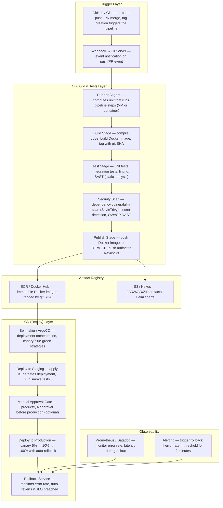
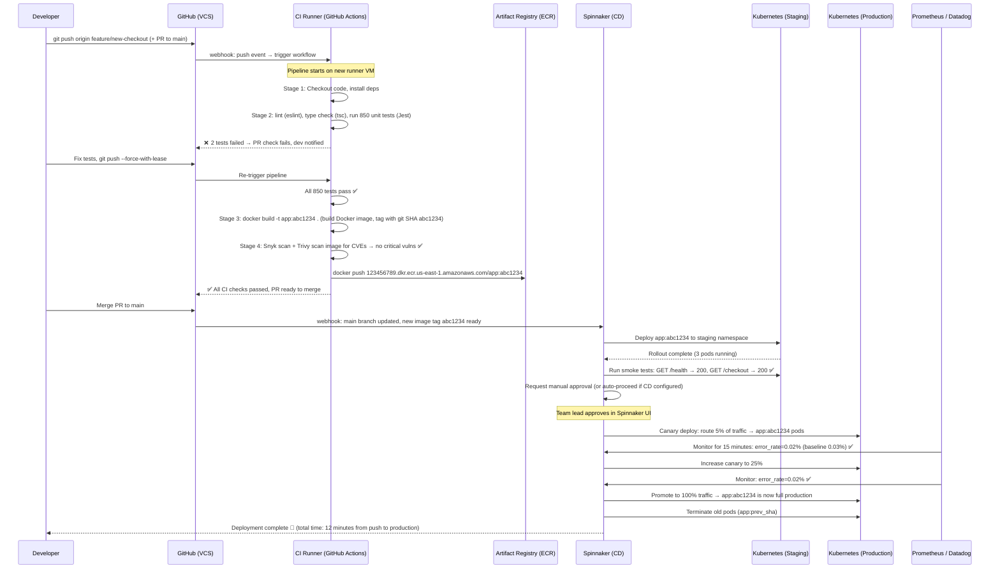
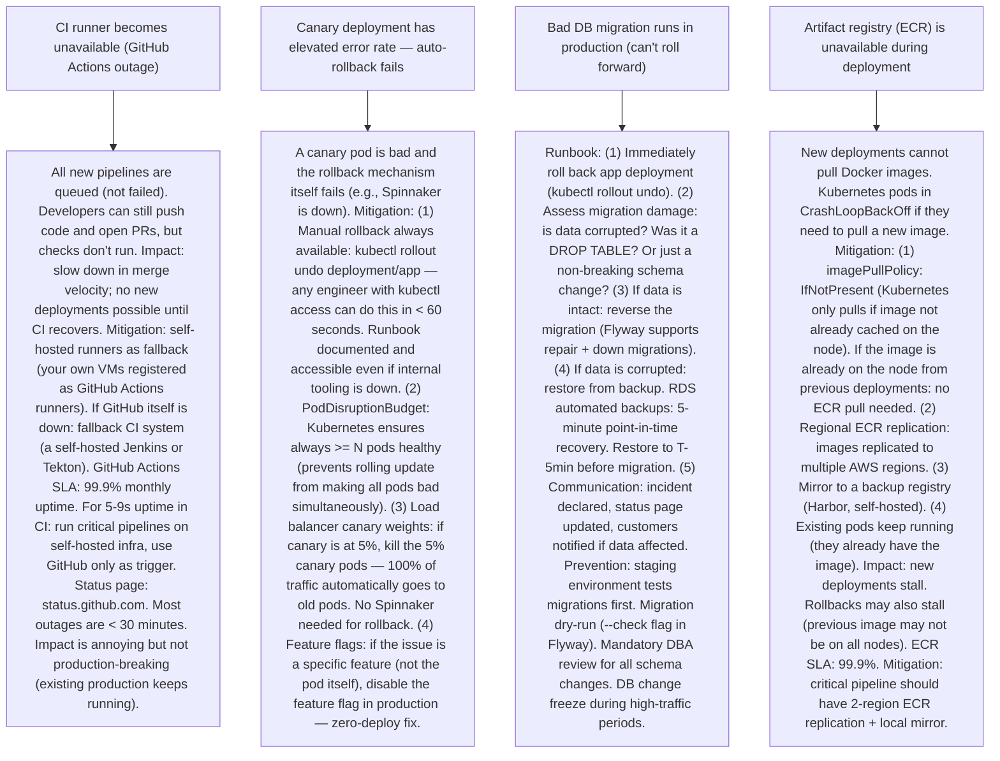

# Pattern 38 — Code Deployment & CI/CD Pipeline (like GitHub Actions, Spinnaker)

---

## ELI5 — What Is This?

> Imagine you write a novel and want to print and ship it to bookstores.
> Instead of doing it manually every time — proofreading, printing, boxing,
> shipping — you set up an assembly line: as soon as you save the final chapter,
> the machine starts proofreading (tests), checking formatting (linting),
> printing (building), and automatically ships copies to stores (deployment).
> CI/CD is that assembly line for software. "Continuous Integration" means
> every code change is automatically tested the moment it's pushed.
> "Continuous Delivery/Deployment" means tested code is automatically
> shipped to production — no human needed (or with a one-click approval gate).

---

## Glossary (Every Keyword Explained in ELI5)

| Word | ELI5 Meaning |
|---|---|
| **CI (Continuous Integration)** | Every time a developer pushes code, the system automatically: runs tests, checks code quality (lint), builds the artifact. Goal: catch bugs before they reach production. "Integrate" = merge your code into the main branch continuously, not once a month in a big-bang merge. |
| **CD (Continuous Delivery/Deployment)** | Delivery: code is always "ready to ship" — deployment to prod is a one-click human-approved step. Deployment: code is automatically deployed to production after passing tests (no human approval). Netflix, Amazon, Etsy do continuous deployment (100s of deploys/day). |
| **Pipeline** | A sequence of stages (build → test → security scan → deploy staging → integration test → deploy prod). Each stage must pass for the next to run. If any stage fails: pipeline stops, developer is notified. |
| **Artifact** | The output of the build step. A Docker image, a JAR file, or a compiled binary. Stored in a registry. Deployed in later stages. Artifacts are immutable — the same image tested in staging is promoted to production (no rebuilding). |
| **Blue-Green Deployment** | You have two identical production environments: Blue (current live) and Green (new version). Deploy to Green, run smoke tests. Flip DNS or load balancer to send traffic to Green. If anything is wrong: flip back to Blue (instant rollback). Blue is idle but standing by. |
| **Canary Release** | Send a small percentage of traffic (e.g., 1%) to the new version. Monitor error rate and latency. If healthy: gradually increase 1% → 10% → 50% → 100%. If errors spike: roll back (redirect traffic back to old version). Minimizes blast radius of bad deployments. |
| **Feature Flag** | A configuration toggle that enables or disables a feature in production without a code deployment. Decouple code deployment from feature release. You can deploy the code for a new feature (off by default) and turn it on later for specific users or gradually. |
| **Rollback** | Reverting a deployment to the previous known-good version. In container deployments: change image tag of Deployment to previous version (Kubernetes rolls back pods). Important: rollbacks also need DB migrations to be backward-compatible. |
| **Smoke Test** | A quick "is the service alive?" test run immediately after deployment. Checks basic endpoints return 200 OK, critical user flows work. If smoke test fails: auto-rollback is triggered before real users are affected. |
| **Self-hosted vs Managed Runner** | GitHub Actions runs jobs on GitHub-managed virtual machines ("runner"). You can also bring your own servers ("self-hosted runner") — useful for private networks, GPU jobs, or cost (large companies save $ running their own). |

---

## Component Diagram

---

## Step-by-Step Request Flow

---

## Bottlenecks — Every Point Explained

| # | Bottleneck | Why It Hurts | Fix |
|---|---|---|---|
| 1 | **Slow CI pipeline (tests take too long)** | If running all 10,000 unit + integration tests takes 45 minutes, developers stop running tests locally and wait for CI. Feedback loop is broken. PRs pile up. Merge conflicts accumulate. Developer productivity drops dramatically ("I'll merge tomorrow once CI passes"). | Test parallelization: split test suite across N runner agents (GitHub Actions matrix strategy: `matrix: shard: [1,2,3,4,5]`). Each shard runs 20% of tests. 45 minutes / 5 = 9 minutes. Layer caching: cache `node_modules`, compiled artifacts, Docker image layers between runs (GitHub Actions cache action). Only reinstall deps if `package-lock.json` changed. Test selection: on PRs, run only tests related to changed files (Jest `--changedSince`, or affected build tools like Nx, Bazel, Turborepo). Full suite runs only on main branch merges. |
| 2 | **Long Docker image build times** | A Docker build of a Node.js app: `npm install` (2 min) + `tsc compile` (1 min) + `COPY .` (30s) = 3.5 minutes every time. With 50 developers each pushing 5 times/day: 50 × 5 × 3.5 = 875 minutes of wasted compute/day. | Layer caching: order Dockerfile layers from least-to-most-frequently-changed. Copy `package.json` and run `npm install` before `COPY . .` (code). When only code changes: npm install layer is cached. Cache from registry: `docker buildx build --cache-from type=registry,ref=ecr/app:cache`. Multi-stage builds: final image contains only production artifacts, not dev dependencies or build tools. Result: 90% cache hit rate → builds take 30 seconds instead of 3.5 minutes. |
| 3 | **Deployment to production causes downtime** | Naive deployment: stop old pods, start new pods. For ~30 seconds: no pods are serving traffic. Users see 502/503. For customer-facing services: unacceptable. | Zero-downtime deployment: `RollingUpdate` in Kubernetes (default). Kubernetes replaces pods gradually: start 1 new pod, health-check passes, terminate 1 old pod, repeat. At no point are all old pods terminated before new ones are ready. Configure: `maxSurge: 1, maxUnavailable: 0` = always at least N pods running. Readiness probe: Kubernetes only routes traffic to a pod after its readiness probe passes (app is fully initialized). Prevents traffic to pods that are starting up (database connections not yet established). |
| 4 | **Bad deployment not detected until widespread damage** | Full canary to 100% all at once: if the new version has a bug, 100% of users hit it before anyone can react. Time-to-detect: minutes. Time-to-rollback: minutes. Blast radius: 100% of users. | Canary + automated rollback: deploy to 1-5% of traffic first. Define SLO-based canary criteria in Spinnaker/Argo Rollouts: "monitor for 15 min. If HTTP 5xx rate increases > 0.5% vs baseline, auto-rollback." Spinnaker's "Automated Canary Analysis" (ACA): compares metrics of canary vs baseline using Mann-Whitney U test. Statistically determines if canary is degrading. If any SLO breach: `kubectl rollout undo deployment/app` → restores previous RS (ReplicaSet) in < 30 seconds. |
| 5 | **Secret management in CI/CD** | CI pipelines need credentials: AWS keys, DB passwords, API tokens to deploy. Naïve approach: hardcode in environment variables in the YAML file. Worse: commit to Git. These become permanent security vulnerabilities. GitHub has bots that scan public repos for secrets 24/7. | Secrets never in source code: use GitHub Actions encrypted secrets (stored in GitHub, injected as env variables at runtime, never visible in logs). For AWS: use OIDC federation (GitHub Actions gets temporary IAM credentials via OIDC — no long-lived AWS keys stored anywhere). For K8s secrets: stored in AWS Secrets Manager / Vault, injected at pod start (Vault injector sidecar or External Secrets Operator). Secret rotation: secrets should have short TTLs (hourly/daily). Automated rotation via AWS Secrets Manager. Audit: any secret access is logged in AWS CloudTrail. |
| 6 | **Database migrations with zero downtime** | Deploying a new app version that requires a DB schema change (e.g., rename column `user_name` to `username`). If you run migration first, old app version doesn't understand new schema. If you deploy app first, app fails until migration runs. Rolling deploys make this even harder: both old and new app versions run simultaneously during rollout. | Expand-contract migrations (3-step): (1) Expand: add new column `username` (keep old `user_name`). Both old and new app work. (2) Deploy new app: new code writes to both columns, reads from `username`. Old code still reads `user_name`. (3) Contract: once all old pods are gone, drop `user_name`. This ensures zero-downtime DB migrations. Tools: Flyway, Liquibase for migration tracking. Always run migrations before deploying new app version (migrations must be backward-compatible). Never: rename or drop columns in a single deploy step. |

---

## What Happens When Each Part Fails?

---

## Key Numbers to Know

| Metric | Value |
|---|---|
| Amazon deployment frequency | ~50 deploys per second (2023) |
| Netflix deployments per day | Thousands |
| GitHub Actions max job timeout | 6 hours |
| Typical CI pipeline target time | < 10 minutes for PR checks |
| Kubernetes rolling update duration (10 pods) | 2-5 minutes |
| Canary monitoring window (typical) | 15-30 minutes |
| Blue-green cutover time (DNS TTL flush) | Instant (LB rule change) to 5 min (DNS propagation) |
| Max Docker image layer cache TTL | Configurable, typically 7 days |
| GitHub Actions free tier | 2,000 minutes/month (public repos: unlimited) |

---

## How All Components Work Together (The Full Story)

A CI/CD pipeline is the delivery mechanism for software: every code change flows through an automated assembly line that verifies quality and safely ships to production. The design goal: make deployment so fast and safe that it becomes a non-event, done dozens of times daily.

**CI — build confidence:**
The moment code is pushed, the CI runner (an ephemeral VM or container) clones the repo, installs dependencies, runs the full quality suite: linting, type checking, unit tests, integration tests, security scanning (SAST/DAST), and dependency vulnerability scanning. If anything fails: the developer is notified with specific failure details. Fast feedback loop: a developer should know within 5-10 minutes whether their code is ready. The output of CI is an immutable, versioned artifact (Docker image tagged with git SHA). The same artifact that passed tests is the one deployed to production — no rebuilding in deployment stages.

**CD — safe rollout:**
The deployment pipeline manages how the verified artifact reaches users. The key insight: deployment is not a binary "old → new" flip. It's a gradual, monitored transition with automated safety nets. ArgoCD watches a Git repository for changes to Kubernetes manifests (GitOps model). When the image tag changes in Git: ArgoCD syncs the cluster. Spinnaker is more powerful for multi-stage pipelines with canary analysis, cloud provider integrations, and manual approval gates.

**GitOps model:**
The desired state of production is defined in Git (Kubernetes YAML files or Helm charts in a "gitops" repo). No one applies Kubernetes manifests manually. All changes go through Git commits. ArgoCD synchronizes the cluster to match Git. Rollback = `git revert` of the commit that changed the image tag. Full audit trail: every production change is a Git commit with author, timestamp, and review history.

> **ELI5 Summary:** CI is the automated quality inspector who checks every piece coming off the assembly line (code). CD is the conveyor belt that moves verified pieces into the store (production). Canary is the test section of the store where 5% of customers try the new product first. Feature flags are light switches — you can have the product in the store but keep the lights off until you're ready to sell. Rollback is the emergency stop button that instantly takes the new product off shelves and puts the old one back.

---

## Key Trade-offs

| Decision | Option A | Option B | Why |
|---|---|---|---|
| **Continuous Deployment (auto-prod) vs Continuous Delivery (manual gate)** | Auto-deploy: every merge to main automatically ships to production (Amazon, Netflix, Etsy model). Fastest feedback, lowest batch size of changes. | Manual gate: human approval before production deploy. Slower, but explicit control. Required in regulated industries (SOX, HIPAA). | **Continuous deployment for products** with robust canary analysis and feature flags. The combination of: small deploys + canary monitoring + instant rollback + feature flags makes continuous deployment safer than rare large releases. **Manual gate for**: compliance requirements, B2B enterprise (customers expect release notes, planned windows), or teams without mature monitoring. The answer is cultural + technical maturity. |
| **Blue-Green vs Rolling vs Canary** | Blue-Green: instant cutover, instant rollback. Requires 2x infrastructure cost. DB migration complexity. | Rolling: gradual, no extra infra. Rollback is slower (roll forward new pods, then back). Both versions run simultaneously briefly. | Canary: surgical traffic split, best risk control, most complex. | **Rolling for most services** (Kubernetes default, simple). **Blue-Green for DB schema changes** (both environments share read-only DB replica for validation before cutover, then switch DB too). **Canary for high-risk changes or high-traffic services** (payment service, auth service). Most organizations use rolling as baseline and canary for critical services. Blue-green is expensive to maintain permanently. |
| **Monorepo CI (build all) vs polyrepo (build changed service only)** | Monorepo: all services in one repo. Run all affected tests on change (Nx/Bazel affected graph). Complex setup, powerful caching. | Polyrepo: each service independent. Simple CI per service. Each deploy is scoped to one service. | **Polyrepo for independent teams**: clear ownership boundaries, independent release cadences, simple CI/CD per service. **Monorepo for tightly-coupled codebases**: atomic cross-service changes, shared library versioning, ensures integration is always tested together. Google, Meta, Microsoft: monorepo. Most startups and microservice-first companies: polyrepo. Hybrid: "mono-family" repos (domain-scoped monorepos). |

---

## Important Cross Questions

**Q1. How do you ensure zero-downtime deployments when your service has WebSocket connections?**
> WebSocket connections are long-lived — draining them gracefully is the challenge. Rolling update approach: (1) When a pod receives SIGTERM (Kubernetes draining it), the app catches the signal and stops accepting new WebSocket connections. (2) Existing connections are given a grace period (terminationGracePeriodSeconds = 60 in Kubernetes). During this window: the pod finishes serving existing connections but accepts no new ones. (3) New connections go to the new pods (load balancer removes the terminating pod from its pool immediately). (4) After grace period: SIGKILL if any connections still open. Client-side reconnect: WebSocket clients should implement exponential-backoff reconnection. When the old pod closes their connection, they reconnect to a new pod. For very long-lived connections (interactive apps): use sticky sessions (pin client to a pod) + drain old pod over a longer period (10+ minutes). Pair with a connection broker (like a pub/sub layer) so state isn't tied to individual pods.

**Q2. How does GitHub Actions work internally at scale? How does it route jobs to runners?**
> Architecture: (1) GitHub maintains a service that receives webhook events (push, PR) and creates a pending job. (2) Runners (GitHub-managed: Ubuntu, Windows, macOS VMs) poll a message queue for pending jobs (pull model). (3) When a runner picks up a job: it downloads the workflow YAML, checkouts the repo, runs each step sequentially in the same VM. (4) GITHUB_TOKEN: GitHub generates a temporary token scoped to the repo, injected into the runner. (5) After job completion: VM is discarded (ephemeral by design — no state leaks between jobs). GitHub Actions scale: thousands of concurrent runners. VMs provisioned on-demand using Azure VMs (GitHub is owned by Microsoft). Self-hosted runners: you run a binary (actions-runner) on your server. The runner binary polls GitHub's queue for jobs. Your server does the compute, GitHub provides the orchestration. Self-hosted is cheaper at scale (pay EC2/GCE cost vs GitHub's per-minute pricing), and required for private network access.

**Q3. How do you implement progressive delivery (canary) in Kubernetes without Spinnaker?**
> Argo Rollouts: a Kubernetes CRD that extends the Deployment resource with canary/blue-green strategies. Define: `strategy: canary: steps: [{setWeight: 5}, {pause: {duration: 15m}}, {setWeight: 25}, {pause: {duration: 15m}}, {setWeight: 100}]`. Argo Rollouts creates two ReplicaSets (stable + canary) and a traffic split using Istio, Nginx, or AWS ALB weighted target groups. Weight = fraction of traffic to canary. Analysis template: define metrics that must pass at each step (`kubectl apply -f analysistemplate.yaml`). If analysis fails: auto-rollback (stable RS stays, canary RS scaled to 0). No Spinnaker needed for Kubernetes-native canary. ArgoCD (GitOps) + Argo Rollouts: `ArgoCD` manages the desired state in Git, `Argo Rollouts` handles the progressive delivery strategy. This is the "Argo ecosystem" — popular alternative to Spinnaker for Kubernetes-first organizations.

**Q4. How does Netflix deploy to production hundreds of times per day without breaking things?**
> Netflix's key practices: (1) Every service independently deployable (microservices, each team owns one service). (2) Graduated rollout: every deploy starts at Canary (1% of traffic), monitored against an extensive metrics baseline (error rate, P99 latency, JVM GC pressure). Spinnaker auto-promotes or rolls back based on metrics. (3) Chaos Engineering (Chaos Monkey): randomly kills production instances to ensure teams build resilient services (failures are expected and handled gracefully). This confidence in resilience enables faster deployment. (4) Feature flags (Archaius): decouple deploy from feature launch. Deploy dark (feature off), run shadow traffic through new code path, enable gradually. (5) Deep observability: Atlas (Netflix's TSDB), real-time alerting on every service. Engineers can see the impact of their deploy within 1 minute and rollback within 2 minutes. (6) Paved road: internal platform provides GitOps templates, canary config, and CI/CD pipelines by default. Every service gets these capabilities for free — no team needs to build their own deployment pipeline.

**Q5. Explain GitOps. How is it different from pushing deployments from CI?**
> GitOps: Git is the single source of truth for the desired state of all environments. Every infrastructure or application change is a Git commit (pull request, code review, history). An agent (ArgoCD, Flux) watches Git and continuously reconciles the live cluster state to match Git. Difference from CI-driven deployment: (1) Traditional CI push: CI runner runs `kubectl apply` or `helm upgrade` directly. The cluster state may diverge from Git if someone manually runs `kubectl` without committing to Git. (2) GitOps: ArgoCD continuously monitors Git AND the live cluster. Any out-of-sync state (whether caused by manual intervention or drift) is detected and corrected (reconciliation). Benefits: full audit trail (all changes are Git commits), PR review for production changes, instant rollback = `git revert`, declarative and idempotent (re-applying the same Git state is safe), disaster recovery (rebuild any environment from Git). Limitation: sensitive to secret handling (don't put secrets in Git — use Sealed Secrets or External Secrets Operator). GitOps is the standard for Kubernetes environments in security-conscious organizations.

**Q6. How do you handle the "works on my machine" problem in CI environments?**
> This is solved by containerizing the build environment. (1) Dev environment = Docker: developers run the same Docker image locally that CI uses to build. Same OS, same library versions, same Node.js/Python/JDK version. `docker-compose up` starts the full environment locally. No more "but I have a different version of LibSSL." (2) Deterministic dependencies: lock files (package-lock.json, Cargo.lock, go.sum) ensure the same dependency versions are installed in CI as on developer machines. Commit lock files. (3) Hermetic builds (Bazel): Bazel builds are fully reproducible — the same inputs always produce the same outputs, regardless of machine state. Any tool not explicitly declared as a build dependency cannot affect the build. (4) CI job environment: GitHub Actions uses exact Ubuntu version images. Pin the runner version (`ubuntu-22.04` not `ubuntu-latest`). (5) Integration test environment: use Docker Compose in CI to spin up the same services (PostgreSQL, Redis, Kafka) that exist in production. Tests run against real services, not mocks. This eliminates "mock passes but real DB fails" class of bugs.

---

## Real-World Apps That Use This Pattern

| Company | Product | How They Use It |
|---|---|---|
| **GitHub** | GitHub Actions | Native CI/CD platform with 20,000+ marketplace actions. Matrix builds for multi-OS/version testing. OIDC integration with all major cloud providers. Manages CI/CD for millions of repositories. GitHub itself uses GitHub Actions to deploy GitHub. |
| **Netflix** | Spinnaker (open-source) | Netflix created Spinnaker for multi-cloud progressive delivery. Used internally for thousands of microservice deployments daily. Open-sourced in 2015. Used by Google, Amazon, Target, Snap, and hundreds of enterprises. Supports: canary analysis, blue-green, manual judgments, multi-cloud (AWS, GCP, Azure, Kubernetes). |
| **Intuit** | ArgoCD + Argo Rollouts | GitOps-based deployment for 1500+ microservices across Kubernetes clusters. Argo Rollouts for canary analysis tied to Datadog metrics. 100s of deployments per day across Tax, QuickBooks, Mint platforms. Published their platform engineering journey openly. |
| **Monzo** | Custom CI/CD on Kubernetes | UK neobank. Deploys to production 20+ times/day. All services containerized on Kubernetes. Strict GitOps: no direct cluster access for engineers (everything through Git PR). Full audit trail required for banking compliance. Blue-green DB migrations with automated rollback. Incident response requires deployment history to correlate with issues. |
| **Amazon** | CodePipeline / CodeDeploy | Amazon's own services: CodePipeline (visual CI/CD pipeline builder), CodeDeploy (EC2, ECS, Lambda deployments with canary support). Used for internal Amazon service deployments and offered as cloud services. Amazon famously cited "11.6 seconds between deployments" across their entire system (2011 paper). |
