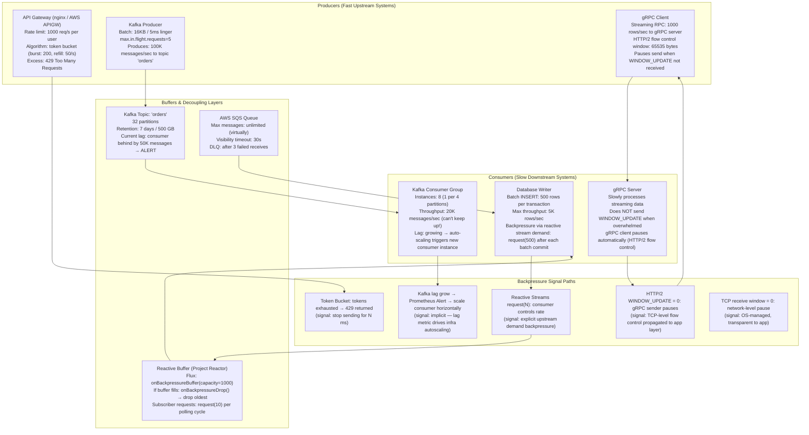
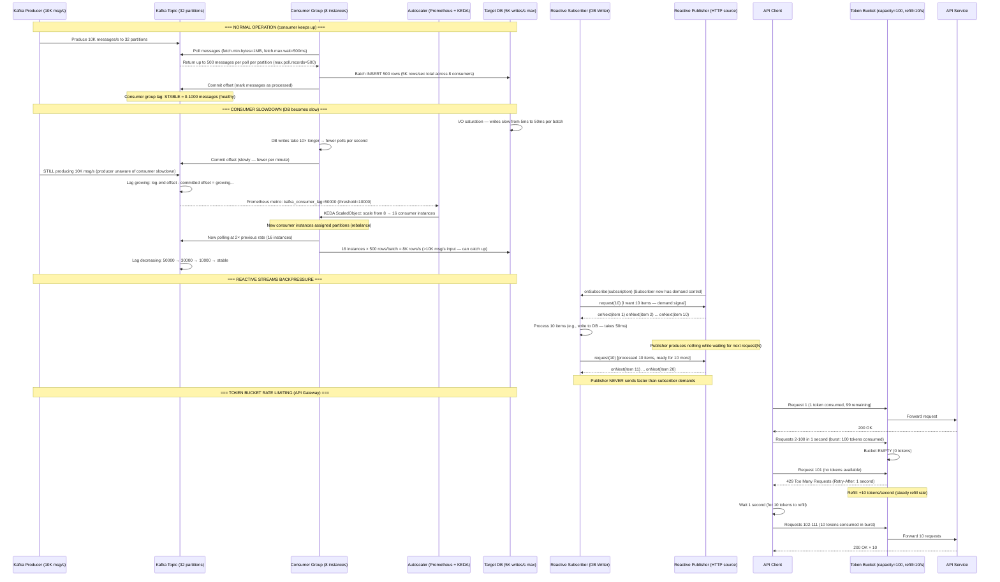
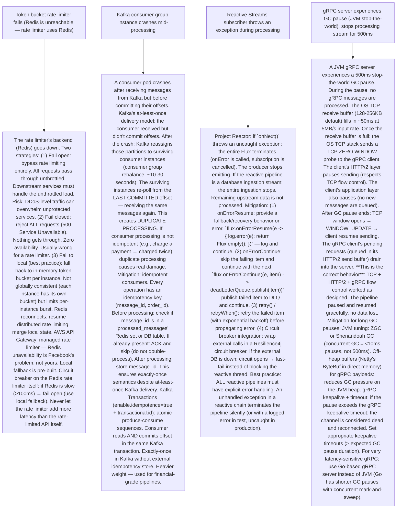

# P10 — Backpressure & Flow Control (like Kafka, RxJava, gRPC, nginx rate limiting)

---

## ELI5 — What Is This?

> Imagine a water pipe system.
> Your city's water pump (producer) pushes water at 1000 gallons/minute.
> Your home pipes (consumer) can only handle 100 gallons/minute.
> Without backpressure: the excess water bursts the pipes (buffer overflow, OOM crash, dropped requests).
> With backpressure: the home pipes "signal back" to the pump: "Slow down! I can only take 100."
> The pump reduces pressure. No pipes burst, no water is wasted.
> Backpressure is this feedback mechanism: the consumer tells the producer "send less, I'm full."
> Flow control is the broader system of mechanisms (buffers, rate limits, queues, token buckets) that
> prevent any part of the system from being overwhelmed by the parts feeding it.
> Used by every high-traffic system: Kafka (consumer lag), gRPC (HTTP/2 flow control windows),
> RxJava/Reactor (reactive streams demand model), Nginx (rate limiting), AWS API Gateway (throttling),
> and TCP itself (receive window shrinks to zero when the receiver is overwhelmed).
> If your service ignores backpressure: one slow consumer can cascade into a full system crash
> as buffers fill, memory is exhausted, and callers time out waiting for responses.

---

## Glossary (Every Keyword Explained in ELI5)

| Word | ELI5 Meaning |
|---|---|
| **Backpressure** | A feedback mechanism where a downstream consumer signals an upstream producer to slow its emission rate. The "pressure" propagates back (upstream) through the pipeline. Without it: producers blindly overwhelm consumers. Comes from plumbing (water pressure pushing back). In software: implemented as reduced token window, `request(N)` in reactive streams, TCP receive window = 0, HTTP/2 WINDOW_UPDATE frames. |
| **Token Bucket** | A rate-limiting algorithm. A virtual "bucket" holds N tokens. Each incoming request consumes one token. Tokens are added at a fixed rate (refill rate). If the bucket is empty: the request is either queued (wait for a token) or dropped (429 Too Many Requests). Allows SHORT bursts above the average rate (as long as tokens exist). Used by: AWS API Gateway, Stripe, Nginx, most rate limiters. Key knobs: bucket capacity (burst tolerance) and refill rate (sustained rate). |
| **Leaky Bucket** | A rate-limiting algorithm. Requests enter a queue (the "bucket"). The queue drains at a fixed rate regardless of how full the queue is. Smooths bursty arrivals into a steady output rate. If the queue overflows: new requests are dropped. Unlike token bucket: does NOT allow bursts (output is always at a fixed rate). Used for: traffic shaping, smoothing upstream request rates before hitting a database. |
| **Kafka Consumer Lag** | In Apache Kafka: every message has an "offset" (position in the partition). The consumer tracks which offset it has processed (the "committed offset"). The latest message's offset is the "log-end offset." Consumer lag = log-end offset - committed offset. A large lag means the consumer is falling behind the producer. If lag grows indefinitely: eventually the consumer may lose messages (Kafka's retention window expires and old messages are deleted before being consumed). Monitored via `kafka-consumer-groups.sh --describe` or Kafka's JMX metrics. |
| **Reactive Streams** | A specification (RxJava, Project Reactor, Akka Streams, Java 9 Flow API) for asynchronous stream processing. Key innovation: backpressure-aware. The Subscriber calls `request(N)` to tell the Publisher "I want N items." Publisher sends ≤ N items. When the subscriber processes them: it calls `request(M)` for more. If the subscriber is slow: it requests fewer items. The producer never pushes faster than the consumer requests. |
| **TCP Flow Control** | OS-level backpressure. Every TCP receiver advertises its "receive window" (how many bytes it can buffer). The sender may only send up to this many bytes without receiving an ACK. If the receiver's buffer fills: it sends a TCP window update with size = 0 (zero window probe). Sender pauses completely. When buffer drains: receiver sends a window update to resume sending. All HTTP/1.1, HTTP/2, and most TCP-based protocols inherit this mechanism. |
| **gRPC Flow Control** | HTTP/2-level backpressure (gRPC runs on HTTP/2). HTTP/2 has per-stream flow control windows (for individual gRPC calls) and per-connection flow control windows. The receiver sends WINDOW_UPDATE frames to tell the sender how many more bytes it can accept. If the server is overwhelmed: it stops sending WINDOW_UPDATE → sender pauses. gRPC client: can set `MaxRecvMsgSize` and flow control windows. This prevents a single fast producer from filling a slow consumer's memory. |
| **Queue-Based Decoupling** | A message queue (Kafka, SQS, RabbitMQ) between a producer and consumer acts as an elastic buffer. Producer writes at its rate. Consumer reads at its rate. The queue absorbs the difference (up to the queue's storage capacity). Backpressure is IMPLICIT: if the queue fills up: the producer can be throttled or block on enqueue. Cloud queues (SQS): nearly unlimited capacity. On-premise queues (RabbitMQ): bounded memory → explicit flow control needed. |
| **Circuit Breaker (related)** | Complements backpressure: when a downstream service is overwhelmed (slow responses, timeouts), the circuit breaker OPENS and immediately rejects new requests to that service (fast-fail). Prevents the caller from continuing to pile load onto an overloaded service. Where backpressure slows production, circuit breakers stop it entirely until recovery. See P4 for full circuit breaker details. |
| **Rate Limiting** | A policy that restricts how many requests a client or service can make within a time window. Implemented with token bucket or sliding window algorithms. Protects services from abuse (API quotas: "100 req/min per API key"). Also used internally: service A limits itself to 500 calls/sec to service B to avoid overwhelming it. HTTP 429 Too Many Requests = rate limit signal. |
| **Sliding Window Counter** | A rate-limiting algorithm (alternative to token bucket). Tracks request counts in a sliding time window (e.g., last 60 seconds). Pros: smoother than fixed-window (no "double burst" at window boundaries). Used by Redis-based rate limiters (`INCR` + `EXPIRE` per key-per-window). More memory-efficient: use a sorted set with timestamps, ZREMRANGEBYSCORE old entries, count remaining. |
| **Demand-Driven (Pull-Based) Streams** | The consumer PULLS from the producer (vs push where producer pushes to consumer). `request(N)` in Reactive Streams: consumer says "I want 10 more elements" → producer sends up to 10. Consumer processes → requests 10 more. This is inherently backpressure-safe: the producer can never exceed the consumer's stated demand. |

---

## Component Diagram

---

## Step-by-Step Request Flow

---

## Bottlenecks — Every Point Explained

| # | Bottleneck | Why It Hurts | Fix |
|---|---|---|---|
| 1 | **Kafka consumer lag growing unboundedly** | Producers write messages faster than consumers process them. Kafka buffers the difference (on disk). But: Kafka's retention is bounded (default 7 days or 500 GB). If lag grows to the retention boundary: old unconsumed messages are DELETED before being processed. The consumer has "fallen off the end" of the log. For a payment processing pipeline: missed messages = missed transaction events = lost revenue or inconsistent state. Even if messages aren't lost: a consumer group 1 million messages behind takes hours to catch up. During catch-up: the service is processing stale events (ordering conflicts, outdated state). | Consumer autoscaling: KEDA (Kubernetes Event-Driven Autoscaling) monitors Kafka consumer group lag metric via Prometheus. When lag > threshold: scale up consumer pods. When lag = 0: scale down. Ensure enough partitions: Kafka parallelism is bounded by partition count. 32 partitions = max 32 concurrent consumers per group. Increase partitions if needed (can't reduce without repartition). Consumer efficiency: batch processing (process 100-500 messages per poll, not 1). Async processing: consumer receives messages, writes to a local buffer/batch queue, a separate worker writes to DB (pipeline parallelism). Increase retention: set `log.retention.hours=168` (7 days) or `log.retention.bytes=10GB` per partition to avoid losing messages during lag spikes. |
| 2 | **Token bucket exhaustion causing cascading 429s** | A token bucket rate limiter protects a service. The bucket empties. The service returns 429 Too Many Requests. Callers receive 429 and immediately RETRY (exponential backoff not implemented). Retries consume tokens again (fast). The bucket empties faster. More 429s. This is "retry storm" / "thundering herd" — the rate limiter's 429 responses cause MORE load, not less. The downstream service receives more traffic than before rate limiting was added. | Retry-After header: include `Retry-After: <seconds>` in 429 responses. Well-behaved clients WAIT this many seconds before retrying. Exponential backoff + jitter: clients implement jitter in their retry delays to prevent synchronized retry waves. Bulkmead at the client: client-side circuit breaker (or semaphore) limits concurrent in-flight requests to a service. Prevents one service slowdown from exhausting the caller's thread pool. Server-side: use distributed rate limiting (Redis token bucket, not in-memory per instance) to ensure a consistent shared rate limit across all service instances. Leaky bucket instead: smooths burst traffic into a constant output rate. No burst tolerance, but no retry amplification either. |
| 3 | **Reactive buffer overflow (onBackpressureBuffer exhausted)** | Project Reactor / RxJava: `Flux.onBackpressureBuffer(1000)` buffers up to 1000 items when the subscriber is slow. If the producer emits faster than the subscriber processes AND faster than the buffer drains: the buffer fills to 1000. New items are dropped (with `onBackpressureDrop`) or an `MissingBackpressureException` is thrown (with `onBackpressureError`). In a data ingestion pipeline: dropped items = lost data. In a notification service: dropped items = missed notifications. The fix is not just a larger buffer — the root cause is a producer/consumer speed mismatch. | Proper demand-driven backpressure: use a `Flux` that genuinely respects `request(N)`. Avoid hot publishers (publishers that emit regardless of demand). If the source is a hot publisher (e.g., events from a message queue, WebSocket): use `onBackpressureLatest` (keep only the latest item, drop others) for real-time data where freshness > completeness. Or `onBackpressureBuffer` + write to a persistent queue (Kafka/SQS) so dropped items are just delayed, not lost. ThreadPool sizing: ensure the subscriber has enough threads to process at a rate matching the producer. If processing is CPU-bound: increase worker threads. If I/O-bound: use async non-blocking I/O (WebFlux, R2DBC) to prevent threads from blocking during DB writes. |
| 4 | **gRPC streaming client overwhelms slow server** | A gRPC server-streaming or bidirectional-streaming RPC. The client sends 10,000 messages/second. The server processes at 1,000 messages/second. Without flow control: the server's receive buffers fill, memory grows, eventually OOM. gRPC (HTTP/2) has built-in flow control: per-stream WINDOW_UPDATE frames control how many bytes the sender may transmit. BUT: application-level processing must also apply backpressure. If the server's network receive buffer is drained fast (OS level) but the application queue fills: the OS still ACKs TCP segments (buffer drained quickly) but the app queue overflows → OOM at the application level. | Proper gRPC server implementation: gRPC server in Java (gRPC-Java) or Go (gRPC-Go) implements `isReady()` on the `ServerCallStreamObserver`. Before processing the next item, check if the stream is ready. If not ready: pause consumption from the stream. Set `setOnReadyHandler()` to resume when the stream is ready again. This propagates backpressure all the way from server processing state → HTTP/2 window → client send rate. gRPC-Go: uses `grpc.MaxRecvMsgSize` and buffer limits. gRPC client: implement pause/resume based on `SendMsg()` return values. Batch processing on server: accumulate N messages before processing as a batch (reduces overhead per message). Load balancing: scale gRPC service horizontally — route streaming clients across multiple server instances. |
| 5 | **Queue-based buffer allows producers to ignore consumer health** | A message queue (SQS, Kafka) decouples producers and consumers. Queue fills with millions of messages. Producers: happy, writing at full speed (queue is accepting). Consumers: overwhelmed, hours behind. Downstream state: increasingly stale — consuming 3-day-old order events, sending 3-day-old emails. Old messages create wrong actions: re-sending a "your order shipped" email 3 days after delivery. Queue storage cost: Kafka at 10 GB/day × 7 day retention = 70 GB of unprocessed data sitting in storage. Latency SLA violated: system claims "real-time" but events are being processed with hours of lag. | Queue depth monitoring: Prometheus + CloudWatch SQS `ApproximatNumberOfMessageVisible`. ALERT when queue depth > threshold. ALERT when `oldest_message_age > 5 minutes` (SQS `ApproximateAgeOfOldestMessage`). Consumer autoscaling: KEDA for Kafka. AWS Auto Scaling for SQS-based ECS or Lambda consumers. Dead letter queue (DLQ): messages that repeatedly fail processing are moved to a DLQ after N retries. DLQ prevents poison-pill messages (malformed data) from stalling the entire queue. Message expiration: SQS `MessageRetentionPeriod` (max 14 days). Expired messages are deleted. For time-sensitive data: set a short TTL (e.g., 1 hour for real-time notifications) — old messages are stale anyway and should be discarded, not processed late. |

---

## What Happens When Each Part Fails?

---

## Key Numbers to Know

| Metric | Value |
|---|---|
| Token bucket typical API rate limit | 10-1000 req/s per user (varies by tier) |
| Kafka max throughput per partition | ~10-30 MB/s (depends on message size + broker hardware) |
| Kafka consumer lag alert threshold (typical) | varies: 10K-100K messages, or oldest message age > 1 minute |
| TCP receive buffer size (default Linux) | 128 KB (default), tunable to 2-16 MB for high-throughput |
| HTTP/2 initial WINDOW_UPDATE size | 65,535 bytes (can be increased via SETTINGS frame) |
| Reactive Streams `request(N)` typical batch | 16-256 items per request cycle (balance latency vs throughput) |
| Redis sorted-set sliding window rate limiter overhead | ~0.5ms per check (local Redis) |
| RxJava `onBackpressureBuffer` default capacity | 128 items (configurable) |
| AWS SQS message retention max | 14 days |
| Nginx `limit_req_zone` burst tolerance | Configurable (e.g., `burst=20 nodelay` for token bucket with queue) |

---

## How All Components Work Together (The Full Story)

Backpressure and flow control form a **multi-layer defense** against one of the most common distributed systems failures: **cascading overload**. Without it, a single slow consumer causes producers to pile up work, filling memory and crashing the entire pipeline.

**The physical foundation — TCP flow control:**
Before any application-level backpressure: TCP's receive window provides the first line of defense. When a receiving socket's buffer is full: TCP sends a zero-window notification. The sender literally cannot send more bytes. This is why TCP connections don't "lose" data (in normal operation). Application-level backpressure mirrors this concept at higher levels of the stack.

**The API boundary — rate limiting:**
The outermost layer: API Gateways use token buckets to limit inbound request rates per client. This protects all downstream services. Without rate limiting: a single misbehaving client (or a bug in a client that infinitely retries) can consume all service capacity. Rate limiting enforces fairness and protects capacity.

**The async decoupling layer — message queues:**
Between a producer service and a consumer service: a message queue (Kafka, SQS) absorbs burst traffic and enables different scaling rates. The queue itself is not a backpressure mechanism (the queue will grow indefinitely if consumers can't keep up). Backpressure on queues is IMPLICIT: monitor queue depth, autoscale consumers, set message TTLs. The queue is a buffer, not a solution — it buys TIME to scale.

**The reactive pipeline — demand-driven backpressure:**
Inside a service: reactive streams (`Flux`, `Flowable`) implement demand-driven backpressure. The subscriber controls flow by issuing `request(N)`. The producer can never send more than demanded. This prevents in-memory buffer overflows in data processing pipelines (ETL, event processing, batch imports).

**The streaming RPC layer — HTTP/2 flow control:**
gRPC streaming between services: HTTP/2's WINDOW_UPDATE frames propagate backpressure at the transport level. A slow server naturally slows its clients without any application-level code — the flow control is built into the protocol.

> **ELI5 Summary:** Backpressure is a chain of "slow down" signals from the slowest part of the system all the way back to the fastest. Like a highway: if the exit ramp backs up (slow consumer), cars slow down throughout the highway (producers). Each layer (TCP, HTTP/2, reactive streams, token buckets, queue consumers) has its own "I'm full" signal. A well-designed system respects all these signals and gracefully slows production rather than crashing under overload. A poorly designed system ignores them and OOMs, drops connections, or cascades into a full outage.

---

## Key Trade-offs

| Decision | Option A | Option B | Why |
|---|---|---|---|
| **Token bucket vs leaky bucket rate limiting** | Token bucket: allows SHORT bursts above the average rate (up to bucket capacity). Burst = up to N tokens consumed instantly. Good for: APIs where legitimate users occasionally burst. More flexibility for clients. Risk: a burst can temporarily overwhelm downstream services. | Leaky bucket: strict constant output rate regardless of input bursts. No burst allowed. Traffic is SMOOTHED — the bucket drains at a constant rate. Good for: sending to a slow downstream system that cannot handle bursts (database, payment processor). | **Use token bucket for user-facing APIs** (allows natural bursty client behavior). **Use leaky bucket for internal service-to-service rate limiting** where the downstream cannot handle bursts. Hybrid: token bucket at the perimeter (API Gateway), leaky bucket or queue-based smoothing for downstream DB/payment calls. AWS API Gateway uses token bucket. Nginx `limit_req_zone` uses leaky bucket by default. |
| **Explicit reactive backpressure (RxJava/Reactor) vs implicit queue-based backpressure (Kafka)** | Explicit reactive backpressure (Project Reactor, RxJava Flowable): the subscriber explicitly controls the producer's emission rate via `request(N)`. In-memory, sub-millisecond propagation. No external dependencies. Works for in-process pipelines. If subscriber is overwhelmed: it simply requests fewer items — producer slows down automatically. Complexity: requires non-blocking, async code throughout; cannot use blocking DB drivers (use R2DBC). | Implicit queue-based backpressure (Kafka/SQS): the queue absorbs producer-consumer rate mismatches. Producers write at full speed. Queue depth = implicit pressure. Consumers scale horizontally via autoscaling when lag grows. No code changes to handle backpressure — just add consumer instances. Works with blocking code. Complexity: requires monitoring, autoscaling configuration, and handling message TTL/DLQ. | **Use reactive backpressure** for in-process data pipelines (ETL transformations, streaming aggregations, internal service logic) where latency sensitivity requires sub-millisecond flow control. **Use queue-based backpressure** for cross-service communication, writes-heavy pipelines, and cases where consumers need independent scaling. Reactive backpressure is harder to get right but gives finer-grained control. Queue-based decoupling is simpler operationally but adds latency and requires external infrastructure. Most production systems use BOTH: reactive inside a service, queues between services. |
| **Fail-open vs fail-closed for rate limiter backend failure** | Fail-open: if the rate limiter's backend (Redis) is unreachable: allow all requests through (no rate limiting). Ensures service availability even when rate limiter infrastructure fails. Risk: a DDoS or misbehaving client can overwhelm the service during Redis downtime. Users are unprotected. | Fail-closed: if Redis is unreachable: reject all requests (503 Service Unavailable). Complete rate-limiting enforcement at the cost of total availability. No burst traffic reaches the service, but legitimate users also cannot access it. | **Fail-open for most user-facing APIs** (availability > perfect rate limit enforcement during Redis blip). Combined with a fallback: per-instance in-memory token bucket (not globally consistent, but provides some protection). Monitor Redis health separately and alert on failure. **Fail-closed for critical security rate limits** (brute force protection on login endpoints, payment APIs) where allowing burst traffic during Redis downtime poses a fraud or security risk. Document the fail-open decision — engineers must know the system is unprotected during Redis outages. |

---

## Important Cross Questions

**Q1. Explain the difference between backpressure and rate limiting. When would you use each?**
> Backpressure: a feedback mechanism where the CONSUMER signals the PRODUCER to slow down based on the consumer's current processing capacity. Dynamic: the "slow down" signal varies based on real-time consumer state. Peer-to-peer: consumer and producer are coupled (directly or through a flow-control protocol). Examples: TCP zero window, HTTP/2 WINDOW_UPDATE, Reactive Streams `request(N)`, gRPC flow control. Rate limiting: a POLICY enforced by a gatekeeper that restricts how many requests a caller can make within a time window. Static (or semi-static): the limit is pre-configured (e.g., 100 req/min), not dynamic based on current consumer load. Unilateral: the rate limiter decides the limit. Examples: API Gateway token bucket, Nginx `limit_req_zone`, Stripe API key quotas. When to use each: Rate limiting: protecting a service from external abuse, per-client fairness enforcement, cost control. Applies at system boundaries (API GET entrance). Backpressure: managing internal processing speed, preventing in-flight-request buildup between communicating services, propagating slowdowns through a pipeline without crashing any participant. They're complementary: rate limiting protects via hard quota enforcement; backpressure manages graceful load distribution. A production system uses both: rate limit at the API gateway, backpressure propagation through the internal processing pipeline.

**Q2. How does Kafka handle backpressure? Is Kafka's backpressure explicit or implicit?**
> Kafka's "backpressure" is IMPLICIT — it doesn't have a built-in signal from consumer to producer saying "slow down." The producer always writes at its own speed. The consumer reads at its own speed. The Kafka partition (an append-only log on disk) absorbs the difference. This means: a slow consumer causes consumer LAG to grow, not producer throttling. The consumer simply falls behind as the log grows ahead of its position. Explicit backpressure signals must be added at the application layer: (1) Consumer autoscaling: when lag exceeds a threshold: add more consumer instances (KEDA). This scales the consumer side to catch the producer, not the other way around. (2) Producer throttling: application-level logic in the producer: if consumer lag (read from Kafka metrics) is above threshold → slow down producing. The producer polls the Kafka metrics API and voluntarily reduces its rate. (3) Queue TTL message expiration: if messages expire (Kafka retention window) before consumption: this is technically implicit "dropping" of overflowed data. For cases where you need true pull-based demand backpressure on a Kafka-like system: use Reactive Kafka (Reactor Kafka) which wraps Kafka consumer with a Flux that supports `request(N)`. This adds demand-based backpressure WITHIN a consumer, but doesn't propagate back to the Kafka producer (still implicit between services).

**Q3. What is the "thundering herd" problem and how does it relate to backpressure?**
> Thundering herd: when a resource (server, cache, database) becomes available after a period of unavailability — a large number of clients that were waiting ALL attempt to connect/request simultaneously. This burst can overload the newly recovered resource, causing it to fail again. Classic scenario: cache miss storm. A cache goes down. All requests that were hitting the cache now simultaneously hit the database. Database gets 100× normal load → slow → more timeouts → clients retry → more load → database crashes. Relationship to backpressure: thundering herd is what happens when backpressure fails or is absent: (1) No rate limiting on retries: clients retry immediately after failure without backoff → amplified load. (2) No request coalescing: all clients independently decide to retry at the same time. Solutions that are backpressure mechanisms: (1) Exponential backoff with jitter: clients wait for a randomized exponentially growing time before retrying. Scatter retries across time — prevents synchronized bursts. (2) Cache stampede prevention: "probabilistic early expiration" (refresh the cache slightly before it expires for one client, not all). Or single-flight (Go's `singleflight` package): de-duplicate concurrent cache miss requests. Only ONE request fires — others wait for the result. (3) Circuit breaker: after a resource fails: circuit opens. During the HALF-OPEN state: only a small fraction of requests are allowed through (probe traffic). If successful rest: circuit closes gradually (not all at once). This controls the "thundering herd" on recovery.

**Q4. How does Project Reactor (Spring WebFlux) implement backpressure? What are the strategies when the buffer overflows?**
> Project Reactor's `Flux` implements Reactive Streams specification. Backpressure is demand-driven via the `Subscription` interface. When a Subscriber subscribes to a Flux: it calls `subscription.request(N)` to signal "I want N items." The Publisher's `onNext()` is called at most N times. The subscriber processes those N items and calls `request(M)` for more. This is pull-based: the subscriber controls the flow. A publisher that can't be slowed down (a hot publisher: WebSocket events, UI events, sensor data): can't respect `request(N)` because it emits independently of demand. In this case: Reactor provides overflow strategies: `onBackpressureBuffer(capacity)`: buffer up to N upstream items when subscriber is slow. When buffer fills: `BufferOverflowException` or drop based on overflow strategy. `onBackpressureDrop()`: when subscriber can't keep up: silently drop new items. Good for: real-time data where freshness > completeness (latest sensor reading, live price feed). `onBackpressureLatest()`: keep only the MOST RECENT item when subscriber is slow. All intermediate items are dropped. Only the latest value matters (current stock price). `onBackpressureError()`: throw `MissingBackpressureException` when the subscriber is too slow. Fail fast: forces the developer to address the root cause. Best practice: prefer cold publishers (database query results, file reads) that naturally support demand-driven emission. Use hot publisher overflow strategies only when the data source genuinely can't be slowed (external events, market data feeds).

**Q5. How does TCP's flow control work at the OS level, and how does it underpin application-level backpressure?**
> TCP flow control: every TCP connection has a RECEIVE BUFFER at the OS level (both sender and receiver). The receiver advertises its "receive window" = available space in its receive buffer. This is in every TCP ACK segment (the `rwnd` field). The sender may only have `rwnd` unacknowledged bytes in flight. When the receiver's application reads data from the socket buffer: buffer space frees → the receiver sends an ACK with a larger `rwnd` → sender can send more. If the receiver's application is slow AND the buffer fills: receiver sends `rwnd = 0` (TCP Zero Window). The sender completely stops. When buffer drains: receiver sends a "window update" (new ACK with `rwnd > 0`). Sender resumes. Tuning: Linux default socket receive buffer: 128 KB. For high-throughput connections (e.g., gRPC streaming at 1 Gbps): increase with `net.core.rmem_max` and `SO_RCVBUF`. AWS instances: auto-tuning enabled. How it underpins app-level backpressure: Netty (gRPC-Java's transport): when the gRPC application layer is overwhelmed: Netty stops reading from the channel (`channel.config().setAutoRead(false)`). OS receive buffer fills. TCP zero window propagates. The entire chain from app level → Netty → OS → TCP → remote sender is a single backpressure signal. This is why proper gRPC stream handling automatically exerts backpressure without special coding — just don't read faster than you process.

**Q6. Design a distributed rate limiter for a multi-instance API Gateway. What algorithm would you use and how do you handle Redis unavailability?**
> Design: Token bucket, implemented in Redis using atomic Lua scripts. Why Redis: single-threaded (atomic operations), sub-millisecond latency, supports Lua (atomic multi-step operations). Redis Lua script (atomic token bucket check): (1) Read current token count and last refill timestamp. (2) Calculate elapsed time: `elapsed = now - last_refill_time`. (3) New tokens = `elapsed × refill_rate`. (4) New bucket = min(current_tokens + new_tokens, bucket_capacity). (5) If new bucket ≥ 1: decrement by 1, update state, ALLOW. Else: DENY. Result: 429 Too Many Requests. Sliding window alternative: Redis sorted set per API key. Each request: ZADD key timestamp member. ZREMRANGEBYSCORE key 0 now-60seconds. ZCARD key = request count in last 60s. If count ≥ limit: deny. Distributed consistency: Redis Cluster or Redis Sentinel for HA. All API Gateway instances point to the same Redis. Rate limit is GLOBAL across all instances (not per-instance). Handling Redis failure (fail-open approach): each API Gateway instance maintains an IN-MEMORY token bucket as a fallback. When Redis is unreachable: use the in-memory bucket. This is not globally consistent (each instance has its own bucket → 10 instances could each allow 100 req/min = 1000 req/min total instead of 100). But it maintains availability during Redis blip. For security-critical endpoints (login brute-force protection): fail-closed. Use Redis Sentinel with synchronous replication to ensure Redis has < 1-second failover. Add circuit breaker around Redis calls: if Redis latency > 50ms → fail-open immediately (don't let the rate limiter add 50ms to every request).

---

## Real-World Apps That Use This Pattern

| Company | Product | How They Use It |
|---|---|---|
| **Netflix** | Streaming Platform | Netflix pioneered reactive backpressure in the JVM ecosystem. Their RxJava library (v1, then migrated to Project Reactor) is used throughout Netflix's microservices for reactive stream processing. Hystrix (now Resilience4j) provides circuit-breaking as the complement to backpressure: when downstream is overwhelmed → circuit opens → fast-fail (no waiting in queue). Netflix's Zuul gateway implements request throttling (token bucket) to protect origin servers from API bursts. Their Kafka pipelines (trillions of events/day via Flink + Kafka) are monitored for consumer lag as the primary backpressure signal. |
| **Apache Kafka / Confluent** | Event Streaming Platform | Kafka's architecture is the canonical example of queue-based backpressure. Consumer group lag monitoring is built into the Kafka protocol (`kafka-consumer-groups.sh`). Confluent Platform adds Confluent Control Center for real-time lag visualization. KSQL (now ksqlDB): stream processing on Kafka with built-in flow control. Kafka Streams: each stream processor applies backpressure via bounded task queues. Kafka Connect: source and sink connectors implement backpressure via bounded task queues and poll intervals. |
| **Google** | gRPC (Open Source) | Google designed gRPC on top of HTTP/2 specifically to support bidirectional streaming with built-in flow control. Every gRPC streaming RPC inherits HTTP/2's per-stream and per-connection WINDOW_UPDATE backpressure. Internally: Google's distributed data pipelines (Google Cloud Dataflow, Apache Beam) implement demand-driven backpressure for processing petabyte-scale data streams. Google Cloud Pub/Sub implements flow control in subscriber clients: the subscriber library limits unacknowledged messages (similar to Kafka max.poll.records) to prevent OOM in slow consumers. |
| **Stripe** | Payment Processing API | Stripe's public API uses token bucket rate limiting per API key (separate limits for test and live). Stripe's rate limit documentation is among the most detailed: specifies exact bucket capacity (100 requests), refill rate (100 per second in live mode), and includes rate limit headers (`X-RateLimit-Limit`, `X-RateLimit-Remaining`, `X-RateLimit-Reset`, `Retry-After`). Internally: Stripe's payment processing pipeline uses Kafka for durability + consumer autoscaling. Queue depth monitoring is critical: a lagging payment processor is a P0 incident. Stripe's idempotency key system ensures that retries (due to backpressure 429s) don't double-charge customers. |
| **AWS** | API Gateway, SQS, Lambda | AWS API Gateway: manages token bucket rate limiting per account, per API key, per route. Configurable burst limit and steady-state rate limit. SQS: the foundational queue-based decoupling tool for AWS workloads. Lambda event source mapping for SQS: automatically scales Lambda concurrency based on SQS queue depth (built-in backpressure via Lambda concurrency limits). When Lambda hits concurrency limits: SQS retains messages (natural backpressure buffer). AWS Application Auto Scaling + KEDA equivalent: CloudWatch metric alarms trigger scaling of ECS/EKS consumer services based on SQS queue depth or Kafka consumer lag (via MSK metrics). AWS SDK: built-in retry with exponential backoff + jitter for all AWS service calls. |
