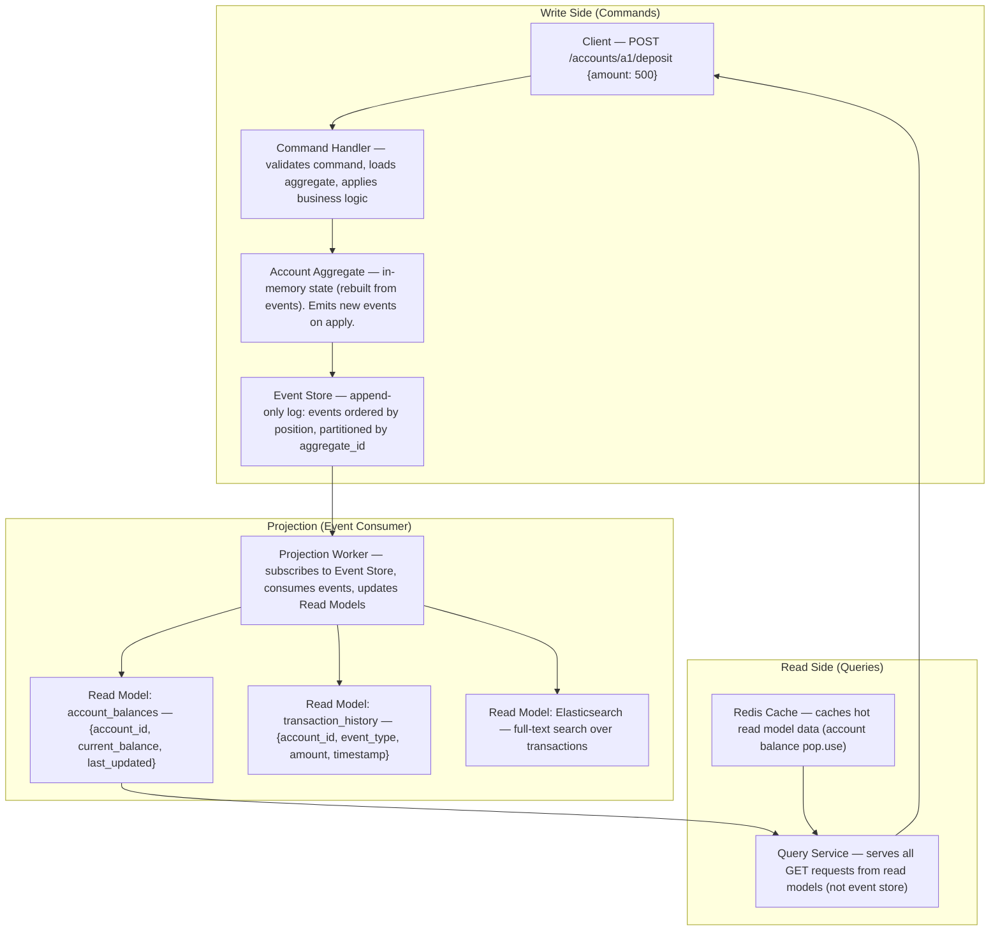
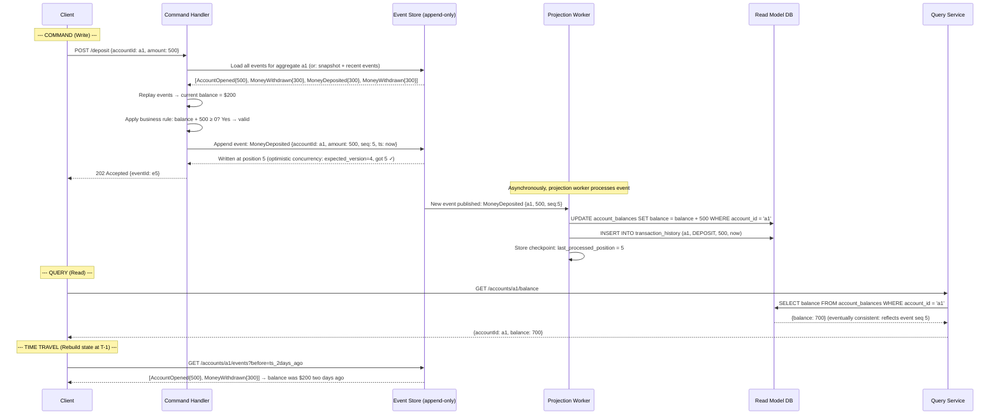
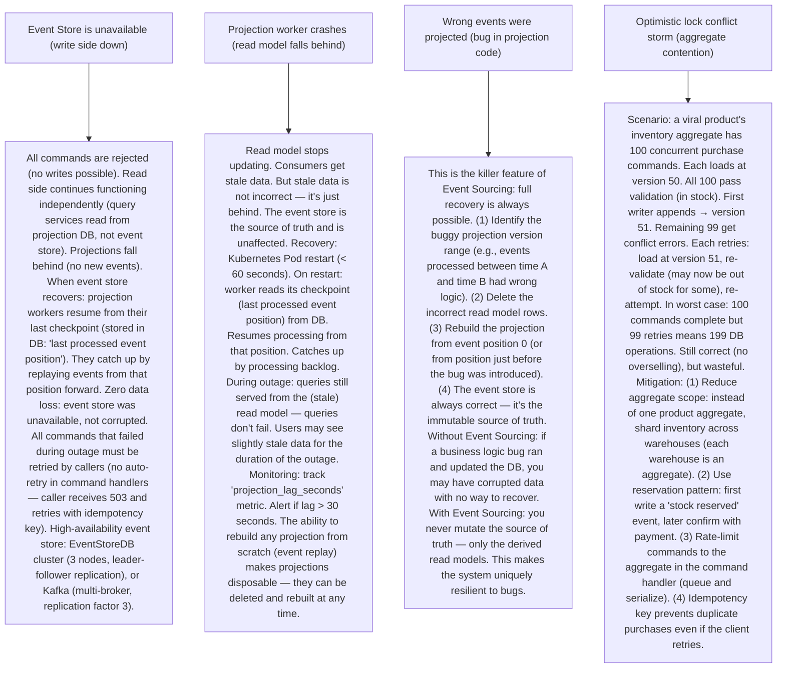

# P1 — Event Sourcing & CQRS (like Axon Framework, EventStore)

---

## ELI5 — What Is This?

> Normal databases remember only the current state: "Alice has $200."
> Event Sourcing is different: it remembers every event that ever happened.
> "Alice deposited $500. Alice withdrew $300. Alice deposited $300. Alice withdrew $300."
> To know Alice's balance: replay all events → $200. The event log IS the database.
> CQRS (Command Query Responsibility Segregation) takes it further: the part of
> your system that handles writes (commands: "deposit $50") and the part that
> handles reads (queries: "what's my balance?") are completely separate systems,
> each optimized for their purpose. Together, they enable time travel
> (rebuild state at any point in history), audit trails, and extreme read scalability.

---

## Glossary (Every Keyword Explained in ELI5)

| Word | ELI5 Meaning |
|---|---|
| **Event** | An immutable fact that happened in the past. `MoneyDeposited {accountId: a1, amount: 500, timestamp: T}`. Events are never deleted or modified — only appended. Past tense naming is a key indicator. |
| **Event Store** | An append-only database that stores all events, ordered by time. The source of truth. Example: EventStoreDB, Kafka (as durable log), or a PostgreSQL table with `event_id, aggregate_id, event_type, payload, created_at`. |
| **Aggregate** | A cluster of domain objects treated as a single unit of consistency. An `Account` aggregate handles: deposit, withdraw, close. All events for one aggregate have a unique `aggregate_id`. Events are guaranteed consistent within one aggregate. |
| **Command** | An intent to change state. `DepositMoney {accountId: a1, amount: 500}`. Commands can be rejected (insufficient funds). Commands produce Events on success. Write-side of CQRS. |
| **Query** | A read-only request for current state. `GetAccountBalance {accountId: a1}`. Served from a Read Model (optimized for fast reads). Read-side of CQRS. Never changes state. |
| **Projection** | A derived read model built by consuming events. Example: a table `account_balances {account_id, current_balance}` that's updated by replaying `MoneyDeposited` and `MoneyWithdrawn` events. One event stream can produce multiple projections (for different read use cases). |
| **Replay** | Re-processing all events from the beginning to rebuild state. Used to: recover from bugs, build new projections, migrate to new data models. "Time travel": replay events up to a specific timestamp. |
| **Snapshot** | A periodic checkpoint of aggregate state to avoid replaying thousands of events on every read. Store the aggregate's full state at event #1000. On load: start from snapshot + replay only events #1001 onward. |
| **Eventual Consistency** | After a command updates the event store, the read model (projection) is updated asynchronously. There's a brief window (milliseconds to seconds) where the read model is behind. Queries during this window return slightly stale data. |
| **Idempotency Key** | When an event is processed, the processor must be idempotent: processing the same event twice produces the same result as processing it once. Required because events may be delivered more than once (at-least-once delivery). |

---

## Component Diagram

---

## Step-by-Step Request Flow

---

## Bottlenecks — Every Point Explained

| # | Bottleneck | Why It Hurts | Fix |
|---|---|---|---|
| 1 | **Long event streams slow aggregate load** | Account a1 has 50,000 events over 10 years. Every command requires replaying all 50,000 events to get current state. At 0.1ms per event: 5 seconds to load aggregate. Unacceptable for a deposit operation. | Snapshots: after every N events (e.g., 100), persist a snapshot of the full aggregate state. On load: fetch the latest snapshot + only events after the snapshot sequence number. 50,000 events with snapshots every 100: load snapshot (1 DB query) + replay last ≤ 100 events = sub-millisecond aggregate load. Snapshot storage: serialized aggregate state stored alongside events in the event store (or a separate snapshot table). Example: `AccountSnapshot {aggregate_id: a1, seq_number: 49900, state: {balance: 700, status: ACTIVE}}`. |
| 2 | **Projection lag — read model temporarily stale** | After a command appends an event, the projection worker asynchronously updates the read model. If projection worker is slow or has lag: a user deposits money, immediately checks balance — still sees old balance. Confusing UX. | Read-your-writes pattern: (1) Return the event `sequence_number` to the caller in the command response. (2) Query service accepts an optional `min_event_seq` parameter. If the read model hasn't processed up to `min_event_seq` yet: query waits (with timeout) for the projection to catch up. (3) Alternatively: for time-critical reads, query the event store directly (strongly consistent but slower). (4) Cache invalidation: when a command completes, invalidate the read model cache for that aggregate — next read forces a fresh DB read (may still be stale by milliseconds, but usually projection catches up). Typical lag in same datacenter: < 100ms. Perceptible stale reads are rare. |
| 3 | **Optimistic concurrency conflicts** | Two concurrent commands on the same aggregate: command A loads aggregate at version 5, command B loads aggregate at version 5. Both pass validation, both try to append to the event store at version 5. Second writer gets a conflict error. For high-contention aggregates (a shared game score being updated by many players simultaneously): many conflicts and retries. | Optimistic locking in event store: `INSERT INTO events ... WHERE (SELECT MAX(seq) FROM events WHERE aggregate_id='a1') = expected_version`. If another event was appended: constraint fails, return conflict. Command handler retries: reload aggregate (now at version 6), re-apply business rules, re-attempt write. For high-contention: aggregate partitioning (each player has their own score aggregate) or batching (aggregate commands at 100ms intervals, apply once). For financial systems: bank accounts rarely have concurrent conflicting writes (one person's account). For leaderboards: shard the leaderboard aggregate by player. |
| 4 | **Event schema evolution — can't change old events** | Events are immutable. You stored `MoneyDeposited {amount, currency}` for 5 years. Now you want to add `merchant` field. Old events don't have `merchant`. New code must handle both old and new event schemas. As the system evolves, there may be 15 different versions of the same event type — each projection must handle all versions. | Upcasting (version transformation): when reading old events, transform them to the current schema. `MoneyDepositedV1 {amount: 500}` → `MoneyDepositedV2 {amount: 500, merchant: null}`. Apply upcaster before aggregate event replay. Projections receive the latest version. Implementation: event type + version field in stored events. Registry of upcasters: `V1→V2`, `V2→V3`. Applied in chain when reading. Never modify stored events — add upcasters. Schema registry (Confluent) for Kafka-backed event stores: enforces backward-compatible schema evolution. |
| 5 | **Event store becomes a bottleneck for projections** | If there are 20 different projections (account_balances, transaction_history, search index, fraud signals, analytics, etc.) each polling the event store for new events: 20 concurrent reads on the event store with high fan-out. Event store becomes a read bottleneck for projection workers. | Fan-out via message broker: append to event store (source of truth) + publish to Kafka topic simultaneously. Projection workers consume from Kafka (horizontally scalable, partitioned). Kafka retains events (configurable TTL or infinite) — all existing and new projections read from Kafka without touching the event store. Event store is only accessed for: aggregate load (write path) and time-travel queries. Message outbox pattern: within the same DB transaction as the event insert, insert into an outbox table. A relay process reads the outbox and publishes to Kafka (ensures exactly-once publish without distributed transaction). |
| 6 | **Rebuild projection without downtime** | A bug in the projection code produces wrong balances. You fix the bug and need to rebuild the `account_balances` projection from scratch. If the event store has 5 years of events: replay takes hours. During replay: read model has stale/incorrect data. | Shadow rebuild: (1) Spin up a new empty projection table (v2). (2) Start the projection worker reading from event position 0, writing to table v2. (3) Original table v1 continues serving reads from the current (buggy) worker. (4) When v2 worker catches up to present: atomic rename (`account_balances_v2` → `account_balances`). (5) Kill v1 worker. Zero downtime rebuild: users always served from a valid projection. Time to rebuild: bounded by replay throughput. Optimize: batch event reads (read 1000 events at a time), parallelized replay (split by aggregate_id into parallel workers). |

---

## What Happens When Each Part Fails?

---

## Key Numbers to Know

| Metric | Value |
|---|---|
| Snapshot interval (typical) | Every 50–500 events per aggregate |
| Projection replay speed (EventStoreDB) | 100K–1M events/second (bulk read) |
| Projection lag (healthy system) | < 100ms (same datacenter) |
| Event payload size (typical) | 100 bytes – 10 KB per event |
| Optimistic concurrency retry window | < 5 retries for non-contended aggregates |
| Event store write throughput (Kafka backend) | Millions of events/second |
| Read model query latency | < 5ms (from optimized projection DB) |

---

## How All Components Work Together (The Full Story)

Event Sourcing and CQRS solve a core tension in traditional CRUD systems: state mutation loses history, and single-model databases are a compromise between read and write optimization.

**The write side (Command → Event → Event Store):**
A Command expresses intent. The Command Handler loads the Aggregate by replaying its past events from the Event Store (or from a snapshot). The Aggregate's business logic validates whether the command can succeed (sufficient balance? valid state?). If valid: the Aggregate emits new Domain Events. These events are appended to the Event Store (append-only, immutable). The write path is complete. The Aggregate's current "state" is never stored — it's always derived from the event log.

**The read side (Events → Projections → Query):**
Events flow from the Event Store to Projection Workers (via Kafka or direct subscription). Each Projection Worker maintains a different read model — a denormalized, query-optimized view. The `account_balances` projection might be a simple table. The `transaction_history` projection might be paginated rows. A `fraud_signals` projection might be a specialized ML feature store. Many projections, one source of events. The Query Service reads only from these read models — never from the event store.

**The superpower — time travel and replay:**
Because every state change is captured as an immutable event, you can reconstruct the state of any aggregate at any point in time: just replay events up to that timestamp. New business requirements? Build a new projection by replaying all historical events. Bug in projection logic? Rebuild from scratch. Regulatory audit trail? The event log is the audit log.

> **ELI5 Summary:** Traditional DB is a whiteboard that gets erased and rewritten. Event Sourcing is a notebook where you only add lines, never erase. To know what's on the whiteboard: read all lines. CQRS says: use a separate whiteboard (read model) that the projection automatically keeps updated — so queries are always fast. If the whiteboard is wrong: erase it and replay the notebook to redraw it. The notebook (event store) is always correct.

---

## Key Trade-offs

| Decision | Option A | Option B | Why |
|---|---|---|---|
| **Traditional CRUD DB vs Event Sourcing** | CRUD: simple, any developer understands it well. State stored directly. No replay overhead. Lower operational complexity. | Event Sourcing: full audit trail, time travel, replay, decoupled projections. Higher complexity. Event schema evolution challenges. | **Event Sourcing for domains with audit requirements, complex business logic, or need for temporal queries**: banking, healthcare, e-commerce order history, gaming. **CRUD for simple CRUD apps**: user profile service, configuration stores, content management. Don't add Event Sourcing as a default — it adds significant complexity that must be justified by domain requirements. |
| **Pull-based projection (poll event store) vs Push-based (Kafka subscription)** | Pull: projection worker polls event store periodically. Simple. Event store must support efficient pagination by position. | Push: events published to Kafka. Projection workers are Kafka consumers. More infrastructure. Guaranteed delivery. | **Kafka for production-scale ES systems**: guaranteed delivery, replay from any offset, horizontal scaling (multiple partition → multiple consumer workers). Multiple projections each get their own consumer group — full independence. Pull works for low-volume systems (< 10K events/day) where simplicity matters more. |
| **CQRS without Event Sourcing vs ES+CQRS together** | CQRS alone: separate read and write models but store current state normally (no event log). Projections are maintained synchronously via DB triggers or dual-write. | ES + CQRS: event log is the source of truth, projections are derived. Full replayability. | **CQRS without ES**: useful when read/write models need different schemas but full event history is not required. Simpler than full ES. Good for search: write to PostgreSQL, sync to Elasticsearch. **ES + CQRS**: when you need full auditability or time travel. The two are independent patterns that work well together but don't require each other. Start with CQRS-only, add ES if audit requirements emerge. |

---

## Important Cross Questions

**Q1. How do you handle the case where an event was published to Kafka but the DB insert to the event store failed?**
> The Outbox Pattern solves this (see P5). All-or-nothing: within a single DB transaction, both insert the event to the `events` table AND insert to an `outbox` table. Transaction commits → both inserts are durable. A separate relay process reads the outbox, publishes to Kafka, marks as published. The event store insert and Kafka publish are never done in separate transactions. Without Outbox: if DB insert succeeds but Kafka publish fails → event is in DB but not in Kafka → some projections never see it. The outbox makes this atomic without a distributed transaction (2PC).

**Q2. What is "versioning" in an aggregate and why does it matter?**
> Each aggregate has a `current_version` (the sequence number of the last event applied). When appending a new event: specify the `expected_version`. The DB insert includes `WHERE current_version = expected_version`. If another writer already appended a new event (incrementing version): the `WHERE` clause fails → optimistic concurrency conflict → caller retries. This is the mechanism that prevents two commands from both seeing version 5 and both succeeding in appending — only the first one succeeds. The second must reload the aggregate at the new version (e.g., 6), re-apply business logic (which may now reject the command if, say, the account was closed by the first command), and retry.

**Q3. How does CQRS help with performance scaling?**
> CQRS separates reads and writes into independent systems, each scalable independently. Write side is typically single-threaded per aggregate (one aggregate at a time via optimistic locking) but horizontally scalable across aggregates. Read side is stateless query services backed by read-optimized databases: relational for filtering/sorting, Redis for hot key lookups, Elasticsearch for full-text search. Read traffic (typically 10-100x write traffic) hits the read models — never the event store. The event store only handles: write commits + aggregate loads (aggregate-scoped, short). Read models are pre-denormalized for specific query patterns (no joins at query time). Read services autoscale horizontally with no coordination. This is why CQRS + Event Sourcing is favored for high-traffic systems: reads and writes don't contend for the same resources.

**Q4. Explain how to implement a "saga" that spans multiple aggregates using Event Sourcing.**
> Cross-aggregate operations use the Saga (or Process Manager) pattern. Example: transfer money from Account A to Account B. Two aggregates — must keep them consistent. Without a distributed transaction: (1) Command: `TransferMoney {from: A, to: B, amount: 100}`. (2) Saga starts: listens for events from both aggregates. (3) Emit: `MoneyWithdrawn {account: A, amount: 100, transferId: t1}`. (4) Saga receives `MoneyWithdrawn` → emit command: `DepositMoney {account: B, amount: 100, transferId: t1}`. (5) B emits: `MoneyDeposited {account: B, amount: 100}`. (6) Saga sees both events → marks saga `TransferComplete`. Compensation: if step 5 fails (B is closed) → Saga emits `RefundDeposit {account: A, amount: 100}` → A's balance restored. The Saga is itself an aggregate (stores saga state as events: `SagaStarted`, `WithdrawCompleted`, `DepositCompleted`, `SagaFailed`). The saga coordinates without a distributed transaction.

**Q5. What is a "competing consumers" problem in event projection and how do you solve it?**
> If multiple projection worker instances consume events from the same stream/topic without coordination: multiple workers process the same event, producing duplicate writes to the read model. Example: event `MoneyDeposited {amount: 500}` processed twice → balance increases by 1000 instead of 500. Solutions: (1) Kafka consumer groups: each consumer group processes each partition once. One worker per partition (or Kafka handles fanout across consumers in the group — each message processed exactly once within the group). (2) Idempotent projection writes: projection worker uses `INSERT ... ON CONFLICT DO UPDATE` (PostgreSQL) or `MERGE` — processing the same event twice produces the same result. Store the event's `sequence_number` in the read model row: `UPDATE balance SET amount = balance + 500, last_seq = 5 WHERE account_id = 'a1' AND last_seq < 5`. The condition `last_seq < 5` prevents double-processing. (3) Exactly-once semantics: Kafka transactions + idempotent DB writes.

**Q6. How do you migrate from a traditional CRUD system to Event Sourcing?**
> Incremental migration (Strangler Fig approach): (1) Create the event store schema alongside the existing CRUD tables. (2) For new commands on migrated aggregates: write to event store (source of truth) AND sync back to legacy CRUD tables (compatibility layer for existing read code). (3) Migrate read code to use new projections (from event store) instead of legacy tables — one projection at a time. (4) Once all reads use projections: remove the legacy CRUD sync. (5) Populate event store with historical events: use current CRUD data to synthesize "initial state" events (`AccountInitialized {balance: 700}` from today's data). Not a true history (no historical events before migration) but enables temporal queries going forward. Lesson: Event Sourcing migration is a major architectural change. Don't migrate for the sake of it. Migrate gradually, prove value in one domain first.

---

## Real-World Apps That Use This Pattern

| Company | Product | How They Use It |
|---|---|---|
| **Axon Framework / AxonIQ** | EventStore + CQRS Framework (Java) | Leading Java framework for ES+CQRS. Used by banks, insurance companies, logistics (ING Bank, Rabobank). Provides: command bus, event bus, aggregate management, saga support, projections. EventStoreDB: purpose-built event store database. Handles millions of events/day per aggregate. |
| **Microsoft** | Azure Cosmos DB (Change Feed) | Cosmos DB's Change Feed is an event stream of all changes to a container. Used to build projections and event-driven pipelines. Microsoft uses ES internally for key services. CQRS is explicitly recommended in Azure Architecture Center for microservice data management. |
| **Walmart** | Order Management System | Walmart's order management uses Event Sourcing for the full order lifecycle (placed → paid → allocated → shipped → delivered). Full event log provides the audit trail for returns, disputes, and legal compliance. Projections power different views: warehouse picker view, customer tracking view, finance reconciliation view. |
| **Confluent / Kafka** | Kafka Log Compaction | Kafka's log is essentially an event store. Log compaction retains the latest value per key (materializing state). The Kafka Streams library enables building CQRS-style systems: stream of events → KTable (materialized read model). Kafka Connect syncs event streams to external systems (projections to Elasticsearch, PostgreSQL). Event Sourcing with Kafka as the backbone is a mainstream microservices pattern. |
| **Greg Young / EventStore** | EventStoreDB | Greg Young coined "Event Sourcing" and co-created CQRS. EventStoreDB: purpose-built immutable event log database with built-in projections (server-side projections in JavaScript). Used for DDD (Domain-Driven Design) implementations. His 2010 talks and papers defined the modern understanding of the pattern. |
