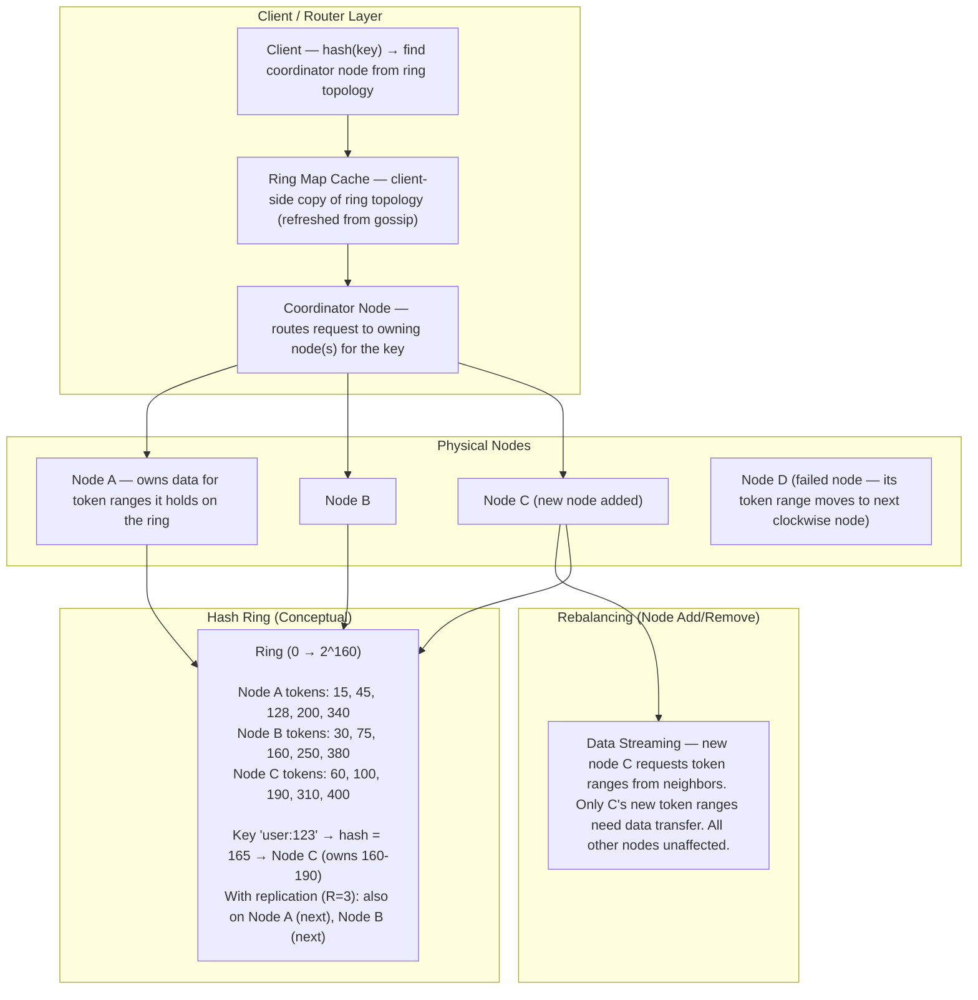
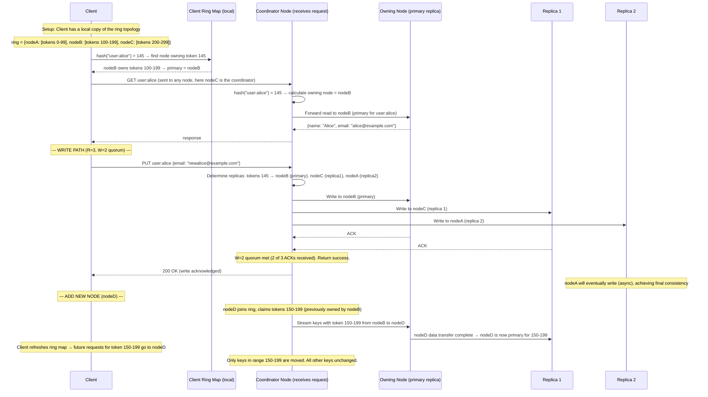
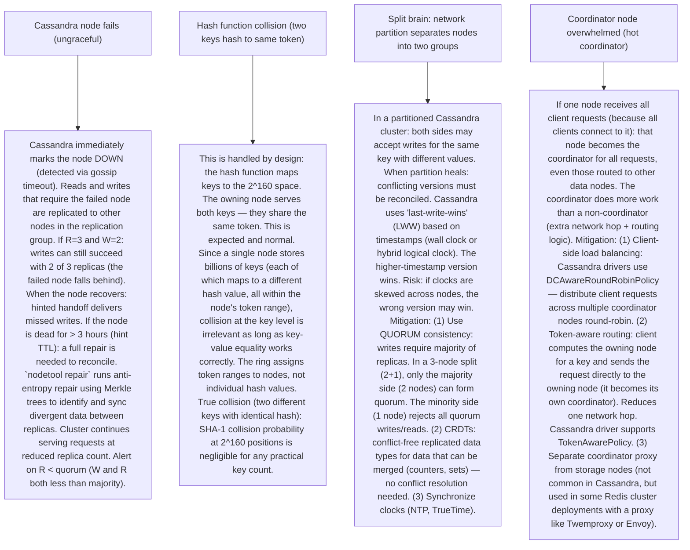

# P2 — Consistent Hashing (like DynamoDB, Cassandra, Redis Cluster)

---

## ELI5 — What Is This?

> Imagine 5 waiters serving tables at a restaurant. Tables are assigned:
> table 1 → waiter 1, tables 2 → waiter 2, etc.
> If waiter 3 quits, you re-assign ALL tables to remaining waiters — chaos!
> Everyone had to re-learn their section.
> Consistent Hashing is a smarter assignment: arrange all waiters and tables
> on a circle (like a clock). Each table goes to the nearest waiter in the
> clockwise direction. If waiter 3 leaves: only the tables that were
> assigned to waiter 3 need to be reassigned — everyone else keeps theirs.
> This is why distributed databases (like DynamoDB, Cassandra, Redis Cluster)
> use consistent hashing: adding or removing servers only affects a small
> fraction of data, not everything.

---

## Glossary (Every Keyword Explained in ELI5)

| Word | ELI5 Meaning |
|---|---|
| **Hash Ring** | A virtual circle from 0 to 2^160 (or 2^32). Every server and every key is placed on this circle using a hash function. Keys "belong to" the first server encountered going clockwise. |
| **Virtual Nodes (vnodes)** | Instead of placing each server once on the ring (potentially uneven distribution), each server is placed N times at different ring positions (100–256 points per server). This creates even load distribution even with few servers. |
| **Replication Factor** | Each key is stored on R consecutive servers clockwise on the ring. If R=3 and server A is primary: the key is also copied to servers B and C. Data survives up to R-1 server failures. |
| **Token** | A position (number) on the hash ring. Each server owns a range of tokens. The server that "owns" a token is responsible for keys that hash to that token range. |
| **Hotspot** | When one server receives disproportionately more traffic than others. Can happen if key distribution is uneven or popular keys all hash to the same server. Virtual nodes help with distribution. Shard-level metrics help with detection. |
| **Consistent Hashing** | A hashing scheme where adding or removing a node only requires remapping K/N keys (K = total keys, N = number of nodes). Standard modular hashing (`hash(key) % N`) remaps nearly all keys when N changes. |
| **Gossip Protocol** | How distributed database nodes (like Cassandra) share knowledge of ring topology: which nodes are alive, which own which token ranges. Each node periodically gossips its state to a few random peers. Eventually, all nodes learn the full topology. No central coordinator needed. |
| **Coordinator Node** | In Cassandra: the node that receives a client request becomes the coordinator. It uses the hash ring to find which node(s) own the key, then routes the request to them (even if the owning node is different from the coordinator). |
| **Rendezvous Hashing (HRW)** | An alternative to hash ring: for each key, compute `hash(key + server)` for all N servers. Assign key to the server with the highest hash score. On node removal: only keys that were assigned to the removed node need reassignment. No ring structure needed but O(N) per lookup (check all servers). Used in Content Delivery Networks. |
| **Jump Consistent Hash** | Google's algorithm (2014): assigns keys to N buckets consistently. Adding a bucket only moves ~1/N keys. O(log N) computation. Doesn't support heterogeneous node weights. Used in internal Google systems and Elasticsearch-like shard assignment. |

---

## Component Diagram

---

## Step-by-Step Request Flow

---

## Bottlenecks — Every Point Explained

| # | Bottleneck | Why It Hurts | Fix |
|---|---|---|---|
| 1 | **Uneven load distribution with few nodes** | With 3 physical nodes placed at 3 ring positions: node A might own 40% of the keyspace, node B 35%, node C 25% (depends on hash function randomness at 3 points). Uneven distribution = hot nodes. One node handles much more traffic than others. | Virtual nodes (vnodes): each physical node is assigned 100–256 random positions on the ring. Average: each node owns ~1/N of the ring. With 100 vnodes per node: variance is < 5% across nodes in practice. Cassandra default: 256 vnodes per node. The more vnodes: the smoother the distribution, but also more inter-node data transfer during node addition (more ranges need re-assignment). |
| 2 | **Node addition triggers large data transfer** | Adding a new node to a Cassandra cluster: the new node needs to receive data for the token ranges it claims. With R=3 (replication factor 3) and N=100 nodes: each node addition moves ~3/100 = 3% of total data. For a 10TB cluster: 300GB of data transfer. This is a sustained network and disk I/O burden on neighboring nodes during bootstrapping. | Throttled streaming: Cassandra's bootstrap process throttles the data transfer rate (configurable: `stream_throughput_outbound_megabits_per_sec`). This prevents bootstrap from saturating neighbors' network. Background: bootstrap runs over hours, not required to complete instantly. Pre-allocate tokens: some systems pre-assign token ranges before a node starts receiving traffic (reducing the operational window of imbalance). In AWS DynamoDB: the service manages node additions transparently; users don't directly administer token ranges. |
| 3 | **Hot key (celebrity key problem)** | Consistent hashing distributes keys evenly across nodes. But if one key (`product:viral_item`) receives 1 million reads/second, the node owning that key is overwhelmed — regardless of how well keys are distributed overall. The distribution algorithm doesn't see request rates, only key count. | Application-level caching: put a caching layer (Redis, Memcached) in front of the database. Hot keys hit the cache, not the underlying node. CDN for static hot content. Read replicas: for the hot key's partition/token range, add more replicas. Route reads to any of the R replicas (expand read fan-out). Key splitting: append a random suffix (`product:viral_item:0` through `:99`) and aggregate reads. Clients pick a random replica on each read. |
| 4 | **Node failure causes rebalancing storm** | When a node fails (ungraceful): Cassandra marks it DOWN. Its token ranges' data becomes less replicated (was R=3, now effective R=2). To restore R=3: surviving nodes must copy data to repair the missing replica. For a large node: this triggers a lot of I/O and network traffic. If multiple nodes fail simultaneously (correlated failures in same AZ): repair storm + potentially R=1 for some ranges. | Replication factor tuning: R=3 provides 2-node-failure tolerance before data loss risk. Spread replicas across failure domains: in Cassandra's `NetworkTopologyStrategy`, place each replica in a different rack/AZ. A single AZ failure → R=2 replicas remain in other AZs. Hinted handoff: when node B is temporarily down, node C stores hints (queued writes) for B. When B recovers: C delivers hints. Prevents data divergence during brief outages without triggering a full repair. |
| 5 | **Stale ring map in clients** | Clients cache the ring topology locally. When nodes are added/removed: clients with stale ring maps route requests to the wrong node. The wrong node must then forward (adds latency) or return an error. If a node is removed and the client still routes to it: requests fail until the client refreshes the ring map. | Automatic ring map refresh: Cassandra driver refreshes the ring map from any live node on configurable intervals (default: 1 minute). Event-driven refresh: when the driver detects a topology change (via gossip event from the node it's connected to): immediately refresh. Fallback forwarding: the node receiving a misrouted request (due to stale client ring map) can forward to the correct node transparently (at extra latency cost). The client learns of the re-route and updates its map. |

---

## What Happens When Each Part Fails?

---

## Key Numbers to Know

| Metric | Value |
|---|---|
| Hash ring size (SHA-1 based) | 2^160 positions (Cassandra) |
| Hash ring size (MD5 based) | 2^128 positions |
| Default vnodes per Cassandra node | 256 |
| Typical replication factor | 3 (survives 2-node failure) |
| Quorum for R=3 | W + R > R → W=2, R=2 sufficient |
| Keys remapped when adding 1 node to N=10 | ~10% (1/N) vs 100% in modular hashing |
| Cassandra gossip convergence time | ~1 second (cluster of 100 nodes) |
| DynamoDB consistent hashing transparency | Fully managed (users don't administer tokens) |

---

## How All Components Work Together (The Full Story)

Consistent hashing solves the "resharding problem" — how to distribute data across N servers when N can change without disrupting the entire cluster.

**The fundamental problem with modular hashing:**
`shard = hash(key) % N`. Works fine when N is fixed. When N changes (add/remove server): almost every key maps to a different shard. A 3-to-4 server upgrade requires moving ~75% of all data. In production: this causes a thundering herd (massive data transfer + I/O from all nodes simultaneously). For a database that must stay online: modular hashing doesn't work.

**The consistent hashing solution:**
Place both servers and keys on a ring. Each key is "owned" by the first server clockwise from its position. When a server is added: only the keys between the new server and the previous server clockwise are affected. For N=10 → N=11: ~1/11 = 9% of keys move. When a server is removed: only the keys it owned move to the next server. Everything else is undisturbed.

**Replication on the ring:**
For fault tolerance: a key is stored on the R next servers clockwise from its primary position. This ensures the key survives R-1 server failures. In Cassandra: the coordinator for a write sends to the R replica nodes and waits for W acknowledgments before confirming success. R and W are tunable per query (balancing consistency vs availability per the CAP theorem).

> **ELI5 Summary:** Think of ring as a circular street with mailboxes (keys) and houses (servers). Each mail goes to the nearest house clockwise. When a new house is built on the street, only the mailboxes between it and the previous house need to be rerouted. Every other house keeps its mail. Virtual nodes (vnodes) = each house has multiple addresses on the street so the delivery load is balanced evenly.

---

## Key Trade-offs

| Decision | Option A | Option B | Why |
|---|---|---|---|
| **Few vnodes (low overhead) vs many vnodes (even distribution)** | Few vnodes (16): less metadata per node, less coordination overhead when nodes join/leave. Possibly uneven distribution with < 20 physical nodes. | Many vnodes (256): near-perfect load distribution. More token ranges per node → more inter-node data transfer during node changes. Higher metadata overhead. | **256 vnodes is Cassandra default**: at scale (50+ nodes), the distribution improvement from more vnodes outweighs the coordination cost. For small clusters (3-5 nodes): consider fewer vnodes (32-64) to reduce bootstrap complexity. AWS DynamoDB manages tokens internally — users don't configure vnodes. |
| **Strong consistency (quorum reads/writes) vs eventual consistency** | Strong: W + R > RF. Every read sees the last write. Higher latency (must wait for quorum). | Eventual: W=1 or R=1. Highest throughput, lowest latency. Reads may return stale data. | **Use case determines**: for financial accounts, inventory (must not oversell): quorum or strong consistency. For social feeds, view counts, session data: eventual consistency is acceptable and much faster. Cassandra's tunable consistency is the key feature: choose per-request. Amazon DynamoDB: strong consistency option available (+higher read cost). |
| **Consistent hashing (ring) vs range-based sharding** | Consistent hashing: random key distribution across nodes. No range queries across shards possible. Easy to add/remove nodes. | Range-based sharding: keys sorted by range (like Google Bigtable/HBase). Range scans efficient. Harder to rebalance (hot range = hot shard). | **Consistent hashing for KV stores** where you access by exact key (user profiles, session data): no range scans needed, easy scaling. **Range sharding for time-series or sequential access**: you want all events from user A in time order on the same shard for efficient range scans. HBase, BigTable, CockroachDB use range-based sharding. Cassandra uses consistent hashing but supports ordered partition keys within a partition for time-range scans within a single partition. |

---

## Important Cross Questions

**Q1. Why does adding a new node to a consistent hash ring only move ~1/N keys?**
> Mathematical proof: assume N nodes currently on a ring, uniformly distributing 1/N of keys each. Adding 1 new node: it claims a token position somewhere on the ring. The new node takes over the keys between its new position and the previous node in the clockwise direction. The length of that arc = 1/(N+1) of the ring (statistically on average, since all positions are random). So (new arc length) / (total ring) = 1/(N+1) of keys move. N=10, add 1: 1/11 ≈ 9% of keys move. With virtual nodes: the new node is placed at M positions, each claiming ~1/(N+1) × M tokens. The total keys moved is still ~1/(N+1) of all keys — just spread across M token ranges instead of one. Contrast: in modular hash `% N`, changing N from 10 to 11 changes the bucket for every key where `hash(key) % 10 ≠ hash(key) % 11`, which is ~(N-1)/N = 90% of keys.

**Q2. How does Cassandra use consistent hashing under the hood?**
> Cassandra assigns each node a set of "tokens" (128-bit integers) using the Murmur3 hash function. The partition key of each row is hashed via Murmur3 to a 128-bit value. The row is stored on the node(s) whose token range includes that hash value. In Cassandra 3.x: virtual nodes (vnodes) — each node has 256 tokens assigned randomly (by default). Node topology is stored in `system.local` and `system.peers` system tables. Gossip propagation: every node gossips its token ranges to other nodes periodically. The gossip protocol converges: within seconds, all nodes know all token ranges. A driver (Python, Java) maintains a local copy of this topology and computes the owning node for any partition key without asking Cassandra: `TokenAwarePolicy` makes the driver compute the coordinator directly. This eliminates an extra network hop vs sending to any random coordinator that then forwards.

**Q3. How does DynamoDB implement consistent hashing?**
> AWS DynamoDB uses consistent hashing internally but abstracts it away from users completely. Key details (from published papers): (1) Tables are partitioned into key ranges. Each partition is stored on multiple nodes (physical servers) with automatic replication. (2) The partition key is hashed to determine the responsible partition. (3) When a partition grows (hot or large): DynamoDB automatically splits it and rebalances. (4) Users see none of this — they just define a table with a partition key. (5) DynamoDB uses "Virtual Partitions" — multiple partitions per physical node, similar to vnodes. (6) Adaptive capacity (introduced 2019): DynamoDB automatically boosts capacity of hot partitions for a short period to absorb spikes, then rebalances if the pattern continues. (7) Users control: maximum read/write throughput (RCU/WCU) per table, not ring topology. This is the fully-managed value proposition.

**Q4. What is the difference between consistent hashing and rendezvous hashing?**
> Rendezvous hashing (HRW — Highest Random Weight): for each (key, server) pair, compute a hash `h(key, server)`. The key is assigned to the server with the highest hash score. On node removal: keys assigned to that node recompute `argmax h(key, server)` over remaining servers. No ring structure needed. Comparison: (1) Consistent hashing: O(log N) lookup (binary search on ring token ranges). Supports vnodes for load balancing. Ring data structure requires coordination protocol for topology propagation. (2) Rendezvous hashing: O(N) lookup (must evaluate all N servers). Good when N is small (< 100). Simpler code — no ring to maintain. Used in CDNs (find the best cache server for a URL among N edge nodes). (3) For databases (N = thousands of shards): consistent hashing wins (O(log N)). For CDN edge selection (N = 20 edge nodes): rendezvous hashing is simpler. Jump consistent hash (Google): O(log N), but doesn't support arbitrary node weights or removal of non-last nodes.

**Q5. Explain how replication with consistent hashing handles a node failure.**
> Scenario: R=3, nodes A, B, C in a replication group for key K (A=primary, B=replica1, C=replica2). Node B fails. (1) Writes: coordinator sends to A, B, C. B is unreachable. With W=2: A and C acknowledge → write succeeds. Coordinator stores a "hint" for B (the write that B missed). When B recovers: hinted handoff delivers the hint. (2) Reads: coordinator sends to A, B, C. With R=2: A and C reply → read succeeds. No data loss, no unavailability. (3) If B is permanently dead: `nodetool removenode` removes it from the ring. Its token ranges move to the next clockwise node (D). D now becomes a new replica for the data. The coordinator detects < R replicas for the affected ranges and initiates a repair: streams data from A or C to D to restore R=3. (4) During streaming: the affected ranges are temporarily at R=2 (degraded but available). Monitoring: track replica count below RF as an alert condition.

**Q6. How does a distributed cache (Redis Cluster) use consistent hashing?**
> Redis Cluster uses a slightly different approach: 16,384 hash slots (not a full consistent hash ring). `HASH_SLOT = CRC16(key) % 16384`. Each node owns a contiguous range of slots. Adding a node: manually or automatically migrate some slots to the new node. Client learns slot-to-node mapping by sending `CLUSTER INFO` / `CLUSTER NODES` commands. If a client asks a node for a key that belongs to a different slot: the node returns a MOVED redirect. The client caches this mapping. This is "cluster-aware routing" in Redis clients. Hash tags: `{user:alice:profile}` and `{user:alice:session}` — the `{user:alice}` part is used for hashing (not the full key). Ensures these keys are on the same slot. Enables multi-key operations (MGET, transactions) as long as all keys share the same hash tag. Redis Cluster is conceptually simpler than consistent hashing (discrete slots) but achieves the same goal: minimal key remapping when cluster topology changes.

---

## Real-World Apps That Use This Pattern

| Company | Product | How They Use It |
|---|---|---|
| **Amazon** | DynamoDB | Consistent hashing for automatic key distribution across physical partitions. Fully managed — users never interact with the ring. Adaptive capacity handles temporary hot partitions. The foundational Dynamo paper (2007) by DeCandia et al. defined consistent hashing + virtual nodes as the standard approach for distributed databases. |
| **Apache** | Cassandra | Token-based ring with Murmur3 hashing. Virtual nodes (vnodes). NetworkTopologyStrategy for rack/AZ-aware replica placement. Used by Netflix (100TB+ production), Apple (iCloud, 300K+ nodes peak), Facebook (Messenger), Instagram. gossip-based topology propagation. The reference implementation of consistent hashing for open-source distributed databases. |
| **Redis** | Redis Cluster | 16,384 hash slots, slot-range ownership per node. MOVED redirects for misrouted keys. Hash tags for co-location. Used for distributed caching at Twitter, GitHub, Airbnb, Snapchat. Twemproxy (proxy for Redis/Memcached): consistent hashing across a pool of Redis nodes, transparent to the application. |
| **Akamai** | CDN Edge Server Selection | Rendezvous hashing to select which edge cache server serves a given URL. Each URL consistently maps to the same edge server (maximizes cache hit rate). On edge server failure: only URLs mapping to that server need to be served elsewhere. Edge analytics can use the consistent mapping to aggregate per-URL stats efficiently. |
| **Nginx / HAProxy** | Load Balancer Consistent Hashing | `upstream` consistent-hash directive. `hash $request_uri consistent` — requests for the same URL go to the same backend server (for cache locality or sticky sessions). Adding/removing backends only redirects ~1/N requests. Used for origin server selection in reverse proxies. |
